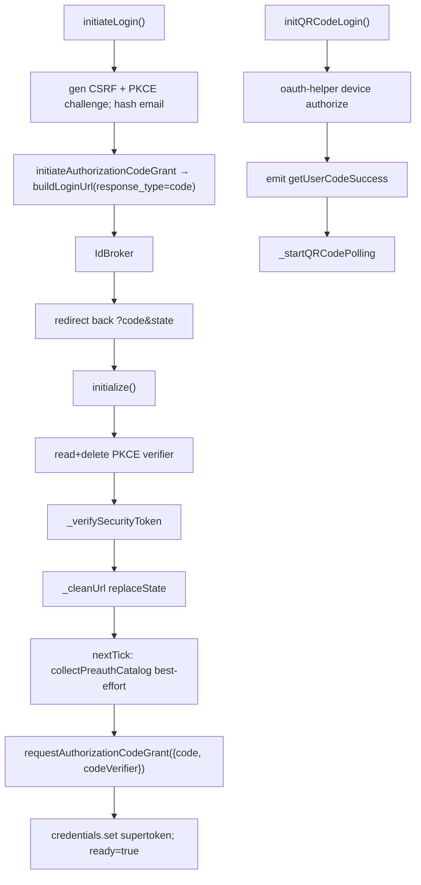
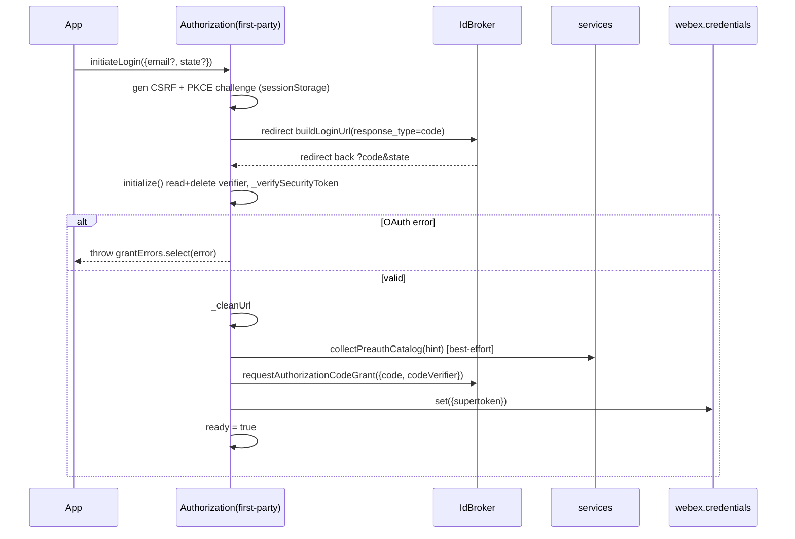
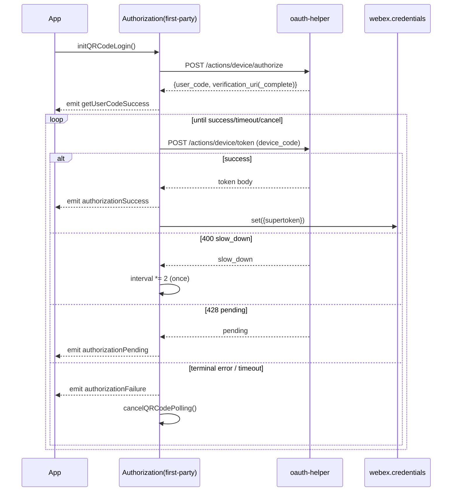
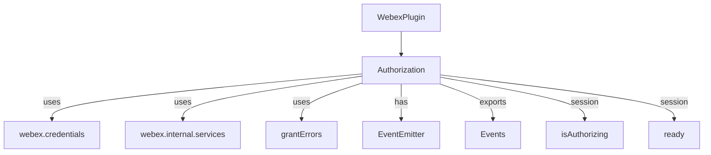
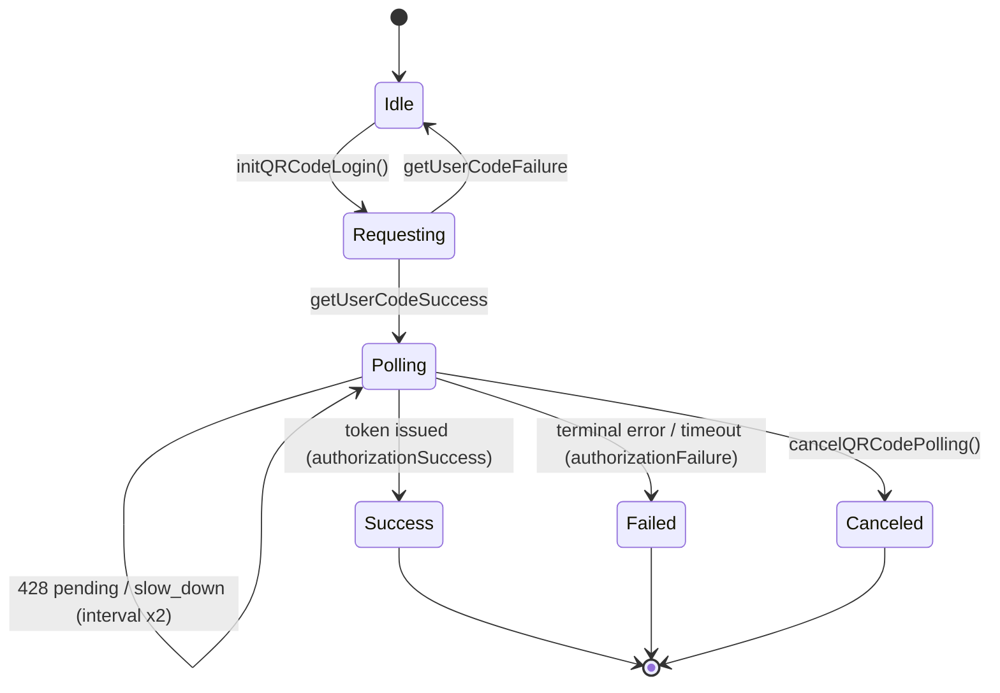

# @webex/plugin-authorization-browser-first-party — SPEC

> Start here → root [`AGENTS.md`](../../../../AGENTS.md) (agent entry) · router [`SPEC_INDEX.md`](../../../../ai-docs/SPEC_INDEX.md) · system [`ARCHITECTURE.md`](../../../../ai-docs/ARCHITECTURE.md). This is the module's canonical spec.
> Context-efficiency: link to canonical docs — don't duplicate them. Load specs on demand per `SPEC_INDEX.md`.

## Metadata
| Field | Value |
|---|---|
| Module id | `@webex/plugin-authorization-browser-first-party` |
| Source path(s) | `packages/@webex/plugin-authorization-browser-first-party/` |
| Doc kind | Module spec |
| Coverage score | Pending coverage assessment |
| Generated from | `module-spec` @ SDLC template library `0.2.1` |
| generated_by / approved_by / updated_at | claude-cli / pending / 2026-07-31T00:00:00Z |
| Validation status | not-run |

Coverage score is `Pending coverage assessment` until the first coverage review. Manifest coverage state is authoritative in `.sdd/manifest.json`.

## Evidence Rules
Every requirement cites concrete source evidence using `file path`. Migrated from the package README, verified against `src/authorization.js`.

## Source Material Register
| Source material | Scope | Decision | Detail location or disposition |
|---|---|---|---|
| First-party package README | overview / API / tests | used / verified | Feature table, events table, methods/properties, security controls, error handling → Public Surface, Events (CONTRACTS), Security, Error Handling, Pitfalls; verified against `src/authorization.js`. |

## Overview

`@webex/plugin-authorization-browser-first-party` is a specialized, internal-intended browser OAuth2 implementation for the official Webex first-party web client. It implements the Authorization Code flow with PKCE (S256), CSRF protection, URL sanitization, optional preauth service-catalog hinting, and Device Authorization (QR code) login with polling. It extends `WebexPlugin`, holds session state (`isAuthorizing`, `ready`) plus device-polling state, and emits lifecycle events through an `eventEmitter`.

It is deliberately not for third-party use; consumers should prefer `@webex/plugin-authorization-browser` or the auto-loader. On SDK init, `initialize()` auto-completes a returned authorization code: it validates CSRF, retrieves and clears the single-use PKCE verifier, optionally prefetches a preauth catalog, exchanges the code, and stores the supertoken.

## Purpose / Responsibility

Owns hardened first-party browser OAuth2: PKCE-protected Authorization Code login, QR device-code login with polling, CSRF/URL-sanitization controls, and preauth catalog hinting. It does NOT own token persistence/refresh (credentials plugin) and is NOT intended for general third-party apps.

## Stack

JavaScript with legacy Babel decorators; `@ts-nocheck` at the top of `authorization.js`. Built via `webex-legacy-tools`. Node `>=8`. Depends on `@webex/webex-core`, `@webex/common`, `crypto-js` (PKCE S256 + SHA256 email hash), `uuid`, `lodash`, and the Node `events` EventEmitter.

## Folder / Package Structure
```
packages/@webex/plugin-authorization-browser-first-party/
├── src/
│   ├── index.js          # registerPlugin; exports default + Events + config
│   ├── authorization.js  # PKCE login, QR device polling, CSRF, URL cleanup, events
│   └── config.js         # default credentials config
└── test/unit/spec/authorization.js   # jest unit suite (characterization baseline)
```

## Key Files (source of truth)
| File | Holds |
|---|---|
| `packages/@webex/plugin-authorization-browser-first-party/src/authorization.js` | All flow logic, PKCE, QR polling, CSRF, URL cleanup, `Events` |
| `packages/@webex/plugin-authorization-browser-first-party/src/index.js` | Plugin registration; exports `default`, `Events`, `config` |

## Public Surface
| Contract ID | Type | Surface | Purpose | Compatibility / deprecation | Schema / detail link | Root index |
|---|---|---|---|---|---|---|
| `authorization.initiateLogin` | SDK | `initiateLogin(options?)` | start PKCE + CSRF Authorization Code flow; optional email hash | internal-intended | `src/authorization.js` | `../../../../ai-docs/CONTRACTS.md` |
| `authorization.initiateAuthorizationCodeGrant` | SDK | `initiateAuthorizationCodeGrant(options)` | build/redirect code request (popup or in-tab) | internal-intended | `src/authorization.js` | `../../../../ai-docs/CONTRACTS.md` |
| `authorization.requestAuthorizationCodeGrant` | SDK | `requestAuthorizationCodeGrant({code, codeVerifier?})` | exchange code (+PKCE verifier) for supertoken | internal-intended | `src/authorization.js` | `../../../../ai-docs/CONTRACTS.md` |
| `authorization.initQRCodeLogin` | SDK | `initQRCodeLogin()` | start device (QR) authorization + polling | internal-intended | `src/authorization.js` | `../../../../ai-docs/CONTRACTS.md` |
| `authorization.cancelQRCodePolling` | SDK | `cancelQRCodePolling(withCancelEvent=true)` | cancel active polling loop | internal-intended | `src/authorization.js` | `../../../../ai-docs/CONTRACTS.md` |
| `authorization.logout` | SDK | `logout({noRedirect?})` | redirect to logout URL unless suppressed | internal-intended | `src/authorization.js` | `../../../../ai-docs/CONTRACTS.md` |
| `authorization.eventEmitter` / `.Events` | SDK | EventEmitter + `Events` enum | subscribe to `login` / `qRCodeLogin` lifecycle events | internal-intended | `src/authorization.js` | `../../../../ai-docs/CONTRACTS.md` |
| `authorization.isAuthorizing` / `.isAuthenticating` / `.ready` | SDK | properties | flow-progress and readiness booleans | internal-intended | `src/authorization.js` | `../../../../ai-docs/CONTRACTS.md` |

Compatibility notes:
- Internal-intended: third-party reliance is discouraged in the README; treat surface changes as internal but still semver-tracked.

## Requires (dependencies)
- `@webex/webex-core` — `WebexPlugin`, `grantErrors`, `credentials`, `services`. `@webex/common` — `base64`, `oneFlight`, `whileInFlight`. `crypto-js` — S256 code challenge + SHA256 email hash. `uuid` — CSRF token. `lodash`. Node `events`.
- External: Webex IdBroker; `oauth-helper` service (`/actions/device/authorize`, `/actions/device/token`); `services.collectPreauthCatalog`.

## Requirements
| ID | WHAT | WHY | Source Evidence | Test / Example Evidence | Assumptions / Gaps | Confidence |
|---|---|---|---|---|---|---|
| `PLUGIN-AUTHORIZATION-BROWSER-FIRST-PARTY-R-001` | `initiateLogin` generates a CSRF token and a PKCE `code_challenge` (S256, `code_challenge_method='S256'`), optionally hashes `email` to `emailHash`/`emailhash` (raw email deleted), and delegates to `initiateAuthorizationCodeGrant`. | Hardened, PKCE-protected login without leaking raw email. | `src/authorization.js` (`initiateLogin`, `_generateCodeChallenge`) | `test/unit/spec/authorization.js` | — | PRESENT |
| `PLUGIN-AUTHORIZATION-BROWSER-FIRST-PARTY-R-002` | On init, if a `code` is present, decode `state`, retrieve+delete the single-use PKCE verifier, verify CSRF, clean the URL, best-effort prefetch a preauth catalog (by `emailhash` or code-derived `orgId`), then exchange the code and set the supertoken; set `ready=true` regardless. | Seamless, secure redirect completion. | `src/authorization.js` (`initialize`, `_extractOrgIdFromCode`) | `test/unit/spec/authorization.js` | — | PRESENT |
| `PLUGIN-AUTHORIZATION-BROWSER-FIRST-PARTY-R-003` | `requestAuthorizationCodeGrant` rejects when `code` is missing, else POSTs `grant_type=authorization_code` with `redirect_uri`, `code`, `self_contained_token:true`, optional `code_verifier`, and basic auth, mapping 400 responses via `grantErrors`. | PKCE code exchange with typed errors. | `src/authorization.js` (`requestAuthorizationCodeGrant`) | `test/unit/spec/authorization.js` | — | PRESENT |
| `PLUGIN-AUTHORIZATION-BROWSER-FIRST-PARTY-R-004` | `initQRCodeLogin` requests a device/user code from `oauth-helper`, emits `getUserCodeSuccess` with a rewritten `verificationUriComplete`, and starts polling; a second concurrent attempt emits `getUserCodeFailure`. | Device/QR login with single active attempt. | `src/authorization.js` (`initQRCodeLogin`, `_generateQRCodeVerificationUrl`) | `test/unit/spec/authorization.js` | — | PRESENT |
| `PLUGIN-AUTHORIZATION-BROWSER-FIRST-PARTY-R-005` | Polling honors server `interval` (default 2s), doubles once on `slow_down` (400), treats `428` as `authorizationPending`, emits `authorizationSuccess` + stores supertoken on success, and enforces an overall `expires_in` timeout; late responses are ignored via `pollingId`. | Correct, cancellable device-code polling. | `src/authorization.js` (`_startQRCodePolling`, `cancelQRCodePolling`) | `test/unit/spec/authorization.js` | — | PRESENT |
| `PLUGIN-AUTHORIZATION-BROWSER-FIRST-PARTY-R-006` | `_cleanUrl` removes `code` and, if only `csrf_token` remains in `state`, removes `state`; otherwise re-encodes remaining state minus `csrf_token`; then `history.replaceState`. | Prevent code/CSRF leakage via history/referrer. | `src/authorization.js` (`_cleanUrl`) | `test/unit/spec/authorization.js` | — | PRESENT |

## Design Overview

The plugin hardens the browser Authorization Code flow with PKCE and adds a device-code path. `initiateLogin` composes security material (CSRF + PKCE) and optional preauth hints, then hands off to `initiateAuthorizationCodeGrant`, which builds the login URL and either replaces the location or opens a popup, emitting a `redirectToLoginUrl` event. Completion in `initialize` is defensive: it decodes state, consumes the single-use PKCE verifier immediately (to minimize exposure), verifies CSRF, scrubs the URL, and defers the (non-blocking) preauth-catalog fetch and code exchange to `process.nextTick`. The QR/device path is an independent operation group driven by `oauth-helper` with an interval/backoff/timeout polling loop guarded by a monotonically increasing `pollingId` so canceled or superseded loops ignore late responses.

## Data Flow


## Sequence Diagram(s)
Sequence coverage: two operation groups with different actors, ordering, and state outcomes — PKCE redirect login and QR device polling.

| Operation group | Diagram | Failure / recovery coverage |
|---|---|---|
| PKCE Authorization Code login | Redirect + exchange | `alt` for OAuth error, CSRF mismatch; exchange failure logged, ready still set |
| QR device authorization | Device code + polling | `slow_down` backoff, `428` pending, terminal failure, timeout, cancel |





## Class / Component Relationships


## Use Cases
- **UC-1 First-party PKCE login:** web client calls `initiateLogin()` → PKCE+CSRF → redirect → auto-exchange on return. Evidence: `src/authorization.js`, README §Standard Login.
- **UC-2 QR device login:** subscribe to `Events.qRCodeLogin` → `initQRCodeLogin()` → display QR from `userData` → poll to success. Evidence: `src/authorization.js`, README §Device Authorization.

## State Model

Session fields `isAuthorizing` and `ready` (booleans) plus device-polling fields `pollingTimer`, `pollingExpirationTimer`, `pollingId`, `currentPollingId`. `isAuthenticating` is derived from `isAuthorizing`.

## Business Rules & Invariants
- PKCE `code_verifier` is single-use: retrieved and removed from sessionStorage during `initialize` before exchange.
- Raw email is never propagated: hashed to `emailHash` and deleted from options.
- Only one active device-polling loop: a second `initQRCodeLogin`/`_startQRCodePolling` while `pollingTimer` is set emits a failure instead of starting a duplicate.
- Late/canceled poll responses are ignored when `currentPollingId !== pollingId`.

## Concurrency & Reactive Flow
- `@whileInFlight('isAuthorizing')` guards redirect/exchange; `@oneFlight` collapses concurrent `requestAuthorizationCodeGrant` calls.
- Device polling is a self-rescheduling `setTimeout` loop with an overall `expires_in` expiration timer; `cancelQRCodePolling` clears both timers and resets the polling id so in-flight responses are dropped. `slow_down` doubles the interval once for the next cycle.

## State Machine


## Error Handling & Failure Modes
| Condition | Signal (error/code/result) | Caller recovery |
|---|---|---|
| OAuth error param on redirect | throws `grantErrors.select(query.error)` | handle typed grant error |
| CSRF missing/mismatch (with stored token) | throws Error | treat as forged redirect |
| Missing `code` on exchange | reject `Error('`options.code` is required')` | supply code |
| 400 on code exchange | reject typed `grantErrors` | inspect (invalid/expired code) |
| Duplicate polling attempt | emit `getUserCodeFailure` / `authorizationFailure` (`already a polling request`) | cancel first, then retry |
| Poll `slow_down` (400) | double interval once, keep polling | none needed |
| Poll `428` | emit `authorizationPending`, keep polling | wait |
| Overall timeout | `cancelQRCodePolling(false)` + emit `authorizationFailure` (`timed out`) | restart flow |

## Pitfalls
- The PKCE verifier is deleted on read; a second exchange attempt for the same redirect will lack the verifier.
- `_extractOrgIdFromCode` parses the 3rd underscore-delimited segment of the code — a heuristic; unexpected code shapes yield `undefined` (preauth hint simply skipped).
- Preauth catalog fetch is best-effort and non-fatal; do not treat its failure as an auth failure.
- CSRF verification silently returns when no session token is stored (direct navigation).

## Module Do's / Don'ts
- DO emit lifecycle events through `eventEmitter` for QR/device progress so the UI can react.
- DO guard polling with `pollingId`/`currentPollingId` and clear both timers on cancel.
- DON'T use this package for third-party apps — prefer `@webex/plugin-authorization-browser`.
- DON'T remove URL cleanup, CSRF, or PKCE handling.

## Key Design Trade-off
- Auto-completing the code exchange in `initialize` (and always setting `ready=true` even if exchange fails) favors a seamless, non-throwing startup over surfacing exchange errors synchronously — errors are logged via `this.logger.warn`, so consumers must observe credential/ready state rather than an init throw.

## Export Stability
Published npm package (internal-intended). Exports `default`, `Events`, and `config`. The `Events` enum values (`login`, `qRCodeLogin`) and `eventType` strings are part of the event contract; changing them is breaking. Node engine floor `>=8`.

## Test-Case Strategy (module)
Unit tests (jest) stub `window`/`sessionStorage`, `crypto-js`, and `lodash` to assert PKCE challenge generation, CSRF verify success/mismatch, URL cleanup, code exchange, and the QR polling state transitions (success, pending 428, slow_down, timeout, cancel) with positive and negative cases.

| Behavior / Requirement | Existing test evidence | Gap |
|---|---|---|
| `...-R-001/002` PKCE login + init | `test/unit/spec/authorization.js` | — |
| `...-R-003` code exchange | `test/unit/spec/authorization.js` | — |
| `...-R-004/005` QR polling | `test/unit/spec/authorization.js` | — |
| `...-R-006` URL cleanup | `test/unit/spec/authorization.js` | — |

## Traceability
- Repo architecture: `../../../../ai-docs/ARCHITECTURE.md` · Registry: `../../../../ai-docs/SPEC_INDEX.md`
- Coverage state & contracts baseline: `.sdd/manifest.json`
