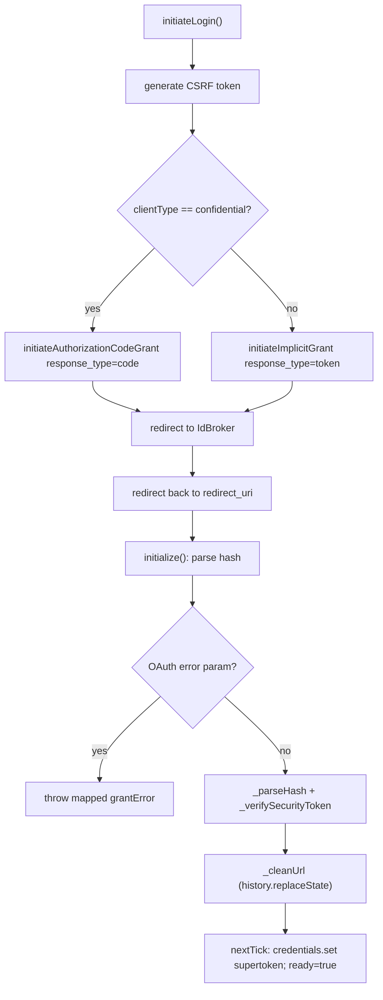
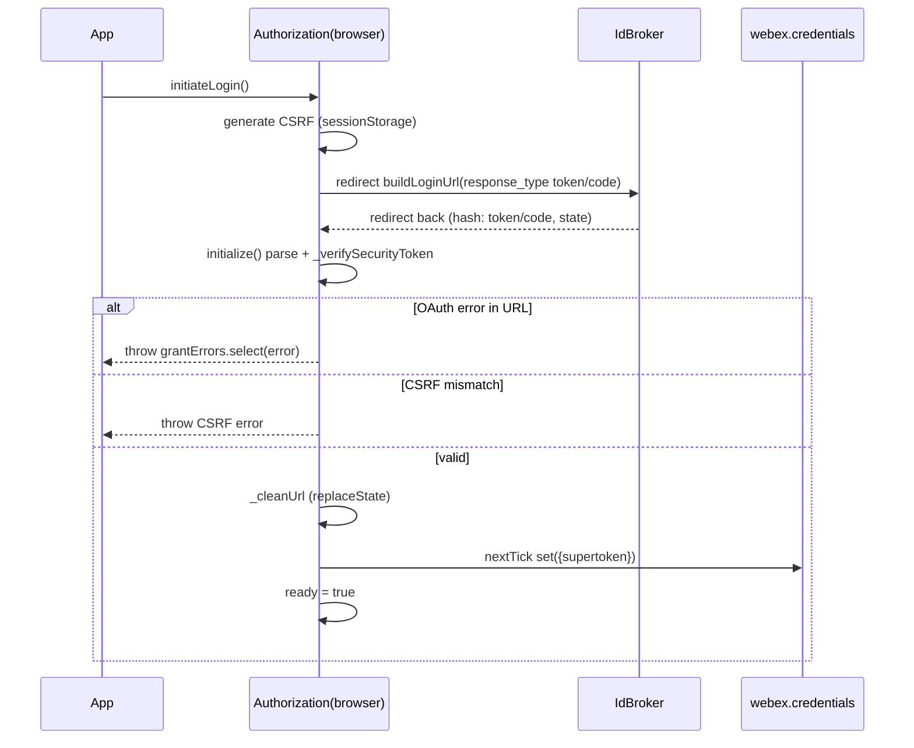
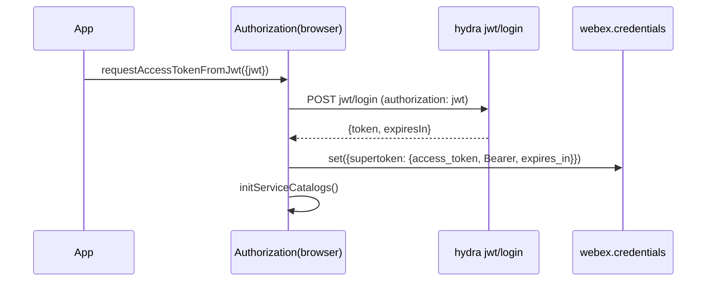
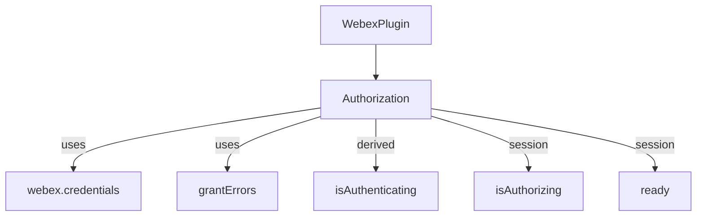

# @webex/plugin-authorization-browser — SPEC

> Start here → root [`AGENTS.md`](../../../../AGENTS.md) (agent entry) · router [`SPEC_INDEX.md`](../../../../ai-docs/SPEC_INDEX.md) · system [`ARCHITECTURE.md`](../../../../ai-docs/ARCHITECTURE.md). This is the module's canonical spec.
> Context-efficiency: link to canonical docs — don't duplicate them. Load specs on demand per `SPEC_INDEX.md`.

## Metadata
| Field | Value |
|---|---|
| Module id | `@webex/plugin-authorization-browser` |
| Source path(s) | `packages/@webex/plugin-authorization-browser/` |
| Doc kind | Module spec |
| Coverage score | Pending coverage assessment |
| Generated from | `module-spec` @ SDLC template library `0.2.1` |
| generated_by / approved_by / updated_at | claude-cli / pending / 2026-07-31T00:00:00Z |
| Validation status | not-run |

Coverage score is `Pending coverage assessment` until the first coverage review. Manifest coverage state is authoritative in `.sdd/manifest.json`.

## Evidence Rules
Every requirement cites concrete source evidence using `file path`. Migrated from the Browser OAuth Flow Guide and the package README, verified against `src/authorization.js`.

## Source Material Register
| Source material | Scope | Decision | Detail location or disposition |
|---|---|---|---|
| Browser OAuth technical guide | overview / architecture / API | used / verified | init/flow-selection/refresh narrative → Overview, Design Overview, Data Flow, Sequence Diagram(s); refresh-callback and events → Public Surface and Design; verified against `src/authorization.js`. |
| Browser package README | API / overview | used / verified | Method/option tables → Public Surface; grant-type comparison → Design Overview. |

## Overview

`@webex/plugin-authorization-browser` provides browser OAuth2 support for the Webex SDK. It registers under the `authorization` namespace and, on SDK init, automatically parses the current URL for an access token or authorization code returned from the Webex identity broker. It supports two consumer flows selected by `clientType`: Implicit Grant (public clients, `response_type=token`) and Authorization Code Grant (confidential clients, `response_type=code`), plus JWT guest authentication and logout.

The plugin extends `WebexPlugin` (Ampersand-State) and holds two session booleans, `isAuthorizing` and `ready`, with `isAuthenticating` as a derived alias. It does not store tokens itself; a successful flow sets `supertoken` on `webex.credentials`.

## Purpose / Responsibility

Owns browser-side OAuth2 acquisition: initiate login (implicit or code), parse and validate the redirect return (CSRF + error checks + URL cleanup), and exchange JWTs for access tokens. It does NOT own token persistence/refresh scheduling (credentials plugin) or the server-side code exchange (node package).

## Stack

JavaScript with legacy Babel decorators (`@whileInFlight`, `@oneFlight`). Built via `webex-legacy-tools`. Node `>=18`. Depends on `@webex/webex-core`, `@webex/common`, `@webex/internal-plugin-device`, storage adapters, `jsonwebtoken`, `uuid`, `lodash`.

## Folder / Package Structure
```
packages/@webex/plugin-authorization-browser/
├── src/
│   ├── index.js            # registerPlugin('authorization', Authorization, {config, proxies})
│   ├── authorization.js    # the browser OAuth2 plugin (all flow logic)
│   └── config.js           # default { credentials: { clientType: 'public' } }
├── test/unit/spec/authorization.js   # jest unit suite (characterization baseline)
└── BROWSER-OAUTH-FLOW-GUIDE.md       # retained source design guide
```

## Key Files (source of truth)
| File | Holds |
|---|---|
| `packages/@webex/plugin-authorization-browser/src/authorization.js` | All OAuth2 methods, CSRF handling, hash parsing, URL cleanup |
| `packages/@webex/plugin-authorization-browser/src/config.js` | Default `clientType: 'public'` — the flow-selection default |
| `packages/@webex/plugin-authorization-browser/src/index.js` | Plugin registration + proxied properties (`isAuthorizing`, `isAuthenticating`) |

## Public Surface
| Contract ID | Type | Surface | Purpose | Compatibility / deprecation | Schema / detail link | Root index |
|---|---|---|---|---|---|---|
| `authorization.initiateLogin` | SDK | `initiateLogin(options?)` | start login; picks code vs implicit by `clientType` | stable | `src/authorization.js` | `../../../../ai-docs/CONTRACTS.md` |
| `authorization.initiateImplicitGrant` | SDK | `initiateImplicitGrant(options)` | implicit flow (`response_type=token`) | stable | `src/authorization.js` | `../../../../ai-docs/CONTRACTS.md` |
| `authorization.initiateAuthorizationCodeGrant` | SDK | `initiateAuthorizationCodeGrant(options)` | code flow (`response_type=code`) | stable | `src/authorization.js` | `../../../../ai-docs/CONTRACTS.md` |
| `authorization.requestAccessTokenFromJwt` | SDK | `requestAccessTokenFromJwt({jwt})` | exchange guest JWT for access token via hydra | stable | `src/authorization.js` | `../../../../ai-docs/CONTRACTS.md` |
| `authorization.createJwt` | SDK | `createJwt({issuer, secretId, displayName?, expiresIn})` | create a guest JWT (HS256) | stable | `src/authorization.js` | `../../../../ai-docs/CONTRACTS.md` |
| `authorization.logout` | SDK | `logout(options?)` | redirect to logout URL unless `noRedirect` | stable | `src/authorization.js` | `../../../../ai-docs/CONTRACTS.md` |
| `authorization.isAuthorizing` / `.isAuthenticating` / `.ready` | SDK | properties | flow-progress and readiness booleans | stable | `src/authorization.js` | `../../../../ai-docs/CONTRACTS.md` |

Compatibility notes:
- Implicit grant returns no refresh token (documented); consumers re-authenticate on expiry.

## Requires (dependencies)
- `@webex/webex-core` — `WebexPlugin`, `grantErrors`, `credentials`. `@webex/common` — `base64`, `oneFlight`, `whileInFlight`. `@webex/internal-plugin-device` (side-effect import). `jsonwebtoken` (`createJwt`), `uuid` (CSRF token), `lodash`.
- External: Webex IdBroker (`buildLoginUrl` target); hydra `jwt/login` (JWT exchange), resolved from `services.get('hydra')` or `HYDRA_SERVICE_URL` fallback.

## Requirements
| ID | WHAT | WHY | Source Evidence | Test / Example Evidence | Assumptions / Gaps | Confidence |
|---|---|---|---|---|---|---|
| `PLUGIN-AUTHORIZATION-BROWSER-R-001` | `initiateLogin` uses Authorization Code Grant when `clientType === 'confidential'`, else Implicit Grant; it always injects a generated CSRF token into `state`. | Correct flow per client type; CSRF binds the request. | `src/authorization.js` (`initiateLogin`) | `test/unit/spec/authorization.js` | — | PRESENT |
| `PLUGIN-AUTHORIZATION-BROWSER-R-002` | On init (unless `parse === false`), parse `window.location` for OAuth errors, then for an access token in the hash; on token, verify CSRF, clean the URL, and set `supertoken` on credentials next tick. | Seamless redirect completion without an extra consumer call. | `src/authorization.js` (`initialize`, `_parseHash`, `_cleanUrl`) | `test/unit/spec/authorization.js` | — | PRESENT |
| `PLUGIN-AUTHORIZATION-BROWSER-R-003` | Implicit grant supports opening login in a separate window with default 600x800 dimensions, overridable via `separateWindow` object. | Popup login for SPAs. | `src/authorization.js` (`initiateImplicitGrant`) | `test/unit/spec/authorization.js` | — | PRESENT |
| `PLUGIN-AUTHORIZATION-BROWSER-R-004` | CSRF verification throws when a stored session token exists but `state`/`state.csrf_token` is missing or mismatched; silently returns when no token was stored. | Reject forged redirects while allowing direct navigation. | `src/authorization.js` (`_verifySecurityToken`) | `test/unit/spec/authorization.js` | — | PRESENT |
| `PLUGIN-AUTHORIZATION-BROWSER-R-005` | `requestAccessTokenFromJwt` POSTs the JWT to `${hydra}jwt/login`, maps the response to `{access_token, token_type:'Bearer', expires_in}`, stores it, and re-inits service catalogs. | Guest/JWT authentication. | `src/authorization.js` (`requestAccessTokenFromJwt`) | `test/unit/spec/authorization.js` | — | PRESENT |
| `PLUGIN-AUTHORIZATION-BROWSER-R-006` | `createJwt` signs an HS256 JWT from a base64-decoded `secretId` with a `guest-user-<uuid>` subject and configured `expiresIn`. | Client-side guest token creation. | `src/authorization.js` (`createJwt`) | `test/unit/spec/authorization.js` | — | PRESENT |

## Design Overview

The plugin splits "start a flow" from "complete a flow". `initiateLogin` is the single entry that generates a CSRF token and dispatches to `initiateImplicitGrant` or `initiateAuthorizationCodeGrant` based on `config.clientType`; both build a login URL via `webex.credentials.buildLoginUrl` and either replace `window.location` or open a popup. Completion happens automatically in `initialize`: it parses the URL, checks for OAuth errors first, then extracts token data from the hash, verifies the CSRF token, cleans sensitive params from the URL via `history.replaceState`, and defers setting `supertoken` to `process.nextTick` in case the credentials plugin is not yet initialized.

The grant-type comparison from the source guide is preserved: Authorization Code Grant (`response_type=code`, requires client secret, token via server exchange, best for backend web apps) vs Implicit Grant (`response_type=token`, no secret, token in URL hash, best for SPAs — no refresh token).

## Data Flow


## Sequence Diagram(s)
Sequence coverage: two operation groups — the redirect login/return, and JWT guest login. They differ in actors (IdBroker vs hydra) and outcome, so separate diagrams.

| Operation group | Diagram | Failure / recovery coverage |
|---|---|---|
| Redirect login + return | Implicit/Code login | `alt` for OAuth error param and CSRF mismatch |
| JWT guest login | JWT exchange | JWT POST failure propagates as rejection |





## Class / Component Relationships

`Authorization` extends `WebexPlugin`; `isAuthenticating` is derived from the `isAuthorizing` session flag.

## Use Cases
- **UC-1 Public SPA login:** app calls `initiateLogin()` with default `clientType` → implicit grant → token in hash → `initialize` stores supertoken. Evidence: `src/authorization.js`, `test/unit/spec/authorization.js`.
- **UC-2 Confidential login:** app sets `clientType: 'confidential'` → code grant → code returned → exchanged server-side. Evidence: `src/authorization.js`.
- **UC-3 Guest JWT login:** app `createJwt(...)` then `requestAccessTokenFromJwt({jwt})`. Evidence: `src/authorization.js`.

## State Model

Ampersand-State session fields: `isAuthorizing` (boolean, default false; toggled by `@whileInFlight`), `ready` (boolean, default false; set true after redirect/code processing). `isAuthenticating` is a derived alias of `isAuthorizing`. Namespace: `Credentials`.

## Business Rules & Invariants
- Any non-`confidential` `clientType` is treated as public/implicit — enforced in `initiateLogin` and defaulted in `config.js`.
- CSRF token is single-use: removed from sessionStorage during `_verifySecurityToken`.
- Sensitive params (`access_token`, `token_type`, `expires_in`, `refresh_token`, `refresh_token_expires_in`, `state.csrf_token`) are stripped from the URL after read (`_cleanUrl`).

## Error Handling & Failure Modes
| Condition | Signal (error/code/result) | Caller recovery |
|---|---|---|
| OAuth error param in redirect | throws `grantErrors.select(query.error)` | handle typed grant error; re-initiate login |
| CSRF token missing/mismatch (with stored token) | throws Error (`CSRF token ... does not match ...`) | treat as forged redirect; restart login |
| No access token in hash | `ready = true`, returns undefined | no token to store; app may call `initiateLogin()` |
| JWT exchange failure | promise rejection from `webex.request` | surface auth failure to user |

## Pitfalls
- Implicit grant provides no refresh token — do not assume `supertoken.canRefresh` is true for public clients.
- `initialize` cannot read config (not available until nextTick), so URL parsing is gated by the `attrs.parse === false` flag, not config.
- `_verifySecurityToken` silently returns when no session token is stored; do not rely on it to reject all missing-state cases.

## Export Stability
Published npm package; the `webex.authorization` method/property surface is a semver-sensitive public API. Adding an optional option is a minor; removing/renaming a method or changing flow-selection semantics is a major.

## Test-Case Strategy (module)
Unit tests (jest via `webex-legacy-tools`) mock `window`/`sessionStorage` and assert flow selection, hash parsing, CSRF success and mismatch, URL cleanup, and JWT creation/exchange — with positive and negative cases (e.g. CSRF match vs mismatch).

| Behavior / Requirement | Existing test evidence | Gap |
|---|---|---|
| `...-R-001` flow selection | `test/unit/spec/authorization.js` | verify confidential path coverage |
| `...-R-002` init parse/store | `test/unit/spec/authorization.js` | — |
| `...-R-004` CSRF verify | `test/unit/spec/authorization.js` | — |
| `...-R-005/006` JWT | `test/unit/spec/authorization.js` | — |

## Traceability
- Repo architecture: `../../../../ai-docs/ARCHITECTURE.md` · Registry: `../../../../ai-docs/SPEC_INDEX.md`
- Coverage state & contracts baseline: `.sdd/manifest.json`
- Retained source design guide: `BROWSER-OAUTH-FLOW-GUIDE.md` (routing recorded in `.sdd/manifest.json` `spec_sources`).
