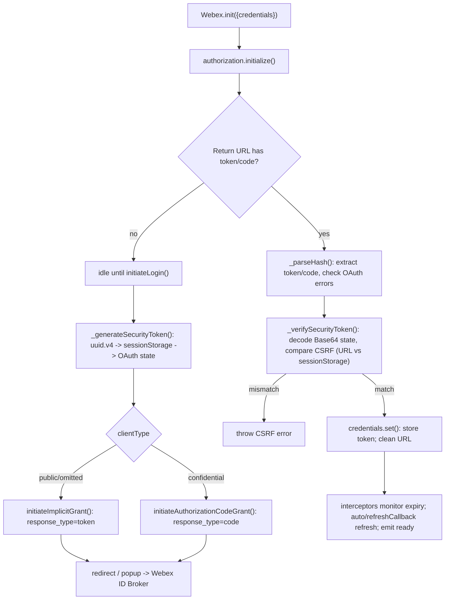
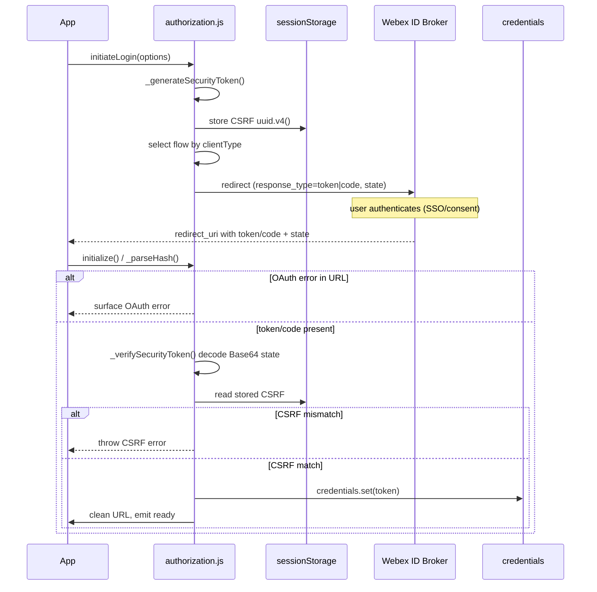
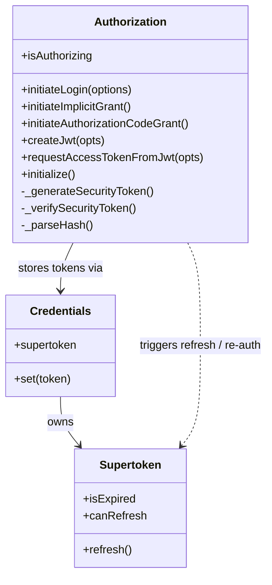

# plugin-authorization-browser — SPEC

> Start here → root [`AGENTS.md`](../../../../AGENTS.md) (agent entry) · router [`SPEC_INDEX.md`](../../../../ai-docs/SPEC_INDEX.md) · system [`ARCHITECTURE.md`](../../../../ai-docs/ARCHITECTURE.md). This is the module's canonical spec: orientation, requirements, design, flows, state, protocol, and tests.
> Context-efficiency: link to canonical docs — don't duplicate them. Load specs on demand per `SPEC_INDEX.md`.

## Metadata
| Field | Value |
|---|---|
| Module id | `plugin-authorization-browser` |
| Source path(s) | `packages/@webex/plugin-authorization-browser/` |
| Doc kind | Module spec |
| Coverage score | 75% (12/16) assessed 2026-07-28; critical 7/8 (cites src/authorization.js); data ownership WEAK, requirements WEAK, no test evidence — stays Partial |
| Generated from | `module-spec` @ SDLC template library `0.2.1` |
| generated_by / approved_by / updated_at | generated_by: module-spec ; approved_by: pending ; updated_at: 2026-07-28 |
| Validation status | not-run |

Manifest coverage state: **Partial**. This is an assess-only migration; the code under `packages/@webex/plugin-authorization-browser/src/` is the source of truth. Content here migrates the routed source guide by meaning, not by linking.

Coverage score is `Pending coverage assessment` before the first report; after assessment, replace with a percentage plus the assessment date and short evidence summary. Manifest coverage state is kept outside the rendered metadata table.

## Evidence Rules
Every generated requirement below cites concrete source evidence using `file path`. Source evidence, test evidence, examples, assumptions, and gaps are separated so validators and future agents can distinguish truth from context. The routed guide `BROWSER-OAUTH-FLOW-GUIDE.md` documents intended behavior; `src/authorization.js` is the implementation of record. No automated tests were located for these behaviors during migration, so test evidence is recorded as "None found" and confidence is WEAK where the behavior is unverified against code or tests.

## Source Material Register
| Source material | Scope | Decision | Detail location or disposition |
|---|---|---|---|
| `packages/@webex/plugin-authorization-browser/BROWSER-OAUTH-FLOW-GUIDE.md` (routed, migrate-existing, retain) | overview / architecture / API | used / migrated by meaning | Initialization params, flow selection, grant types, security model, CSRF, popup/login options, JWT, token storage, refresh, ready/auth events, and status properties migrated by meaning into Overview, Requirements, Design Overview, Data Flow, Sequence Diagram(s), Use Cases, Error Handling, and Pitfalls below. |

## Overview
`plugin-authorization-browser` owns OAuth 2.0 authorization for the Webex JS SDK running in a browser. It turns a `Webex.init({credentials})` call into an authenticated session by driving one of the Webex ID Broker OAuth grant flows, capturing the returned token or code from the redirect URL, protecting the exchange with a CSRF token, and handing tokens to the shared `credentials` object for storage and refresh.

The plugin selects its flow at runtime from the `clientType` credential: public (or omitted) clients use the Implicit Grant (`response_type=token`); confidential clients use the Authorization Code Grant (`response_type=code`). It also supports JWT-based guest authentication (`createJwt` → `requestAccessTokenFromJwt`) and integrates with the SDK's refresh machinery (automatic refresh, `refreshCallback`, `jwtRefreshCallback`, and manual `webex.credentials.supertoken.refresh()`).

A maintainer should start at `packages/@webex/plugin-authorization-browser/src/authorization.js`. `initiateLogin()` is the front door for interactive login; `initialize()` / `_parseHash()` handle the redirect-return leg (parse URL, check OAuth errors, verify CSRF, clean the URL); `_generateSecurityToken()` / `_verifySecurityToken()` implement CSRF protection. The working example lives at `docs/samples/browser-auth/app.js`, and consumer-facing docs at `packages/@webex/plugin-authorization-browser/README.md`.

## Purpose / Responsibility
Owns browser-side OAuth 2.0 authorization for the Webex SDK: initiate login via the Webex ID Broker (implicit or authorization-code, selected by `clientType`), process the redirect return, enforce CSRF protection, obtain guest tokens via JWT, and coordinate token storage/refresh with the `credentials` object. It does NOT own the Client Credentials Grant (Node.js only), does NOT accept email/password directly (it redirects to the identity broker), and does NOT itself perform the confidential server-side code→token exchange (that happens on the backend).

## Stack
JavaScript (ES modules, Babel-transpiled), built as an `@webex` SDK plugin extending the SDK plugin/`AmpState`-style base. Uses `uuid` (`uuid.v4()`) for CSRF token generation and browser `sessionStorage` / `localStorage` for state and token persistence. Tests: Jest (`jest.config.js`), with additional package `test/` directory. Distributed as an npm package consumed by the browser SDK.

## Folder / Package Structure
```
packages/@webex/plugin-authorization-browser/
├── src/
│   ├── authorization.js   # OAuth flow, login, CSRF, URL parse, JWT, refresh wiring — source of truth
│   ├── config.js          # default credentials/authorization config
│   └── index.js           # plugin registration / exports
├── test/                  # package tests
├── README.md              # consumer-facing plugin docs
└── BROWSER-OAUTH-FLOW-GUIDE.md  # routed source guide (migrated by meaning into this spec)
```

## Key Files (source of truth)
| File | Holds |
|---|---|
| `packages/@webex/plugin-authorization-browser/src/authorization.js` | `initiateLogin`, `initiateImplicitGrant`, `initiateAuthorizationCodeGrant`, `initialize`, `_parseHash`, `_generateSecurityToken`, `_verifySecurityToken`, `createJwt`, `requestAccessTokenFromJwt`, and the `isAuthorizing` status. Flow selection and CSRF logic. |
| `packages/@webex/plugin-authorization-browser/src/config.js` | Default authorization/credentials config values. |
| `packages/@webex/plugin-authorization-browser/src/index.js` | Plugin registration and public exports. |
| `docs/samples/browser-auth/app.js` | Working browser-auth example: init, login, event listeners, status checks. |
| `packages/@webex/plugin-authorization-browser/README.md` | Consumer-facing plugin documentation. |

## Public Surface
| Contract ID | Type | Surface | Purpose | Compatibility / deprecation | Schema / detail link | Root index |
|---|---|---|---|---|---|---|
| `authorization.initiateLogin` | SDK | `webex.authorization.initiateLogin(options?)` | Start interactive OAuth login; redirect to the Webex ID Broker (implicit or auth-code by `clientType`). Accepts `options.state` and `options.separateWindow`. Does NOT accept email/password. | stable | `src/authorization.js` | `../../../../ai-docs/SPEC_INDEX.md` |
| `authorization.initiateImplicitGrant` | SDK | `initiateImplicitGrant()` | Public/default flow; builds `response_type=token` OAuth URL. | stable | `src/authorization.js` | `../../../../ai-docs/SPEC_INDEX.md` |
| `authorization.initiateAuthorizationCodeGrant` | SDK | `initiateAuthorizationCodeGrant()` | Confidential flow; builds `response_type=code` OAuth URL. | stable | `src/authorization.js` | `../../../../ai-docs/SPEC_INDEX.md` |
| `authorization.createJwt` | SDK | `createJwt({issuer, secretId, displayName, expiresIn})` | Build a guest JWT. | stable | `src/authorization.js` | `../../../../ai-docs/SPEC_INDEX.md` |
| `authorization.requestAccessTokenFromJwt` | SDK | `requestAccessTokenFromJwt({jwt})` | Exchange a guest JWT for an access token. | stable | `src/authorization.js` | `../../../../ai-docs/SPEC_INDEX.md` |
| `authorization._generateSecurityToken` | SDK (internal) | `_generateSecurityToken()` | Generate CSRF UUID, store in sessionStorage, embed in OAuth `state`. | internal | `src/authorization.js` | `../../../../ai-docs/SPEC_INDEX.md` |
| `authorization._verifySecurityToken` | SDK (internal) | `_verifySecurityToken()` | Verify CSRF token from redirect `state` vs sessionStorage; throw on mismatch. | internal | `src/authorization.js` | `../../../../ai-docs/SPEC_INDEX.md` |
| `authorization._parseHash` | SDK (internal) | `_parseHash()` | Parse token/code from the return URL. | internal | `src/authorization.js` | `../../../../ai-docs/SPEC_INDEX.md` |
| `credentials.supertoken.refresh` | SDK | `webex.credentials.supertoken.refresh()` | Manual token refresh (`grant_type=refresh_token`). | stable | `src/authorization.js` | `../../../../ai-docs/SPEC_INDEX.md` |

Compatibility notes:
- `initiateLogin(options)` options are additive; adding a new optional option is a minor change, removing one is a major change.
- `clientType` defaults to `public` when omitted; changing the default would be a breaking behavior change.

## Requires (dependencies)
- Webex SDK core: `webex.credentials` object (token storage, `set()`, `supertoken`, `change:supertoken` event) and the SDK event/lifecycle bus (`ready`, `unauthorized`, `client:logout`).
- Webex ID Broker OAuth endpoints, including the token endpoint `https://webexapis.com/v1/access_token`.
- Browser platform: `sessionStorage` (CSRF token), `localStorage`/`sessionStorage` (token persistence), and `window.location` (URL parse / redirect).
- `uuid` (`uuid.v4()`) for CSRF token generation.
- HTTP interceptors that monitor token expiry and drive automatic refresh before API calls.

## Requirements
| ID | WHAT | WHY | Source Evidence | Test / Example Evidence | Assumptions / Gaps | Confidence |
|---|---|---|---|---|---|---|
| `PLUGIN-AUTHORIZATION-BROWSER-R-001` | `Webex.init({credentials:{client_id, redirect_uri, scope, clientType}})` initializes the plugin; `client_id` = registered app ID, `redirect_uri` = post-auth return URL, `scope` = requested permissions (e.g. `spark:all spark:kms`), `clientType` = `public` (default) or `confidential`. | Consumers must configure OAuth to authenticate. | `BROWSER-OAUTH-FLOW-GUIDE.md`, `src/authorization.js` | None found | Param names/defaults not re-verified against `config.js`. | WEAK |
| `PLUGIN-AUTHORIZATION-BROWSER-R-002` | `initiateLogin()` selects flow by `clientType`: `public`/omitted → `initiateImplicitGrant()` (`response_type=token`); `confidential` → `initiateAuthorizationCodeGrant()` (`response_type=code`). | Public and confidential clients need different, security-appropriate grants. | `BROWSER-OAUTH-FLOW-GUIDE.md`, `src/authorization.js` | None found | Exact branch not confirmed in code. | WEAK |
| `PLUGIN-AUTHORIZATION-BROWSER-R-003` | Implements Webex ID Broker grants: Authorization Code (confidential, `response_type=code`, code exchanged for tokens), Implicit (public/default, `response_type=token`, token in URL hash), Refresh Token (automatic or manual, `grant_type=refresh_token`). | These are the browser-supported OAuth flows. | `BROWSER-OAUTH-FLOW-GUIDE.md`, `src/authorization.js` | None found | Grant wiring not re-verified in code. | WEAK |
| `PLUGIN-AUTHORIZATION-BROWSER-R-004` | Client Credentials Grant is NOT supported in the browser (Node.js only) because it requires a client secret that cannot be safely stored in browsers. | Prevent insecure secret handling in browser environments. | `BROWSER-OAUTH-FLOW-GUIDE.md`, `src/authorization.js` | None found | Absence-of-support is documented, not code-asserted. | WEAK |
| `PLUGIN-AUTHORIZATION-BROWSER-R-005` | Implicit vs Auth Code differ by security: Implicit exposes tokens in the browser URL (hash fragment), needs no client secret, single redirect, best for SPAs/mobile; Auth Code keeps tokens off the browser (never exposed), requires a client secret, code in URL exchanged server-side (two-step), best for web apps with a backend. | Consumers must pick the correct grant for their security posture. | `BROWSER-OAUTH-FLOW-GUIDE.md` | None found | Security trade-off is design intent. | WEAK |
| `PLUGIN-AUTHORIZATION-BROWSER-R-006` | On load, `initialize()` / `_parseHash()` auto-parse the current URL for tokens/codes, check for OAuth errors, validate the CSRF token, and clean the URL by removing sensitive params. | Complete the redirect return and avoid leaving tokens/codes in the address bar. | `BROWSER-OAUTH-FLOW-GUIDE.md`, `src/authorization.js` | None found | URL-cleaning behavior not re-verified in code. | WEAK |
| `PLUGIN-AUTHORIZATION-BROWSER-R-007` | CSRF generation: `_generateSecurityToken()` creates a UUID via `uuid.v4()`, stores it in sessionStorage, and includes it in the OAuth `state` param. | Bind the login attempt to this browser session. | `BROWSER-OAUTH-FLOW-GUIDE.md`, `src/authorization.js` | None found | uuid version/storage key not re-verified. | WEAK |
| `PLUGIN-AUTHORIZATION-BROWSER-R-008` | CSRF verification: `_verifySecurityToken()` extracts `state` from the redirect URL, decodes the Base64 state object, compares the URL CSRF token against sessionStorage, and throws on mismatch. | Reject forged/replayed redirects. | `BROWSER-OAUTH-FLOW-GUIDE.md`, `src/authorization.js` | None found | Base64/throw behavior not re-verified in code. | WEAK |
| `PLUGIN-AUTHORIZATION-BROWSER-R-009` | `initiateLogin()` accepts `options.state` (custom data folded into OAuth state) and `options.separateWindow` (Boolean | Object popup; default dims 600x800, or custom `{width,height}`); it redirects to the identity broker and does NOT accept email/password. | Support return-context and popup UX while keeping credentials off the app. | `BROWSER-OAUTH-FLOW-GUIDE.md`, `src/authorization.js` | None found | Default dimensions not re-verified in code. | WEAK |
| `PLUGIN-AUTHORIZATION-BROWSER-R-010` | Guest JWT auth: `createJwt({issuer, secretId, displayName, expiresIn})` builds a JWT; `requestAccessTokenFromJwt({jwt})` exchanges it for an access token; `jwtRefreshCallback` supplies refreshed JWTs automatically. | Enable guest access without a full OAuth login. | `BROWSER-OAUTH-FLOW-GUIDE.md`, `src/authorization.js` | None found | JWT param shape not re-verified in code. | WEAK |
| `PLUGIN-AUTHORIZATION-BROWSER-R-011` | Tokens are stored in the credentials object via `webex.credentials.set()`, persisted in browser storage (localStorage/sessionStorage), and monitored for expiration by interceptors. | Persist sessions across reloads and detect expiry. | `BROWSER-OAUTH-FLOW-GUIDE.md`, `src/authorization.js` | None found | Storage backend selection not re-verified. | WEAK |
| `PLUGIN-AUTHORIZATION-BROWSER-R-012` | Refresh: `refreshCallback` configured at init POSTs to `https://webexapis.com/v1/access_token` with `grant_type=refresh_token`, `refresh_token`, `client_id`; manual refresh via `webex.credentials.supertoken.refresh()`. Implicit grant generally issues NO refresh token → re-authenticate. | Keep sessions alive without re-login where a refresh token exists. | `BROWSER-OAUTH-FLOW-GUIDE.md`, `src/authorization.js` | None found | Endpoint/params documented, not code-verified. | WEAK |
| `PLUGIN-AUTHORIZATION-BROWSER-R-013` | Automatic refresh: the SDK auto-refreshes tokens before API calls; on an unauthorized error the caller re-authenticates via `initiateLogin()`; consumers can listen for `change:supertoken` on credentials. | Transparent token renewal with a re-auth fallback. | `BROWSER-OAUTH-FLOW-GUIDE.md`, `src/authorization.js` | None found | Interceptor timing not re-verified. | WEAK |
| `PLUGIN-AUTHORIZATION-BROWSER-R-014` | Emits/relays lifecycle events: `ready` (SDK fully initialized + authenticated), `unauthorized` (auth lost → redirect to login), `client:logout` (user logged out). Init phases: construction → plugin loading → storage loading → authentication check → ready. | Consumers gate app behavior on auth lifecycle. | `BROWSER-OAUTH-FLOW-GUIDE.md`, `src/authorization.js` | None found | Event ownership (plugin vs core) not re-verified. | WEAK |
| `PLUGIN-AUTHORIZATION-BROWSER-R-015` | Ready state depends on: credentials loaded from browser storage, all plugins initialized, services catalog loaded, and authentication state established. | Defines the meaning of `ready`. | `BROWSER-OAUTH-FLOW-GUIDE.md` | None found | Dependency set not code-verified. | WEAK |
| `PLUGIN-AUTHORIZATION-BROWSER-R-016` | Status properties: `webex.canAuthorize` (bool, can make authenticated requests), `webex.authorization.isAuthorizing` (bool, authorization in progress), `webex.ready` (bool, SDK fully initialized), plus token props `webex.credentials.supertoken.isExpired` and `.canRefresh`. | Let apps branch on auth/init/token state. | `BROWSER-OAUTH-FLOW-GUIDE.md`, `src/authorization.js` | None found | Property ownership not re-verified in code. | WEAK |

## Design Overview
The plugin separates the two legs of the OAuth redirect dance so state never straddles the browser navigation. On the **outbound** leg, `initiateLogin()` generates a CSRF token (`_generateSecurityToken()` → `uuid.v4()` → sessionStorage → OAuth `state`), determines the flow from `clientType`, builds the OAuth URL, and redirects to the Webex ID Broker (same window, or a popup via `options.separateWindow`). Public/default clients call `initiateImplicitGrant()` (`response_type=token`); confidential clients call `initiateAuthorizationCodeGrant()` (`response_type=code`).

On the **inbound** leg, `initialize()` runs on plugin load and inspects the current URL. `_parseHash()` extracts token (implicit) or code (auth-code) data, checks for OAuth error params, and `_verifySecurityToken()` re-derives the CSRF token from the decoded Base64 `state` and compares it to the sessionStorage value, throwing on mismatch. The URL is then cleaned so tokens/codes do not persist in the address bar. Implicit tokens are stored directly; confidential codes are handed off for server-side exchange with the client secret.

Guest access bypasses the redirect flow: `createJwt()` mints a JWT from `{issuer, secretId, displayName, expiresIn}` and `requestAccessTokenFromJwt({jwt})` exchanges it for an access token. Refresh is handled by the shared credentials machinery — automatic pre-call refresh through interceptors, a configured `refreshCallback` that POSTs `grant_type=refresh_token` to the token endpoint, a `jwtRefreshCallback` for guest tokens, and manual `supertoken.refresh()`. Implicit grant typically returns no refresh token, so those sessions re-authenticate via `initiateLogin()`.

## Data Flow


## Sequence Diagram(s)
Sequence coverage:

| Operation group | Diagram | Failure / recovery coverage |
|---|---|---|
| Login + redirect return (implicit / auth-code) with CSRF verify | "OAuth login and CSRF-verified return" | CSRF mismatch throw; OAuth error param path |
| Token refresh (auto, manual, callback) | "Token refresh and re-auth" | Refresh failure → `initiateLogin()`; no refresh token (implicit) → re-authenticate |



```mermaid
sequenceDiagram
  participant App
  participant Interceptor
  participant Cred as credentials.supertoken
  participant Broker as token endpoint

  App->>Interceptor: API call
  Interceptor->>Cred: isExpired?
  alt expired and canRefresh
    Cred->>Broker: POST /v1/access_token grant_type=refresh_token
    Broker-->>Cred: new tokens
    Cred-->>App: change:supertoken emitted; call proceeds
  else refresh fails or no refresh token (implicit)
    App->>App: catch unauthorized
    App->>App: initiateLogin() to re-authenticate
  end
```

## Class / Component Relationships

`Authorization` (in `src/authorization.js`) drives the OAuth flows and CSRF; it stores tokens into the shared `Credentials` object, which owns `Supertoken` (expiry/refresh). Refresh is coordinated by credentials/interceptors, not owned by the plugin.

## Use Cases
- **UC-1 Interactive login (implicit):** App calls `initiateLogin()` for a public client → CSRF token generated → redirect to broker with `response_type=token` → user authenticates → return URL hash carries token → `_parseHash()` + `_verifySecurityToken()` → token stored, URL cleaned, `ready` emitted. Evidence: `src/authorization.js`, `docs/samples/browser-auth/app.js`.
  ```javascript
  // Basic login - redirects to Webex login page
  webex.authorization.initiateLogin()

  // Login with custom state data
  webex.authorization.initiateLogin({
    state: {
      returnUrl: '/dashboard',
      userId: 'user123'
    }
  })

  // Login in popup window (default dimensions: 600x800)
  webex.authorization.initiateLogin({
    separateWindow: true
  })

  // Login in popup with custom dimensions
  webex.authorization.initiateLogin({
    separateWindow: {
      width: 800,
      height: 600
    }
  })
  ```
- **UC-2 Interactive login (confidential):** Init with `clientType: 'confidential'` → `initiateLogin()` uses `response_type=code` → code returned in query params → exchanged server-side with the client secret. Evidence: `src/authorization.js`, `BROWSER-OAUTH-FLOW-GUIDE.md`.
  ```javascript
  const webex = Webex.init({
    credentials: {
      client_id: 'your-client-id',
      redirect_uri: 'https://your-app.com/callback',
      scope: 'spark:all spark:kms',
      clientType: 'confidential' // or 'public' (default)
    }
  });
  webex.authorization.initiateLogin(); // confidential -> response_type=code
  ```
- **UC-3 Guest JWT auth:** App builds a guest JWT and exchanges it for an access token. Evidence: `src/authorization.js`.
  ```javascript
  // Create JWT token
  webex.authorization.createJwt({
    issuer: 'your-guest-issuer-id',
    secretId: 'your-base64-encoded-secret',
    displayName: 'Guest User Name',
    expiresIn: '12h'
  }).then(({jwt}) => {
    console.log('Created JWT:', jwt);

    // Exchange JWT for access token
    return webex.authorization.requestAccessTokenFromJwt({jwt});
  }).then(() => {
    console.log('Guest user authenticated');
  }).catch(error => {
    console.error('JWT authentication failed:', error);
  });

  // Automated JWT refresh via callback
  const webexGuest = Webex.init({
    credentials: {
      jwtRefreshCallback: async (webex) => {
        const response = await fetch('/api/jwt-refresh', {
          method: 'POST',
          credentials: 'include'
        });
        const { jwt } = await response.json();
        return jwt;
      }
    }
  });
  // SDK automatically uses jwtRefreshCallback when JWT expires
  ```
- **UC-4 Token refresh / re-auth:** SDK auto-refreshes before API calls; a configured `refreshCallback` performs the token-endpoint POST; on failure the app re-authenticates. Evidence: `src/authorization.js`, `BROWSER-OAUTH-FLOW-GUIDE.md`.
  ```javascript
  // Configure refresh callback during initialization
  const webex = Webex.init({
    credentials: {
      client_id: 'your-client-id',
      redirect_uri: 'https://your-app.com/callback',
      scope: 'spark:all spark:kms',
      refreshCallback: (webex, token) => {
        return webex.request({
          method: 'POST',
          uri: 'https://webexapis.com/v1/access_token',
          form: {
            grant_type: 'refresh_token',
            refresh_token: token.refresh_token,
            client_id: token.config.client_id
          }
        }).then(response => response.body);
      }
    }
  });

  // Manual refresh; on failure, re-authenticate
  webex.credentials.supertoken.refresh().then((newToken) => {
    console.log('Token refreshed successfully');
  }).catch((error) => {
    console.error('Token refresh failed:', error);
    webex.authorization.initiateLogin();
  });

  // Automatic refresh before API calls
  webex.people.get('me').then(person => {
    console.log('Current user:', person.displayName);
  }).catch(error => {
    if (error.message.includes('unauthorized')) {
      webex.authorization.initiateLogin();
    }
  });

  // Listen for token refresh events
  webex.credentials.on('change:supertoken', () => {
    console.log('Token was refreshed');
  });
  ```
- **UC-5 Lifecycle & status handling:** App gates behavior on lifecycle events and status properties. Evidence: `docs/samples/browser-auth/app.js`, `BROWSER-OAUTH-FLOW-GUIDE.md`.
  ```javascript
  // Lifecycle events
  webex.once('ready', () => {
    console.log('Webex SDK is ready and authenticated');
  });
  webex.on('unauthorized', () => {
    console.log('User authentication lost - redirect to login');
    webex.authorization.initiateLogin();
  });
  webex.on('client:logout', () => {
    console.log('User has logged out');
  });

  // Status checks
  if (webex.canAuthorize) {
    // Make API calls
  } else {
    webex.authorization.initiateLogin();
  }
  if (webex.authorization.isAuthorizing) {
    console.log('Authorization in progress...');
  }
  if (webex.ready) {
    console.log('SDK is fully initialized');
  }

  // Token status
  if (webex.credentials.supertoken.isExpired) {
    // SDK will automatically refresh if a refresh token is available
  }
  if (webex.credentials.supertoken.canRefresh) {
    console.log('Token can be refreshed');
  } else {
    webex.authorization.initiateLogin(); // must re-authenticate
  }
  ```

## Error Handling & Failure Modes
| Condition | Signal (error/code/result) | Caller recovery |
|---|---|---|
| CSRF token mismatch on return | `_verifySecurityToken()` throws | Do not trust the redirect; restart login via `initiateLogin()`. |
| OAuth error param in return URL | Error surfaced during `initialize()` / `_parseHash()` | Inspect the OAuth error, then re-initiate login. |
| Access token expired | `webex.credentials.supertoken.isExpired === true` | SDK auto-refreshes if a refresh token exists; otherwise re-authenticate. |
| No refresh token available (typical for implicit grant) | `webex.credentials.supertoken.canRefresh === false` | Re-authenticate via `initiateLogin()`. |
| Refresh request fails | `supertoken.refresh()` promise rejects | Catch and call `initiateLogin()`. |
| API call unauthorized (401) | Error whose message includes `unauthorized` / `unauthorized` event | Re-authenticate via `initiateLogin()`. |
| JWT exchange fails | `requestAccessTokenFromJwt()` / `createJwt()` promise rejects | Catch and surface the failure; retry JWT creation or fetch a new JWT via `jwtRefreshCallback`. |
| Client Credentials Grant attempted in browser | Not supported (no browser path) | Use the Node.js SDK; do not store a client secret in the browser. |

## Pitfalls
- Implicit grant exposes the access token in the URL hash fragment and generally issues NO refresh token — plan to re-authenticate on expiry rather than relying on refresh.
- `initiateLogin()` never accepts email/password; it redirects to the Webex ID Broker. Do not build a credentials form against it.
- The CSRF token lives in `sessionStorage`; a new tab/session or cleared session storage will fail `_verifySecurityToken()`. The `state` object is Base64-encoded and must decode cleanly.
- Do not leave tokens/codes in the address bar — the plugin cleans the URL after `_parseHash()`; custom navigation that runs before `initialize()` can leak them.
- `clientType: 'confidential'` returns a code, not a token — the code→token exchange requires a client secret and must happen server-side; the browser alone cannot complete it.
- Client Credentials Grant is Node.js-only; attempting it in the browser is unsupported because the client secret cannot be safely stored.
- `refreshCallback` must POST to `https://webexapis.com/v1/access_token` with `grant_type=refresh_token`, `refresh_token`, and `client_id`; omitting any of these breaks refresh.

## Test-Case Strategy (module)
Target the two OAuth legs and the CSRF boundary. Unit-test `initiateLogin()` flow selection (public→`initiateImplicitGrant`/`response_type=token`; confidential→`initiateAuthorizationCodeGrant`/`response_type=code`) and its `options.state`/`options.separateWindow` handling (default 600x800 popup and custom `{width,height}`). Test `_generateSecurityToken()`/`_verifySecurityToken()` for a matching pair (positive) AND a tampered/absent `state` that must throw (negative). Test `_parseHash()` for token/code extraction, OAuth error detection, and URL cleaning. Test `createJwt`/`requestAccessTokenFromJwt` success and rejection. Test refresh: `refreshCallback` POST shape, `supertoken.refresh()` success and rejection→re-auth, and the no-refresh-token (implicit) path. Assert lifecycle/status: `ready`, `unauthorized`, `client:logout`, `canAuthorize`, `isAuthorizing`, `ready`, `isExpired`, `canRefresh`.

| Behavior / Requirement | Existing test evidence | Gap |
|---|---|---|
| `PLUGIN-AUTHORIZATION-BROWSER-R-002` flow selection | None found | Missing positive (both clientTypes) and negative (invalid clientType) cases. |
| `PLUGIN-AUTHORIZATION-BROWSER-R-007/008` CSRF gen/verify | None found | Missing mismatch/throw negative case. |
| `PLUGIN-AUTHORIZATION-BROWSER-R-006` URL parse/clean | None found | Missing OAuth-error and URL-cleaning assertions. |
| `PLUGIN-AUTHORIZATION-BROWSER-R-009` login options | None found | Missing default/custom popup dimension assertions. |
| `PLUGIN-AUTHORIZATION-BROWSER-R-010` JWT auth | None found | Missing exchange success/failure cases. |
| `PLUGIN-AUTHORIZATION-BROWSER-R-012/013` refresh | None found | Missing refresh success, failure→re-auth, and no-refresh-token cases. |
| `PLUGIN-AUTHORIZATION-BROWSER-R-014/015/016` lifecycle & status | None found | Missing event and status-property assertions. |

## Traceability
- Repo architecture: `../../../../ai-docs/ARCHITECTURE.md` · Registry: `../../../../ai-docs/SPEC_INDEX.md`
- Coverage state & contracts baseline: `.sdd/manifest.json`
- Migrated source: `packages/@webex/plugin-authorization-browser/BROWSER-OAUTH-FLOW-GUIDE.md`
- Implementation source of truth: `packages/@webex/plugin-authorization-browser/src/authorization.js`
- Example: `docs/samples/browser-auth/app.js` · Consumer docs: `packages/@webex/plugin-authorization-browser/README.md`
