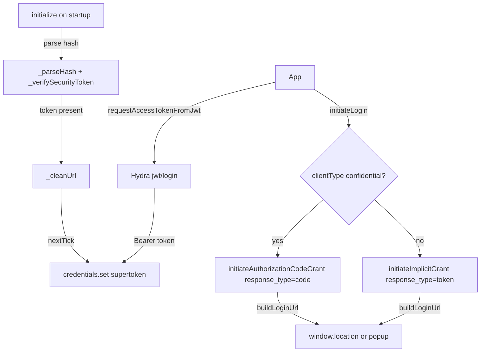
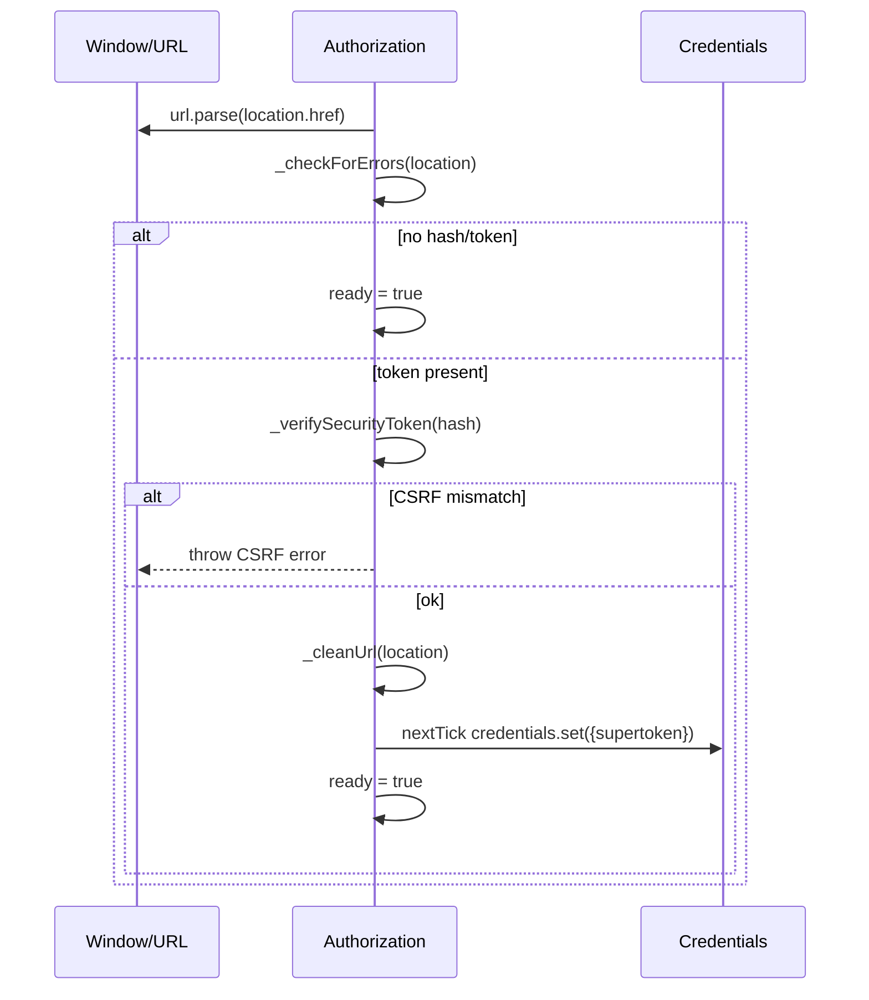
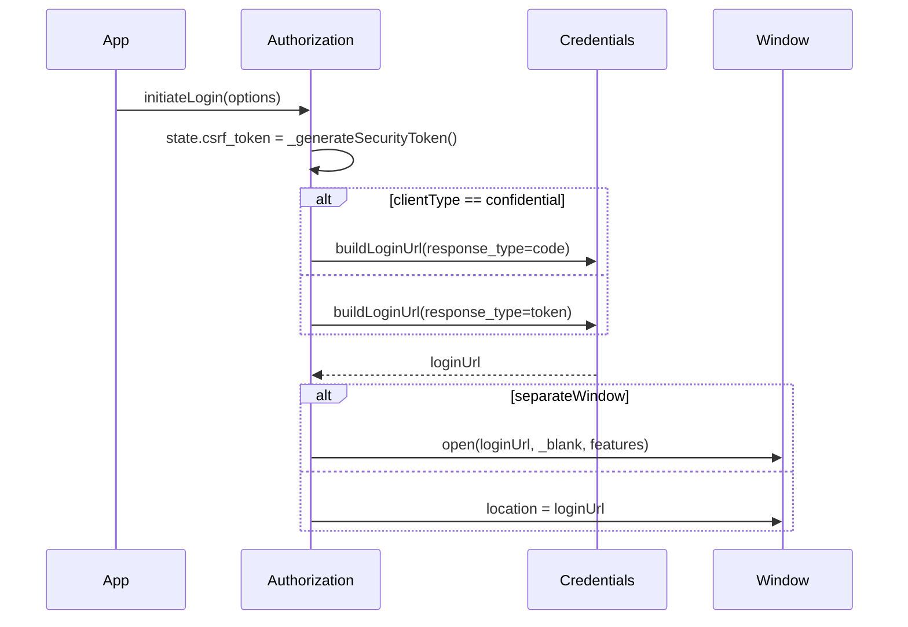

<!-- sdd-generated-metadata
generator: claude-cli
generator_model: us.anthropic.claude-opus-4-8
approved_by: pending-human-review
updated_at: 2026-08-06T00:00:00Z
validation_status: not-run
run_id: 51855eac-8de5-43a2-a3b6-dbcc55ebc91b
-->

# @webex/plugin-authorization-browser — SPEC

> Start here → root [`AGENTS.md`](../../../../AGENTS.md) (agent entry) · router [`SPEC_INDEX.md`](../../../../ai-docs/SPEC_INDEX.md) · system [`ARCHITECTURE.md`](../../../../ai-docs/ARCHITECTURE.md). This is the module's canonical spec: orientation, requirements, design, flows, state, and tests.
> Context-efficiency: link to canonical docs — don't duplicate them. Load specs on demand per `SPEC_INDEX.md`.

## Metadata

| Field | Value |
|---|---|
| Module id | `plugin-authorization-browser` |
| Source path(s) | `packages/@webex/plugin-authorization-browser/src/` |
| Parent spec | `—` (registered `authorization` plugin for browsers; composed by `webex-core`, no parent module) |
| Doc kind | Module spec |
| Coverage score | Pending coverage assessment |
| Generated from | `module-spec` @ SDLC template library `0.2.2` |
| generated_by / approved_by / updated_at | claude-cli / pending-human-review / 2026-08-06 |
| Validation status | not-run, validator `pending`, assessed 2026-08-06 |

Coverage score is `Pending coverage assessment` until the first coverage review runs. Manifest coverage
state (`Partial`) is authoritative and kept in `.sdd/manifest.json`.

## Evidence Rules
Every requirement cites concrete source evidence using `file path`. Test evidence is preferred for WHY.
Requirements are grounded in the current implementation under `src/` and its unit tests. The retained
`BROWSER-OAUTH-FLOW-GUIDE.md` is a protected reference source (context-only), not a migrated spec.

## Source Material Register

| Source material | Scope | Decision | Detail location or disposition |
|---|---|---|---|
| `BROWSER-OAUTH-FLOW-GUIDE.md` (package root) | overview / API | reference-only | Retained protected guide; linked as background, not copied into this spec. |

## Overview

`@webex/plugin-authorization-browser` provides browser-side OAuth2 support, registered as the
`authorization` plugin (namespace `Credentials`). On construction it automatically parses the window
location hash for an access token (implicit-grant redirect completion), verifies a CSRF token, cleans the
URL, and stores the resulting supertoken. It also exposes methods to initiate login (implicit grant by
default, authorization-code grant for confidential clients), exchange a backend JWT for a Webex token,
mint guest JWTs, and log out.

The plugin (`src/authorization.js`, a `WebexPlugin`) has two session flags: `isAuthorizing` (aliased by
`isAuthenticating`, both proxied) and `ready` (set once startup parsing completes). Security handling
includes CSRF token generation/verification (via `sessionStorage`) and stripping token/CSRF values from
the URL after redirect. It depends on `@webex/plugin-authorization-node` (delegated confidential-client
code exchange is not defined here) and `@webex/storage-adapter-local-storage`. A maintainer should start
at `src/authorization.js`.

## Purpose / Responsibility

Owns browser OAuth2: implicit-grant redirect parsing/completion, initiating implicit or authorization-code
login (including popup windows), JWT-login token exchange, guest JWT creation, CSRF protection, and URL
cleanup. It does NOT own PKCE/device (QR) login (that is the first-party package), token storage
(`webex-core` `Credentials`), or Node flows.

## Stack

JavaScript (Babel, legacy decorators), built with `webex-legacy-tools`. Uses Node `url`/`querystring`
shims, `@webex/common` `base64`, `lodash`, `uuid`, and `jsonwebtoken`. Tested with
`@webex/test-helper-chai`, `@webex/test-helper-mocha`, `@webex/test-helper-mock-webex`,
`@webex/test-helper-automation`, `@webex/test-helper-appid`, and `sinon`. Runtime dependencies:
`@webex/webex-core`, `@webex/common`, `@webex/internal-plugin-device`,
`@webex/plugin-authorization-node`, `@webex/storage-adapter-local-storage`,
`@webex/storage-adapter-spec`, `jsonwebtoken`. Evidence:
`packages/@webex/plugin-authorization-browser/package.json`.

## Folder / Package Structure

```
packages/@webex/plugin-authorization-browser/src/
├── index.js           # imports internal device plugin; registerPlugin('authorization', ...) with proxies
├── authorization.js   # Authorization WebexPlugin: hash parse, initiateLogin, grants, JWT login, CSRF, cleanup
└── config.js          # default plugin config
```

## Key Files (source of truth)

| File | Holds |
|---|---|
| `packages/@webex/plugin-authorization-browser/src/authorization.js` | Redirect parsing, login initiation, grant flows, CSRF gen/verify, URL cleanup, session flags |
| `packages/@webex/plugin-authorization-browser/src/index.js` | Registration name (`authorization`) and proxied properties |

## Public Surface

Consumed as the `authorization` plugin (`webex.authorization`) in browsers. Navigates the window to the
login/logout URLs and calls Hydra `jwt/login`.

| Contract ID | Type | Surface | Purpose | Compatibility / deprecation | Schema / detail link | Root index |
|---|---|---|---|---|---|---|
| `authorization.initiateLogin` | SDK | `initiateLogin({state?, separateWindow?}): Promise` | Start login: code grant for confidential clients, else implicit | Stable | `packages/@webex/plugin-authorization-browser/src/authorization.js` | `../../../../ai-docs/CONTRACTS.md` |
| `authorization.initiateImplicitGrant` | SDK | `initiateImplicitGrant(options): Promise` | Build implicit-grant login URL; navigate or open a window | Stable; `@whileInFlight` | `packages/@webex/plugin-authorization-browser/src/authorization.js` | `../../../../ai-docs/CONTRACTS.md` |
| `authorization.initiateAuthorizationCodeGrant` | SDK | `initiateAuthorizationCodeGrant(options): Promise` | Build code-grant login URL and navigate | Stable; `@whileInFlight` | `packages/@webex/plugin-authorization-browser/src/authorization.js` | `../../../../ai-docs/CONTRACTS.md` |
| `authorization.requestAccessTokenFromJwt` | SDK/HTTP | `requestAccessTokenFromJwt({jwt}): Promise` | Exchange a backend JWT for a Webex token via Hydra | Stable; `@oneFlight` | `packages/@webex/plugin-authorization-browser/src/authorization.js` | `../../../../ai-docs/CONTRACTS.md` |
| `authorization.createJwt` | SDK | `createJwt({issuer, secretId, displayName?, expiresIn}): Promise<{jwt}>` | Sign a guest-user JWT (HS256) | Stable | `packages/@webex/plugin-authorization-browser/src/authorization.js` | `../../../../ai-docs/CONTRACTS.md` |
| `authorization.logout` | SDK | `logout({noRedirect?}): void` | Navigate to logout URL unless suppressed | Stable | `packages/@webex/plugin-authorization-browser/src/authorization.js` | `../../../../ai-docs/CONTRACTS.md` |
| `authorization.state` | SDK | `isAuthorizing`/`isAuthenticating`/`ready` | In-flight and startup-complete flags | Stable proxied state | `packages/@webex/plugin-authorization-browser/src/authorization.js` | `../../../../ai-docs/CONTRACTS.md` |

Compatibility notes:
- Method names/signatures, the `separateWindow` popup option, and the guest-JWT `{jwt}` return are the
  consumer contract.
- CSRF is enforced via `sessionStorage` key `oauth2-csrf-token`; the `state.csrf_token` embedding is part
  of the redirect contract.

## Requires (dependencies)

- `@webex/webex-core` — base `WebexPlugin`, `registerPlugin`, `webex.request`, `webex.credentials`
  (`buildLoginUrl`/`buildLogoutUrl`/`set`), `grantErrors`, `webex.getWindow()`, `webex.internal.services`.
- `@webex/common` — `base64`, `oneFlight`, `whileInFlight`.
- `@webex/internal-plugin-device` — imported for device context.
- `@webex/plugin-authorization-node` — declared dependency for shared behavior.
- `@webex/storage-adapter-local-storage` / `@webex/storage-adapter-spec` — storage support.
- `jsonwebtoken` (guest JWTs), `lodash`, `uuid`.

## Requirements

| ID | WHAT | WHY | Source Evidence | Test / Example Evidence | Assumptions / Gaps | Confidence |
|---|---|---|---|---|---|---|
| `AUTHORIZATION-BROWSER-R-001` | On `initialize`, unless `attrs.parse === false`, the plugin parses `window.location`, checks for OAuth errors, parses the hash (decoding a base64 `state`), and — when a token is present — cleans the URL and sets `credentials.supertoken` on `process.nextTick`, setting `ready = true`. | Implicit-grant redirects must complete automatically at SDK startup. | `packages/@webex/plugin-authorization-browser/src/authorization.js` | `packages/@webex/plugin-authorization-browser/test/unit/spec/authorization.js` | none identified | PRESENT |
| `AUTHORIZATION-BROWSER-R-002` | `initiateLogin(options)` generates a CSRF token into `options.state.csrf_token`, then calls `initiateAuthorizationCodeGrant` when `config.clientType === 'confidential'`, else `initiateImplicitGrant`. | Client type must select the correct grant while always adding CSRF protection. | `packages/@webex/plugin-authorization-browser/src/authorization.js` | `packages/@webex/plugin-authorization-browser/test/unit/spec/authorization.js` | none identified | PRESENT |
| `AUTHORIZATION-BROWSER-R-002b` | `initiateImplicitGrant` builds a `response_type:token` login URL; `initiateAuthorizationCodeGrant` builds a `response_type:code` URL; when `options.separateWindow` is set the URL opens in a new window (default 600x800, overridable), otherwise it replaces `window.location`. | Both grant types and popup vs in-tab navigation must be supported. | `packages/@webex/plugin-authorization-browser/src/authorization.js` | `packages/@webex/plugin-authorization-browser/test/unit/spec/authorization.js` | none identified | PRESENT |
| `AUTHORIZATION-BROWSER-R-003` | `requestAccessTokenFromJwt({jwt})` resolves the Hydra URI (catalog → env → default), POSTs `jwt/login` with the jwt header, maps `{token, expiresIn}` to a Bearer token, sets the supertoken, and re-inits service catalogs. | Products with their own auth can exchange a backend JWT for a Webex token. | `packages/@webex/plugin-authorization-browser/src/authorization.js` | `packages/@webex/plugin-authorization-browser/test/unit/spec/authorization.js` | none identified | PRESENT |
| `AUTHORIZATION-BROWSER-R-004` | `createJwt(...)` base64-decodes `secretId`, builds a guest payload (`sub: guest-user-{uuid}`, `iss`, `name`), signs with `expiresIn`, and resolves `{jwt}`; errors reject. | Guest access requires a signed guest-user JWT. | `packages/@webex/plugin-authorization-browser/src/authorization.js` | `packages/@webex/plugin-authorization-browser/test/unit/spec/authorization.js` | none identified | PRESENT |
| `AUTHORIZATION-BROWSER-R-005` | CSRF: `_generateSecurityToken` stores a uuid in `sessionStorage['oauth2-csrf-token']`; `_verifySecurityToken` reads and removes it, and throws when the redirect hash lacks a matching `state.csrf_token`. | CSRF protection must bind the login request to the redirect. | `packages/@webex/plugin-authorization-browser/src/authorization.js` | `packages/@webex/plugin-authorization-browser/test/unit/spec/authorization.js` | Silent when no stored token (direct navigation) | PRESENT |
| `AUTHORIZATION-BROWSER-R-006` | `_cleanUrl` removes `access_token`/`token_type`/`expires_in`/`refresh_token`/`refresh_token_expires_in` and re-encodes/removes `state` (minus `csrf_token`) via `history.replaceState`. | Sensitive token/CSRF values must not linger in the URL/history. | `packages/@webex/plugin-authorization-browser/src/authorization.js` | `packages/@webex/plugin-authorization-browser/test/unit/spec/authorization.js` | none identified | PRESENT |
| `AUTHORIZATION-BROWSER-R-007` | `logout({noRedirect})` navigates to `credentials.buildLogoutUrl(options)` unless `noRedirect` is true; `_checkForErrors` throws a mapped `grantErrors` error when the redirect query contains `error`. | Logout must terminate the session; redirect errors must surface as typed errors. | `packages/@webex/plugin-authorization-browser/src/authorization.js` | `packages/@webex/plugin-authorization-browser/test/unit/spec/authorization.js` | none identified | PRESENT |

## Design Overview

`Authorization` extends `WebexPlugin` (namespace `Credentials`) with two session flags: `isAuthorizing`
(+ derived `isAuthenticating`, both proxied by `index.js`) and `ready`. The constructor doubles as the
implicit-grant completion path: it parses the current URL, short-circuits to `ready` when parsing is
disabled or there is no hash/token, and otherwise verifies CSRF, extracts the token, cleans the URL, and
defers `credentials.set` to `process.nextTick` so the credentials plugin is initialized.

Login initiation always seeds a CSRF token into `state`, then branches on `config.clientType`: confidential
clients use the authorization-code grant, everyone else uses implicit. Both grant helpers build a login
URL via `credentials.buildLoginUrl` and either replace `window.location` or open a configured popup;
`@whileInFlight('isAuthorizing')` marks them in-flight. `requestAccessTokenFromJwt` mirrors the node
package's Hydra JWT-login. CSRF handling (`_generateSecurityToken`/`_verifySecurityToken`) uses
`sessionStorage`, and `_cleanUrl` strips token/CSRF values from the URL after redirect.

## Data Flow



## Sequence Diagram(s)

Two distinct operation groups have different actors and outcomes: automatic redirect completion at startup
and user-initiated login. Each has its own diagram; the startup diagram includes the CSRF-verify failure
branch, and the login diagram includes the confidential-vs-implicit branch and popup option.

Sequence coverage:

| Operation group | Diagram | Failure / recovery coverage |
|---|---|---|
| Implicit-grant redirect completion | 1. Startup parse | `alt` covers no-token short-circuit and CSRF mismatch throw |
| Initiate login | 2. Login initiation | `alt` covers confidential vs implicit and popup vs in-tab |

### 1. Startup parse



### 2. Login initiation



## Class / Component Relationships

```mermaid
classDiagram
    class WebexPlugin
    class Authorization {
      +isAuthorizing / isAuthenticating / ready
      +initialize(attrs, options)
      +initiateLogin(options)
      +initiateImplicitGrant(options)
      +initiateAuthorizationCodeGrant(options)
      +requestAccessTokenFromJwt({jwt})
      +createJwt(options)
      +logout(options)
      -_checkForErrors() -_cleanUrl()
      -_generateSecurityToken() -_verifySecurityToken() -_parseHash()
    }
    WebexPlugin <|-- Authorization
    Authorization ..> Credentials : buildLoginUrl/set
    Authorization ..> grantErrors : map errors
```

`Authorization` extends `WebexPlugin` and drives the browser window and `webex.credentials`.

## Use Cases

- **UC-1 Implicit-grant login:** app calls `initiateLogin()` (public client) → browser redirects to
  IdBroker → on return `initialize` parses the hash, verifies CSRF, and stores the token. Evidence:
  `packages/@webex/plugin-authorization-browser/src/authorization.js`.
- **UC-2 Confidential-client login:** `config.clientType === 'confidential'` → `initiateLogin` uses the
  authorization-code grant. Evidence: `packages/@webex/plugin-authorization-browser/src/authorization.js`.
- **UC-3 Popup login:** `initiateLogin({separateWindow:{width,height}})` → login opens in a sized popup.
  Evidence: `packages/@webex/plugin-authorization-browser/src/authorization.js`.
- **UC-4 JWT/guest access:** `requestAccessTokenFromJwt({jwt})` or `createJwt(...)`. Evidence:
  `packages/@webex/plugin-authorization-browser/src/authorization.js`.

## State Model

Two `session` booleans: `isAuthorizing` (default `false`, toggled by `@whileInFlight` during grant
initiation; aliased by derived `isAuthenticating`; both proxied onto `webex`) and `ready` (default
`false`, set `true` once startup parsing finishes or when there is nothing to complete). CSRF state lives
transiently in `sessionStorage['oauth2-csrf-token']`. Tokens are stored on `webex.credentials`. Evidence:
`packages/@webex/plugin-authorization-browser/src/authorization.js`,
`packages/@webex/plugin-authorization-browser/src/index.js`.

## Concurrency & Reactive Flow

Grant-initiation methods are decorated with `@whileInFlight('isAuthorizing')` and
`requestAccessTokenFromJwt` with `@oneFlight` (from `@webex/common`) to prevent overlapping/duplicate
requests. The startup token-set is deferred to `process.nextTick` to avoid racing credentials-plugin
initialization. Beyond these there is no shared mutable state. Evidence:
`packages/@webex/plugin-authorization-browser/src/authorization.js`.

## Error Handling & Failure Modes

| Condition | Signal (error/code/result) | Caller recovery |
|---|---|---|
| Redirect query contains `error` | `_checkForErrors` throws `grantErrors.select(error)` | Handle the typed OAuth error |
| CSRF token missing/mismatched in redirect | `_verifySecurityToken` throws descriptive Error | Restart login; do not trust the redirect |
| `createJwt` signing failure | `Promise.reject(e)` | Verify issuer/secret/expiresIn inputs |
| No hash/token on startup | `ready = true`, no token set (not an error) | Proceed to initiate login |

## Pitfalls

- The constructor performs side effects (URL parse, CSRF verify, URL cleanup, token set); passing
  `parse: false` disables this automatic completion. Evidence:
  `packages/@webex/plugin-authorization-browser/src/authorization.js`.
- CSRF verification silently returns when there is no stored session token (e.g. direct navigation), so
  absence of a prior login is not treated as an attack. Evidence:
  `packages/@webex/plugin-authorization-browser/src/authorization.js`.
- Token set is deferred to `process.nextTick`; `ready` becoming true is the signal that startup
  completion has run. Evidence: `packages/@webex/plugin-authorization-browser/src/authorization.js`.
- This package is implicit/code grant only — PKCE and device (QR) login live in
  `plugin-authorization-browser-first-party`. Evidence:
  `packages/@webex/plugin-authorization-browser/src/authorization.js`.

## Test-Case Strategy (module)

Unit tests (mock-webex + sinon) stub `webex.getWindow()`, `webex.credentials`, and `webex.request`,
asserting: startup parses a token hash and sets the supertoken (positive) and throws on CSRF mismatch
(negative); `initiateLogin` selects code vs implicit by `clientType` and always sets a CSRF token; popup
vs in-tab navigation; `_cleanUrl` strips token/CSRF values; and `requestAccessTokenFromJwt`/`createJwt`
behave as in the node package.

| Behavior / Requirement | Existing test evidence | Gap |
|---|---|---|
| `AUTHORIZATION-BROWSER-R-001` | `packages/@webex/plugin-authorization-browser/test/unit/spec/authorization.js` | Add no-token and parse:false cases |
| `AUTHORIZATION-BROWSER-R-002` | `packages/@webex/plugin-authorization-browser/test/unit/spec/authorization.js` | Assert clientType branch |
| `AUTHORIZATION-BROWSER-R-002b` | `packages/@webex/plugin-authorization-browser/test/unit/spec/authorization.js` | Add separateWindow popup case |
| `AUTHORIZATION-BROWSER-R-003` | `packages/@webex/plugin-authorization-browser/test/unit/spec/authorization.js` | Add Hydra URI fallback cases |
| `AUTHORIZATION-BROWSER-R-004` | `packages/@webex/plugin-authorization-browser/test/unit/spec/authorization.js` | Assert payload + error reject |
| `AUTHORIZATION-BROWSER-R-005` | `packages/@webex/plugin-authorization-browser/test/unit/spec/authorization.js` | Add CSRF mismatch + absent-token cases |
| `AUTHORIZATION-BROWSER-R-006` | `packages/@webex/plugin-authorization-browser/test/unit/spec/authorization.js` | Assert each stripped key + state re-encode |
| `AUTHORIZATION-BROWSER-R-007` | `packages/@webex/plugin-authorization-browser/test/unit/spec/authorization.js` | Add noRedirect + error-query cases |

## Traceability

- Repo architecture: [`ARCHITECTURE.md`](../../../../ai-docs/ARCHITECTURE.md) · Registry: [`SPEC_INDEX.md`](../../../../ai-docs/SPEC_INDEX.md)
- Aggregator: `packages/@webex/plugin-authorization/ai-docs/plugin-authorization-spec.md` ·
  First-party variant: `packages/@webex/plugin-authorization-browser-first-party/ai-docs/plugin-authorization-browser-first-party-spec.md`
- Coverage state & contracts baseline: `.sdd/manifest.json`
