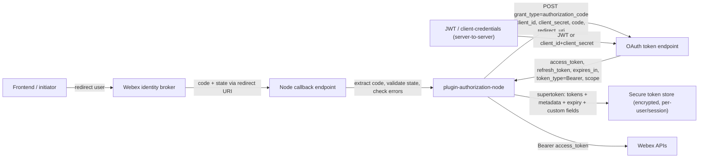
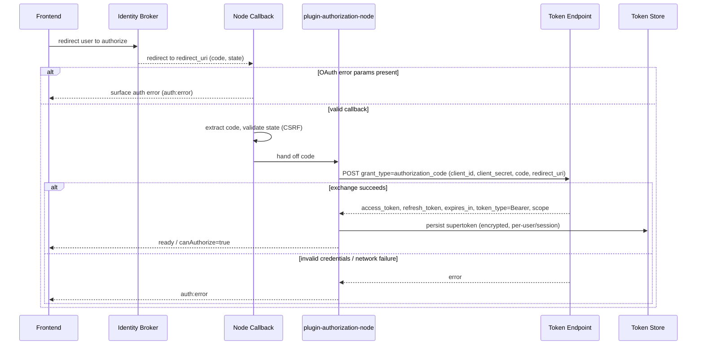
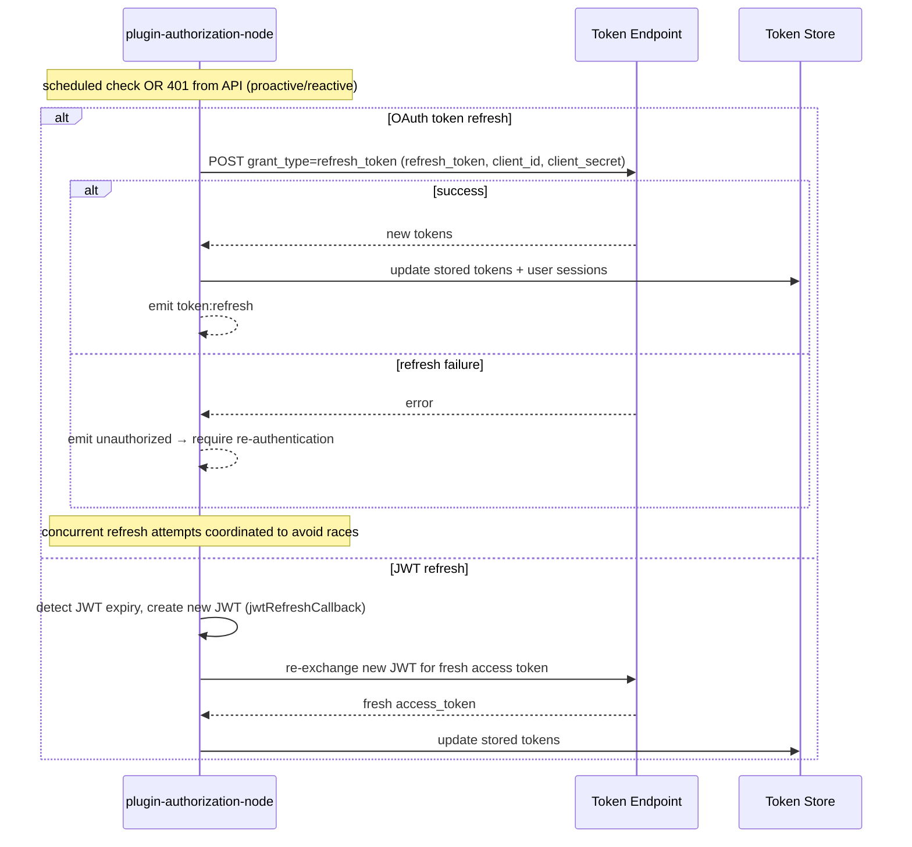
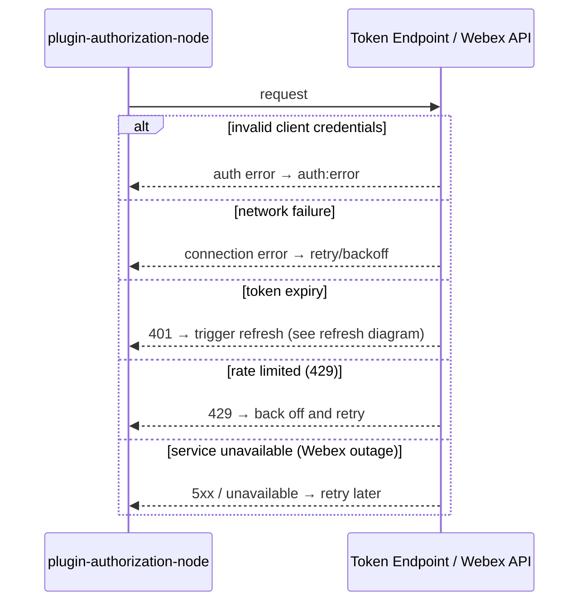
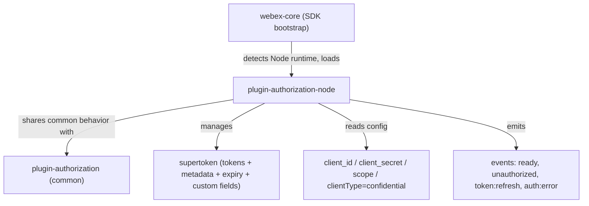

# plugin-authorization-node — SPEC

> Start here → root [`AGENTS.md`](../../../../AGENTS.md) (agent entry) · router [`SPEC_INDEX.md`](../../../../ai-docs/SPEC_INDEX.md) · system [`ARCHITECTURE.md`](../../../../ai-docs/ARCHITECTURE.md). This is the module's canonical spec: orientation, requirements, design, flows, state, protocol, UI, data, and tests. (Multi-repo: the root `AGENTS.md` may be the workspace-level one.)
> Context-efficiency: link to canonical docs — don't duplicate them. Load specs on demand per `SPEC_INDEX.md`.

## Metadata
| Field | Value |
|---|---|
| Module id | `plugin-authorization-node` |
| Source path(s) | `packages/@webex/plugin-authorization-node/` |
| Doc kind | Module spec |
| Coverage score | 56% (9/16) assessed 2026-07-28; critical 5/8; Provides contract self-flagged unverified, all requirements WEAK, no test evidence — stays Partial |
| Generated from | `module-spec` @ SDLC template library `0.2.1` |
| generated_by / approved_by / updated_at | generated_by: module-spec · approved_by: unassigned · updated_at: 2026-07-28 |
| Validation status | not-run |

Coverage score: `Pending coverage assessment` before the first report; after assessment, replace with
`<0-100%>` plus the assessment date and short evidence summary. Do not link or cite local generated
coverage or validation report paths from this committed metadata. Manifest coverage state for this
module is **Partial** (assess-only migration; the code under `packages/@webex/plugin-authorization-node/`
is the source of truth). Keep manifest coverage state outside the rendered module doc metadata.

## Evidence Rules
Every generated requirement below must cite concrete source evidence using `file path`. Separate source
evidence, test evidence, examples, assumptions, and gaps so validators and future agents can distinguish
truth from context. Test evidence is preferred for WHY. Commit evidence is allowed only when the
repository policy says history is reliable, and must include the commit hash. If evidence is missing or
conflicting, ask a focused discovery question before finalizing the requirement; record unresolved answers
as approved unknowns only when the human explicitly defers or does not know.

Because this is an assess-only migration, requirements below are transcribed from the routed guide by
meaning; their WHAT/WHY are cited to the guide, test evidence is `None found`, and confidence is `WEAK`
until each behavior is verified against implementation and tests.

## Source Material Register
| Source material | Scope | Decision | Detail location or disposition |
|---|---|---|---|
| `packages/@webex/plugin-authorization-node/NODE-OAUTH-FLOW-GUIDE.md` (routed; migrate-existing; retain) | overview / architecture | used / migrated by meaning | Node initialization, OAuth flow types, auth-code exchange, server-side token storage/validation, refresh handling, events, and error scenarios migrated into Overview, Requirements, Data Flow, Sequence Diagram(s), Use Cases, and Error Handling & Failure Modes below (in prose/tables, not merely linked). |

## Overview
`plugin-authorization-node` owns OAuth authorization for the Webex JS SDK when it runs in a **Node.js
(server-side) runtime**. Unlike the browser authorization plugin, it holds a **confidential** client that
can safely keep a `client_secret` server-side, so it defaults to the Authorization Code Grant flow and can
additionally perform server-to-server flows (JWT and Client Credentials) that require no interactive user
redirect.

The SDK auto-loads this plugin: when it detects a Node.js runtime it loads `@webex/plugin-authorization-node`
and defaults the flow type to Authorization Code Grant with `clientType: 'confidential'`. A maintainer
starts at the plugin package (`packages/@webex/plugin-authorization-node/`) and its README; the SDK bootstrap
that wires plugins lives in `packages/@webex/webex-core/src/webex-core.js`, and behavior common to both the
browser and Node authorization plugins is documented in `packages/@webex/plugin-authorization/README.md`.

Because the Node environment has no browser and cannot redirect users, interactive user login must be driven
by a separate frontend; Node's responsibility begins at the redirect-URI callback endpoint (extracting the
authorization `code`), the token exchange, secure server-side token storage, token validation, refresh
monitoring/renewal, and the lifecycle/auth events the SDK emits.

## Purpose / Responsibility
Owns server-side OAuth authorization for the Webex SDK in Node.js: confidential-client Authorization Code
Grant exchange, JWT and Client Credentials server-to-server flows, secure token storage/validation, and
token/JWT refresh. Does NOT own interactive browser login/redirect UI (that requires a separate frontend).

## Stack
JavaScript (Node.js runtime), Webex JS SDK plugin architecture built on `@webex/webex-core`. Test stack is
Jest (`packages/@webex/plugin-authorization-node/jest.config.js`), transpiled via Babel
(`packages/@webex/plugin-authorization-node/babel.config.js`). Build target: the
`@webex/plugin-authorization-node` package.

## Folder / Package Structure
```
packages/@webex/plugin-authorization-node/
├── src/                          # Node authorization plugin implementation
├── test/                         # Jest tests for the plugin
├── README.md                     # Node-specific configuration and usage
├── NODE-OAUTH-FLOW-GUIDE.md      # Routed source guide (migrated by meaning into this spec)
├── package.json                  # Package manifest
├── jest.config.js                # Jest test config
└── babel.config.js               # Babel transpile config
```

## Key Files (source of truth)
| File | Holds |
|---|---|
| `packages/@webex/plugin-authorization-node/src/` | Node authorization plugin implementation (auth-code exchange, JWT/client-credentials flows, token/JWT refresh) — read the code; do not infer parameter names from this spec |
| `packages/@webex/plugin-authorization-node/README.md` | Node-specific configuration (`client_id`, `client_secret`, `scope`, `clientType`) and usage |
| `packages/@webex/webex-core/src/webex-core.js` | SDK bootstrap that detects the Node runtime and auto-loads this plugin |
| `packages/@webex/plugin-authorization/README.md` | Authorization behavior common to browser and Node plugins |

## Public Surface
Consumed as an SDK plugin: applications initialize `webex` and interact through the authorization plugin's
methods, status accessors, and emitted events rather than a network endpoint. Exact exported symbols are
authoritative in the source; the guide-level surface is captured below.

| Contract ID | Type | Surface | Purpose | Compatibility / deprecation | Schema / detail link | Root index |
|---|---|---|---|---|---|---|
| `plugin-authorization-node.init` | SDK | Webex init config: `client_id`, `client_secret`, `scope`, `clientType: 'confidential'` | Configure server-side confidential-client OAuth | See package README | `packages/@webex/plugin-authorization-node/README.md` | `../../../../ai-docs/SPEC_INDEX.md` |
| `plugin-authorization-node.status` | SDK | `webex.canAuthorize`, `webex.credentials.supertoken`, `webex.ready` | Query authentication/readiness state | See package README | `packages/@webex/plugin-authorization-node/README.md` | `../../../../ai-docs/SPEC_INDEX.md` |
| `plugin-authorization-node.events` | event | `ready`, `unauthorized`, `token:refresh`, `auth:error` | Observe lifecycle and auth state changes | See package README | `packages/@webex/plugin-authorization-node/README.md` | `../../../../ai-docs/SPEC_INDEX.md` |
| `plugin-authorization-node.jwtRefreshCallback` | SDK | `jwtRefreshCallback` | Automate JWT renewal/re-exchange | See package README | `packages/@webex/plugin-authorization-node/README.md` | `../../../../ai-docs/SPEC_INDEX.md` |

Compatibility notes:
- Symbol/parameter names above are transcribed from the routed guide; confirm against `src/` before treating them as a stable contract.

## Requires (dependencies)
- `@webex/webex-core` (`packages/@webex/webex-core/src/webex-core.js`) — SDK bootstrap, runtime detection, plugin loading.
- Webex OAuth token endpoint and Webex identity broker (external services) — for code/refresh/JWT/client-credentials token exchange.
- Webex service-discovery endpoints — resolved during initialization before `ready`.
- Server infrastructure — a Node.js server environment (this plugin is backend-only).
- Secure token store — database, encrypted files, or a secure key store for token-at-rest persistence.

## Requirements
| ID | WHAT | WHY | Source Evidence | Test / Example Evidence | Assumptions / Gaps | Confidence |
|---|---|---|---|---|---|---|
| `PLUGIN-AUTHORIZATION-NODE-R-001` | Node initialization accepts `client_id`, `client_secret` (required server-side), `scope` (e.g. `'spark:all spark:kms'`), and `clientType: 'confidential'` (default for Node.js) | Server-side confidential client must authenticate with a secret and request scoped permissions | `packages/@webex/plugin-authorization-node/NODE-OAUTH-FLOW-GUIDE.md` | None found | Parameter names unverified against `src/` | WEAK |
| `PLUGIN-AUTHORIZATION-NODE-R-002` | SDK auto-loads `@webex/plugin-authorization-node` on detecting the Node.js runtime and defaults the flow to Authorization Code Grant (confidential client) | Callers get correct server-side behavior without manual plugin selection | `packages/@webex/plugin-authorization-node/NODE-OAUTH-FLOW-GUIDE.md`; `packages/@webex/webex-core/src/webex-core.js` | None found | Detection/loading mechanism unverified | WEAK |
| `PLUGIN-AUTHORIZATION-NODE-R-003` | Node environment stores the client secret server-side, does enhanced server-side token handling, requires NO URL parsing for tokens, and supports server-to-server API auth without user interaction | These are the intended benefits of the Node (vs browser) plugin | `packages/@webex/plugin-authorization-node/NODE-OAUTH-FLOW-GUIDE.md` | None found | none | WEAK |
| `PLUGIN-AUTHORIZATION-NODE-R-004` | Node plugin is backend-only: it cannot perform browser redirects, requires a separate frontend for interactive user auth, and needs a server environment to run | Defines the boundary of what Node can/can't do vs the browser plugin | `packages/@webex/plugin-authorization-node/NODE-OAUTH-FLOW-GUIDE.md` | None found | none | WEAK |
| `PLUGIN-AUTHORIZATION-NODE-R-005` | On the redirect-URI callback endpoint, extract `code` from the query string, validate `state` for CSRF, and check for OAuth error parameters | Safely accept the authorization code returned to the server | `packages/@webex/plugin-authorization-node/NODE-OAUTH-FLOW-GUIDE.md` | None found | Endpoint wiring is application-supplied | WEAK |
| `PLUGIN-AUTHORIZATION-NODE-R-006` | Authorization-code token exchange POSTs to the OAuth token endpoint with `grant_type=authorization_code`, `client_id`, `client_secret`, `code`, and `redirect_uri` (must match the registered URI) | Exchange the code for tokens using the confidential client's secret | `packages/@webex/plugin-authorization-node/NODE-OAUTH-FLOW-GUIDE.md` | None found | none | WEAK |
| `PLUGIN-AUTHORIZATION-NODE-R-007` | A successful token response provides `access_token`, `refresh_token`, `expires_in`, `token_type` (`"Bearer"`), and `scope` | Callers use these to authorize API calls and schedule renewal | `packages/@webex/plugin-authorization-node/NODE-OAUTH-FLOW-GUIDE.md` | None found | none | WEAK |
| `PLUGIN-AUTHORIZATION-NODE-R-008` | JWT flow (server-to-server for guest/bot): create a JWT with guest issuer credentials, exchange the JWT for a Webex access token, then use the token for API calls | Enables guest/bot access without an interactive user | `packages/@webex/plugin-authorization-node/NODE-OAUTH-FLOW-GUIDE.md` | None found | JWT method names unverified | WEAK |
| `PLUGIN-AUTHORIZATION-NODE-R-009` | Client Credentials flow (server-to-server, no user context): request a token directly using `client_id` + `client_secret`, with no user involvement, typically restricted to bot/integration scopes | Enables pure server-to-server auth for restricted scopes | `packages/@webex/plugin-authorization-node/NODE-OAUTH-FLOW-GUIDE.md` | None found | none | WEAK |
| `PLUGIN-AUTHORIZATION-NODE-R-010` | Tokens are stored securely (database, encrypted files, or secure key stores), associated with user accounts and sessions, and encrypted at rest | Protect long-lived credentials held server-side | `packages/@webex/plugin-authorization-node/NODE-OAUTH-FLOW-GUIDE.md` | None found | Storage is application responsibility | WEAK |
| `PLUGIN-AUTHORIZATION-NODE-R-011` | A supertoken structure carries standard OAuth tokens plus metadata (user info, scope details), calculated expiration tracking, and application-specific custom fields | Enrich raw tokens with the context servers need | `packages/@webex/plugin-authorization-node/NODE-OAUTH-FLOW-GUIDE.md` | None found | Supertoken shape unverified against `src/` | WEAK |
| `PLUGIN-AUTHORIZATION-NODE-R-012` | Token validation performs expiry checking, scope verification, refresh triggering near expiry, and error handling of invalid/revoked tokens | Ensure only valid, sufficiently-scoped tokens are used | `packages/@webex/plugin-authorization-node/NODE-OAUTH-FLOW-GUIDE.md` | None found | none | WEAK |
| `PLUGIN-AUTHORIZATION-NODE-R-013` | Expiration is monitored via scheduled checks, watching API responses for `401`, proactive refresh before expiry, and retry logic with refreshed tokens | Avoid failed calls due to expired tokens | `packages/@webex/plugin-authorization-node/NODE-OAUTH-FLOW-GUIDE.md` | None found | none | WEAK |
| `PLUGIN-AUTHORIZATION-NODE-R-014` | Refresh POSTs to the token endpoint with `grant_type=refresh_token`, `refresh_token`, `client_id`, and `client_secret` | Renew access without re-authenticating the user | `packages/@webex/plugin-authorization-node/NODE-OAUTH-FLOW-GUIDE.md` | None found | none | WEAK |
| `PLUGIN-AUTHORIZATION-NODE-R-015` | Refresh-response handling updates stored tokens, updates user sessions, re-authenticates the user on refresh failure, and handles concurrent refresh attempts | Keep sessions consistent and recover from failed/racing refreshes | `packages/@webex/plugin-authorization-node/NODE-OAUTH-FLOW-GUIDE.md` | None found | Concurrency strategy unverified | WEAK |
| `PLUGIN-AUTHORIZATION-NODE-R-016` | JWT refresh monitors JWT expiry, auto-renews (creates a new JWT), re-exchanges the new JWT for a fresh access token, and supports a `jwtRefreshCallback` for automation | Keep JWT-based server-to-server sessions alive | `packages/@webex/plugin-authorization-node/NODE-OAUTH-FLOW-GUIDE.md` | None found | none | WEAK |
| `PLUGIN-AUTHORIZATION-NODE-R-017` | The plugin emits `ready` (initialized & ready), `unauthorized` (token invalid/expired), `token:refresh` (token refreshed), and `auth:error` (auth error) events | Callers react to lifecycle and auth-state changes | `packages/@webex/plugin-authorization-node/NODE-OAUTH-FLOW-GUIDE.md` | None found | Event names unverified against `src/` | WEAK |
| `PLUGIN-AUTHORIZATION-NODE-R-018` | Initialization proceeds through phases: module loading → plugin initialization → configuration validation → service discovery → ready | Defines when the SDK is safe to use | `packages/@webex/plugin-authorization-node/NODE-OAUTH-FLOW-GUIDE.md` | None found | none | WEAK |
| `PLUGIN-AUTHORIZATION-NODE-R-019` | Auth status is exposed via `webex.canAuthorize`, `webex.credentials.supertoken`, and `webex.ready` | Let callers gate requests on readiness/authorization | `packages/@webex/plugin-authorization-node/NODE-OAUTH-FLOW-GUIDE.md` | None found | Accessor shapes unverified | WEAK |

## Design Overview
The plugin is a confidential OAuth client for the SDK. On boot, `webex-core` detects the Node runtime and
loads this plugin, which validates the confidential-client configuration (`client_id`, `client_secret`,
`scope`, `clientType`), performs service discovery, then becomes `ready`. It deliberately splits
responsibilities: interactive login is external (a frontend drives the redirect), while the plugin handles
the trust-sensitive parts that must stay server-side — exchanging the authorization `code` with the secret,
minting/validating tokens, and refreshing them.

Three flow types are supported. Authorization Code Grant is primary and involves a frontend redirect plus a
server-side exchange. JWT and Client Credentials are server-to-server flows with no user interaction: JWT for
guest/bot issuers, Client Credentials for direct `client_id`+`client_secret` token requests restricted to
bot/integration scopes. Tokens are captured in an enriched supertoken structure and are expected to be
persisted securely, validated on use, and refreshed proactively (including scheduled checks and reactive `401`
handling), with JWT sessions renewed via `jwtRefreshCallback`.

## Data Flow


## Sequence Diagram(s)
Sequence coverage:

| Operation group | Diagram | Failure / recovery coverage |
|---|---|---|
| Authorization-code exchange | Auth-code exchange | OAuth error params / invalid credentials / network failure branches |
| Token refresh (OAuth + JWT) | Refresh | Refresh failure → re-authenticate; concurrent refresh handling; JWT re-exchange |
| Error / failure paths | Node error paths | Invalid credentials, network failure, token expiry, rate limiting (429), service unavailability |







## Class / Component Relationships

The SDK core (`webex-core`) selects and initializes `plugin-authorization-node` for confidential server-side
clients; the plugin shares common authorization concepts with `plugin-authorization` and owns the supertoken
lifecycle and the auth event surface.

## Use Cases
- **UC-1 Server-side login completion:** Frontend redirects user to Webex → identity broker returns `code`+`state` to the Node callback → plugin extracts `code`, validates `state`, exchanges it (with `client_secret`) for tokens → persists supertoken → emits `ready`. Evidence: `packages/@webex/plugin-authorization-node/NODE-OAUTH-FLOW-GUIDE.md`; test evidence None found.
- **UC-2 Guest/bot JWT auth:** Server creates a JWT with guest issuer credentials → exchanges JWT for a Webex access token → uses token for API calls; renews via `jwtRefreshCallback`. Evidence: `packages/@webex/plugin-authorization-node/NODE-OAUTH-FLOW-GUIDE.md`; test evidence None found.
- **UC-3 Client-credentials (no user):** Server requests a token directly with `client_id`+`client_secret` (bot/integration scopes) → uses token server-to-server. Evidence: `packages/@webex/plugin-authorization-node/NODE-OAUTH-FLOW-GUIDE.md`; test evidence None found.
- **UC-4 Proactive/reactive refresh:** Scheduled expiry check or an API `401` triggers a `refresh_token` exchange → stored tokens and sessions updated → `token:refresh` emitted; on failure, `unauthorized` → re-authenticate. Evidence: `packages/@webex/plugin-authorization-node/NODE-OAUTH-FLOW-GUIDE.md`; test evidence None found.

## Error Handling & Failure Modes
| Condition | Signal (error/code/result) | Caller recovery |
|---|---|---|
| Invalid client credentials (wrong `client_id`/`client_secret`) | `auth:error` event / auth failure | Correct credentials and re-initialize; do not retry blindly |
| Network failures (connection issues to Webex APIs) | Connection/transport error | Retry with backoff once connectivity returns |
| Token expiry | `401 Unauthorized` on API responses; `unauthorized` event | Trigger refresh flow, retry request with refreshed token |
| Rate limiting | HTTP `429` | Back off and retry per rate-limit guidance |
| Service unavailability (Webex outages) | Service error / `5xx` / unavailable | Retry later; surface degraded state to caller |
| OAuth error parameters on callback | Error params in redirect query string | Surface auth error, do not attempt code exchange |
| Refresh failure | Refresh request error; `unauthorized` event | Re-authenticate the user (new authorization flow) |

## Pitfalls
- `redirect_uri` in the token exchange MUST match the registered URI exactly, or the exchange fails.
- The `state` parameter must be validated on the callback for CSRF protection before using the `code`.
- Node cannot redirect users — interactive login requires a separate frontend; the plugin only handles the server-side callback and exchange.
- The `client_secret` must remain server-side; never expose it to a browser or client bundle.
- Concurrent refresh attempts can race — coordinate them so multiple in-flight requests don't each mint conflicting tokens.
- A `401` may mean expiry (refresh) or revocation (re-authenticate) — distinguish before blindly retrying.
- Tokens must be encrypted at rest and associated with the correct user/session; storage is the application's responsibility, not the plugin's.

## Test-Case Strategy (module)
Unit boundaries should cover each flow and lifecycle branch with a positive AND a negative case: auth-code
exchange (valid `code` → tokens persisted; invalid credentials / OAuth error params → `auth:error`); refresh
(valid `refresh_token` → tokens updated + `token:refresh`; refresh failure → `unauthorized` /
re-authenticate; concurrent refresh → single coherent result); JWT flow (valid JWT → access token; expiry →
re-exchange via `jwtRefreshCallback`); client-credentials (valid secret → scoped token; wrong secret →
`auth:error`); status accessors (`canAuthorize`, `ready`, `credentials.supertoken`) reflecting init phases;
and error paths for `401`, `429`, network failure, and service unavailability. Tests live under
`packages/@webex/plugin-authorization-node/test/`.

| Behavior / Requirement | Existing test evidence | Gap |
|---|---|---|
| `PLUGIN-AUTHORIZATION-NODE-R-001` (init params) | None found | No verification of config validation |
| `PLUGIN-AUTHORIZATION-NODE-R-002` (auto-load / default flow) | None found | No runtime-detection test cited |
| `PLUGIN-AUTHORIZATION-NODE-R-005`/`R-006`/`R-007` (auth-code exchange) | None found | Missing positive + error-param negative cases |
| `PLUGIN-AUTHORIZATION-NODE-R-008` (JWT flow) | None found | No guest/bot JWT test cited |
| `PLUGIN-AUTHORIZATION-NODE-R-009` (client credentials) | None found | No server-to-server token test cited |
| `PLUGIN-AUTHORIZATION-NODE-R-010`/`R-011`/`R-012` (storage/supertoken/validation) | None found | Missing expiry/scope/revocation cases |
| `PLUGIN-AUTHORIZATION-NODE-R-013`–`R-016` (refresh + JWT refresh) | None found | Missing concurrent-refresh and failure cases |
| `PLUGIN-AUTHORIZATION-NODE-R-017`/`R-018`/`R-019` (events/init phases/status) | None found | No event-emission or status-accessor test cited |

## Traceability
- Repo architecture: `../../../../ai-docs/ARCHITECTURE.md` · Registry: `../../../../ai-docs/SPEC_INDEX.md`
- Coverage state & contracts baseline: `.sdd/manifest.json`
- Routed source (retained): `packages/@webex/plugin-authorization-node/NODE-OAUTH-FLOW-GUIDE.md`
- Related code: `packages/@webex/plugin-authorization-node/README.md`, `packages/@webex/webex-core/src/webex-core.js`, `packages/@webex/plugin-authorization/README.md`
