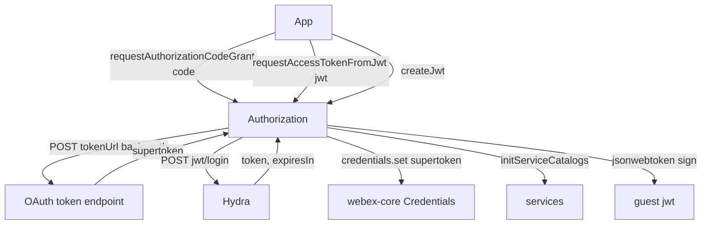
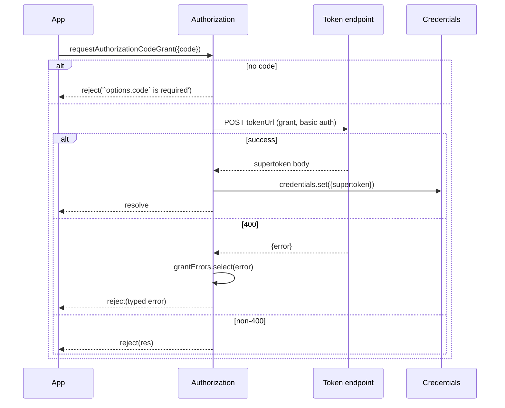
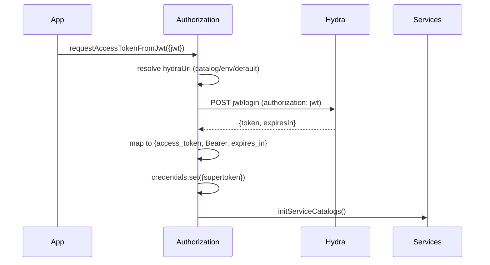

<!-- sdd-generated-metadata
generator: claude-cli
generator_model: us.anthropic.claude-opus-4-8
approved_by: pending-human-review
updated_at: 2026-08-06T00:00:00Z
validation_status: not-run
run_id: 51855eac-8de5-43a2-a3b6-dbcc55ebc91b
-->

# @webex/plugin-authorization-node — SPEC

> Start here → root [`AGENTS.md`](../../../../AGENTS.md) (agent entry) · router [`SPEC_INDEX.md`](../../../../ai-docs/SPEC_INDEX.md) · system [`ARCHITECTURE.md`](../../../../ai-docs/ARCHITECTURE.md). This is the module's canonical spec: orientation, requirements, design, flows, state, and tests.
> Context-efficiency: link to canonical docs — don't duplicate them. Load specs on demand per `SPEC_INDEX.md`.

## Metadata

| Field | Value |
|---|---|
| Module id | `plugin-authorization-node` |
| Source path(s) | `packages/@webex/plugin-authorization-node/src/` |
| Parent spec | `—` (registered `authorization` plugin for Node; composed by `webex-core`, no parent module) |
| Doc kind | Module spec |
| Coverage score | Pending coverage assessment |
| Generated from | `module-spec` @ SDLC template library `0.2.2` |
| generated_by / approved_by / updated_at | claude-cli / pending-human-review / 2026-08-06 |
| Validation status | not-run, validator `pending`, assessed 2026-08-06 |

Coverage score is `Pending coverage assessment` until the first coverage review runs. Manifest coverage
state (`Partial`) is authoritative and kept in `.sdd/manifest.json`.

## Evidence Rules
Every requirement cites concrete source evidence using `file path`. Test evidence is preferred for WHY.
Requirements are grounded in the current implementation under `src/` and its unit tests. The retained
`NODE-OAUTH-FLOW-GUIDE.md` is a protected reference source (context-only), not a migrated spec.

## Source Material Register

| Source material | Scope | Decision | Detail location or disposition |
|---|---|---|---|
| `NODE-OAUTH-FLOW-GUIDE.md` (package root) | overview / API | reference-only | Retained protected guide; linked as background, not copied into this spec. |

## Overview

`@webex/plugin-authorization-node` provides Node/server-side OAuth2 support for the Webex SDK, registered
as the `authorization` plugin (namespace `Credentials`). It implements the confidential-client flows a
backend uses: exchanging an authorization code for an access token, obtaining a Webex token from a
backend-issued JWT (for users already authenticated in the host product), minting guest JWTs, and
logout.

The plugin (`src/authorization.js`, a `WebexPlugin`) tracks a single boolean session flag `isAuthorizing`
(aliased by the derived `isAuthenticating`), both proxied onto `webex`. It uses `@webex/webex-core`
`grantErrors` to map 400 responses to typed OAuth errors and `jsonwebtoken` to sign guest tokens. A
maintainer should start at `src/authorization.js`; `src/config.js` supplies the (empty) default
`credentials` config.

Unlike the browser package, there is no URL/hash parsing or CSRF/PKCE handling — Node flows are driven by
explicit method calls with client credentials.

## Purpose / Responsibility

Owns Node-side OAuth2 token acquisition for confidential clients: authorization-code grant, JWT-login
token exchange, guest JWT creation, and logout. It does NOT own browser redirect/hash parsing, CSRF/PKCE,
device (QR) authorization, or the credentials/token storage itself (that lives in `webex-core`
`Credentials`).

## Stack

JavaScript (Babel, legacy decorators), built with `webex-legacy-tools`. Uses `jsonwebtoken` (guest JWT
signing) and `uuid`. Tested with `@webex/test-helper-chai`, `@webex/test-helper-mocha`,
`@webex/test-helper-mock-webex`, `@webex/test-helper-appid`, and `sinon` (unit via jest, integration via
mocha). Runtime dependencies: `@webex/webex-core`, `@webex/common`, `@webex/internal-plugin-device`.
Evidence: `packages/@webex/plugin-authorization-node/package.json`.

## Folder / Package Structure

```
packages/@webex/plugin-authorization-node/src/
├── index.js           # imports internal device plugin; registerPlugin('authorization', ...) with proxies
├── authorization.js   # Authorization WebexPlugin: code grant, JWT login, createJwt, logout
└── config.js          # default { credentials: {} } config
```

## Key Files (source of truth)

| File | Holds |
|---|---|
| `packages/@webex/plugin-authorization-node/src/authorization.js` | All flows, `isAuthorizing` session flag, `oneFlight`/`whileInFlight` decorators, grant-error mapping |
| `packages/@webex/plugin-authorization-node/src/index.js` | Registration name (`authorization`) and proxied properties (`isAuthorizing`, `isAuthenticating`) |
| `packages/@webex/plugin-authorization-node/src/config.js` | Default plugin config (`credentials: {}`) |

## Public Surface

Consumed as the `authorization` plugin (`webex.authorization`) in Node. Talks to the OAuth token endpoint
and Hydra JWT-login.

| Contract ID | Type | Surface | Purpose | Compatibility / deprecation | Schema / detail link | Root index |
|---|---|---|---|---|---|---|
| `authorization.requestAuthorizationCodeGrant` | SDK/HTTP | `requestAuthorizationCodeGrant({code}): Promise` | Exchange an auth code for a supertoken (confidential client) | Stable; `@oneFlight`+`@whileInFlight` | `packages/@webex/plugin-authorization-node/src/authorization.js` | `../../../../ai-docs/CONTRACTS.md` |
| `authorization.requestAccessTokenFromJwt` | SDK/HTTP | `requestAccessTokenFromJwt({jwt}): Promise` | Exchange a backend JWT for a Webex token via Hydra `jwt/login` | Stable; `@oneFlight` | `packages/@webex/plugin-authorization-node/src/authorization.js` | `../../../../ai-docs/CONTRACTS.md` |
| `authorization.createJwt` | SDK | `createJwt({issuer, secretId, displayName?, expiresIn}): Promise<{jwt}>` | Sign a guest-user JWT (HS256) | Stable | `packages/@webex/plugin-authorization-node/src/authorization.js` | `../../../../ai-docs/CONTRACTS.md` |
| `authorization.logout` | SDK/HTTP | `logout({token}): void` | POST to the configured logout URL | Stable | `packages/@webex/plugin-authorization-node/src/authorization.js` | `../../../../ai-docs/CONTRACTS.md` |
| `authorization.isAuthorizing` | SDK | proxied boolean session flag (+`isAuthenticating` alias) | Indicate an in-flight code exchange | Stable proxied state | `packages/@webex/plugin-authorization-node/src/authorization.js` | `../../../../ai-docs/CONTRACTS.md` |

Compatibility notes:
- Method names/signatures and the `{jwt}` return shape of `createJwt` are the consumer contract.
- `isAuthorizing`/`isAuthenticating` are proxied onto the `webex` instance.

## Requires (dependencies)

- `@webex/webex-core` — base `WebexPlugin`, `registerPlugin`, `webex.request`, `webex.credentials.set`,
  `grantErrors`, and `webex.internal.services` (Hydra URL + catalog init).
- `@webex/common` — `oneFlight` and `whileInFlight` decorators.
- `@webex/internal-plugin-device` — imported so device context is available.
- `jsonwebtoken` — signs guest JWTs (`createJwt`). `uuid` — guest subject/name generation.
- OAuth token endpoint (`config.tokenUrl`), logout endpoint (`config.logoutUrl`), and Hydra `jwt/login`.

## Requirements

| ID | WHAT | WHY | Source Evidence | Test / Example Evidence | Assumptions / Gaps | Confidence |
|---|---|---|---|---|---|---|
| `AUTHORIZATION-NODE-R-001` | `requestAuthorizationCodeGrant({code})` rejects when `code` is missing, else POSTs to `config.tokenUrl` with `grant_type:authorization_code`, `redirect_uri`, `code`, `self_contained_token:true`, and basic auth (`client_id`/`client_secret`), then sets `credentials.supertoken` from the body. | Confidential-client code exchange is the primary server login flow. | `packages/@webex/plugin-authorization-node/src/authorization.js` | `packages/@webex/plugin-authorization-node/test/unit/spec/authorization.js` | none identified | PRESENT |
| `AUTHORIZATION-NODE-R-002` | On a 400 from the token exchange, the error body's `error` is mapped via `grantErrors.select` to a typed error and rejected; non-400 responses reject as-is. | Consumers need typed OAuth grant errors. | `packages/@webex/plugin-authorization-node/src/authorization.js` | `packages/@webex/plugin-authorization-node/test/unit/spec/authorization.js` | none identified | PRESENT |
| `AUTHORIZATION-NODE-R-003` | `requestAccessTokenFromJwt({jwt})` resolves the Hydra URI (services catalog → `HYDRA_SERVICE_URL` env → default), POSTs `jwt/login` with the jwt as the `authorization` header, maps `{token, expiresIn}` to `{access_token, token_type:'Bearer', expires_in}`, sets the supertoken, and re-inits service catalogs. | Products with their own auth can exchange a backend JWT for a Webex token. | `packages/@webex/plugin-authorization-node/src/authorization.js` | `packages/@webex/plugin-authorization-node/test/unit/spec/authorization.js` | none identified | PRESENT |
| `AUTHORIZATION-NODE-R-004` | `createJwt({issuer, secretId, displayName?, expiresIn})` base64-decodes `secretId`, builds a payload with `sub: guest-user-{uuid}`, `iss: issuer`, `name: displayName || 'Guest User - {uuid}'`, signs with `expiresIn`, and resolves `{jwt}`; signing errors reject. | Guest access requires a signed guest-user JWT. | `packages/@webex/plugin-authorization-node/src/authorization.js` | `packages/@webex/plugin-authorization-node/test/unit/spec/authorization.js` | none identified | PRESENT |
| `AUTHORIZATION-NODE-R-005` | `logout({token})` POSTs to `config.logoutUrl` with `{token, cisService: config.service}`. | Server logout must notify the OAuth service. | `packages/@webex/plugin-authorization-node/src/authorization.js` | `packages/@webex/plugin-authorization-node/test/unit/spec/authorization.js` | Fire-and-forget; return not awaited | PRESENT |
| `AUTHORIZATION-NODE-R-006` | `isAuthorizing` (session boolean) is set during the code exchange via `@whileInFlight('isAuthorizing')`, exposed via the derived `isAuthenticating`, and both are proxied onto `webex`; `@oneFlight` collapses concurrent exchanges. | Callers must observe in-flight auth and avoid duplicate exchanges. | `packages/@webex/plugin-authorization-node/src/authorization.js`, `packages/@webex/plugin-authorization-node/src/index.js` | `packages/@webex/plugin-authorization-node/test/unit/spec/authorization.js` | none identified | PRESENT |

## Design Overview

`Authorization` extends `WebexPlugin` with namespace `Credentials`. It holds one `session` boolean
`isAuthorizing` and a `derived` alias `isAuthenticating` that mirrors it; `index.js` registers the plugin
and proxies both flags onto the `webex` instance. The two token-acquisition methods share a pattern:
validate input, POST to an endpoint with client credentials, and store the result via
`webex.credentials.set({supertoken})`.

`requestAuthorizationCodeGrant` is decorated with `@whileInFlight('isAuthorizing')` (to expose in-flight
state) and `@oneFlight` (to collapse concurrent calls into one request), and maps 400 responses through
`grantErrors.select`. `requestAccessTokenFromJwt` is `@oneFlight`, resolves the Hydra base URI from the
services catalog with env/default fallbacks, and re-initializes service catalogs after setting the token.
`createJwt` is a pure local signing helper using `jsonwebtoken`. `logout` is a fire-and-forget POST to the
configured logout URL.

## Data Flow



## Sequence Diagram(s)

There are three distinct operation groups (code grant, JWT login, guest JWT) with different endpoints and
outcomes. The two network flows share a "set supertoken" tail but differ in endpoint and error mapping,
so the code-grant flow (with its 400 mapping branch) and the JWT-login flow are shown; `createJwt` is a
local, non-network helper described in Use Cases.

Sequence coverage:

| Operation group | Diagram | Failure / recovery coverage |
|---|---|---|
| Authorization code grant | 1. Code grant | `alt` covers missing code, 400 grant-error mapping, and non-400 reject |
| JWT login exchange | 2. JWT login | Hydra URI fallback shown; request errors propagate |

### 1. Code grant



### 2. JWT login



## Class / Component Relationships

```mermaid
classDiagram
    class WebexPlugin
    class Authorization {
      +isAuthorizing: boolean (session)
      +isAuthenticating (derived)
      +requestAuthorizationCodeGrant(options)
      +requestAccessTokenFromJwt({jwt})
      +createJwt(options)
      +logout(options)
    }
    WebexPlugin <|-- Authorization
    Authorization ..> Credentials : set supertoken
    Authorization ..> grantErrors : map 400
```

`Authorization` extends `WebexPlugin`, sets tokens on `webex.credentials`, and maps OAuth errors via
`grantErrors`.

## Use Cases

- **UC-1 Server authorization-code login:** backend receives `code` → `requestAuthorizationCodeGrant({code})`
  → supertoken stored. Evidence: `packages/@webex/plugin-authorization-node/src/authorization.js`.
- **UC-2 JWT-based login:** product with its own auth issues a JWT → `requestAccessTokenFromJwt({jwt})`
  → Webex token stored and catalogs re-initialized. Evidence:
  `packages/@webex/plugin-authorization-node/src/authorization.js`.
- **UC-3 Guest token:** `createJwt({issuer, secretId, expiresIn})` → signed guest JWT for guest access.
  Evidence: `packages/@webex/plugin-authorization-node/src/authorization.js`.

## State Model

The only client-side state is the `session` boolean `isAuthorizing` (default `false`), set true for the
duration of a code exchange by `@whileInFlight` and read via the derived `isAuthenticating`. Both are
proxied onto `webex`. No other persistent state is held here; tokens live on `webex.credentials`.
Evidence: `packages/@webex/plugin-authorization-node/src/authorization.js`,
`packages/@webex/plugin-authorization-node/src/index.js`.

## Concurrency & Reactive Flow

`requestAuthorizationCodeGrant` is guarded by `@oneFlight` (concurrent calls share one in-flight request)
and `@whileInFlight('isAuthorizing')` (flag toggled around the call); `requestAccessTokenFromJwt` is
`@oneFlight`. These decorators from `@webex/common` provide the module's only concurrency control; there
is no other shared mutable state. Evidence: `packages/@webex/plugin-authorization-node/src/authorization.js`.

## Error Handling & Failure Modes

| Condition | Signal (error/code/result) | Caller recovery |
|---|---|---|
| Missing `code` | `Promise.reject(Error('`options.code` is required'))` | Provide the authorization code |
| 400 from token exchange | Rejected with `grantErrors.select(body.error)` typed error | Handle the specific OAuth grant error |
| Non-400 token/HTTP error | Rejected with the raw response | Retry / inspect underlying error |
| `createJwt` signing failure | `Promise.reject(e)` | Verify issuer/secret/expiresIn inputs |

## Pitfalls

- `logout` is fire-and-forget: it issues the POST but the plugin does not await or return it; do not rely
  on its completion. Evidence: `packages/@webex/plugin-authorization-node/src/authorization.js`.
- `requestAccessTokenFromJwt` falls back to `HYDRA_SERVICE_URL` env then a hardcoded default when the
  services catalog lacks Hydra; environment misconfiguration can silently change the target. Evidence:
  `packages/@webex/plugin-authorization-node/src/authorization.js`.
- `self_contained_token: true` is always sent on the code exchange; the returned supertoken bundles
  access+refresh. Evidence: `packages/@webex/plugin-authorization-node/src/authorization.js`.

## Test-Case Strategy (module)

Unit tests (mock-webex + sinon) stub `webex.request`, `webex.credentials.set`, and
`webex.internal.services`, asserting: code grant rejects without a code (negative) and sets the supertoken
on success (positive), 400 responses map to grant errors, JWT login maps the Hydra response and re-inits
catalogs, and `createJwt` returns a signed `{jwt}` while signing errors reject.

| Behavior / Requirement | Existing test evidence | Gap |
|---|---|---|
| `AUTHORIZATION-NODE-R-001` | `packages/@webex/plugin-authorization-node/test/unit/spec/authorization.js` | Assert form fields + basic auth |
| `AUTHORIZATION-NODE-R-002` | `packages/@webex/plugin-authorization-node/test/unit/spec/authorization.js` | Add 400 vs non-400 branches |
| `AUTHORIZATION-NODE-R-003` | `packages/@webex/plugin-authorization-node/test/unit/spec/authorization.js` | Add Hydra URI fallback cases |
| `AUTHORIZATION-NODE-R-004` | `packages/@webex/plugin-authorization-node/test/unit/spec/authorization.js` | Assert payload + error reject |
| `AUTHORIZATION-NODE-R-005` | `packages/@webex/plugin-authorization-node/test/unit/spec/authorization.js` | Assert logout body |
| `AUTHORIZATION-NODE-R-006` | `packages/@webex/plugin-authorization-node/test/unit/spec/authorization.js` | Assert isAuthorizing toggling + oneFlight |

## Traceability

- Repo architecture: [`ARCHITECTURE.md`](../../../../ai-docs/ARCHITECTURE.md) · Registry: [`SPEC_INDEX.md`](../../../../ai-docs/SPEC_INDEX.md)
- Aggregator: `packages/@webex/plugin-authorization/ai-docs/plugin-authorization-spec.md`
- Coverage state & contracts baseline: `.sdd/manifest.json`
