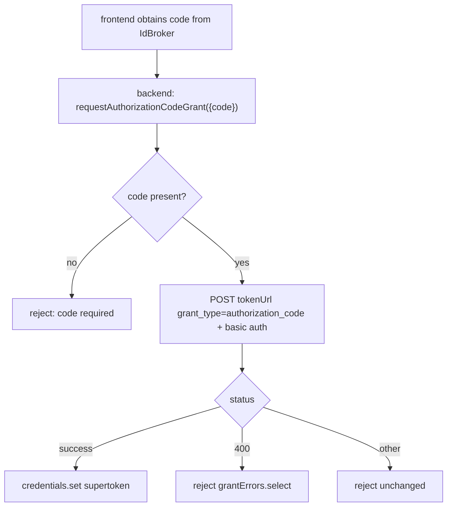
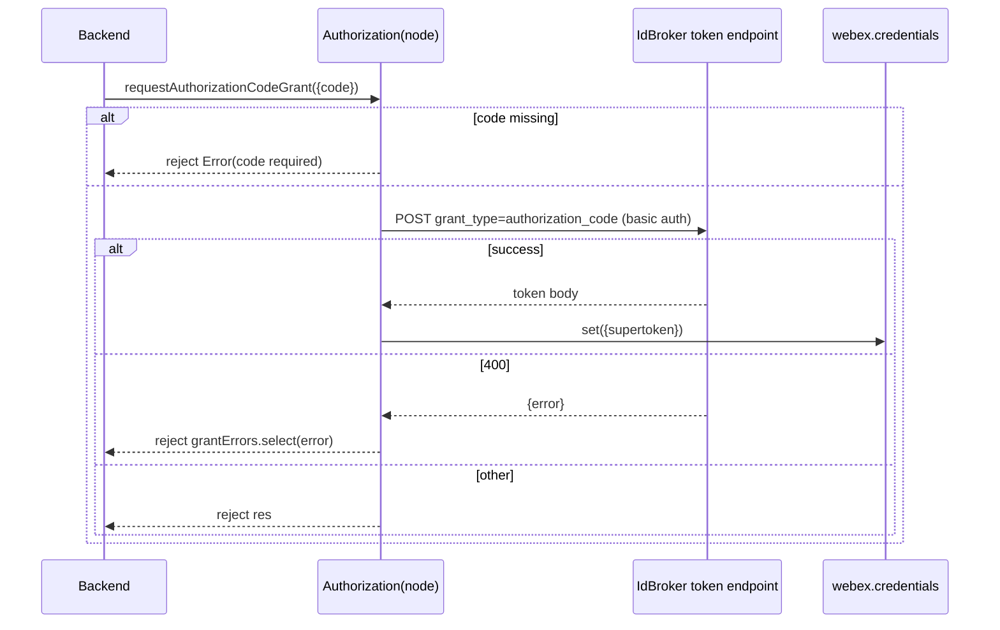
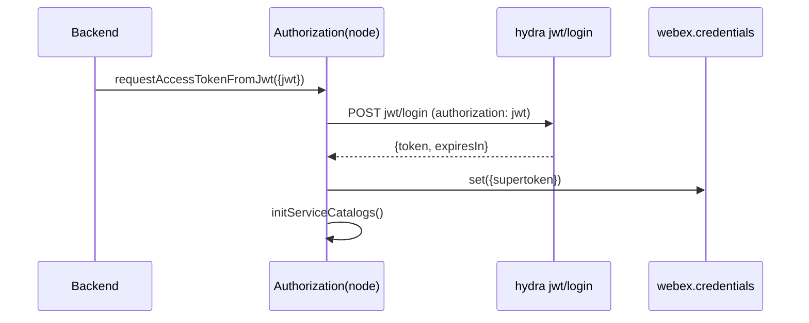
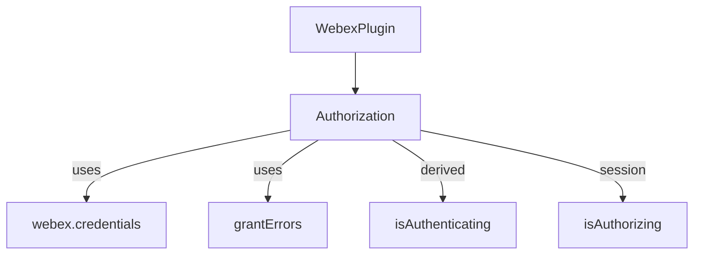

# @webex/plugin-authorization-node — SPEC

> Start here → root [`AGENTS.md`](../../../../AGENTS.md) (agent entry) · router [`SPEC_INDEX.md`](../../../../ai-docs/SPEC_INDEX.md) · system [`ARCHITECTURE.md`](../../../../ai-docs/ARCHITECTURE.md). This is the module's canonical spec.
> Context-efficiency: link to canonical docs — don't duplicate them. Load specs on demand per `SPEC_INDEX.md`.

## Metadata
| Field | Value |
|---|---|
| Module id | `@webex/plugin-authorization-node` |
| Source path(s) | `packages/@webex/plugin-authorization-node/` |
| Doc kind | Module spec |
| Coverage score | Pending coverage assessment |
| Generated from | `module-spec` @ SDLC template library `0.2.1` |
| generated_by / approved_by / updated_at | claude-cli / pending / 2026-07-31T00:00:00Z |
| Validation status | not-run |

Coverage score is `Pending coverage assessment` until the first coverage review. Manifest coverage state is authoritative in `.sdd/manifest.json`.

## Evidence Rules
Every requirement cites concrete source evidence using `file path`. Migrated from the Node OAuth Flow Guide and package README, verified against `src/authorization.js`.

## Source Material Register
| Source material | Scope | Decision | Detail location or disposition |
|---|---|---|---|
| Node.js OAuth technical guide | overview / architecture / API | used / verified | init/flow/exchange/refresh narrative → Overview, Design Overview, Data Flow, Sequence Diagram(s); verified against `src/authorization.js`. Server-side token-storage guidance placed in Design/Pitfalls as consumer guidance (not module-owned). |
| Node package README | API | used / verified | Method/property tables → Public Surface and Requirements. |

## Overview

`@webex/plugin-authorization-node` provides server-side OAuth2 for the Webex SDK in Node.js. Its primary flow is the Authorization Code Grant: a frontend obtains an authorization code from Webex IdBroker, and the Node backend exchanges that code for tokens using the client secret. It also supports JWT guest authentication and logout. It registers under the `authorization` namespace and holds a single `isAuthorizing` session flag (with `isAuthenticating` as a derived alias).

Because Node can safely hold a client secret, this package performs the confidential-client code exchange that the public browser package cannot. It does not perform browser redirects or URL parsing.

## Purpose / Responsibility

Owns server-side OAuth2 token acquisition: exchange an authorization code for a supertoken using the client secret, exchange guest JWTs, create guest JWTs, and log out. It does NOT redirect users, parse browser URLs, or own token persistence (the consumer's backend and the credentials plugin do).

## Stack

JavaScript with legacy Babel decorators (`@whileInFlight`, `@oneFlight`). Built via `webex-legacy-tools`. Node `>=16`. Depends on `@webex/webex-core`, `@webex/common`, `@webex/internal-plugin-device`, `jsonwebtoken`, `uuid`.

## Folder / Package Structure
```
packages/@webex/plugin-authorization-node/
├── src/
│   ├── index.js          # registerPlugin('authorization', Authorization, {config, proxies})
│   ├── authorization.js  # server OAuth2 plugin (code exchange, JWT, logout)
│   └── config.js         # default { credentials: {} }
├── test/unit/spec/authorization.js       # jest unit suite
└── NODE-OAUTH-FLOW-GUIDE.md              # retained source design guide
```

## Key Files (source of truth)
| File | Holds |
|---|---|
| `packages/@webex/plugin-authorization-node/src/authorization.js` | `requestAuthorizationCodeGrant`, `requestAccessTokenFromJwt`, `createJwt`, `logout` |
| `packages/@webex/plugin-authorization-node/src/config.js` | Default credentials config (`{}`) |
| `packages/@webex/plugin-authorization-node/src/index.js` | Plugin registration + proxied properties |

## Public Surface
| Contract ID | Type | Surface | Purpose | Compatibility / deprecation | Schema / detail link | Root index |
|---|---|---|---|---|---|---|
| `authorization.requestAuthorizationCodeGrant` | SDK | `requestAuthorizationCodeGrant({code})` | exchange auth code for supertoken (client secret) | stable | `src/authorization.js` | `../../../../ai-docs/CONTRACTS.md` |
| `authorization.requestAccessTokenFromJwt` | SDK | `requestAccessTokenFromJwt({jwt})` | exchange guest JWT for access token via hydra | stable | `src/authorization.js` | `../../../../ai-docs/CONTRACTS.md` |
| `authorization.createJwt` | SDK | `createJwt({issuer, secretId, displayName?, expiresIn})` | create guest JWT (HS256) | stable | `src/authorization.js` | `../../../../ai-docs/CONTRACTS.md` |
| `authorization.logout` | SDK | `logout({token?})` | POST to configured logout URL | stable | `src/authorization.js` | `../../../../ai-docs/CONTRACTS.md` |
| `authorization.isAuthorizing` / `.isAuthenticating` | SDK | properties | flow-progress booleans | stable | `src/authorization.js` | `../../../../ai-docs/CONTRACTS.md` |

Compatibility notes:
- Client secret is required for the code exchange and must remain server-side only.

## Requires (dependencies)
- `@webex/webex-core` — `WebexPlugin`, `grantErrors`, `credentials`. `@webex/common` — `oneFlight`, `whileInFlight`. `@webex/internal-plugin-device`. `jsonwebtoken`, `uuid`.
- External: Webex IdBroker token endpoint (`config.tokenUrl`); hydra `jwt/login`; configured `logoutUrl`.

## Requirements
| ID | WHAT | WHY | Source Evidence | Test / Example Evidence | Assumptions / Gaps | Confidence |
|---|---|---|---|---|---|---|
| `PLUGIN-AUTHORIZATION-NODE-R-001` | `requestAuthorizationCodeGrant` rejects when `options.code` is missing, else POSTs `grant_type=authorization_code` with `redirect_uri`, `code`, `self_contained_token:true` and HTTP basic auth (`client_id`/`client_secret`) to `config.tokenUrl`, storing the response as `supertoken`. | Server-side confidential code exchange. | `src/authorization.js` (`requestAuthorizationCodeGrant`) | `test/unit/spec/authorization.js` | — | PRESENT |
| `PLUGIN-AUTHORIZATION-NODE-R-002` | On a 400 response, map `res.body.error` via `grantErrors.select` and reject with the typed error; non-400 responses reject unchanged. | Typed OAuth error handling for callers. | `src/authorization.js` (`requestAuthorizationCodeGrant` catch) | `test/unit/spec/authorization.js` | — | PRESENT |
| `PLUGIN-AUTHORIZATION-NODE-R-003` | `requestAccessTokenFromJwt` POSTs the JWT to `${hydra}jwt/login`, maps to `{access_token, token_type:'Bearer', expires_in}`, stores it, and re-inits service catalogs. | Guest/JWT authentication server-side. | `src/authorization.js` (`requestAccessTokenFromJwt`) | `test/unit/spec/authorization.js` | — | PRESENT |
| `PLUGIN-AUTHORIZATION-NODE-R-004` | `createJwt` signs an HS256 JWT from a base64-decoded `secretId` with a `guest-user-<uuid>` subject and configured `expiresIn`. | Server-side guest token creation. | `src/authorization.js` (`createJwt`) | `test/unit/spec/authorization.js` | — | PRESENT |
| `PLUGIN-AUTHORIZATION-NODE-R-005` | `logout` POSTs `{token, cisService}` to `config.logoutUrl`. | Server-side session termination. | `src/authorization.js` (`logout`) | None found | logout test gap | WEAK |

## Design Overview

The Node plugin is intentionally narrower than the browser one: there is no redirect or URL parsing, so `initialize` behavior is inherited from `WebexPlugin`. The core method is `requestAuthorizationCodeGrant`, decorated with `@whileInFlight('isAuthorizing')` and `@oneFlight` so overlapping/duplicate exchanges collapse into one network request. The exchange sends the client secret via HTTP basic auth and requests a `self_contained_token`, then stores the resulting body as `supertoken`. JWT methods mirror the browser package. Server-side token *storage* (secure store, user association, encryption) is consumer responsibility per the source guide, not owned by this module.

## Data Flow


## Sequence Diagram(s)
Sequence coverage: two operation groups — Authorization Code exchange and JWT guest login. They differ in endpoint and inputs, so separate diagrams; the code-exchange error branches are shown as `alt`.

| Operation group | Diagram | Failure / recovery coverage |
|---|---|---|
| Authorization Code exchange | Code → token | `alt` for missing code, 400 mapped error, other error |
| JWT guest login | JWT → token | rejection propagates |





## Class / Component Relationships


## Use Cases
- **UC-1 Backend code exchange:** frontend redirects user and receives a code → backend calls `requestAuthorizationCodeGrant({code})` → supertoken stored. Evidence: `src/authorization.js`, `NODE-OAUTH-FLOW-GUIDE.md` §3.
- **UC-2 Server-to-server JWT:** backend `createJwt(...)` then `requestAccessTokenFromJwt({jwt})`. Evidence: `src/authorization.js`.

## Business Rules & Invariants
- `options.code` is required for the code exchange (early rejection).
- Client secret is sent only via server-side basic auth; never exposed to a browser.
- `shouldRefreshAccessToken: false` on the acquisition call — this call *is* the token acquisition, so it must not trigger a refresh.

## Error Handling & Failure Modes
| Condition | Signal (error/code/result) | Caller recovery |
|---|---|---|
| Missing `code` | reject `Error('`options.code` is required')` | supply the authorization code |
| 400 from token endpoint | reject `grantErrors.select(res.body.error)` (typed) | inspect grant error (e.g. invalid/expired code) |
| Non-400 error | reject original response | handle network/server failure |
| JWT exchange failure | promise rejection | surface auth failure |

## Pitfalls
- Token *storage* (secure store, encryption, user/session association) is the consumer backend's responsibility; this module only sets the supertoken on credentials.
- Do not reuse this package's code exchange in a browser bundle — it requires the client secret.

## Export Stability
Published npm package; `requestAuthorizationCodeGrant`, `requestAccessTokenFromJwt`, `createJwt`, and `logout` are the semver-sensitive surface. Node engine floor `>=16`.

## Test-Case Strategy (module)
Unit tests (jest) cover code-exchange success, missing-code rejection, 400 error mapping, and JWT flows with positive and negative cases. `logout` lacks a dedicated test (gap).

| Behavior / Requirement | Existing test evidence | Gap |
|---|---|---|
| `...-R-001/002` code exchange | `test/unit/spec/authorization.js` | — |
| `...-R-003/004` JWT | `test/unit/spec/authorization.js` | — |
| `...-R-005` logout | None found | add logout POST assertion |

## Traceability
- Repo architecture: `../../../../ai-docs/ARCHITECTURE.md` · Registry: `../../../../ai-docs/SPEC_INDEX.md`
- Coverage state & contracts baseline: `.sdd/manifest.json`
- Retained source design guide: `NODE-OAUTH-FLOW-GUIDE.md` (routing in `.sdd/manifest.json` `spec_sources`).
