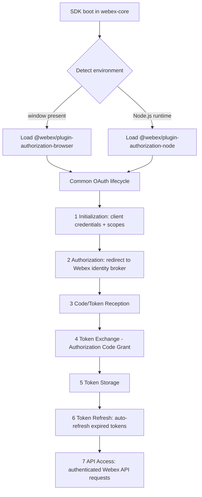
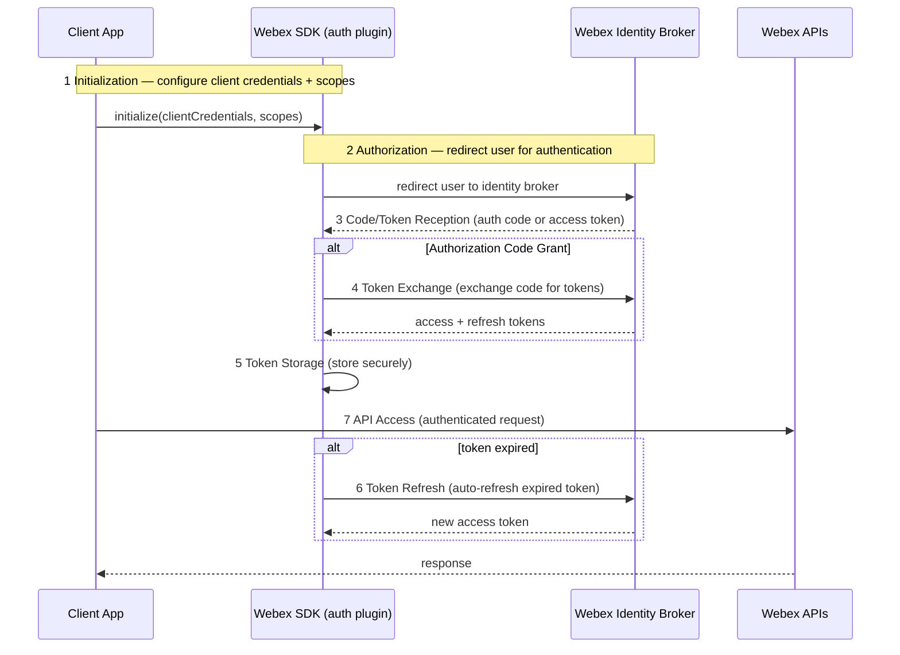
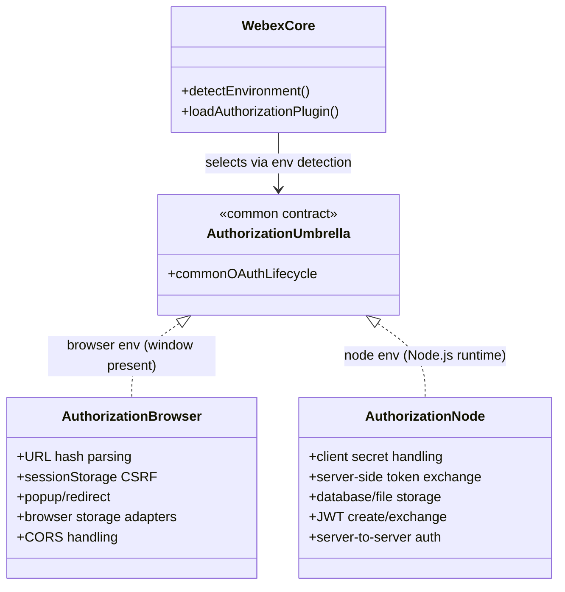

# plugin-authorization — SPEC

> Start here → root [`AGENTS.md`](../../../../AGENTS.md) (agent entry) · router [`SPEC_INDEX.md`](../../../../ai-docs/SPEC_INDEX.md) · system [`ARCHITECTURE.md`](../../../../ai-docs/ARCHITECTURE.md). This is the module's canonical spec: orientation, requirements, design, flows, and tests.
> Context-efficiency: link to canonical docs — don't duplicate them. Load specs on demand per `SPEC_INDEX.md`.
> Sibling module specs: browser specifics → [`plugin-authorization-browser`](../../plugin-authorization-browser/ai-docs/plugin-authorization-browser-spec.md) · node specifics → [`plugin-authorization-node`](../../plugin-authorization-node/ai-docs/plugin-authorization-node-spec.md).

## Metadata
| Field | Value |
|---|---|
| Module id | `plugin-authorization` |
| Source path(s) | `packages/@webex/plugin-authorization/` |
| Doc kind | Module spec |
| Coverage score | 50% (8/16) assessed 2026-07-28; critical 5/8; all requirements WEAK, guide-sourced (no code cross-check), no test evidence — stays Partial |
| Generated from | `module-spec` @ SDLC template library `0.2.1` |
| generated_by / approved_by / updated_at | generated_by `module-spec` / approved_by `pending` / updated_at `2026-07-28` |
| Validation status | not-run |

Manifest coverage state: **Partial**. This is an assess-only migration; the code under `packages/@webex/plugin-authorization/` is the source of truth. Coverage score stays `Pending coverage assessment` until the first coverage assessment runs.

## Evidence Rules
Every generated requirement below must cite concrete source evidence using `file path`. Separate source evidence, test evidence, examples, assumptions, and gaps so validators and future agents can distinguish truth from context. Test evidence is preferred for WHY. For this migration, the only routed source basis is the OAuth flow overview guide; no automated tests were located that exercise the umbrella behavior directly, so unverified requirements are marked WEAK. If evidence is missing or conflicting, ask a focused discovery question before finalizing the requirement.

## Source Material Register
| Source material | Scope | Decision | Detail location or disposition |
|---|---|---|---|
| `packages/@webex/plugin-authorization/OAUTH-FLOW-GUIDE.md` (routed, migrate-existing, retain) | overview | used / migrated by meaning | Environment detection → Design Overview + Data Flow; common 7-step OAuth sequence → Sequence Diagram(s) + Use Cases; flow-type comparison table → Design Overview; browser-vs-node feature matrix → Design Overview; getting-started guidance → Use Cases; code references → Key Files. Content preserved by meaning in prose/tables, not by linking. |

## Overview
`plugin-authorization` is the **umbrella / common authorization plugin** for the Webex JS SDK. It does not itself implement a single fixed OAuth flow; instead it represents the shared authorization contract and the environment-detection entry point through which the SDK selects and loads the correct environment-specific authorization plugin at runtime.

When the SDK boots, it auto-detects the execution environment and loads the appropriate plugin. In a **browser** environment it detects the presence of a `window` object and loads `@webex/plugin-authorization-browser`. In a **Node.js** environment it detects the Node.js runtime and loads `@webex/plugin-authorization-node`. From that point the environment plugin owns the concrete flow behavior, while the umbrella plugin defines the common shape all environments share.

The concrete browser and node behaviors are documented in their own module specs — [`@webex/plugin-authorization-browser`](../../plugin-authorization-browser/ai-docs/plugin-authorization-browser-spec.md) and [`@webex/plugin-authorization-node`](../../plugin-authorization-node/ai-docs/plugin-authorization-node-spec.md). A maintainer should start here for the shared OAuth vocabulary (the common 7-step flow, the Implicit vs Authorization Code Grant comparison, and the browser-vs-node feature split), then follow the matching sibling spec for implementation detail.

## Purpose / Responsibility
Owns the **common authorization contract** for the Webex SDK: environment detection and plugin selection, the shared OAuth flow vocabulary (7-step lifecycle), and the grant-type/feature distinctions between environments. It does NOT own the environment-specific implementations — browser token parsing/storage lives in `@webex/plugin-authorization-browser`, and server-side token exchange / JWT auth lives in `@webex/plugin-authorization-node`.

## Stack
JavaScript (Webex JS SDK monorepo package). Build/test wiring present in-package: `babel.config.js` (transpile), `jest.config.js` (Jest test runner), `package.json` (package manifest). Source under `src/`.

## Folder / Package Structure
```
packages/@webex/plugin-authorization/
├── src/                    # plugin source (umbrella authorization plugin)
├── OAUTH-FLOW-GUIDE.md     # routed source: common OAuth flow overview (migrated by meaning into this spec)
├── README.md               # package readme
├── package.json            # package manifest
├── babel.config.js         # Babel transpile config
├── jest.config.js          # Jest test config
└── process/                # package process/tooling
```

## Key Files (source of truth)
| File | Holds |
|---|---|
| `packages/@webex/plugin-authorization/` | Umbrella / common authorization plugin source |
| `packages/@webex/plugin-authorization-browser/` | Browser authorization plugin (URL parsing, browser storage, popup/redirect handling) — its own module spec |
| `packages/@webex/plugin-authorization-node/` | Node.js authorization plugin (server-side token exchange, secure credential storage) — its own module spec |
| `packages/@webex/webex-core/src/webex-core.js` | WebexCore — environment detection and plugin loading host |
| `docs/samples/browser-auth/app.js` | Browser sample demonstrating the browser OAuth flow |

## Public Surface
Internal Surface — this umbrella plugin's primary consumer is `webex-core`, which detects the environment and loads the matching authorization plugin. No new external network/SDK contract is defined by this migration beyond what the environment plugins expose. The shared surface is the common OAuth flow vocabulary and grant-type selection described below; concrete public APIs are documented in the sibling browser and node module specs.

## Requires (dependencies)
- `@webex/webex-core` (`packages/@webex/webex-core/src/webex-core.js`) — hosts environment detection and loads the authorization plugin.
- Environment-specific plugin, selected at runtime:
  - Browser: `@webex/plugin-authorization-browser` (loaded when a `window` object is present).
  - Node.js: `@webex/plugin-authorization-node` (loaded when the Node.js runtime is detected).
- A Webex OAuth application (client credentials + scopes); Confidential clients additionally require a client secret.
- The Webex identity broker as the external authorization endpoint (see Cross-service flow under Use Cases).

## Requirements
| ID | WHAT | WHY | Source Evidence | Test / Example Evidence | Assumptions / Gaps | Confidence |
|---|---|---|---|---|---|---|
| `PLUGIN-AUTHORIZATION-R-001` | The SDK auto-detects the environment and loads the appropriate authorization plugin: browser env is detected by the presence of a `window` object and loads `@webex/plugin-authorization-browser`; Node.js env is detected by the Node.js runtime and loads `@webex/plugin-authorization-node`. | Callers get the correct flow behavior without manually choosing a plugin per environment. | `packages/@webex/plugin-authorization/OAUTH-FLOW-GUIDE.md` | None found | Detection assumed to occur in `webex-core.js`; not verified against code in this migration. | WEAK |
| `PLUGIN-AUTHORIZATION-R-002` | The browser plugin provides URL parsing, browser storage, and popup/redirect handling, and supports Implicit Grant (default) plus Authorization Code Grant. | These features are what browser SPAs/mobile clients need to receive and persist tokens. | `packages/@webex/plugin-authorization/OAUTH-FLOW-GUIDE.md` | None found | Browser flow detail is owned by the browser sibling spec; not re-verified here. | WEAK |
| `PLUGIN-AUTHORIZATION-R-003` | The Node.js plugin provides server-side token exchange and secure credential storage, with Authorization Code Grant as the primary flow plus JWT authentication. | Server apps need confidential-client exchange and secure storage; JWT supports server-to-server/guest auth. | `packages/@webex/plugin-authorization/OAUTH-FLOW-GUIDE.md` | None found | Node flow detail is owned by the node sibling spec; not re-verified here. | WEAK |
| `PLUGIN-AUTHORIZATION-R-004` | Regardless of environment, the OAuth flow follows a common 7-step lifecycle: Initialization → Authorization → Code/Token Reception → Token Exchange (Auth Code Grant) → Token Storage → Token Refresh (auto-refresh of expired tokens) → API Access. | A single shared lifecycle keeps both environment plugins consistent and lets callers reason about auth once. | `packages/@webex/plugin-authorization/OAUTH-FLOW-GUIDE.md` | None found | Step boundaries are as described in the guide; exact code mapping not verified here. | WEAK |
| `PLUGIN-AUTHORIZATION-R-005` | Implicit Grant and Authorization Code Grant differ per the flow comparison: client type (Public vs Confidential), client secret (Not required vs Required), security (Less vs More secure), token location (URL hash vs Server exchange), best-for (SPAs/mobile vs Server/web-with-backend), and supertoken (Basic vs Enhanced with metadata). | The choice of grant determines client type, secret handling, and where tokens live — the core security trade-off. | `packages/@webex/plugin-authorization/OAUTH-FLOW-GUIDE.md` | None found | Reproduced from the guide's comparison table; behavior not code-verified in this migration. | WEAK |
| `PLUGIN-AUTHORIZATION-R-006` | Environment features are split: browser provides URL hash parsing for token extraction, sessionStorage for CSRF token storage, popup window support, browser storage adapters for token persistence, and CORS handling; Node provides client secret handling, server-side token exchange for Auth Code Grant, database/file storage for token persistence, JWT creation+exchange for guest auth, and server-to-server auth flows. | The feature matrix drives which plugin a given deployment must use and what it can rely on. | `packages/@webex/plugin-authorization/OAUTH-FLOW-GUIDE.md` | None found | Feature ownership sits in the sibling specs; not re-verified here. | WEAK |

Do not merge unrelated behaviors into one requirement. All confidence is WEAK because the migration source is an overview guide and no tests were located exercising the umbrella behavior directly.

## Design Overview
The umbrella plugin's design centers on **environment detection driving plugin selection**, then a **shared OAuth lifecycle** with **environment-specific feature sets** underneath.

**Environment detection and plugin loading.** The SDK inspects the runtime and loads exactly one authorization plugin:

| Environment | Detects | Loads | Features | Flows |
|---|---|---|---|---|
| Browser | `window` object presence | `@webex/plugin-authorization-browser` | URL parsing, browser storage, popup/redirect handling | Implicit Grant (default), Authorization Code Grant |
| Node.js | Node.js runtime | `@webex/plugin-authorization-node` | Server-side token exchange, secure credential storage | Authorization Code Grant (primary), JWT authentication |

**Flow-type comparison.** The two grant types differ as follows (reproduced from the source guide):

| Aspect | Implicit Grant | Authorization Code Grant |
|---|---|---|
| Client Type | Public | Confidential |
| Client Secret | Not required | Required |
| Security | Less secure | More secure |
| Token Location | URL hash | Server exchange |
| Best For | SPAs, mobile apps | Server apps, web apps with backend |
| Supertoken | Basic token structure | Enhanced token with metadata |

**Environment-specific feature matrix.** Beyond the shared lifecycle, each environment adds features suited to where it runs:

| Browser-specific features | Node.js-specific features |
|---|---|
| URL hash parsing for token extraction | Client secret handling for secure authentication |
| sessionStorage for CSRF token storage | Server-side token exchange for Authorization Code Grant |
| Popup window support for authentication | Database/file storage for token persistence |
| Browser storage adapters for token persistence | JWT creation and exchange for guest authentication |
| CORS handling for API requests | Server-to-server authentication flows |

These environment specifics are implemented in, and documented by, the sibling module specs for [`@webex/plugin-authorization-browser`](../../plugin-authorization-browser/ai-docs/plugin-authorization-browser-spec.md) and [`@webex/plugin-authorization-node`](../../plugin-authorization-node/ai-docs/plugin-authorization-node-spec.md).

## Data Flow
Data moves from environment detection, through plugin selection, into the shared OAuth lifecycle (in-process plugin calls; the Authorization / Token Exchange steps use HTTP against the Webex identity broker).



## Sequence Diagram(s)
Sequence coverage:

| Operation group | Diagram | Failure / recovery coverage |
|---|---|---|
| Common OAuth flow (7 steps) | "OAuth authorization lifecycle" | Token Refresh (step 6) auto-refreshes expired tokens; expired-token branch shown |



## Class / Component Relationships


`WebexCore` detects the environment and loads one authorization plugin. The umbrella plugin defines the common OAuth contract; the browser and node plugins realize it with their environment-specific feature sets. The concrete types for each environment are defined in the sibling module specs.

## Use Cases
- **UC-1 Detect environment and load plugin:** SDK boots → detects `window` (browser) or Node.js runtime → loads `@webex/plugin-authorization-browser` or `@webex/plugin-authorization-node` → subsequent auth uses that plugin's features and flows. Evidence: `packages/@webex/plugin-authorization/OAUTH-FLOW-GUIDE.md`, `packages/@webex/webex-core/src/webex-core.js`.
- **UC-2 Complete the common OAuth flow:** caller configures client credentials + scopes (1 Initialization) → user is redirected to the Webex identity broker (2 Authorization) → SDK receives code/token (3) → exchanges code for tokens under Authorization Code Grant (4) → stores tokens (5) → auto-refreshes on expiry (6) → makes authenticated Webex API calls (7). Evidence: `packages/@webex/plugin-authorization/OAUTH-FLOW-GUIDE.md`.
- **UC-3 Choose a grant type:** a Public client (SPA/mobile) uses Implicit Grant with tokens in the URL hash and no client secret; a Confidential client (server / web-with-backend) uses Authorization Code Grant with a required client secret and server-side exchange, yielding an enhanced supertoken with metadata. Evidence: `packages/@webex/plugin-authorization/OAUTH-FLOW-GUIDE.md`.
- **UC-4 Getting started (adopting the plugin):** (1) choose your environment guide based on where the SDK runs, (2) follow the initialization steps for that environment, (3) implement the OAuth flow appropriate for your application type, (4) handle token management according to your security requirements — for browser detail see the browser sibling spec, for server detail see the node sibling spec. Evidence: `packages/@webex/plugin-authorization/OAUTH-FLOW-GUIDE.md`, `docs/samples/browser-auth/app.js`.

### Cross-service flow (OAuth to Webex identity broker)
This module crosses a service boundary: the Authorization step redirects the user to the **Webex identity broker** to authenticate, and the Token Exchange step (Authorization Code Grant) calls the broker over HTTP to exchange the authorization code for tokens. In the browser, the returned token is read from the URL hash (Implicit Grant) and CSRF protection uses sessionStorage; in Node.js, the exchange happens server-side using the client secret and tokens persist to database/file storage. After tokens are obtained and (auto-)refreshed, the SDK makes authenticated requests to the Webex APIs — a second external boundary. Evidence: `packages/@webex/plugin-authorization/OAUTH-FLOW-GUIDE.md`.

## Pitfalls
- The umbrella plugin does not itself perform a single OAuth flow — it selects an environment plugin. Reading only this spec without the matching sibling ([browser](../../plugin-authorization-browser/ai-docs/plugin-authorization-browser-spec.md) / [node](../../plugin-authorization-node/ai-docs/plugin-authorization-node-spec.md)) leaves the concrete flow behavior unspecified.
- Implicit Grant places tokens in the **URL hash** and requires **no client secret**; it is the less-secure, Public-client path. Do not use it for Confidential/server clients that can protect a secret — those should use Authorization Code Grant with server-side exchange.
- Environment detection keys off `window` presence (browser) vs Node.js runtime; environments that spoof or lack the expected global could load the wrong plugin.
- Token Refresh (step 6) is expected to auto-refresh expired tokens; callers should not assume a token stays valid indefinitely between API calls.
- Browser CSRF protection relies on sessionStorage; Node.js secret handling relies on secure server-side credential storage — do not cross these (e.g., never ship a client secret to the browser).

## Test-Case Strategy (module)
No automated tests were located that exercise the umbrella plugin's environment-detection or common-flow behavior during this migration; all requirements are WEAK pending verification. A future test strategy should assert: environment detection selects the browser plugin when `window` is present and the node plugin under the Node.js runtime (positive) and does not load the wrong plugin (negative); the 7-step lifecycle progresses through exchange, storage, refresh, and API access; and grant-type selection enforces the client-secret requirement for Confidential clients (negative: Public client attempting a confidential exchange).

| Behavior / Requirement | Existing test evidence | Gap |
|---|---|---|
| `PLUGIN-AUTHORIZATION-R-001` | None found | No test for environment detection / plugin selection |
| `PLUGIN-AUTHORIZATION-R-002` | None found | Browser feature/flow tests owned by browser sibling module |
| `PLUGIN-AUTHORIZATION-R-003` | None found | Node feature/flow tests owned by node sibling module |
| `PLUGIN-AUTHORIZATION-R-004` | None found | No test asserting the common 7-step lifecycle |
| `PLUGIN-AUTHORIZATION-R-005` | None found | No test asserting grant-type comparison / secret requirement |
| `PLUGIN-AUTHORIZATION-R-006` | None found | No test asserting the browser-vs-node feature split |

## Traceability
- Repo architecture: [`ARCHITECTURE.md`](../../../../ai-docs/ARCHITECTURE.md) · Registry: [`SPEC_INDEX.md`](../../../../ai-docs/SPEC_INDEX.md)
- Sibling module specs: [`plugin-authorization-browser`](../../plugin-authorization-browser/ai-docs/plugin-authorization-browser-spec.md) · [`plugin-authorization-node`](../../plugin-authorization-node/ai-docs/plugin-authorization-node-spec.md)
- Coverage state & contracts baseline: `.sdd/manifest.json`
