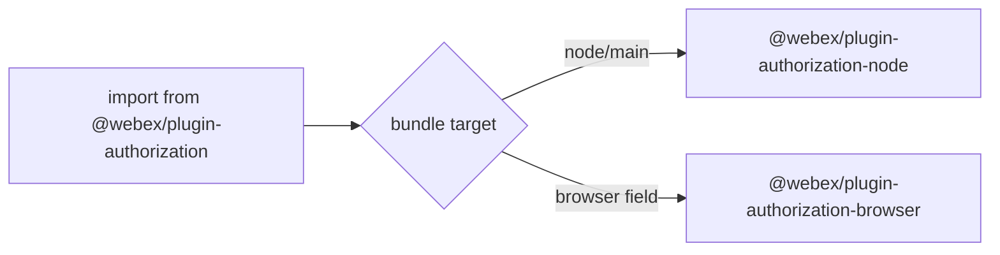
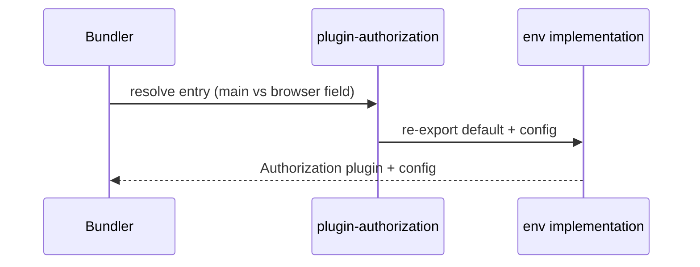
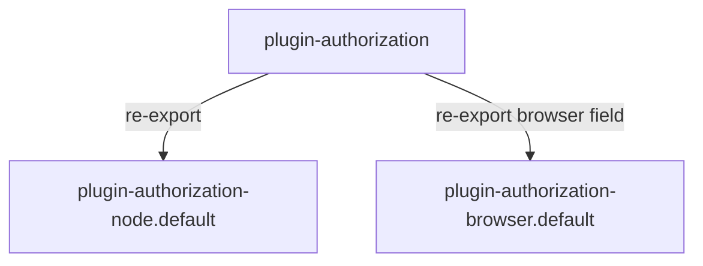

# @webex/plugin-authorization — SPEC

> Start here → root [`AGENTS.md`](../../../../AGENTS.md) (agent entry) · router [`SPEC_INDEX.md`](../../../../ai-docs/SPEC_INDEX.md) · system [`ARCHITECTURE.md`](../../../../ai-docs/ARCHITECTURE.md). This is the module's canonical spec.
> Context-efficiency: link to canonical docs — don't duplicate them. Load specs on demand per `SPEC_INDEX.md`.

## Metadata
| Field | Value |
|---|---|
| Module id | `@webex/plugin-authorization` |
| Source path(s) | `packages/@webex/plugin-authorization/` |
| Doc kind | Module spec |
| Coverage score | Pending coverage assessment |
| Generated from | `module-spec` @ SDLC template library `0.2.1` |
| generated_by / approved_by / updated_at | claude-cli / pending / 2026-07-31T00:00:00Z |
| Validation status | not-run |

Coverage score is `Pending coverage assessment` until the first coverage review. Manifest coverage state is authoritative in `.sdd/manifest.json`.

## Evidence Rules
Every requirement cites concrete source evidence using `file path`. This module is a thin re-export loader; most behavior is delegated to the environment-specific packages.

## Source Material Register
| Source material | Scope | Decision | Detail location or disposition |
|---|---|---|---|
| Loader package README | overview / API | used | Env-detection narrative → Overview/Design; methods → Public Surface (delegated); client-type OAuth flow table → Design Overview and browser/node specs. |

## Overview

`@webex/plugin-authorization` is a universal entry point that automatically loads the correct environment-specific authorization implementation for the Webex SDK. Its main entry re-exports `@webex/plugin-authorization-node`; its browser build (`src/index.browser.js`) re-exports `@webex/plugin-authorization-browser`. Consumers depend on this single package and receive the optimal implementation for their runtime (browser vs Node.js) without importing an environment package directly.

The package owns no OAuth logic of its own — it is a resolution seam. The concrete `webex.authorization.*` methods a consumer sees therefore differ by runtime.

## Purpose / Responsibility

Owns environment selection for the authorization plugin: expose one dependency and resolve it to the browser or node implementation at bundle time. It does NOT implement OAuth flows, token exchange, or storage.

## Stack

JavaScript (ES modules), built with `@webex/legacy-tools`. Node `>=18` (`package.json` `engines`). No test logic beyond style (`test:style`).

## Folder / Package Structure
```
packages/@webex/plugin-authorization/
├── src/
│   ├── index.js          # main (node) entry: re-exports plugin-authorization-node
│   └── index.browser.js  # browser build entry: re-exports plugin-authorization-browser
└── package.json          # browser field maps index.js → index.browser.js
```

## Key Files (source of truth)
| File | Holds |
|---|---|
| `packages/@webex/plugin-authorization/src/index.js` | `export {default, config} from '@webex/plugin-authorization-node'` |
| `packages/@webex/plugin-authorization/src/index.browser.js` | `export {default, config} from '@webex/plugin-authorization-browser'` |
| `packages/@webex/plugin-authorization/package.json` | `browser` field mapping that swaps entry per bundle target |

## Public Surface
| Contract ID | Type | Surface | Purpose | Compatibility / deprecation | Schema / detail link | Root index |
|---|---|---|---|---|---|---|
| `authorization.default` | SDK | `default` export | environment-selected Authorization plugin | stable | `@webex/plugin-authorization-node` / `-browser` | `../../../../ai-docs/CONTRACTS.md` |
| `authorization.config` | SDK | `config` export | environment-selected default config | stable | owning env package | `../../../../ai-docs/CONTRACTS.md` |

Compatibility notes:
- The effective method surface is the union resolved by environment; see the browser and node module specs for the concrete methods.

## Requires (dependencies)
- `@webex/plugin-authorization-browser` (`workspace:*`) — browser implementation.
- `@webex/plugin-authorization-node` (`workspace:*`) — node implementation.

## Requirements
| ID | WHAT | WHY | Source Evidence | Test / Example Evidence | Assumptions / Gaps | Confidence |
|---|---|---|---|---|---|---|
| `PLUGIN-AUTHORIZATION-R-001` | Main entry re-exports the node implementation's `default` and `config`. | One dependency yields the correct server implementation by default. | `packages/@webex/plugin-authorization/src/index.js` | None found (loader) | — | PRESENT |
| `PLUGIN-AUTHORIZATION-R-002` | Browser bundle entry re-exports the browser implementation via the `package.json` `browser` field. | Bundlers pick the browser-safe implementation automatically. | `packages/@webex/plugin-authorization/src/index.browser.js`, `package.json` | None found | — | PRESENT |

## Design Overview

The loader relies on bundler resolution of the `browser` field in `package.json` to substitute `src/index.browser.js` for `src/index.js`. Because both entries only re-export a sibling package's `default` and `config`, the loader adds no runtime branching and no bundle weight beyond the resolved implementation. This keeps environment selection a build-time concern rather than a runtime `if (isBrowser)` check.

## Data Flow


## Sequence Diagram(s)
Sequence coverage: this is a trivial pass-through/re-export module with a single "resolve implementation" operation group; one diagram suffices.

| Operation group | Diagram | Failure / recovery coverage |
|---|---|---|
| Resolve implementation at bundle time | Load-time re-export | n/a — resolution failure is a build error, not a runtime path |



## Class / Component Relationships

The loader holds no classes of its own; it forwards the environment package's `Authorization` plugin class and `config`.

## Use Cases
- **UC-1 Auto-select implementation:** consumer imports `@webex/plugin-authorization` → bundler resolves browser or node entry → consumer's `webex.authorization` is the resolved implementation. Evidence: `src/index.js`, `src/index.browser.js`.

## Key Design Trade-off
- Build-time environment selection (via the `browser` field) is favored over a runtime environment check: it keeps browser bundles free of Node-only code and secret-handling paths, at the cost of the available method set differing by target.

## Pitfalls
- The available `webex.authorization` methods depend on the resolved package — do not assume Node-only methods (e.g. `getClientToken`-style server flows) exist in a browser bundle.
- Changing the `browser` field mapping silently changes which implementation ships; treat it as a public-surface change.

## Test-Case Strategy (module)
This loader has no behavior beyond re-export; it runs only `test:style` (eslint). Behavior is covered by the environment packages' suites.

| Behavior / Requirement | Existing test evidence | Gap |
|---|---|---|
| `PLUGIN-AUTHORIZATION-R-001` | None found (covered indirectly by node package tests) | No direct re-export assertion |
| `PLUGIN-AUTHORIZATION-R-002` | None found | No direct browser-field resolution test |

## Traceability
- Repo architecture: `../../../../ai-docs/ARCHITECTURE.md` · Registry: `../../../../ai-docs/SPEC_INDEX.md`
- Coverage state & contracts baseline: `.sdd/manifest.json`
