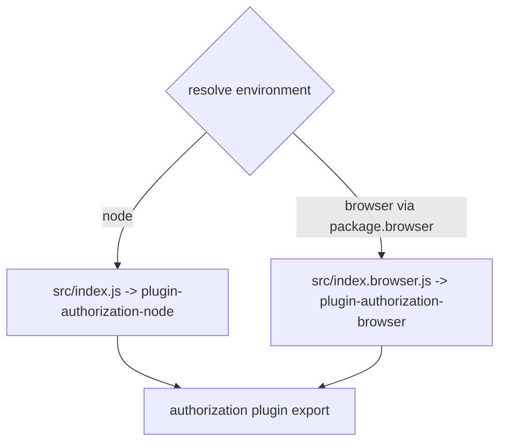
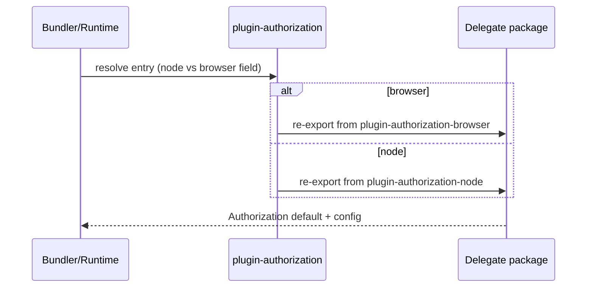
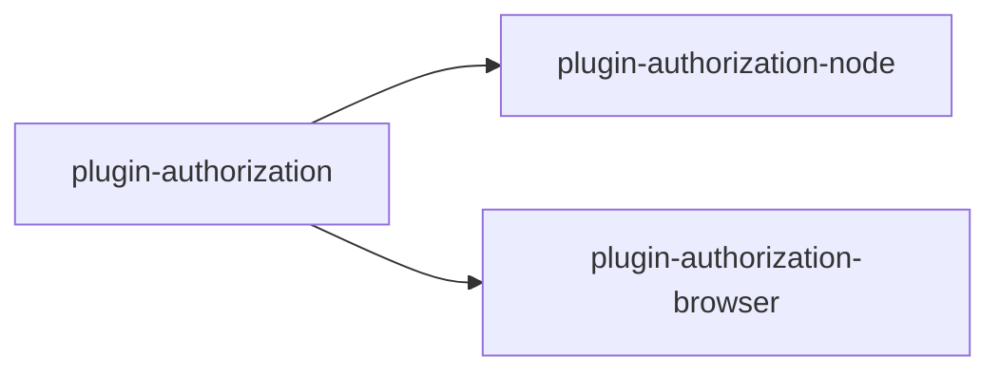

<!-- sdd-generated-metadata
generator: claude-cli
generator_model: us.anthropic.claude-opus-4-8
approved_by: pending-human-review
updated_at: 2026-08-06T00:00:00Z
validation_status: not-run
run_id: 51855eac-8de5-43a2-a3b6-dbcc55ebc91b
-->

# @webex/plugin-authorization — SPEC

> Start here → root [`AGENTS.md`](../../../../AGENTS.md) (agent entry) · router [`SPEC_INDEX.md`](../../../../ai-docs/SPEC_INDEX.md) · system [`ARCHITECTURE.md`](../../../../ai-docs/ARCHITECTURE.md). This is the module's canonical spec: orientation, requirements, design, flows, and tests.
> Context-efficiency: link to canonical docs — don't duplicate them. Load specs on demand per `SPEC_INDEX.md`.

## Metadata

| Field | Value |
|---|---|
| Module id | `plugin-authorization` |
| Source path(s) | `packages/@webex/plugin-authorization/src/` |
| Parent spec | `—` (environment-selecting aggregator plugin; composed by `webex-core`, no parent module) |
| Doc kind | Module spec |
| Coverage score | Pending coverage assessment |
| Generated from | `module-spec` @ SDLC template library `0.2.2` |
| generated_by / approved_by / updated_at | claude-cli / pending-human-review / 2026-08-06 |
| Validation status | not-run, validator `pending`, assessed 2026-08-06 |

Coverage score is `Pending coverage assessment` until the first coverage review runs. Manifest coverage
state (`Partial`) is authoritative and kept in `.sdd/manifest.json`.

## Evidence Rules
Every requirement cites concrete source evidence using `file path`. Test evidence is preferred for WHY.
Requirements are grounded in the current implementation under `src/`. The retained
`OAUTH-FLOW-GUIDE.md` is a protected reference source (context-only), not a migrated spec.

## Source Material Register

| Source material | Scope | Decision | Detail location or disposition |
|---|---|---|---|
| `OAUTH-FLOW-GUIDE.md` (package root) | overview / API | reference-only | Retained protected guide; linked as background, not copied into this spec. |

## Overview

`@webex/plugin-authorization` is an environment-selecting shim. It exposes a single OAuth2 `authorization`
plugin whose implementation is chosen at build time by Node vs browser resolution: the Node entry
re-exports `@webex/plugin-authorization-node`, and the browser entry re-exports
`@webex/plugin-authorization-browser`. The package itself contains no OAuth logic; it only forwards the
`default` plugin and its `config`.

The selection is driven by the package's `browser` field in `package.json`, which maps
`./src/index.js` → `./src/index.browser.js` (and the dist equivalents). Both files are one-line
re-exports. A maintainer should treat this package as routing only and read the actual behavior in the
node and browser authorization package specs.

## Purpose / Responsibility

Owns the environment-based selection of the correct OAuth2 authorization implementation and re-exports it
as the `authorization` plugin. It does NOT implement any OAuth flow, token handling, or CSRF/PKCE logic
itself — those live in `plugin-authorization-node` and `plugin-authorization-browser`.

## Stack

JavaScript (Babel), built with `webex-legacy-tools`. No runtime logic beyond ES module re-exports.
Runtime dependencies: `@webex/plugin-authorization-node` and `@webex/plugin-authorization-browser`.
Environment selection uses the package `browser` mapping. Evidence:
`packages/@webex/plugin-authorization/package.json`.

## Folder / Package Structure

```
packages/@webex/plugin-authorization/src/
├── index.js           # Node entry: re-exports default + config from plugin-authorization-node
└── index.browser.js   # Browser entry: re-exports default + config from plugin-authorization-browser
```

## Key Files (source of truth)

| File | Holds |
|---|---|
| `packages/@webex/plugin-authorization/package.json` | The `browser` field mapping that selects node vs browser entry |
| `packages/@webex/plugin-authorization/src/index.js` | Node re-export target (`@webex/plugin-authorization-node`) |
| `packages/@webex/plugin-authorization/src/index.browser.js` | Browser re-export target (`@webex/plugin-authorization-browser`) |

## Public Surface

Consumed as the public SDK `authorization` plugin. Its API is exactly the re-exported implementation for
the resolved environment.

| Contract ID | Type | Surface | Purpose | Compatibility / deprecation | Schema / detail link | Root index |
|---|---|---|---|---|---|---|
| `authorization.default` | SDK | `export {default}` (Authorization plugin) | Provide the environment-correct authorization plugin | Stable; delegates to node/browser package | `packages/@webex/plugin-authorization/src/index.js` | `../../../../ai-docs/CONTRACTS.md` |
| `authorization.config` | SDK | `export {config}` | Provide the delegate's default plugin config | Stable | `packages/@webex/plugin-authorization/src/index.js` | `../../../../ai-docs/CONTRACTS.md` |

Compatibility notes:
- The effective API surface is defined by the resolved delegate (node or browser); see those specs.
- Adding/removing a supported environment mapping is a build-resolution change with consumer impact.

## Requires (dependencies)

- `@webex/plugin-authorization-node` — the Node OAuth2 implementation re-exported by `index.js`.
- `@webex/plugin-authorization-browser` — the browser OAuth2 implementation re-exported by
  `index.browser.js`.
- Bundler/runtime honoring the `browser` field for entry selection.

## Requirements

| ID | WHAT | WHY | Source Evidence | Test / Example Evidence | Assumptions / Gaps | Confidence |
|---|---|---|---|---|---|---|
| `AUTHORIZATION-R-001` | The Node entry re-exports `default` and `config` from `@webex/plugin-authorization-node`. | Node consumers must receive the Node OAuth2 implementation. | `packages/@webex/plugin-authorization/src/index.js` | None found | none identified | PRESENT |
| `AUTHORIZATION-R-002` | The browser entry re-exports `default` and `config` from `@webex/plugin-authorization-browser`. | Browser consumers must receive the browser OAuth2 implementation. | `packages/@webex/plugin-authorization/src/index.browser.js` | None found | none identified | PRESENT |
| `AUTHORIZATION-R-003` | The package `browser` field maps `./src/index.js`→`./src/index.browser.js` and `./dist/index.js`→`./dist/index.browser.js`, so bundlers select the browser implementation automatically. | Environment selection must be transparent to consumers. | `packages/@webex/plugin-authorization/package.json` | None found | Relies on bundler honoring `browser` field | PRESENT |

## Design Overview

The package is a pure re-export/selection layer. There is no class, state, or flow of its own; it depends
entirely on Node-vs-browser module resolution to pick a delegate. The two source files are single
`export {default, config} from '<delegate>'` statements, and the `package.json` `browser` mapping wires
the browser build to `index.browser.js`. All authentication behavior — implicit grant, authorization code
grant, JWT login, logout, CSRF/PKCE — is documented in the delegate specs.

## Data Flow



## Sequence Diagram(s)

This is a trivial re-export/selection module with a single operation group (entry resolution), so one
sequence diagram suffices; there is no runtime failure path of its own beyond resolution.

Sequence coverage:

| Operation group | Diagram | Failure / recovery coverage |
|---|---|---|
| Entry resolution | 1. Environment selection | N/A — no runtime failure path; resolution errors are build-time |

### 1. Environment selection



## Class / Component Relationships



No classes are defined here; the package composes two delegate packages by re-export.

## Use Cases

- **UC-1 Use authorization in Node:** the SDK resolves `index.js` → the Node authorization plugin is
  registered. Evidence: `packages/@webex/plugin-authorization/src/index.js`.
- **UC-2 Use authorization in the browser:** the bundler honors `browser` → `index.browser.js` → the
  browser authorization plugin is registered. Evidence:
  `packages/@webex/plugin-authorization/src/index.browser.js`, `packages/@webex/plugin-authorization/package.json`.

## Pitfalls

- This package has no logic; debugging auth behavior must happen in the resolved delegate
  (`plugin-authorization-node` or `plugin-authorization-browser`), not here. Evidence:
  `packages/@webex/plugin-authorization/src/index.js`, `packages/@webex/plugin-authorization/src/index.browser.js`.
- If a bundler ignores the `browser` field, it will incorrectly ship the Node implementation. Evidence:
  `packages/@webex/plugin-authorization/package.json`.

## Test-Case Strategy (module)

There is no behavior to unit-test beyond the re-export selection; coverage is provided by the delegate
packages' test suites. A build/bundle smoke test can confirm the browser build resolves to
`index.browser.js` and the Node build to `index.js`.

| Behavior / Requirement | Existing test evidence | Gap |
|---|---|---|
| `AUTHORIZATION-R-001` | `packages/@webex/plugin-authorization/test/` | Add a node-resolution export assertion |
| `AUTHORIZATION-R-002` | `packages/@webex/plugin-authorization/test/` | Add a browser-resolution export assertion |
| `AUTHORIZATION-R-003` | None found | Add a bundle/resolution smoke test |

## Traceability

- Repo architecture: [`ARCHITECTURE.md`](../../../../ai-docs/ARCHITECTURE.md) · Registry: [`SPEC_INDEX.md`](../../../../ai-docs/SPEC_INDEX.md)
- Delegates: `packages/@webex/plugin-authorization-node/ai-docs/plugin-authorization-node-spec.md`,
  `packages/@webex/plugin-authorization-browser/ai-docs/plugin-authorization-browser-spec.md`
- Coverage state & contracts baseline: `.sdd/manifest.json`
