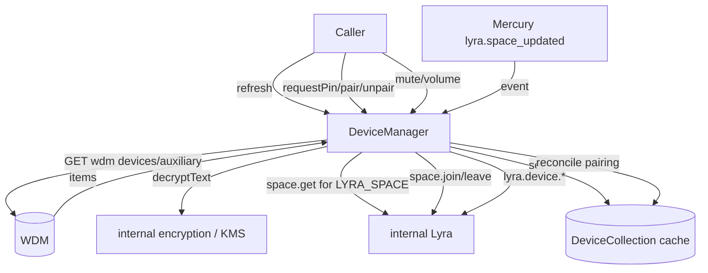
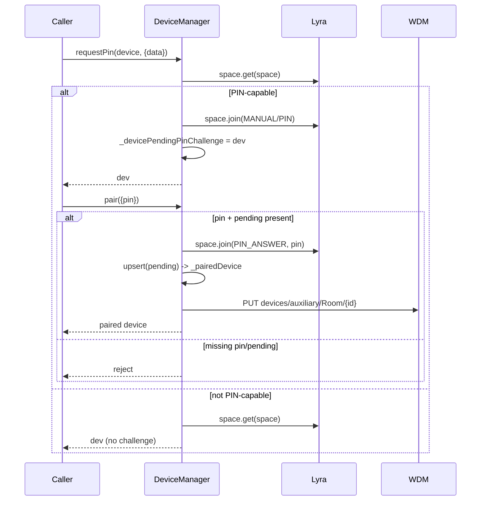
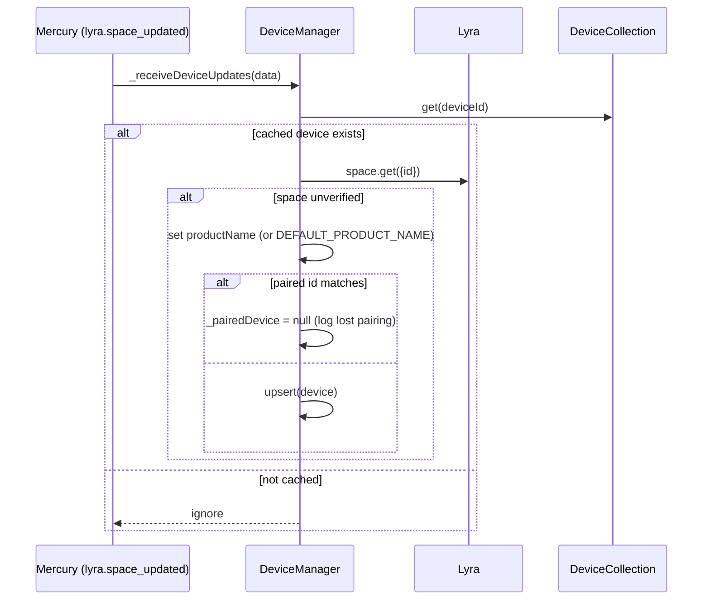
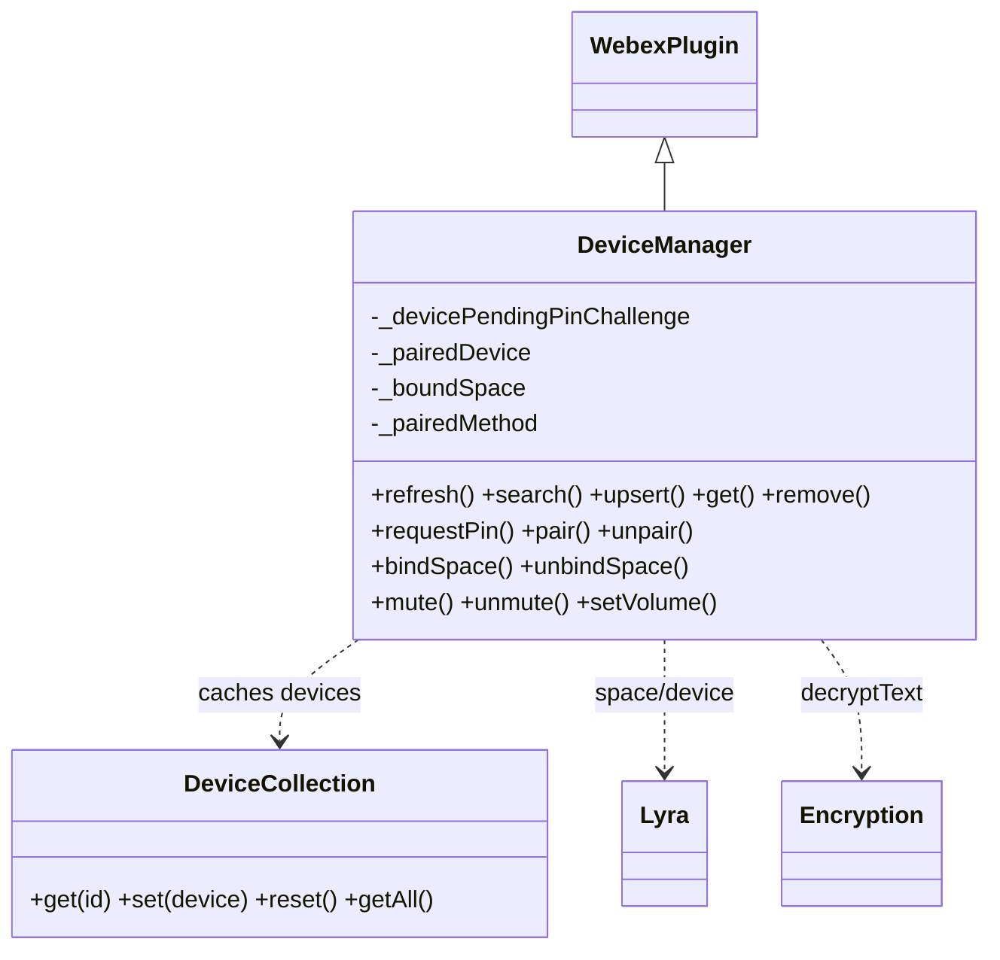
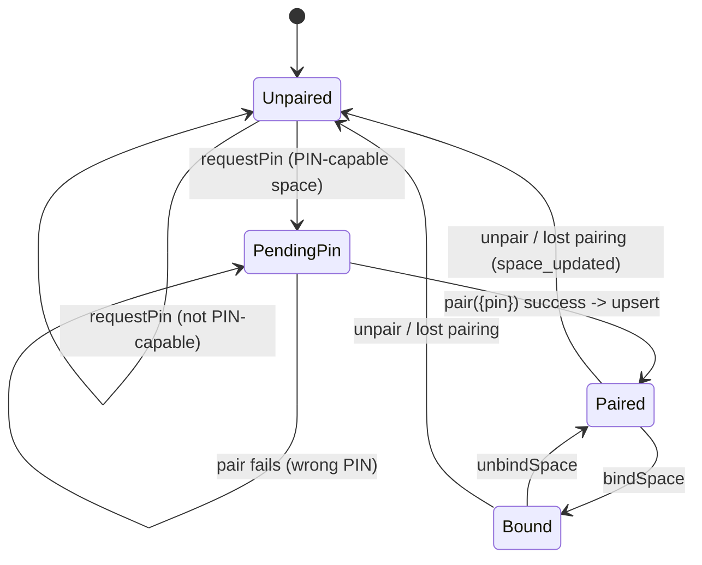

<!-- sdd-generated-metadata
generator: claude-cli
generator_model: us.anthropic.claude-opus-4-8
approved_by: pending-human-review
updated_at: 2026-08-06T00:00:00Z
validation_status: not-run
run_id: 51855eac-8de5-43a2-a3b6-dbcc55ebc91b
-->

# @webex/plugin-device-manager — SPEC

> Start here → root [`AGENTS.md`](../../../../AGENTS.md) (agent entry) · router [`SPEC_INDEX.md`](../../../../ai-docs/SPEC_INDEX.md) · system [`ARCHITECTURE.md`](../../../../ai-docs/ARCHITECTURE.md). This is the module's canonical spec: orientation, requirements, design, flows, state, and tests.
> Context-efficiency: link to canonical docs — don't duplicate them. Load specs on demand per `SPEC_INDEX.md`.

## Metadata

| Field | Value |
|---|---|
| Module id | `plugin-device-manager` |
| Source path(s) | `packages/@webex/plugin-device-manager/src/` |
| Parent spec | `—` (registered public Webex plugin; composed by `webex-core`, no parent module) |
| Doc kind | Module spec |
| Coverage score | Pending coverage assessment |
| Generated from | `module-spec` @ SDLC template library `0.2.2` |
| generated_by / approved_by / updated_at | claude-cli / pending-human-review / 2026-08-06 |
| Validation status | not-run, validator `pending`, assessed 2026-08-06 |

Coverage score is `Pending coverage assessment` until the first coverage review runs. Manifest coverage
state (`Partial`) is authoritative and kept in `.sdd/manifest.json`.

## Evidence Rules
Every requirement cites concrete source evidence using `file path`. Test evidence is preferred for WHY.
Requirements are grounded in the current implementation under `src/` and its unit tests.

## Source Material Register

| Source material | Scope | Decision | Detail location or disposition |
|---|---|---|---|
| N/A | none | none | No prior AI-docs existed for this package; content is derived directly from `src/` and tests. |

## Overview

`@webex/plugin-device-manager` is a public Webex SDK plugin (registered as `devicemanager`) that manages
the lifecycle of pairable "recent" devices (rooms/desk devices) for a user. It lists and refreshes
devices from WDM, searches for devices, pairs/unpairs via manual PIN or ultrasonic flows through the
internal Lyra plugin, binds/unbinds a conversation space to a paired device, and controls the paired
device's audio (mute/unmute/volume).

The plugin (`src/device-manager.js`, a `WebexPlugin`) keeps three pieces of in-memory pairing state —
`_devicePendingPinChallenge`, `_pairedDevice`, and `_boundSpace` — plus a `_pairedMethod` string. A
module-level `DeviceCollection` (`src/collection.js`) is an in-memory cache of devices keyed by id,
populated from WDM (`devices/auxiliary`) and merged on update. Device names are decrypted via the
internal encryption plugin. The plugin also listens for Lyra `space_updated` Mercury events to keep
pairing state consistent. A maintainer should start at `src/device-manager.js` and `src/collection.js`.

Pairing works in two phases: `requestPin` joins a PIN-capable Lyra space and stashes the device as
pending; `pair({pin})` answers the PIN challenge and, on success, `upsert`s the device into WDM and the
collection.

## Purpose / Responsibility

Owns the recent-device lifecycle: listing/refresh from WDM, search, PIN/ultrasonic pairing and unpairing
via Lyra, space bind/unbind, and paired-device audio control. It does NOT own the underlying Lyra space
protocol, WDM device registration semantics, search backend, or KMS encryption (those live in the
internal Lyra/device/search and encryption plugins).

## Stack

JavaScript (Babel), built with `webex-legacy-tools`. Uses `lodash` `cloneDeep`/`merge` and `uuid`.
Tested with `@webex/test-helper-chai`, `@webex/test-helper-mocha`, `@webex/test-helper-mock-webex`, and
`@webex/test-helper-test-users` (plus `sinon`). Runtime dependencies: `@webex/webex-core`,
`@webex/internal-plugin-lyra`, `@webex/internal-plugin-search`, `@webex/internal-plugin-device`,
`@webex/internal-plugin-calendar`, `@webex/plugin-authorization`, `@webex/plugin-logger`. Evidence:
`packages/@webex/plugin-device-manager/package.json`.

## Folder / Package Structure

```
packages/@webex/plugin-device-manager/src/
├── index.js           # imports internal device plugin; registerPlugin('devicemanager', DeviceManager, {config})
├── device-manager.js  # DeviceManager WebexPlugin: list/refresh/search/pair/bind/audio + Lyra event listener
├── collection.js      # DeviceCollection: in-memory device cache keyed by id (get/set/reset/getAll, merge on update)
├── constants.js       # LYRA_SPACE, UC_CLOUD, DEFAULT_PRODUCT_NAME
└── config.js          # plugin configuration
```

## Key Files (source of truth)

| File | Holds |
|---|---|
| `packages/@webex/plugin-device-manager/src/device-manager.js` | All public methods, pairing state machine, Lyra `space_updated` handler, name decryption |
| `packages/@webex/plugin-device-manager/src/collection.js` | The `DeviceCollection` cache contract (get/set/reset/getAll, lodash `merge` on existing) |
| `packages/@webex/plugin-device-manager/src/constants.js` | `LYRA_SPACE`, `UC_CLOUD`, `DEFAULT_PRODUCT_NAME` sentinels used in refresh/update logic |

## Public Surface

Consumed as a public SDK plugin via `webex.devicemanager`. Uses WDM REST (`api: 'wdm'`) and the internal
Lyra/search plugins.

| Contract ID | Type | Surface | Purpose | Compatibility / deprecation | Schema / detail link | Root index |
|---|---|---|---|---|---|---|
| `devicemanager.getAll` | SDK | `getAll(): Promise<Device[]>` | Return cached recent devices | Stable | `packages/@webex/plugin-device-manager/src/device-manager.js` | `../../../../ai-docs/CONTRACTS.md` |
| `devicemanager.refresh` | SDK/HTTP | `refresh(): Promise<Device[]>` | Reset cache, fetch `devices/auxiliary`, decrypt names, repopulate | Stable | `packages/@webex/plugin-device-manager/src/device-manager.js` | `../../../../ai-docs/CONTRACTS.md` |
| `devicemanager.search` | SDK | `search({searchQuery}): Promise<Device>` | Search devices via internal search | Stable; rejects when `searchQuery` missing | `packages/@webex/plugin-device-manager/src/device-manager.js` | `../../../../ai-docs/CONTRACTS.md` |
| `devicemanager.upsert` | SDK/HTTP | `upsert(device): Promise<Device>` | Cache/register a device in WDM (`PUT devices/auxiliary/Room/{id}`) | Stable; rejects without device id | `packages/@webex/plugin-device-manager/src/device-manager.js` | `../../../../ai-docs/CONTRACTS.md` |
| `devicemanager.get` | SDK | `get(token): Promise<deviceInfo>` | Resolve advertised endpoint + Lyra space info by token | Stable; rejects without token | `packages/@webex/plugin-device-manager/src/device-manager.js` | `../../../../ai-docs/CONTRACTS.md` |
| `devicemanager.remove` | SDK/HTTP | `remove(deviceId): Promise` | Unregister a device from WDM (`DELETE devices/auxiliary/{id}`) | Stable; rejects without id | `packages/@webex/plugin-device-manager/src/device-manager.js` | `../../../../ai-docs/CONTRACTS.md` |
| `devicemanager.requestPin` | SDK | `requestPin(device, {data}): Promise<deviceInfo>` | Join a PIN-capable Lyra space; stash pending device | Stable | `packages/@webex/plugin-device-manager/src/device-manager.js` | `../../../../ai-docs/CONTRACTS.md` |
| `devicemanager.pair` | SDK | `pair({pin}): Promise<deviceInfo>` | Answer PIN challenge and upsert the paired device | Stable; rejects without pin/pending device | `packages/@webex/plugin-device-manager/src/device-manager.js` | `../../../../ai-docs/CONTRACTS.md` |
| `devicemanager.unpair` | SDK | `unpair({removeAllDevices}): Promise<deviceInfo>` | Leave the Lyra space for the paired device | Stable; rejects without paired device | `packages/@webex/plugin-device-manager/src/device-manager.js` | `../../../../ai-docs/CONTRACTS.md` |
| `devicemanager.bindSpace` | SDK | `bindSpace({url, kmsResourceObjectUrl}): Promise` | Bind a conversation space to the paired device | Stable; rejects on missing args/device | `packages/@webex/plugin-device-manager/src/device-manager.js` | `../../../../ai-docs/CONTRACTS.md` |
| `devicemanager.unbindSpace` | SDK | `unbindSpace(): Promise` | Unbind the bound space | Stable; rejects when nothing bound | `packages/@webex/plugin-device-manager/src/device-manager.js` | `../../../../ai-docs/CONTRACTS.md` |
| `devicemanager.audio` | SDK | `getAudioState`/`putAudioState`/`mute`/`unmute`/`increaseVolume`/`decreaseVolume`/`setVolume` | Control paired-device audio via Lyra | Stable; most reject without a paired device | `packages/@webex/plugin-device-manager/src/device-manager.js` | `../../../../ai-docs/CONTRACTS.md` |
| `devicemanager.getPairedDevice` | SDK | `getPairedDevice(): Device \| undefined` | Return the currently paired device from the cache | Stable | `packages/@webex/plugin-device-manager/src/device-manager.js` | `../../../../ai-docs/CONTRACTS.md` |
| `devicemanager.pairedMethod` | SDK | `getPairedMethod()` / `setPairedMethod(m)` | Get/set the pairing method label (default `Manual`) | Stable | `packages/@webex/plugin-device-manager/src/device-manager.js` | `../../../../ai-docs/CONTRACTS.md` |

Compatibility notes:
- Method names/signatures and the rejection contracts (which required args cause `Promise.reject`) are
  the consumer contract.
- Audio helpers proxy to `webex.internal.lyra.device.*`; their shapes follow the Lyra plugin.

## Requires (dependencies)

- `@webex/webex-core` — base `WebexPlugin`, `registerPlugin`, `this.webex.request`, logger.
- `@webex/internal-plugin-lyra` — space join/leave/get, bind/unbind conversation, device audio control,
  `getAdvertisedEndpoint`, and the `event:lyra.space_updated` Mercury event.
- `@webex/internal-plugin-search` — `search.people` for device search.
- `@webex/internal-plugin-device` — imported for device registration context.
- `@webex/internal-plugin-encryption` (via `webex.internal.encryption`) — `decryptText` for device
  names.
- `webex.internal.services` — `waitForCatalog('postauth')` and the `wdm` catalog URL for UC-cloud id
  rewriting.
- WDM REST API (`api: 'wdm'`, `devices/auxiliary*`).

## Requirements

| ID | WHAT | WHY | Source Evidence | Test / Example Evidence | Assumptions / Gaps | Confidence |
|---|---|---|---|---|---|---|
| `DEVICE-MANAGER-R-001` | `refresh()` resets the collection, GETs `api:'wdm' devices/auxiliary`, rejects when there is no body, decrypts names via `_updateDeviceMetadata`, fetches Lyra space info for `LYRA_SPACE`-class devices, repopulates the collection, and returns `getAll()`; errors are logged and swallowed. | Listing recent devices requires a fresh, name-decrypted view from WDM. | `packages/@webex/plugin-device-manager/src/device-manager.js` | `packages/@webex/plugin-device-manager/test/unit/spec/index.js` | Errors are logged, not rejected | PRESENT |
| `DEVICE-MANAGER-R-002` | `upsert(device)` requires an id (`device.id` or `identity.id`), promotes `_devicePendingPinChallenge` to `_pairedDevice`, merges into the collection if the device exists, else `PUT devices/auxiliary/Room/{id}` to WDM, decrypts the returned name, and caches it. | Newly paired devices must be registered once and updated in place afterward. | `packages/@webex/plugin-device-manager/src/device-manager.js` | `packages/@webex/plugin-device-manager/test/unit/spec/index.js` | none identified | PRESENT |
| `DEVICE-MANAGER-R-003` | `requestPin(device,{data})` gets the Lyra space; if it is PIN-challenge capable it joins with `passType:'MANUAL', verificationInitiation:'PIN'`, stores the device as `_devicePendingPinChallenge`, and returns it; otherwise it still resolves the device. | Manual pairing must start a PIN challenge only when the space supports it. | `packages/@webex/plugin-device-manager/src/device-manager.js` | `packages/@webex/plugin-device-manager/test/unit/spec/index.js` | none identified | PRESENT |
| `DEVICE-MANAGER-R-004` | `pair({pin})` requires a pin and a pending device, joins the space with `passType:'PIN_ANSWER', data: pin`, and on success `upsert`s the pending device; missing pin or pending device rejects. | Completing manual pairing requires answering the PIN and registering the device. | `packages/@webex/plugin-device-manager/src/device-manager.js` | `packages/@webex/plugin-device-manager/test/unit/spec/index.js` | none identified | PRESENT |
| `DEVICE-MANAGER-R-005` | Space binding: `bindSpace({url,kmsResourceObjectUrl})` requires both args and a paired device, stores `_boundSpace`, and calls Lyra `bindConversation`; `unbindSpace()` requires a paired+bound space, calls `unbindConversation`, and clears `_boundSpace` on success. | Binding a conversation to a device is only valid for a paired device with both KMS + url. | `packages/@webex/plugin-device-manager/src/device-manager.js` | `packages/@webex/plugin-device-manager/test/unit/spec/index.js` | none identified | PRESENT |
| `DEVICE-MANAGER-R-006` | Audio controls (`mute`/`unmute`/`increaseVolume`/`decreaseVolume`/`setVolume`/`getAudioState`) reject when no device is paired and otherwise proxy to `webex.internal.lyra.device.*` on `_pairedDevice`; `putAudioState` proxies directly. | Audio actions must target a currently paired device. | `packages/@webex/plugin-device-manager/src/device-manager.js` | `packages/@webex/plugin-device-manager/test/unit/spec/index.js` | none identified | PRESENT |
| `DEVICE-MANAGER-R-007` | On `event:lyra.space_updated`, `_receiveDeviceUpdates` updates only cached devices; when a space is unverified it sets `productName` (fallback `DEFAULT_PRODUCT_NAME`), clears `_pairedDevice` if its id matches (logging lost pairing), and otherwise re-`upsert`s. | Pairing state must react to server-driven space changes to stay accurate. | `packages/@webex/plugin-device-manager/src/device-manager.js` | `packages/@webex/plugin-device-manager/test/unit/spec/index.js` | Reads `_devicePendingPinChallenge.identity.id` (assumes pending set) | PRESENT |
| `DEVICE-MANAGER-R-008` | `_decryptDeviceName` decrypts `metadata.encryptedUserAssignedName` with `metadata.encryptionKeyUrl` via `webex.internal.encryption.decryptText`, sets `userAssignedName`, and clears the encrypted field even on failure (logging the error). | Device names are encrypted at rest and must be shown decrypted without leaking ciphertext. | `packages/@webex/plugin-device-manager/src/device-manager.js` | `packages/@webex/plugin-device-manager/test/unit/spec/index.js` | none identified | PRESENT |

## Design Overview

`DeviceManager` extends `WebexPlugin` (`namespace: 'DeviceManager'`) and coordinates three collaborators:
WDM (device registry, via `this.webex.request({api:'wdm'})`), Lyra (space + device control, via
`webex.internal.lyra`), and the encryption plugin (name decryption). Device state is cached in the
module-level singleton `DeviceCollection`, which merges on update so partial device payloads accumulate.

Pairing is a small two-phase state machine held in instance fields. `requestPin` transitions a device to
`_devicePendingPinChallenge` (only when the Lyra space is PIN-capable). `pair` answers the PIN and, on
success, calls `upsert`, which promotes the pending device to `_pairedDevice` and registers it in WDM.
`unpair` leaves the Lyra space. `bindSpace`/`unbindSpace` attach/detach a conversation to the paired
device and track `_boundSpace`. Audio helpers require `_pairedDevice` and proxy to Lyra.

`refresh` is the read path: it clears the cache, pulls auxiliary devices from WDM, rewrites UC-cloud ids
using the `wdm` catalog after `waitForCatalog('postauth')`, decrypts names, enriches `LYRA_SPACE` devices
via Lyra, and repopulates. `initialize` subscribes to Lyra `space_updated` events so `_receiveDeviceUpdates`
can keep pairing state consistent with server-driven changes.

## Data Flow



## Sequence Diagram(s)

The module has several operation groups with distinct actors/state outcomes. The two that drive its
core state — manual PIN pairing and the Mercury space-update reconciliation — get their own diagrams;
list/audio operations are simple proxies noted in Use Cases.

Sequence coverage:

| Operation group | Diagram | Failure / recovery coverage |
|---|---|---|
| Manual PIN pairing | 1. requestPin → pair → upsert | `alt` covers non-PIN-capable space and missing pin/pending device rejects |
| Server-driven space update | 2. lyra.space_updated | `alt` covers unverified space, lost-pairing reset, and re-upsert |

### 1. Manual PIN pairing



### 2. Server-driven space update



## Class / Component Relationships



`DeviceManager` extends `WebexPlugin` and uses the module-singleton `DeviceCollection` for caching plus
the internal Lyra and encryption plugins for behavior.

## Use Cases

- **UC-1 List recent devices:** `refresh()` → devices fetched from WDM, decrypted, cached → `getAll()`.
  Evidence: `packages/@webex/plugin-device-manager/src/device-manager.js`.
- **UC-2 Pair a device by PIN:** `requestPin(device)` → PIN challenge → `pair({pin})` → device upserted
  and marked paired. Evidence: `packages/@webex/plugin-device-manager/src/device-manager.js`.
- **UC-3 Control paired-device audio:** `mute()`/`setVolume(level)` → proxied to Lyra for the paired
  device. Evidence: `packages/@webex/plugin-device-manager/src/device-manager.js`.
- **UC-4 Bind a conversation to a device:** `bindSpace({url, kmsResourceObjectUrl})` → Lyra
  `bindConversation`. Evidence: `packages/@webex/plugin-device-manager/src/device-manager.js`.

## State Model

Pairing state lives on the plugin instance: `_devicePendingPinChallenge` (device awaiting PIN answer),
`_pairedDevice` (currently paired), `_boundSpace` (`{url, kmsResourceObjectUrl}` when a conversation is
bound), and `_pairedMethod` (label, default `'Manual'`). The device inventory lives in the module-level
`DeviceCollection` map keyed by id. Transitions: `requestPin` sets pending; `upsert` promotes pending →
paired; `unpair` leaves the space; `bindSpace`/`unbindSpace` set/clear `_boundSpace`; `_receiveDeviceUpdates`
may clear `_pairedDevice` on lost pairing. Evidence: `packages/@webex/plugin-device-manager/src/device-manager.js`,
`packages/@webex/plugin-device-manager/src/collection.js`.

## State Machine



## Concurrency & Reactive Flow

The plugin is event-reactive: `initialize` subscribes to Lyra `space_updated` Mercury events, and
`_receiveDeviceUpdates` reconciles cached devices and pairing state asynchronously. `refresh` fans out
per-device decryption/enrichment with `Promise.all` over `_updateDeviceMetadata`. The `DeviceCollection`
is a shared module-level singleton merged with lodash `merge`, so overlapping updates accumulate rather
than overwrite; callers should treat pairing-state fields as single-owner instance state. Evidence:
`packages/@webex/plugin-device-manager/src/device-manager.js`, `packages/@webex/plugin-device-manager/src/collection.js`.

## Error Handling & Failure Modes

| Condition | Signal (error/code/result) | Caller recovery |
|---|---|---|
| `search` without `searchQuery` | `Promise.reject(Error('...searchQuery is required'))` | Provide a search query |
| `upsert`/`requestPin` without device id | `Promise.reject(Error('...device.id is required'))` | Pass a device with `id`/`identity.id` |
| `get`/`remove` without token/id | `Promise.reject(Error('...required'))` | Provide the token/deviceId |
| `pair` without pin or pending device | `Promise.reject(Error('...pin is required' / 'no device to pair'))` | Call `requestPin` first / supply pin |
| `bindSpace` missing url/kmsResourceObjectUrl/paired device | `Promise.reject(Error('...'))` | Pair first and supply both args |
| `unbindSpace`/audio with no paired (or bound) device | `Promise.reject(Error('...'))` | Pair (and bind) before calling |
| `refresh` WDM failure or empty body | Rejects internally; error logged, outer promise resolves after logging | Retry refresh |
| Name decryption failure | Logged; `encryptedUserAssignedName` cleared, name left undecrypted | Non-fatal; device still returned |

## Pitfalls

- Audio and unpair/unbind operations silently reject when no device is paired — always check/ensure a
  paired device first. Evidence: `packages/@webex/plugin-device-manager/src/device-manager.js`.
- `refresh` swallows WDM errors (logs and resolves) rather than rejecting; do not rely on it to signal
  network failure. Evidence: `packages/@webex/plugin-device-manager/src/device-manager.js`.
- `_receiveDeviceUpdates` reads `_devicePendingPinChallenge.identity.id`; if no pending device exists
  this path assumes it is set — a latent edge for updates arriving without a pending challenge. Evidence:
  `packages/@webex/plugin-device-manager/src/device-manager.js`.
- `DeviceCollection` is a module-level singleton merged with lodash `merge`; stale fields persist across
  updates unless explicitly reset via `refresh`. Evidence: `packages/@webex/plugin-device-manager/src/collection.js`.
- UC-cloud devices have their id rewritten with the `wdm` catalog URL during refresh; do not assume the
  raw id is stable across refresh. Evidence: `packages/@webex/plugin-device-manager/src/device-manager.js`.

## Test-Case Strategy (module)

Unit tests (mock-webex + sinon) stub `webex.request`, `webex.internal.lyra.*`, `webex.internal.search`,
and `webex.internal.encryption.decryptText`, and drive the `DeviceCollection` directly. They should
assert: `refresh` populates the cache and decrypts names (positive) and rejects/logs on empty body
(negative); `requestPin`→`pair` completes the PIN state machine and `upsert`s; guard rejects fire for
missing args across `search`/`upsert`/`pair`/`bindSpace`/audio; and `_receiveDeviceUpdates` clears
`_pairedDevice` on lost pairing.

| Behavior / Requirement | Existing test evidence | Gap |
|---|---|---|
| `DEVICE-MANAGER-R-001` | `packages/@webex/plugin-device-manager/test/unit/spec/index.js` | Add empty-body reject + LYRA_SPACE enrichment cases |
| `DEVICE-MANAGER-R-002` | `packages/@webex/plugin-device-manager/test/unit/spec/index.js` | Assert existing-merge vs new-PUT branches |
| `DEVICE-MANAGER-R-003` | `packages/@webex/plugin-device-manager/test/unit/spec/index.js` | Add non-PIN-capable branch |
| `DEVICE-MANAGER-R-004` | `packages/@webex/plugin-device-manager/test/unit/spec/index.js` | Add wrong-PIN + missing-pending cases |
| `DEVICE-MANAGER-R-005` | `packages/@webex/plugin-device-manager/test/unit/spec/index.js` | Add missing-arg reject cases for bind/unbind |
| `DEVICE-MANAGER-R-006` | `packages/@webex/plugin-device-manager/test/unit/spec/index.js` | Assert no-paired-device rejects for each audio method |
| `DEVICE-MANAGER-R-007` | `packages/@webex/plugin-device-manager/test/unit/spec/index.js` | Add lost-pairing + re-upsert branches |
| `DEVICE-MANAGER-R-008` | `packages/@webex/plugin-device-manager/test/unit/spec/index.js` | Add decrypt-failure clearing case |

## Traceability

- Repo architecture: [`ARCHITECTURE.md`](../../../../ai-docs/ARCHITECTURE.md) · Registry: [`SPEC_INDEX.md`](../../../../ai-docs/SPEC_INDEX.md)
- Coverage state & contracts baseline: `.sdd/manifest.json`
