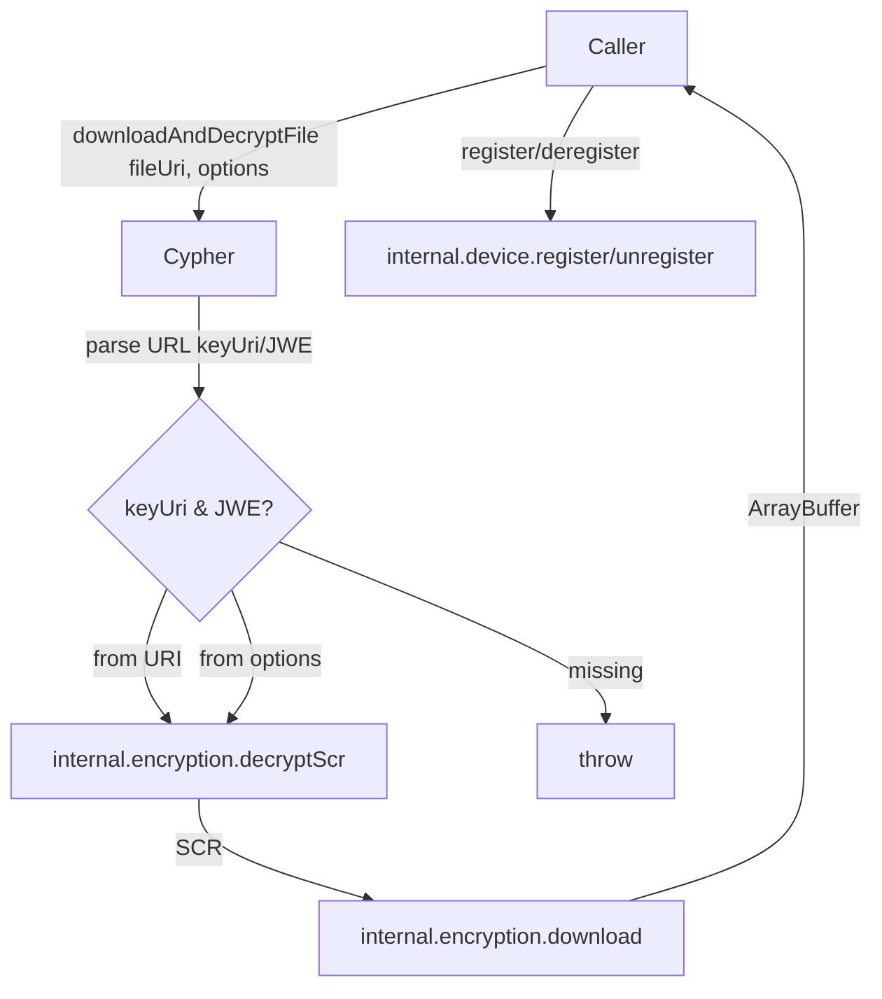
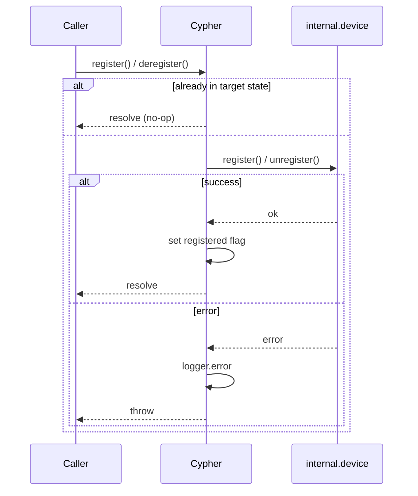
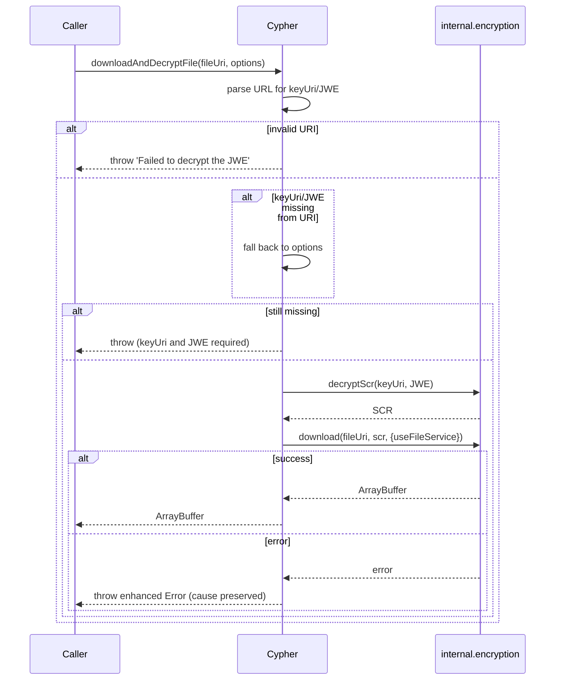
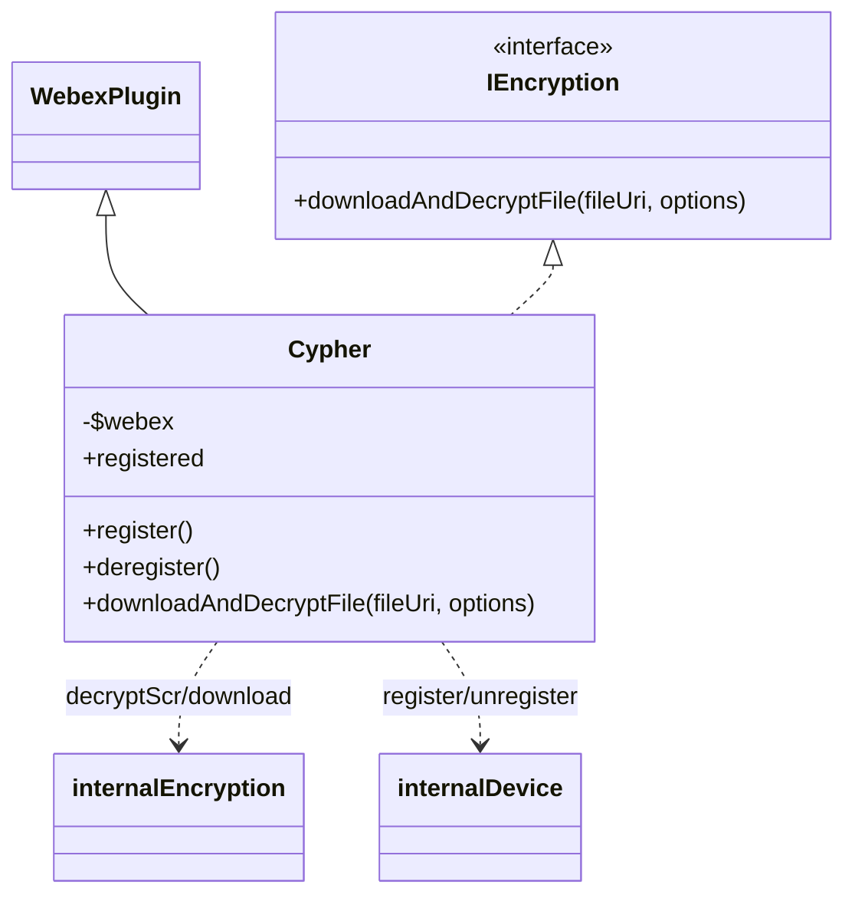

<!-- sdd-generated-metadata
generator: claude-cli
generator_model: us.anthropic.claude-opus-4-8
approved_by: pending-human-review
updated_at: 2026-08-06T00:00:00Z
validation_status: not-run
run_id: 51855eac-8de5-43a2-a3b6-dbcc55ebc91b
-->

# @webex/plugin-encryption — SPEC

> Start here → root [`AGENTS.md`](../../../../AGENTS.md) (agent entry) · router [`SPEC_INDEX.md`](../../../../ai-docs/SPEC_INDEX.md) · system [`ARCHITECTURE.md`](../../../../ai-docs/ARCHITECTURE.md). This is the module's canonical spec: orientation, requirements, design, flows, and tests.
> Context-efficiency: link to canonical docs — don't duplicate them. Load specs on demand per `SPEC_INDEX.md`.

## Metadata

| Field | Value |
|---|---|
| Module id | `plugin-encryption` |
| Source path(s) | `packages/@webex/plugin-encryption/src/` |
| Parent spec | `—` (registered public Webex plugin; composed by `webex-core`, no parent module) |
| Doc kind | Module spec |
| Coverage score | Pending coverage assessment |
| Generated from | `module-spec` @ SDLC template library `0.2.2` |
| generated_by / approved_by / updated_at | claude-cli / pending-human-review / 2026-08-06 |
| Validation status | not-run, validator `pending`, assessed 2026-08-06 |

Coverage score is `Pending coverage assessment` until the first coverage review runs. Manifest coverage
state (`Partial`) is authoritative and kept in `.sdd/manifest.json`.

## Evidence Rules
Every requirement cites concrete source evidence using `file path`. Test evidence is preferred for WHY.
Requirements are grounded in the current implementation under `src/` and its unit tests.

## Source Material Register

| Source material | Scope | Decision | Detail location or disposition |
|---|---|---|---|
| N/A | none | none | No prior AI-docs existed for this package; content is derived directly from `src/` and tests. |

## Overview

`@webex/plugin-encryption` is a public Webex SDK plugin (registered as `cypher`) that exposes a small,
public-facing encryption surface on top of the internal encryption/KMS machinery. Its headline capability is
`downloadAndDecryptFile`: given an encrypted attachment URL (or explicit `keyUri`/`jwe`), it decrypts the
JWE via KMS to obtain the SCR key, then downloads and decrypts the file, returning an `ArrayBuffer`.

The plugin (`src/cypher/index.ts`, a TypeScript `WebexPlugin` subclass implementing `IEncryption`) also
provides `register`/`deregister` to (un)register the device via the internal device plugin — required so KMS
and related services are available. It deliberately keeps a thin public API and delegates the cryptographic
work to `@webex/internal-plugin-encryption` (`decryptScr`, `download`). A maintainer should start at
`src/cypher/index.ts`.

## Purpose / Responsibility

Owns the public client-side surface for decrypting Webex-encrypted files: parse the file URI for
`keyUri`/`JWE`, decrypt the JWE to an SCR via internal encryption, and download+decrypt the file to an
`ArrayBuffer`; plus device register/deregister needed for KMS. It does NOT own the KMS protocol, key
management, or the actual crypto primitives (those live in `@webex/internal-plugin-encryption`).

## Stack

TypeScript (`src/**/*.ts`), built with `tsc` (declarations) plus `webex-legacy-tools`; docs via `typedoc`.
Tested with jest (`test:unit`) and `@webex/test-helper-mock-webex`; uses `jsdom` for browser-like tests.
Runtime dependencies: `@webex/internal-plugin-encryption`, `@webex/webex-core`. Uses the browser `URL` API to
parse file URIs. Evidence: `packages/@webex/plugin-encryption/package.json`,
`packages/@webex/plugin-encryption/src/cypher/index.ts`.

## Folder / Package Structure

```
packages/@webex/plugin-encryption/src/
├── index.ts               # registerPlugin('cypher', Cypher, {config}); re-exports IEncryption/FileDownloadOptions
├── config.ts              # plugin config ({ cypher: {} })
├── types.ts               # WebexSDK type used by the plugin
└── cypher/
    ├── index.ts           # Cypher WebexPlugin: register/deregister, downloadAndDecryptFile
    ├── types.ts           # FileDownloadOptions and IEncryption interfaces
    └── constants.ts       # CYPHER namespace + decryption event/status constants
```

## Key Files (source of truth)

| File | Holds |
|---|---|
| `packages/@webex/plugin-encryption/src/cypher/index.ts` | `Cypher` class: `register`, `deregister`, `downloadAndDecryptFile` |
| `packages/@webex/plugin-encryption/src/cypher/types.ts` | `FileDownloadOptions` (`useFileService`, `jwe`, `keyUri`) and `IEncryption` |
| `packages/@webex/plugin-encryption/src/cypher/constants.ts` | `CYPHER` namespace and decryption status/event constant strings |
| `packages/@webex/plugin-encryption/src/index.ts` | Registration name (`cypher`) and public type re-exports |

## Public Surface

Consumed as a public SDK plugin via `webex.cypher`. Delegates to the internal device and encryption plugins.

| Contract ID | Type | Surface | Purpose | Compatibility / deprecation | Schema / detail link | Root index |
|---|---|---|---|---|---|---|
| `cypher.register` | SDK | `register(): Promise<void>` | Register the device (idempotent via `registered` flag) for KMS/services | Stable plugin method | `packages/@webex/plugin-encryption/src/cypher/index.ts` | `../../../../ai-docs/CONTRACTS.md` |
| `cypher.deregister` | SDK | `deregister(): Promise<void>` | Unregister the device (idempotent) | Stable plugin method | `packages/@webex/plugin-encryption/src/cypher/index.ts` | `../../../../ai-docs/CONTRACTS.md` |
| `cypher.downloadAndDecryptFile` | SDK | `downloadAndDecryptFile(fileUri, options): Promise<ArrayBuffer>` | Decrypt JWE→SCR, then download+decrypt the file | Stable; implements `IEncryption` | `packages/@webex/plugin-encryption/src/cypher/index.ts` | `../../../../ai-docs/CONTRACTS.md` |

Compatibility notes:
- `downloadAndDecryptFile` implements the exported `IEncryption` interface; the `FileDownloadOptions` shape
  (`useFileService`, `jwe`, `keyUri`) is the public contract, re-exported from the package entry point.
- `keyUri`/`JWE` may be supplied either in the `fileUri` query string or in `options`; both are required
  (from one source or the other) to decrypt.

## Requires (dependencies)

- `@webex/webex-core` — base `WebexPlugin` and the `webex` instance (typed as `WebexSDK`).
- `@webex/internal-plugin-encryption` — `internal.encryption.decryptScr(keyUri, JWE)` and
  `internal.encryption.download(fileUri, scr, {useFileService})` do the actual decryption/download.
- `@webex/internal-plugin-device` (via `webex.internal.device`) — `register()`/`unregister()` used by
  `register`/`deregister`.
- Browser `URL` API — parses `keyUri`/`JWE` from the file URI.

## Requirements

| ID | WHAT | WHY | Source Evidence | Test / Example Evidence | Assumptions / Gaps | Confidence |
|---|---|---|---|---|---|---|
| `ENCRYPTION-R-001` | `register()` returns early (resolved) when already `registered`, else calls `internal.device.register()`, sets `registered = true` on success, and logs + rethrows on failure. | Device registration is required for KMS and must be idempotent. | `packages/@webex/plugin-encryption/src/cypher/index.ts` | `packages/@webex/plugin-encryption/test/unit/` | none identified | PRESENT |
| `ENCRYPTION-R-002` | `deregister()` returns early when not `registered`, else calls `internal.device.unregister()`, sets `registered = false` on success, and logs + rethrows on failure. | Mirror of register; idempotent teardown. | `packages/@webex/plugin-encryption/src/cypher/index.ts` | `packages/@webex/plugin-encryption/test/unit/` | none identified | PRESENT |
| `ENCRYPTION-R-003` | `downloadAndDecryptFile(fileUri, options)` parses `keyUri`/`JWE` from the `fileUri` query string; on an invalid URI it logs and throws a "Failed to decrypt the JWE" error. | The URI is the primary source of the key material. | `packages/@webex/plugin-encryption/src/cypher/index.ts` | `packages/@webex/plugin-encryption/test/unit/` | Uses the `URL` constructor | PRESENT |
| `ENCRYPTION-R-004` | When `keyUri`/`JWE` are absent from the URI, they are taken from `options`; if still missing, it throws requiring them from the URI or options. | Callers may pass key material out-of-band. | `packages/@webex/plugin-encryption/src/cypher/index.ts` | `packages/@webex/plugin-encryption/test/unit/` | none identified | PRESENT |
| `ENCRYPTION-R-005` | With `keyUri`+`JWE`, it calls `internal.encryption.decryptScr(keyUri, JWE)` to get the SCR, then `internal.encryption.download(fileUri, scr, {useFileService})`, returning the resulting `ArrayBuffer`. | JWE decrypts to the SCR key needed to decrypt the downloaded file. | `packages/@webex/plugin-encryption/src/cypher/index.ts` | `packages/@webex/plugin-encryption/test/unit/` | `useFileService` defaults to `false` | PRESENT |
| `ENCRYPTION-R-006` | Failures during decrypt/download are wrapped in an enhanced `Error` whose `message` includes the original message and stack and whose `cause` is the original error, then rethrown. | Preserve root-cause context across the decrypt/download boundary. | `packages/@webex/plugin-encryption/src/cypher/index.ts` | `packages/@webex/plugin-encryption/test/unit/` | none identified | PRESENT |

## Design Overview

`Cypher` extends `WebexPlugin` and implements `IEncryption`. Its constructor caches the typed webex instance
as `$webex`. `register`/`deregister` are idempotent wrappers over the internal device plugin that flip a
`registered` boolean and log success/failure through `$webex.logger`.

`downloadAndDecryptFile` follows a fixed four-step flow documented in-code: (1) parse the `fileUri` with the
`URL` API to extract `keyUri` and `JWE`; (2) if either is missing, fall back to `options.keyUri`/`options.jwe`
and throw if still absent; (3) call `internal.encryption.decryptScr(keyUri, JWE)` to obtain the SCR key; and
(4) call `internal.encryption.download(fileUri, scr, {useFileService})` to fetch and decrypt the file,
resolving an `ArrayBuffer`. URI-parsing failures and decrypt/download failures are handled separately: a bad
URI throws a "Failed to decrypt the JWE" error, while decrypt/download failures are wrapped in an enhanced
error that preserves the original message, stack, and `cause`.

## Data Flow



## Sequence Diagram(s)

Two distinct operation groups exist: device (de)registration and the file decrypt/download flow. They differ
in collaborators (internal device vs internal encryption) and failure behavior, so each has its own diagram;
the decrypt diagram covers the missing-key-material and decrypt/download-failure branches.

Sequence coverage:

| Operation group | Diagram | Failure / recovery coverage |
|---|---|---|
| Device register/deregister | 1. Register/deregister | Idempotent early return; device errors logged + rethrown |
| Download & decrypt file | 2. Decrypt + download | `alt` covers invalid URI, missing key material, and enhanced-error wrapping |

### 1. Register / deregister



### 2. Decrypt + download



## Class / Component Relationships



`Cypher` extends `WebexPlugin` and implements the exported `IEncryption` interface. It delegates crypto work
to `@webex/internal-plugin-encryption` and device lifecycle to `@webex/internal-plugin-device`.

## Use Cases

- **UC-1 Decrypt an attachment:** app calls `downloadAndDecryptFile(attachmentURL)` where the URL carries
  `keyUri`+`JWE` → SCR decrypt → download+decrypt → `ArrayBuffer` wrapped in a `File`. Evidence:
  `packages/@webex/plugin-encryption/src/cypher/index.ts`.
- **UC-2 Decrypt with explicit key material:** app calls `downloadAndDecryptFile(url, {jwe, keyUri})` when the
  URL lacks the query params. Evidence: `packages/@webex/plugin-encryption/src/cypher/index.ts`.
- **UC-3 Register/deregister the device:** app calls `register()` before using KMS-backed features and
  `deregister()` to tear down. Evidence: `packages/@webex/plugin-encryption/src/cypher/index.ts`.

## Concurrency & Reactive Flow

The plugin is request/response and largely stateless aside from the `registered` boolean guarding
register/deregister. `downloadAndDecryptFile` is a single async chain (parse → decryptScr → download) with no
shared mutable state. `register`/`deregister` are idempotent via the `registered` flag but do not internally
serialize concurrent calls, so callers should avoid overlapping (de)registration. Evidence:
`packages/@webex/plugin-encryption/src/cypher/index.ts`.

## Error Handling & Failure Modes

| Condition | Signal (error/code/result) | Caller recovery |
|---|---|---|
| Invalid `fileUri` (URL parse fails) | Thrown `Error('Failed to decrypt the JWE: ...')` with stack | Provide a valid URI |
| `keyUri`/`JWE` missing from URI and options | Thrown `Error` requiring them from URI or options | Supply `keyUri`+`jwe` in `options` |
| `decryptScr`/`download` failure | Thrown enhanced `Error` (message+stack, `cause` = original) | Inspect `cause`; retry or surface |
| `device.register`/`unregister` failure | `logger.error` + rethrown original error | Retry after resolving device/auth issue |

## Pitfalls

- Both `keyUri` and `JWE` are required to decrypt; they can come from the URI query string OR `options`, but
  one source must supply both. Evidence: `packages/@webex/plugin-encryption/src/cypher/index.ts`.
- `register`/`deregister` are idempotent via a boolean flag but are not internally serialized; overlapping
  calls can race. Evidence: `packages/@webex/plugin-encryption/src/cypher/index.ts`.
- Decrypt/download failures are re-thrown as a new enhanced `Error`; inspect `error.cause` for the root
  cause rather than the wrapper message. Evidence: `packages/@webex/plugin-encryption/src/cypher/index.ts`.
- `useFileService` defaults to `false` (direct URL download); set it to `true` to route through the Webex
  files service. Evidence: `packages/@webex/plugin-encryption/src/cypher/index.ts`,
  `packages/@webex/plugin-encryption/src/cypher/types.ts`.

## Test-Case Strategy (module)

Unit tests (jest + mock-webex, jsdom) should mock `internal.device` and `internal.encryption` to assert:
`register`/`deregister` early-return when already in state and set the flag on success / rethrow on error
(positive+negative); `downloadAndDecryptFile` extracts `keyUri`/`JWE` from the URI, falls back to `options`,
and throws when both are missing (negative); the happy path calls `decryptScr` then `download` and returns
the `ArrayBuffer` (positive); and decrypt/download errors are wrapped with `cause` preserved.

| Behavior / Requirement | Existing test evidence | Gap |
|---|---|---|
| `ENCRYPTION-R-001`..`ENCRYPTION-R-002` | `packages/@webex/plugin-encryption/test/unit/` | Assert idempotent early-return + error rethrow |
| `ENCRYPTION-R-003`..`ENCRYPTION-R-004` | `packages/@webex/plugin-encryption/test/unit/` | Add invalid-URI and missing-key-material negative cases |
| `ENCRYPTION-R-005` | `packages/@webex/plugin-encryption/test/unit/` | Assert decryptScr→download order + ArrayBuffer |
| `ENCRYPTION-R-006` | `packages/@webex/plugin-encryption/test/unit/` | Assert enhanced-error `cause` preservation |

## Traceability

- Repo architecture: [`ARCHITECTURE.md`](../../../../ai-docs/ARCHITECTURE.md) · Registry: [`SPEC_INDEX.md`](../../../../ai-docs/SPEC_INDEX.md)
- Coverage state & contracts baseline: `.sdd/manifest.json`
