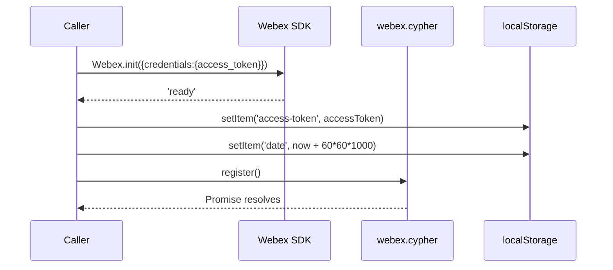
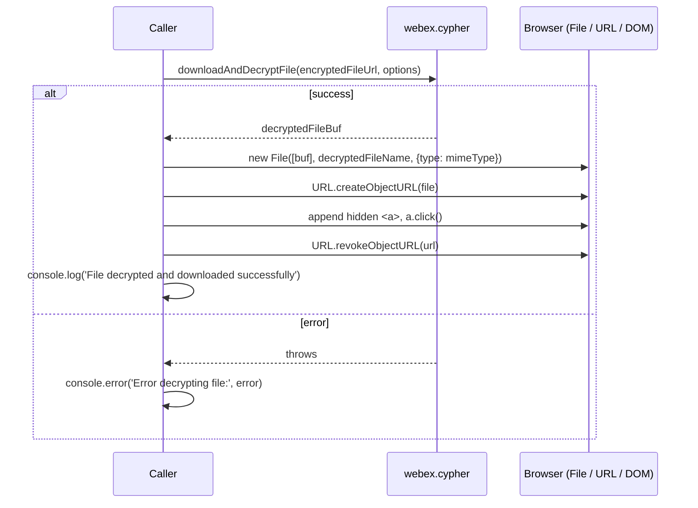
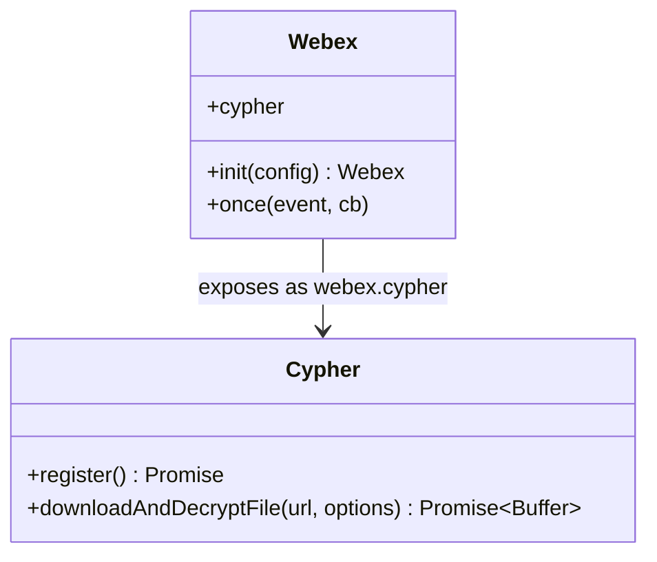

# plugin-encryption — SPEC

> Start here → root [`AGENTS.md`](../../../../AGENTS.md) (agent entry) · router [`SPEC_INDEX.md`](../../../../ai-docs/SPEC_INDEX.md) · system [`ARCHITECTURE.md`](../../../../ai-docs/ARCHITECTURE.md). This is the module's canonical spec: orientation, requirements, design, flows, state, protocol, UI, data, and tests.
> Context-efficiency: link to canonical docs — don't duplicate them. Load specs on demand per `SPEC_INDEX.md`.

## Metadata
| Field | Value |
|---|---|
| Module id | `plugin-encryption` |
| Source path(s) | `packages/@webex/plugin-encryption/` |
| Doc kind | Module spec |
| Coverage score | 56% (9/16) assessed 2026-07-28; critical 5/8, important 2/5; guide-only source (developer-quickstart.md), all requirements WEAK, no test evidence — stays Partial |
| Generated from | `module-spec` @ SDLC template library `0.2.1` |
| generated_by / approved_by / updated_at | generated_by: `module-spec`; approved_by: (unset); updated_at: `2026-07-28` |
| Validation status | not-run |

Coverage score: `Pending coverage assessment` before the first report; after assessment, replace with
`<0-100%>` plus the assessment date and short evidence summary. Manifest coverage state for this module is
**Partial** — this is an assess-only migration and the code remains the source of truth.

## Evidence Rules
Every generated requirement below must cite concrete source evidence using `file path`. Separate source
evidence, test evidence, examples, assumptions, and gaps so validators and future agents can distinguish
truth from context. Test evidence is preferred for WHY. If evidence is missing or conflicting, ask a focused
discovery question before finalizing the requirement; record unresolved answers as approved unknowns only
when the human explicitly defers or does not know. No automated tests were located for this module during
migration; requirements below cite the developer quickstart as source evidence and are marked WEAK where
unverified.

## Source Material Register
| Source material | Scope | Decision | Detail location or disposition |
|---|---|---|---|
| `packages/@webex/plugin-encryption/developer-quickstart.md` (routed, migrate-existing, retain) | overview / API / usage | used / migrated by meaning | Prerequisites, build/sample commands, environment selection, and the `initializeWebex` / `decryptFile` / example-usage code migrated by meaning into Requires, Use Cases, Public Surface, Data Flow, Sequence Diagram(s), and the fenced TypeScript examples below. |

## Overview
`plugin-encryption` demonstrates and exposes how to interact with the Webex encryption service through the
Webex JS SDK. It covers authentication, SDK initialization, and file decryption. Callers enter through the
`webex.cypher` surface: they first call `webex.cypher.register()` (once the SDK is `ready`) to register the
device/cipher before any decrypt operation, then call `webex.cypher.downloadAndDecryptFile(url, options)` to
retrieve and decrypt an encrypted attachment.

The module ships a browser "kitchen sink" sample that authenticates with a Webex access token, initializes
the SDK against a selectable environment (integration or production), and downloads-and-decrypts a file,
then triggers a browser download of the decrypted result. A maintainer should start from the developer
quickstart flow: obtain a scoped token, build and serve the sample, initialize Webex, register the cipher,
and decrypt.

This module relates to the broader Webex encryption/KMS service. For context, the
`PayloadTransformerInterceptor` in `webex-core` performs encryption/decryption for services that require it;
that interceptor is context only and is not part of this module's public surface.

## Purpose / Responsibility
Owns the client-side encryption interaction surface `webex.cypher`: register the cipher for the initialized
device and download-and-decrypt encrypted Webex file attachments. It does NOT own the KMS service itself or
the transport-level encryption performed by `webex-core`'s `PayloadTransformerInterceptor`.

## Stack
TypeScript (Webex JS SDK plugin). Browser sample built and served via workspace scripts
(`yarn build:local`, `yarn samples:build`, `yarn samples:serve`). No module-specific test stack was located
during migration.

## Folder / Package Structure
```
packages/@webex/plugin-encryption/
├── developer-quickstart.md   # routed source doc: prerequisites, build, auth, init, decrypt examples
└── ai-docs/                  # canonical SDD docs (this spec)
```

## Key Files (source of truth)
| File | Holds |
|---|---|
| `packages/@webex/plugin-encryption/developer-quickstart.md` | Prerequisites, build/sample commands, environment selection, and the authoritative `initializeWebex` / `decryptFile` / example-usage code migrated below. |

## Public Surface
| Contract ID | Type | Surface | Purpose | Compatibility / deprecation | Schema / detail link | Root index |
|---|---|---|---|---|---|---|
| `plugin-encryption.register` | SDK | `webex.cypher.register()` | Register the cipher/device before any decrypt operation; returns a Promise | Stable per source doc | `packages/@webex/plugin-encryption/developer-quickstart.md` | `../../../../ai-docs/SPEC_INDEX.md` |
| `plugin-encryption.downloadAndDecryptFile` | SDK | `webex.cypher.downloadAndDecryptFile(url, options)` | Download an encrypted file and return a decrypted buffer | Stable per source doc | `packages/@webex/plugin-encryption/developer-quickstart.md` | `../../../../ai-docs/SPEC_INDEX.md` |

`webex.cypher.downloadAndDecryptFile(encryptedFileUrl, options)` accepts an `options` object with fields:

| Field | Type | Meaning |
|---|---|---|
| `useFileService` | boolean | Whether to use the file service. |
| `jwe` | string | Provide the JWE here if it is not already present in the attachment URL. |
| `keyUri` | string | Provide the keyURI here if it is not already present in the attachment URL. |

The attachment URL may embed the key URI and JWE as query params, e.g.
`https://myfileurl.xyz/zzz/fileid?keyUri=somekeyuri&JWE=somejwe`. When present in the URL, the corresponding
`options` fields may be omitted.

Compatibility notes:
- The public surface is `webex.cypher` (`register`, `downloadAndDecryptFile`); treat these signatures as the
  stable contract for consumers.

## Requires (dependencies)
- **Webex JS SDK** (`Webex.init`) to construct and initialize the client; the initialized instance exposes
  `webex.cypher`.
- **A Webex access token** with the `spark:kms` scope — obtained from the Webex developer portal, or from the
  agent desktop by using developer tools and inspecting local storage for the access token.
- **An environment selection** — integration or production — chosen before initialization.
- **Browser context** — the decrypt flow uses `File`, `window.URL.createObjectURL`/`revokeObjectURL`, and a
  temporary anchor element to trigger the download; `localStorage` is used to persist the token.

## Requirements
| ID | WHAT | WHY | Source Evidence | Test / Example Evidence | Assumptions / Gaps | Confidence |
|---|---|---|---|---|---|---|
| `PLUGIN-ENCRYPTION-R-001` | An access token with the `spark:kms` scope is required; it may come from the Webex developer portal or from the agent desktop via dev-tools local-storage inspection. | Without a `spark:kms`-scoped token the encryption/KMS service cannot be accessed. | `packages/@webex/plugin-encryption/developer-quickstart.md` | None found | Exact scope-enforcement point not verified in code. | WEAK |
| `PLUGIN-ENCRYPTION-R-002` | The SDK is initialized via `Webex.init({credentials:{access_token: accessToken}})`; callers wait for the `ready` event, then call `webex.cypher.register()`. | Initialization registers the SDK as a device; the cipher must be registered before decrypt operations. | `packages/@webex/plugin-encryption/developer-quickstart.md` | None found | Behavior of `register()` beyond returning a Promise not verified in code. | WEAK |
| `PLUGIN-ENCRYPTION-R-003` | On init, the access token is stored in `localStorage` as `access-token`, and `date` is set to `new Date().getTime() + 60*60*1000` (a 1-hour expiration). | Persists the token and records a 1-hour expiry window for the sample session. | `packages/@webex/plugin-encryption/developer-quickstart.md` | None found | Whether expiry is enforced on read is not shown in source. | WEAK |
| `PLUGIN-ENCRYPTION-R-004` | `webex.cypher.register()` must be called (after `ready`) before any decrypt operation. | Registration is a precondition for decrypt. | `packages/@webex/plugin-encryption/developer-quickstart.md` | None found | Failure mode when unregistered not documented in source. | WEAK |
| `PLUGIN-ENCRYPTION-R-005` | `webex.cypher.downloadAndDecryptFile(encryptedFileUrl, options)` returns a decrypted buffer. | Callers need the raw decrypted bytes to build a downloadable file. | `packages/@webex/plugin-encryption/developer-quickstart.md` | None found | Buffer type not specified in source. | WEAK |
| `PLUGIN-ENCRYPTION-R-006` | The `options` object supports `useFileService` (boolean), `jwe` (JWE if not in the URL), and `keyUri` (keyURI if not in the URL); the attachment URL may embed `keyUri=` and `JWE=` query params. | Key material and JWE can be supplied either inline in the URL or via options. | `packages/@webex/plugin-encryption/developer-quickstart.md` | None found | Precedence when both URL and options provide values is not stated. | WEAK |
| `PLUGIN-ENCRYPTION-R-007` | After decryption, the buffer is wrapped in a `File` with `{type: mimeType}`, an object URL is created, a temporary hidden anchor triggers download, then the object URL is revoked; errors are logged. | Delivers the decrypted content to the user as a browser download and cleans up the object URL. | `packages/@webex/plugin-encryption/developer-quickstart.md` | None found | DOM/browser-only flow; not applicable to non-browser consumers. | WEAK |

## Design Overview
The module wraps the Webex encryption/KMS interaction behind the `webex.cypher` surface. The design separates
three phases: authentication (obtain a `spark:kms`-scoped token), initialization + registration (init the SDK,
wait for `ready`, register the cipher), and decryption (download-and-decrypt, then materialize a browser
download). Token persistence in `localStorage` with a 1-hour `date` expiry keeps the sample session usable
across reloads. Key material (JWE, keyURI) can be carried either in the attachment URL query params or in the
`options` object, giving callers flexibility in how they pass encryption metadata.

## Data Flow

```mermaid
flowchart LR
  U[User / caller] -->|access_token| Init["Webex.init({credentials:{access_token}})"]
  Init -->|ready event| LS["localStorage: access-token, date = now + 1h"]
  LS --> Reg["webex.cypher.register()"]
  Reg --> Dec["webex.cypher.downloadAndDecryptFile(url, options)"]
  Dec -->|decrypted buffer| File["new File([buf], name, {type: mimeType})"]
  File --> ObjURL["URL.createObjectURL"]
  ObjURL --> Anchor["hidden <a> click -> download"]
  Anchor --> Revoke["URL.revokeObjectURL"]
```


## Sequence Diagram(s)
Sequence coverage:

| Operation group | Diagram | Failure / recovery coverage |
|---|---|---|
| Initialize + register | Init & register | No explicit failure branch in source; `register()` resolves before proceeding. |
| Download & decrypt file | Decrypt file | `catch` branch logs `Error decrypting file:` and aborts the download. |





## Class / Component Relationships

The initialized `Webex` instance exposes the cipher surface as `webex.cypher`. `register()` is a precondition
for `downloadAndDecryptFile(url, options)`. Separately, in `webex-core`, `PayloadTransformerInterceptor`
performs encryption/decryption for services that require it (context only; not part of this module's surface).

## Use Cases
- **UC-1 Getting Started (build + authenticate + initialize):** A developer (1) clones the repository,
  (2) runs `yarn build:local`, (3) runs `yarn samples:build && yarn samples:serve`. Then they navigate to
  `https://localhost:8000/samples/plugin-encryption`, get an access token from the developer portal or agent
  desktop (with `spark:kms` scope), select the environment (integration or production), enter the token in the
  "Access Token" field, and click "Initialize Webex". The SDK initializes and registers the device.
  Evidence: `packages/@webex/plugin-encryption/developer-quickstart.md`. Test evidence: None found.

  The initialization is performed as follows:

  ```typescript
  function initializeWebex(accessToken) {
    const webex = Webex.init({
      credentials: {
        access_token: accessToken,
      },
    });

    return new Promise((resolve) => {
      webex.once('ready', () => {
        localStorage.setItem('access-token', accessToken);
        localStorage.setItem('date', new Date().getTime() + 60 * 60 * 1000); // 1 hour expiration
        webex.cypher.register().then(() => {
          resolve(webex);
        });
      });
    });
  }
  ```

- **UC-2 Decrypt file:** Given an initialized `webex`, an encrypted file URL, an `options` object, a target
  file name, and a MIME type, the caller downloads-and-decrypts the file and triggers a browser download.
  Evidence: `packages/@webex/plugin-encryption/developer-quickstart.md`. Test evidence: None found.

  ```typescript
  async function decryptFile(webex, encryptedFileUrl, options, decryptedFileName, mimeType) {
    try {
      const decryptedFileBuf = await webex.cypher.downloadAndDecryptFile(encryptedFileUrl, options);
      const file = new File([decryptedFileBuf], decryptedFileName, { type: mimeType });
      const url = window.URL.createObjectURL(file);
      const a = document.createElement('a');
      a.style.display = 'none';
      a.href = url;
      a.download = decryptedFileName;
      document.body.appendChild(a);
      a.click();
      window.URL.revokeObjectURL(url);
      console.log('File decrypted and downloaded successfully');
    } catch (error) {
      console.error('Error decrypting file:', error);
    }
  }
  ```

  Example end-to-end usage:

  ```typescript
  const accessToken = 'YOUR_ACCESS_TOKEN';
  const attachmentURL = 'https://myfileurl.xyz/zzz/fileid?keyUri=somekeyuri&JWE=somejwe';
  const decryptedFileName = 'my-decrypted-file.jpeg';
  const mimeType = 'image/jpeg';
  const options = {
    useFileService: false,
    jwe: somejwe, // Provide the JWE here if not already present in the attachmentURL
    keyUri: someKeyUri // Provide the keyURI here if not already present in the attachmentURL
  };

  initializeWebex(accessToken).then(async (webex) => {
    await decryptFile(webex, attachmentURL, options, decryptedFileName, mimeType);
  });
  ```

## Pitfalls
- The cipher must be registered (`webex.cypher.register()`) after the `ready` event and before any decrypt
  call; skipping registration breaks decryption.
- The token stored in `localStorage` is given a 1-hour expiration via the `date` key
  (`new Date().getTime() + 60*60*1000`); a stale token will fail auth.
- The token must carry the `spark:kms` scope; a token lacking it cannot access the encryption/KMS service.
- Key material (`jwe`, `keyUri`) may live either in the attachment URL query params (`keyUri=`, `JWE=`) or in
  the `options` object — omitting it from both will fail decryption.
- The decrypt-and-download flow is browser-only (relies on `File`, `URL.createObjectURL`/`revokeObjectURL`,
  and a DOM anchor); it is not directly usable in non-browser environments.
- Errors from `downloadAndDecryptFile` are only logged (`console.error('Error decrypting file:', error)`) —
  the download is silently skipped on failure.

## Test-Case Strategy (module)
No automated tests were located for this module during migration. Recommended coverage: a positive path
asserting `register()` resolves and `downloadAndDecryptFile` returns a decrypted buffer that is materialized
into a `File` and downloaded; and a negative path asserting the `catch` branch logs an error and skips the
download when decryption throws. Key edge cases: token missing `spark:kms` scope, expired `date` in
`localStorage`, and key material absent from both the URL and `options`.

| Behavior / Requirement | Existing test evidence | Gap |
|---|---|---|
| `PLUGIN-ENCRYPTION-R-001` | None found | No test for `spark:kms` scope requirement |
| `PLUGIN-ENCRYPTION-R-002` | None found | No test for init + `ready` + register sequence |
| `PLUGIN-ENCRYPTION-R-003` | None found | No test for `localStorage` token/expiry persistence |
| `PLUGIN-ENCRYPTION-R-004` | None found | No test for register-before-decrypt precondition |
| `PLUGIN-ENCRYPTION-R-005` | None found | No test for decrypted-buffer return |
| `PLUGIN-ENCRYPTION-R-006` | None found | No test for `options` fields / URL query-param key material |
| `PLUGIN-ENCRYPTION-R-007` | None found | No test for File/objectURL download + error logging |

## Traceability
- Repo architecture: `../../../../ai-docs/ARCHITECTURE.md` · Registry: `../../../../ai-docs/SPEC_INDEX.md`
- Coverage state & contracts baseline: `.sdd/manifest.json`
