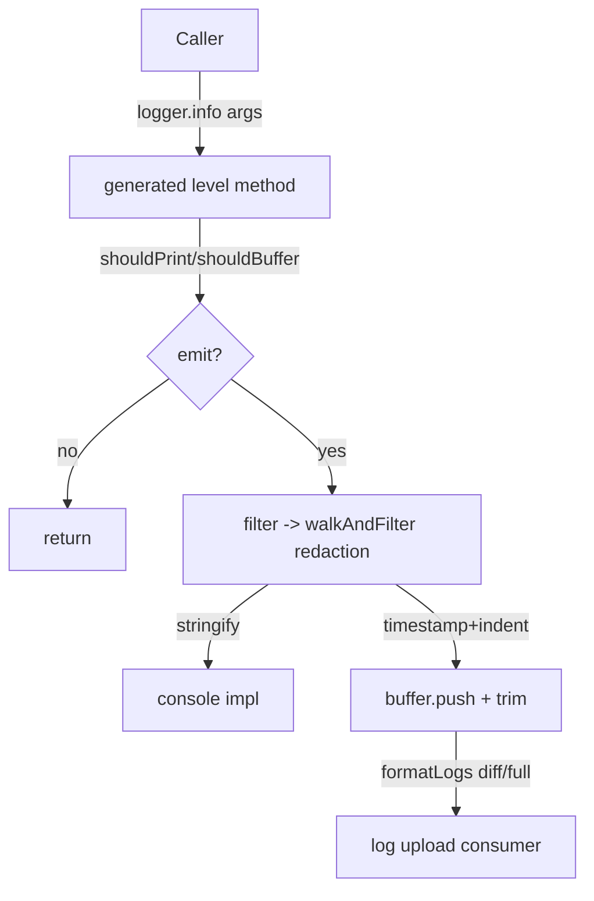
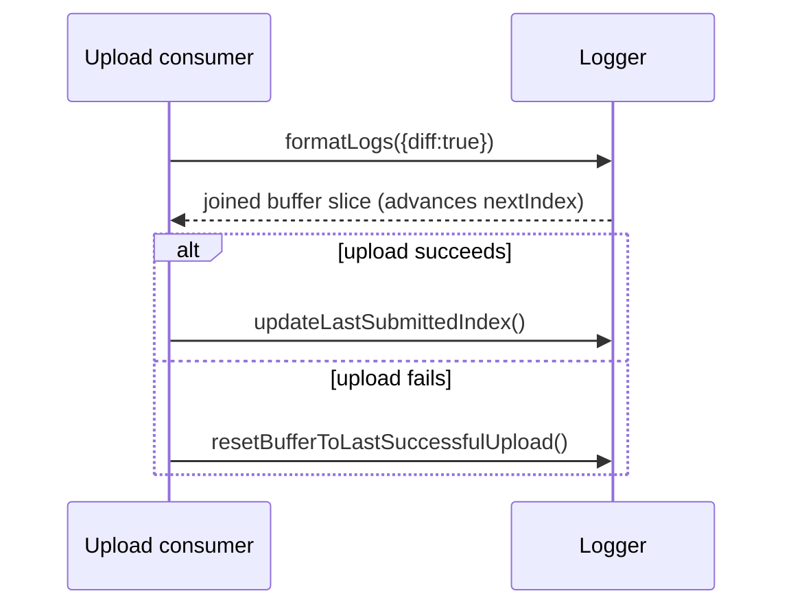
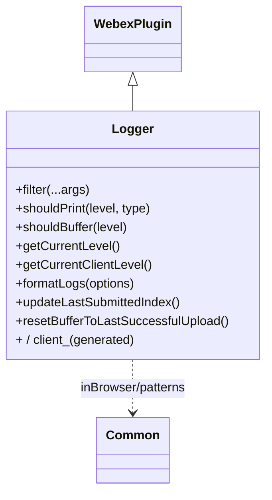

<!-- sdd-generated-metadata
generator: claude-cli
generator_model: us.anthropic.claude-opus-4-8
approved_by: pending-human-review
updated_at: 2026-08-06T00:00:00Z
validation_status: not-run
run_id: 51855eac-8de5-43a2-a3b6-dbcc55ebc91b
-->

# @webex/plugin-logger — SPEC

> Start here → root [`AGENTS.md`](../../../../AGENTS.md) (agent entry) · router [`SPEC_INDEX.md`](../../../../ai-docs/SPEC_INDEX.md) · system [`ARCHITECTURE.md`](../../../../ai-docs/ARCHITECTURE.md). This is the module's canonical spec: orientation, requirements, design, flows, and tests.
> Context-efficiency: link to canonical docs — don't duplicate them. Load specs on demand per `SPEC_INDEX.md`.

## Metadata

| Field | Value |
|---|---|
| Module id | `plugin-logger` |
| Source path(s) | `packages/@webex/plugin-logger/src/` |
| Parent spec | `—` (registered public Webex plugin; composed by `webex-core`, no parent module) |
| Doc kind | Module spec |
| Coverage score | Pending coverage assessment |
| Generated from | `module-spec` @ SDLC template library `0.2.2` |
| generated_by / approved_by / updated_at | claude-cli / pending-human-review / 2026-08-06 |
| Validation status | not-run, validator `pending`, assessed 2026-08-06 |

Coverage score is `Pending coverage assessment` until the first coverage review runs. Manifest coverage
state (`Partial`) is authoritative and kept in `.sdd/manifest.json`.

## Evidence Rules
Every requirement cites concrete source evidence using `file path`. Test evidence is preferred for WHY.
Requirements are grounded in the current implementation under `src/` and its unit tests.

## Source Material Register

| Source material | Scope | Decision | Detail location or disposition |
|---|---|---|---|
| N/A | none | none | No prior AI-docs existed for this package; content is derived directly from `src/` and tests. |

## Overview

`@webex/plugin-logger` is a public Webex SDK plugin (registered as `logger`, `replace: true`) that provides
the SDK's logging surface. It generates one method per log level (`error`, `warn`, `log`, `info`, `debug`,
`trace`, plus `group`/`groupEnd`) for both SDK logs and client logs (`client_*`), decides at call time whether
each entry should print to the console and/or be buffered, and maintains an in-memory buffer used for log
upload/support.

The plugin (`src/logger.js`, a `WebexPlugin`) does three jobs: (1) level control — resolve the effective SDK
and client log levels from config, env (`WEBEX_LOG_LEVEL`), test mode, and server-side feature toggles;
(2) redaction — strip `authorization` fields and redact emails/MTIDs before anything is printed or buffered;
and (3) buffering — append stringified, timestamped entries to either a single buffer or separate SDK/client
buffers, trimming to `historyLength` and exposing `formatLogs` for upload. A maintainer should start at
`src/logger.js`.

## Purpose / Responsibility

Owns SDK/client logging: level resolution, sensitive-data filtering, console printing, and the rolling log
buffer (with formatting/index bookkeeping for uploads). It does NOT own log upload transport, metrics, or the
feature-toggle store (it only reads the `log-level` developer feature).

## Stack

JavaScript (Babel), built with `webex-legacy-tools`. Uses `@webex/common` (`inBrowser`, `patterns`) and
`lodash` (`cloneDeep`, `has`, `isArray`, `isObject`, `isString`). Tested with jest (`test:unit`) and karma
(`test:browser`) plus the `@webex/test-helper-*` chai/mocha/mock-webex/test-users helpers. Runtime
dependencies: `@webex/webex-core`, `@webex/common`, `lodash`. Evidence:
`packages/@webex/plugin-logger/package.json`.

## Folder / Package Structure

```
packages/@webex/plugin-logger/src/
├── index.js    # registerPlugin('logger', Logger, {config, replace:true}); re-exports levels
├── logger.js   # Logger WebexPlugin: level resolution, filter/redaction, buffering, makeLoggerMethod
└── config.js   # default level (WEBEX_LOG_LEVEL) and historyLength (10000)
```

## Key Files (source of truth)

| File | Holds |
|---|---|
| `packages/@webex/plugin-logger/src/logger.js` | `precedence`/`levels`/`fallbacks` maps, `walkAndFilter` redaction, level resolution, buffering, and `makeLoggerMethod` |
| `packages/@webex/plugin-logger/src/config.js` | Default `level` (from `WEBEX_LOG_LEVEL`) and `historyLength` (10000) |
| `packages/@webex/plugin-logger/src/index.js` | Registration name (`logger`), `replace: true`, and `levels` export |

## Public Surface

Consumed as a public SDK plugin via `webex.logger`. Also used internally by every other plugin for logging.

| Contract ID | Type | Surface | Purpose | Compatibility / deprecation | Schema / detail link | Root index |
|---|---|---|---|---|---|---|
| `logger.<level>` | SDK | `logger.error/warn/log/info/debug/trace/group/groupEnd(...args)` | Log at a level (SDK log type); redacts + prints/buffers per level | Stable; generated per level | `packages/@webex/plugin-logger/src/logger.js` | `../../../../ai-docs/CONTRACTS.md` |
| `logger.client_<level>` | SDK | `logger.client_error/...(...args)` | Log at a level as a client-type log (separate level/name) | Stable; generated per level | `packages/@webex/plugin-logger/src/logger.js` | `../../../../ai-docs/CONTRACTS.md` |
| `logger.logToBuffer` / `logger.client_logToBuffer` | SDK | `logToBuffer(...args)` | Buffer-only entry that never prints | Stable | `packages/@webex/plugin-logger/src/logger.js` | `../../../../ai-docs/CONTRACTS.md` |
| `logger.formatLogs` | SDK | `formatLogs({diff}): string` | Serialize the buffer (optionally only the diff) for upload | Stable | `packages/@webex/plugin-logger/src/logger.js` | `../../../../ai-docs/CONTRACTS.md` |
| `logger.updateLastSubmittedIndex` | SDK | `updateLastSubmittedIndex(): void` | Mark buffer index as successfully uploaded | Stable | `packages/@webex/plugin-logger/src/logger.js` | `../../../../ai-docs/CONTRACTS.md` |
| `logger.resetBufferToLastSuccessfulUpload` | SDK | `resetBufferToLastSuccessfulUpload(): void` | Rewind buffer index to last successful upload | Stable | `packages/@webex/plugin-logger/src/logger.js` | `../../../../ai-docs/CONTRACTS.md` |
| `logger.level` / `logger.client_level` | SDK | derived getters | Current resolved SDK / client log level | Stable | `packages/@webex/plugin-logger/src/logger.js` | `../../../../ai-docs/CONTRACTS.md` |
| `levels` | SDK export | `import {levels}` | Ordered list of log level names (minus `silent`) | Stable named export | `packages/@webex/plugin-logger/src/logger.js` | `../../../../ai-docs/CONTRACTS.md` |

Compatibility notes:
- The set and ordering of `levels` (`error < warn < log < info < debug < trace`, with `group`/`groupEnd`) and
  the `precedence`/`fallbacks` maps are the behavioral contract.
- The plugin registers with `replace: true`, so it overrides any prior `logger` registration.
- `formatLogs` output format (timestamped, indented, `\n`-joined stringified entries) is consumed by upload.

## Requires (dependencies)

- `@webex/webex-core` — base `WebexPlugin` and `registerPlugin`.
- `@webex/common` — `inBrowser` (print behavior) and `patterns` (`containsEmails`, `containsMTID`) for
  redaction.
- `lodash` — `cloneDeep`, `has`, `isArray`, `isObject`, `isString`.
- Reads `webex.internal.device.features.developer.get('log-level')` for the server-side level toggle (when a
  device is present).

## Requirements

| ID | WHAT | WHY | Source Evidence | Test / Example Evidence | Assumptions / Gaps | Confidence |
|---|---|---|---|---|---|---|
| `LOGGER-R-001` | For each level in `levels`, `logger[level]` and `logger[`client_${level}`]` methods are generated via `makeLoggerMethod`, using the `fallbacks` map to pick a console impl that exists. | Provide a uniform per-level API for SDK and client logs while degrading to available console methods. | `packages/@webex/plugin-logger/src/logger.js` | `packages/@webex/plugin-logger/test/unit/` | none identified | PRESENT |
| `LOGGER-R-002` | `getCurrentLevel()` resolves the SDK level in order: explicit `config.level`, `WEBEX_LOG_LEVEL` env (if a known level), `'trace'` in `NODE_ENV==='test'`, the `developer.log-level` device feature, else `'error'`. | Level must be controllable by config, env, test mode, and server toggle with a safe default. | `packages/@webex/plugin-logger/src/logger.js` | `packages/@webex/plugin-logger/test/unit/` | none identified | PRESENT |
| `LOGGER-R-003` | `getCurrentClientLevel()` uses `config.clientLevel` when set, otherwise falls back to the SDK level. | Client logs can have an independent level but default to the SDK level. | `packages/@webex/plugin-logger/src/logger.js` | `packages/@webex/plugin-logger/test/unit/` | none identified | PRESENT |
| `LOGGER-R-004` | `filter(...args)` redacts each arg: `Error`s pass through (stringified in browser test mode), other args are `cloneDeep`d and run through `walkAndFilter`, which deletes `authorization`-keyed fields and replaces emails/MTIDs with `[REDACTED]` (guarding against circular refs). | Never print or buffer auth tokens, emails, or MTIDs. | `packages/@webex/plugin-logger/src/logger.js` | `packages/@webex/plugin-logger/test/unit/` | Uses a `visited` list to prevent circular recursion | PRESENT |
| `LOGGER-R-005` | `shouldPrint(level, type)` prints when the level's precedence ≤ the current SDK/client level; `shouldBuffer(level)` buffers when precedence ≤ `config.bufferLogLevel` (default `info`). | Separate gating for console output vs the upload buffer keeps noisy debug/trace out of uploads. | `packages/@webex/plugin-logger/src/logger.js` | `packages/@webex/plugin-logger/test/unit/` | none identified | PRESENT |
| `LOGGER-R-006` | A generated method returns early when neither printing nor buffering applies; otherwise it prefixes a client name (`wx-js-sdk` for SDK, `config.clientName`/type for client), stringifies args (handling circular refs), prints via `console[impl]`, and pushes a timestamped/indented entry to the buffer. | Do the redaction/stringification work only when an entry will actually be emitted. | `packages/@webex/plugin-logger/src/logger.js` | `packages/@webex/plugin-logger/test/unit/` | Test mode prepends last 3 chars of device url when present | PRESENT |
| `LOGGER-R-007` | The buffer is trimmed to `historyLength`, and `nextIndex`/`lastSubmitted` are adjusted (clamped at 0) when entries are spliced; `group`/`groupEnd` adjust `groupLevel`. | Bound memory and keep upload indices consistent after trimming. | `packages/@webex/plugin-logger/src/logger.js`, `packages/@webex/plugin-logger/src/config.js` | `packages/@webex/plugin-logger/test/unit/` | `historyLength` default 10000 (config) / 1000 (doc typedef) | PRESENT |
| `LOGGER-R-008` | `formatLogs({diff})` returns the buffer joined by `\n`; when `separateLogBuffers` is set it time-merges the SDK and client buffers; `diff` returns only entries since the last call and advances `nextIndex`. | Support full or incremental buffer serialization for upload, across single or separate buffers. | `packages/@webex/plugin-logger/src/logger.js` | `packages/@webex/plugin-logger/test/unit/` | none identified | PRESENT |
| `LOGGER-R-009` | `updateLastSubmittedIndex()` sets `lastSubmitted = nextIndex` and `resetBufferToLastSuccessfulUpload()` sets `nextIndex = lastSubmitted`, for single or separate buffers. | Allow an upload to commit or roll back the buffer read position. | `packages/@webex/plugin-logger/src/logger.js` | `packages/@webex/plugin-logger/test/unit/` | none identified | PRESENT |

## Design Overview

`Logger` extends `WebexPlugin`. Log levels are ordered by a `precedence` map; `levels` is that list minus
`silent`. At module load, `makeLoggerMethod` generates an SDK method and a `client_` method for every level,
choosing a console implementation from the `fallbacks` map so, e.g., `trace` degrades to `debug`→`info`→`log`
when the runtime lacks `console.trace`. Two buffer-only helpers (`logToBuffer`, `client_logToBuffer`) never
print.

Each generated method is late-binding: it reads the effective level and buffer references at call time
(because Ampersand config is not fully initialized during `initialize`). It computes `shouldPrint`/
`shouldBuffer`, returns early if neither applies, then redacts args via `filter`→`walkAndFilter` (deleting
`authorization` fields, redacting emails/MTIDs), stringifies them (with circular-ref handling), prints via
`console[impl]`, and pushes a timestamped/group-indented entry to the buffer. The buffer supports a single
shared buffer or separate SDK/client buffers (`separateLogBuffers`), each with `buffer`/`nextIndex`/
`lastSubmitted` bookkeeping used by `formatLogs`, `updateLastSubmittedIndex`, and
`resetBufferToLastSuccessfulUpload` to drive incremental uploads. Trimming to `historyLength` clamps the
indices at zero.

## Data Flow



## Sequence Diagram(s)

Two distinct operation groups exist: emitting a single log entry (gate → redact → print/buffer) and the
upload bookkeeping cycle (format → commit/rollback). They differ in trigger and state effect, so each has its
own diagram; the emit diagram covers the early-return branch.

Sequence coverage:

| Operation group | Diagram | Failure / recovery coverage |
|---|---|---|
| Emit a log entry | 1. Log emission | `opt` early-return when neither print nor buffer; try/catch swallows failures (warns unless neverPrint) |
| Upload buffer cycle | 2. Format + commit/rollback | `resetBufferToLastSuccessfulUpload` rewinds on failed upload |

### 1. Log emission

```mermaid
sequenceDiagram
    participant C as Caller
    participant L as Logger method
    participant Con as console
    participant B as buffer
    C->>L: logger.info(...args)
    L->>L: shouldPrint / shouldBuffer
    opt neither print nor buffer
        L-->>C: return (no-op)
    end
    L->>L: filter -> walkAndFilter (redact) + stringify
    opt shouldPrint
        L->>Con: console[impl](...toPrint)
    end
    opt shouldBuffer
        L->>B: push [indent, ISO time, ...entry]; trim to historyLength
    end
```

### 2. Format + commit/rollback



## Class / Component Relationships



`Logger` extends `WebexPlugin`. Its per-level methods are attached to the prototype by the module-scoped
`makeLoggerMethod` factory; `walkAndFilter` is a module-private redaction helper.

## Use Cases

- **UC-1 Log at a level:** any code calls `webex.logger.info(obj)` → redacted, printed if level permits, and
  buffered if within `bufferLogLevel`. Evidence: `packages/@webex/plugin-logger/src/logger.js`.
- **UC-2 Client vs SDK logs:** app calls `logger.client_error(...)` to tag logs with the client name and
  client level. Evidence: `packages/@webex/plugin-logger/src/logger.js`.
- **UC-3 Upload logs:** support flow calls `formatLogs({diff:true})`, uploads, then
  `updateLastSubmittedIndex()` (or `resetBufferToLastSuccessfulUpload()` on failure). Evidence:
  `packages/@webex/plugin-logger/src/logger.js`.

## Concurrency & Reactive Flow

Logging is synchronous per call; there is no async I/O in the emit path. State is the shared/ separate
buffers and `groupLevel`; because entries are appended and trimmed synchronously, ordering is preserved.
`level`/`client_level` are `derived` with `cache: false`, so they re-resolve on every read to reflect live
config/env/feature changes. Evidence: `packages/@webex/plugin-logger/src/logger.js`.

## Error Handling & Failure Modes

| Condition | Signal (error/code/result) | Caller recovery |
|---|---|---|
| Failure inside a generated log method | Caught; `console.warn('failed to execute Logger#<level>')` unless `neverPrint` | None; logging is best-effort |
| Circular reference in a logged object | `walkAndFilter` uses a `visited` list; stringify discards circular keys | None; logging still succeeds |
| Unknown `WEBEX_LOG_LEVEL` value | Ignored; falls through to next resolution step (feature/`error`) | Set a valid level name |

## Pitfalls

- Levels resolve at call time from several sources; an unexpected level often means `WEBEX_LOG_LEVEL`,
  `config.level`, or the `developer.log-level` feature is set. Evidence:
  `packages/@webex/plugin-logger/src/logger.js`.
- `debug`/`trace` are printed but not buffered by default (`bufferLogLevel` defaults to `info`), so they won't
  appear in uploaded logs. Evidence: `packages/@webex/plugin-logger/src/logger.js`.
- Redaction only strips `authorization`-keyed fields and email/MTID patterns; other secrets are not
  auto-redacted. Evidence: `packages/@webex/plugin-logger/src/logger.js`.
- The default `historyLength` in `config.js` is 10000 (the doc typedef example says 1000); trimming adjusts
  `nextIndex`/`lastSubmitted`. Evidence: `packages/@webex/plugin-logger/src/config.js`,
  `packages/@webex/plugin-logger/src/logger.js`.
- The plugin registers with `replace: true`; a later `logger` registration would be needed to override it,
  and it overrides any earlier one. Evidence: `packages/@webex/plugin-logger/src/index.js`.

## Test-Case Strategy (module)

Unit tests (jest/karma + mock-webex) should assert: level resolution honors config/env/test/feature/default
order (positive) and ignores unknown env values (negative); `filter`/`walkAndFilter` removes `authorization`
fields and redacts emails/MTIDs while surviving circular refs; `shouldPrint`/`shouldBuffer` gate correctly per
level; generated methods early-return when neither applies and otherwise print+buffer; buffer trimming clamps
indices; and `formatLogs`/`updateLastSubmittedIndex`/`resetBufferToLastSuccessfulUpload` behave for single and
separate buffers.

| Behavior / Requirement | Existing test evidence | Gap |
|---|---|---|
| `LOGGER-R-001` | `packages/@webex/plugin-logger/test/unit/` | Assert per-level method + fallback impl selection |
| `LOGGER-R-002`..`LOGGER-R-003` | `packages/@webex/plugin-logger/test/unit/` | Cover each resolution branch + unknown-env negative |
| `LOGGER-R-004` | `packages/@webex/plugin-logger/test/unit/` | Assert auth strip + email/MTID redaction + circular ref |
| `LOGGER-R-005`..`LOGGER-R-006` | `packages/@webex/plugin-logger/test/unit/` | Assert print/buffer gating + early return |
| `LOGGER-R-007`..`LOGGER-R-009` | `packages/@webex/plugin-logger/test/unit/` | Assert trim/index math + formatLogs diff + commit/rollback |

## Traceability

- Repo architecture: [`ARCHITECTURE.md`](../../../../ai-docs/ARCHITECTURE.md) · Registry: [`SPEC_INDEX.md`](../../../../ai-docs/SPEC_INDEX.md)
- Coverage state & contracts baseline: `.sdd/manifest.json`
