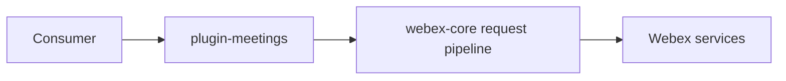
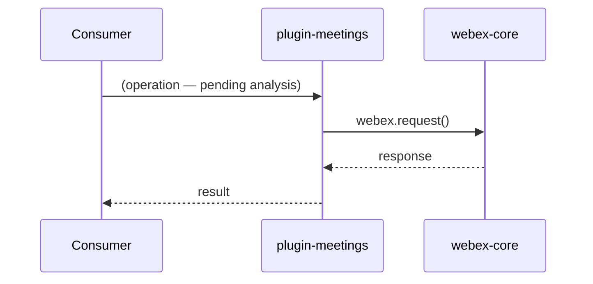

# @webex/plugin-meetings — SPEC

> Start here → root [`AGENTS.md`](../../../../AGENTS.md) (agent entry) · router [`SPEC_INDEX.md`](../../../../ai-docs/SPEC_INDEX.md) · system [`ARCHITECTURE.md`](../../../../ai-docs/ARCHITECTURE.md). This is the module's canonical spec.
> Context-efficiency: link to canonical docs — don't duplicate them.

## Metadata
| Field | Value |
|---|---|
| Module id | `packages/@webex/plugin-meetings` |
| Source path(s) | `packages/@webex/plugin-meetings/src/` |
| Parent spec | — |
| Doc kind | Module spec |
| Coverage score | Pending coverage assessment |
| Generated from | `module-spec` @ SDLC template library `0.2.2` |
| generated_by / approved_by / updated_at | claude-cli / pending / 2026-08-05T00:00:00Z |
| Validation status | not-run |

## Evidence Rules
Only a narrow unit-test guidance note (`packages/@webex/plugin-meetings/AGENTS.md`) was routed as source for this assess-only pass. Broad package behavior, public surface, flows, state, and requirements are **not** established here and are recorded as `[NEEDS HUMAN INPUT]` rather than invented. Code and tests remain the source of truth until a rigorous pass grounds this spec.

## Source Material Register
| Source material | Scope | Decision | Detail location or disposition |
|---|---|---|---|
| Reviewed prior package unit-test note | tests | used | Slow-suite `.only` guidance → Test-Case Strategy & Module Do's/Don'ts; original retained. |
| Package source/tests (`src/`, `test/`) | overview / architecture / API | reference-only | Not analyzed in this assess-only pass; code is the source of truth. |

## Overview
`@webex/plugin-meetings` is a published public Webex SDK plugin providing the meetings capability, layered on `@webex/webex-core`. Beyond that, this assess-only bootstrap did not analyze the package's source; a detailed overview is pending. [NEEDS HUMAN INPUT] — confirm the meetings plugin's owned responsibilities and boundaries.

## Purpose / Responsibility
Owns the Webex meetings SDK capability (public plugin). Precise ownership boundary: [NEEDS HUMAN INPUT].

## Stack
TypeScript/JavaScript on `@webex/webex-core`; unit tests are Mocha/Karma-style (co-located under `test/unit/spec/`). Full stack detail: [NEEDS HUMAN INPUT].

## Folder / Package Structure
```
packages/@webex/plugin-meetings/
├── src/                 # plugin source (e.g. src/meeting/index.ts — Meeting class)
└── test/unit/spec/      # unit tests mirroring src (e.g. test/unit/spec/meeting/index.js)
```
> Full tree not globbed in this assess-only pass. [NEEDS HUMAN INPUT] — confirm module layout.

## Key Files (source of truth)
| File | Holds |
|---|---|
| `packages/@webex/plugin-meetings/src/meeting/index.ts` | `Meeting` class (per root `AGENTS.md` example) |
| (others) | [NEEDS HUMAN INPUT] — identify authoritative constant/config/type files |

## Public Surface
Internal/public surface not analyzed in this pass.
| Contract ID | Type | Surface | Purpose | Compatibility / deprecation | Schema / detail link | Root index |
|---|---|---|---|---|---|---|
| `plugin-meetings.*` | SDK | [NEEDS HUMAN INPUT] | Meetings public plugin surface | semver-sensitive (published) | exported declarations | [`CONTRACTS.md`](../../../../ai-docs/CONTRACTS.md) |

Compatibility notes:
- Published package; exports/types are semver-sensitive. Exact surface: [NEEDS HUMAN INPUT].

## Requires (dependencies)
- `@webex/webex-core` plugin framework. Additional service/media dependencies (Locus, Mercury, media): [NEEDS HUMAN INPUT].

## Requirements
| ID | WHAT | WHY | Source Evidence | Test / Example Evidence | Assumptions / Gaps | Confidence |
|---|---|---|---|---|---|---|
| `MEETINGS-R-001` | Unit tests for plugin-meetings are run selectively (temporarily add `.only`, remove before commit) because the suite is slow | Keep local iteration fast without running the whole slow suite | `packages/@webex/plugin-meetings/AGENTS.md` | `packages/@webex/plugin-meetings/test/unit/spec/` | This is a test-workflow requirement; product behavior requirements are pending | PRESENT |
| `MEETINGS-R-002` | [NEEDS HUMAN INPUT] — meetings behavior/public-surface requirements | [NEEDS HUMAN INPUT] | `packages/@webex/plugin-meetings/src/` | — | Not analyzed in assess-only pass | APPROVED_UNKNOWN |

## Design Overview
Not established in this assess-only pass. [NEEDS HUMAN INPUT] — document the plugin's internal structure and rationale.

## Data Flow

> Representative only; exact transports/flows pending. [NEEDS HUMAN INPUT].

## Sequence Diagram(s)
Sequence coverage:

| Operation group | Diagram | Failure / recovery coverage |
|---|---|---|
| [NEEDS HUMAN INPUT] | pending | pending |


> Operation-group inventory pending source analysis. [NEEDS HUMAN INPUT].

## Class / Component Relationships
```mermaid
classDiagram
  class Meeting
  Meeting : (members pending analysis)
```
Key types/relationships pending. [NEEDS HUMAN INPUT].

## Use Cases
- **UC-1 [NEEDS HUMAN INPUT]:** meetings use cases not enumerated in this assess-only pass. Evidence pending from `packages/@webex/plugin-meetings/src/`.

Cross-service flow (module crosses service boundaries): [NEEDS HUMAN INPUT] — document the meeting join/media/signaling cross-service path.

<!-- module.holds_client_state = null → scaffold -->
## State Model
[NEEDS HUMAN INPUT] — confirm whether the plugin holds client-side meeting/session state and document its shape/transitions.

<!-- module.enforces_domain_rules = null → scaffold -->
## Business Rules & Invariants
[NEEDS HUMAN INPUT] — confirm and document any meeting/state invariants enforced by the plugin.

## Concurrency & Reactive Flow
<!-- module.is_concurrent_async = true -->
The plugin is event-driven/async (meeting lifecycle, media, Mercury events). Exact concurrency/ordering/idempotency guarantees: [NEEDS HUMAN INPUT].

<!-- module.stateful_transitions = null → scaffold -->
## State Machine
[NEEDS HUMAN INPUT] — confirm whether meeting lifecycle is modeled as an explicit state machine and document states/guards.

<!-- module.exposes_wire_protocol = null → scaffold -->
## Protocol / Wire Format
[NEEDS HUMAN INPUT] — confirm whether the plugin owns a wire protocol/format (e.g. Locus, media signaling) and document it.

<!-- module.returns_caller_errors = null → scaffold -->
## Error Handling & Failure Modes
| Condition | Signal (error/code/result) | Caller recovery |
|---|---|---|
| [NEEDS HUMAN INPUT] | [NEEDS HUMAN INPUT] | [NEEDS HUMAN INPUT] |

## Pitfalls
- Unit-test suite is slow; running the whole suite is expensive — use targeted `.only` runs and remove them before commit.
- Further module-specific pitfalls: [NEEDS HUMAN INPUT].

## Module Do's / Don'ts
<!-- module.module_specific_conventions = true -->
- DO run only the tests you care about (temporarily add `.only`, e.g. `it.only('should do something', ...)`), and DO remove `.only` once finished.
- DON'T run the full plugin-meetings unit suite when iterating on a single test.

<!-- module.published_package = true -->
## Export Stability
Published as `@webex/plugin-meetings`; exports and type declarations are semver-sensitive. Exact export inventory and stability notes: [NEEDS HUMAN INPUT].

<!-- module.has_design_tradeoff = null → scaffold -->
## Key Design Trade-off
[NEEDS HUMAN INPUT] — confirm whether a non-obvious design trade-off exists that consumers must know.

## Test-Case Strategy (module)
The routed guidance establishes the operational testing convention: the unit suite is slow, so iterate with targeted `.only` runs and remove them before commit. Full behavior→test mapping is pending source analysis.

| Behavior / Requirement | Existing test evidence | Gap |
|---|---|---|
| `MEETINGS-R-001` | `packages/@webex/plugin-meetings/test/unit/spec/` | none (workflow convention) |
| `MEETINGS-R-002` | [NEEDS HUMAN INPUT] | full behavior coverage mapping pending |

## Traceability
- Repo architecture: [`../../../../ai-docs/ARCHITECTURE.md`](../../../../ai-docs/ARCHITECTURE.md) · Registry: [`../../../../ai-docs/SPEC_INDEX.md`](../../../../ai-docs/SPEC_INDEX.md)
- Coverage state & contracts baseline: `.sdd/manifest.json`
