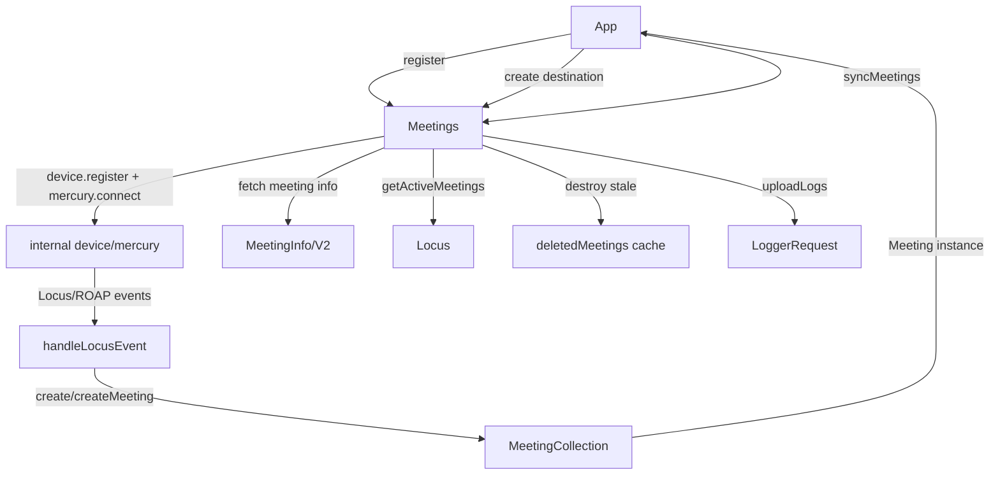
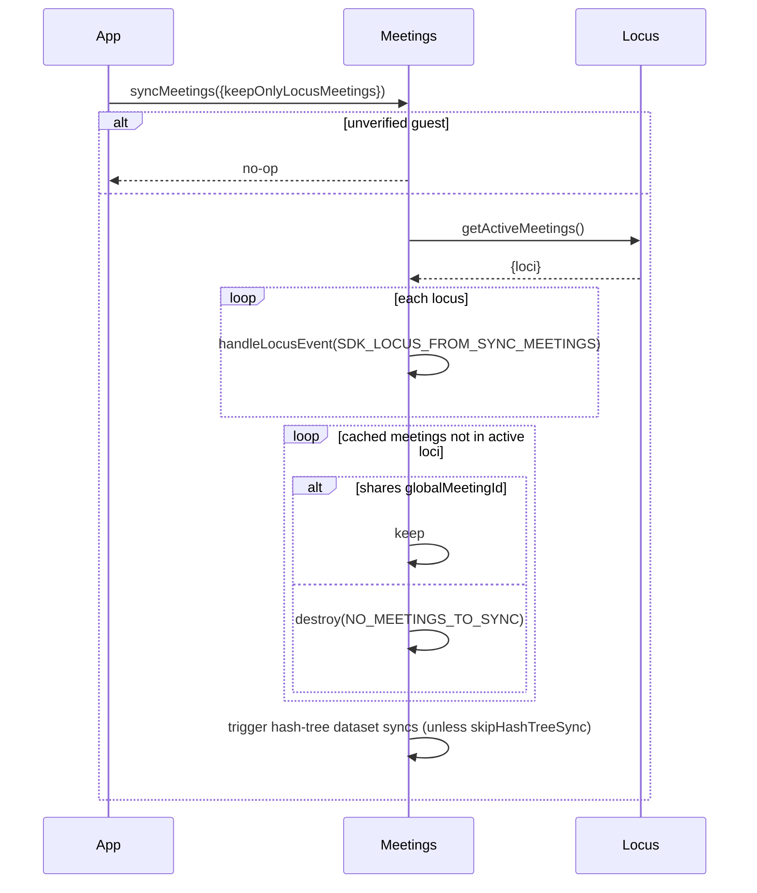
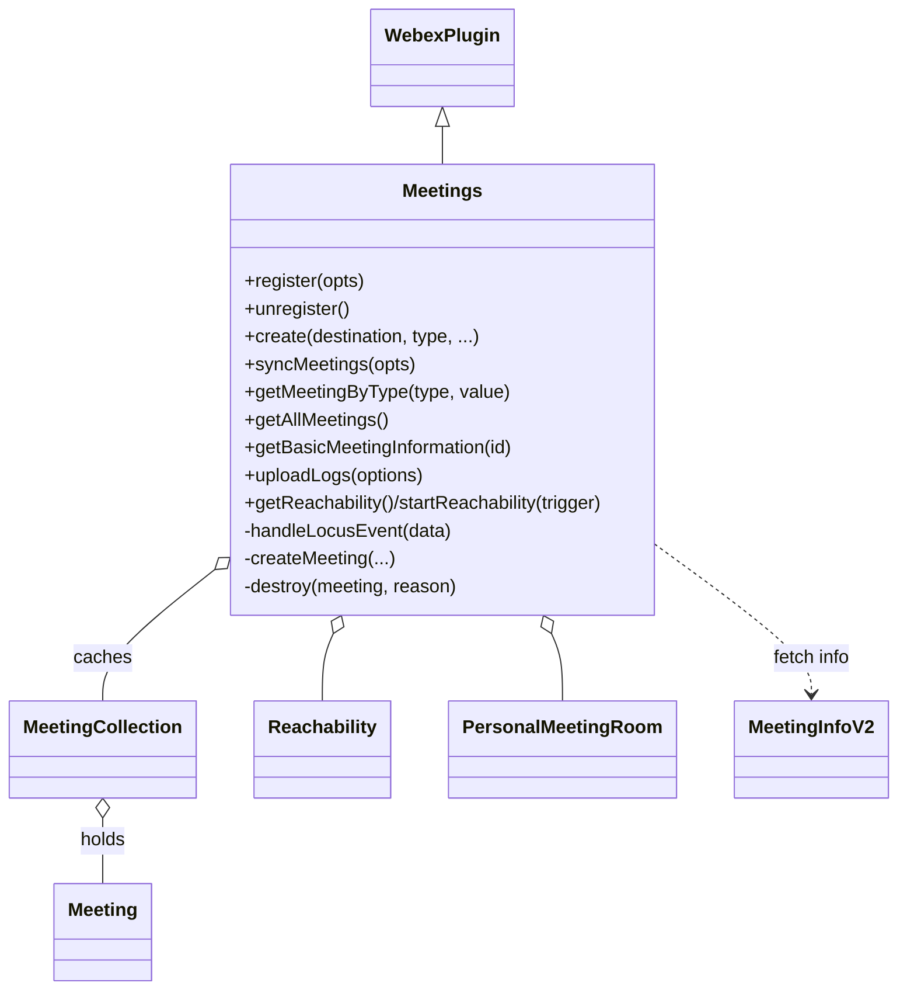

<!-- sdd-generated-metadata
generator: claude-cli
generator_model: us.anthropic.claude-opus-4-8
approved_by: pending-human-review
updated_at: 2026-08-06T00:00:00Z
validation_status: not-run
run_id: 51855eac-8de5-43a2-a3b6-dbcc55ebc91b
-->

# @webex/plugin-meetings — SPEC

> Start here → root [`AGENTS.md`](../../../../AGENTS.md) (agent entry) · router [`SPEC_INDEX.md`](../../../../ai-docs/SPEC_INDEX.md) · system [`ARCHITECTURE.md`](../../../../ai-docs/ARCHITECTURE.md). This is the module's canonical spec: orientation, requirements, design, flows, state, and tests.
> Context-efficiency: link to canonical docs — don't duplicate them. Load specs on demand per `SPEC_INDEX.md`.

## Metadata

| Field | Value |
|---|---|
| Module id | `plugin-meetings` |
| Source path(s) | `packages/@webex/plugin-meetings/src/` |
| Parent spec | `—` (registered public Webex plugin; composed by `webex-core`, no parent module) |
| Doc kind | Module spec |
| Coverage score | Pending coverage assessment |
| Generated from | `module-spec` @ SDLC template library `0.2.2` |
| generated_by / approved_by / updated_at | claude-cli / pending-human-review / 2026-08-06 |
| Validation status | not-run, validator `pending`, assessed 2026-08-06 |

Coverage score is `Pending coverage assessment` until the first coverage review runs. Manifest coverage
state (`Partial`) is authoritative and kept in `.sdd/manifest.json`.

## Evidence Rules
Every requirement cites concrete source evidence using `file path`. Test evidence is preferred for WHY.
Requirements are grounded in the current implementation under `src/` and its unit tests.

## Source Material Register

| Source material | Scope | Decision | Detail location or disposition |
|---|---|---|---|
| Prior package `AGENTS.md` | testing note | used | The unit-test guidance (slow tests; use `.only`) is preserved in `Test-Case Strategy` and `Module Do's / Don'ts`. |

## Overview

`@webex/plugin-meetings` is the large public Webex SDK plugin (registered as `meetings`) that owns real-time
meetings and calling on the client. The top-level `Meetings` plugin (`src/meetings/index.ts`) is an
orchestrator: it registers the device, connects Mercury, listens for Locus/ROAP events, fetches the user's
preferred site, gathers reachability, and maintains a `MeetingCollection` of live `Meeting` instances (plus a
`deletedMeetings` cache of minimal info for meetings that have ended).

Each individual meeting's rich lifecycle — join/leave, media negotiation (ROAP/WebRTC), streams, members,
recording, reactions, breakouts, annotations, transcription — lives in the `Meeting` class
(`src/meeting/index.ts`) and the many supporting subsystems under `src/` (media, meeting-info, locus-info,
multistream, reachability, personal-meeting-room, metrics, common). The plugin also re-exports media helpers
(`LocalStream`, `createMicrophoneStream`, …) and error types from its entry point (`src/index.ts`). A
maintainer should start at `src/meetings/index.ts` for orchestration and `src/meeting/index.ts` for a single
meeting.

Because this is a very large, multi-subsystem module, this spec documents the module's public orchestration
surface and top-level structure; the detailed behavior of each subsystem lives with its own source and is
referenced here rather than duplicated.

## Purpose / Responsibility

Owns the client-side meetings/calling capability: registering/unregistering the meetings plugin (device +
Mercury + Locus listeners), creating and caching `Meeting` objects from destinations/Locus events, syncing
active meetings from Locus, gathering reachability, resolving the preferred Webex site, and uploading meeting
logs. It does NOT own the Locus/Mercury services themselves, the low-level WebRTC/media engine
(`@webex/internal-media-core`, `@webex/media-helpers`), or metrics transport (delegated to
`@webex/internal-plugin-metrics`).

## Stack

TypeScript + JavaScript (`src/**/*.ts`,`*.js`), built with `tsc` (declarations) plus `webex-legacy-tools`.
Unit tests run under mocha (`test:unit`, `--runner mocha`) with chai/chai-as-promised/sinon; browser tests via
karma. Uses `javascript-state-machine`, `webrtc-adapter`, `bowser`, `jose`, `jwt-decode`, `uuid`, `lodash`,
and many `@webex/*` internal plugins (mercury, conversation, device, llm, metrics, support, user, voicea) plus
`@webex/media-helpers` and `@webex/internal-media-core`. Evidence:
`packages/@webex/plugin-meetings/package.json`.

## Folder / Package Structure

```
packages/@webex/plugin-meetings/src/
├── index.ts                 # registerPlugin('meetings', Meetings, {config, interceptors}); re-exports media helpers, errors, constants
├── meetings/                # Meetings orchestrator plugin: register/create/sync, MeetingCollection, request
│   ├── index.ts             # Meetings class (register/unregister/create/syncMeetings/uploadLogs/reachability/...)
│   ├── request.ts           # Meetings-level Locus/site/geo requests
│   ├── collection.ts        # MeetingCollection cache
│   └── meetings.types.ts    # site preference / registration types
├── meeting/                 # single Meeting lifecycle (join/leave, media, members, roap)
├── meeting-info/            # MeetingInfo / MeetingInfoV2 fetch + parsing
├── locus-info/              # Locus DTO parsing, hash-tree locus creation
├── media/                   # media negotiation + getUserMedia wrappers
├── multistream/             # multistream remote media
├── reachability/            # Reachability gathering
├── personal-meeting-room/   # PersonalMeetingRoom
├── metrics/                 # behavioral metrics constants + helpers
├── reactions/, annotation/, interpretation/, hashTree/, aiEnableRequest/  # feature subsystems
├── interceptors/            # Locus retry / route-token / data-channel auth interceptors
├── common/                  # errors, events (trigger-proxy), logs (logger-proxy/config/request), config
├── constants.ts             # MEETINGS, EVENTS, EVENT_TRIGGERS, LOCUSEVENT, DESTINATION_TYPE, ...
└── config.js                # plugin config (experimental flags, autoUploadLogs, ...)
```

## Key Files (source of truth)

| File | Holds |
|---|---|
| `packages/@webex/plugin-meetings/src/meetings/index.ts` | The `Meetings` orchestrator: register/unregister, create/createMeeting, syncMeetings, handleLocusEvent, uploadLogs, reachability, site/geo, MeetingCollection wiring |
| `packages/@webex/plugin-meetings/src/meeting/index.ts` | The `Meeting` class: single-meeting join/leave/media/members lifecycle |
| `packages/@webex/plugin-meetings/src/index.ts` | Registration name (`meetings`), interceptors, and the public media-helper/error/constant re-exports |
| `packages/@webex/plugin-meetings/src/constants.ts` | `MEETINGS`, `EVENT_TRIGGERS`, `LOCUSEVENT`, `DESTINATION_TYPE`, registration status constants |
| `packages/@webex/plugin-meetings/src/config.js` | Config defaults (experimental flags, `autoUploadLogs`) |

## Public Surface

Consumed as a public SDK plugin via `webex.meetings`. Interacts with Locus/Mercury and, per meeting, WebRTC
media. The plugin entry point also re-exports media helpers and error/constant types as package exports.

| Contract ID | Type | Surface | Purpose | Compatibility / deprecation | Schema / detail link | Root index |
|---|---|---|---|---|---|---|
| `meetings.register` | SDK | `register(deviceRegistrationOptions?): Promise` | Register device, connect Mercury, listen for Locus events | Stable; idempotent; interlocks with `unregister` | `packages/@webex/plugin-meetings/src/meetings/index.ts` | `../../../../ai-docs/CONTRACTS.md` |
| `meetings.unregister` | SDK | `unregister(): Promise` | Stop listeners, disconnect Mercury, unregister device | Stable; idempotent; interlocks with `register` | `packages/@webex/plugin-meetings/src/meetings/index.ts` | `../../../../ai-docs/CONTRACTS.md` |
| `meetings.create` | SDK | `create(destination, type?, ...): Promise<Meeting>` | Create or return an existing `Meeting` for a destination/Locus | Stable; core entry point | `packages/@webex/plugin-meetings/src/meetings/index.ts` | `../../../../ai-docs/CONTRACTS.md` |
| `meetings.syncMeetings` | SDK | `syncMeetings({keepOnlyLocusMeetings?, skipHashTreeSync?}): Promise<void>` | Sync active meetings from Locus; prune stale ones | Stable; no-op for unverified guests | `packages/@webex/plugin-meetings/src/meetings/index.ts` | `../../../../ai-docs/CONTRACTS.md` |
| `meetings.getMeetingByType` | SDK | `getMeetingByType(type, value): Meeting` | Look up a cached meeting by key (e.g. locus url) | Stable | `packages/@webex/plugin-meetings/src/meetings/index.ts` | `../../../../ai-docs/CONTRACTS.md` |
| `meetings.getAllMeetings` | SDK | `getAllMeetings(): Object` | All currently active meetings | Stable | `packages/@webex/plugin-meetings/src/meetings/index.ts` | `../../../../ai-docs/CONTRACTS.md` |
| `meetings.getBasicMeetingInformation` | SDK | `getBasicMeetingInformation(meetingId): BasicMeetingInformation` | Minimal info for a live or deleted meeting | Stable | `packages/@webex/plugin-meetings/src/meetings/index.ts` | `../../../../ai-docs/CONTRACTS.md` |
| `meetings.uploadLogs` | SDK | `uploadLogs(options): Promise<string>` | Upload meeting logs; emits success/failure events + metrics | Stable | `packages/@webex/plugin-meetings/src/meetings/index.ts` | `../../../../ai-docs/CONTRACTS.md` |
| `meetings.getReachability` / `startReachability` | SDK | `getReachability(): Reachability` / `startReachability(trigger): Promise` | Access / start reachability gathering | Stable | `packages/@webex/plugin-meetings/src/meetings/index.ts` | `../../../../ai-docs/CONTRACTS.md` |
| `meetings.fetchSitePreferencesMeViaSite` | SDK | `fetchSitePreferencesMeViaSite(options): Promise<SitePreferencesResponse>` | Fetch site scheduling preferences | Stable | `packages/@webex/plugin-meetings/src/meetings/index.ts` | `../../../../ai-docs/CONTRACTS.md` |
| `meetings.fetchStaticMeetingLink` / `enableStaticMeetingLink` / `disableStaticMeetingLink` | SDK | `(conversationUrl): Promise` | Manage persistent meeting links for a conversation | Stable | `packages/@webex/plugin-meetings/src/meetings/index.ts` | `../../../../ai-docs/CONTRACTS.md` |
| `meetings.createVirtualBackgroundEffect` | SDK | `createVirtualBackgroundEffect(options?): Promise` | Build a virtual-background effect via media helpers | Stable | `packages/@webex/plugin-meetings/src/meetings/index.ts` | `../../../../ai-docs/CONTRACTS.md` |
| `meetings:*` events | event | `meetings:ready`, `meetings:registered`, `network:disconnected`, `meeting:added`, `meeting:removed` | Lifecycle events emitted by the orchestrator | Stable events | `packages/@webex/plugin-meetings/src/meetings/index.ts` | `../../../../ai-docs/CONTRACTS.md` |
| media helper / error re-exports | SDK export | `LocalStream`, `createMicrophoneStream`, …, `CaptchaError`, `Meeting`, `MeetingInfoUtil`, … | Public streams/effects factories and error types | Stable named exports | `packages/@webex/plugin-meetings/src/index.ts` | `../../../../ai-docs/CONTRACTS.md` |

Compatibility notes:
- `create` may return an existing cached `Meeting` (by matching Locus/correlation) rather than a new one; it
  updates `callStateForMetrics` on the existing meeting.
- `register`/`unregister` are idempotent and interlock: calling one while the other is in progress chains onto
  the pending promise.
- The detailed per-`Meeting` API (join/leave/media/members) is part of the public surface but documented with
  the `Meeting` class source rather than enumerated here.

## Requires (dependencies)

- `@webex/webex-core` — base `WebexPlugin`/`StatelessWebexPlugin` and the request stack.
- `@webex/internal-plugin-mercury` — Locus/ROAP event transport (`connect`/`disconnect`, event listeners).
- `@webex/internal-plugin-device` — device `register`/`unregister` (with `DeviceRegistrationOptions`).
- `@webex/internal-plugin-conversation` — conversation lookups for meeting/space resolution.
- `@webex/internal-plugin-metrics` — behavioral + call-diagnostic metrics (`ClientEvent`, `RtcMetrics`).
- `@webex/internal-plugin-llm`, `-support`, `-user`, `-voicea` — LLM data channel, log upload, user, and
  transcription integrations.
- `@webex/media-helpers`, `@webex/internal-media-core` — streams, effects, and the WebRTC media engine.
- `@webex/web-capabilities` (`WasmRuntimeProbe`), `@webex/ts-sdp`, `webrtc-adapter`, `javascript-state-machine`
  — capability probing, SDP handling, WebRTC shims, and meeting state machines.

## Requirements

| ID | WHAT | WHY | Source Evidence | Test / Example Evidence | Assumptions / Gaps | Confidence |
|---|---|---|---|---|---|---|
| `MEETINGS-R-001` | `register(deviceRegistrationOptions?)` runs the registration steps (fetch preferred site, geo hint, reachability, device register, Mercury connect, H264 check), then starts Locus listeners, sets `registered = true`, emits `meetings:registered`, and sends a success metric; it is idempotent and interlocks with an in-progress `unregister`. | Explicit, resilient setup of the meetings plugin with a single guarded entry point. | `packages/@webex/plugin-meetings/src/meetings/index.ts` | `packages/@webex/plugin-meetings/test/unit/spec/meetings/index.js` | Rejects when `!webex.canAuthorize`; per-step status tracked in `registrationStatus` | PRESENT |
| `MEETINGS-R-002` | `unregister()` stops Locus listeners, disconnects Mercury with code 3050 / non-reconnecting reason, then unregisters the device (tolerating a 404); it is idempotent and interlocks with an in-progress `register`. | Clean teardown that avoids a Mercury auto-reconnect race with device unregister. | `packages/@webex/plugin-meetings/src/meetings/index.ts` | `packages/@webex/plugin-meetings/test/unit/spec/meetings/index.js` | Code 3050 chosen specifically to avoid reconnect-triggering "Done (forced)" | PRESENT |
| `MEETINGS-R-003` | `create(destination, type, ...)` returns an existing cached `Meeting` when one matches (updating its `callStateForMetrics`), otherwise creates one via `createMeeting`, wires destroy/upload-log handlers, and emits `meeting:added`. | One idempotent entry point that de-duplicates meetings by destination/Locus. | `packages/@webex/plugin-meetings/src/meetings/index.ts` | `packages/@webex/plugin-meetings/test/unit/spec/meetings/index.js` | `failOnMissingMeetingInfo` controls whether missing info throws `NoMeetingInfoError` | PRESENT |
| `MEETINGS-R-004` | `syncMeetings({keepOnlyLocusMeetings, skipHashTreeSync})` fetches active Locus, creates/updates meetings for returned loci, and destroys cached Locus meetings no longer active (unless they share a `globalMeetingId`); it is a no-op for unverified guests. | Recover meeting state after Mercury gaps/reconnects without dropping still-active meetings. | `packages/@webex/plugin-meetings/src/meetings/index.ts` | `packages/@webex/plugin-meetings/test/unit/spec/meetings/index.js` | Also triggers hash-tree dataset syncs unless `skipHashTreeSync` | PRESENT |
| `MEETINGS-R-005` | `handleLocusEvent` ignores events for meetings already ended (INACTIVE fullState, or self LEFT+removed), creates a meeting from the locus (deriving a locus from a hash-tree message when needed), and runs initial locus setup. | Locus events drive meeting creation/update but must be dropped for already-ended meetings. | `packages/@webex/plugin-meetings/src/meetings/index.ts` | `packages/@webex/plugin-meetings/test/unit/spec/meetings/index.js` | Handles both classic locus and hash-tree (`HASH_TREE_DATA_UPDATED`) events | PRESENT |
| `MEETINGS-R-006` | `destroy(meeting, reason)` cleans up the meeting, stores minimal `BasicMeetingInformation` in `deletedMeetings`, removes it from the collection, and emits `meeting:removed`. | Keep enough info about ended meetings for late events/metrics while freeing memory. | `packages/@webex/plugin-meetings/src/meetings/index.ts` | `packages/@webex/plugin-meetings/test/unit/spec/meetings/index.js` | Only a small locus-info subset is retained to limit memory | PRESENT |
| `MEETINGS-R-007` | `uploadLogs(options)` uploads via `loggerRequest`, emits `MEETING_LOG_UPLOAD_SUCCESS`/`_FAILURE` events and success/failure behavioral metrics, and resolves the feedback id (swallowing upload errors). | Support-log upload must be observable but never throw into the caller. | `packages/@webex/plugin-meetings/src/meetings/index.ts` | `packages/@webex/plugin-meetings/test/unit/spec/meetings/index.js` | Auto-invoked on meeting destroy when `config.autoUploadLogs` | PRESENT |
| `MEETINGS-R-008` | `getReachability()`/`startReachability(trigger)` expose and start the `Reachability` instance; reachability is one of the parallel registration steps and tolerates failure (logged, not fatal). | Reachability data improves media path selection without blocking registration. | `packages/@webex/plugin-meetings/src/meetings/index.ts` | `packages/@webex/plugin-meetings/test/unit/spec/meetings/index.js` | `startReachability` failure during register is caught and warned | PRESENT |
| `MEETINGS-R-009` | The plugin registers `meetings` with Locus interceptors (`LocusRetryStatusInterceptor`, `LocusRouteTokenInterceptor`, `DataChannelAuthTokenInterceptor`) and re-exports media-helper stream/effect factories and error types from the entry point. | Locus requests need retry/route/token handling, and consumers need the media/error surface. | `packages/@webex/plugin-meetings/src/index.ts` | `packages/@webex/plugin-meetings/test/unit/` | none identified | PRESENT |

## Design Overview

`Meetings` extends `WebexPlugin` and acts as an orchestrator over a `MeetingCollection` of `Meeting`
instances. On `onReady` it sets static/logger config, chooses `MeetingInfo` vs `MeetingInfoV2` based on the
`experimental.enableUnifiedMeetings` flag, constructs `PersonalMeetingRoom`, and emits `meetings:ready`.

`register` runs its setup steps in parallel through `executeRegistrationStep` (which records per-step success
in `registrationStatus`), gating on `webex.canAuthorize`, and only then starts Locus/ROAP/online listeners. It
and `unregister` share promise interlocks so overlapping calls chain rather than race; `unregister`
deliberately disconnects Mercury with code 3050 to avoid a reconnect race with device unregister.

Meeting lifecycle flows through Locus: `handleLocusEvent` filters ended meetings, derives a locus from a
hash-tree message when needed, and calls `create`→`createMeeting`, which fetches meeting info (unless
pre-supplied), assumes a 1:1/wireless share when info is absent (or throws `NoMeetingInfoError` when
`failOnMissingMeetingInfo`), and emits `meeting:added`. `create` also wires each meeting's
`DESTROY_MEETING`/`REQUEST_UPLOAD_LOGS` handlers to `uploadLogs` (when `autoUploadLogs`) and `destroy`.
`destroy` snapshots minimal info into `deletedMeetings` and emits `meeting:removed`. `syncMeetings` reconciles
the collection against Locus's active loci, pruning stale meetings unless they share a `globalMeetingId`, and
triggers hash-tree dataset syncs. Detailed per-meeting media/member/roap behavior is implemented in the
`Meeting` class and its subsystems.

## Data Flow



## Sequence Diagram(s)

Distinct operation groups: registration/teardown, meeting creation (explicit `create` vs Locus-event driven),
and periodic sync. They differ in trigger, collaborators, and failure behavior, so each has its own diagram.
Per-meeting media negotiation (ROAP/WebRTC) is a separate operation group documented with the `Meeting` class
source rather than duplicated here.

Sequence coverage:

| Operation group | Diagram | Failure / recovery coverage |
|---|---|---|
| Register / unregister | 1. Register/unregister | `canAuthorize` gate rejects; per-step failure metric; register/unregister interlock; device 404 tolerated |
| Create meeting | 2. Create | `alt` covers cached-meeting reuse and missing-info (`NoMeetingInfoError` vs assume 1:1) |
| Sync meetings | 3. Sync | Unverified-guest no-op; stale prune unless shared `globalMeetingId` |

### 1. Register / unregister

```mermaid
sequenceDiagram
    participant App as App
    participant M as Meetings
    participant D as internal.device
    participant Me as internal.mercury
    App->>M: register(opts)
    alt !canAuthorize
        M-->>App: reject('SDK cannot authorize')
    else
        par registration steps
            M->>M: fetchWebexSite / getGeoHint / startReachability / checkH264
        and
            M->>D: register(opts)
            M->>Me: connect()
        end
        M->>M: listenForEvents(); registered=true
        M-->>App: resolve + emit meetings:registered
    end
    App->>M: unregister()
    M->>Me: disconnect({code:3050})
    M->>D: unregister() (tolerate 404)
    M-->>App: resolve
```

### 2. Create

```mermaid
sequenceDiagram
    participant App as App
    participant M as Meetings
    participant MI as MeetingInfo/V2
    participant C as MeetingCollection
    App->>M: create(destination, type)
    alt existing meeting matches
        M->>M: update callStateForMetrics
        M-->>App: existing Meeting
    else
        M->>MI: fetchMeetingInfo(destination)
        alt info present
            MI-->>M: meetingInfo
        else missing and failOnMissingMeetingInfo
            M->>M: destroy(meeting); throw NoMeetingInfoError
        else missing
            M->>M: assume 1:1 / wireless share
        end
        M->>C: add Meeting
        M-->>App: new Meeting + emit meeting:added
    end
```

### 3. Sync



## Class / Component Relationships



`Meetings` orchestrates: it caches `Meeting` instances in a `MeetingCollection`, owns a `Reachability` and
`PersonalMeetingRoom`, and delegates meeting-info fetching to `MeetingInfo`/`MeetingInfoV2`. Each `Meeting`
owns its own media/member/roap subsystems (documented with `src/meeting/`).

## Use Cases

- **UC-1 Register for meetings:** app calls `webex.meetings.register()` → device+Mercury+Locus wired →
  `meetings:registered`. Evidence: `packages/@webex/plugin-meetings/src/meetings/index.ts`.
- **UC-2 Start/join a meeting:** app calls `create(destination)` → `Meeting` returned (new or cached) →
  `meeting:added`; app then uses the `Meeting` API to join and add media. Evidence:
  `packages/@webex/plugin-meetings/src/meetings/index.ts`, `packages/@webex/plugin-meetings/src/meeting/index.ts`.
- **UC-3 Incoming meeting via Locus:** Mercury delivers a Locus event → `handleLocusEvent` creates a meeting →
  `meeting:added`. Evidence: `packages/@webex/plugin-meetings/src/meetings/index.ts`.
- **UC-4 Recover after reconnect:** app/SDK calls `syncMeetings()` → active loci reconciled, stale meetings
  destroyed. Evidence: `packages/@webex/plugin-meetings/src/meetings/index.ts`.
- **UC-5 Upload support logs:** on meeting destroy (with `autoUploadLogs`) or explicit `uploadLogs()` → logs
  uploaded and success/failure events emitted. Evidence: `packages/@webex/plugin-meetings/src/meetings/index.ts`.

## State Model

The orchestrator's client-side state is the `MeetingCollection` (active `Meeting` instances keyed by id/locus/
correlation) plus a `deletedMeetings` `Map` of `BasicMeetingInformation` retained after a meeting ends, and
registration flags (`registered`, `registrationStatus`, `registrationPromise`/`unregistrationPromise`,
`preferredWebexSite`, `geoHintInfo`). Individual per-meeting state (join/media/roap) is a
`javascript-state-machine`-driven model inside each `Meeting` and is documented with `src/meeting/`. Evidence:
`packages/@webex/plugin-meetings/src/meetings/index.ts`.

## Concurrency & Reactive Flow

The plugin is highly concurrent and event-driven. `register` runs its steps with `Promise.all`; `register`/
`unregister` guard against overlap via `registrationPromise`/`unregistrationPromise` interlocks so a call made
mid-transition chains onto the pending one. Locus/ROAP events arrive asynchronously over Mercury and are
funneled through `handleLocusEvent`; ended-meeting events are filtered out. `emitWasmRuntimePerformance` is
`once`-wrapped and swallows all errors so probing never breaks meeting creation. `uploadLogs` never throws
into the caller. Per-meeting media negotiation is asynchronous WebRTC/ROAP handled in the `Meeting` subsystem.
Evidence: `packages/@webex/plugin-meetings/src/meetings/index.ts`.

## Error Handling & Failure Modes

| Condition | Signal (error/code/result) | Caller recovery |
|---|---|---|
| `register` when `!webex.canAuthorize` | Rejected Promise `Error('SDK cannot authorize')` + logged | Authorize the SDK, then register |
| A registration step fails | Step rejects; `MEETINGS_REGISTRATION_FAILED` metric; `registrationPromise` rejects | Inspect `registrationStatus`; retry register |
| `create` with missing meeting info + `failOnMissingMeetingInfo` | Meeting destroyed; `NoMeetingInfoError` thrown | Provide valid meeting info / destination |
| `create` with missing info (no fail flag) | Treated as 1:1 / wireless share | None; proceed |
| `unregister` device returns 404 | Logged; chain continues normally | None; treated as already-unregistered |
| `uploadLogs` upload failure | Caught; `MEETING_LOG_UPLOAD_FAILURE` event + failure metric; resolves | Retry upload if needed |
| `startReachability` failure during register | Caught + warned; registration continues | None; reachability best-effort |

## Pitfalls

- `create` may return an existing cached `Meeting`; don't assume every call yields a fresh meeting. Evidence:
  `packages/@webex/plugin-meetings/src/meetings/index.ts`.
- `register`/`unregister` interlock via promises; calling them in quick succession chains rather than runs
  concurrently. Evidence: `packages/@webex/plugin-meetings/src/meetings/index.ts`.
- `unregister` uses Mercury disconnect code 3050 deliberately; changing it to the default 1000/"Done" can
  trigger auto-reconnect and race device unregister. Evidence:
  `packages/@webex/plugin-meetings/src/meetings/index.ts`.
- `syncMeetings` will destroy cached Locus meetings not returned by Locus unless they share a
  `globalMeetingId` (breakout edge case); be careful pruning. Evidence:
  `packages/@webex/plugin-meetings/src/meetings/index.ts`.
- Unit tests are slow: run only the tests you care about by temporarily adding `.only`, and remove it when
  done. Evidence: `packages/@webex/plugin-meetings/AGENTS.md`.

## Module Do's / Don'ts

- DO: temporarily add `.only` to the specific `it`/`describe` you are running for plugin-meetings unit tests,
  then remove it before committing. Evidence: `packages/@webex/plugin-meetings/AGENTS.md`.
- DON'T: run the full plugin-meetings unit suite when iterating on a single test — it is slow. Evidence:
  `packages/@webex/plugin-meetings/AGENTS.md`.
- DON'T: assume `create` always makes a new meeting or that `register`/`unregister` run concurrently.
  Evidence: `packages/@webex/plugin-meetings/src/meetings/index.ts`.

## Test-Case Strategy (module)

Unit tests run under mocha with chai/sinon (`test:unit`). Because the suite is slow, iterate with a
temporary `.only` on the target test (removing it afterward). Tests should assert orchestrator behavior with
mocked internals: `register` rejects without `canAuthorize` (negative) and wires listeners + emits
`meetings:registered` on success (positive); `unregister` disconnects with code 3050 and tolerates a device
404; `create` reuses a cached meeting vs creating a new one and honors `failOnMissingMeetingInfo`;
`syncMeetings` prunes stale meetings but keeps `globalMeetingId` matches and no-ops for unverified guests;
`destroy` populates `deletedMeetings` and emits `meeting:removed`; and `uploadLogs` emits success/failure
events without throwing.

| Behavior / Requirement | Existing test evidence | Gap |
|---|---|---|
| `MEETINGS-R-001`..`MEETINGS-R-002` | `packages/@webex/plugin-meetings/test/unit/spec/meetings/index.js` | Assert canAuthorize gate, step wiring, 3050 disconnect, 404 tolerance |
| `MEETINGS-R-003` | `packages/@webex/plugin-meetings/test/unit/spec/meetings/index.js` | Cover cached-reuse + `failOnMissingMeetingInfo` branches |
| `MEETINGS-R-004`..`MEETINGS-R-006` | `packages/@webex/plugin-meetings/test/unit/spec/meetings/index.js` | Assert sync prune/keep, ended-event filter, deletedMeetings cache |
| `MEETINGS-R-007`..`MEETINGS-R-008` | `packages/@webex/plugin-meetings/test/unit/spec/meetings/index.js` | Assert upload events/metrics + reachability best-effort |
| `MEETINGS-R-009` | `packages/@webex/plugin-meetings/test/unit/` | Assert interceptor + re-export registration |

## Traceability

- Repo architecture: [`ARCHITECTURE.md`](../../../../ai-docs/ARCHITECTURE.md) · Registry: [`SPEC_INDEX.md`](../../../../ai-docs/SPEC_INDEX.md)
- Coverage state & contracts baseline: `.sdd/manifest.json`
