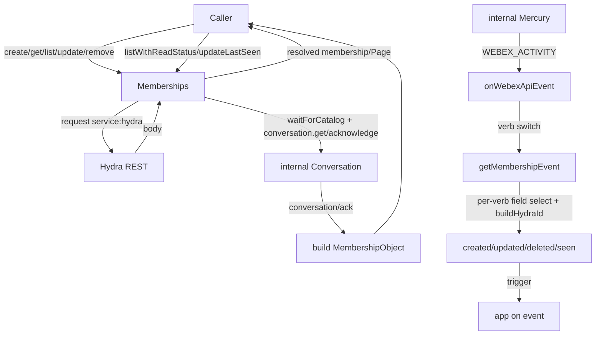
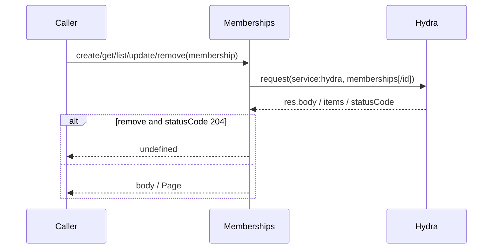
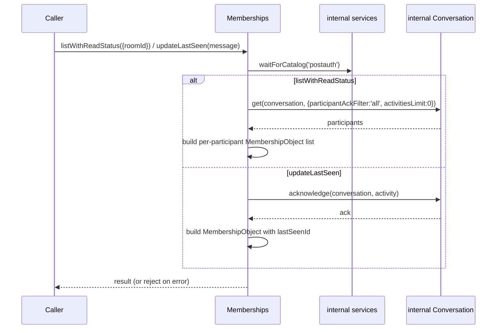
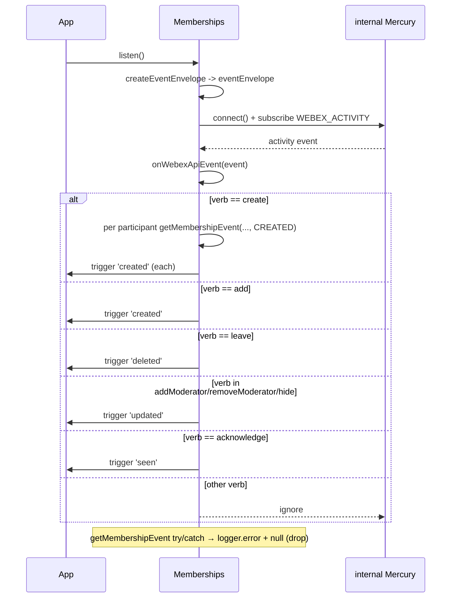
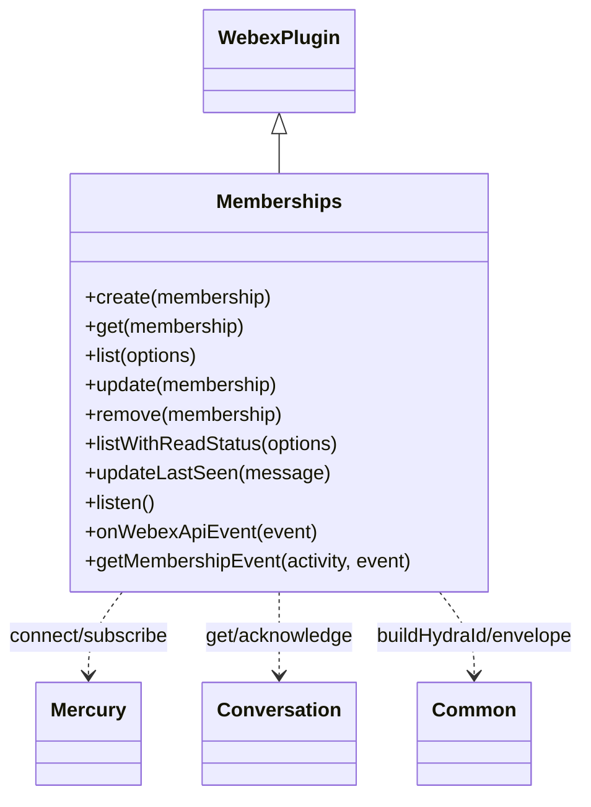

<!-- sdd-generated-metadata
generator: claude-cli
generator_model: us.anthropic.claude-opus-4-8
approved_by: pending-human-review
updated_at: 2026-08-06T00:00:00Z
validation_status: not-run
run_id: 51855eac-8de5-43a2-a3b6-dbcc55ebc91b
-->

# @webex/plugin-memberships — SPEC

> Start here → root [`AGENTS.md`](../../../../AGENTS.md) (agent entry) · router [`SPEC_INDEX.md`](../../../../ai-docs/SPEC_INDEX.md) · system [`ARCHITECTURE.md`](../../../../ai-docs/ARCHITECTURE.md). This is the module's canonical spec: orientation, requirements, design, flows, and tests.
> Context-efficiency: link to canonical docs — don't duplicate them. Load specs on demand per `SPEC_INDEX.md`.

## Metadata

| Field | Value |
|---|---|
| Module id | `plugin-memberships` |
| Source path(s) | `packages/@webex/plugin-memberships/src/` |
| Parent spec | `—` (registered public Webex plugin; composed by `webex-core`, no parent module) |
| Doc kind | Module spec |
| Coverage score | Pending coverage assessment |
| Generated from | `module-spec` @ SDLC template library `0.2.2` |
| generated_by / approved_by / updated_at | claude-cli / pending-human-review / 2026-08-06 |
| Validation status | not-run, validator `pending`, assessed 2026-08-06 |

Coverage score is `Pending coverage assessment` until the first coverage review runs. Manifest coverage
state (`Partial`) is authoritative and kept in `.sdd/manifest.json`.

## Evidence Rules
Every requirement cites concrete source evidence using `file path`. Test evidence is preferred for WHY.
Requirements are grounded in the current implementation under `src/` and its unit tests.

## Source Material Register

| Source material | Scope | Decision | Detail location or disposition |
|---|---|---|---|
| N/A | none | none | No prior AI-docs existed for this package; content is derived directly from `src/` and tests. |

## Overview

`@webex/plugin-memberships` is a public Webex SDK plugin (registered as `memberships`) that owns a person's
relationship to a room. It exposes CRUD over the Hydra REST service (create, get, list, update, remove) plus
two read-status-aware operations backed by the internal conversation plugin
(`listWithReadStatus`, `updateLastSeen`) and a real-time `listen()` mode that surfaces membership events from
the internal Mercury socket.

The plugin (`src/memberships.js`, a `WebexPlugin`) translates internal Mercury activities into a rich set of
external events: `created` (from `create`/`add` verbs), `deleted` (`leave`), `updated`
(`addModerator`/`removeModerator`/`hide`), and `seen` (`acknowledge`, a "read receipt" with no webhook
equivalent). Because different verbs place the member and space in different activity fields
(`actor`/`object`/`target`), `getMembershipEvent` selects them per verb. A maintainer should start at
`src/memberships.js`.

Listening and read-status methods decrypt internal conversation activities and therefore require `spark:all`
+ `spark:kms` scopes; the plugin imports `@webex/internal-plugin-conversation` and
`@webex/internal-plugin-mercury`.

## Purpose / Responsibility

Owns the client-side surface for room memberships: CRUD over Hydra, read-status queries and read-receipt
updates via the internal conversation service, and translation of internal Mercury membership activities into
external `created`/`updated`/`deleted`/`seen` events. It does NOT own rooms, messages, people, or the
Mercury/conversation transport.

## Stack

JavaScript (Babel), built with `webex-legacy-tools`. Uses the `debug` logger and `lodash` `cloneDeep`. Tested
with the `@webex/test-helper-*` chai/mocha/mock-webex/test-users helpers and `sinon`. Runtime dependencies:
`@webex/webex-core`, `@webex/common`, `@webex/internal-plugin-conversation`, `@webex/internal-plugin-mercury`.
Evidence: `packages/@webex/plugin-memberships/src/memberships.js`,
`packages/@webex/plugin-memberships/src/index.js`.

## Folder / Package Structure

```
packages/@webex/plugin-memberships/src/
├── index.js         # imports internal conversation+mercury, registerPlugin('memberships', Memberships)
└── memberships.js   # Memberships WebexPlugin: CRUD, listWithReadStatus/updateLastSeen, listen + Mercury event translation
```

## Key Files (source of truth)

| File | Holds |
|---|---|
| `packages/@webex/plugin-memberships/src/memberships.js` | All membership methods, `onWebexApiEvent` verb switch, and `getMembershipEvent` per-verb field selection |
| `packages/@webex/plugin-memberships/src/index.js` | Plugin registration name (`memberships`) and required internal-plugin imports |

## Public Surface

Consumed as a public SDK plugin via `webex.memberships`. Calls the Hydra REST service; `listen()`,
`listWithReadStatus`, and `updateLastSeen` use the internal Mercury socket / conversation service.

| Contract ID | Type | Surface | Purpose | Compatibility / deprecation | Schema / detail link | Root index |
|---|---|---|---|---|---|---|
| `memberships.create` | SDK/HTTP | `create(membership): Promise<MembershipObject>` | POST `memberships` to Hydra (by `personId` or `personEmail`) | Stable plugin method | `packages/@webex/plugin-memberships/src/memberships.js` | `../../../../ai-docs/CONTRACTS.md` |
| `memberships.get` | SDK/HTTP | `get(membership): Promise<MembershipObject>` | GET `memberships/{id}` from Hydra | Stable plugin method | `packages/@webex/plugin-memberships/src/memberships.js` | `../../../../ai-docs/CONTRACTS.md` |
| `memberships.list` | SDK/HTTP | `list(options): Promise<Page<MembershipObject>>` | GET `memberships` from Hydra, paginated (by room/person) | Stable plugin method | `packages/@webex/plugin-memberships/src/memberships.js` | `../../../../ai-docs/CONTRACTS.md` |
| `memberships.update` | SDK/HTTP | `update(membership): Promise<MembershipObject>` | PUT `memberships/{id}` (e.g. moderator, hide 1-1) | Stable plugin method | `packages/@webex/plugin-memberships/src/memberships.js` | `../../../../ai-docs/CONTRACTS.md` |
| `memberships.remove` | SDK/HTTP | `remove(membership): Promise<void>` | DELETE `memberships/{id}`; `undefined` on 204 | Stable plugin method | `packages/@webex/plugin-memberships/src/memberships.js` | `../../../../ai-docs/CONTRACTS.md` |
| `memberships.listWithReadStatus` | SDK/HTTP | `listWithReadStatus(options): Promise<MembershipObjectList>` | Per-member `lastSeenId`/`lastSeenDate` via internal conversation; unpaginated | Stable; may be deprecated when list includes read status | `packages/@webex/plugin-memberships/src/memberships.js` | `../../../../ai-docs/CONTRACTS.md` |
| `memberships.updateLastSeen` | SDK/HTTP | `updateLastSeen(message): Promise<MembershipObject>` | Send a "read receipt" (acknowledge) for a message | Stable plugin method | `packages/@webex/plugin-memberships/src/memberships.js` | `../../../../ai-docs/CONTRACTS.md` |
| `memberships.listen` | SDK/event | `listen(): Promise<void>` then `.on('created'|'updated'|'deleted'|'seen', cb)` | Subscribe to Mercury and emit membership events (needs `spark:all`+`spark:kms`) | Stable; `seen` has no webhook equivalent | `packages/@webex/plugin-memberships/src/memberships.js` | `../../../../ai-docs/CONTRACTS.md` |

Compatibility notes:
- The `MembershipObject` shape (`id`, `roomId`, `personId`, `personEmail`, `isModerator`, `isMonitor`,
  `created`) is the consumer contract; `isMonitor` is deprecated but still returned by some paths.
- `listen()` events mirror the webhook JSON but omit webhook-only fields; the `seen` event (a read receipt
  with `lastSeenId`) has no webhook counterpart.
- `listWithReadStatus` returns a reduced object (adds `lastSeenId`/`lastSeenDate`, omits `created`/
  `isRoomHidden` in general).

## Requires (dependencies)

- `@webex/webex-core` — base `WebexPlugin`, `Page`, and `this.request` for Hydra calls.
- `@webex/common` — `SDK_EVENT` constants, `createEventEnvelope`, `ensureMyIdIsAvailable`,
  `buildHydraMembershipId`, `buildHydraMessageId`, `buildHydraOrgId`, `buildHydraPersonId`,
  `buildHydraRoomId`, `getHydraClusterString`, `getHydraRoomType`, `deconstructHydraId`.
- `@webex/internal-plugin-mercury` — the websocket used by `listen()`.
- `@webex/internal-plugin-conversation` — decrypts Mercury activities and backs read-status
  (`conversation.get`) and read-receipt (`conversation.acknowledge`) methods; `services.waitForCatalog`.
- Peer plugins (`@webex/plugin-logger`, `@webex/plugin-people`, `@webex/plugin-rooms`) — expected in the
  composed SDK.

## Requirements

| ID | WHAT | WHY | Source Evidence | Test / Example Evidence | Assumptions / Gaps | Confidence |
|---|---|---|---|---|---|---|
| `MEMBERSHIPS-R-001` | `create(membership)` POSTs to `service: hydra`, `resource: 'memberships'` with the body and resolves `res.body`; the person may be identified by `personId` or `personEmail`. | Adding a person to a room is the primary write path. | `packages/@webex/plugin-memberships/src/memberships.js` | `packages/@webex/plugin-memberships/test/unit/` | none identified | PRESENT |
| `MEMBERSHIPS-R-002` | `get(membership)` accepts id/object, GETs `memberships/{id}`, resolves `res.body.items || res.body`. | Callers may pass id or object. | `packages/@webex/plugin-memberships/src/memberships.js` | `packages/@webex/plugin-memberships/test/unit/` | none identified | PRESENT |
| `MEMBERSHIPS-R-003` | `list(options)` GETs `memberships` with `qs: options` (filter by `roomId`/`personId`/`personEmail`/`max`) and wraps in a `Page`. | Membership lists paginate and filter by room or person. | `packages/@webex/plugin-memberships/src/memberships.js` | `packages/@webex/plugin-memberships/test/unit/` | none identified | PRESENT |
| `MEMBERSHIPS-R-004` | `update(membership)` PUTs `memberships/{id}` with the body and resolves `res.body` (e.g. toggling `isModerator`, hiding a 1-1 via `isRoomHidden`). | Membership properties are updated in place. | `packages/@webex/plugin-memberships/src/memberships.js` | `packages/@webex/plugin-memberships/test/unit/` | none identified | PRESENT |
| `MEMBERSHIPS-R-005` | `remove(membership)` DELETEs `memberships/{id}` and resolves `undefined` on `statusCode === 204`, else `res.body`. | Firefox has issues with 204/DELETE bodies. | `packages/@webex/plugin-memberships/src/memberships.js` | `packages/@webex/plugin-memberships/test/unit/` | Comment notes this should move to http-core | PRESENT |
| `MEMBERSHIPS-R-006` | `listWithReadStatus({roomId})` deconstructs the id, waits for `postauth`, gets the conversation with `participantAckFilter: 'all'` and `activitiesLimit: 0`, and builds a per-participant list including `lastSeenId`/`lastSeenDate` and (for the current user) `isRoomHidden`. | Clients need per-member read status to render read indicators. | `packages/@webex/plugin-memberships/src/memberships.js` | `packages/@webex/plugin-memberships/test/unit/` | Uses `ensureMyIdIsAvailable`; rejects on internal error | PRESENT |
| `MEMBERSHIPS-R-007` | `updateLastSeen(message)` acknowledges the message's activity against its conversation and resolves a `MembershipObject` carrying the new `lastSeenId`. | Sending a read receipt updates the caller's `lastSeenId` for that space. | `packages/@webex/plugin-memberships/src/memberships.js` | `packages/@webex/plugin-memberships/test/unit/` | `isRoomHidden: false` (any activity unhides); `isMonitor` returned for back-compat | PRESENT |
| `MEMBERSHIPS-R-008` | `listen()` builds a shared envelope, connects Mercury, and registers a `WEBEX_ACTIVITY` handler calling `onWebexApiEvent`. | Real-time membership events without webhooks. | `packages/@webex/plugin-memberships/src/memberships.js` | `packages/@webex/plugin-memberships/test/unit/` | Requires `spark:all` + `spark:kms` | PRESENT |
| `MEMBERSHIPS-R-009` | `onWebexApiEvent` maps verbs to events: `create` (fanned out per participant) and `add` → `created`; `leave` → `deleted`; `addModerator`/`removeModerator`/`hide` → `updated`; `acknowledge` → `seen`; other verbs ignored. | Different Locus verbs correspond to different external membership events, including a webhook-less `seen`. | `packages/@webex/plugin-memberships/src/memberships.js` | `packages/@webex/plugin-memberships/test/unit/` | `create` remaps `object`→participant, `target`→space per participant | PRESENT |
| `MEMBERSHIPS-R-010` | `getMembershipEvent` selects the member/space activity fields per verb (`hide`→object space/actor member; `acknowledge`→actor member/target space + `lastSeenId`; otherwise object member/target space), builds Hydra IDs, and returns `null` (logging) on error. | Locus places member and space in different fields depending on the verb; the emitted event must match the Hydra webhook shape. | `packages/@webex/plugin-memberships/src/memberships.js` | `packages/@webex/plugin-memberships/test/unit/` | `hide` sets `roomType` DIRECT + `isRoomHidden: true`; other verbs set `isRoomHidden: false` | PRESENT |

## Design Overview

`Memberships` extends `WebexPlugin`. The REST methods (`create`, `get`, `list`, `update`, `remove`) are thin
wrappers over `this.request` targeting Hydra, mirroring the other resource plugins (id/object normalization,
`Page` wrapping, 204 → `undefined`).

The read-status path does not use Hydra: `listWithReadStatus` ensures the caller's id is available, waits for
the `postauth` catalog, then calls `conversation.get` with `participantAckFilter: 'all'` and builds a
per-participant `MembershipObject` list, attaching `lastSeenId`/`lastSeenDate` and moderator/hidden flags from
each participant's `roomProperties`. `updateLastSeen` calls `conversation.acknowledge` to send a read receipt
and maps the acknowledgement into a `MembershipObject`.

The listen path is event-driven. `onWebexApiEvent` switches on `activity.verb`; the `create` verb fans out
one event per participant (remapping `object`→participant and `target`→space via cloned activities). All
verbs route through `getMembershipEvent`, which clones the envelope and — crucially — selects which activity
field holds the member and which holds the space based on the verb (`hide`, `acknowledge`, and the default
each differ), builds the Hydra IDs, and returns `null` (with a logged error) on any exception so a malformed
activity never throws into the socket handler.

## Data Flow



## Sequence Diagram(s)

Three distinct operation groups exist: synchronous Hydra REST CRUD, the conversation-backed read-status /
read-receipt operations, and the asynchronous Mercury listen path. They differ in transport, actors, and
failure behavior, so each has its own diagram.

Sequence coverage:

| Operation group | Diagram | Failure / recovery coverage |
|---|---|---|
| Hydra REST CRUD | 1. Hydra REST | Hydra HTTP errors propagate; 204 → `undefined` on remove |
| Read-status / read-receipt | 2. Conversation-backed | Internal errors reject |
| Mercury listen → membership event | 3. Listen + translate | `alt` covers per-verb branch, `create` fan-out, and try/catch → null drop |

### 1. Hydra REST



### 2. Conversation-backed read status / receipt



### 3. Listen + translate



## Class / Component Relationships



`Memberships` extends `WebexPlugin`, uses internal Mercury for the event stream, the internal conversation
plugin for read-status and acknowledge, and `@webex/common` helpers for Hydra ID construction and the event
envelope.

## Use Cases

- **UC-1 Invite a person:** app calls `create({personEmail, roomId})` → POST to Hydra → `MembershipObject`.
  Evidence: `packages/@webex/plugin-memberships/src/memberships.js`.
- **UC-2 Make a moderator / hide a 1-1:** app updates `isModerator` / `isRoomHidden` via `update`. Evidence:
  `packages/@webex/plugin-memberships/src/memberships.js`.
- **UC-3 Read status & receipts:** app calls `listWithReadStatus({roomId})` for per-member `lastSeenId`, and
  `updateLastSeen(message)` to send a read receipt. Evidence:
  `packages/@webex/plugin-memberships/src/memberships.js`.
- **UC-4 Listen for membership events:** app calls `listen()` then subscribes to
  `created`/`updated`/`deleted`/`seen`. Evidence: `packages/@webex/plugin-memberships/src/memberships.js`.

## Concurrency & Reactive Flow

`listen()` is event-driven: after `createEventEnvelope` resolves and Mercury connects, each `WEBEX_ACTIVITY`
is handled asynchronously. The cached `eventEnvelope` is cloned per event so concurrent activities do not
share mutable state; the `create` verb also clones the activity per participant to remap fields safely. Event
translation is wrapped in try/catch so one failing activity neither throws into the socket loop nor stops
subsequent events. Evidence: `packages/@webex/plugin-memberships/src/memberships.js`.

## Error Handling & Failure Modes

| Condition | Signal (error/code/result) | Caller recovery |
|---|---|---|
| Hydra request failure (CRUD) | Rejected Promise from `this.request` | Retry or surface error |
| `remove` returns 204 | Resolves `undefined` (not an error) | Treat as success |
| Conversation get/acknowledge error (read status/receipt) | Rejected Promise | Retry or surface error |
| Malformed Mercury activity during translation | `logger.error` + `getMembershipEvent` returns `null` (dropped) | None required; event skipped |
| Missing `spark:all`/`spark:kms` scopes | Decryption/connection failure during `listen()`/read-status | Re-authorize with required scopes |

## Pitfalls

- `getMembershipEvent` places the member and space in different activity fields depending on verb
  (`hide`/`acknowledge`/default); do not assume `object`=member for every verb. Evidence:
  `packages/@webex/plugin-memberships/src/memberships.js`.
- The `create` verb emits multiple `created` events (one per participant), not one. Evidence:
  `packages/@webex/plugin-memberships/src/memberships.js`.
- The `seen` event (read receipt) has no webhook equivalent and only comes from `listen()`. Evidence:
  `packages/@webex/plugin-memberships/src/memberships.js`.
- `listWithReadStatus` is unpaginated and returns a reduced object (adds `lastSeenId`/`lastSeenDate`, omits
  `created`); don't rely on full membership fields. Evidence:
  `packages/@webex/plugin-memberships/src/memberships.js`.
- `isMonitor` is deprecated; new SDK events omit it though some paths still return `false` for back-compat.
  Evidence: `packages/@webex/plugin-memberships/src/memberships.js`.

## Test-Case Strategy (module)

Unit tests (mock-webex + sinon) should mock `this.request` and the internal conversation/mercury plugins to
assert: each CRUD method targets the right Hydra resource/method and normalizes id/output including 204 →
`undefined` (positive/negative); `listWithReadStatus` builds a per-participant list with `lastSeenId`;
`updateLastSeen` maps the acknowledge into a `MembershipObject`; `onWebexApiEvent` triggers the correct event
per verb (including the `create` fan-out) and ignores unknown verbs (negative); and `getMembershipEvent`
selects the right member/space fields per verb and returns `null` on error.

| Behavior / Requirement | Existing test evidence | Gap |
|---|---|---|
| `MEMBERSHIPS-R-001`..`MEMBERSHIPS-R-005` | `packages/@webex/plugin-memberships/test/unit/` | Assert Hydra method/resource + id/output normalization + 204 case |
| `MEMBERSHIPS-R-006`..`MEMBERSHIPS-R-007` | `packages/@webex/plugin-memberships/test/unit/` | Assert conversation-backed build + lastSeenId |
| `MEMBERSHIPS-R-008`..`MEMBERSHIPS-R-010` | `packages/@webex/plugin-memberships/test/unit/` | Add per-verb mapping, create fan-out, and error → null drop cases |

## Traceability

- Repo architecture: [`ARCHITECTURE.md`](../../../../ai-docs/ARCHITECTURE.md) · Registry: [`SPEC_INDEX.md`](../../../../ai-docs/SPEC_INDEX.md)
- Coverage state & contracts baseline: `.sdd/manifest.json`
