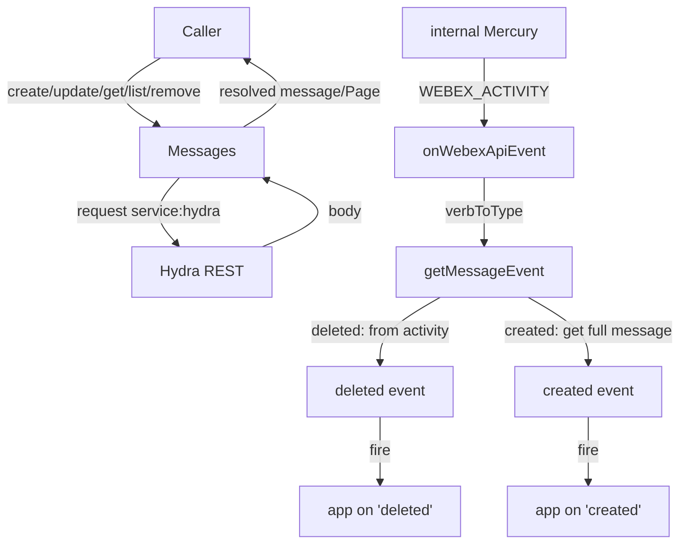
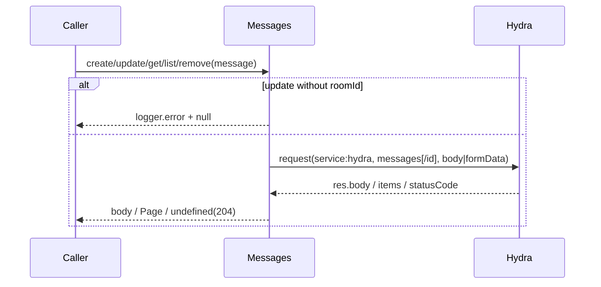
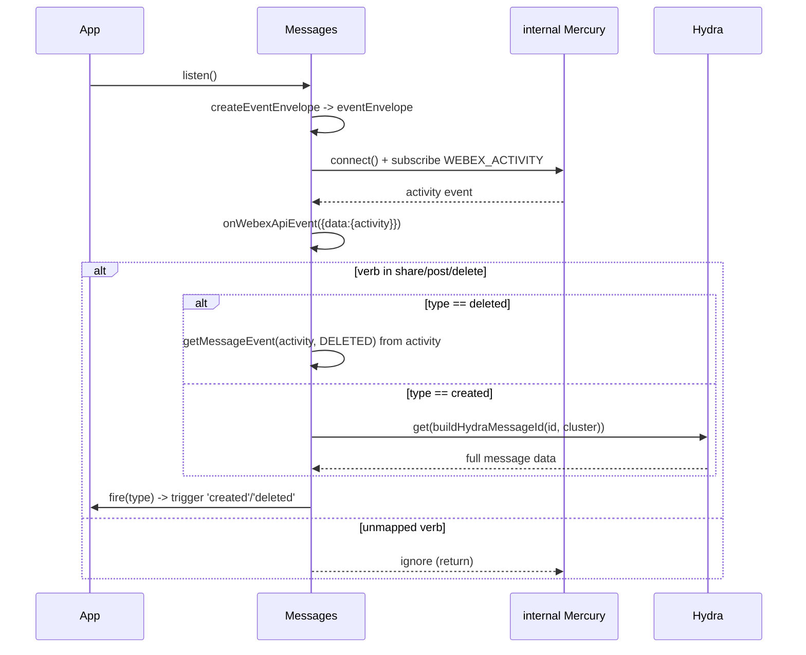
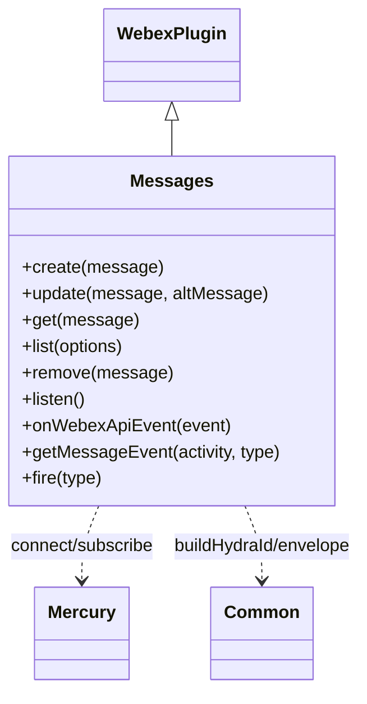

<!-- sdd-generated-metadata
generator: claude-cli
generator_model: us.anthropic.claude-opus-4-8
approved_by: pending-human-review
updated_at: 2026-08-06T00:00:00Z
validation_status: not-run
run_id: 51855eac-8de5-43a2-a3b6-dbcc55ebc91b
-->

# @webex/plugin-messages — SPEC

> Start here → root [`AGENTS.md`](../../../../AGENTS.md) (agent entry) · router [`SPEC_INDEX.md`](../../../../ai-docs/SPEC_INDEX.md) · system [`ARCHITECTURE.md`](../../../../ai-docs/ARCHITECTURE.md). This is the module's canonical spec: orientation, requirements, design, flows, and tests.
> Context-efficiency: link to canonical docs — don't duplicate them. Load specs on demand per `SPEC_INDEX.md`.

## Metadata

| Field | Value |
|---|---|
| Module id | `plugin-messages` |
| Source path(s) | `packages/@webex/plugin-messages/src/` |
| Parent spec | `—` (registered public Webex plugin; composed by `webex-core`, no parent module) |
| Doc kind | Module spec |
| Coverage score | Pending coverage assessment |
| Generated from | `module-spec` @ SDLC template library `0.2.2` |
| generated_by / approved_by / updated_at | claude-cli / pending-human-review / 2026-08-06 |
| Validation status | not-run, validator `pending`, assessed 2026-08-06 |

Coverage score is `Pending coverage assessment` until the first coverage review runs. Manifest coverage
state (`Partial`) is authoritative and kept in `.sdd/manifest.json`.

## Evidence Rules
Every requirement cites concrete source evidence using `file path`. Test evidence is preferred for WHY.
Requirements are grounded in the current implementation under `src/` and its unit tests.

## Source Material Register

| Source material | Scope | Decision | Detail location or disposition |
|---|---|---|---|
| N/A | none | none | No prior AI-docs existed for this package; content is derived directly from `src/` and tests. |

## Overview

`@webex/plugin-messages` is a public Webex SDK plugin (registered as `messages`) for posting and managing
messages in rooms. It owns the message resource — create, update, get, list, and remove — proxied over the
Hydra REST service, and a real-time `listen()` mode that surfaces `created`/`deleted` message events from the
internal Mercury socket as an alternative to webhooks.

The plugin (`src/messages.js`, a `WebexPlugin`) does two jobs: (1) proxy message REST calls to Hydra,
handling text/markdown bodies and file attachments (choosing `body` vs `formData` based on whether files are
strings or binary), and (2) when listening, subscribe to internal Mercury activities, map the activity verb
to an event type via `verbToType`, and translate activities into webhook-shaped SDK events. A maintainer
should start at `src/messages.js`.

For `created` events the plugin fetches the full message via `get` (to obtain decrypted `text`/`markdown`/
`files`); for `deleted` events it cannot fetch (the message is gone) so it constructs the event directly from
the Mercury activity. Listening requires `spark:all` + `spark:kms` scopes.

## Purpose / Responsibility

Owns the client-side surface for the messages resource: creating/updating/fetching/listing/deleting messages
via Hydra (including file attachments), and translating internal Mercury message activities into external
`created`/`deleted` events. It does NOT own room lifecycle, membership, attachment-action cards, or the
Mercury/conversation transport.

## Stack

JavaScript (Babel), built with `webex-legacy-tools`. Uses `lodash` (`cloneDeep`, `isArray`). Tested with the
`@webex/test-helper-*` chai/mocha/mock-webex/test-users helpers and `sinon`. Runtime dependencies include
`@webex/webex-core`, `@webex/common`, and the internal mercury/conversation plugins (imported via
`src/index.js`). Evidence: `packages/@webex/plugin-messages/src/messages.js`,
`packages/@webex/plugin-messages/src/index.js`.

## Folder / Package Structure

```
packages/@webex/plugin-messages/src/
├── index.js      # imports internal conversation+mercury, registerPlugin('messages', Messages)
└── messages.js   # Messages WebexPlugin: create/update/get/list/remove, listen + Mercury event translation
```

## Key Files (source of truth)

| File | Holds |
|---|---|
| `packages/@webex/plugin-messages/src/messages.js` | All message methods, the `verbToType` and `getRoomType` maps, `onWebexApiEvent`, and `getMessageEvent` translation |
| `packages/@webex/plugin-messages/src/index.js` | Plugin registration name (`messages`) and required internal-plugin imports |

## Public Surface

Consumed as a public SDK plugin via `webex.messages`. Calls the Hydra REST service; `listen()` uses the
internal Mercury socket.

| Contract ID | Type | Surface | Purpose | Compatibility / deprecation | Schema / detail link | Root index |
|---|---|---|---|---|---|---|
| `messages.create` | SDK/HTTP | `create(message): Promise<MessageObject>` | POST `messages` to Hydra (text/markdown/files) | Stable; single `file` prop deprecated in favor of `files` | `packages/@webex/plugin-messages/src/messages.js` | `../../../../ai-docs/CONTRACTS.md` |
| `messages.update` | SDK/HTTP | `update(message, altMessage): Promise<MessageObject>` | PUT `messages/{id}` replacing content | Stable; `roomId` required in one of the params | `packages/@webex/plugin-messages/src/messages.js` | `../../../../ai-docs/CONTRACTS.md` |
| `messages.get` | SDK/HTTP | `get(message): Promise<MessageObject>` | GET `messages/{id}` from Hydra | Stable plugin method | `packages/@webex/plugin-messages/src/messages.js` | `../../../../ai-docs/CONTRACTS.md` |
| `messages.list` | SDK/HTTP | `list(options): Promise<Page<MessageObject>>` | GET `messages` from Hydra, paginated (by `roomId`) | Stable plugin method | `packages/@webex/plugin-messages/src/messages.js` | `../../../../ai-docs/CONTRACTS.md` |
| `messages.remove` | SDK/HTTP | `remove(message): Promise<void>` | DELETE `messages/{id}`; `undefined` on 204 | Stable plugin method | `packages/@webex/plugin-messages/src/messages.js` | `../../../../ai-docs/CONTRACTS.md` |
| `messages.listen` | SDK/event | `listen(): Promise<void>` then `.on('created'|'deleted', cb)` | Subscribe to Mercury and emit message events (needs `spark:all`+`spark:kms`) | Stable; alternative to webhooks | `packages/@webex/plugin-messages/src/messages.js` | `../../../../ai-docs/CONTRACTS.md` |

Compatibility notes:
- The `MessageObject` shape (`id`, `personId`, `personEmail`, `roomId`, `text`, `markdown`, `files`,
  `created`) is the consumer contract.
- `listen()` `created` events include `text`/`markdown`/`files` when the activity carries them; `deleted`
  events are constructed from the activity and carry only id/person/room fields.
- Supplying a single `file` property is deprecated; supply a `files` array.

## Requires (dependencies)

- `@webex/webex-core` — base `WebexPlugin`, `Page`, and `this.request` for Hydra calls.
- `@webex/common` — `SDK_EVENT` constants, `createEventEnvelope`, `buildHydraMessageId`,
  `buildHydraPersonId`, `buildHydraRoomId`, `getHydraClusterString` for event translation.
- `@webex/internal-plugin-mercury` — the websocket used by `listen()`.
- `@webex/internal-plugin-conversation` — imported so Mercury activities are decrypted.
- Peer plugins (`@webex/plugin-logger`, `@webex/plugin-people`, `@webex/plugin-rooms`) — expected in the
  composed SDK.

## Requirements

| ID | WHAT | WHY | Source Evidence | Test / Example Evidence | Assumptions / Gaps | Confidence |
|---|---|---|---|---|---|---|
| `MESSAGES-R-001` | `create(message)` POSTs to `service: hydra`, `resource: 'messages'`, choosing `formData` when `files` contains a non-string (binary), else `body`; resolves `res.body`. | Text and binary attachments need different request encodings. | `packages/@webex/plugin-messages/src/messages.js` | `packages/@webex/plugin-messages/test/unit/` | Single `file` prop is migrated to `files` with a deprecation warn | PRESENT |
| `MESSAGES-R-002` | `update(message, altMessage)` PUTs `messages/{id}`; it requires `roomId` in `message` or `altMessage`, backfilling `altMessage.roomId` from `message.roomId`, and logs an error + returns `null` when neither has `roomId`. | The REST API mandates `roomId` in the update body. | `packages/@webex/plugin-messages/src/messages.js` | `packages/@webex/plugin-messages/test/unit/` | Same `file`→`files` deprecation handling as create | PRESENT |
| `MESSAGES-R-003` | `get(message)` accepts id string or object, GETs `messages/{id}`, and resolves `res.body.items || res.body`. | Callers may pass id or object. | `packages/@webex/plugin-messages/src/messages.js` | `packages/@webex/plugin-messages/test/unit/` | none identified | PRESENT |
| `MESSAGES-R-004` | `list(options)` GETs `messages` with `qs: options` and wraps the response in a `Page`. | Message lists paginate, typically filtered by `roomId`. | `packages/@webex/plugin-messages/src/messages.js` | `packages/@webex/plugin-messages/test/unit/` | none identified | PRESENT |
| `MESSAGES-R-005` | `remove(message)` DELETEs `messages/{id}` and resolves `undefined` when `statusCode === 204`, else `res.body`. | Firefox has issues with 204/DELETE bodies. | `packages/@webex/plugin-messages/src/messages.js` | `packages/@webex/plugin-messages/test/unit/` | Comment notes this should move to http-core | PRESENT |
| `MESSAGES-R-006` | `listen()` builds a shared envelope, connects Mercury, and registers a `WEBEX_ACTIVITY` handler calling `onWebexApiEvent`. | Real-time message delivery without webhooks. | `packages/@webex/plugin-messages/src/messages.js` | `packages/@webex/plugin-messages/test/unit/` | Requires `spark:all` + `spark:kms` | PRESENT |
| `MESSAGES-R-007` | `onWebexApiEvent` maps `share`/`post` verbs to `created` and `delete` to `deleted` via `verbToType`; unmapped verbs are ignored, and the constructed event is fired via `fire(type)`. | Only message post/share/delete activities are relevant. | `packages/@webex/plugin-messages/src/messages.js` | `packages/@webex/plugin-messages/test/unit/` | none identified | PRESENT |
| `MESSAGES-R-008` | `getMessageEvent` for `deleted` constructs the event directly from the activity (id/person/room/roomType), and for `created` fetches the full message via `get(buildHydraMessageId(...))` to include decrypted content. | A deleted message cannot be fetched; created messages need full decrypted content. | `packages/@webex/plugin-messages/src/messages.js` | `packages/@webex/plugin-messages/test/unit/` | Room type derived from `ONE_ON_ONE` tag via `getRoomType` | PRESENT |

## Design Overview

`Messages` extends `WebexPlugin`. The REST methods are wrappers over `this.request` targeting Hydra. `create`
and `update` share attachment logic: a single deprecated `file` is converted to `files`, and if any file is
not a string the request uses `formData` (multipart) instead of `body`. `update` enforces the Hydra
requirement that a `roomId` be present in either `message` or `altMessage`, backfilling it and returning
`null` (with a logged error) when it is missing. `get`/`list`/`remove` mirror the other resource plugins
(id/object normalization, `Page` wrapping, 204 → `undefined`).

The listen path is event-driven. `listen()` builds a reusable envelope, connects Mercury, and subscribes to
`WEBEX_ACTIVITY`. `onWebexApiEvent` looks up `activity.verb` in `verbToType` (share/post → created,
delete → deleted); unknown verbs return early. For a mapped verb it calls `getMessageEvent`, then fires the
event with a curried `fire(type)`. `getMessageEvent` branches: `deleted` builds the Hydra-shaped event
straight from the activity (since the message no longer exists), while other types resolve by fetching the
full message through `get` so the event carries decrypted `text`/`markdown`/`files`.

## Data Flow



## Sequence Diagram(s)

Two distinct operation groups exist: synchronous REST (create/update/get/list/remove) and the asynchronous
Mercury listen path. They differ in actors, transport, and failure behavior, so each has its own diagram; the
listen diagram covers the verb map and the created-vs-deleted branch (created requires a follow-up `get`).

Sequence coverage:

| Operation group | Diagram | Failure / recovery coverage |
|---|---|---|
| REST message CRUD | 1. Hydra REST | Hydra errors propagate; `update` without `roomId` → logged error + `null`; 204 → `undefined` on remove |
| Mercury listen → message event | 2. Listen + translate | `alt` covers unmapped verb ignore and created (get) vs deleted (from activity) |

### 1. Hydra REST



### 2. Listen + translate



## Class / Component Relationships



`Messages` extends `WebexPlugin`, uses internal Mercury for the event stream, and `@webex/common` helpers for
Hydra ID construction and the event envelope. `verbToType` and `getRoomType` are module-scoped constants/
helpers.

## Use Cases

- **UC-1 Post a message:** app calls `create({text, roomId})` → POST to Hydra → resolved `MessageObject`.
  Evidence: `packages/@webex/plugin-messages/src/messages.js`.
- **UC-2 Post a file attachment:** app calls `create({files:[binary], roomId})` → multipart `formData` POST.
  Evidence: `packages/@webex/plugin-messages/src/messages.js`.
- **UC-3 Update/get/list/remove a message:** standard operations over Hydra. Evidence:
  `packages/@webex/plugin-messages/src/messages.js`.
- **UC-4 Listen for messages:** app calls `listen()` then `.on('created'|'deleted', cb)` → Mercury activities
  become SDK events; created events fetch full content. Evidence:
  `packages/@webex/plugin-messages/src/messages.js`.

## Concurrency & Reactive Flow

`listen()` is event-driven: after `createEventEnvelope` resolves and Mercury connects, each `WEBEX_ACTIVITY`
is handled asynchronously. The cached `eventEnvelope` is cloned per event (`cloneDeep`) so concurrent
activities do not share mutable state. `created` events add an asynchronous Hydra `get` before firing;
`deleted` events resolve synchronously from the activity. Evidence:
`packages/@webex/plugin-messages/src/messages.js`.

## Error Handling & Failure Modes

| Condition | Signal (error/code/result) | Caller recovery |
|---|---|---|
| Hydra request failure (CRUD) | Rejected Promise from `this.request` | Retry or surface error |
| `update` missing `roomId` in both params | `logger.error` + returns `null` (no request) | Provide `roomId` in `message` or `altMessage` |
| `remove` returns 204 | Resolves `undefined` (not an error) | Treat as success |
| Missing `spark:all`/`spark:kms` scopes | Decryption/connection failure during `listen()` | Re-authorize with required scopes |

## Pitfalls

- Supplying a single `file` property is deprecated and silently converted to `files` with a warning; prefer
  `files`. Evidence: `packages/@webex/plugin-messages/src/messages.js`.
- `update` requires `roomId` somewhere; without it the method logs an error and returns `null` rather than
  throwing — callers must check the result. Evidence: `packages/@webex/plugin-messages/src/messages.js`.
- File encoding switches to `formData` only when a file is a non-string; string URLs stay in `body`.
  Evidence: `packages/@webex/plugin-messages/src/messages.js`.
- `created` listen events trigger a second Hydra `get` to include decrypted content; `deleted` events cannot
  and carry only id/person/room. Evidence: `packages/@webex/plugin-messages/src/messages.js`.
- `get`/`remove` may return either `res.body.items` or `res.body`; callers must handle both. Evidence:
  `packages/@webex/plugin-messages/src/messages.js`.

## Test-Case Strategy (module)

Unit tests (mock-webex + sinon) should mock `this.request` and the internal Mercury plugin to assert:
`create`/`update` choose `body` vs `formData` and migrate `file`→`files` (positive) and that `update` returns
`null` when `roomId` is absent (negative); `get`/`list`/`remove` target the right resource and normalize
output including 204 → `undefined`; `onWebexApiEvent` fires `created`/`deleted` only for mapped verbs and
ignores others (negative); and `getMessageEvent` builds the deleted event from the activity and fetches full
content for created.

| Behavior / Requirement | Existing test evidence | Gap |
|---|---|---|
| `MESSAGES-R-001` | `packages/@webex/plugin-messages/test/unit/` | Assert body-vs-formData + file→files deprecation |
| `MESSAGES-R-002` | `packages/@webex/plugin-messages/test/unit/` | Add missing-roomId → null negative case |
| `MESSAGES-R-003`..`MESSAGES-R-005` | `packages/@webex/plugin-messages/test/unit/` | Assert id/output normalization + 204 case |
| `MESSAGES-R-006`..`MESSAGES-R-008` | `packages/@webex/plugin-messages/test/unit/` | Add verb-map, unmapped-verb, created-vs-deleted cases |

## Traceability

- Repo architecture: [`ARCHITECTURE.md`](../../../../ai-docs/ARCHITECTURE.md) · Registry: [`SPEC_INDEX.md`](../../../../ai-docs/SPEC_INDEX.md)
- Coverage state & contracts baseline: `.sdd/manifest.json`
