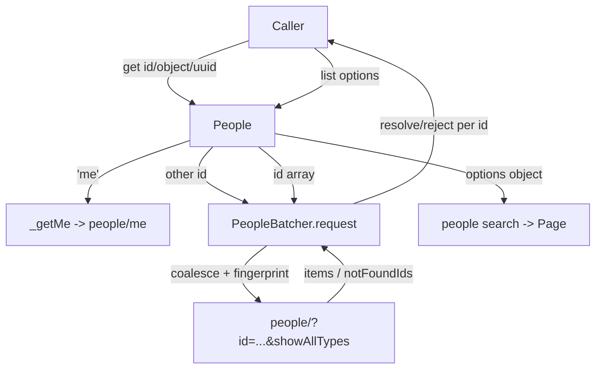
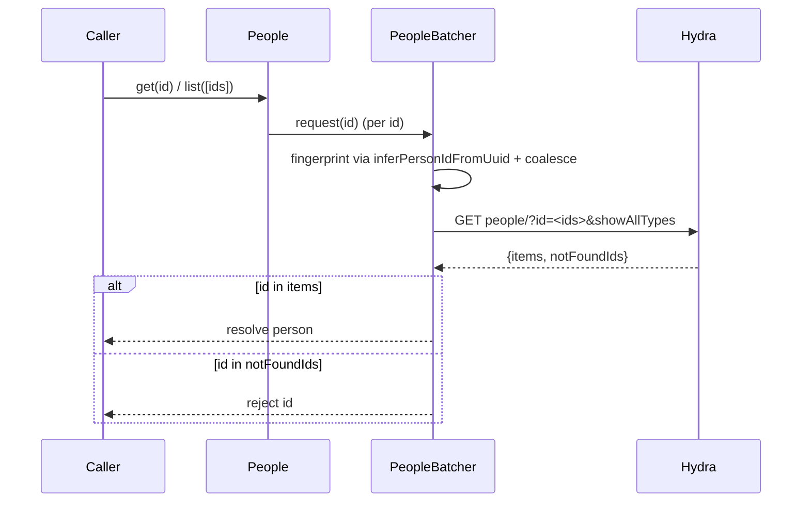
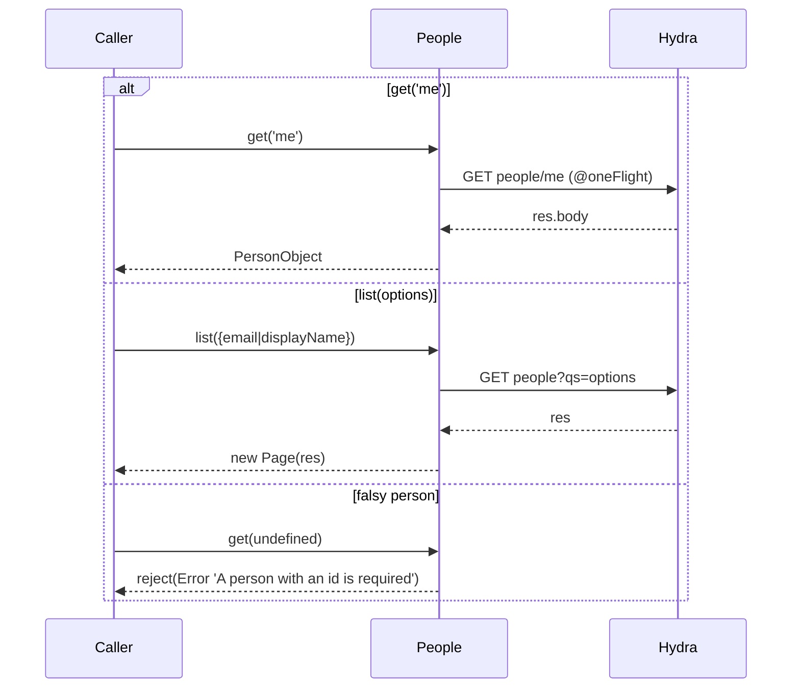
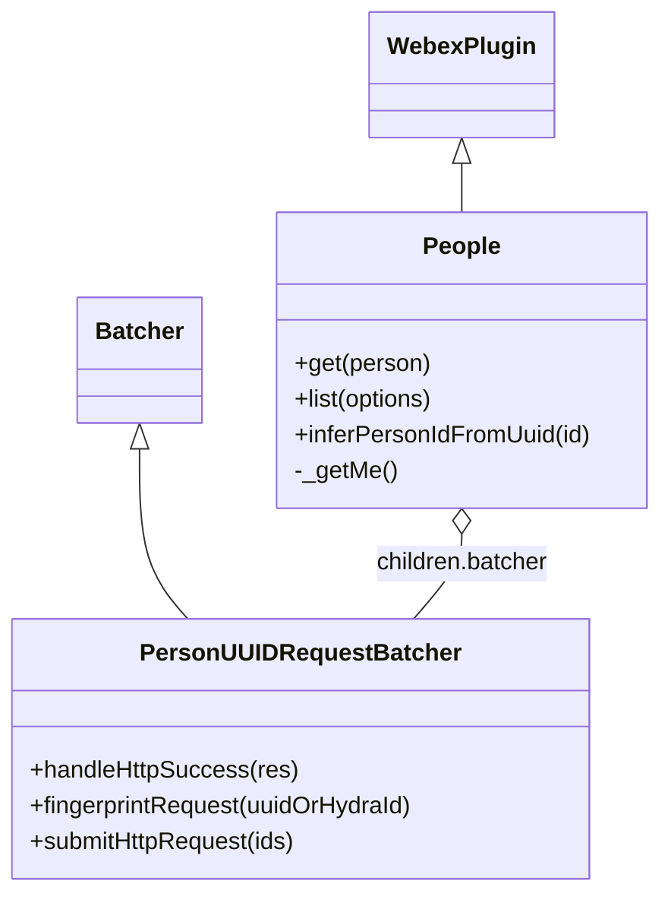

<!-- sdd-generated-metadata
generator: claude-cli
generator_model: us.anthropic.claude-opus-4-8
approved_by: pending-human-review
updated_at: 2026-08-06T00:00:00Z
validation_status: not-run
run_id: 51855eac-8de5-43a2-a3b6-dbcc55ebc91b
-->

# @webex/plugin-people — SPEC

> Start here → root [`AGENTS.md`](../../../../AGENTS.md) (agent entry) · router [`SPEC_INDEX.md`](../../../../ai-docs/SPEC_INDEX.md) · system [`ARCHITECTURE.md`](../../../../ai-docs/ARCHITECTURE.md). This is the module's canonical spec: orientation, requirements, design, flows, and tests.
> Context-efficiency: link to canonical docs — don't duplicate them. Load specs on demand per `SPEC_INDEX.md`.

## Metadata

| Field | Value |
|---|---|
| Module id | `plugin-people` |
| Source path(s) | `packages/@webex/plugin-people/src/` |
| Parent spec | `—` (registered public Webex plugin; composed by `webex-core`, no parent module) |
| Doc kind | Module spec |
| Coverage score | Pending coverage assessment |
| Generated from | `module-spec` @ SDLC template library `0.2.2` |
| generated_by / approved_by / updated_at | claude-cli / pending-human-review / 2026-08-06 |
| Validation status | not-run, validator `pending`, assessed 2026-08-06 |

Coverage score is `Pending coverage assessment` until the first coverage review runs. Manifest coverage
state (`Partial`) is authoritative and kept in `.sdd/manifest.json`.

## Evidence Rules
Every requirement cites concrete source evidence using `file path`. Test evidence is preferred for WHY.
Requirements are grounded in the current implementation under `src/` and its unit tests.

## Source Material Register

| Source material | Scope | Decision | Detail location or disposition |
|---|---|---|---|
| N/A | none | none | No prior AI-docs existed for this package; content is derived directly from `src/` and tests. |

## Overview

`@webex/plugin-people` is a public Webex SDK plugin (registered as `people`) for reading people (users). It
exposes `get`, `list`, and a special `get('me')` path over the Hydra REST service. Its distinguishing design
feature is request batching: single-id `get` calls and array `list` calls are coalesced through a
`PeopleBatcher` (a `Batcher` child plugin) that collapses many id lookups into one `people/?id=...` request.

The plugin (`src/people.js`, a `WebexPlugin`) resolves person ids in several shapes (`personId`, `.id`, raw
id, uuid) and can infer a Hydra person id from a uuid without a network call via `inferPersonIdFromUuid`
(base64-encoding `ciscospark://us/PEOPLE/{id}`). `get('me')` hits `people/me` directly and is guarded by
`@oneFlight` so concurrent "me" lookups share one request. A maintainer should start at `src/people.js` and
`src/people-batcher.js`.

## Purpose / Responsibility

Owns the client-side read surface for the people resource: fetching a single person (with batching), fetching
the current user (`me`), and listing/searching people. It does NOT own presence, memberships, authentication,
or writes to the people resource (the API is read-oriented).

## Stack

JavaScript (Babel), built with `webex-legacy-tools`. Uses `@webex/common` (`base64`, `oneFlight`). Tested with
the `@webex/test-helper-*` chai/mocha/mock-webex/test-users helpers, `sinon`, and jest (`test:unit`). Runtime
dependencies: `@webex/webex-core`, `@webex/common`, `@webex/internal-plugin-mercury`. Evidence:
`packages/@webex/plugin-people/package.json`.

## Folder / Package Structure

```
packages/@webex/plugin-people/src/
├── index.js            # registerPlugin('people', People, {config})
├── people.js           # People WebexPlugin: get/list/_getMe/inferPersonIdFromUuid; children.batcher
├── people-batcher.js   # PersonUUIDRequestBatcher: coalesces id lookups into one Hydra request
└── config.js           # batcher timing (batcherWait/MaxCalls/MaxWait) + showAllTypes flag
```

## Key Files (source of truth)

| File | Holds |
|---|---|
| `packages/@webex/plugin-people/src/people.js` | `get`, `list`, `_getMe`, `inferPersonIdFromUuid`, and the `children.batcher` wiring |
| `packages/@webex/plugin-people/src/people-batcher.js` | Batch request/response handling and the `people/?id=...&showAllTypes=...` HTTP submit |
| `packages/@webex/plugin-people/src/config.js` | Batcher timing constants and the `showAllTypes` default (`false`) |
| `packages/@webex/plugin-people/src/index.js` | Plugin registration name (`people`) and config wiring |

## Public Surface

Consumed as a public SDK plugin via `webex.people`. Calls the Hydra REST service (batched where possible).

| Contract ID | Type | Surface | Purpose | Compatibility / deprecation | Schema / detail link | Root index |
|---|---|---|---|---|---|---|
| `people.get` | SDK/HTTP | `get(person): Promise<PersonObject>` | Fetch a single person by id/object/uuid, via the batcher; `get('me')` for current user | Stable plugin method | `packages/@webex/plugin-people/src/people.js` | `../../../../ai-docs/CONTRACTS.md` |
| `people.list` | SDK/HTTP | `list(options | uuid[]): Promise<Page<PersonObject>> \| Promise<PersonObject[]>` | Search people (`email`/`displayName`) → `Page`, or resolve an array of ids via the batcher | Stable plugin method | `packages/@webex/plugin-people/src/people.js` | `../../../../ai-docs/CONTRACTS.md` |

Compatibility notes:
- The `PersonObject` shape (`id`, `emails`, `displayName`, `created`) is the consumer contract.
- `list` overloads on its argument type: an array of uuids resolves per-id via the batcher (returns an
  array), while an options object performs a Hydra search (returns a `Page`).
- `showAllTypes` (config-controlled, default `false`) determines whether non-person types (e.g. SX10,
  webhook_integration) are returned by batched lookups.

## Requires (dependencies)

- `@webex/webex-core` — base `WebexPlugin`, `Batcher`, `Page`, and `this.request`/`this.webex.request` for
  Hydra calls.
- `@webex/common` — `base64` (uuid inference) and `oneFlight` (deduplicating `_getMe`).
- `@webex/internal-plugin-mercury` — declared runtime dependency of the package.

## Requirements

| ID | WHAT | WHY | Source Evidence | Test / Example Evidence | Assumptions / Gaps | Confidence |
|---|---|---|---|---|---|---|
| `PEOPLE-R-001` | `get(person)` rejects when `person` is falsy, routes `'me'` to `_getMe`, otherwise resolves the id from `person.personId || person.id || person` and delegates to `this.batcher.request(id)`. | Callers pass several id shapes; single lookups are batched for efficiency. | `packages/@webex/plugin-people/src/people.js` | `packages/@webex/plugin-people/test/unit/` | none identified | PRESENT |
| `PEOPLE-R-002` | `_getMe()` GETs `people/me` and resolves `res.body`, decorated with `@oneFlight` so concurrent calls share one request. | The current-user lookup is common; deduplicate concurrent calls. | `packages/@webex/plugin-people/src/people.js` | `packages/@webex/plugin-people/test/unit/` | none identified | PRESENT |
| `PEOPLE-R-003` | `list(options)` when given an array of ids maps each through `this.batcher.request` and resolves via `Promise.all`; otherwise GETs `people` with `qs: options` and wraps the response in a `Page`. | Supports both id-array resolution and search-style listing. | `packages/@webex/plugin-people/src/people.js` | `packages/@webex/plugin-people/test/unit/` | none identified | PRESENT |
| `PEOPLE-R-004` | `inferPersonIdFromUuid(id)` returns the input unchanged if it decodes to a `ciscospark://` id, else base64-encodes `ciscospark://us/PEOPLE/{id}`. | Convert a uuid to a Hydra person id without a network round-trip. | `packages/@webex/plugin-people/src/people.js` | `packages/@webex/plugin-people/test/unit/` | `base64.validate` returns true for uuids, so a decode check is used | PRESENT |
| `PEOPLE-R-005` | The `PersonUUIDRequestBatcher` fingerprints each request via `inferPersonIdFromUuid`, joins ids, and submits one `people/?id=<ids>&showAllTypes=<config>` request; `handleHttpSuccess` resolves each returned person by `id` and rejects `notFoundIds`. | Coalesce many id lookups into a single Hydra request while resolving/rejecting each deferred correctly. | `packages/@webex/plugin-people/src/people-batcher.js` | `packages/@webex/plugin-people/test/unit/` | Config `batcherWait`/`batcherMaxCalls`/`batcherMaxWait` bound batching | PRESENT |

## Design Overview

`People` extends `WebexPlugin` and declares `children.batcher = PeopleBatcher`, so the batcher is a child
plugin instance. `get` normalizes the id and, except for `'me'`, hands off to `this.batcher.request(id)`; the
batcher accumulates ids (bounded by the `batcherWait`/`batcherMaxCalls`/`batcherMaxWait` config) and submits a
single `people/?id=...` request. `handleHttpSuccess` walks `res.body.items`, resolving each deferred by
person id, and rejects any `notFoundIds`. Request/response fingerprinting uses `inferPersonIdFromUuid`, which
base64-encodes a `ciscospark://us/PEOPLE/{id}` URN when the input is a bare uuid.

`_getMe` is separate from the batcher: it hits `people/me` directly and is wrapped with `@oneFlight` so
overlapping "me" calls resolve from one in-flight request. `list` overloads on argument type — an array of
ids resolves through the batcher (returning an array), while an options object performs a Hydra `people`
search and returns a `Page`.

## Data Flow



## Sequence Diagram(s)

Two distinct operation groups exist: the batched single-id/array lookup path and the direct `me`/search path.
They differ in transport shape (coalesced batch request vs a direct request) and failure behavior (per-id
reject vs whole-request reject), so each has its own diagram.

Sequence coverage:

| Operation group | Diagram | Failure / recovery coverage |
|---|---|---|
| Batched id lookup (get/array list) | 1. Batched lookup | `notFoundIds` reject the matching deferred |
| Direct me / search | 2. Direct request | Falsy id rejects; Hydra errors propagate |

### 1. Batched lookup



### 2. Direct me / search



## Class / Component Relationships



`People` extends `WebexPlugin` and composes a `PersonUUIDRequestBatcher` (a `Batcher` subclass) as its
`batcher` child. The batcher performs the actual coalesced Hydra request and per-id deferred resolution.

## Use Cases

- **UC-1 Get a person:** app calls `get(personId)` → batched Hydra lookup → `PersonObject`. Evidence:
  `packages/@webex/plugin-people/src/people.js`, `packages/@webex/plugin-people/src/people-batcher.js`.
- **UC-2 Get the current user:** app calls `get('me')` → `people/me` (deduplicated) → `PersonObject`.
  Evidence: `packages/@webex/plugin-people/src/people.js`.
- **UC-3 Search or bulk-resolve people:** app calls `list({email})` → `Page`, or `list([id1, id2])` →
  batched array of people. Evidence: `packages/@webex/plugin-people/src/people.js`.

## Concurrency & Reactive Flow

The batcher is the concurrency mechanism: many `get`/array-`list` calls within the `batcherWait` window (or up
to `batcherMaxCalls`, capped by `batcherMaxWait`) are coalesced into one `people/?id=...` request, then fanned
back out by resolving/rejecting each deferred by id. `_getMe` uses `@oneFlight` so concurrent current-user
lookups share a single in-flight request. Evidence: `packages/@webex/plugin-people/src/people.js`,
`packages/@webex/plugin-people/src/people-batcher.js`, `packages/@webex/plugin-people/src/config.js`.

## Error Handling & Failure Modes

| Condition | Signal (error/code/result) | Caller recovery |
|---|---|---|
| Falsy `person` passed to `get` | Rejected Promise `Error('A person with an id is required')` | Pass a valid id/object |
| Person id in batch `notFoundIds` | The matching deferred is rejected with the id | Handle per-id rejection |
| Hydra request failure (search/me) | Rejected Promise from `this.request`/`this.webex.request` | Retry or surface error |

## Pitfalls

- `get('me')` is a special-cased string, not a normal id; it bypasses the batcher and hits `people/me`.
  Evidence: `packages/@webex/plugin-people/src/people.js`.
- `list` overloads on argument type — an array is treated as a set of ids to batch, an object as a search;
  passing the wrong shape changes the return type (array vs `Page`). Evidence:
  `packages/@webex/plugin-people/src/people.js`.
- `base64.validate` returns true for uuids, so `inferPersonIdFromUuid` uses a `ciscospark://` decode check
  rather than validate. Evidence: `packages/@webex/plugin-people/src/people.js`.
- `showAllTypes` is `false` by default; non-person entities (SX10, webhook_integration) are excluded from
  batched results unless the config is changed. Evidence: `packages/@webex/plugin-people/src/config.js`,
  `packages/@webex/plugin-people/src/people-batcher.js`.

## Test-Case Strategy (module)

Unit tests (mock-webex + sinon, jest) should assert: `get` rejects on falsy input (negative) and routes
`'me'` vs a normal id correctly; `_getMe` hits `people/me` and dedupes via `@oneFlight`; `list` batches an id
array vs searches with an options object and wraps in `Page`; `inferPersonIdFromUuid` returns a
`ciscospark://` input unchanged and encodes a bare uuid; and the batcher resolves items and rejects
`notFoundIds`.

| Behavior / Requirement | Existing test evidence | Gap |
|---|---|---|
| `PEOPLE-R-001` | `packages/@webex/plugin-people/test/unit/` | Add falsy-input negative + id-shape cases |
| `PEOPLE-R-002` | `packages/@webex/plugin-people/test/unit/` | Assert `people/me` + oneFlight dedupe |
| `PEOPLE-R-003` | `packages/@webex/plugin-people/test/unit/` | Cover array-vs-options overload |
| `PEOPLE-R-004` | `packages/@webex/plugin-people/test/unit/` | Assert passthrough vs encode |
| `PEOPLE-R-005` | `packages/@webex/plugin-people/test/unit/` | Assert items resolve + notFoundIds reject |

## Traceability

- Repo architecture: [`ARCHITECTURE.md`](../../../../ai-docs/ARCHITECTURE.md) · Registry: [`SPEC_INDEX.md`](../../../../ai-docs/SPEC_INDEX.md)
- Coverage state & contracts baseline: `.sdd/manifest.json`
