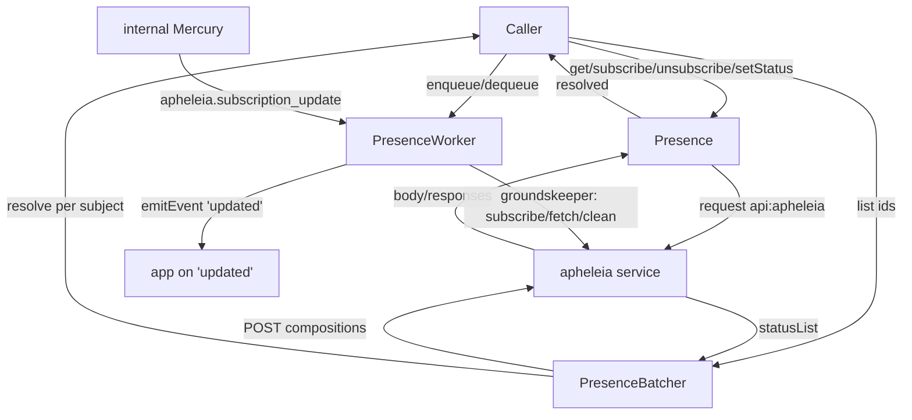
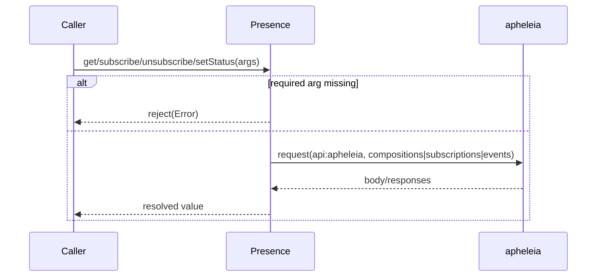
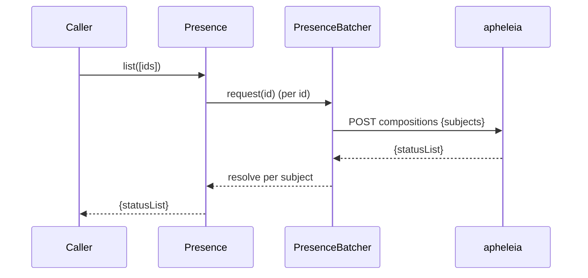
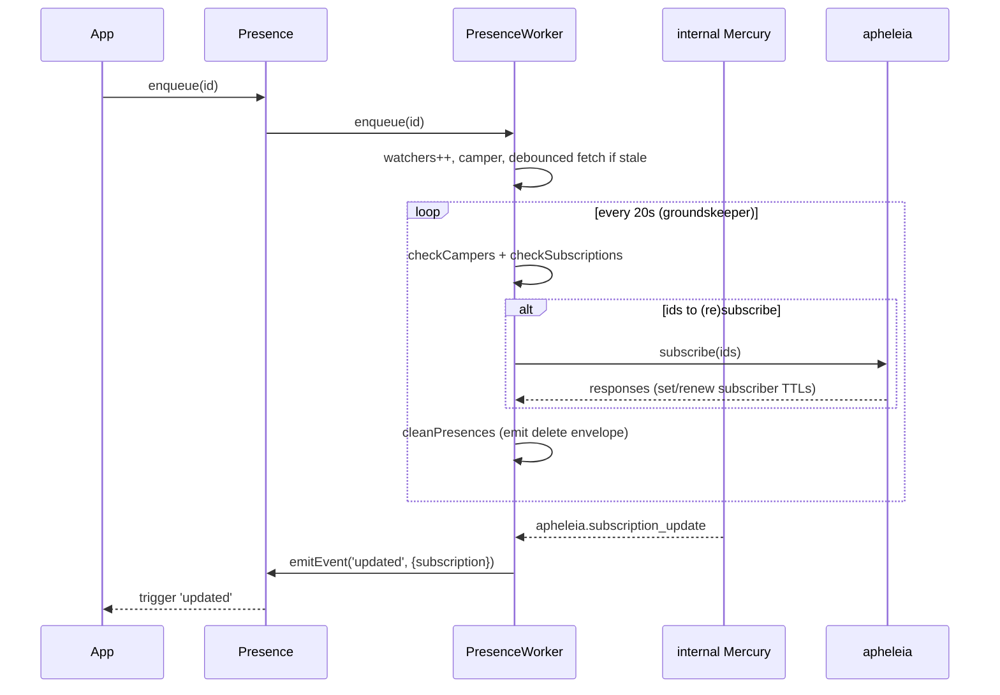
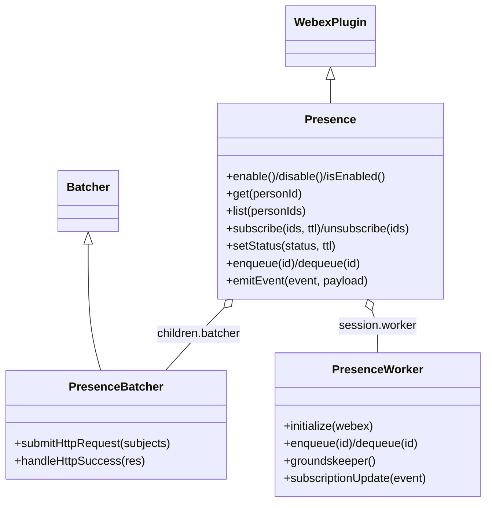

<!-- sdd-generated-metadata
generator: claude-cli
generator_model: us.anthropic.claude-opus-4-8
approved_by: pending-human-review
updated_at: 2026-08-06T00:00:00Z
validation_status: not-run
run_id: 51855eac-8de5-43a2-a3b6-dbcc55ebc91b
-->

# @webex/plugin-presence — SPEC

> Start here → root [`AGENTS.md`](../../../../AGENTS.md) (agent entry) · router [`SPEC_INDEX.md`](../../../../ai-docs/SPEC_INDEX.md) · system [`ARCHITECTURE.md`](../../../../ai-docs/ARCHITECTURE.md). This is the module's canonical spec: orientation, requirements, design, flows, state, and tests.
> Context-efficiency: link to canonical docs — don't duplicate them. Load specs on demand per `SPEC_INDEX.md`.

## Metadata

| Field | Value |
|---|---|
| Module id | `plugin-presence` |
| Source path(s) | `packages/@webex/plugin-presence/src/` |
| Parent spec | `—` (registered public Webex plugin; composed by `webex-core`, no parent module) |
| Doc kind | Module spec |
| Coverage score | Pending coverage assessment |
| Generated from | `module-spec` @ SDLC template library `0.2.2` |
| generated_by / approved_by / updated_at | claude-cli / pending-human-review / 2026-08-06 |
| Validation status | not-run, validator `pending`, assessed 2026-08-06 |

Coverage score is `Pending coverage assessment` until the first coverage review runs. Manifest coverage
state (`Partial`) is authoritative and kept in `.sdd/manifest.json`.

## Evidence Rules
Every requirement cites concrete source evidence using `file path`. Test evidence is preferred for WHY.
Requirements are grounded in the current implementation under `src/` and its unit tests.

## Source Material Register

| Source material | Scope | Decision | Detail location or disposition |
|---|---|---|---|
| N/A | none | none | No prior AI-docs existed for this package; content is derived directly from `src/` and tests. |

## Overview

`@webex/plugin-presence` is a public Webex SDK plugin (registered as `presence`) for reading, subscribing to,
and setting user presence. It talks to the `apheleia` presence service for direct reads (`get`, `list`),
subscriptions (`subscribe`/`unsubscribe`), and status changes (`setStatus`), and it also ships a client-side
`PresenceWorker` that maintains subscriptions and cached presence for a set of watched users over time,
emitting `updated` events as presence changes arrive over Mercury.

The plugin (`src/presence.ts`, a `WebexPlugin`) is TypeScript with typed interfaces (`src/interface.ts`) and a
build that emits declaration files. Two collaborators do the heavy lifting: `PresenceBatcher`
(`src/presence-batcher.ts`) coalesces `list` id lookups into a single `compositions` request, and
`PresenceWorker` (`src/presence-worker.ts`) runs a periodic "groundskeeper" that fetches, subscribes,
re-subscribes, and expires cached presence. A maintainer should start at `src/presence.ts`.

Presence itself is gated by a per-user feature toggle (`user-presence-enabled`); `enable`/`disable`/
`isEnabled` flip and read that feature via the internal feature plugin.

## Purpose / Responsibility

Owns the client-side surface for user presence: enable/disable/query the feature, read a person's or people's
composed presence, subscribe/unsubscribe to presence updates, set the current user's status, and — via the
worker — maintain live subscriptions and a presence cache for watched ids. It does NOT own the apheleia
service, Mercury transport, or the feature-toggle store (those are the internal feature/mercury plugins).

## Stack

TypeScript (`src/*.ts`), built with `tsc` (declarations) plus `webex-legacy-tools`; docs via `typedoc`
(`build:docs`). Uses `lodash` (`debounce`). Tested with the `@webex/test-helper-*` chai/mocha/mock-webex/
test-users helpers, `sinon`, and jest (`test:unit`). Runtime dependencies:
`@webex/internal-plugin-device`, `@webex/internal-plugin-mercury`, `@webex/webex-core`, `lodash`. Evidence:
`packages/@webex/plugin-presence/package.json`.

## Folder / Package Structure

```
packages/@webex/plugin-presence/src/
├── index.ts             # registerPlugin('presence', Presence, {payloadTransformer, config})
├── presence.ts          # Presence WebexPlugin: enable/disable/isEnabled, get/list, subscribe/unsubscribe, setStatus, enqueue/dequeue, emitEvent
├── presence-batcher.ts  # PresenceBatcher: coalesces list ids into one apheleia compositions request
├── presence-worker.ts   # PresenceWorker: groundskeeper loop maintaining fetch/subscribe/expire + PRESENCE_UPDATE events
├── constants.ts         # timing constants, APHELEIA_SUBSCRIPTION_UPDATE, PRESENCE_UPDATE, ENVELOPE_TYPE
├── config.js            # plugin config (initializeWorker)
└── interface.ts         # typed interfaces (IPresence, IPresenceStatusObject, IEventPayload, ...)
```

## Key Files (source of truth)

| File | Holds |
|---|---|
| `packages/@webex/plugin-presence/src/presence.ts` | All public methods and worker delegation (`enqueue`/`dequeue`) |
| `packages/@webex/plugin-presence/src/presence-worker.ts` | The groundskeeper loop, watcher/fetcher/camper/subscriber maps, and update emission |
| `packages/@webex/plugin-presence/src/presence-batcher.ts` | Batched `compositions` request and per-subject deferred resolution |
| `packages/@webex/plugin-presence/src/constants.ts` | Timing intervals, the Mercury event name, and `ENVELOPE_TYPE` |
| `packages/@webex/plugin-presence/src/index.ts` | Registration name (`presence`), inbound payload transformer, config |

## Public Surface

Consumed as a public SDK plugin via `webex.presence`. Calls the `apheleia` presence service; subscription
updates arrive over Mercury (`event:apheleia.subscription_update`).

| Contract ID | Type | Surface | Purpose | Compatibility / deprecation | Schema / detail link | Root index |
|---|---|---|---|---|---|---|
| `presence.enable` | SDK/HTTP | `enable(): Promise<boolean>` | Turn on the `user-presence-enabled` feature | Stable plugin method | `packages/@webex/plugin-presence/src/presence.ts` | `../../../../ai-docs/CONTRACTS.md` |
| `presence.disable` | SDK/HTTP | `disable(): Promise<boolean>` | Turn off the presence feature | Stable plugin method | `packages/@webex/plugin-presence/src/presence.ts` | `../../../../ai-docs/CONTRACTS.md` |
| `presence.isEnabled` | SDK/HTTP | `isEnabled(): Promise<boolean>` | Read the presence feature toggle | Stable plugin method | `packages/@webex/plugin-presence/src/presence.ts` | `../../../../ai-docs/CONTRACTS.md` |
| `presence.get` | SDK/HTTP | `get(personId): Promise<PresenceStatusObject>` | GET composed presence for one person | Stable plugin method | `packages/@webex/plugin-presence/src/presence.ts` | `../../../../ai-docs/CONTRACTS.md` |
| `presence.list` | SDK/HTTP | `list(personIds[]): Promise<{statusList}>` | Batched presence for an array of ids | Stable plugin method | `packages/@webex/plugin-presence/src/presence.ts` | `../../../../ai-docs/CONTRACTS.md` |
| `presence.subscribe` | SDK/HTTP | `subscribe(personIds, subscriptionTtl): Promise<{responses}>` | Subscribe (batched by 50) to presence updates | Stable plugin method | `packages/@webex/plugin-presence/src/presence.ts` | `../../../../ai-docs/CONTRACTS.md` |
| `presence.unsubscribe` | SDK/HTTP | `unsubscribe(personIds): Promise<{responses}>` | Unsubscribe (TTL 0) from presence updates | Stable plugin method | `packages/@webex/plugin-presence/src/presence.ts` | `../../../../ai-docs/CONTRACTS.md` |
| `presence.setStatus` | SDK/HTTP | `setStatus(status, ttl): Promise<any>` | Set current user status (active/inactive/ooo/dnd) | Stable plugin method | `packages/@webex/plugin-presence/src/presence.ts` | `../../../../ai-docs/CONTRACTS.md` |
| `presence.enqueue` / `presence.dequeue` | SDK | `enqueue(id) / dequeue(id): void` | Add/remove a watched id from the worker | Stable plugin method | `packages/@webex/plugin-presence/src/presence.ts` | `../../../../ai-docs/CONTRACTS.md` |
| `presence:updated` | event | `.on('updated', {type, payload})` | Worker-emitted presence/subscription/delete updates | Stable event | `packages/@webex/plugin-presence/src/presence-worker.ts` | `../../../../ai-docs/CONTRACTS.md` |

Compatibility notes:
- The `PresenceStatusObject` shape (`url`, `subject`, `status`, `statusTime`, `lastActive`, `expiresTTL`,
  `expiresTime`, `vectorCounters`, `suppressNotifications`, `lastSeenDeviceUrl`) is the consumer contract;
  `expires` is deprecated in favor of `expiresTTL`/`expiresTime`.
- The `updated` event payload `type` is one of `ENVELOPE_TYPE` (`subscription`/`presence`/`delete`).
- An inbound payload transformer normalizes a single-status response's `body.status` from `body.eventType`.

## Requires (dependencies)

- `@webex/webex-core` — base `WebexPlugin`, `Batcher`, and `this.webex.request` for apheleia calls.
- `@webex/internal-plugin-device` — `device.userId` used as the `subject` for `setStatus`.
- `@webex/internal-plugin-mercury` — delivers `event:apheleia.subscription_update` to the worker; `connect`.
- `@webex/internal-plugin-feature` (via `webex.internal.feature`) — reads/sets `user-presence-enabled`.
- `lodash` — `debounce` for the worker's fetch coalescing.

## Requirements

| ID | WHAT | WHY | Source Evidence | Test / Example Evidence | Assumptions / Gaps | Confidence |
|---|---|---|---|---|---|---|
| `PRESENCE-R-001` | `enable`/`disable` set the `user`/`user-presence-enabled` feature to `true`/`false` and resolve the resulting value; `isEnabled` reads it. | Presence is gated by a per-user feature toggle. | `packages/@webex/plugin-presence/src/presence.ts` | `packages/@webex/plugin-presence/test/unit/` | none identified | PRESENT |
| `PRESENCE-R-002` | `get(personId)` rejects when `personId` is falsy, else GETs `apheleia` `compositions?userId={personId}` and resolves `response.body`. | Single composed-presence read. | `packages/@webex/plugin-presence/src/presence.ts` | `packages/@webex/plugin-presence/test/unit/` | none identified | PRESENT |
| `PRESENCE-R-003` | `list(personIds)` rejects when the argument is not an array, else resolves each id through `this.batcher.request` and returns `{statusList}`. | Bulk presence reads are batched. | `packages/@webex/plugin-presence/src/presence.ts` | `packages/@webex/plugin-presence/test/unit/` | none identified | PRESENT |
| `PRESENCE-R-004` | `subscribe(personIds, subscriptionTtl=600)` normalizes to an array, splits into batches of 50, POSTs each to apheleia `subscriptions` with `includeStatus: true`, and concatenates `responses`. | Apheleia caps subscription requests; batching keeps them within limits. | `packages/@webex/plugin-presence/src/presence.ts` | `packages/@webex/plugin-presence/test/unit/` | Rejects when `personIds` falsy | PRESENT |
| `PRESENCE-R-005` | `unsubscribe(personIds)` POSTs to apheleia `subscriptions` with `subscriptionTtl: 0`; rejects when `personIds` is falsy. | TTL 0 tells apheleia to drop the subscription. | `packages/@webex/plugin-presence/src/presence.ts` | `packages/@webex/plugin-presence/test/unit/` | none identified | PRESENT |
| `PRESENCE-R-006` | `setStatus(status, ttl)` rejects when `status` is falsy, else POSTs to apheleia `events` with `subject = device.userId`, `eventType = status`, `ttl`, and a `label` for non-`dnd` statuses. | Set the current user's status; `dnd` omits the label. | `packages/@webex/plugin-presence/src/presence.ts` | `packages/@webex/plugin-presence/test/unit/` | Valid statuses: active/inactive/ooo/dnd | PRESENT |
| `PRESENCE-R-007` | `emitEvent(event, payload)` triggers the event only when both `payload.type` and `payload.payload` are set. | Guard against emitting empty/partial update envelopes. | `packages/@webex/plugin-presence/src/presence.ts` | `packages/@webex/plugin-presence/test/unit/` | none identified | PRESENT |
| `PRESENCE-R-008` | `enqueue(id)`/`dequeue(id)` delegate to the worker; enqueue increments a watcher count and schedules a debounced fetch when presence is missing/stale, dequeue decrements and clears watcher/fetcher/camper state at zero. | Ref-counted watching drives fetch/subscribe/cleanup. | `packages/@webex/plugin-presence/src/presence.ts`, `packages/@webex/plugin-presence/src/presence-worker.ts` | `packages/@webex/plugin-presence/test/unit/` | none identified | PRESENT |
| `PRESENCE-R-009` | The worker's `groundskeeper` (every 20s) subscribes new campers and renewals, then cleans expired presence; `subscriptionUpdate` caches the subject time and emits a `subscription` `updated` event on Mercury `apheleia.subscription_update`. | Maintain live subscriptions and a bounded presence cache without per-call polling. | `packages/@webex/plugin-presence/src/presence-worker.ts`, `packages/@webex/plugin-presence/src/constants.ts` | `packages/@webex/plugin-presence/test/unit/` | Errored subscriptions still get a TTL so they are eventually cleaned | PRESENT |
| `PRESENCE-R-010` | The `PresenceBatcher` submits one apheleia `compositions` POST for the coalesced `subjects` and resolves each deferred by `subject` from `res.body.statusList`. | Coalesce many `list` ids into a single request. | `packages/@webex/plugin-presence/src/presence-batcher.ts` | `packages/@webex/plugin-presence/test/unit/` | none identified | PRESENT |

## Design Overview

`Presence` extends `WebexPlugin` and declares `children.batcher = PresenceBatcher` and a `session.worker`
holding a `PresenceWorker`. Direct reads/writes (`get`, `subscribe`, `unsubscribe`, `setStatus`) call the
apheleia service through `this.webex.request`; `list` coalesces ids through the batcher, which submits one
`compositions` POST and resolves each deferred from `res.body.statusList`. Feature gating (`enable`/`disable`/
`isEnabled`) goes through the internal feature plugin.

The worker is the stateful engine. On `initialize` it connects Mercury (if needed), subscribes to
`apheleia.subscription_update`, and starts a 20-second `groundskeeper` interval. It tracks watched ids across
several maps: `watchers` (ref counts), `fetchers`/`flights` (fetch queue/in-flight), `campers` (waiting to
subscribe), `subscribers` (active subscriptions with expiry), and `presences` (cache timestamps).
`enqueue` bumps the watcher count and schedules a debounced fetch when presence is missing or stale;
`dequeue` decrements and clears state at zero. Each groundskeeper tick promotes campers past
`SUBSCRIPTION_DELAY` and renews subscriptions nearing expiry (`checkCampers`/`checkSubscriptions`), then calls
`subscribe` for the combined ids and prunes expired cache entries (`cleanPresences`), emitting `presence`/
`delete`/`subscription` envelopes via `presence.emitEvent`.

## Data Flow



## Sequence Diagram(s)

Three distinct operation groups exist: direct apheleia request/response methods, the batched `list` path, and
the worker's periodic subscription-maintenance loop. They differ in transport shape and lifetime (one-shot
request vs coalesced batch vs long-running interval), so each has its own diagram.

Sequence coverage:

| Operation group | Diagram | Failure / recovery coverage |
|---|---|---|
| Direct apheleia methods | 1. Direct request | Falsy-arg rejects; apheleia errors propagate |
| Batched list | 2. Batched compositions | Per-subject deferred resolution |
| Worker maintenance | 3. Groundskeeper loop | Errored subscriptions get a TTL; stale presence expired |

### 1. Direct request



### 2. Batched compositions



### 3. Groundskeeper loop



## Class / Component Relationships



`Presence` extends `WebexPlugin` and composes a `PresenceBatcher` child (batched `list`) and a
`PresenceWorker` session object (long-running subscription/cache maintenance). The worker calls back into
`presence.list`/`presence.subscribe`/`presence.emitEvent`.

## Use Cases

- **UC-1 Read presence:** app calls `get(personId)` or `list([ids])` → apheleia compositions →
  `PresenceStatusObject`(s). Evidence: `packages/@webex/plugin-presence/src/presence.ts`.
- **UC-2 Set my status:** app calls `setStatus('dnd', ttl)` → apheleia events POST. Evidence:
  `packages/@webex/plugin-presence/src/presence.ts`.
- **UC-3 Watch a user's live presence:** app calls `enqueue(id)`, receives `updated` events as the worker
  subscribes and Mercury delivers updates, then `dequeue(id)` to stop. Evidence:
  `packages/@webex/plugin-presence/src/presence-worker.ts`.

## State Model

The worker holds the client-side presence state as several id-keyed maps in `PresenceWorker`:
`watchers` (visible ref count per id), `fetchers` (queued for fetch), `flights` (fetch in progress),
`campers` (waiting-to-subscribe timestamp), `subscribers` (active subscription expiry time), and `presences`
(last-updated cache timestamp). `enqueue`/`dequeue` mutate `watchers` and derived maps; `groundskeeper`
transitions `campers`→`subscribers`, renews near-expiry subscribers, deletes expired ones, and evicts stale
`presences`. Evidence: `packages/@webex/plugin-presence/src/presence-worker.ts`.

## Concurrency & Reactive Flow

The worker is inherently concurrent/reactive: a `setInterval` groundskeeper (every
`GROUNDSKEEPER_INTERVAL` = 20s) runs alongside Mercury-driven `subscriptionUpdate` callbacks and a
`debounce`d `checkFetchers` (`FETCH_DELAY` = 300ms) that coalesces fetches. In-flight fetches are tracked in
`flights` to avoid duplicate requests; presence entries older than `UPDATE_PRESENCE_DELAY` are considered
stale and refetched, and entries older than `EXPIRED_PRESENCE_TIME` are evicted. Subscriptions are renewed
`PREMATURE_EXPIRATION_SUBSCRIPTION_TIME` before expiry and errored subscriptions are given
`DEFAULT_SUBSCRIPTION_TTL` so they are eventually cleaned. Evidence:
`packages/@webex/plugin-presence/src/presence-worker.ts`, `packages/@webex/plugin-presence/src/constants.ts`.

## Error Handling & Failure Modes

| Condition | Signal (error/code/result) | Caller recovery |
|---|---|---|
| Falsy `personId`/`personIds`/`status` argument | Rejected Promise with explanatory `Error` | Pass a valid argument |
| `list` argument not an array | Rejected Promise `Error('An array of person ids is required')` | Pass an array |
| apheleia request failure | Rejected Promise from `this.webex.request` | Retry or surface error |
| Worker `initialize` without `webex.internal` | Throws `Error('Must initialize Presence Worker with webex!')` | Initialize with a ready webex |
| Subscription response non-200 | Subscriber assigned `DEFAULT_SUBSCRIPTION_TTL` for eventual cleanup | None required |

## Pitfalls

- `subscribe` silently batches ids into groups of 50; do not assume a single request per call. Evidence:
  `packages/@webex/plugin-presence/src/presence.ts`.
- `setStatus` omits the `label` for `dnd` but includes it (as `device.userId`) for other statuses. Evidence:
  `packages/@webex/plugin-presence/src/presence.ts`.
- The worker starts a `setInterval` that persists for the plugin's lifetime; watched ids are ref-counted, so
  balance `enqueue`/`dequeue` or subscriptions/cache entries leak. Evidence:
  `packages/@webex/plugin-presence/src/presence-worker.ts`.
- `emitEvent` drops payloads missing `type` or `payload`; an `updated` listener won't fire for partial
  envelopes. Evidence: `packages/@webex/plugin-presence/src/presence.ts`.
- The `expires` field on `PresenceStatusObject` is deprecated; use `expiresTTL`/`expiresTime`. Evidence:
  `packages/@webex/plugin-presence/src/presence.ts`.

## Test-Case Strategy (module)

Unit tests (mock-webex + sinon, jest) should assert: `get`/`list`/`subscribe`/`unsubscribe`/`setStatus`
reject on invalid args (negative) and hit the right apheleia resource/body (positive), including the 50-id
batching in `subscribe` and the `dnd`-vs-other label branch in `setStatus`; `emitEvent` fires only for
complete payloads; the batcher resolves per subject; and the worker's `enqueue`/`dequeue` ref-counting and
`groundskeeper` subscribe/expire transitions behave as expected (with fake timers).

| Behavior / Requirement | Existing test evidence | Gap |
|---|---|---|
| `PRESENCE-R-001`..`PRESENCE-R-003` | `packages/@webex/plugin-presence/test/unit/` | Assert feature toggles + invalid-arg rejects |
| `PRESENCE-R-004`..`PRESENCE-R-006` | `packages/@webex/plugin-presence/test/unit/` | Cover 50-id batching + dnd label branch |
| `PRESENCE-R-007` | `packages/@webex/plugin-presence/test/unit/` | Add partial-payload negative case |
| `PRESENCE-R-008`..`PRESENCE-R-009` | `packages/@webex/plugin-presence/test/unit/` | Fake-timer groundskeeper + ref-count cases |
| `PRESENCE-R-010` | `packages/@webex/plugin-presence/test/unit/` | Assert compositions batch + per-subject resolve |

## Traceability

- Repo architecture: [`ARCHITECTURE.md`](../../../../ai-docs/ARCHITECTURE.md) · Registry: [`SPEC_INDEX.md`](../../../../ai-docs/SPEC_INDEX.md)
- Coverage state & contracts baseline: `.sdd/manifest.json`
