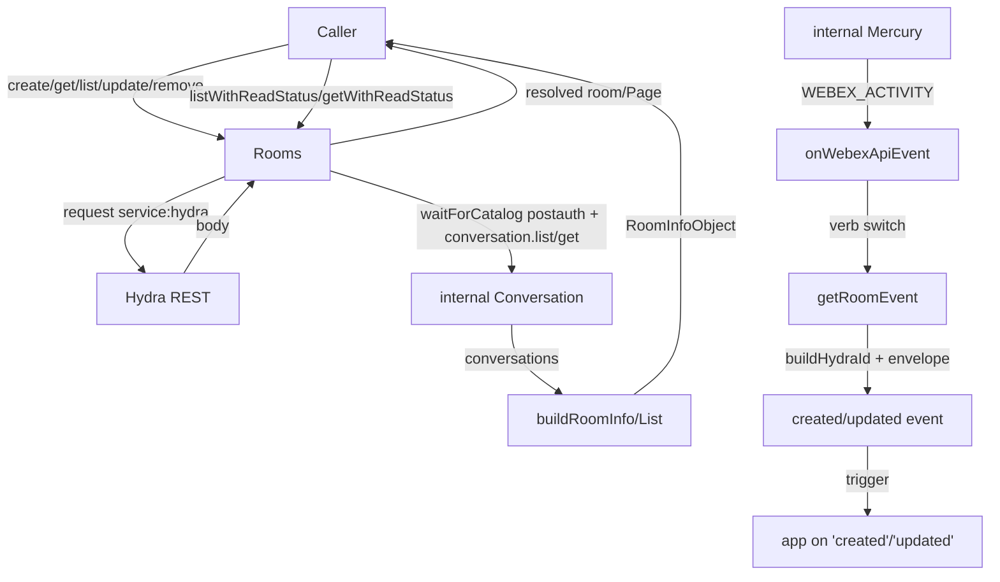
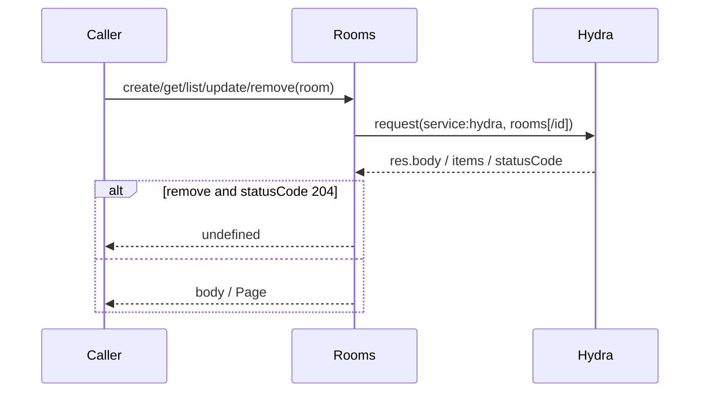
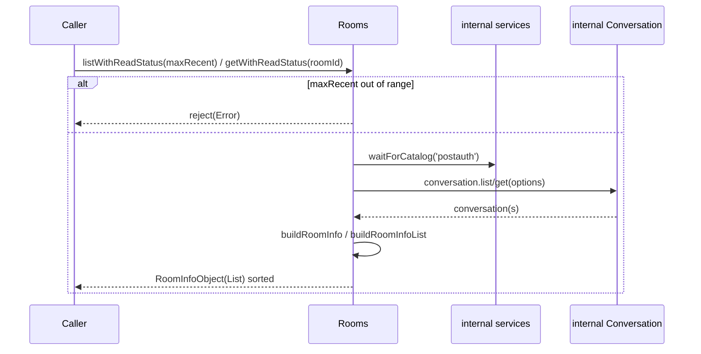
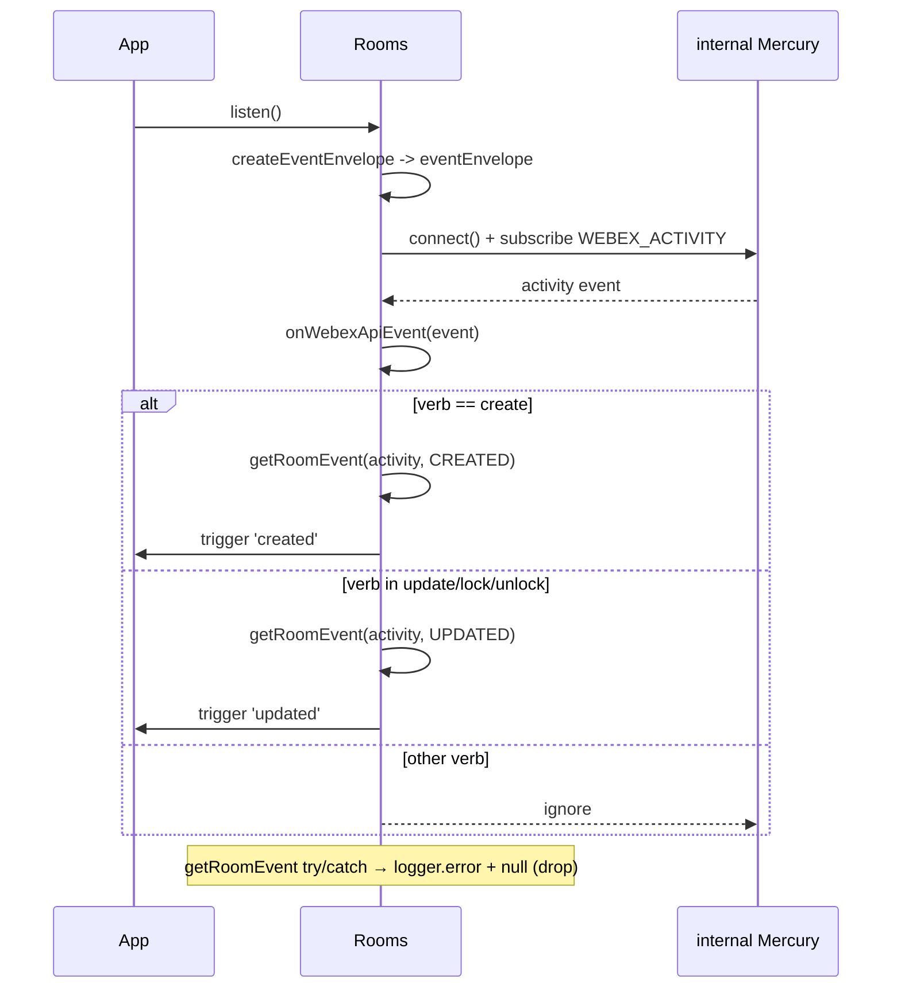
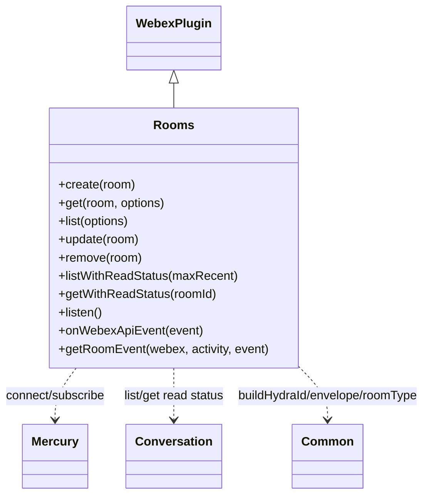

<!-- sdd-generated-metadata
generator: claude-cli
generator_model: us.anthropic.claude-opus-4-8
approved_by: pending-human-review
updated_at: 2026-08-06T00:00:00Z
validation_status: not-run
run_id: 51855eac-8de5-43a2-a3b6-dbcc55ebc91b
-->

# @webex/plugin-rooms — SPEC

> Start here → root [`AGENTS.md`](../../../../AGENTS.md) (agent entry) · router [`SPEC_INDEX.md`](../../../../ai-docs/SPEC_INDEX.md) · system [`ARCHITECTURE.md`](../../../../ai-docs/ARCHITECTURE.md). This is the module's canonical spec: orientation, requirements, design, flows, and tests.
> Context-efficiency: link to canonical docs — don't duplicate them. Load specs on demand per `SPEC_INDEX.md`.

## Metadata

| Field | Value |
|---|---|
| Module id | `plugin-rooms` |
| Source path(s) | `packages/@webex/plugin-rooms/src/` |
| Parent spec | `—` (registered public Webex plugin; composed by `webex-core`, no parent module) |
| Doc kind | Module spec |
| Coverage score | Pending coverage assessment |
| Generated from | `module-spec` @ SDLC template library `0.2.2` |
| generated_by / approved_by / updated_at | claude-cli / pending-human-review / 2026-08-06 |
| Validation status | not-run, validator `pending`, assessed 2026-08-06 |

Coverage score is `Pending coverage assessment` until the first coverage review runs. Manifest coverage
state (`Partial`) is authoritative and kept in `.sdd/manifest.json`.

## Evidence Rules
Every requirement cites concrete source evidence using `file path`. Test evidence is preferred for WHY.
Requirements are grounded in the current implementation under `src/` and its unit tests.

## Source Material Register

| Source material | Scope | Decision | Detail location or disposition |
|---|---|---|---|
| N/A | none | none | No prior AI-docs existed for this package; content is derived directly from `src/` and tests. |

## Overview

`@webex/plugin-rooms` is a public Webex SDK plugin (registered as `rooms`) for managing rooms (spaces).
A room is a virtual meeting place; this plugin owns the room resource itself — create, get, list, update,
and remove — proxied over the Hydra REST service, plus a real-time `listen()` mode that surfaces
`created`/`updated` room events directly from the internal Mercury socket as an alternative to webhooks.

The plugin (`src/rooms.js`, a `WebexPlugin` built via `WebexPlugin.extend`) also exposes two
read-status-aware methods — `listWithReadStatus` and `getWithReadStatus` — that reach into the internal
conversation plugin (not Hydra) to compute per-room `lastActivityDate`/`lastSeenActivityDate` for building
"unread" indicators in a client. A maintainer should start at `src/rooms.js`.

Listening and read-status methods require decrypting internal conversation activities, which is why the
plugin imports `@webex/internal-plugin-conversation` and `@webex/internal-plugin-mercury` and requires the
`spark:all` + `spark:kms` scopes when `listen()` is used.

## Purpose / Responsibility

Owns the client-side surface for the rooms (spaces) resource: CRUD over Hydra, room read-status queries via
the internal conversation service, and translation of internal Mercury room activities into external
`created`/`updated` SDK events. It does NOT own memberships, messages, message content, or the
Mercury/conversation transport (those belong to the memberships/messages plugins and the internal plugins
it depends on).

## Stack

JavaScript (Babel), built with `webex-legacy-tools` (`webex-legacy-tools build ... -js -ts -maps`). Uses the
`debug` logger and `lodash` `cloneDeep`. Tested with `@webex/test-helper-chai`,
`@webex/test-helper-mocha`, `@webex/test-helper-mock-webex`, `@webex/test-helper-test-users`, and `sinon`.
Runtime dependencies: `@webex/webex-core`, `@webex/common`, `@webex/internal-plugin-conversation`,
`@webex/internal-plugin-mercury`. Evidence: `packages/@webex/plugin-rooms/package.json`.

## Folder / Package Structure

```
packages/@webex/plugin-rooms/src/
├── index.js   # imports internal conversation+mercury, registerPlugin('rooms', Rooms)
└── rooms.js   # Rooms WebexPlugin: create/get/list/update/remove, listWithReadStatus/getWithReadStatus, listen + Mercury event translation
```

## Key Files (source of truth)

| File | Holds |
|---|---|
| `packages/@webex/plugin-rooms/src/rooms.js` | All room methods, `onWebexApiEvent` verb switch, `getRoomEvent` translation, and the `buildRoomInfo`/`buildRoomInfoList` helpers |
| `packages/@webex/plugin-rooms/src/index.js` | Plugin registration name (`rooms`) and required internal-plugin imports |

## Public Surface

Consumed as a public SDK plugin via `webex.rooms`. Calls the Hydra REST service; `listen()`,
`listWithReadStatus`, and `getWithReadStatus` use the internal Mercury socket / conversation service.

| Contract ID | Type | Surface | Purpose | Compatibility / deprecation | Schema / detail link | Root index |
|---|---|---|---|---|---|---|
| `rooms.create` | SDK/HTTP | `create(room): Promise<RoomObject>` | POST `rooms` to Hydra; creator auto-added as member | Stable plugin method | `packages/@webex/plugin-rooms/src/rooms.js` | `../../../../ai-docs/CONTRACTS.md` |
| `rooms.get` | SDK/HTTP | `get(room, options): Promise<RoomObject>` | GET `rooms/{id}` from Hydra | Stable plugin method | `packages/@webex/plugin-rooms/src/rooms.js` | `../../../../ai-docs/CONTRACTS.md` |
| `rooms.list` | SDK/HTTP | `list(options): Promise<Page<RoomObject>>` | GET `rooms/` from Hydra, paginated | Stable plugin method | `packages/@webex/plugin-rooms/src/rooms.js` | `../../../../ai-docs/CONTRACTS.md` |
| `rooms.update` | SDK/HTTP | `update(room): Promise<RoomObject>` | PUT `rooms/{id}` to Hydra | Stable plugin method | `packages/@webex/plugin-rooms/src/rooms.js` | `../../../../ai-docs/CONTRACTS.md` |
| `rooms.remove` | SDK/HTTP | `remove(room): Promise<void>` | DELETE `rooms/{id}`; returns `undefined` on 204 | Stable plugin method | `packages/@webex/plugin-rooms/src/rooms.js` | `../../../../ai-docs/CONTRACTS.md` |
| `rooms.listWithReadStatus` | SDK/HTTP | `listWithReadStatus(maxRecent): Promise<RoomInfoObjectList>` | List rooms with `lastActivityDate`/`lastSeenActivityDate` via internal conversation; unpaginated | Stable; may be deprecated when list includes read status | `packages/@webex/plugin-rooms/src/rooms.js` | `../../../../ai-docs/CONTRACTS.md` |
| `rooms.getWithReadStatus` | SDK/HTTP | `getWithReadStatus(roomId): Promise<RoomInfoObject>` | Single room read-status via internal conversation | Stable; may be deprecated when get includes read status | `packages/@webex/plugin-rooms/src/rooms.js` | `../../../../ai-docs/CONTRACTS.md` |
| `rooms.listen` | SDK/event | `listen(): Promise<void>` then `.on('created'|'updated', cb)` | Subscribe to Mercury and emit room events (needs `spark:all`+`spark:kms`) | Stable; alternative to webhooks | `packages/@webex/plugin-rooms/src/rooms.js` | `../../../../ai-docs/CONTRACTS.md` |

Compatibility notes:
- The `RoomObject` shape (`id`, `title`, `teamId`, `created`) and the emitted `created`/`updated` event
  payloads are the consumer contract.
- `listen()` events mirror the webhook JSON but omit webhook-only fields (name, secret, url).
- `listWithReadStatus`/`getWithReadStatus` return a reduced object where only `id`, `type`,
  `lastActivityDate`, and `lastSeenDate` are guaranteed; `title` is usually but not always present.

## Requires (dependencies)

- `@webex/webex-core` — base `WebexPlugin`, `Page`, `registerPlugin`, and `this.request` for Hydra calls.
- `@webex/common` — `SDK_EVENT` constants, `createEventEnvelope`, `buildHydraPersonId`,
  `buildHydraRoomId`, `getHydraClusterString`, `getHydraRoomType`, `deconstructHydraId` for ID/event
  construction.
- `@webex/internal-plugin-mercury` — the websocket used by `listen()` (`connect()` and `WEBEX_ACTIVITY`).
- `@webex/internal-plugin-conversation` — decrypts Mercury activities and backs the read-status methods
  (`conversation.list`, `conversation.get`) plus `services.waitForCatalog('postauth')`.
- Peer plugins (`@webex/plugin-logger`, `@webex/plugin-people`) — expected in the composed SDK.

## Requirements

| ID | WHAT | WHY | Source Evidence | Test / Example Evidence | Assumptions / Gaps | Confidence |
|---|---|---|---|---|---|---|
| `ROOMS-R-001` | `create(room)` POSTs to `service: hydra`, `resource: 'rooms'` with the room as body and resolves `res.body`. | Creating a room is the primary write path; creator is auto-added as a member. | `packages/@webex/plugin-rooms/src/rooms.js` | `packages/@webex/plugin-rooms/test/unit/` | none identified | PRESENT |
| `ROOMS-R-002` | `get(room, options)` accepts an id string or object with `.id`, GETs `rooms/{id}` with `qs: options`, and resolves `res.body.items || res.body`. | Callers may pass the id or the returned object. | `packages/@webex/plugin-rooms/src/rooms.js` | `packages/@webex/plugin-rooms/test/unit/` | none identified | PRESENT |
| `ROOMS-R-003` | `list(options)` GETs `rooms/` and wraps the response in a `Page` for pagination (`options.max` caps results). | Room lists can be large and must paginate. | `packages/@webex/plugin-rooms/src/rooms.js` | `packages/@webex/plugin-rooms/test/unit/` | none identified | PRESENT |
| `ROOMS-R-004` | `update(room)` PUTs `rooms/{id}` with the room body and resolves `res.body`. | Room properties (e.g. title) are updated in place. | `packages/@webex/plugin-rooms/src/rooms.js` | `packages/@webex/plugin-rooms/test/unit/` | none identified | PRESENT |
| `ROOMS-R-005` | `remove(room)` DELETEs `rooms/{id}` and resolves `undefined` when `statusCode === 204`, else `res.body`. | Firefox has issues with 204/DELETE bodies; normalize to `undefined`. | `packages/@webex/plugin-rooms/src/rooms.js` | `packages/@webex/plugin-rooms/test/unit/` | Comment notes this should move to http-core | PRESENT |
| `ROOMS-R-006` | `listWithReadStatus(maxRecent)` waits for the `postauth` catalog, lists conversations (bounded by `conversationsLimit`, defaulting 1000, or `maxRecent` with a 14-day `sinceDate`), and builds a sorted `RoomInfoObjectList`. | Clients need read status on startup without hundreds of round-trips; not paginated. | `packages/@webex/plugin-rooms/src/rooms.js` | `packages/@webex/plugin-rooms/test/unit/` | Rejects when `maxRecent < 0` or `> 100` | PRESENT |
| `ROOMS-R-007` | `getWithReadStatus(roomId)` deconstructs the Hydra id, waits for `postauth`, gets the conversation with `activitiesLimit: 0`, and builds a single `RoomInfoObject`. | "Just in time" read-status fetch for a room not in the original list. | `packages/@webex/plugin-rooms/src/rooms.js` | `packages/@webex/plugin-rooms/test/unit/` | none identified | PRESENT |
| `ROOMS-R-008` | `listen()` builds a shared event envelope, connects Mercury, and registers a `WEBEX_ACTIVITY` handler calling `onWebexApiEvent`. | Real-time room events without webhooks. | `packages/@webex/plugin-rooms/src/rooms.js` | `packages/@webex/plugin-rooms/test/unit/` | Requires `spark:all` + `spark:kms` | PRESENT |
| `ROOMS-R-009` | `onWebexApiEvent` triggers `created` for the `create` verb and `updated` for `update`/`lock`/`unlock`; other verbs are ignored. | Only room lifecycle activities map to external room events. | `packages/@webex/plugin-rooms/src/rooms.js` | `packages/@webex/plugin-rooms/test/unit/` | none identified | PRESENT |
| `ROOMS-R-010` | `getRoomEvent` clones the envelope, builds Hydra person/room IDs with the activity cluster, sets `type`/`isLocked` from tags, and returns `null` (logging via `webex.logger.error`) on any error. | The emitted event must match Hydra webhook shape; a bad activity must not throw into the socket handler. | `packages/@webex/plugin-rooms/src/rooms.js` | `packages/@webex/plugin-rooms/test/unit/` | For `update` verb tags come from `activity.target.tags`; throws on unexpected event type internally (caught) | PRESENT |

## Design Overview

`Rooms` extends `WebexPlugin`. The REST methods (`create`, `get`, `list`, `update`, `remove`) are thin
wrappers over `this.request` targeting the Hydra service; `get`/`update`/`remove` normalize their id input
(string or object) and `get`/`list` normalize output (items array, `Page`, or raw body). `remove`
special-cases a 204 to return `undefined`.

The read-status methods take a different path: they do NOT call Hydra. They wait for the `postauth` service
catalog, then call the internal conversation plugin (`conversation.list` / `conversation.get`) and translate
each conversation into a reduced `RoomInfoObject` via the module-private `buildRoomInfo`/`buildRoomInfoList`
helpers, computing `lastActivityDate` (readable-or-relevant) and defaulting `lastSeenActivityDate` to the
epoch when the user has never seen the room. `listWithReadStatus` sorts most-recent-activity-first.

The listen path is event-driven. `listen()` builds a reusable envelope (`createEventEnvelope`), stores it on
`this.eventEnvelope`, connects Mercury, and subscribes to `WEBEX_ACTIVITY`. Each activity flows into
`onWebexApiEvent`, which switches on `activity.verb`: `create` → `created`, and `update`/`lock`/`unlock` →
`updated`. `getRoomEvent` clones the stored envelope and fills Hydra-scoped IDs and room `type`/`isLocked`
from tags, wrapped in try/catch so a malformed activity is logged and dropped (returns `null`).

## Data Flow



## Sequence Diagram(s)

Three distinct operation groups exist: synchronous Hydra REST CRUD, the conversation-backed read-status
queries, and the asynchronous Mercury listen path. They differ in transport (Hydra vs internal conversation
vs Mercury socket), actors, and failure behavior, so each has its own diagram.

Sequence coverage:

| Operation group | Diagram | Failure / recovery coverage |
|---|---|---|
| Hydra REST CRUD | 1. Hydra REST | Hydra HTTP errors propagate; 204 → `undefined` on remove |
| Read-status query | 2. Read status via conversation | `maxRecent` out-of-range rejects; conversation errors reject |
| Mercury listen → room event | 3. Listen + translate | `alt` covers verb switch and the try/catch → null drop |

### 1. Hydra REST



### 2. Read status via conversation



### 3. Listen + translate



## Class / Component Relationships



`Rooms` extends `WebexPlugin`. It uses internal Mercury for the event stream, the internal conversation
plugin for read-status queries, and `@webex/common` helpers for Hydra ID construction and the event
envelope. The `buildRoomInfo`/`buildRoomInfoList` module-scoped functions are private helpers, not plugin
methods.

## Use Cases

- **UC-1 Create a room:** app calls `create({title})` → POST to Hydra → resolved `RoomObject`. Evidence:
  `packages/@webex/plugin-rooms/src/rooms.js`.
- **UC-2 List/get/update/remove rooms:** standard CRUD over Hydra. Evidence:
  `packages/@webex/plugin-rooms/src/rooms.js`.
- **UC-3 Show unread status:** app calls `listWithReadStatus(30)` on startup → conversation list →
  sorted room info with `lastActivityDate`/`lastSeenActivityDate`; later `getWithReadStatus(id)` for a room
  not in the original list. Evidence: `packages/@webex/plugin-rooms/src/rooms.js`.
- **UC-4 Listen for room events:** app calls `listen()` then `.on('created'|'updated', cb)` → Mercury room
  activities become SDK events. Evidence: `packages/@webex/plugin-rooms/src/rooms.js`.

## Concurrency & Reactive Flow

`listen()` is event-driven: after `createEventEnvelope` resolves and Mercury connects, the plugin reacts to
each `WEBEX_ACTIVITY` asynchronously. The cached `eventEnvelope` is cloned per event so concurrent activities
do not share mutable state. Event translation is wrapped in try/catch so one failing activity neither throws
into the socket loop nor stops subsequent events. `listWithReadStatus` builds its room-info list by resolving
`Promise.all` over per-conversation `buildRoomInfo` promises before sorting. Evidence:
`packages/@webex/plugin-rooms/src/rooms.js`.

## Error Handling & Failure Modes

| Condition | Signal (error/code/result) | Caller recovery |
|---|---|---|
| Hydra request failure (CRUD) | Rejected Promise from `this.request` | Retry or surface error |
| `remove` returns 204 | Resolves `undefined` (not an error) | Treat as success |
| `listWithReadStatus` `maxRecent` out of range (`<0` or `>100`) | Rejected Promise with explanatory `Error` | Pass an integer 1–100 (or 0) |
| Malformed Mercury activity during translation | `logger.error` + `getRoomEvent` returns `null` (event dropped) | None required; event skipped |
| Missing `spark:all`/`spark:kms` scopes | Decryption/connection failure during `listen()`/read-status | Re-authorize with required scopes |

## Pitfalls

- `listen()` and the read-status methods require `spark:all` + `spark:kms`; toggling `spark:all` in app
  config also toggles `spark:kms`. Evidence: `packages/@webex/plugin-rooms/src/rooms.js`.
- Read-status methods return a reduced object; only `id`, `type`, `lastActivityDate`, `lastSeenDate` are
  guaranteed — `title` may be missing. Evidence: `packages/@webex/plugin-rooms/src/rooms.js`.
- `listWithReadStatus` is unpaginated and can return up to 1000 spaces (slow); use `maxRecent` (e.g. 30) on
  first call. Evidence: `packages/@webex/plugin-rooms/src/rooms.js`.
- For the `update` verb, tags live on `activity.target.tags`, not `activity.object.tags`; `getRoomEvent`
  special-cases this. Evidence: `packages/@webex/plugin-rooms/src/rooms.js`.
- `lastSeenActivityDate` defaults to `new Date(0).toISOString()` for users who have never seen a room; don't
  treat epoch as a real "seen" time. Evidence: `packages/@webex/plugin-rooms/src/rooms.js`.

## Test-Case Strategy (module)

Unit tests (mock-webex + sinon) should mock `this.request` and the internal conversation/mercury plugins to
assert: each CRUD method targets the right Hydra resource/method and normalizes id/output (positive) and that
`remove` maps 204 → `undefined`; `listWithReadStatus` rejects out-of-range `maxRecent` (negative) and builds
a sorted list; `getWithReadStatus` deconstructs the id and builds a single info object; `onWebexApiEvent`
triggers `created`/`updated` only for the mapped verbs and ignores others (negative); and `getRoomEvent`
constructs correct Hydra IDs and returns `null` on error.

| Behavior / Requirement | Existing test evidence | Gap |
|---|---|---|
| `ROOMS-R-001`..`ROOMS-R-005` | `packages/@webex/plugin-rooms/test/unit/` | Assert Hydra method/resource + id/output normalization + 204 case |
| `ROOMS-R-006` | `packages/@webex/plugin-rooms/test/unit/` | Add out-of-range `maxRecent` negative case + sort order |
| `ROOMS-R-007` | `packages/@webex/plugin-rooms/test/unit/` | Assert id deconstruction + single info build |
| `ROOMS-R-008`..`ROOMS-R-010` | `packages/@webex/plugin-rooms/test/unit/` | Add verb-switch + error → null drop cases |

## Traceability

- Repo architecture: [`ARCHITECTURE.md`](../../../../ai-docs/ARCHITECTURE.md) · Registry: [`SPEC_INDEX.md`](../../../../ai-docs/SPEC_INDEX.md)
- Coverage state & contracts baseline: `.sdd/manifest.json`
