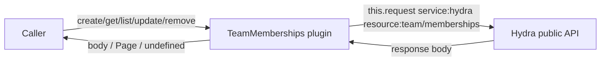
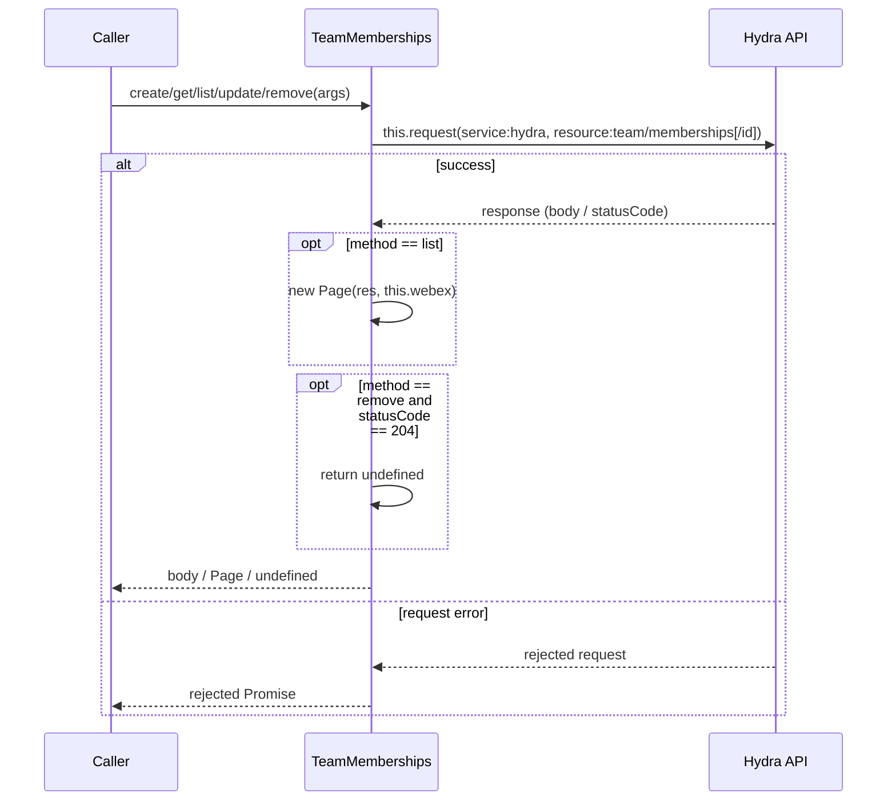
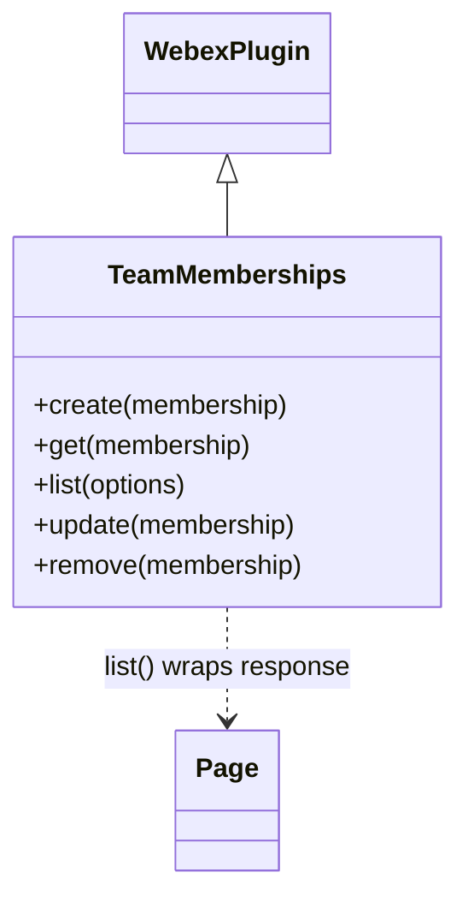

<!-- sdd-generated-metadata
generator: claude-cli
generator_model: us.anthropic.claude-opus-4-8
approved_by: pending-human-review
updated_at: 2026-08-06T00:00:00Z
validation_status: not-run
run_id: 51855eac-8de5-43a2-a3b6-dbcc55ebc91b
-->

# @webex/plugin-team-memberships — SPEC

> Start here → root [`AGENTS.md`](../../../../AGENTS.md) (agent entry) · router [`SPEC_INDEX.md`](../../../../ai-docs/SPEC_INDEX.md) · system [`ARCHITECTURE.md`](../../../../ai-docs/ARCHITECTURE.md). This is the module's canonical spec: orientation, requirements, design, flows, and tests.
> Context-efficiency: link to canonical docs — don't duplicate them. Load specs on demand per `SPEC_INDEX.md`.

## Metadata

| Field | Value |
|---|---|
| Module id | `plugin-team-memberships` |
| Source path(s) | `packages/@webex/plugin-team-memberships/src/` |
| Parent spec | `—` (registered public Webex plugin; composed by `webex-core`, no parent module) |
| Doc kind | Module spec |
| Coverage score | Pending coverage assessment |
| Generated from | `module-spec` @ SDLC template library `0.2.2` |
| generated_by / approved_by / updated_at | claude-cli / pending-human-review / 2026-08-06 |
| Validation status | not-run, validator `pending`, assessed 2026-08-06 |

Coverage score is `Pending coverage assessment` until the first coverage review runs. Manifest coverage
state is authoritative and kept in `.sdd/manifest.json`.

## Evidence Rules
Every requirement cites concrete source evidence using `file path`. Test evidence is preferred for WHY.
Requirements are grounded in the current implementation under `src/` and its integration tests.

## Source Material Register

| Source material | Scope | Decision | Detail location or disposition |
|---|---|---|---|
| Module source (`src/team-memberships.js`, `src/index.js`) | overview / API | used | Public surface, requirements, data flow, and sequence diagrams derived directly from source. |
| Inline JSDoc + examples | API / tests | reference-only | Method signatures and `TeamMembershipObject` shape documented in Public Surface and Data Model. |

## Overview

`@webex/plugin-team-memberships` is a public Webex SDK plugin (registered as `teamMemberships` via
`registerPlugin`) that manages a person's relationship to a **team** through the **Hydra** public API. Use
it to list members of a team you belong to, invite someone to a team, promote/demote a moderator, or
remove a member. As in the Webex app, you must be a member of a team to list its memberships or invite
people.

The plugin extends `WebexPlugin` and exposes five methods (`create`, `get`, `list`, `remove`, `update`)
that each map to a single Hydra `team/memberships` REST call via `this.request`. It owns no state,
persistence, or encryption. A maintainer should start at `src/team-memberships.js`.

## Purpose / Responsibility

Owns the client-side CRUD surface for Webex team-membership resources (`service: hydra`,
`resource: team/memberships`), including moderator promotion via the `isModerator` field. It does NOT own
teams themselves (see `@webex/plugin-teams`) or room-level memberships (see `@webex/plugin-memberships`).

## Stack

JavaScript (ES modules, `src/team-memberships.js`), built with `webex-legacy-tools`. Tests run under Mocha
with `@webex/test-helper-chai`, `@webex/test-helper-test-users`, and `sinon`. Runtime dependencies:
`@webex/webex-core` (base `WebexPlugin`, `Page`, `this.request`) and `@webex/internal-plugin-device`; peer
plugins `@webex/plugin-logger`, `@webex/plugin-rooms`, `@webex/plugin-teams`.

## Folder / Package Structure

```
packages/@webex/plugin-team-memberships/src/
├── index.js             # registerPlugin('teamMemberships', TeamMemberships); default export
└── team-memberships.js  # TeamMemberships WebexPlugin.extend: create/get/list/remove/update
```

## Key Files (source of truth)

| File | Holds |
|---|---|
| `packages/@webex/plugin-team-memberships/src/team-memberships.js` | All five public methods and the `TeamMembershipObject` typedef |
| `packages/@webex/plugin-team-memberships/src/index.js` | Plugin registration name (`teamMemberships`) |

## Public Surface

Consumed as a public SDK plugin via `webex.teamMemberships`. Each method calls the remote Hydra service.

| Contract ID | Type | Surface | Purpose | Compatibility / deprecation | Schema / detail link | Root index |
|---|---|---|---|---|---|---|
| `teamMemberships.create` | SDK | `create(membership): Promise<TeamMembershipObject>` | POST `hydra/team/memberships` to add a person to a team | Stable plugin method | `packages/@webex/plugin-team-memberships/src/team-memberships.js` | `../../../../ai-docs/CONTRACTS.md` |
| `teamMemberships.get` | SDK | `get(membership\|id): Promise<TeamMembershipObject>` | GET `hydra/team/memberships/{id}`; returns `body.items` or `body` | Stable plugin method | `packages/@webex/plugin-team-memberships/src/team-memberships.js` | `../../../../ai-docs/CONTRACTS.md` |
| `teamMemberships.list` | SDK | `list(options): Promise<Page<TeamMembershipObject>>` | GET `hydra/team/memberships` with `qs`; returns a `Page` | Stable; scope by `options.teamId` / `options.max` | `packages/@webex/plugin-team-memberships/src/team-memberships.js` | `../../../../ai-docs/CONTRACTS.md` |
| `teamMemberships.update` | SDK | `update(membership): Promise<TeamMembershipObject>` | PUT `hydra/team/memberships/{id}` with the membership body | Stable plugin method | `packages/@webex/plugin-team-memberships/src/team-memberships.js` | `../../../../ai-docs/CONTRACTS.md` |
| `teamMemberships.remove` | SDK | `remove(membership\|id): Promise<undefined\|body>` | DELETE `hydra/team/memberships/{id}`; `undefined` on 204 | Stable plugin method | `packages/@webex/plugin-team-memberships/src/team-memberships.js` | `../../../../ai-docs/CONTRACTS.md` |

Compatibility notes:
- Public method names/signatures and the `TeamMembershipObject` shape (`id`, `teamId`, `personId`,
  `personEmail`, `isModerator`, `created`) are the semver-controlled contract.
- `get`, `update`, and `remove` accept either a full membership object or a bare id string
  (`membership.id || membership`).

## Requires (dependencies)

- `@webex/webex-core` — base `WebexPlugin`, `registerPlugin`, `Page`, and `this.request` (resolves
  `service: hydra` and attaches auth).
- `@webex/internal-plugin-device` — device registration required before requests resolve.
- Peer: `@webex/plugin-logger`, `@webex/plugin-rooms`, `@webex/plugin-teams` (a team must exist before
  memberships can be created).
- External service: **Hydra** public API (`service: hydra`, `resource: team/memberships`).

## Requirements

| ID | WHAT | WHY | Source Evidence | Test / Example Evidence | Assumptions / Gaps | Confidence |
|---|---|---|---|---|---|---|
| `TEAM-MEMBERSHIPS-R-001` | `create(membership)` POSTs `service: hydra`, `resource: team/memberships` with the membership body (by `personId` or `personEmail`, optional `isModerator`) and resolves the response body. | Applications must invite people to a team, optionally as moderators. | `packages/@webex/plugin-team-memberships/src/team-memberships.js` | `packages/@webex/plugin-team-memberships/test/integration/spec/team-memberships.js` | none identified | PRESENT |
| `TEAM-MEMBERSHIPS-R-002` | `get(membership)` derives id via `membership.id \|\| membership`, GETs `hydra/team/memberships/{id}`, and returns `body.items` when present else `body`. | Callers retrieve a single membership by object or id. | `packages/@webex/plugin-team-memberships/src/team-memberships.js` | `packages/@webex/plugin-team-memberships/test/integration/spec/team-memberships.js` | none identified | PRESENT |
| `TEAM-MEMBERSHIPS-R-003` | `list(options)` GETs `hydra/team/memberships` passing `options` (e.g. `teamId`, `max`) as `qs` and returns a `Page(res, this.webex)`. | Callers enumerate the members of a team they belong to. | `packages/@webex/plugin-team-memberships/src/team-memberships.js` | `packages/@webex/plugin-team-memberships/test/integration/spec/team-memberships.js` | none identified | PRESENT |
| `TEAM-MEMBERSHIPS-R-004` | `update(membership)` derives id via `membership.id \|\| membership`, PUTs `hydra/team/memberships/{id}` with the membership body, and resolves the response body. | Callers promote/demote a moderator or otherwise change a membership. | `packages/@webex/plugin-team-memberships/src/team-memberships.js` | `packages/@webex/plugin-team-memberships/test/integration/spec/team-memberships.js` | none identified | PRESENT |
| `TEAM-MEMBERSHIPS-R-005` | `remove(membership)` DELETEs `hydra/team/memberships/{id}` and resolves `undefined` on HTTP 204, otherwise `res.body`. | 204 responses (notably in Firefox) must not surface a bogus body to callers. | `packages/@webex/plugin-team-memberships/src/team-memberships.js` | `packages/@webex/plugin-team-memberships/test/integration/spec/team-memberships.js` | Source comment notes 204/DELETE handling should move to http-core | PRESENT |

## Design Overview

`TeamMemberships` is a `WebexPlugin.extend({...})` object with one method per REST operation. There is no
local model, cache, or event wiring: each method is a direct pass-through to `this.request` with the Hydra
`service`/`resource` pair, returning the response body. `list` wraps the response in `Page` for
pagination; `get`/`update`/`remove` normalize their argument (object or id). Like `plugin-webhooks`,
`remove` special-cases HTTP 204 to return `undefined` (Firefox 204/DELETE workaround per the inline
comment).

## Data Flow



## Sequence Diagram(s)

This is a single CRUD operation group: every method shares the same actors
(Caller → TeamMemberships → Hydra), transport (`this.request`), and failure surface (rejected request
Promise). `list` differs only in wrapping the result in a `Page`, and `remove` differs only in its 204
handling; both are shown as `opt`/`alt` branches below rather than as separate diagrams.

Sequence coverage:

| Operation group | Diagram | Failure / recovery coverage |
|---|---|---|
| Team-membership CRUD | 1. Membership request | `alt` covers request rejection propagated to caller; `opt` covers `list` Page wrap and `remove` 204→undefined |

### 1. Membership request



## Class / Component Relationships



`TeamMemberships` extends `WebexPlugin`; `list` composes `Page` from `@webex/webex-core` for pagination.

## Use Cases

- **UC-1 Invite a person to a team:** create a team, then `webex.teamMemberships.create({personEmail, teamId})`. Evidence: `packages/@webex/plugin-team-memberships/src/team-memberships.js`, `packages/@webex/plugin-team-memberships/test/integration/spec/team-memberships.js`.
- **UC-2 List a team's members:** `webex.teamMemberships.list({teamId})`. Evidence: `packages/@webex/plugin-team-memberships/test/integration/spec/team-memberships.js`.
- **UC-3 Promote a moderator:** `update` a membership with `isModerator: true`. Evidence: `packages/@webex/plugin-team-memberships/src/team-memberships.js`.
- **UC-4 Remove a member:** `webex.teamMemberships.remove(membership)` returns `undefined` on 204. Evidence: `packages/@webex/plugin-team-memberships/src/team-memberships.js`.

## Error Handling & Failure Modes

| Condition | Signal (error/code/result) | Caller recovery |
|---|---|---|
| Hydra request fails (4xx/5xx) | rejected request Promise from `this.request` | Inspect the underlying `WebexHttpError`; retry or surface to user |
| `remove`/`get` on an unknown membership | rejected Promise (e.g. `WebexHttpError.NotFound`) | Treat as already-removed / verify id |
| DELETE returns 204 | resolves `undefined` (not a body) | Do not read fields off the result |

## Pitfalls

- `remove` resolves `undefined` on HTTP 204 — callers must not assume a body object is always returned.
- `get` returns `body.items` when present (list-shaped responses) and otherwise `body`; callers should
  handle both shapes.
- Creation requires an existing team (`teamId`) and team membership of the caller; inviting someone else
  requires that you are a member.

## Test-Case Strategy (module)

Behavior is exercised by the integration suite (`test/integration/spec/team-memberships.js`, Mocha + chai
+ `test-helper-test-users` + sinon) against live test users: create/get/list (scoped by `teamId`)/update
(moderator changes)/remove, asserting membership shape, list counts before/after removal, and paging. The
suite loads `@webex/plugin-teams` to create the parent team.

| Behavior / Requirement | Existing test evidence | Gap |
|---|---|---|
| `TEAM-MEMBERSHIPS-R-001` | `packages/@webex/plugin-team-memberships/test/integration/spec/team-memberships.js` | No unit test (integration only) |
| `TEAM-MEMBERSHIPS-R-002` | `packages/@webex/plugin-team-memberships/test/integration/spec/team-memberships.js` | Add coverage for `body.items` vs `body` branch |
| `TEAM-MEMBERSHIPS-R-003` | `packages/@webex/plugin-team-memberships/test/integration/spec/team-memberships.js` | none material |
| `TEAM-MEMBERSHIPS-R-004` | `packages/@webex/plugin-team-memberships/test/integration/spec/team-memberships.js` | Add explicit moderator-toggle assertion |
| `TEAM-MEMBERSHIPS-R-005` | `packages/@webex/plugin-team-memberships/test/integration/spec/team-memberships.js` | Add explicit 204→undefined unit test |

## Traceability

- Repo architecture: [`ARCHITECTURE.md`](../../../../ai-docs/ARCHITECTURE.md) · Registry: [`SPEC_INDEX.md`](../../../../ai-docs/SPEC_INDEX.md)
- Coverage state & contracts baseline: `.sdd/manifest.json`
