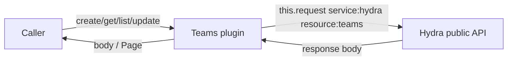
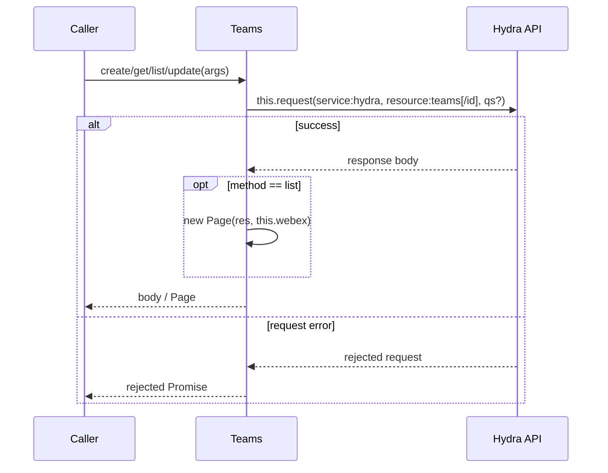
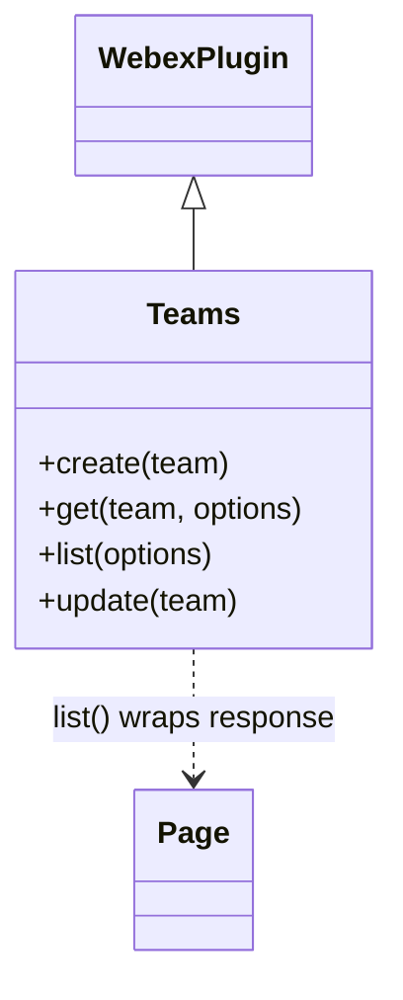

<!-- sdd-generated-metadata
generator: claude-cli
generator_model: us.anthropic.claude-opus-4-8
approved_by: pending-human-review
updated_at: 2026-08-06T00:00:00Z
validation_status: not-run
run_id: 51855eac-8de5-43a2-a3b6-dbcc55ebc91b
-->

# @webex/plugin-teams — SPEC

> Start here → root [`AGENTS.md`](../../../../AGENTS.md) (agent entry) · router [`SPEC_INDEX.md`](../../../../ai-docs/SPEC_INDEX.md) · system [`ARCHITECTURE.md`](../../../../ai-docs/ARCHITECTURE.md). This is the module's canonical spec: orientation, requirements, design, flows, and tests.
> Context-efficiency: link to canonical docs — don't duplicate them. Load specs on demand per `SPEC_INDEX.md`.

## Metadata

| Field | Value |
|---|---|
| Module id | `plugin-teams` |
| Source path(s) | `packages/@webex/plugin-teams/src/` |
| Parent spec | `—` (registered public Webex plugin; composed by `webex-core`, no parent module) |
| Doc kind | Module spec |
| Coverage score | Pending coverage assessment |
| Generated from | `module-spec` @ SDLC template library `0.2.2` |
| generated_by / approved_by / updated_at | claude-cli / pending-human-review / 2026-08-06 |
| Validation status | not-run, validator `pending`, assessed 2026-08-06 |

Coverage score is `Pending coverage assessment` until the first coverage review runs. Manifest coverage
state is authoritative and kept in `.sdd/manifest.json`.

## Evidence Rules
Every requirement cites concrete source evidence using `file path`. Test evidence is preferred for WHY.
Requirements are grounded in the current implementation under `src/` and its integration tests.

## Source Material Register

| Source material | Scope | Decision | Detail location or disposition |
|---|---|---|---|
| Module source (`src/teams.js`, `src/index.js`) | overview / API | used | Public surface, requirements, data flow, and sequence diagrams derived directly from source. |
| Inline JSDoc + examples | API / tests | reference-only | Method signatures and `TeamObject` shape documented in Public Surface and Data Model. |

## Overview

`@webex/plugin-teams` is a public Webex SDK plugin (registered as `teams` via `registerPlugin`) that
provides create/read/list/update access to Webex **teams** through the **Hydra** public API. A team is a
grouping of people and rooms; a moderated team room (the "General" room) anchors the team.

The plugin extends `WebexPlugin` and exposes four methods (`create`, `get`, `list`, `update`) that each
map to a single Hydra `teams` REST call via `this.request`. It owns no state, persistence, or encryption:
every method issues one request and returns the response body (or a `Page` for `list`). A maintainer
should start at `src/teams.js`.

## Purpose / Responsibility

Owns the client-side create/read/list/update surface for Webex team resources (`service: hydra`,
`resource: teams`). It does NOT own team memberships (see `@webex/plugin-team-memberships`), team rooms
(see `@webex/plugin-rooms`), or team deletion.

## Stack

JavaScript (ES modules, `src/teams.js`), built with `webex-legacy-tools`. Tests run under Mocha with
`@webex/test-helper-chai`, `@webex/test-helper-test-users`, `sinon`, and `lodash`. Runtime dependencies:
`@webex/webex-core` (base `WebexPlugin`, `Page`, `this.request`), `@webex/internal-plugin-device`, and
`lodash`; peer plugins `@webex/plugin-logger`, `@webex/plugin-memberships`, `@webex/plugin-rooms`.

## Folder / Package Structure

```
packages/@webex/plugin-teams/src/
├── index.js    # registerPlugin('teams', Teams); default export
└── teams.js    # Teams WebexPlugin.extend: create/get/list/update
```

## Key Files (source of truth)

| File | Holds |
|---|---|
| `packages/@webex/plugin-teams/src/teams.js` | All four public methods and the `TeamObject` typedef |
| `packages/@webex/plugin-teams/src/index.js` | Plugin registration name (`teams`) |

## Public Surface

Consumed as a public SDK plugin via `webex.teams`. Each method calls the remote Hydra service.

| Contract ID | Type | Surface | Purpose | Compatibility / deprecation | Schema / detail link | Root index |
|---|---|---|---|---|---|---|
| `teams.create` | SDK | `create(team): Promise<TeamObject>` | POST `hydra/teams` to create a team | Stable plugin method | `packages/@webex/plugin-teams/src/teams.js` | `../../../../ai-docs/CONTRACTS.md` |
| `teams.get` | SDK | `get(team\|id, options): Promise<TeamObject>` | GET `hydra/teams/{id}` with `qs`; returns `body.items` or `body` | Stable plugin method | `packages/@webex/plugin-teams/src/teams.js` | `../../../../ai-docs/CONTRACTS.md` |
| `teams.list` | SDK | `list(options): Promise<Page<TeamObject>>` | GET `hydra/teams/` with `qs`; returns a `Page` | Stable; `options.max` bounds page size | `packages/@webex/plugin-teams/src/teams.js` | `../../../../ai-docs/CONTRACTS.md` |
| `teams.update` | SDK | `update(team): Promise<TeamObject>` | PUT `hydra/teams/{id}` with the team body | Stable plugin method | `packages/@webex/plugin-teams/src/teams.js` | `../../../../ai-docs/CONTRACTS.md` |

Compatibility notes:
- Public method names/signatures and the `TeamObject` shape (`id`, `name`, `created`) are the
  semver-controlled contract.
- `get` accepts either a team object or a bare id string (`team.id || team`) and forwards `options` as
  the query string. There is no `remove` method on this plugin.

## Requires (dependencies)

- `@webex/webex-core` — base `WebexPlugin`, `registerPlugin`, `Page`, and `this.request` (resolves
  `service: hydra` and attaches auth).
- `@webex/internal-plugin-device` — device registration required before requests resolve.
- `lodash` — declared dependency (used in tests for enumeration helpers).
- Peer: `@webex/plugin-logger`, `@webex/plugin-memberships`, `@webex/plugin-rooms`.
- External service: **Hydra** public API (`service: hydra`, `resource: teams`).

## Requirements

| ID | WHAT | WHY | Source Evidence | Test / Example Evidence | Assumptions / Gaps | Confidence |
|---|---|---|---|---|---|---|
| `TEAMS-R-001` | `create(team)` POSTs `service: hydra`, `resource: teams` with the team as the body and resolves the response body. | Applications must create teams to group people and rooms. | `packages/@webex/plugin-teams/src/teams.js` | `packages/@webex/plugin-teams/test/integration/spec/teams.js` | none identified | PRESENT |
| `TEAMS-R-002` | `get(team, options)` derives id via `team.id \|\| team`, GETs `hydra/teams/{id}` with `options` as `qs`, and returns `body.items` when present else `body`. | Callers retrieve a single team by object or id, optionally with query options. | `packages/@webex/plugin-teams/src/teams.js` | `packages/@webex/plugin-teams/test/integration/spec/teams.js` | none identified | PRESENT |
| `TEAMS-R-003` | `list(options)` GETs `hydra/teams/` passing `options` as `qs` and returns a `Page(res, this.webex)` for pagination. | Callers enumerate their teams with bounded, pageable results. | `packages/@webex/plugin-teams/src/teams.js` | `packages/@webex/plugin-teams/test/integration/spec/teams.js` | none identified | PRESENT |
| `TEAMS-R-004` | `update(team)` PUTs `hydra/teams/{id}` (id from `team.id`) with the team body and resolves the response body. | Callers rename an existing team. | `packages/@webex/plugin-teams/src/teams.js` | `packages/@webex/plugin-teams/test/integration/spec/teams.js` | none identified | PRESENT |

## Design Overview

`Teams` is a `WebexPlugin.extend({...})` object with one method per REST operation. There is no local
model, cache, or event wiring: each method is a direct pass-through to `this.request` with the Hydra
`service`/`resource` pair, returning the response body. `list` wraps the response in `Page` for
pagination; `get` normalizes its argument (object or id) and forwards `options` as the query string.
Unlike `plugin-webhooks` and `plugin-team-memberships`, this plugin intentionally exposes no `remove`.

## Data Flow



## Sequence Diagram(s)

This is a single CRUD operation group: every method shares the same actors (Caller → Teams → Hydra),
transport (`this.request`), and failure surface (rejected request Promise). `list` differs only in
wrapping the response in `Page`; that variation is shown as an `opt` branch rather than a separate
diagram.

Sequence coverage:

| Operation group | Diagram | Failure / recovery coverage |
|---|---|---|
| Team CRUD | 1. Team request | `alt` covers request rejection propagated to caller; `opt` covers `list` Page wrap |

### 1. Team request



## Class / Component Relationships



`Teams` extends `WebexPlugin`; `list` composes `Page` from `@webex/webex-core` for pagination.

## Use Cases

- **UC-1 Create a team:** `webex.teams.create({name})`, asserting `id`, `name`, and `created`. Evidence: `packages/@webex/plugin-teams/src/teams.js`, `packages/@webex/plugin-teams/test/integration/spec/teams.js`.
- **UC-2 Get a team:** `webex.teams.get({id})` returns the matching team. Evidence: `packages/@webex/plugin-teams/test/integration/spec/teams.js`.
- **UC-3 List and page teams:** `webex.teams.list({max:1})` then iterate `page.next()`. Evidence: `packages/@webex/plugin-teams/test/integration/spec/teams.js`.
- **UC-4 Rename a team:** `webex.teams.update({...team, name})`. Evidence: `packages/@webex/plugin-teams/test/integration/spec/teams.js`.

## Error Handling & Failure Modes

| Condition | Signal (error/code/result) | Caller recovery |
|---|---|---|
| Hydra request fails (4xx/5xx) | rejected request Promise from `this.request` | Inspect the underlying `WebexHttpError`; retry or surface to user |
| `get`/`update` with an unknown id | rejected Promise (e.g. `WebexHttpError.NotFound`) | Verify the team id |

## Pitfalls

- `get` returns `body.items` when present (list-shaped responses) and otherwise `body`; callers should
  handle both shapes.
- `update` reads the id only from `team.id`, so it requires a full team object (not a bare id string).
- There is no `remove` method — team deletion is not part of this plugin's surface.

## Test-Case Strategy (module)

Behavior is exercised by the integration suite (`test/integration/spec/teams.js`, Mocha + chai +
`test-helper-test-users` + sinon) against a live test user: create/get/list (including bounded paging with
`spy` assertions on ids)/update, using `assert.isTeam`, deep-equality on get, and pagination via
`page.next()`. The suite also covers team-scoped room behavior via `@webex/plugin-rooms`; some room cases
are `it.skip`/`describe.skip` (COLLAB-1104, SPARK-413317).

| Behavior / Requirement | Existing test evidence | Gap |
|---|---|---|
| `TEAMS-R-001` | `packages/@webex/plugin-teams/test/integration/spec/teams.js` | No unit test (integration only) |
| `TEAMS-R-002` | `packages/@webex/plugin-teams/test/integration/spec/teams.js` | Add coverage for `body.items` vs `body` branch |
| `TEAMS-R-003` | `packages/@webex/plugin-teams/test/integration/spec/teams.js` | none material |
| `TEAMS-R-004` | `packages/@webex/plugin-teams/test/integration/spec/teams.js` | none material |

## Traceability

- Repo architecture: [`ARCHITECTURE.md`](../../../../ai-docs/ARCHITECTURE.md) · Registry: [`SPEC_INDEX.md`](../../../../ai-docs/SPEC_INDEX.md)
- Coverage state & contracts baseline: `.sdd/manifest.json`
