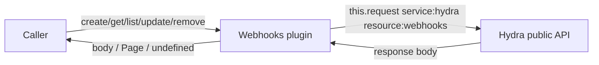
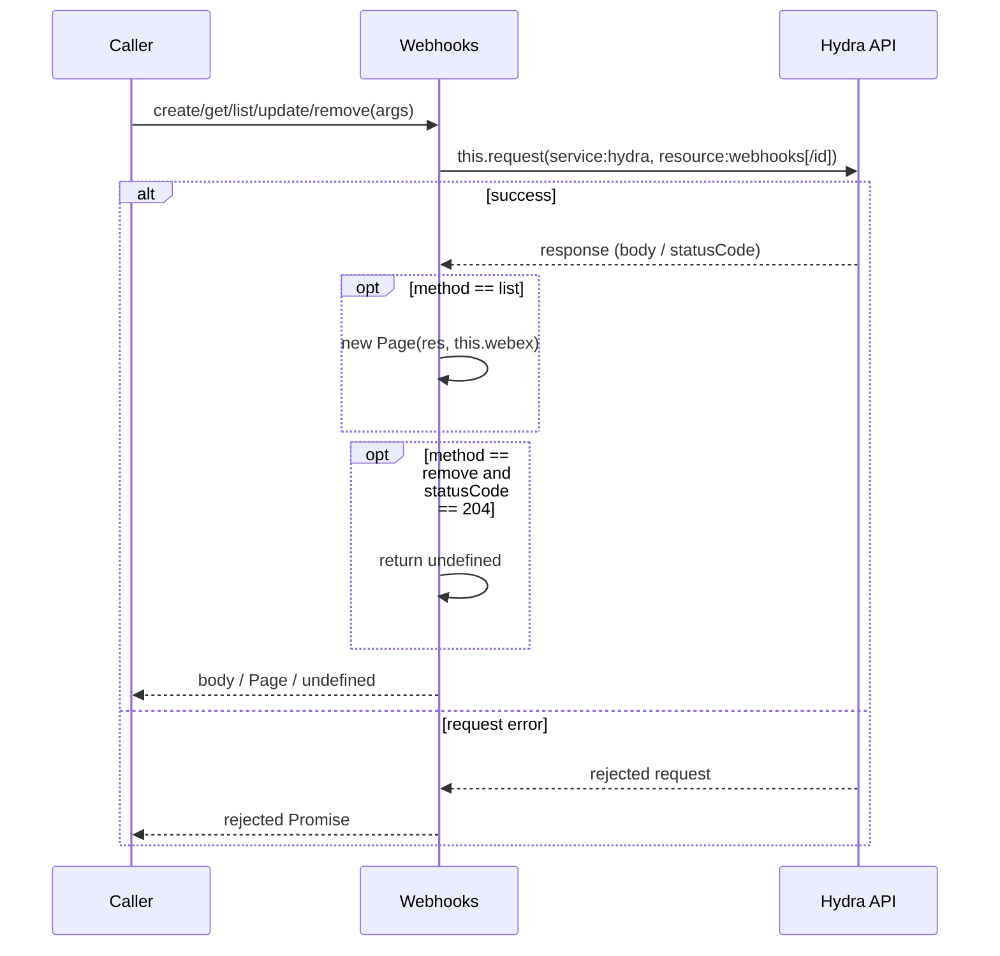
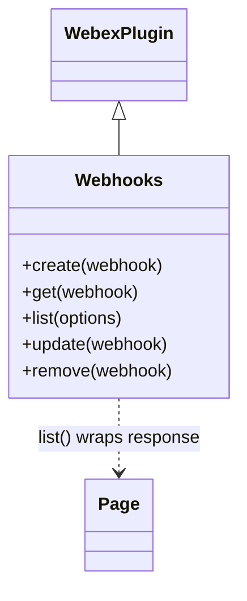

<!-- sdd-generated-metadata
generator: claude-cli
generator_model: us.anthropic.claude-opus-4-8
approved_by: pending-human-review
updated_at: 2026-08-06T00:00:00Z
validation_status: not-run
run_id: 51855eac-8de5-43a2-a3b6-dbcc55ebc91b
-->

# @webex/plugin-webhooks — SPEC

> Start here → root [`AGENTS.md`](../../../../AGENTS.md) (agent entry) · router [`SPEC_INDEX.md`](../../../../ai-docs/SPEC_INDEX.md) · system [`ARCHITECTURE.md`](../../../../ai-docs/ARCHITECTURE.md). This is the module's canonical spec: orientation, requirements, design, flows, and tests.
> Context-efficiency: link to canonical docs — don't duplicate them. Load specs on demand per `SPEC_INDEX.md`.

## Metadata

| Field | Value |
|---|---|
| Module id | `plugin-webhooks` |
| Source path(s) | `packages/@webex/plugin-webhooks/src/` |
| Parent spec | `—` (registered public Webex plugin; composed by `webex-core`, no parent module) |
| Doc kind | Module spec |
| Coverage score | Pending coverage assessment |
| Generated from | `module-spec` @ SDLC template library `0.2.2` |
| generated_by / approved_by / updated_at | claude-cli / pending-human-review / 2026-08-06 |
| Validation status | not-run, validator `pending`, assessed 2026-08-06 |

Coverage score is `Pending coverage assessment` until the first coverage review runs. Manifest coverage
state is authoritative and kept in `.sdd/manifest.json`.

## Evidence Rules
Every requirement cites concrete source evidence using `file path`. Test evidence is preferred for WHY.
Requirements are grounded in the current implementation under `src/` and its integration tests.

## Source Material Register

| Source material | Scope | Decision | Detail location or disposition |
|---|---|---|---|
| Module source (`src/webhooks.js`, `src/index.js`) | overview / API | used | Public surface, requirements, data flow, and sequence diagrams derived directly from source. |
| Inline JSDoc + examples | API / tests | reference-only | Method signatures and `WebhookObject` shape documented in Public Surface and Data Model. |

## Overview

`@webex/plugin-webhooks` is a thin public Webex SDK plugin (registered as `webhooks` via
`registerPlugin`) that provides CRUD access to Webex webhooks through the **Hydra** public API. Webhooks
let an application be notified over HTTP when a specific event occurs on Webex — for example, a new
message posted in a room.

The plugin extends `WebexPlugin` and exposes five methods (`create`, `get`, `list`, `remove`, `update`)
that each map to a single Hydra `webhooks` REST call via `this.request`. It owns no state, no encryption,
and no persistence: every method issues one request and returns the response body (or a `Page` for
`list`). A maintainer should start at `src/webhooks.js`.

## Purpose / Responsibility

Owns the client-side CRUD surface for Webex webhook resources (`service: hydra`, `resource: webhooks`).
It does NOT own webhook event delivery, event payload validation, or the target-URL receiver — those are
the responsibility of the caller's HTTP endpoint and the Webex platform.

## Stack

JavaScript (ES modules, `src/webhooks.js`), built with `webex-legacy-tools`. Tests run under Mocha with
`@webex/test-helper-chai`, `@webex/test-helper-test-users`, and `sinon`. Runtime dependencies:
`@webex/webex-core` (base `WebexPlugin`, `Page`, `this.request`) and `@webex/internal-plugin-device`;
peer plugins `@webex/plugin-logger` and `@webex/plugin-rooms`.

## Folder / Package Structure

```
packages/@webex/plugin-webhooks/src/
├── index.js       # registerPlugin('webhooks', Webhooks); default export
└── webhooks.js    # Webhooks WebexPlugin.extend: create/get/list/remove/update
```

## Key Files (source of truth)

| File | Holds |
|---|---|
| `packages/@webex/plugin-webhooks/src/webhooks.js` | All five public methods and the `WebhookObject` typedef |
| `packages/@webex/plugin-webhooks/src/index.js` | Plugin registration name (`webhooks`) |

## Public Surface

Consumed as a public SDK plugin via `webex.webhooks`. Each method calls the remote Hydra service.

| Contract ID | Type | Surface | Purpose | Compatibility / deprecation | Schema / detail link | Root index |
|---|---|---|---|---|---|---|
| `webhooks.create` | SDK | `create(webhook): Promise<Webhook>` | POST `hydra/webhooks` to create a webhook | Stable plugin method | `packages/@webex/plugin-webhooks/src/webhooks.js` | `../../../../ai-docs/CONTRACTS.md` |
| `webhooks.get` | SDK | `get(webhook\|id): Promise<Webhook>` | GET `hydra/webhooks/{id}`; returns `body.items` or `body` | Stable plugin method | `packages/@webex/plugin-webhooks/src/webhooks.js` | `../../../../ai-docs/CONTRACTS.md` |
| `webhooks.list` | SDK | `list(options): Promise<Page<Webhook>>` | GET `hydra/webhooks/` with `qs`; returns a `Page` | Stable; `options.max` bounds page size | `packages/@webex/plugin-webhooks/src/webhooks.js` | `../../../../ai-docs/CONTRACTS.md` |
| `webhooks.update` | SDK | `update(webhook): Promise<Webhook>` | PUT `hydra/webhooks/{id}` with the webhook body | Stable plugin method | `packages/@webex/plugin-webhooks/src/webhooks.js` | `../../../../ai-docs/CONTRACTS.md` |
| `webhooks.remove` | SDK | `remove(webhook\|id): Promise<undefined\|body>` | DELETE `hydra/webhooks/{id}`; `undefined` on 204 | Stable plugin method | `packages/@webex/plugin-webhooks/src/webhooks.js` | `../../../../ai-docs/CONTRACTS.md` |

Compatibility notes:
- Public method names/signatures and the `WebhookObject` shape (`id`, `resource`, `event`, `filter`,
  `targetUrl`, `name`, `created`) are the semver-controlled contract.
- `get`, `remove`, and `update` accept either a full webhook object or a bare id string
  (`webhook.id || webhook`).

## Requires (dependencies)

- `@webex/webex-core` — base `WebexPlugin`, `registerPlugin`, `Page`, and `this.request` (which resolves
  `service: hydra` from the catalog and attaches auth).
- `@webex/internal-plugin-device` — device registration required before requests resolve.
- Peer: `@webex/plugin-logger` (logging), `@webex/plugin-rooms` (used to scope webhooks to a room in
  typical flows and examples).
- External service: **Hydra** public API (`service: hydra`, `resource: webhooks`).

## Requirements

| ID | WHAT | WHY | Source Evidence | Test / Example Evidence | Assumptions / Gaps | Confidence |
|---|---|---|---|---|---|---|
| `WEBHOOKS-R-001` | `create(webhook)` POSTs `service: hydra`, `resource: webhooks` with the webhook as the body and resolves the response body. | Applications must register webhooks to receive event notifications. | `packages/@webex/plugin-webhooks/src/webhooks.js` | `packages/@webex/plugin-webhooks/test/integration/spec/webhooks.js` | Integration suite is `describe.skip` (SPARK-413317) | PRESENT |
| `WEBHOOKS-R-002` | `get(webhook)` derives id via `webhook.id \|\| webhook`, GETs `hydra/webhooks/{id}`, and returns `body.items` when present else `body`. | Callers retrieve a single webhook by object or id. | `packages/@webex/plugin-webhooks/src/webhooks.js` | `packages/@webex/plugin-webhooks/test/integration/spec/webhooks.js` | none identified | PRESENT |
| `WEBHOOKS-R-003` | `list(options)` GETs `hydra/webhooks/` passing `options` as `qs` and returns a `Page(res, this.webex)` for pagination. | Callers enumerate their webhooks with bounded, pageable results. | `packages/@webex/plugin-webhooks/src/webhooks.js` | `packages/@webex/plugin-webhooks/test/integration/spec/webhooks.js` | none identified | PRESENT |
| `WEBHOOKS-R-004` | `update(webhook)` PUTs `hydra/webhooks/{id}` (id from `webhook.id`) with the webhook body and resolves the response body. | Callers change a webhook's `targetUrl`, `name`, or other mutable fields. | `packages/@webex/plugin-webhooks/src/webhooks.js` | `packages/@webex/plugin-webhooks/test/integration/spec/webhooks.js` | none identified | PRESENT |
| `WEBHOOKS-R-005` | `remove(webhook)` DELETEs `hydra/webhooks/{id}` and resolves `undefined` on HTTP 204, otherwise `res.body`. | 204 responses (notably in Firefox) must not surface a bogus body to callers. | `packages/@webex/plugin-webhooks/src/webhooks.js` | `packages/@webex/plugin-webhooks/test/integration/spec/webhooks.js` | Source comment notes 204/DELETE handling should move to http-core | PRESENT |

## Design Overview

`Webhooks` is a `WebexPlugin.extend({...})` object with one method per REST operation. There is no local
model, cache, or event wiring: each method is a direct pass-through to `this.request` with the Hydra
`service`/`resource` pair and returns the response body. `list` wraps the response in `Page` so callers
can iterate additional pages via `page.next()`. `get`/`remove`/`update` normalize their argument so a
caller may pass either a webhook object or a bare id.

The only non-trivial branch is in `remove`, which special-cases HTTP 204 to return `undefined` (working
around Firefox 204/DELETE behavior, per the inline source comment) instead of an empty body.

## Data Flow



## Sequence Diagram(s)

This is effectively a single CRUD operation group: every method shares the same actor set
(Caller → Webhooks → Hydra), transport (`this.request`), and failure surface (rejected request
Promise). `list` differs only in wrapping the result in a `Page`, and `remove` differs only in its 204
handling; both are shown as `opt`/`alt` branches below rather than as separate diagrams.

Sequence coverage:

| Operation group | Diagram | Failure / recovery coverage |
|---|---|---|
| Webhook CRUD | 1. Webhook request | `alt` covers request rejection propagated to caller; `opt` covers `list` Page wrap and `remove` 204→undefined |

### 1. Webhook request



## Class / Component Relationships



`Webhooks` extends `WebexPlugin`; `list` composes `Page` from `@webex/webex-core` for pagination.

## Use Cases

- **UC-1 Register a message webhook:** create a room, then `webex.webhooks.create({resource:'messages', event:'created', filter:'roomId=...', targetUrl, name})`. Evidence: `packages/@webex/plugin-webhooks/src/webhooks.js`, `packages/@webex/plugin-webhooks/test/integration/spec/webhooks.js`.
- **UC-2 List and page webhooks:** `webex.webhooks.list({max:1})` then iterate `page.next()`. Evidence: `packages/@webex/plugin-webhooks/test/integration/spec/webhooks.js`.
- **UC-3 Re-target a webhook:** mutate `webhook.targetUrl` and call `webex.webhooks.update(webhook)`. Evidence: `packages/@webex/plugin-webhooks/src/webhooks.js`.
- **UC-4 Remove a webhook:** `webex.webhooks.remove(webhook)` returns `undefined` on 204. Evidence: `packages/@webex/plugin-webhooks/src/webhooks.js`.

## Error Handling & Failure Modes

| Condition | Signal (error/code/result) | Caller recovery |
|---|---|---|
| Hydra request fails (4xx/5xx) | rejected request Promise from `this.request` | Inspect the underlying `WebexHttpError`; retry or surface to user |
| `remove` on a deleted/unknown webhook | rejected Promise (e.g. `WebexHttpError.NotFound`) | Treat as already-removed / verify id |
| DELETE returns 204 | resolves `undefined` (not a body) | Do not read fields off the result |

## Pitfalls

- `remove` resolves `undefined` on HTTP 204 — callers must not assume a body object is always returned.
- `get` returns `body.items` when present (list-shaped responses) and otherwise `body`; callers should
  handle both shapes.
- `update` reads the id only from `webhook.id` (not a bare string), so it requires a full webhook object.
- The integration suite is currently `describe.skip` (SPARK-413317); do not assume live coverage from CI.

## Test-Case Strategy (module)

Behavior is exercised by the integration suite (`test/integration/spec/webhooks.js`, Mocha + chai +
`test-helper-test-users` + sinon) against a live test user: create/get/list (including bounded paging)/
update/remove, asserting `assert.isWebhook`, deep-equality on get, `NotFound` after remove, and paging via
`page.next()`. The suite is currently skipped under SPARK-413317, so there is a coverage gap for automated
verification.

| Behavior / Requirement | Existing test evidence | Gap |
|---|---|---|
| `WEBHOOKS-R-001` | `packages/@webex/plugin-webhooks/test/integration/spec/webhooks.js` | Suite skipped (SPARK-413317); no unit test |
| `WEBHOOKS-R-002` | `packages/@webex/plugin-webhooks/test/integration/spec/webhooks.js` | Add coverage for `body.items` vs `body` branch |
| `WEBHOOKS-R-003` | `packages/@webex/plugin-webhooks/test/integration/spec/webhooks.js` | Suite skipped; add Page-wrap unit test |
| `WEBHOOKS-R-004` | `packages/@webex/plugin-webhooks/test/integration/spec/webhooks.js` | Suite skipped |
| `WEBHOOKS-R-005` | `packages/@webex/plugin-webhooks/test/integration/spec/webhooks.js` | Add explicit 204→undefined unit test |

## Traceability

- Repo architecture: [`ARCHITECTURE.md`](../../../../ai-docs/ARCHITECTURE.md) · Registry: [`SPEC_INDEX.md`](../../../../ai-docs/SPEC_INDEX.md)
- Coverage state & contracts baseline: `.sdd/manifest.json`
