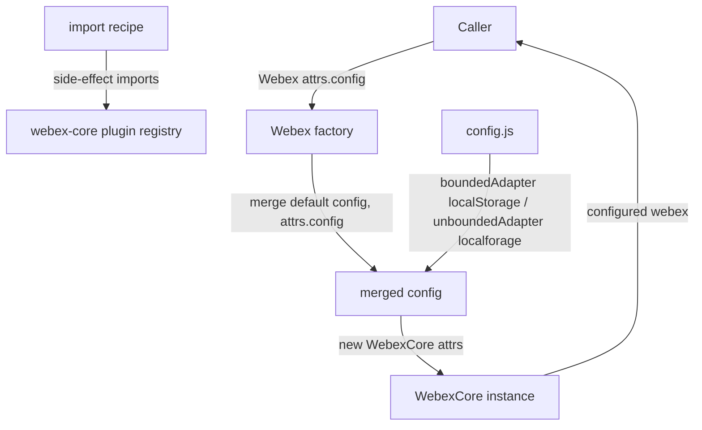
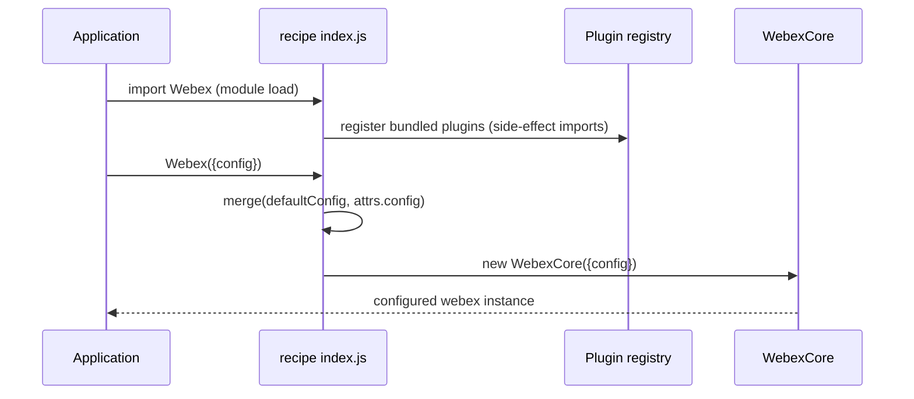
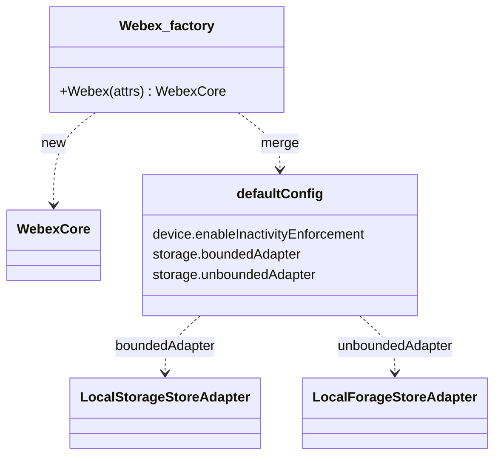

<!-- sdd-generated-metadata
generator: claude-cli
generator_model: us.anthropic.claude-opus-4-8
approved_by: pending-human-review
updated_at: 2026-08-06T00:00:00Z
validation_status: not-run
run_id: 51855eac-8de5-43a2-a3b6-dbcc55ebc91b
-->

# @webex/recipe-private-web-client — SPEC

> Start here → root [`AGENTS.md`](../../../../AGENTS.md) (agent entry) · router [`SPEC_INDEX.md`](../../../../ai-docs/SPEC_INDEX.md) · system [`ARCHITECTURE.md`](../../../../ai-docs/ARCHITECTURE.md). This is the module's canonical spec: orientation, requirements, design, flows, and tests.
> Context-efficiency: link to canonical docs — don't duplicate them. Load specs on demand per `SPEC_INDEX.md`.

## Metadata

| Field | Value |
|---|---|
| Module id | `recipe-private-web-client` |
| Source path(s) | `packages/@webex/recipe-private-web-client/src/` |
| Parent spec | `—` (top-level SDK recipe/bundle; composes plugins, no parent module) |
| Doc kind | Module spec |
| Coverage score | Pending coverage assessment |
| Generated from | `module-spec` @ SDLC template library `0.2.2` |
| generated_by / approved_by / updated_at | claude-cli / pending-human-review / 2026-08-06 |
| Validation status | not-run, validator `pending`, assessed 2026-08-06 |

Coverage score is `Pending coverage assessment` until the first coverage review runs. Manifest coverage
state is authoritative and kept in `.sdd/manifest.json`.

## Evidence Rules
Every requirement cites concrete source evidence using `file path`. Test evidence is preferred for WHY.
Requirements are grounded in the current implementation under `src/` (the recipe entry and config).

## Source Material Register

| Source material | Scope | Decision | Detail location or disposition |
|---|---|---|---|
| Module source (`src/index.js`, `src/config.js`) | overview / composition | used | Requirements, plugin roster, storage config, and factory flow derived directly from source. |
| `package.json` dependencies | composition | used | The bundled internal/public plugin set documented in Overview and Requires. |

## Overview

`@webex/recipe-private-web-client` is a **recipe** (pre-assembled SDK bundle), not a plugin. It composes a
specific set of internal and public Webex plugins needed by the Cisco Webex Teams web client and exports a
single `Webex(attrs)` factory that returns a configured `WebexCore` instance. As the package description
warns, it uses internal APIs with **no guarantee of non-breaking changes**; non-Cisco engineers should use
the public `webex` package instead.

The recipe's `src/index.js` performs side-effect imports of the plugins it bundles (registering each with
webex-core), then builds the instance by merging a caller's `attrs.config` over the recipe's default
`config`. The default config (`src/config.js`) enables device inactivity enforcement and wires the storage
layer to browser adapters: a `localStorage` bounded adapter and a `localforage` unbounded adapter, both
namespaced `web-client-internal`. A maintainer should start at `src/index.js` and `src/config.js`.

## Purpose / Responsibility

Owns the plugin roster, default configuration, and factory function that assemble a private web-client
`WebexCore` instance. It does NOT implement any plugin behavior itself — each capability lives in the
plugin it imports — and it does NOT own the storage adapters (see the `storage-adapter-*` packages) or
`webex-core`.

## Stack

JavaScript (ES modules, `src/index.js`, `src/config.js`), built with `webex-legacy-tools`. Runtime
dependencies: `@webex/webex-core` (the `WebexCore` constructor), `lodash` (`merge`), the two browser
storage adapters, and the bundled internal/public plugins listed in `package.json`. Tests run under Mocha/
Jest via `webex-legacy-tools` (`test:unit`, `test:browser`).

## Folder / Package Structure

```
packages/@webex/recipe-private-web-client/src/
├── index.js     # side-effect plugin imports + Webex(attrs) factory (merge config → new WebexCore)
└── config.js    # default config: device inactivity enforcement + storage bounded/unbounded adapters
```

## Key Files (source of truth)

| File | Holds |
|---|---|
| `packages/@webex/recipe-private-web-client/src/index.js` | The exact set of registered plugins (side-effect imports) and the `Webex` factory |
| `packages/@webex/recipe-private-web-client/src/config.js` | Default config: `device.enableInactivityEnforcement` and the `storage.boundedAdapter`/`unboundedAdapter` wiring |
| `packages/@webex/recipe-private-web-client/package.json` | The dependency roster that defines the bundle's surface |

## Public Surface

Consumed as an SDK entry point: `import Webex from '@webex/recipe-private-web-client'; const webex = Webex({config})`.

| Contract ID | Type | Surface | Purpose | Compatibility / deprecation | Schema / detail link | Root index |
|---|---|---|---|---|---|---|
| `recipe-private-web-client.Webex` | SDK | `Webex(attrs): WebexCore` | Build a configured `WebexCore` with the private web-client plugin set | Internal recipe; **no non-breaking-change guarantee** (per package description) | `packages/@webex/recipe-private-web-client/src/index.js` | `../../../../ai-docs/CONTRACTS.md` |

Compatibility notes:
- This recipe intentionally exposes internal plugins; its surface may change without a major bump. The
  public, stability-guaranteed entry point is the `webex` package.
- The default export is the `Webex` factory; the registered plugin set is part of the recipe's effective
  contract via side-effect imports.

## Requires (dependencies)

- `@webex/webex-core` — the `WebexCore` constructor the factory instantiates.
- `lodash` — `merge` for combining caller config over the default config.
- Storage adapters: `@webex/storage-adapter-local-storage` (bounded), `@webex/storage-adapter-local-forage`
  (unbounded).
- Bundled internal plugins (side-effect registered): `avatar`, `board`, `calendar`, `conversation`,
  `device`, `encryption`, `feature`, `flag`, `lyra`, `mercury`, `metrics`, `presence`, `search`,
  `support`, `team`, `user`.
- Bundled public plugins: `plugin-authorization-browser-first-party`, `plugin-logger`, `plugin-people`.

## Requirements

| ID | WHAT | WHY | Source Evidence | Test / Example Evidence | Assumptions / Gaps | Confidence |
|---|---|---|---|---|---|---|
| `RECIPE-PRIVATE-WEB-CLIENT-R-001` | `Webex(attrs)` defaults `attrs` to `{}`, merges the recipe's default `config` with `attrs.config` via `lodash.merge`, and returns `new WebexCore(attrs)`. | A single factory must produce a fully configured private web-client instance. | `packages/@webex/recipe-private-web-client/src/index.js` | None found | `merge(config, attrs.config)` mutates the shared default `config` object | PRESENT |
| `RECIPE-PRIVATE-WEB-CLIENT-R-002` | Importing the module side-effect-registers the exact bundled plugin roster (authorization-browser-first-party, avatar, board, calendar, conversation, encryption, feature, flag, logger, mercury, metrics, presence, search, support, team, user, lyra, device, people) with webex-core. | The recipe defines which capabilities the private web client ships with. | `packages/@webex/recipe-private-web-client/src/index.js` | None found | Roster must stay in sync with `package.json` dependencies | PRESENT |
| `RECIPE-PRIVATE-WEB-CLIENT-R-003` | Default config sets `device.enableInactivityEnforcement: true`. | The private web client enforces device inactivity by default. | `packages/@webex/recipe-private-web-client/src/config.js` | None found | none identified | PRESENT |
| `RECIPE-PRIVATE-WEB-CLIENT-R-004` | Default config wires storage: `boundedAdapter = new LocalStorageStoreAdapter('web-client-internal')` and `unboundedAdapter = new LocalForageStoreAdapter('web-client-internal')`. | Bounded (small/durable) data uses localStorage; unbounded (large) data uses IndexedDB via localforage, both under one namespace. | `packages/@webex/recipe-private-web-client/src/config.js` | None found | Both adapters share the `web-client-internal` basekey/namespace | PRESENT |

## Design Overview

The recipe is intentionally thin: composition, not implementation. `src/index.js` uses bare `import`
statements for each bundled plugin so their `registerPlugin`/`registerInternalPlugin` side effects run at
module load, populating the webex-core plugin registry. The exported `Webex` factory then merges the
caller's `config` over the recipe defaults (`src/config.js`) and hands the result to `WebexCore`. The
default config expresses the two policy decisions this recipe makes: device inactivity enforcement on, and
a two-tier storage strategy (bounded → localStorage, unbounded → localforage/IndexedDB) sharing the
`web-client-internal` namespace.

## Data Flow



## Sequence Diagram(s)

Instantiation is the module's single operation group — plugin registration on import, then one factory
call that merges config and constructs `WebexCore`. There are no runtime error branches in the recipe
itself (errors surface from `WebexCore` or individual plugins), so one diagram suffices.

Sequence coverage:

| Operation group | Diagram | Failure / recovery coverage |
|---|---|---|
| Recipe instantiation | 1. Build a private web-client instance | Errors are delegated to `WebexCore`/plugins; the recipe adds no failure branch |

### 1. Build a private web-client instance



## Class / Component Relationships



The recipe owns only the factory and default config; all behavior comes from `WebexCore` and the bundled
plugins.

## Use Cases

- **UC-1 Instantiate the private web client:** `import Webex from '@webex/recipe-private-web-client'; const webex = Webex({config: {credentials}})` yields a `WebexCore` with all bundled plugins registered. Evidence: `packages/@webex/recipe-private-web-client/src/index.js`.
- **UC-2 Override defaults:** pass `attrs.config` to override device/storage/plugin config; it is merged over the recipe defaults. Evidence: `packages/@webex/recipe-private-web-client/src/index.js`, `packages/@webex/recipe-private-web-client/src/config.js`.

## Error Handling & Failure Modes

| Condition | Signal (error/code/result) | Caller recovery |
|---|---|---|
| A bundled plugin fails to register (import error) | throws at module load | Fix the dependency / build |
| Invalid `attrs.config` | surfaces from `WebexCore` construction / plugin init | Correct the config; the recipe does not validate it |

## Pitfalls

- `merge(config, attrs.config)` merges into the shared default `config` object — repeated `Webex()` calls
  can accumulate state on the module-level default; treat the default config as effectively global.
- This is an internal recipe with no non-breaking-change guarantee; do not depend on its exact plugin set
  from outside Cisco — use the public `webex` package.
- The plugin roster is defined by side-effect imports in `src/index.js`; adding a `package.json`
  dependency without importing it will not register the plugin (and vice versa).
- Both storage adapters share the `web-client-internal` namespace; changing it must be coordinated across
  bounded and unbounded stores.

## Test-Case Strategy (module)

The recipe's package scripts declare `test:unit` (Jest) and `test:browser` (Karma) via
`webex-legacy-tools`, but no committed spec files were found under this package. As a composition-only
recipe, the meaningful assertions would be that `Webex()` returns a `WebexCore` with the expected plugins
registered and the default storage/device config applied; each bundled plugin owns its own behavioral
tests. This is a coverage gap for the recipe itself.

| Behavior / Requirement | Existing test evidence | Gap |
|---|---|---|
| `RECIPE-PRIVATE-WEB-CLIENT-R-001` | None found | Add assertion that caller config overrides defaults |
| `RECIPE-PRIVATE-WEB-CLIENT-R-002` | None found | Add assertion enumerating registered plugins |
| `RECIPE-PRIVATE-WEB-CLIENT-R-003` | None found | Add assertion on `enableInactivityEnforcement` default |
| `RECIPE-PRIVATE-WEB-CLIENT-R-004` | None found | Add assertion on bounded/unbounded adapter wiring |

## Traceability

- Repo architecture: [`ARCHITECTURE.md`](../../../../ai-docs/ARCHITECTURE.md) · Registry: [`SPEC_INDEX.md`](../../../../ai-docs/SPEC_INDEX.md)
- Coverage state & contracts baseline: `.sdd/manifest.json`
