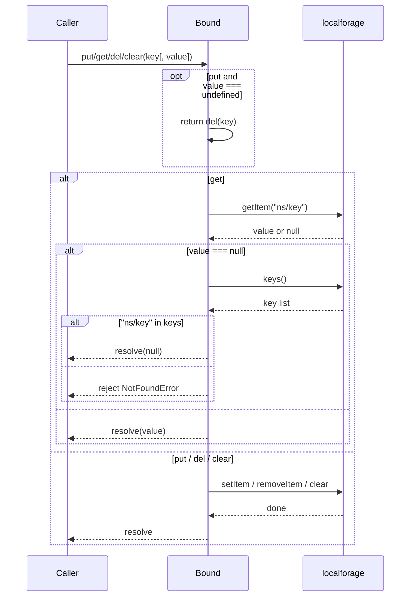
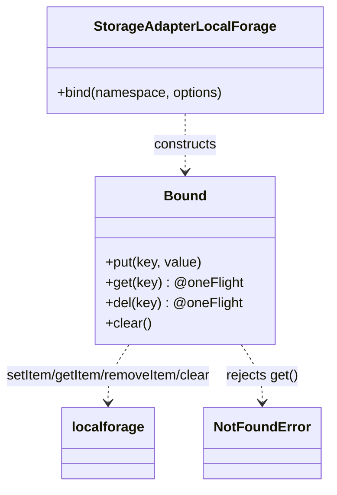

<!-- sdd-generated-metadata
generator: claude-cli
generator_model: us.anthropic.claude-opus-4-8
approved_by: pending-human-review
updated_at: 2026-08-06T00:00:00Z
validation_status: not-run
run_id: 51855eac-8de5-43a2-a3b6-dbcc55ebc91b
-->

# @webex/storage-adapter-local-forage — SPEC

> Start here → root [`AGENTS.md`](../../../../AGENTS.md) (agent entry) · router [`SPEC_INDEX.md`](../../../../ai-docs/SPEC_INDEX.md) · system [`ARCHITECTURE.md`](../../../../ai-docs/ARCHITECTURE.md). This is the module's canonical spec: orientation, requirements, design, flows, state, concurrency, and tests.
> Context-efficiency: link to canonical docs — don't duplicate them. Load specs on demand per `SPEC_INDEX.md`.

## Metadata

| Field | Value |
|---|---|
| Module id | `storage-adapter-local-forage` |
| Source path(s) | `packages/@webex/storage-adapter-local-forage/src/` |
| Parent spec | `—` (webex-core storage adapter; no parent module) |
| Doc kind | Module spec |
| Coverage score | Pending coverage assessment |
| Generated from | `module-spec` @ SDLC template library `0.2.2` |
| generated_by / approved_by / updated_at | claude-cli / pending-human-review / 2026-08-06 |
| Validation status | not-run, validator `pending`, assessed 2026-08-06 |

Coverage score is `Pending coverage assessment` until the first coverage review runs. Manifest coverage
state is authoritative and kept in `.sdd/manifest.json`.

## Evidence Rules
Every requirement cites concrete source evidence using `file path`. Test evidence is preferred for WHY.
Requirements are grounded in the current implementation under `src/` and the shared adapter conformance suite.

## Source Material Register

| Source material | Scope | Decision | Detail location or disposition |
|---|---|---|---|
| Module source (`src/index.js`) | overview / API | used | Contract, requirements, data flow, sequence diagrams, and concurrency notes derived directly from source. |
| Shared conformance suite (`@webex/storage-adapter-spec`) | tests | reference-only | The unit suite that verifies this adapter; summarized in Test-Case Strategy. |

## Overview

`@webex/storage-adapter-local-forage` is an **IndexedDB** implementation of the webex-core
storage-adapter contract, built on the `localforage` library. Unlike the `localStorage`/`sessionStorage`
adapters (which serialize all namespaces into one JSON blob), this adapter stores each value under its own
`localforage` key of the form `"{namespace}/{key}"`, letting `localforage` pick the best available
async backend (IndexedDB, WebSQL, or localStorage).

The default export `StorageAdapterLocalForage` exposes `bind(namespace, options)`, which returns a `Bound`
instance scoped to that namespace. The `Bound` class provides `put`/`get`/`del`/`clear`; `del` and `get`
are guarded by the `@oneFlight` decorator (from `@webex/common`) to de-duplicate concurrent calls for the
same key. Namespace and logger are held in module-level `WeakMap`s. A maintainer should start at
`src/index.js`.

## Purpose / Responsibility

Owns durable, asynchronous persistence of webex-core storage data via `localforage`/IndexedDB, using
per-key entries namespaced as `"{namespace}/{key}"`. It does NOT own the synchronous `localStorage`/
`sessionStorage` adapters or the storage contract itself (see `@webex/storage-adapter-spec`).

## Stack

JavaScript (ES modules with decorators, `src/index.js`, `eslint-env browser`), built with
`webex-legacy-tools`. Runtime dependencies: `localforage` (^1.7.3), `@webex/common` (`oneFlight`),
`@webex/webex-core` (`NotFoundError`). Verified against `@webex/storage-adapter-spec` under Karma
(`test:browser`).

## Folder / Package Structure

```
packages/@webex/storage-adapter-local-forage/src/
└── index.js    # StorageAdapterLocalForage default export + inner Bound class (@oneFlight get/del)
```

## Key Files (source of truth)

| File | Holds |
|---|---|
| `packages/@webex/storage-adapter-local-forage/src/index.js` | `StorageAdapterLocalForage`, the `Bound` class, the `"{namespace}/{key}"` layout, and `@oneFlight` guards |

## Public Surface

Consumed by webex-core's storage layer; constructed and passed as the unbounded adapter in configuration
(e.g. `new LocalForageStoreAdapter('web-client-internal')`).

| Contract ID | Type | Surface | Purpose | Compatibility / deprecation | Schema / detail link | Root index |
|---|---|---|---|---|---|---|
| `storage-adapter-local-forage.bind` | SDK | `bind(namespace, options): Promise<Bound>` | Return a namespace-scoped store; rejects without `namespace` or `options.logger` | Stable; conforms to `@webex/storage-adapter-spec` | `packages/@webex/storage-adapter-local-forage/src/index.js` | `../../../../ai-docs/CONTRACTS.md` |
| `storage-adapter-local-forage.Bound.put` | SDK | `put(key, value): Promise` | Store `value` at `"{namespace}/{key}"`; `del` when `value` is `undefined` | Stable | `packages/@webex/storage-adapter-local-forage/src/index.js` | `../../../../ai-docs/CONTRACTS.md` |
| `storage-adapter-local-forage.Bound.get` | SDK | `get(key): Promise<mixed>` | Read `"{namespace}/{key}"`; rejects `NotFoundError` when key absent | Stable; `@oneFlight` de-dupes concurrent reads | `packages/@webex/storage-adapter-local-forage/src/index.js` | `../../../../ai-docs/CONTRACTS.md` |
| `storage-adapter-local-forage.Bound.del` | SDK | `del(key): Promise` | Remove `"{namespace}/{key}"` | Stable; `@oneFlight` de-dupes concurrent deletes | `packages/@webex/storage-adapter-local-forage/src/index.js` | `../../../../ai-docs/CONTRACTS.md` |
| `storage-adapter-local-forage.Bound.clear` | SDK | `clear(): Promise` | `localforage.clear()` — clears the entire localforage store | Stable | `packages/@webex/storage-adapter-local-forage/src/index.js` | `../../../../ai-docs/CONTRACTS.md` |

Compatibility notes:
- The `bind` / `put` / `get` / `del` / `clear` signatures and the `NotFoundError`-on-missing-key behavior
  are the semver-controlled contract enforced by `@webex/storage-adapter-spec`.
- `put(key, undefined)` is defined to delegate to `del(key)` rather than storing `undefined`.

## Requires (dependencies)

- `localforage` — the async key/value backend (IndexedDB → WebSQL → localStorage fallback).
- `@webex/common` — the `@oneFlight` decorator guarding `get`/`del`.
- `@webex/webex-core` — `NotFoundError`, rejected by `get` when a key is absent.
- Browser environment (`eslint-env browser`); `options.logger` required for logging.
- Dev/verification: `@webex/storage-adapter-spec`, `@webex/test-helper-mocha`.

## Requirements

| ID | WHAT | WHY | Source Evidence | Test / Example Evidence | Assumptions / Gaps | Confidence |
|---|---|---|---|---|---|---|
| `STORAGE-ADAPTER-LOCAL-FORAGE-R-001` | `bind(namespace, options)` rejects with ``` `namespace` is required ``` when `namespace` is falsy and ``` `options.logger` is required ``` when no logger is given; otherwise resolves a `Bound` scoped to the namespace. | Enforce the adapter contract and guarantee a logger for diagnostics. | `packages/@webex/storage-adapter-local-forage/src/index.js` | `packages/@webex/storage-adapter-local-forage/test/unit/spec/storage-adapter-local-forage.js` | none identified | PRESENT |
| `STORAGE-ADAPTER-LOCAL-FORAGE-R-002` | Each value is stored under a per-key localforage entry keyed `"{namespace}/{key}"` (not one combined blob), via `localforage.setItem`/`getItem`/`removeItem`. | Per-key storage enables IndexedDB and avoids rewriting the whole store on every write. | `packages/@webex/storage-adapter-local-forage/src/index.js` | `packages/@webex/storage-adapter-local-forage/test/unit/spec/storage-adapter-local-forage.js` | none identified | PRESENT |
| `STORAGE-ADAPTER-LOCAL-FORAGE-R-003` | `get(key)` returns the stored value; because `localforage.getItem` returns `null` for both a missing key and a stored `null`, it disambiguates via `localforage.keys()` — rejecting `NotFoundError` only when the key is truly absent, otherwise resolving the stored `null`. | A stored `null` must be distinguishable from a missing key. | `packages/@webex/storage-adapter-local-forage/src/index.js` | `packages/@webex/storage-adapter-local-forage/test/unit/spec/storage-adapter-local-forage.js` | none identified | PRESENT |
| `STORAGE-ADAPTER-LOCAL-FORAGE-R-004` | `put(key, undefined)` delegates to `del(key)` (removing the entry) instead of storing `undefined`; `del` removes `"{namespace}/{key}"`; `clear()` calls `localforage.clear()`. | Storing `undefined` is meaningless; `undefined` writes are treated as deletes. | `packages/@webex/storage-adapter-local-forage/src/index.js` | `packages/@webex/storage-adapter-local-forage/test/unit/spec/storage-adapter-local-forage.js` | `clear()` clears the whole localforage store, not just the bound namespace | PRESENT |
| `STORAGE-ADAPTER-LOCAL-FORAGE-R-005` | `get` and `del` are wrapped with `@oneFlight({keyFactory: (key) => key})` so concurrent calls for the same key share a single in-flight Promise. | De-duplicating concurrent async reads/deletes avoids redundant IndexedDB work and races. | `packages/@webex/storage-adapter-local-forage/src/index.js` | `packages/@webex/storage-adapter-local-forage/test/unit/spec/storage-adapter-local-forage.js` | none identified | PRESENT |

## Design Overview

`StorageAdapterLocalForage` defines an inner `Bound` class whose methods delegate directly to
`localforage`. Unlike the sync adapters, there is no read-modify-write of a shared blob: each `put`
`setItem`s a single `"{namespace}/{key}"` entry, `del` `removeItem`s it, and `get` `getItem`s it. The
subtlety is null handling — `localforage.getItem` returns `null` both for a missing key and for a stored
`null`, so `get` calls `localforage.keys()` to check whether the composite key actually exists before
deciding between resolving `null` and rejecting `NotFoundError`. `get` and `del` carry the `@oneFlight`
decorator (keyed by the raw `key`) so overlapping calls for the same key coalesce into one in-flight
Promise. `put` short-circuits `undefined` values to `del`. `clear` clears the entire localforage store.

## Data Flow

```mermaid
flowchart LR
  Caller -->|put/get/del/clear key| B[Bound]
  B -->|setItem/getItem/removeItem "ns/key"| LF[localforage]
  LF -->|IndexedDB / WebSQL / localStorage| Backend[(Async backend)]
  B -->|value / null / NotFoundError| Caller
```

## Sequence Diagram(s)

The bound operations share the same actors (Caller → Bound → localforage) and async transport, so they
form one CRUD operation group. The `get` null-disambiguation branch and missing-key rejection are the
distinctive failure/edge path, shown as `alt` here; a separate diagram is not warranted.

Sequence coverage:

| Operation group | Diagram | Failure / recovery coverage |
|---|---|---|
| Bound key CRUD (async) | 1. Bound operation | `alt` covers `get` null vs missing-key (`localforage.keys()` check → resolve null or reject `NotFoundError`); `opt` covers `put(undefined)`→`del` |

### 1. Bound operation



## Class / Component Relationships



`StorageAdapterLocalForage` owns the inner `Bound` class; `namespace`/`logger` live in module `WeakMap`s.
`@oneFlight` (from `@webex/common`) decorates `get`/`del`.

## State Model

Persistent state lives in the localforage store as independent entries keyed `"{namespace}/{key}"`
(backed by IndexedDB/WebSQL/localStorage). In-memory, each `Bound` instance carries only its `namespace`
and `logger` via `WeakMap`s, plus the transient `@oneFlight` in-flight map. Transitions: `put` writes/
overwrites one key; `put(undefined)`/`del` removes one key; `clear` empties the whole store.

## Concurrency & Reactive Flow

All operations are async Promises over `localforage`. `get` and `del` are decorated with
`@oneFlight({keyFactory: (key) => key})`, so multiple concurrent calls for the same key resolve from a
single shared in-flight Promise rather than issuing duplicate IndexedDB operations. `put` is not
oneFlight-guarded; the conformance suite still requires last-write-wins semantics for concurrent `put`s
(`put(1),put(2),put(3)` → `get` yields `3`), which relies on localforage's internal serialization.
`get`'s missing-vs-null disambiguation performs a second async `keys()` lookup only when `getItem`
returns `null`.

## Error Handling & Failure Modes

| Condition | Signal (error/code/result) | Caller recovery |
|---|---|---|
| `get` on a truly absent key | rejects `NotFoundError('No value found for {namespace}/{key}')` | Treat as cache miss; populate via `put` |
| `get` on a stored `null` | resolves `null` (not a rejection) | Handle `null` as a valid stored value |
| `bind` without `namespace` | rejects `Error('`namespace` is required')` | Pass a namespace |
| `bind` without `options.logger` | rejects `Error('`options.logger` is required')` | Pass a logger |
| localforage backend unavailable | rejects with the underlying localforage error | Handle storage-backend errors upstream |

## Pitfalls

- `get` returns `null` for a stored `null` but rejects `NotFoundError` for a missing key — do not conflate
  the two. The extra `localforage.keys()` lookup exists precisely for this distinction.
- `clear()` empties the entire localforage store, not just the bound namespace.
- `put(key, undefined)` deletes the key; it does not store `undefined`.
- `get`/`del` are `@oneFlight`-guarded per key; interleaving a `put` between overlapping `get`s can affect
  which value the shared in-flight read resolves.

## Test-Case Strategy (module)

Verified by the shared conformance suite: `test/unit/spec/storage-adapter-local-forage.js` calls
`runAbstractStorageAdapterSpec(new StorageAdapterLocalForage('test'))` inside `skipInNode(describe)`
(Karma `test:browser`), covering `bind` validation, primitive/falsey/object/array round-trips (including
stored `null`), concurrency (last-write-wins), namespace isolation, `put(undefined)` removal, and
missing-key rejection.

| Behavior / Requirement | Existing test evidence | Gap |
|---|---|---|
| `STORAGE-ADAPTER-LOCAL-FORAGE-R-001` | `packages/@webex/storage-adapter-local-forage/test/unit/spec/storage-adapter-local-forage.js` | none material |
| `STORAGE-ADAPTER-LOCAL-FORAGE-R-002` | `packages/@webex/storage-adapter-local-forage/test/unit/spec/storage-adapter-local-forage.js` | none material |
| `STORAGE-ADAPTER-LOCAL-FORAGE-R-003` | `packages/@webex/storage-adapter-local-forage/test/unit/spec/storage-adapter-local-forage.js` | Add explicit stored-`null` vs missing-key test |
| `STORAGE-ADAPTER-LOCAL-FORAGE-R-004` | `packages/@webex/storage-adapter-local-forage/test/unit/spec/storage-adapter-local-forage.js` | Add explicit test that `clear()` empties the whole store |
| `STORAGE-ADAPTER-LOCAL-FORAGE-R-005` | `packages/@webex/storage-adapter-local-forage/test/unit/spec/storage-adapter-local-forage.js` | Add explicit `@oneFlight` de-dupe assertion |

## Traceability

- Repo architecture: [`ARCHITECTURE.md`](../../../../ai-docs/ARCHITECTURE.md) · Registry: [`SPEC_INDEX.md`](../../../../ai-docs/SPEC_INDEX.md)
- Coverage state & contracts baseline: `.sdd/manifest.json`
