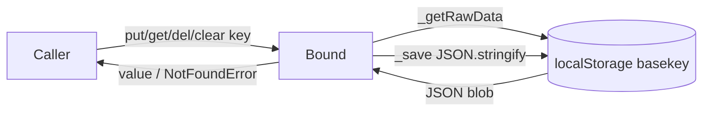
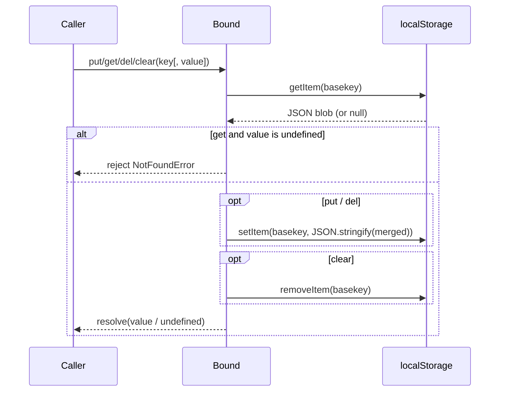
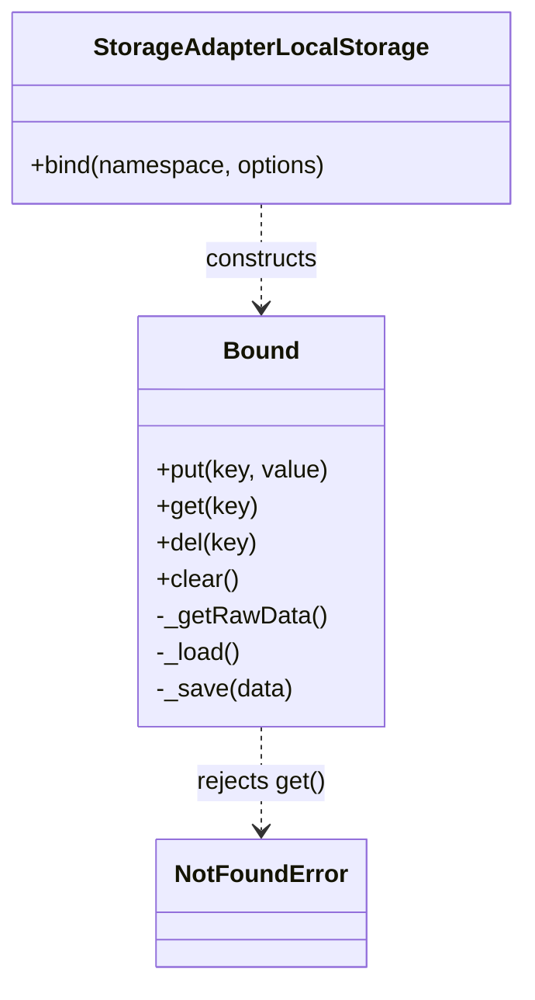

<!-- sdd-generated-metadata
generator: claude-cli
generator_model: us.anthropic.claude-opus-4-8
approved_by: pending-human-review
updated_at: 2026-08-06T00:00:00Z
validation_status: not-run
run_id: 51855eac-8de5-43a2-a3b6-dbcc55ebc91b
-->

# @webex/storage-adapter-local-storage — SPEC

> Start here → root [`AGENTS.md`](../../../../AGENTS.md) (agent entry) · router [`SPEC_INDEX.md`](../../../../ai-docs/SPEC_INDEX.md) · system [`ARCHITECTURE.md`](../../../../ai-docs/ARCHITECTURE.md). This is the module's canonical spec: orientation, requirements, design, flows, state, and tests.
> Context-efficiency: link to canonical docs — don't duplicate them. Load specs on demand per `SPEC_INDEX.md`.

## Metadata

| Field | Value |
|---|---|
| Module id | `storage-adapter-local-storage` |
| Source path(s) | `packages/@webex/storage-adapter-local-storage/src/` |
| Parent spec | `—` (webex-core storage adapter; no parent module) |
| Doc kind | Module spec |
| Coverage score | Pending coverage assessment |
| Generated from | `module-spec` @ SDLC template library `0.2.2` |
| generated_by / approved_by / updated_at | claude-cli / pending-human-review / 2026-08-06 |
| Validation status | not-run, validator `pending`, assessed 2026-08-06 |

Coverage score is `Pending coverage assessment` until the first coverage review runs. Manifest coverage
state is authoritative and kept in `.sdd/manifest.json`.

## Evidence Rules
Every requirement cites concrete source evidence using `file path`. Test evidence is preferred for WHY.
Requirements are grounded in the current implementation under `src/` and the shared adapter conformance suite.

## Source Material Register

| Source material | Scope | Decision | Detail location or disposition |
|---|---|---|---|
| Module source (`src/index.js`) | overview / API | used | Contract, requirements, data flow, and sequence diagrams derived directly from source. |
| Shared conformance suite (`@webex/storage-adapter-spec`) | tests | reference-only | The unit suite that verifies this adapter; summarized in Test-Case Strategy. |

## Overview

`@webex/storage-adapter-local-storage` is a browser `localStorage` implementation of the webex-core
storage-adapter contract. It stores all namespaces under a single `localStorage` key (the `basekey`
passed to the constructor), serializing the entire namespace map as one JSON blob.

The default export `StorageAdapterLocalStorage` exposes `bind(namespace, options)`, which returns a
`Bound` instance scoped to that namespace. The `Bound` class provides `put`/`get`/`del`/`clear` and two
private helpers (`_getRawData`/`_load`/`_save`) that read, merge, and write the shared JSON blob.
Namespace and logger are held in module-level `WeakMap`s keyed by the `Bound` instance. A maintainer
should start at `src/index.js`.

## Purpose / Responsibility

Owns persistence of webex-core storage data in browser `localStorage`, namespaced under a single
`basekey`. It does NOT own IndexedDB storage (see `@webex/storage-adapter-local-forage`), session-scoped
storage (see `@webex/storage-adapter-session-storage`), or the storage contract itself (see
`@webex/storage-adapter-spec`).

## Stack

JavaScript (ES modules, `src/index.js`, `eslint-env browser`), built with `webex-legacy-tools`. Runtime
dependency: `@webex/webex-core` (`NotFoundError`). Verified against `@webex/storage-adapter-spec` under
Jest (`test:unit`) and Karma (`test:browser`).

## Folder / Package Structure

```
packages/@webex/storage-adapter-local-storage/src/
└── index.js    # StorageAdapterLocalStorage default export + inner Bound class
```

## Key Files (source of truth)

| File | Holds |
|---|---|
| `packages/@webex/storage-adapter-local-storage/src/index.js` | `StorageAdapterLocalStorage`, the `Bound` class, and the single-`basekey` JSON layout |

## Public Surface

Consumed by webex-core's storage layer; typically constructed with a `basekey` and passed as a bounded
adapter in configuration (e.g. `new LocalStorageStoreAdapter('web-client-internal')`).

| Contract ID | Type | Surface | Purpose | Compatibility / deprecation | Schema / detail link | Root index |
|---|---|---|---|---|---|---|
| `storage-adapter-local-storage.bind` | SDK | `bind(namespace, options): Promise<Bound>` | Return a namespace-scoped store; rejects without `namespace` or `options.logger` | Stable; conforms to `@webex/storage-adapter-spec` | `packages/@webex/storage-adapter-local-storage/src/index.js` | `../../../../ai-docs/CONTRACTS.md` |
| `storage-adapter-local-storage.Bound.put` | SDK | `put(key, value): Promise` | Store `value` under `key` in the namespace | Stable | `packages/@webex/storage-adapter-local-storage/src/index.js` | `../../../../ai-docs/CONTRACTS.md` |
| `storage-adapter-local-storage.Bound.get` | SDK | `get(key): Promise<mixed>` | Read `key`; rejects `NotFoundError` when absent | Stable | `packages/@webex/storage-adapter-local-storage/src/index.js` | `../../../../ai-docs/CONTRACTS.md` |
| `storage-adapter-local-storage.Bound.del` | SDK | `del(key): Promise` | Remove `key` from the namespace | Stable | `packages/@webex/storage-adapter-local-storage/src/index.js` | `../../../../ai-docs/CONTRACTS.md` |
| `storage-adapter-local-storage.Bound.clear` | SDK | `clear(): Promise` | Remove the entire `basekey` blob from `localStorage` | Stable | `packages/@webex/storage-adapter-local-storage/src/index.js` | `../../../../ai-docs/CONTRACTS.md` |

Compatibility notes:
- The `bind` / `put` / `get` / `del` / `clear` signatures and the `NotFoundError`-on-missing-key behavior
  are the semver-controlled contract enforced by `@webex/storage-adapter-spec`.

## Requires (dependencies)

- `@webex/webex-core` — `NotFoundError`, rejected by `get` when a key is absent.
- Browser `localStorage` global (the module is `eslint-env browser`).
- `options.logger` — required; used for debug/info logging on every operation.
- Dev/verification: `@webex/storage-adapter-spec`, `@webex/test-helper-mocha`.

## Requirements

| ID | WHAT | WHY | Source Evidence | Test / Example Evidence | Assumptions / Gaps | Confidence |
|---|---|---|---|---|---|---|
| `STORAGE-ADAPTER-LOCAL-STORAGE-R-001` | `bind(namespace, options)` rejects with ``` `namespace` is required ``` when `namespace` is falsy and ``` `options.logger` is required ``` when no logger is given; otherwise resolves a `Bound` scoped to the namespace. | Enforce the adapter contract and guarantee a logger for diagnostics. | `packages/@webex/storage-adapter-local-storage/src/index.js` | `packages/@webex/storage-adapter-local-storage/test/unit/spec/storage-adapter-local-storage.js` | none identified | PRESENT |
| `STORAGE-ADAPTER-LOCAL-STORAGE-R-002` | All namespaces are persisted as one JSON object under a single `basekey` `localStorage` entry; `_load` returns the current namespace slice (`{}` when absent) and `_save` merges the slice back and re-serializes. | Single-key layout keeps all webex-core namespaces together and namespace-isolated. | `packages/@webex/storage-adapter-local-storage/src/index.js` | `packages/@webex/storage-adapter-local-storage/test/unit/spec/storage-adapter-local-storage.js` | none identified | PRESENT |
| `STORAGE-ADAPTER-LOCAL-STORAGE-R-003` | `put(key, value)` writes `value` under `key` in the namespace slice and resolves; `get(key)` resolves the stored value when `typeof value !== 'undefined'`, else rejects `NotFoundError('No value found for {key}')`. | Callers need deterministic read/write with a distinct missing-key signal. | `packages/@webex/storage-adapter-local-storage/src/index.js` | `packages/@webex/storage-adapter-local-storage/test/unit/spec/storage-adapter-local-storage.js` | none identified | PRESENT |
| `STORAGE-ADAPTER-LOCAL-STORAGE-R-004` | `del(key)` deletes the property via `Reflect.deleteProperty` and re-saves; `clear()` removes the entire `basekey` entry via `localStorage.removeItem`. | Support single-key removal and full-namespace-store reset. | `packages/@webex/storage-adapter-local-storage/src/index.js` | `packages/@webex/storage-adapter-local-storage/test/unit/spec/storage-adapter-local-storage.js` | `clear()` removes ALL namespaces under `basekey`, not just the bound one | PRESENT |

## Design Overview

`StorageAdapterLocalStorage` captures `basekey` in its constructor and defines an inner `Bound` class that
closes over it. Each `bind` call constructs a new `Bound`, recording `namespace` and `options.logger` in
module-level `WeakMap`s keyed by the instance (so the adapter carries no per-instance public fields).
Every read/write goes through `_getRawData` (parse the whole `basekey` blob, `{}` if empty) → `_load`
(select the namespace slice) and, for writes, `_save` (merge the slice, `JSON.stringify`, `setItem`).
`get` distinguishes a stored value from absence by `typeof value !== 'undefined'`, rejecting
`NotFoundError` otherwise. The design deliberately trades write granularity (each write rewrites the whole
blob) for simplicity and namespace co-location.

## Data Flow



## Sequence Diagram(s)

The bound operations form one CRUD operation group (same actors Caller → Bound → localStorage, same
JSON-blob transport). The missing-key branch is the only failure path, shown as `alt` here; a separate
diagram is not warranted.

Sequence coverage:

| Operation group | Diagram | Failure / recovery coverage |
|---|---|---|
| Bound key CRUD | 1. Bound operation | `alt` covers `get` missing key → `NotFoundError` rejection |

### 1. Bound operation



## Class / Component Relationships



`StorageAdapterLocalStorage` owns the inner `Bound` class; `namespace`/`logger` live in module `WeakMap`s.

## State Model

Persistent state is a single `localStorage` entry keyed by `basekey`, holding a JSON object
`{ [namespace]: { [key]: value } }`. In-memory, each `Bound` instance carries only its `namespace` and
`logger` via `WeakMap`s; there is no cached copy — every operation re-reads the blob from `localStorage`.
Transitions: `put`/`del` mutate the namespace slice and rewrite the blob; `clear` removes the whole blob.

## Concurrency & Reactive Flow

All methods return Promises but perform synchronous `localStorage` access; there is no async I/O and no
locking. Because each write does read-modify-write on the shared blob, concurrent writes to the same key
resolve to last-write-wins (the conformance suite asserts `put(1),put(2),put(3)` → `get` yields `3`).
There is no protection against another tab mutating the same `basekey` between read and write.

## Error Handling & Failure Modes

| Condition | Signal (error/code/result) | Caller recovery |
|---|---|---|
| `get` on an absent key | rejects `NotFoundError('No value found for {key}')` | Treat as cache miss; populate via `put` |
| `bind` without `namespace` | rejects `Error('`namespace` is required')` | Pass a namespace |
| `bind` without `options.logger` | rejects `Error('`options.logger` is required')` | Pass a logger |
| `localStorage` unavailable/quota exceeded | throws from `setItem`/`getItem` (browser error) | Handle browser storage errors upstream |

## Pitfalls

- `clear()` removes the entire `basekey` blob — every namespace, not just the bound one. Do not use it as
  a per-namespace reset.
- Every write serializes and rewrites the whole blob; large stores make each `put`/`del` O(size).
- Cross-tab writes to the same `basekey` can race (read-modify-write is not atomic).
- A stored `undefined` cannot be distinguished from a missing key (`get` rejects) — use `null` to persist
  an intentional empty value.

## Test-Case Strategy (module)

Verified by the shared conformance suite: `test/unit/spec/storage-adapter-local-storage.js` calls
`runAbstractStorageAdapterSpec(new StorageAdapterLocalStorage('test'))` inside `skipInNode(describe)`
(Jest for `test:unit`, Karma for `test:browser`), covering `bind` validation, primitive/falsey/object/
array round-trips, concurrency (last-write-wins), namespace isolation, and missing-key rejection.

| Behavior / Requirement | Existing test evidence | Gap |
|---|---|---|
| `STORAGE-ADAPTER-LOCAL-STORAGE-R-001` | `packages/@webex/storage-adapter-local-storage/test/unit/spec/storage-adapter-local-storage.js` | none material |
| `STORAGE-ADAPTER-LOCAL-STORAGE-R-002` | `packages/@webex/storage-adapter-local-storage/test/unit/spec/storage-adapter-local-storage.js` | none material |
| `STORAGE-ADAPTER-LOCAL-STORAGE-R-003` | `packages/@webex/storage-adapter-local-storage/test/unit/spec/storage-adapter-local-storage.js` | none material |
| `STORAGE-ADAPTER-LOCAL-STORAGE-R-004` | `packages/@webex/storage-adapter-local-storage/test/unit/spec/storage-adapter-local-storage.js` | Add explicit test that `clear()` wipes all namespaces |

## Traceability

- Repo architecture: [`ARCHITECTURE.md`](../../../../ai-docs/ARCHITECTURE.md) · Registry: [`SPEC_INDEX.md`](../../../../ai-docs/SPEC_INDEX.md)
- Coverage state & contracts baseline: `.sdd/manifest.json`
