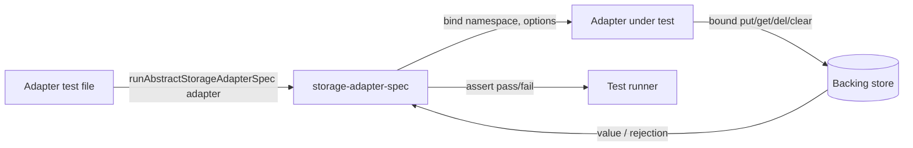
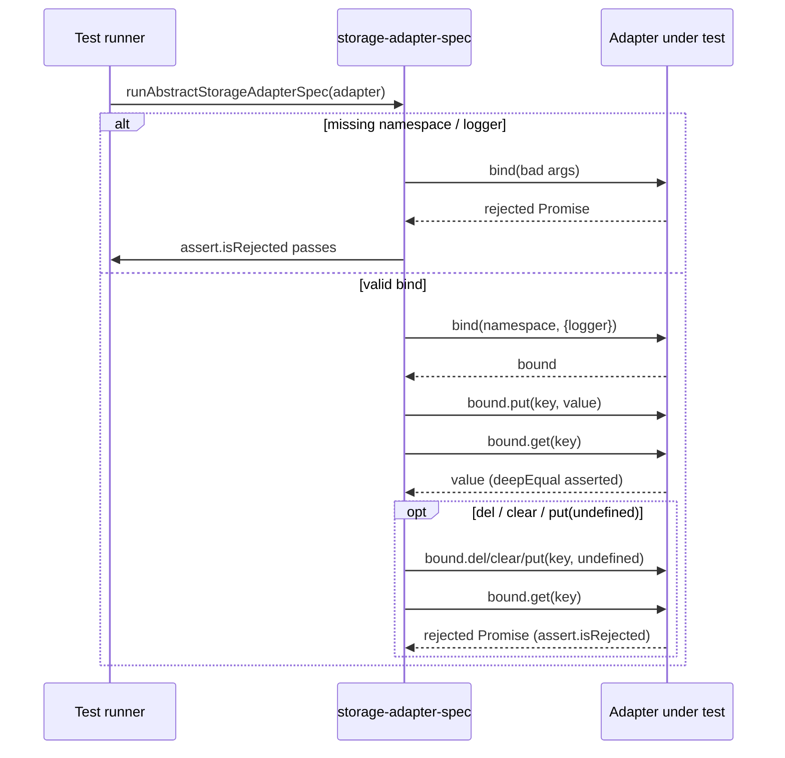
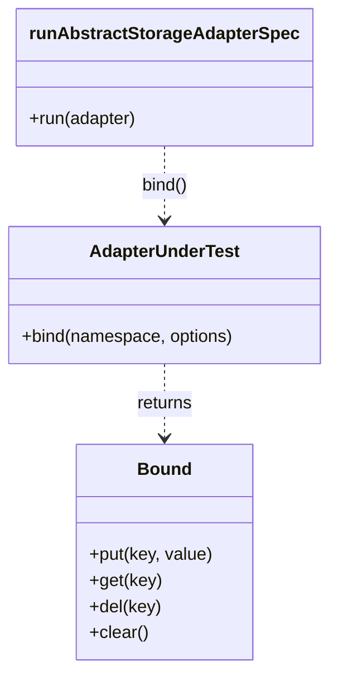

<!-- sdd-generated-metadata
generator: claude-cli
generator_model: us.anthropic.claude-opus-4-8
approved_by: pending-human-review
updated_at: 2026-08-06T00:00:00Z
validation_status: not-run
run_id: 51855eac-8de5-43a2-a3b6-dbcc55ebc91b
-->

# @webex/storage-adapter-spec — SPEC

> Start here → root [`AGENTS.md`](../../../../AGENTS.md) (agent entry) · router [`SPEC_INDEX.md`](../../../../ai-docs/SPEC_INDEX.md) · system [`ARCHITECTURE.md`](../../../../ai-docs/ARCHITECTURE.md). This is the module's canonical spec: orientation, requirements, design, flows, and tests.
> Context-efficiency: link to canonical docs — don't duplicate them. Load specs on demand per `SPEC_INDEX.md`.

## Metadata

| Field | Value |
|---|---|
| Module id | `storage-adapter-spec` |
| Source path(s) | `packages/@webex/storage-adapter-spec/src/` |
| Parent spec | `—` (shared test-suite package; no parent module) |
| Doc kind | Module spec |
| Coverage score | Pending coverage assessment |
| Generated from | `module-spec` @ SDLC template library `0.2.2` |
| generated_by / approved_by / updated_at | claude-cli / pending-human-review / 2026-08-06 |
| Validation status | not-run, validator `pending`, assessed 2026-08-06 |

Coverage score is `Pending coverage assessment` until the first coverage review runs. Manifest coverage
state is authoritative and kept in `.sdd/manifest.json`.

## Evidence Rules
Every requirement cites concrete source evidence using `file path`. Test evidence is preferred for WHY.
Requirements are grounded in the current implementation under `src/` and its consuming adapter test suites.

## Source Material Register

| Source material | Scope | Decision | Detail location or disposition |
|---|---|---|---|
| Module source (`src/index.js`) | overview / API | used | Contract, requirements, and sequence diagrams derived directly from the exported spec function. |
| `README.md` | overview / usage | reference-only | Retained as the package README (context-only); usage summarized in Overview and Use Cases. |

## Overview

`@webex/storage-adapter-spec` is a shared **conformance test suite**, not a runtime adapter. It exports a
single function, `runAbstractStorageAdapterSpec(adapter)`, that any storage-adapter implementation calls
inside its own test file to prove it satisfies the webex-core storage contract (`bind` + the bound
`put`/`get`/`del`/`clear` interface).

The suite defines Mocha/Jest-style `describe`/`it` blocks that bind the adapter to a namespace and then
exercise primitive, falsey, object, array, concurrency, namespace-isolation, and missing-key behaviors.
It is consumed by `@webex/storage-adapter-local-storage`, `@webex/storage-adapter-session-storage`, and
`@webex/storage-adapter-local-forage`. A maintainer should start at `src/index.js`.

## Purpose / Responsibility

Owns the single, shared behavioral contract that every webex-core storage adapter must pass: `bind`
argument validation and the CRUD semantics of the bound store. It does NOT provide any storage backend of
its own — it only asserts behavior against an adapter passed in by the caller.

## Stack

JavaScript (ES modules, `src/index.js`), built with `webex-legacy-tools`. Assertions use
`@webex/test-helper-chai` (`assert`, `assert.isRejected`). The `describe`/`it`/`beforeAll` globals are
provided by the consuming adapter's test runner (Jest or Karma).

## Folder / Package Structure

```
packages/@webex/storage-adapter-spec/src/
└── index.js    # default export runAbstractStorageAdapterSpec(adapter)
```

## Key Files (source of truth)

| File | Holds |
|---|---|
| `packages/@webex/storage-adapter-spec/src/index.js` | The entire conformance suite and the `bind`/`put`/`get`/`del`/`clear` contract it asserts |

## Public Surface

Consumed as an imported test helper (`import runAbstractStorageAdapterSpec from '@webex/storage-adapter-spec'`).

| Contract ID | Type | Surface | Purpose | Compatibility / deprecation | Schema / detail link | Root index |
|---|---|---|---|---|---|---|
| `storage-adapter-spec.runAbstractStorageAdapterSpec` | SDK | `runAbstractStorageAdapterSpec(adapter): void` | Register the shared storage-adapter conformance suite against `adapter` | Stable default export; must run inside a `describe` in the caller | `packages/@webex/storage-adapter-spec/src/index.js` | `../../../../ai-docs/CONTRACTS.md` |

Compatibility notes:
- The exported function name/signature and the asserted adapter contract (`bind(namespace, options)` →
  bound `put`/`get`/`del`/`clear`) are the semver-controlled contract. Changing an assertion can break
  every consuming adapter's build.

## Requires (dependencies)

- `@webex/test-helper-chai` — `assert` and `assert.isRejected` used by every check.
- The caller's test runner (`describe`, `it`, `beforeAll`) and an adapter instance passed to the function.

## Requirements

| ID | WHAT | WHY | Source Evidence | Test / Example Evidence | Assumptions / Gaps | Confidence |
|---|---|---|---|---|---|---|
| `STORAGE-ADAPTER-SPEC-R-001` | Asserts `bind()` rejects when `namespace` is missing (`/\`namespace\` is required/`) and when `options.logger` is missing (`/\`options.logger\` is required/`), and otherwise resolves a bound db interface. | Every adapter must validate `bind` arguments identically. | `packages/@webex/storage-adapter-spec/src/index.js` | `packages/@webex/storage-adapter-local-storage/test/unit/spec/storage-adapter-local-storage.js` | none identified | PRESENT |
| `STORAGE-ADAPTER-SPEC-R-002` | Asserts `put`/`get` round-trip for primitives, the falsey values `0`, `false`, and `null`, objects, and arrays (via `assert.deepEqual`). | Adapters must persist and return values without lossy coercion, including falsey values. | `packages/@webex/storage-adapter-spec/src/index.js` | `packages/@webex/storage-adapter-session-storage/test/unit/spec/storage-adapter-session-storage.js` | none identified | PRESENT |
| `STORAGE-ADAPTER-SPEC-R-003` | Asserts last-write-wins concurrency (`Promise.all([put(1),put(2),put(3)])` → `get` returns `3`) and array re-write (`[1,2]`→`[1,2,3]`). | Adapters must define deterministic behavior under concurrent writes. | `packages/@webex/storage-adapter-spec/src/index.js` | `packages/@webex/storage-adapter-local-forage/test/unit/spec/storage-adapter-local-forage.js` | Depends on adapter serialization (e.g. localforage `oneFlight`) | PRESENT |
| `STORAGE-ADAPTER-SPEC-R-004` | Asserts namespace isolation: the same key bound under two namespaces stores independent values. | Bound adapters must not leak data across namespaces. | `packages/@webex/storage-adapter-spec/src/index.js` | `packages/@webex/storage-adapter-local-storage/test/unit/spec/storage-adapter-local-storage.js` | none identified | PRESENT |
| `STORAGE-ADAPTER-SPEC-R-005` | Asserts `get` rejects for an unknown key, and that `del`, `clear`, and `put(key, undefined)` each result in a subsequent `get` rejection. | Adapters must signal missing/removed keys via a rejected Promise, and removal semantics must hold. | `packages/@webex/storage-adapter-spec/src/index.js` | `packages/@webex/storage-adapter-local-forage/test/unit/spec/storage-adapter-local-forage.js` | none identified | PRESENT |

## Design Overview

The module is a single exported function that, when invoked inside a consumer's `describe`, registers a
`#bind()` block plus nested `bound` blocks for `#put()`, `#get()`, `#del()`, and `#clear()`. A shared
`bound` instance is created once in `beforeAll` by calling `adapter.bind(namespace, options)` with a noop
logger. Each `it` then drives the adapter's public methods and asserts observable results with `chai`.
There is no shared mutable state beyond the per-suite `bound` handle; the suite is intentionally backend
agnostic so any adapter (localStorage, sessionStorage, IndexedDB/localforage) can reuse it verbatim.

## Data Flow



## Sequence Diagram(s)

This is a single operation group — a conformance run — since every assertion follows the same
actor set (Runner → Spec → Adapter → Store) and shares the `bound` handle. Missing-key and removal cases
are the failure branches, shown as `alt`/`opt` here rather than as separate diagrams.

Sequence coverage:

| Operation group | Diagram | Failure / recovery coverage |
|---|---|---|
| Conformance run | 1. Run spec against adapter | `alt` covers `bind` validation rejections and missing-key/removed-key `get` rejections |

### 1. Run spec against adapter



## Class / Component Relationships



The suite has no classes of its own; it depends structurally on the `adapter` → `bound` interface every
consumer implements.

## Use Cases

- **UC-1 Verify a new adapter:** import the default export and call it inside a `describe` with a new adapter instance. Evidence: `packages/@webex/storage-adapter-spec/README.md`, `packages/@webex/storage-adapter-local-storage/test/unit/spec/storage-adapter-local-storage.js`.
- **UC-2 Regression-guard existing adapters:** the three shipped adapters reuse the suite in `skipInNode(describe)` to guard against contract drift. Evidence: `packages/@webex/storage-adapter-session-storage/test/unit/spec/storage-adapter-session-storage.js`, `packages/@webex/storage-adapter-local-forage/test/unit/spec/storage-adapter-local-forage.js`.

## Pitfalls

- This package is a test helper: it must be imported into a running `describe`/`it` context — calling the
  function outside a test runner does nothing useful.
- Adapters that do not reject on missing keys (returning `undefined` instead) will fail
  `STORAGE-ADAPTER-SPEC-R-005`; the contract requires a rejected Promise.
- Falsey-value round-tripping (`0`, `false`, `null`) is explicitly asserted — adapters must not treat
  falsey as "no value".

## Test-Case Strategy (module)

This module *is* the test strategy for storage adapters. Its own verification is indirect: it is executed
by each consuming adapter's unit suite (`webex-legacy-tools test --unit --runner jest`, browser-skipped in
Node via `skipInNode`). A gap: there is no self-test that asserts the suite fails for a deliberately
broken adapter.

| Behavior / Requirement | Existing test evidence | Gap |
|---|---|---|
| `STORAGE-ADAPTER-SPEC-R-001` | `packages/@webex/storage-adapter-local-storage/test/unit/spec/storage-adapter-local-storage.js` | No negative meta-test for the suite itself |
| `STORAGE-ADAPTER-SPEC-R-002` | `packages/@webex/storage-adapter-session-storage/test/unit/spec/storage-adapter-session-storage.js` | none material |
| `STORAGE-ADAPTER-SPEC-R-003` | `packages/@webex/storage-adapter-local-forage/test/unit/spec/storage-adapter-local-forage.js` | none material |
| `STORAGE-ADAPTER-SPEC-R-004` | `packages/@webex/storage-adapter-local-storage/test/unit/spec/storage-adapter-local-storage.js` | none material |
| `STORAGE-ADAPTER-SPEC-R-005` | `packages/@webex/storage-adapter-local-forage/test/unit/spec/storage-adapter-local-forage.js` | none material |

## Traceability

- Repo architecture: [`ARCHITECTURE.md`](../../../../ai-docs/ARCHITECTURE.md) · Registry: [`SPEC_INDEX.md`](../../../../ai-docs/SPEC_INDEX.md)
- Coverage state & contracts baseline: `.sdd/manifest.json`
