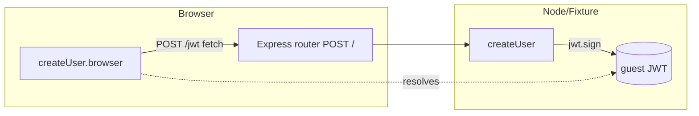
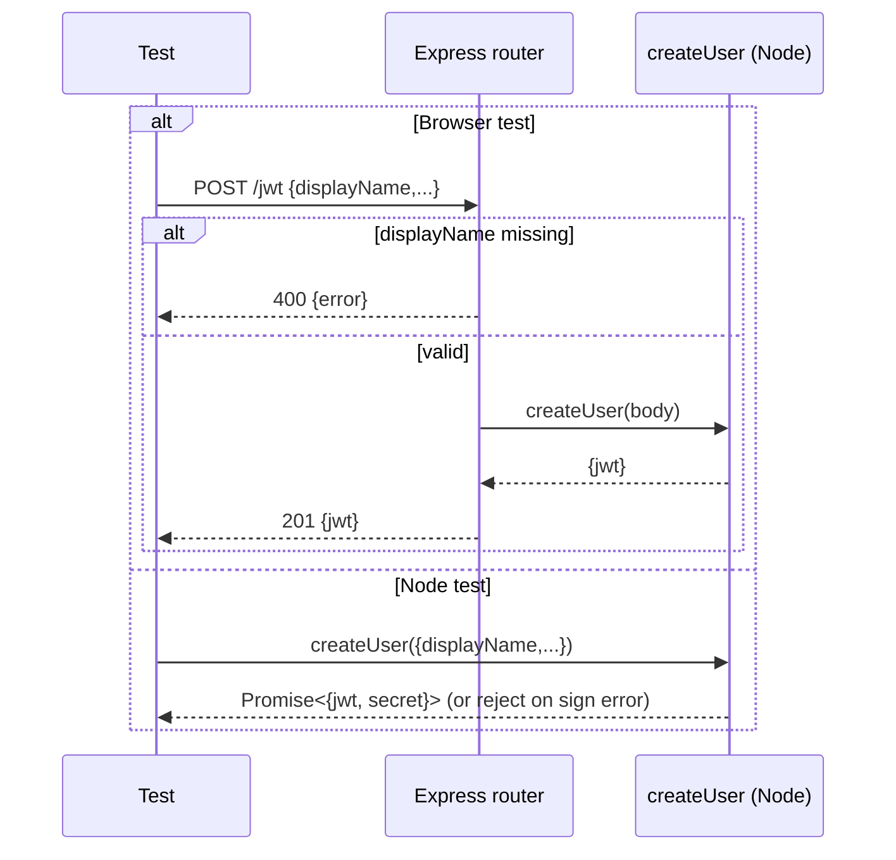

<!-- sdd-generated-metadata
generator: claude-cli
generator_model: us.anthropic.claude-opus-4-8
approved_by: pending-human-review
updated_at: 2026-08-06T00:00:00Z
validation_status: not-run
run_id: 51855eac-8de5-43a2-a3b6-dbcc55ebc91b
-->

# @webex/test-helper-appid — SPEC

> Start here → root [`AGENTS.md`](../../../../AGENTS.md) (agent entry) · router [`SPEC_INDEX.md`](../../../../ai-docs/SPEC_INDEX.md) · system [`ARCHITECTURE.md`](../../../../ai-docs/ARCHITECTURE.md). This is the module's canonical spec: orientation, requirements, design, flows, and tests.
> Context-efficiency: link to canonical docs — don't duplicate them. Load specs on demand per `SPEC_INDEX.md`.

## Metadata

| Field | Value |
|---|---|
| Module id | `test-helper-appid` |
| Source path(s) | `packages/@webex/test-helper-appid/src/` |
| Parent spec | `—` (test-support package consumed by plugin test suites; no parent module) |
| Doc kind | Module spec |
| Coverage score | Pending coverage assessment |
| Generated from | `module-spec` @ SDLC template library `0.2.2` |
| generated_by / approved_by / updated_at | claude-cli / pending-human-review / 2026-08-06 |
| Validation status | not-run, validator `pending`, assessed 2026-08-06 |

Coverage score is `Pending coverage assessment` until the first coverage review runs. Manifest coverage
state (`Partial`) is authoritative and kept in `.sdd/manifest.json`.

## Evidence Rules
Every requirement cites concrete source evidence using `file path`. Test evidence is preferred for WHY.
Requirements are grounded in the current implementation under `src/`.

## Source Material Register

| Source material | Scope | Decision | Detail location or disposition |
|---|---|---|---|
| `N/A` | none | none | No pre-existing SDD/AI-docs, architecture, or spec documents were routed to this module; content is derived from source. |

## Overview

`@webex/test-helper-appid` mints Webex App-ID (guest) JWT tokens for tests that exercise guest-issuer
authentication flows. It exposes two entry points from the barrel `src/index.js`: `createUser`, which
signs a JWT with a guest-issuer secret, and `router`, an Express router that wraps `createUser` as an
HTTP `POST /` endpoint so the fixture server can issue tokens to browser tests over the wire.

The package is isomorphic-aware. In Node it signs tokens directly with `jsonwebtoken`
(`src/create-user.js`). In the browser it cannot hold the guest secret, so the `browser` field in
`package.json` swaps `create-user.js` for `create-user.browser.js`, which instead `POST`s to the local
fixture server (via `@webex/test-helper-make-local-url`) and returns the JWT the server minted. The
`router.js` entry is disabled (`false`) in the browser build because Express is Node-only.

A maintainer should start at `src/create-user.js` (the signing logic and required environment
variables) and `src/router.js` (the HTTP surface used by the fixture server).

## Purpose / Responsibility

Owns generation of guest-issuer App-ID JWTs for tests: sign a JWT from a display name plus a
base64-encoded guest secret, and expose that as both a direct function and an HTTP endpoint. It does NOT
own the fixture server itself, real credential storage, or non-guest authentication.

## Stack

JavaScript (CommonJS), Node `>=18`. Runtime deps: `jsonwebtoken` (signing), `uuid` (subject default),
`safe-buffer` (base64 secret decode), `express` + `body-parser` (HTTP router), and `whatwg-fetch` +
`@webex/test-helper-make-local-url` (browser variant). Built with `@webex/legacy-tools`
(`webex-legacy-tools build`); linted with the legacy ESLint config.

## Folder / Package Structure

```
packages/@webex/test-helper-appid/src/
├── index.js                  # barrel: exports { router, createUser }
├── create-user.js            # Node: signs a guest JWT with jsonwebtoken
├── create-user.browser.js    # browser: POSTs to fixture server, returns jwt
└── router.js                 # Express router: POST / → createUser
```

## Key Files (source of truth)

| File | Holds |
|---|---|
| `packages/@webex/test-helper-appid/src/create-user.js` | JWT payload/options, default expiry (`90 * 60`s), env vars `WEBEX_APPID_ORGID` / `WEBEX_APPID_SECRET` |
| `packages/@webex/test-helper-appid/src/router.js` | HTTP contract: `POST /`, required `displayName`, 201/400 responses |
| `packages/@webex/test-helper-appid/package.json` | `browser` field mapping Node ↔ browser variants |

## Public Surface

Internal Surface — test-support package consumed within the workspace (not published for product use).

| Contract ID | Type | Surface | Purpose | Compatibility / deprecation | Schema / detail link | Root index |
|---|---|---|---|---|---|---|
| `test-helper-appid.createUser` | SDK | `createUser({displayName, expiresInSeconds?, issuer?, userId?}) → Promise<{jwt, secret}>` | Sign a guest App-ID JWT | stable within workspace | `packages/@webex/test-helper-appid/src/create-user.js` | `../../../../ai-docs/CONTRACTS.md` |
| `test-helper-appid.router` | HTTP | `POST /` body `{displayName, ...}` → `201 {jwt}` / `400` | Issue a JWT over HTTP for browser tests | stable within workspace | `packages/@webex/test-helper-appid/src/router.js` | `../../../../ai-docs/CONTRACTS.md` |

Compatibility notes:
- Callers depend on `WEBEX_APPID_ORGID` (default issuer) and `WEBEX_APPID_SECRET` (base64 secret) being
  set in the environment; changing those names is a breaking change for test setups.

## Requires (dependencies)

- `jsonwebtoken` ^9 — JWT signing.
- `uuid` ^3 — default `subject` when `userId` is omitted.
- `safe-buffer` ^5 — decode the base64 `WEBEX_APPID_SECRET`.
- `express` ^4 + `body-parser` ^1 — HTTP router surface.
- `whatwg-fetch` + `@webex/test-helper-make-local-url` (workspace) — browser variant transport.
- Environment: `WEBEX_APPID_SECRET` (required), `WEBEX_APPID_ORGID` (default issuer).

## Requirements

| ID | WHAT | WHY | Source Evidence | Test / Example Evidence | Assumptions / Gaps | Confidence |
|---|---|---|---|---|---|---|
| `TEST-HELPER-APPID-R-001` | `createUser` signs a JWT with `name=displayName`, `expiresIn` defaulting to 5400s, `issuer` defaulting to `WEBEX_APPID_ORGID`, and `subject` defaulting to a UUID | Guest App-ID tokens need deterministic, overridable claims for auth tests | `packages/@webex/test-helper-appid/src/create-user.js` | None found | Defaults assumed stable for consumers | PRESENT |
| `TEST-HELPER-APPID-R-002` | The secret is read from `WEBEX_APPID_SECRET` as base64 and decoded via `safe-buffer` before signing | Guest secrets are provided base64-encoded in CI env | `packages/@webex/test-helper-appid/src/create-user.js` | None found | none | PRESENT |
| `TEST-HELPER-APPID-R-003` | The router rejects requests missing `displayName` with `400` and a JSON error, else returns `201 {jwt}` | Fixture server must validate before signing | `packages/@webex/test-helper-appid/src/router.js` | None found | none | PRESENT |
| `TEST-HELPER-APPID-R-004` | In browser builds, `createUser` POSTs options to the fixture `/jwt` URL and resolves with `body.jwt` instead of signing locally | Browsers must not hold the guest secret | `packages/@webex/test-helper-appid/src/create-user.browser.js` | None found | none | PRESENT |

## Design Overview

The package separates the trusted signing path (Node) from the untrusted client path (browser) using
the `package.json` `browser` field, so the same import (`createUser`) resolves to a secret-holding
signer in Node and a secret-free HTTP client in the browser. `router.js` composes `create-user.js`
behind an Express endpoint so the fixture server can expose signing to browser tests without shipping
the secret to the client. Signing itself is a thin, synchronous `jwt.sign` wrapped in a resolved/rejected
Promise for a uniform async contract.

## Data Flow

Node: caller → `createUser` → `jwt.sign(payload, secret)` → `Promise<{jwt, secret}>`. Browser: caller →
`createUser` → HTTP `POST /jwt` (fetch) → fixture server `router` → `createUser` (Node) → JWT returned in
response body.



## Sequence Diagram(s)

This module has two closely related operation groups (direct Node signing and browser-over-HTTP
signing) that share the same signing core; a single diagram with an `alt` branch covers both, including
the missing-`displayName` rejection.

Sequence coverage:

| Operation group | Diagram | Failure / recovery coverage |
|---|---|---|
| Issue guest JWT (Node + browser) | Guest JWT issuance | `alt` branch: missing `displayName` → 400; `jwt.sign` throw → rejected Promise |



## Class / Component Relationships

Function-based module; no classes. `index.js` composes two independent functions (`createUser`,
`router`); `router` depends on `createUser`; the browser variant of `createUser` depends on
`@webex/test-helper-make-local-url`.

```mermaid
flowchart TD
  index --> createUser
  index --> router
  router --> createUser
  createUserBrowser[createUser.browser] --> makeLocalUrl[@webex/test-helper-make-local-url]
```

## Use Cases

- **UC-1 Sign a guest token in Node:** test calls `createUser({displayName})` → JWT signed with env
  secret → `{jwt, secret}`. Evidence: `packages/@webex/test-helper-appid/src/create-user.js`.
- **UC-2 Issue a token to a browser test:** browser `createUser` POSTs to fixture `/jwt` → router signs
  → JWT returned. Evidence: `packages/@webex/test-helper-appid/src/create-user.browser.js`,
  `packages/@webex/test-helper-appid/src/router.js`.

## Error Handling & Failure Modes

| Condition | Signal (error/code/result) | Caller recovery |
|---|---|---|
| `jwt.sign` throws (bad/missing secret) | Rejected Promise with the thrown error | Fix `WEBEX_APPID_SECRET` and retry |
| Missing `displayName` (HTTP) | `400` JSON `{error}` | Supply `displayName` in the request body |
| Missing `WEBEX_APPID_SECRET` | `Buffer.from(undefined)` / sign failure | Set the env var before running tests |

## Pitfalls

- The browser build must never sign locally — it has no secret. The `package.json` `browser` map is the
  only thing enforcing this; do not import `create-user.js` directly in browser code.
- `expiresInSeconds` is seconds, not ms; the default `90 * 60` is 90 minutes.
- The secret is base64-decoded before signing; passing a raw (non-base64) secret produces invalid tokens.

## Test-Case Strategy (module)

Behavior is exercised indirectly by consuming plugin/integration tests that authenticate as guests;
this package has no co-located unit test directory. A dedicated unit suite should cover claim defaults
(positive) and the router's missing-`displayName` rejection (negative), plus the browser variant's
fetch path with a stubbed server.

| Behavior / Requirement | Existing test evidence | Gap |
|---|---|---|
| `TEST-HELPER-APPID-R-001` | None found | Missing unit coverage of claim defaults |
| `TEST-HELPER-APPID-R-003` | None found | Missing negative test for 400 on absent `displayName` |
| `TEST-HELPER-APPID-R-004` | None found | Missing browser-variant fetch test |

## Traceability
- Repo architecture: `../../../../ai-docs/ARCHITECTURE.md` · Registry: `../../../../ai-docs/SPEC_INDEX.md`
- Coverage state & contracts baseline: `.sdd/manifest.json`
