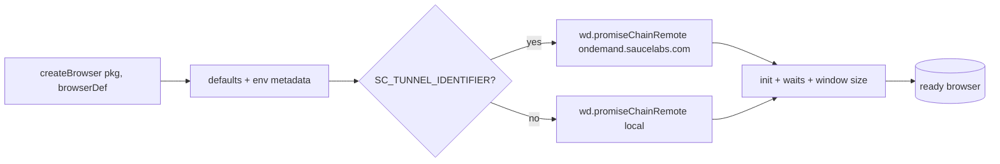
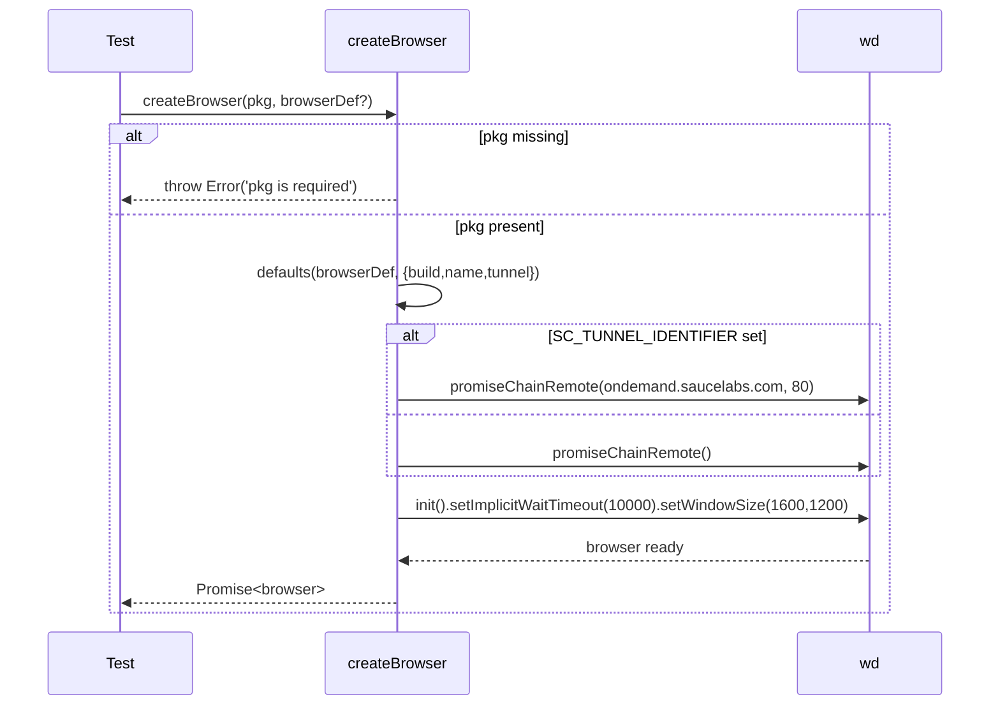
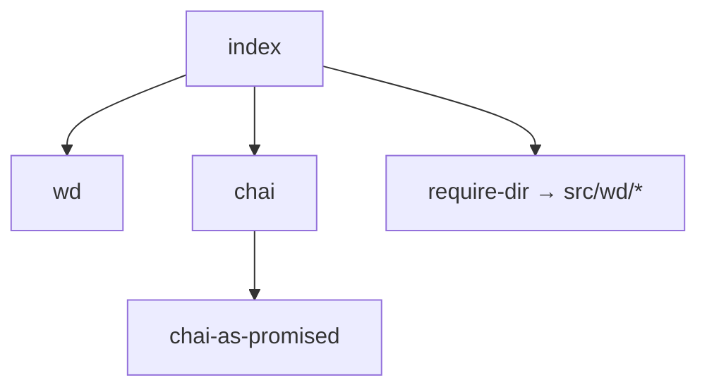

<!-- sdd-generated-metadata
generator: claude-cli
generator_model: us.anthropic.claude-opus-4-8
approved_by: pending-human-review
updated_at: 2026-08-06T00:00:00Z
validation_status: not-run
run_id: 51855eac-8de5-43a2-a3b6-dbcc55ebc91b
-->

# @webex/test-helper-automation — SPEC

> Start here → root [`AGENTS.md`](../../../../AGENTS.md) (agent entry) · router [`SPEC_INDEX.md`](../../../../ai-docs/SPEC_INDEX.md) · system [`ARCHITECTURE.md`](../../../../ai-docs/ARCHITECTURE.md). This is the module's canonical spec: orientation, requirements, design, flows, and tests.
> Context-efficiency: link to canonical docs — don't duplicate them. Load specs on demand per `SPEC_INDEX.md`.

## Metadata

| Field | Value |
|---|---|
| Module id | `test-helper-automation` |
| Source path(s) | `packages/@webex/test-helper-automation/src/` |
| Parent spec | `—` (test-support package consumed by browser-automation test suites; no parent module) |
| Doc kind | Module spec |
| Coverage score | Pending coverage assessment |
| Generated from | `module-spec` @ SDLC template library `0.2.2` |
| generated_by / approved_by / updated_at | claude-cli / pending-human-review / 2026-08-06 |
| Validation status | not-run, validator `pending`, assessed 2026-08-06 |

Coverage score is `Pending coverage assessment` until the first coverage review runs. Manifest coverage
state (`Partial`) is authoritative and kept in `.sdd/manifest.json`.

## Evidence Rules
Every requirement cites concrete source evidence using `file path`. Test evidence is preferred for WHY.
Requirements are grounded in the current implementation under `src/`.

## Source Material Register

| Source material | Scope | Decision | Detail location or disposition |
|---|---|---|---|
| `N/A` | none | none | No pre-existing SDD/AI-docs, architecture, or spec documents were routed to this module; content is derived from source. |

## Overview

`@webex/test-helper-automation` wraps the `wd` (WebDriver) client to give integration/E2E tests a
pre-configured Selenium browser session. Its barrel `src/index.js` wires `chai` with `chai-as-promised`
(bridging `wd`'s promise chains into chai assertions), auto-loads any custom `wd` command definitions
from `src/wd/` via `require-dir`, and exports `createBrowser` plus the raw `wd` module.

`createBrowser(pkg, browserDef)` produces a `wd.promiseChainRemote` browser: it fills in Sauce Labs
build/name/tunnel metadata from environment variables and defaults the browser to Chrome when no
definition is given. When `SC_TUNNEL_IDENTIFIER` is set it targets `ondemand.saucelabs.com`; otherwise it
uses a local WebDriver endpoint. It initializes the session with a 10s implicit wait and a 1600×1200
window.

A maintainer should start at `src/index.js`, which contains the full `createBrowser` implementation and
the chai/`wd` wiring; custom command extensions live under `src/wd/`.

## Purpose / Responsibility

Owns creation and standard configuration of `wd` WebDriver browser sessions for automated browser tests
(Sauce Labs or local). It does NOT own the tests themselves, the fixture server, or non-browser test
harnesses.

## Stack

JavaScript (CommonJS), Node `>=18`. Deps: `wd` (WebDriver client, devDependency), `chai` +
`chai-as-promised` (assertions), `lodash` (`defaults`), `require-dir` (auto-load `src/wd/`),
`es6-promise` (polyfill). Built with `@webex/legacy-tools`; linted with the legacy ESLint config.

## Folder / Package Structure

```
packages/@webex/test-helper-automation/src/
├── index.js     # barrel: chai+wd wiring, createBrowser, exports { createBrowser, wd }
└── wd/          # custom wd command definitions, auto-loaded via require-dir
```

## Key Files (source of truth)

| File | Holds |
|---|---|
| `packages/@webex/test-helper-automation/src/index.js` | `createBrowser` logic, Sauce/tunnel env wiring, chai-as-promised setup, `wd` export |
| `packages/@webex/test-helper-automation/package.json` | `wd` and chai dependency versions, build/test scripts |

## Public Surface

Internal Surface — test-support package consumed within the workspace (not published for product use).

| Contract ID | Type | Surface | Purpose | Compatibility / deprecation | Schema / detail link | Root index |
|---|---|---|---|---|---|---|
| `test-helper-automation.createBrowser` | SDK | `createBrowser(pkg, browserDef?) → Promise<wd browser>` | Create a configured WebDriver session | stable within workspace | `packages/@webex/test-helper-automation/src/index.js` | `../../../../ai-docs/CONTRACTS.md` |
| `test-helper-automation.wd` | SDK | `wd` module re-export | Access raw WebDriver client | stable within workspace | `packages/@webex/test-helper-automation/src/index.js` | `../../../../ai-docs/CONTRACTS.md` |

Compatibility notes:
- Behavior depends on env vars `SC_TUNNEL_IDENTIFIER`, `BUILD_NUMBER`, and `USER`; changing their
  interpretation affects Sauce Labs routing.

## Requires (dependencies)

- `wd` — WebDriver client (session creation, promise chains).
- `chai` + `chai-as-promised` — assertion integration with `wd` promise chains.
- `lodash.defaults` — merge caller `browserDef` with computed defaults.
- `require-dir` — auto-load custom command modules from `src/wd/`.
- Environment: `SC_TUNNEL_IDENTIFIER` (Sauce tunnel), `BUILD_NUMBER`, `USER` (build naming).

## Requirements

| ID | WHAT | WHY | Source Evidence | Test / Example Evidence | Assumptions / Gaps | Confidence |
|---|---|---|---|---|---|---|
| `TEST-HELPER-AUTOMATION-R-001` | `createBrowser` throws when `pkg` is not provided | Session build/name metadata is derived from `pkg` | `packages/@webex/test-helper-automation/src/index.js` | None found | none | PRESENT |
| `TEST-HELPER-AUTOMATION-R-002` | When no `browserDef` is given, it defaults to `{browserName: 'chrome'}` | Provide a sensible default target | `packages/@webex/test-helper-automation/src/index.js` | None found | none | PRESENT |
| `TEST-HELPER-AUTOMATION-R-003` | When `SC_TUNNEL_IDENTIFIER` is set, connect to `ondemand.saucelabs.com:80`; otherwise use the default local remote | Route CI runs through Sauce Labs, local runs to a local driver | `packages/@webex/test-helper-automation/src/index.js` | None found | none | PRESENT |
| `TEST-HELPER-AUTOMATION-R-004` | Initialized sessions set a 10000ms implicit wait and a 1600×1200 window | Stabilize element lookups and layout across tests | `packages/@webex/test-helper-automation/src/index.js` | None found | none | PRESENT |
| `TEST-HELPER-AUTOMATION-R-005` | `chai-as-promised.transferPromiseness` is bound to `wd.transferPromiseness` so chai works across `wd` chains | Allow assertions on WebDriver promise chains | `packages/@webex/test-helper-automation/src/index.js` | None found | none | PRESENT |

## Design Overview

The module centralizes WebDriver session bootstrapping so individual tests do not repeat Sauce Labs and
window/timeout configuration. It leans on `lodash.defaults` to let callers override any field of the
browser definition while still supplying build metadata for Sauce dashboards. The chai/`wd` promise
bridging is done once at import time, and `require-dir` lets teams drop custom WebDriver commands into
`src/wd/` without editing the barrel.

## Data Flow

Caller passes `pkg` + optional `browserDef` → defaults merged (build/name/tunnel from env) → `wd`
remote selected (Sauce vs local) → `browser.init(...).setImplicitWaitTimeout(...).setWindowSize(...)`
→ resolves with the ready `browser`.



## Sequence Diagram(s)

Single operation group (create a browser session); the environment branch is shown as `alt`. This is a
single-purpose helper, so one diagram is sufficient.

Sequence coverage:

| Operation group | Diagram | Failure / recovery coverage |
|---|---|---|
| Create WebDriver session | Session bootstrap | `alt` Sauce vs local; throws synchronously when `pkg` missing |



## Class / Component Relationships

Function-based module; no classes. `index.js` composes `wd`, `chai`/`chai-as-promised`, `lodash`, and
`require-dir`, exposing `createBrowser` and `wd`.



## Use Cases

- **UC-1 Start a Chrome session locally:** test calls `createBrowser(pkg)` with no `browserDef` → local
  `wd` remote → configured Chrome session. Evidence: `packages/@webex/test-helper-automation/src/index.js`.
- **UC-2 Run on Sauce Labs:** with `SC_TUNNEL_IDENTIFIER` set, `createBrowser(pkg, def)` targets Sauce
  and tags the build. Evidence: `packages/@webex/test-helper-automation/src/index.js`.

## Error Handling & Failure Modes

| Condition | Signal (error/code/result) | Caller recovery |
|---|---|---|
| `pkg` omitted | Thrown `Error('pkg is required')` | Pass the package.json object |
| No browser definition resolvable | Thrown `Error('No browser definition available')` | Provide a `browserDef` |
| `wd` session init fails | Rejected promise from `wd` | Inspect driver/Sauce connectivity |

## Pitfalls

- `createBrowser` is Sauce/tunnel-aware only via env vars; forgetting `SC_TUNNEL_IDENTIFIER` silently
  runs against a local driver instead of Sauce.
- Custom commands must live under `src/wd/` to be auto-loaded by `require-dir`; files elsewhere are
  ignored.
- `wd` is a devDependency; consumers must have a WebDriver endpoint available.

## Test-Case Strategy (module)

Exercised indirectly by browser E2E/integration suites; no co-located unit tests exist. A unit suite
should assert the `pkg`-required throw (negative) and the Sauce-vs-local remote selection (positive) by
stubbing `wd`.

| Behavior / Requirement | Existing test evidence | Gap |
|---|---|---|
| `TEST-HELPER-AUTOMATION-R-001` | None found | Missing negative test for absent `pkg` |
| `TEST-HELPER-AUTOMATION-R-003` | None found | Missing test for Sauce vs local branch |

## Traceability
- Repo architecture: `../../../../ai-docs/ARCHITECTURE.md` · Registry: `../../../../ai-docs/SPEC_INDEX.md`
- Coverage state & contracts baseline: `.sdd/manifest.json`
