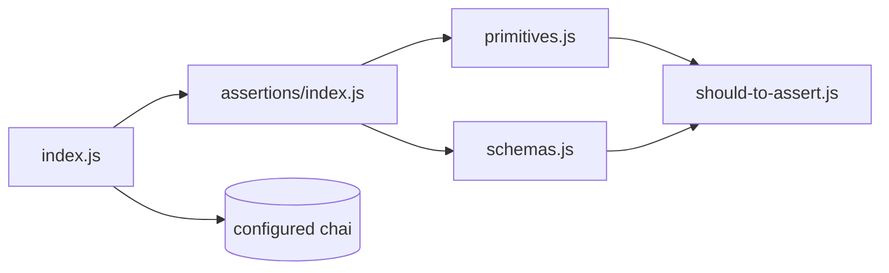
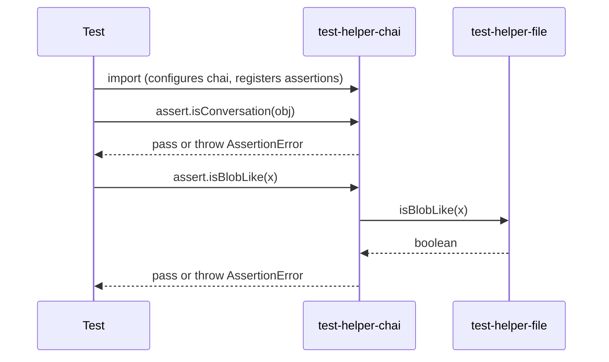

<!-- sdd-generated-metadata
generator: claude-cli
generator_model: us.anthropic.claude-opus-4-8
approved_by: pending-human-review
updated_at: 2026-08-06T00:00:00Z
validation_status: not-run
run_id: 51855eac-8de5-43a2-a3b6-dbcc55ebc91b
-->

# @webex/test-helper-chai — SPEC

> Start here → root [`AGENTS.md`](../../../../AGENTS.md) (agent entry) · router [`SPEC_INDEX.md`](../../../../ai-docs/SPEC_INDEX.md) · system [`ARCHITECTURE.md`](../../../../ai-docs/ARCHITECTURE.md). This is the module's canonical spec: orientation, requirements, design, flows, and tests.
> Context-efficiency: link to canonical docs — don't duplicate them. Load specs on demand per `SPEC_INDEX.md`.

## Metadata

| Field | Value |
|---|---|
| Module id | `test-helper-chai` |
| Source path(s) | `packages/@webex/test-helper-chai/src/` |
| Parent spec | `—` (test-support package consumed by plugin test suites; no parent module) |
| Doc kind | Module spec |
| Coverage score | Pending coverage assessment |
| Generated from | `module-spec` @ SDLC template library `0.2.2` |
| generated_by / approved_by / updated_at | claude-cli / pending-human-review / 2026-08-06 |
| Validation status | not-run, validator `pending`, assessed 2026-08-06 |

Coverage score is `Pending coverage assessment` until the first coverage review runs. Manifest coverage
state (`Partial`) is authoritative and kept in `.sdd/manifest.json`.

## Evidence Rules
Every requirement cites concrete source evidence using `file path`. Test evidence is preferred for WHY.
Requirements are grounded in the current implementation under `src/`.

## Source Material Register

| Source material | Scope | Decision | Detail location or disposition |
|---|---|---|---|
| `N/A` | none | none | No pre-existing SDD/AI-docs, architecture, or spec documents were routed to this module; content is derived from source. |

## Overview

`@webex/test-helper-chai` is a pre-configured `chai` instance extended with Webex-specific assertions.
The barrel `src/index.js` calls `chai.use(registerAssertions)`, disables truncation
(`chai.config.truncateThreshold = 0`), exposes sinon assertions on `chai.assert` via
`sinon.assert.expose`, and re-exports the configured `chai`. Consumers import this package instead of
raw `chai` so every test suite shares the same custom matchers.

`src/assertions/index.js` registers the extensions: an IE11-compatible `rejectedWith` /
`assert.isRejected` (adapted from `chai-as-promised` using `check-error`), `statusCode`, and file-type
predicates (`blobLike`, `bufferLike`) delegating to `@webex/test-helper-file`. It then composes two
sub-registrars: `primitives.js` (type-shape matchers like `uuid`, `email`, `isoDate`, `hydraId`,
`properties`, `strictProperties`) and `schemas.js` (domain object matchers such as `Activity`,
`Conversation`, `Message`, `Person`, `Room`, `Team`, `Webhook`, and encryption-related shapes).
`should-to-assert.js` mirrors each should/property assertion into a matching `assert.isXxx` function.

A maintainer should start at `src/assertions/index.js` (the registration entry) and the two registrars
it composes.

## Purpose / Responsibility

Owns a single, shared, extended `chai` instance with Webex-domain assertions (schemas, primitives,
promise rejection, HTTP status, file-type). It does NOT own test execution, sinon itself, or the file
predicates' implementations (those live in `@webex/test-helper-file`).

## Stack

JavaScript (CommonJS), Node `>=18`. Deps: `chai` (base), `sinon` (assert exposure), `check-error`
(rejection matching), `lodash`, and `@webex/test-helper-file` (blob/buffer predicates). Built with
`@webex/legacy-tools`; linted with the legacy ESLint config.

## Folder / Package Structure

```
packages/@webex/test-helper-chai/src/
├── index.js                    # barrel: configure chai, expose sinon asserts, export chai
└── assertions/
    ├── index.js                # registerAssertions: rejectedWith, statusCode, blob/buffer + compose
    ├── primitives.js           # uuid/email/isoDate/hydraId/properties/strictProperties
    ├── schemas.js              # domain object matchers (Activity, Conversation, Message, ...)
    └── should-to-assert.js     # mirror should/property assertions into assert.isXxx
```

## Key Files (source of truth)

| File | Holds |
|---|---|
| `packages/@webex/test-helper-chai/src/index.js` | chai configuration (`truncateThreshold`, sinon expose) |
| `packages/@webex/test-helper-chai/src/assertions/index.js` | `rejectedWith`/`isRejected`, `statusCode`, `blobLike`/`bufferLike` |
| `packages/@webex/test-helper-chai/src/assertions/schemas.js` | canonical property lists for each Webex domain object |
| `packages/@webex/test-helper-chai/src/assertions/primitives.js` | uuid/email/isoDate/hydraId regexes and property matchers |

## Public Surface

Internal Surface — test-support package consumed within the workspace (not published for product use).
The public surface is the configured `chai` export and the custom assertions registered onto it.

| Contract ID | Type | Surface | Purpose | Compatibility / deprecation | Schema / detail link | Root index |
|---|---|---|---|---|---|---|
| `test-helper-chai.chai` | SDK | `module.exports = chai` (configured) | Shared extended chai instance | stable within workspace | `packages/@webex/test-helper-chai/src/index.js` | `../../../../ai-docs/CONTRACTS.md` |
| `test-helper-chai.isRejected` | SDK | `assert.isRejected(promise, errorLike?, msgMatcher?, msg?)` | IE11-safe promise-rejection assertion | stable within workspace | `packages/@webex/test-helper-chai/src/assertions/index.js` | `../../../../ai-docs/CONTRACTS.md` |
| `test-helper-chai.schemas` | SDK | `assert.isConversation/isMessage/isPerson/...` and matching properties | Assert Webex domain object shapes | stable within workspace | `packages/@webex/test-helper-chai/src/assertions/schemas.js` | `../../../../ai-docs/CONTRACTS.md` |
| `test-helper-chai.primitives` | SDK | `uuid`/`email`/`isoDate`/`hydraId`/`properties`/`strictProperties` | Assert value shapes | stable within workspace | `packages/@webex/test-helper-chai/src/assertions/primitives.js` | `../../../../ai-docs/CONTRACTS.md` |

Compatibility notes:
- The property lists in `schemas.js` are the compatibility contract: adding a required property to a
  schema matcher can break existing passing tests.

## Requires (dependencies)

- `chai` — base assertion library being extended.
- `sinon` — `sinon.assert.expose(chai.assert, {prefix: ''})` adds sinon matchers.
- `check-error` — instance/constructor/message compatibility checks for `rejectedWith`.
- `@webex/test-helper-file` — `isBlobLike`/`isBufferLike` implementations behind the matchers.
- `lodash` — utilities in the registrars.

## Requirements

| ID | WHAT | WHY | Source Evidence | Test / Example Evidence | Assumptions / Gaps | Confidence |
|---|---|---|---|---|---|---|
| `TEST-HELPER-CHAI-R-001` | The exported `chai` is configured with `truncateThreshold = 0` and sinon assertions exposed on `chai.assert` with empty prefix | Full diffs and sinon matchers must be available everywhere | `packages/@webex/test-helper-chai/src/index.js` | None found | none | PRESENT |
| `TEST-HELPER-CHAI-R-002` | `rejectedWith`/`assert.isRejected` assert a promise rejects, optionally matching an error-like and message, without `chai-as-promised` | `chai-as-promised` is incompatible with IE11 | `packages/@webex/test-helper-chai/src/assertions/index.js` | None found | none | PRESENT |
| `TEST-HELPER-CHAI-R-003` | `blobLike`/`bufferLike` (and their `assert.isBlobLike`/`isBufferLike`) delegate to `@webex/test-helper-file` predicates | Single source of truth for file-type detection | `packages/@webex/test-helper-chai/src/assertions/index.js` | None found | none | PRESENT |
| `TEST-HELPER-CHAI-R-004` | Primitive matchers enforce uuid/email/isoDate patterns and `hydraId` as a non-UUID string; `strictProperties` asserts exact key set | Validate value shapes returned by the API | `packages/@webex/test-helper-chai/src/assertions/primitives.js` | None found | none | PRESENT |
| `TEST-HELPER-CHAI-R-005` | Schema matchers assert required properties (and nested invariants) for Webex domain objects (Activity, Conversation, Message, Person, Room, Team, TeamMembership, Webhook, encryption shapes) | Assert API/domain response contracts consistently | `packages/@webex/test-helper-chai/src/assertions/schemas.js` | None found | none | PRESENT |
| `TEST-HELPER-CHAI-R-006` | Each should/property assertion has a mirrored `assert.isXxx` (name computed as `is<Capitalized>` unless overridden) | Support both should- and assert-style tests | `packages/@webex/test-helper-chai/src/assertions/should-to-assert.js` | None found | none | PRESENT |

## Design Overview

Configuration happens once at import time so all consumers share identical chai state. The assertions are
layered: a core registrar (`assertions/index.js`) adds cross-cutting matchers and then composes two
focused registrars (primitives, schemas). Schema matchers reuse primitive matchers (e.g. `isHydraID`,
`isEmail`, `isISODate`) rather than re-encoding patterns, so the property/pattern definitions have a
single home. `should-to-assert.js` removes duplication by generating assert-style wrappers from the
should-style definitions.

## Data Flow

Import → `index.js` configures chai and calls `registerAssertions` → `assertions/index.js` adds core
matchers and invokes `primitives(chai)` then `schemas(chai)` → each registrar adds `Assertion` methods/
properties and mirrors them onto `chai.assert` via `should-to-assert` → configured `chai` returned.



## Sequence Diagram(s)

Single operation group (register-and-use assertions) — this is a composition/registration module, so one
diagram is sufficient.

Sequence coverage:

| Operation group | Diagram | Failure / recovery coverage |
|---|---|---|
| Register and assert | Assertion registration + use | Assertion failure throws chai `AssertionError`; `isRejected` rejects if promise fulfills |



## Class / Component Relationships

Function-based registrars operating on chai's `Assertion`/`assert`. `assertions/index.js` composes
`primitives` and `schemas`; both use `should-to-assert`; core file matchers delegate to
`@webex/test-helper-file`.

```mermaid
flowchart TD
  index --> assertionsIndex[assertions/index]
  assertionsIndex --> primitives
  assertionsIndex --> schemas
  primitives --> shouldToAssert[should-to-assert]
  schemas --> shouldToAssert
  assertionsIndex --> file[@webex/test-helper-file]
```

## Use Cases

- **UC-1 Assert a domain object shape:** test calls `assert.isMessage(msg)` → schema matcher verifies
  required properties and nested id/email/date shapes. Evidence:
  `packages/@webex/test-helper-chai/src/assertions/schemas.js`.
- **UC-2 Assert a rejected promise in IE11-safe code:** test calls `assert.isRejected(p, Error, /msg/)`
  → `rejectedWith` verifies rejection and error match. Evidence:
  `packages/@webex/test-helper-chai/src/assertions/index.js`.

## Error Handling & Failure Modes

| Condition | Signal (error/code/result) | Caller recovery |
|---|---|---|
| Assertion not satisfied | chai `AssertionError` thrown | Fix the value under test |
| `isRejected` given a promise that fulfills | Assertion failure ("rejected but fulfilled") | Ensure the code path rejects |
| Object missing a required schema property | `AssertionError` naming the property | Populate the property or use a different matcher |

## Pitfalls

- This is a distinct chai instance from `@webex/test-helper-mock-webex`'s internal chai — do not assume
  a single global chai; mixing instances can lose custom matchers.
- Schema property lists are strict contracts; `strictProperties` fails on extra keys, not just missing
  ones.
- `hydraId` asserts a string that is NOT a UUID; passing a raw UUID fails intentionally.

## Test-Case Strategy (module)

Exercised pervasively by the whole workspace's test suites; no co-located unit tests for the matchers
themselves. A unit suite should cover a passing and failing case per matcher family (positive/negative),
especially the IE11-safe `isRejected` fulfilled-promise path and `strictProperties` extra-key rejection.

| Behavior / Requirement | Existing test evidence | Gap |
|---|---|---|
| `TEST-HELPER-CHAI-R-002` | None found | Missing negative test: fulfilled promise passed to `isRejected` |
| `TEST-HELPER-CHAI-R-004` | None found | Missing `strictProperties` extra-key negative test |
| `TEST-HELPER-CHAI-R-005` | None found | Missing per-schema positive/negative coverage |

## Traceability
- Repo architecture: `../../../../ai-docs/ARCHITECTURE.md` · Registry: `../../../../ai-docs/SPEC_INDEX.md`
- Coverage state & contracts baseline: `.sdd/manifest.json`
