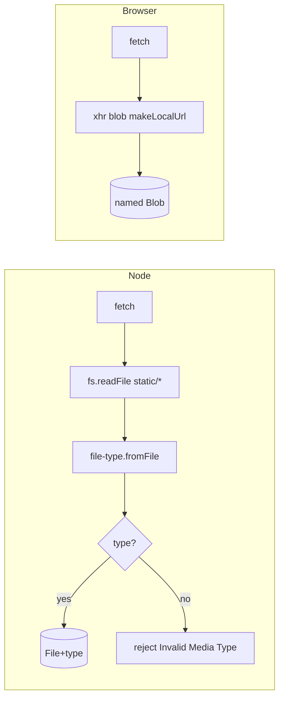
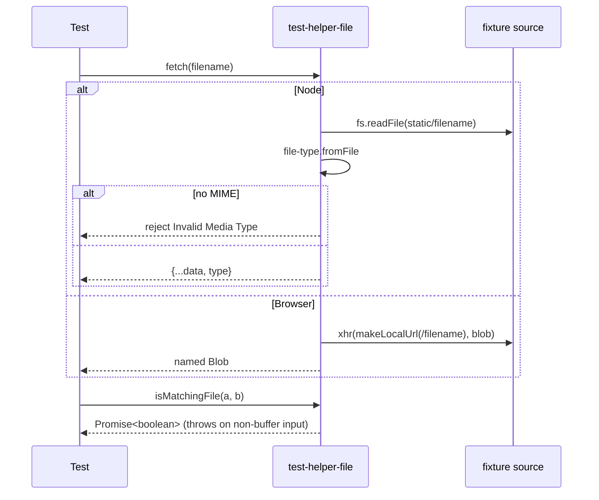

<!-- sdd-generated-metadata
generator: claude-cli
generator_model: us.anthropic.claude-opus-4-8
approved_by: pending-human-review
updated_at: 2026-08-06T00:00:00Z
validation_status: not-run
run_id: 51855eac-8de5-43a2-a3b6-dbcc55ebc91b
-->

# @webex/test-helper-file — SPEC

> Start here → root [`AGENTS.md`](../../../../AGENTS.md) (agent entry) · router [`SPEC_INDEX.md`](../../../../ai-docs/SPEC_INDEX.md) · system [`ARCHITECTURE.md`](../../../../ai-docs/ARCHITECTURE.md). This is the module's canonical spec: orientation, requirements, design, flows, and tests.
> Context-efficiency: link to canonical docs — don't duplicate them. Load specs on demand per `SPEC_INDEX.md`.

## Metadata

| Field | Value |
|---|---|
| Module id | `test-helper-file` |
| Source path(s) | `packages/@webex/test-helper-file/src/` |
| Parent spec | `—` (test-support package consumed by plugin test suites; no parent module) |
| Doc kind | Module spec |
| Coverage score | Pending coverage assessment |
| Generated from | `module-spec` @ SDLC template library `0.2.2` |
| generated_by / approved_by / updated_at | claude-cli / pending-human-review / 2026-08-06 |
| Validation status | not-run, validator `pending`, assessed 2026-08-06 |

Coverage score is `Pending coverage assessment` until the first coverage review runs. Manifest coverage
state (`Partial`) is authoritative and kept in `.sdd/manifest.json`.

## Evidence Rules
Every requirement cites concrete source evidence using `file path`. Test evidence is preferred for WHY.
Requirements are grounded in the current implementation under `src/`.

## Source Material Register

| Source material | Scope | Decision | Detail location or disposition |
|---|---|---|---|
| `N/A` | none | none | No pre-existing SDD/AI-docs, architecture, or spec documents were routed to this module; content is derived from source. |

## Overview

`@webex/test-helper-file` provides isomorphic file helpers for tests: fetch a fixture file, detect
whether a value is buffer/blob-like, and compare two files byte-for-byte. It is isomorphic via the
`package.json` `browser` field, which swaps `src/file.js` (Node) for `src/file.shim.js` (browser).

In Node (`src/file.js`), `fetch`/`fetchWithoutMagic` read a fixture from the sibling
`@webex/test-helper-server/static` directory using `fs.readFile`; `fetch` additionally runs `file-type`'s
`fromFile` and rejects with `Invalid Media Type` when the MIME type cannot be determined. `isBufferLike`
and `isBlobLike` both delegate to `@webex/common`'s `isBuffer`, and `isMatchingFile` compares two
buffers (using `Buffer#equals` when available, else a byte loop).

In the browser (`src/file.shim.js`), `fetch` uses `xhr` against a local URL from
`@webex/test-helper-make-local-url` with `responseType: 'blob'`; `isBlobLike`/`isBufferLike` check
`Blob`/`ArrayBuffer`; and `isMatchingFile` normalizes `Blob`/`Uint8Array`/`ArrayBuffer` inputs to
`ArrayBuffer` before comparing bytes.

A maintainer should start at `src/file.js` and `src/file.shim.js`; `src/index.js` only re-exports the
resolved implementation.

## Purpose / Responsibility

Owns test-time file access and comparison across Node and browser: fetch fixtures, classify
buffer/blob types, and compare file contents. It does NOT own the fixture files themselves (those live
in `@webex/test-helper-server/static`) nor production file handling.

## Stack

JavaScript (ES modules in `file.js`; CommonJS in `file.shim.js`/`index.js`), Node `>=18`. Deps:
`file-type` (MIME detection, Node), `@webex/common` (`isBuffer`), `xhr` (browser fetch),
`@webex/test-helper-make-local-url` (browser URL), `es6-promise` (polyfill). Built with
`@webex/legacy-tools`.

## Folder / Package Structure

```
packages/@webex/test-helper-file/src/
├── index.js        # barrel: re-exports ./file (Node) or ./file.shim (browser)
├── file.js         # Node: fs-based fetch + file-type, buffer compare
└── file.shim.js    # browser: xhr blob fetch, ArrayBuffer normalization + compare
```

## Key Files (source of truth)

| File | Holds |
|---|---|
| `packages/@webex/test-helper-file/src/file.js` | Node fixture path (`@webex/test-helper-server/static`), `file-type` MIME check, buffer compare |
| `packages/@webex/test-helper-file/src/file.shim.js` | Browser xhr blob fetch, `Blob`/`ArrayBuffer` predicates, ArrayBuffer normalization |
| `packages/@webex/test-helper-file/package.json` | `browser` field swapping `file.js` ↔ `file.shim.js` |

## Public Surface

Internal Surface — test-support package consumed within the workspace (not published for product use).

| Contract ID | Type | Surface | Purpose | Compatibility / deprecation | Schema / detail link | Root index |
|---|---|---|---|---|---|---|
| `test-helper-file.fetch` | SDK | `fetch(filename) → Promise<File>` | Fetch a fixture (Node validates MIME) | stable within workspace | `packages/@webex/test-helper-file/src/file.js` | `../../../../ai-docs/CONTRACTS.md` |
| `test-helper-file.fetchWithoutMagic` | SDK | `fetchWithoutMagic(filename) → Promise<File>` | Fetch without MIME validation (Node) | stable within workspace | `packages/@webex/test-helper-file/src/file.js` | `../../../../ai-docs/CONTRACTS.md` |
| `test-helper-file.isBufferLike` | SDK | `isBufferLike(file) → boolean` | Type predicate | stable within workspace | `packages/@webex/test-helper-file/src/file.js` | `../../../../ai-docs/CONTRACTS.md` |
| `test-helper-file.isBlobLike` | SDK | `isBlobLike(file) → boolean` | Type predicate | stable within workspace | `packages/@webex/test-helper-file/src/file.js` | `../../../../ai-docs/CONTRACTS.md` |
| `test-helper-file.isMatchingFile` | SDK | `isMatchingFile(left, right) → Promise<boolean>` | Byte-for-byte compare | stable within workspace | `packages/@webex/test-helper-file/src/file.js` | `../../../../ai-docs/CONTRACTS.md` |

Compatibility notes:
- Node and browser variants differ semantically (`isBufferLike` is `isBuffer` in Node vs `ArrayBuffer` in
  the browser); tests must not assume identical behavior across environments.

## Requires (dependencies)

- `@webex/common` — `isBuffer` used by Node predicates.
- `file-type` — `fromFile` MIME detection in Node `fetch`.
- `@webex/test-helper-server` — supplies the `static/` fixture directory read in Node.
- `xhr` + `@webex/test-helper-make-local-url` (workspace) — browser fetch path.
- Environment (browser): `FIXTURE_PORT` (via `make-local-url`).

## Requirements

| ID | WHAT | WHY | Source Evidence | Test / Example Evidence | Assumptions / Gaps | Confidence |
|---|---|---|---|---|---|---|
| `TEST-HELPER-FILE-R-001` | Node `fetchWithoutMagic` reads `<test-helper-server>/static/<filename>` and resolves with the data plus `name` | Tests need a stable fixture source | `packages/@webex/test-helper-file/src/file.js` | None found | Relies on the sibling server package's static dir | PRESENT |
| `TEST-HELPER-FILE-R-002` | Node `fetch` runs `file-type.fromFile` and rejects with `Invalid Media Type` when no MIME type is detected | Fixtures used in upload tests must have a resolvable type | `packages/@webex/test-helper-file/src/file.js` | None found | none | PRESENT |
| `TEST-HELPER-FILE-R-003` | `isMatchingFile` throws when either argument is not buffer-like, else resolves a boolean byte comparison | Prevent silent false matches on wrong input types | `packages/@webex/test-helper-file/src/file.js` | None found | none | PRESENT |
| `TEST-HELPER-FILE-R-004` | Browser `fetch` retrieves the file via `xhr` as a `blob` from the local fixture URL and names it | Browser tests cannot use `fs` | `packages/@webex/test-helper-file/src/file.shim.js` | None found | none | PRESENT |
| `TEST-HELPER-FILE-R-005` | Browser `isMatchingFile` normalizes `Blob`/`Uint8Array`/`ArrayBuffer` to `ArrayBuffer` before comparing, throwing on unknown types | Uniform comparison across browser file representations | `packages/@webex/test-helper-file/src/file.shim.js` | None found | none | PRESENT |

## Design Overview

The package hides environment differences behind one import: the `browser` field selects the correct
implementation, and both expose the same function names (`fetch`, `fetchWithoutMagic`, `isBufferLike`,
`isBlobLike`, `isMatchingFile`) so test code stays isomorphic. Node validates MIME (needed by upload
tests) and reuses `@webex/common`'s `isBuffer` to avoid duplicating buffer detection; the browser shim
converts every supported representation to `ArrayBuffer` so comparison logic is single-pathed.

## Data Flow

Node: `fetch(name)` → `fs.readFile(static/name)` → `file-type.fromFile` → `{...data, type}` or reject.
Browser: `fetch(name)` → `xhr(makeLocalUrl('/name'), blob)` → named blob. Compare: two files →
(normalize) → byte-equality → boolean.



## Sequence Diagram(s)

Two operation groups — fetch a fixture and compare files — but each is a simple pass-through with an
environment `alt`; one combined diagram with branches is sufficient.

Sequence coverage:

| Operation group | Diagram | Failure / recovery coverage |
|---|---|---|
| Fetch fixture / compare files | File fetch and compare | `alt` Node vs browser; reject on unresolvable MIME; throw on non-buffer compare input |



## Class / Component Relationships

Function-based module; no classes. `index.js` re-exports the resolved variant; Node variant depends on
`fs`/`file-type`/`@webex/common`; browser variant depends on `xhr`/`@webex/test-helper-make-local-url`.

```mermaid
flowchart TD
  index --> fileNode[file.js Node]
  index --> fileShim[file.shim.js browser]
  fileNode --> common[@webex/common isBuffer]
  fileNode --> fileType[file-type]
  fileShim --> makeLocalUrl[@webex/test-helper-make-local-url]
  fileShim --> xhr
```

## Use Cases

- **UC-1 Load a typed fixture for an upload test (Node):** `fetch('sample.png')` → buffer with detected
  `type`. Evidence: `packages/@webex/test-helper-file/src/file.js`.
- **UC-2 Verify a round-tripped file matches the original:** `isMatchingFile(original, downloaded)` →
  boolean. Evidence: `packages/@webex/test-helper-file/src/file.js`,
  `packages/@webex/test-helper-file/src/file.shim.js`.

## Error Handling & Failure Modes

| Condition | Signal (error/code/result) | Caller recovery |
|---|---|---|
| Fixture not found (Node) | Rejected promise with `fs` error | Check the fixture exists in `test-helper-server/static` |
| MIME type undetectable (Node `fetch`) | Reject `Invalid Media Type` | Use `fetchWithoutMagic` or a typed fixture |
| Non-buffer argument to `isMatchingFile` (Node) | Thrown `Error('`left`/`right` must be a `Buffer`')` | Pass buffers |
| Unknown type to browser `isMatchingFile` | Thrown `Error('Could not determine type of `file`')` | Pass `Blob`/`ArrayBuffer`/`Uint8Array` |

## Pitfalls

- Node and browser predicates are NOT equivalent: `isBufferLike` is `isBuffer` (Node) vs
  `instanceof ArrayBuffer` (browser). Cross-env tests must account for this.
- The Node `fetch` path is coupled to the physical layout `../../../@webex/test-helper-server/static`;
  moving fixtures breaks it.
- `fetch` (Node) rejects on undetectable MIME even though the bytes loaded fine — use
  `fetchWithoutMagic` when type detection is not required.

## Test-Case Strategy (module)

Exercised by plugin tests that load fixtures (e.g. encryption/conversation upload tests); no co-located
unit tests. A unit suite should cover a typed-fixture fetch (positive) and the `Invalid Media Type`
rejection (negative), plus `isMatchingFile` equal and unequal buffers.

| Behavior / Requirement | Existing test evidence | Gap |
|---|---|---|
| `TEST-HELPER-FILE-R-002` | None found | Missing negative test for undetectable MIME |
| `TEST-HELPER-FILE-R-003` | None found | Missing non-buffer input throw test |
| `TEST-HELPER-FILE-R-005` | None found | Missing browser normalization/compare tests |

## Traceability
- Repo architecture: `../../../../ai-docs/ARCHITECTURE.md` · Registry: `../../../../ai-docs/SPEC_INDEX.md`
- Coverage state & contracts baseline: `.sdd/manifest.json`
