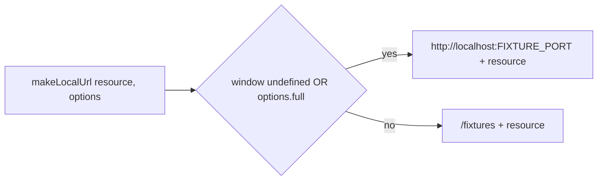
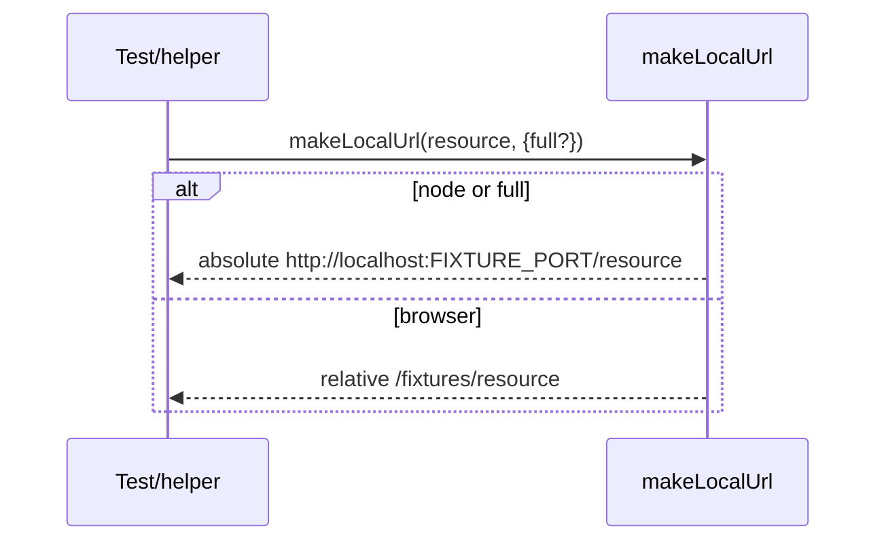
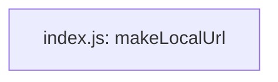

<!-- sdd-generated-metadata
generator: claude-cli
generator_model: us.anthropic.claude-opus-4-8
approved_by: pending-human-review
updated_at: 2026-08-06T00:00:00Z
validation_status: not-run
run_id: 51855eac-8de5-43a2-a3b6-dbcc55ebc91b
-->

# @webex/test-helper-make-local-url — SPEC

> Start here → root [`AGENTS.md`](../../../../AGENTS.md) (agent entry) · router [`SPEC_INDEX.md`](../../../../ai-docs/SPEC_INDEX.md) · system [`ARCHITECTURE.md`](../../../../ai-docs/ARCHITECTURE.md). This is the module's canonical spec: orientation, requirements, design, flows, and tests.
> Context-efficiency: link to canonical docs — don't duplicate them. Load specs on demand per `SPEC_INDEX.md`.

## Metadata

| Field | Value |
|---|---|
| Module id | `test-helper-make-local-url` |
| Source path(s) | `packages/@webex/test-helper-make-local-url/src/` |
| Parent spec | `—` (test-support package consumed by fixture-dependent test suites; no parent module) |
| Doc kind | Module spec |
| Coverage score | Pending coverage assessment |
| Generated from | `module-spec` @ SDLC template library `0.2.2` |
| generated_by / approved_by / updated_at | claude-cli / pending-human-review / 2026-08-06 |
| Validation status | not-run, validator `pending`, assessed 2026-08-06 |

Coverage score is `Pending coverage assessment` until the first coverage review runs. Manifest coverage
state (`Partial`) is authoritative and kept in `.sdd/manifest.json`.

## Evidence Rules
Every requirement cites concrete source evidence using `file path`. Test evidence is preferred for WHY.
Requirements are grounded in the current implementation under `src/`.

## Source Material Register

| Source material | Scope | Decision | Detail location or disposition |
|---|---|---|---|
| `N/A` | none | none | No pre-existing SDD/AI-docs, architecture, or spec documents were routed to this module; content is derived from source. |

## Overview

`@webex/test-helper-make-local-url` is a one-function helper that builds a URL to the local test fixture
server. `src/index.js` exports `makeLocalUrl(resource, options)`: in Node (or whenever
`options.full` is truthy) it returns an absolute URL `http://localhost:${FIXTURE_PORT}${resource}`; in a
browser it returns a relative path `/fixtures${resource}` so the request is proxied by the browser test
runner.

It is the smallest building block used by other test helpers (e.g. `test-helper-appid` and
`test-helper-file` browser variants) to reach fixtures without hardcoding host/port.

A maintainer should read `src/index.js` — it is the entire implementation.

## Purpose / Responsibility

Owns the single decision of how to address the local fixture server from a test (absolute Node URL vs
relative browser path). It does NOT own the fixture server, port assignment, or any HTTP transport.

## Stack

JavaScript (CommonJS), Node `>=18`. No runtime dependencies; `browserify`+`envify` transform inlines
`process.env.FIXTURE_PORT` for browser bundles. Built with `@webex/legacy-tools`.

## Folder / Package Structure

```
packages/@webex/test-helper-make-local-url/src/
└── index.js     # makeLocalUrl(resource, options): absolute (node/full) vs /fixtures (browser)
```

## Key Files (source of truth)

| File | Holds |
|---|---|
| `packages/@webex/test-helper-make-local-url/src/index.js` | The full branch logic and `FIXTURE_PORT` usage |
| `packages/@webex/test-helper-make-local-url/package.json` | `browserify`/`envify` transform that inlines `FIXTURE_PORT` |

## Public Surface

Internal Surface — test-support package consumed within the workspace (not published for product use).

| Contract ID | Type | Surface | Purpose | Compatibility / deprecation | Schema / detail link | Root index |
|---|---|---|---|---|---|---|
| `test-helper-make-local-url.makeLocalUrl` | SDK | `makeLocalUrl(resource, {full?}) → string` | Build a URL/path to the fixture server | stable within workspace | `packages/@webex/test-helper-make-local-url/src/index.js` | `../../../../ai-docs/CONTRACTS.md` |

Compatibility notes:
- The browser prefix `/fixtures` and the reliance on `FIXTURE_PORT` are the contract; changing either
  breaks consumers that build fixture URLs.

## Requires (dependencies)

- Environment: `FIXTURE_PORT` — the port of the local fixture server (used for absolute URLs).
- Build: `browserify` + `envify` to inline `FIXTURE_PORT` into browser bundles.

## Requirements

| ID | WHAT | WHY | Source Evidence | Test / Example Evidence | Assumptions / Gaps | Confidence |
|---|---|---|---|---|---|---|
| `TEST-HELPER-MAKE-LOCAL-URL-R-001` | In Node (`window` undefined) or when `options.full` is truthy, returns `http://localhost:${FIXTURE_PORT}${resource}` | Node has no relative-URL context and some tests need an absolute URL | `packages/@webex/test-helper-make-local-url/src/index.js` | None found | Assumes `FIXTURE_PORT` is set | PRESENT |
| `TEST-HELPER-MAKE-LOCAL-URL-R-002` | In a browser (without `full`), returns the relative path `/fixtures${resource}` | Browser runner proxies `/fixtures` to the server | `packages/@webex/test-helper-make-local-url/src/index.js` | None found | none | PRESENT |

## Design Overview

The helper exists so no test hardcodes the fixture host/port. Environment detection (`typeof window`)
plus an explicit `full` override keeps the logic branchless and dependency-free, and the `envify`
transform bakes `FIXTURE_PORT` into browser bundles where `process.env` is unavailable at runtime.

## Data Flow

`makeLocalUrl(resource, options)` → check `typeof window`/`options.full` → return absolute URL or
`/fixtures` path.



## Sequence Diagram(s)

Single trivial operation group (build a URL); one diagram covers it.

Sequence coverage:

| Operation group | Diagram | Failure / recovery coverage |
|---|---|---|
| Build fixture URL | URL construction | No error paths; returns a string in both branches |



## Class / Component Relationships

Single exported function; no classes or internal collaborators.



## Use Cases

- **UC-1 Build a fixture URL in Node:** `makeLocalUrl('/jwt')` → `http://localhost:<port>/jwt`.
  Evidence: `packages/@webex/test-helper-make-local-url/src/index.js`.
- **UC-2 Build a proxied path in the browser:** `makeLocalUrl('/sample.png')` → `/fixtures/sample.png`.
  Evidence: `packages/@webex/test-helper-make-local-url/src/index.js`.

## Error Handling & Failure Modes

| Condition | Signal (error/code/result) | Caller recovery |
|---|---|---|
| `FIXTURE_PORT` unset (Node/full) | Returns `http://localhost:undefined...` (no throw) | Set `FIXTURE_PORT` before running fixture-dependent tests |

## Pitfalls

- There is no validation of `FIXTURE_PORT`; a missing value yields `localhost:undefined` silently rather
  than throwing.
- `options.full` forces an absolute URL even in the browser — use it only when a relative `/fixtures`
  path will not work.

## Test-Case Strategy (module)

Exercised indirectly by helpers that fetch fixtures; no co-located unit tests. A trivial unit suite
should assert the Node/full branch (positive absolute URL) and the browser branch (positive relative
path) by toggling `typeof window`/`options.full`.

| Behavior / Requirement | Existing test evidence | Gap |
|---|---|---|
| `TEST-HELPER-MAKE-LOCAL-URL-R-001` | None found | Missing absolute-URL branch test |
| `TEST-HELPER-MAKE-LOCAL-URL-R-002` | None found | Missing relative-path branch test |

## Traceability
- Repo architecture: `../../../../ai-docs/ARCHITECTURE.md` · Registry: `../../../../ai-docs/SPEC_INDEX.md`
- Coverage state & contracts baseline: `.sdd/manifest.json`
