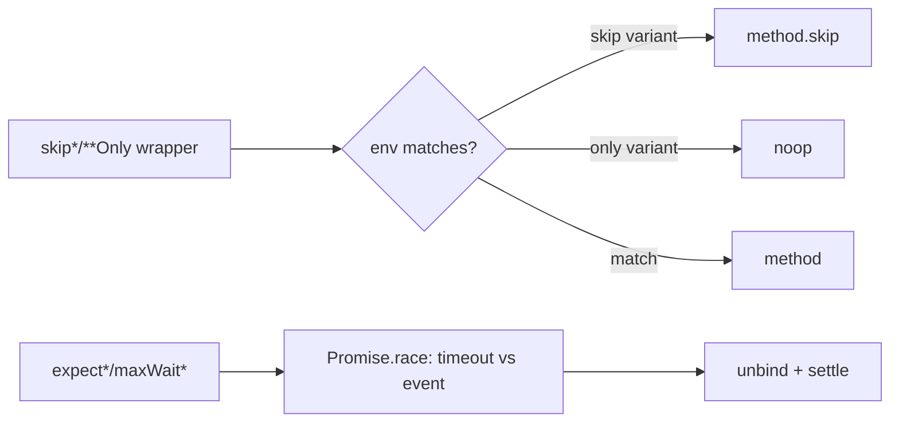
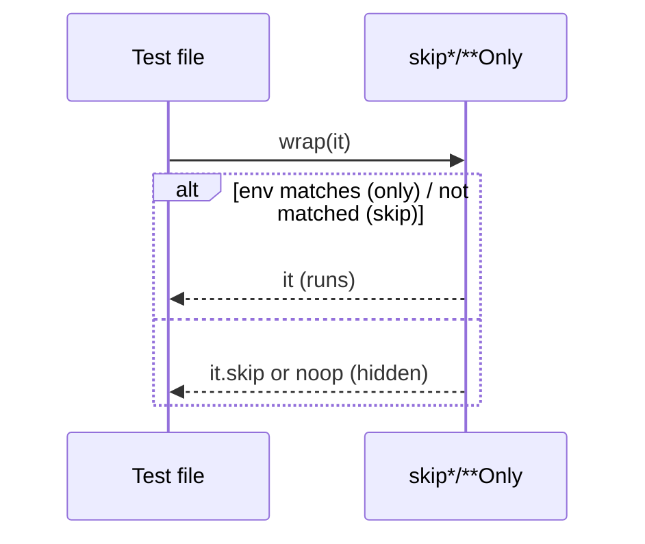
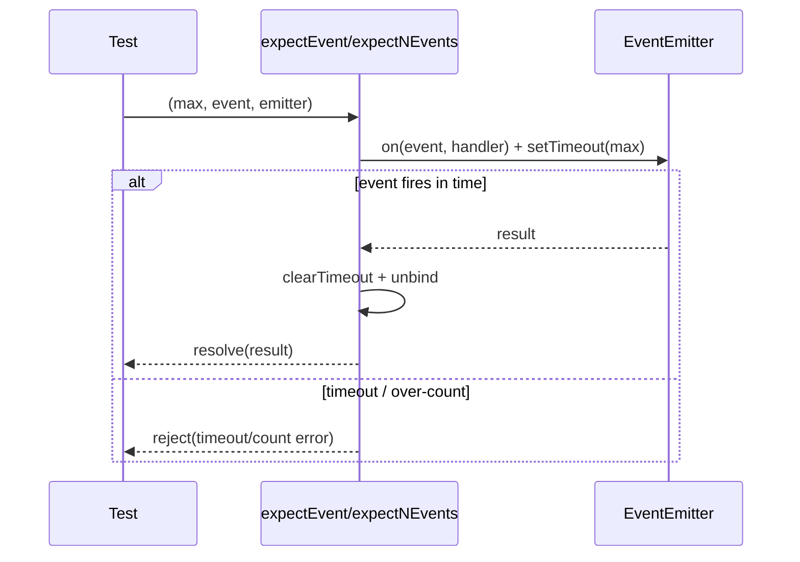
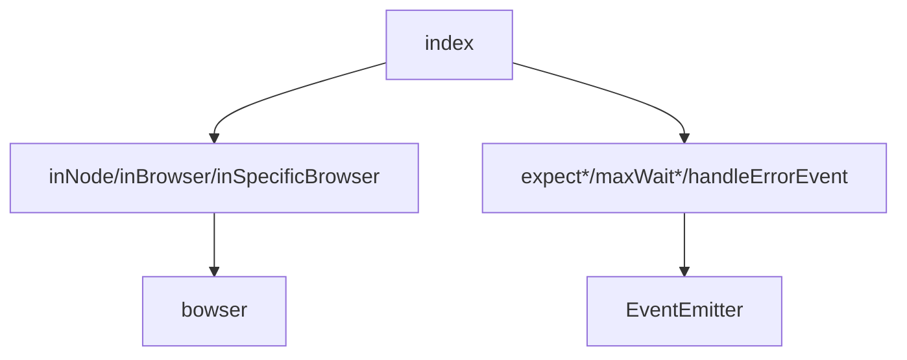

<!-- sdd-generated-metadata
generator: claude-cli
generator_model: us.anthropic.claude-opus-4-8
approved_by: pending-human-review
updated_at: 2026-08-06T00:00:00Z
validation_status: not-run
run_id: 51855eac-8de5-43a2-a3b6-dbcc55ebc91b
-->

# @webex/test-helper-mocha — SPEC

> Start here → root [`AGENTS.md`](../../../../AGENTS.md) (agent entry) · router [`SPEC_INDEX.md`](../../../../ai-docs/SPEC_INDEX.md) · system [`ARCHITECTURE.md`](../../../../ai-docs/ARCHITECTURE.md). This is the module's canonical spec: orientation, requirements, design, flows, and tests.
> Context-efficiency: link to canonical docs — don't duplicate them. Load specs on demand per `SPEC_INDEX.md`.

## Metadata

| Field | Value |
|---|---|
| Module id | `test-helper-mocha` |
| Source path(s) | `packages/@webex/test-helper-mocha/src/` |
| Parent spec | `—` (test-support package consumed by mocha test suites; no parent module) |
| Doc kind | Module spec |
| Coverage score | Pending coverage assessment |
| Generated from | `module-spec` @ SDLC template library `0.2.2` |
| generated_by / approved_by / updated_at | claude-cli / pending-human-review / 2026-08-06 |
| Validation status | not-run, validator `pending`, assessed 2026-08-06 |

Coverage score is `Pending coverage assessment` until the first coverage review runs. Manifest coverage
state (`Partial`) is authoritative and kept in `.sdd/manifest.json`.

## Evidence Rules
Every requirement cites concrete source evidence using `file path`. Test evidence is preferred for WHY.
Requirements are grounded in the current implementation under `src/`.

## Source Material Register

| Source material | Scope | Decision | Detail location or disposition |
|---|---|---|---|
| `N/A` | none | none | No pre-existing SDD/AI-docs, architecture, or spec documents were routed to this module; content is derived from source. |

## Overview

`@webex/test-helper-mocha` is a toolbox of mocha lifecycle utilities that control *where* tests run and
*how* they wait on asynchronous events. `src/index.js` exports environment-gating wrappers
(`skipInBrowser`, `skipInNode`, `skipInFirefox`, `skipInSafari`, `browserOnly`, `nodeOnly`,
`firefoxOnly`, `jenkinsOnly`, `flaky`), event/promise waiting helpers (`expectEvent`, `expectNEvents`,
`expectExactlyNEvents`, `expectActivity`, `maxWaitForEvent`, `maxWaitForPromise`, `handleErrorEvent`),
and a `snoozeUntil` date-gate.

Environment detection uses `typeof window` (Node vs browser) and `bowser` (specific browsers). The `skip*`
wrappers return `mochaMethod.skip` when the environment doesn't match (so the test appears skipped);
`*Only` wrappers return a `noop` so the test is hidden entirely; and `flaky` skips based on an env var.
The wait helpers wrap `EventEmitter` events in `Promise.race` against a timeout, converting emitter
"error" events and timeouts into rejected promises so async failures surface as real test failures rather
than silent timeouts.

A maintainer should read `src/index.js`, which contains every helper.

## Purpose / Responsibility

Owns mocha test-environment gating and async event/promise-timeout helpers. It does NOT own the mocha
runner, browser detection library internals, or the tests themselves.

## Stack

JavaScript (CommonJS), Node `>=18`. Sole runtime dep: `bowser` (browser detection). Uses `EventEmitter`
and env vars (`SKIP_FLAKY_TESTS`, `JENKINS`). Built with `@webex/legacy-tools`.

## Folder / Package Structure

```
packages/@webex/test-helper-mocha/src/
└── index.js     # all helpers: skip*/**Only/flaky/snoozeUntil + expect*/maxWait*/handleErrorEvent
```

## Key Files (source of truth)

| File | Holds |
|---|---|
| `packages/@webex/test-helper-mocha/src/index.js` | Every gating wrapper, event/promise waiter, and `snoozeUntil` logic |

## Public Surface

Internal Surface — test-support package consumed within the workspace (not published for product use).

| Contract ID | Type | Surface | Purpose | Compatibility / deprecation | Schema / detail link | Root index |
|---|---|---|---|---|---|---|
| `test-helper-mocha.skipInBrowser` | SDK | `skipInBrowser(it) → it \| it.skip` | Skip test in browsers | stable within workspace | `packages/@webex/test-helper-mocha/src/index.js` | `../../../../ai-docs/CONTRACTS.md` |
| `test-helper-mocha.skipInNode` | SDK | `skipInNode(it) → it \| it.skip` | Skip test in Node | stable within workspace | `packages/@webex/test-helper-mocha/src/index.js` | `../../../../ai-docs/CONTRACTS.md` |
| `test-helper-mocha.browserOnly / nodeOnly / firefoxOnly / jenkinsOnly` | SDK | `fn(mochaMethod) → mochaMethod \| noop` | Hide test outside target env | stable within workspace | `packages/@webex/test-helper-mocha/src/index.js` | `../../../../ai-docs/CONTRACTS.md` |
| `test-helper-mocha.flaky` | SDK | `flaky(it, envVar) → it \| it.skip` | Skip flaky tests via env | stable within workspace | `packages/@webex/test-helper-mocha/src/index.js` | `../../../../ai-docs/CONTRACTS.md` |
| `test-helper-mocha.expectEvent / expectNEvents / expectExactlyNEvents / expectActivity` | SDK | `(max, [count,] event, emitter, ...) → Promise` | Await emitter events with timeout | stable within workspace | `packages/@webex/test-helper-mocha/src/index.js` | `../../../../ai-docs/CONTRACTS.md` |
| `test-helper-mocha.maxWaitForEvent / maxWaitForPromise` | SDK | `(max, ...) → Promise` | Bounded wait for event/promise | stable within workspace | `packages/@webex/test-helper-mocha/src/index.js` | `../../../../ai-docs/CONTRACTS.md` |
| `test-helper-mocha.handleErrorEvent` | SDK | `handleErrorEvent(emitter, fn) → Promise` | Turn emitter `error` events into rejections | stable within workspace | `packages/@webex/test-helper-mocha/src/index.js` | `../../../../ai-docs/CONTRACTS.md` |
| `test-helper-mocha.snoozeUntil` | SDK | `snoozeUntil(until, explanation) → (mochaMethod) => mochaMethod \| .skip` | Defer a test until a date | stable within workspace | `packages/@webex/test-helper-mocha/src/index.js` | `../../../../ai-docs/CONTRACTS.md` |

Compatibility notes:
- These wrappers rely on mocha's `it`/`describe` exposing `.skip`; a wrapper that receives an already
  `.skip`/`.only` method returns it unchanged.

## Requires (dependencies)

- `bowser` — parse `navigator.userAgent` for `inSpecificBrowser` (firefox/safari).
- `EventEmitter` (Node core) — the emitters the wait helpers listen to.
- Environment: `SKIP_FLAKY_TESTS` (via `flaky`), `JENKINS` (via `jenkinsOnly`).

## Requirements

| ID | WHAT | WHY | Source Evidence | Test / Example Evidence | Assumptions / Gaps | Confidence |
|---|---|---|---|---|---|---|
| `TEST-HELPER-MOCHA-R-001` | `skipInBrowser`/`skipInNode`/`skipInFirefox`/`skipInSafari` return `mochaMethod.skip` in the matching environment, else the method unchanged; if the method has no `.skip` it is returned as-is | Conditionally skip tests by environment while keeping them visible | `packages/@webex/test-helper-mocha/src/index.js` | None found | none | PRESENT |
| `TEST-HELPER-MOCHA-R-002` | `browserOnly`/`nodeOnly`/`firefoxOnly`/`jenkinsOnly` return the method in the target env, else a `noop` (hidden) | Hide tests that can never run in an environment | `packages/@webex/test-helper-mocha/src/index.js` | None found | none | PRESENT |
| `TEST-HELPER-MOCHA-R-003` | `expectEvent(max, event, emitter, msg)` rejects with a timeout message if the event does not fire within `max`, else resolves with the event result | Convert missing events into explicit failures | `packages/@webex/test-helper-mocha/src/index.js` | None found | none | PRESENT |
| `TEST-HELPER-MOCHA-R-004` | `expectNEvents`/`expectExactlyNEvents` resolve when the event fires exactly `count` times within `max`; `expectExactlyNEvents` also rejects if the count is exceeded | Assert precise event cardinality | `packages/@webex/test-helper-mocha/src/index.js` | None found | none | PRESENT |
| `TEST-HELPER-MOCHA-R-005` | `handleErrorEvent(emitter, fn)` races `fn(emitter)` against the emitter's `error` event and rejects on error, unbinding the listener afterward; exposes `.add(emitter)` to watch more emitters | EventEmitter errors otherwise look like timeouts | `packages/@webex/test-helper-mocha/src/index.js` | None found | none | PRESENT |
| `TEST-HELPER-MOCHA-R-006` | `snoozeUntil(until, explanation)` throws without an explanation or on an invalid date, and returns a wrapper that skips the test while `now < until` | Force justification and auto-expire snoozes | `packages/@webex/test-helper-mocha/src/index.js` | None found | none | PRESENT |

## Design Overview

Two concerns are combined: environment gating and async timing. Gating is implemented as higher-order
functions over mocha's `it`/`describe`, distinguishing "skip but show" (`skip*`) from "hide entirely"
(`*Only` → `noop`). Timing helpers all follow the same `Promise.race([timeout, eventOrPromise])` shape and
carefully `unbind` listeners/timers on settle so tests don't leak handlers. `handleErrorEvent` exists
specifically because unhandled emitter errors otherwise manifest as opaque timeouts.

## Data Flow

Gating: `wrapper(mochaMethod)` → environment probe (`typeof window`/`bowser`/env var) → return method or
`skip`/`noop`. Timing: `expect*` / `maxWait*` → attach emitter listener + `setTimeout` → `Promise.race`
→ resolve/reject → `unbind`.



## Sequence Diagram(s)

Two distinct operation groups with different actor interactions warrant separate diagrams: (1)
synchronous environment gating and (2) asynchronous event-with-timeout waiting.

Sequence coverage:

| Operation group | Diagram | Failure / recovery coverage |
|---|---|---|
| Environment gating | Gate a test | Returns `.skip`/`noop`; returns method unchanged if no `.skip` |
| Await event with timeout | Bounded event wait | Timeout → reject; over-count (`expectExactlyNEvents`) → reject; always unbinds |





## Class / Component Relationships

Function-based module; no classes. Helpers are independent functions sharing private env-probe helpers
(`inNode`, `inBrowser`, `inSpecificBrowser`, `noop`) within `index.js`.



## Concurrency & Reactive Flow

The wait helpers are event-driven and time-bounded: each attaches an `EventEmitter` listener and a
`setTimeout`, then resolves/rejects via `Promise.race`. On settle they must `clearTimeout` and remove the
listener (`off`) to avoid leaked handlers across tests; `expectExactlyNEvents` removes its handler both on
success and on exceeding `count`. `handleErrorEvent` additionally supports attaching to multiple emitters
via `.add`.

## Use Cases

- **UC-1 Skip a Node-only test in the browser build:** `skipInBrowser(it)('...')` → `it.skip` in
  browsers. Evidence: `packages/@webex/test-helper-mocha/src/index.js`.
- **UC-2 Assert an event fires within a deadline:** `await expectEvent(2000, 'change', emitter)` →
  resolves with the event or rejects on timeout. Evidence:
  `packages/@webex/test-helper-mocha/src/index.js`.

## Error Handling & Failure Modes

| Condition | Signal (error/code/result) | Caller recovery |
|---|---|---|
| Event never fires within `max` | Rejected promise `"<event> did not fire within <max>ms"` | Increase timeout or fix the code under test |
| Event fires wrong number of times | Rejected promise with count message | Fix emission logic |
| Emitter emits `error` (via `handleErrorEvent`) | Rejected promise with the error | Handle/await the error explicitly |
| `snoozeUntil` without explanation / invalid date | Thrown `Error` | Provide a justification and valid date |

## Pitfalls

- `skip*` wrappers require the passed method to have `.skip`; passing an already-`.skip`/`.only` method
  returns it unchanged (by design) — don't double-wrap expecting a re-skip.
- `*Only` helpers replace the test with `noop`, so the test disappears from reports entirely (unlike
  `skip*`).
- Wait helpers must be `await`ed; forgetting to await defeats the timeout protection and reintroduces
  silent timeouts.

## Test-Case Strategy (module)

Used pervasively across mocha suites; no co-located unit tests for the helpers themselves. A unit suite
should cover, per gating wrapper, the matched and unmatched environment (positive/negative), and, per
wait helper, the fire-in-time (positive) and timeout/over-count (negative) paths using a fake emitter and
timers.

| Behavior / Requirement | Existing test evidence | Gap |
|---|---|---|
| `TEST-HELPER-MOCHA-R-001` | None found | Missing env-matched vs unmatched skip tests |
| `TEST-HELPER-MOCHA-R-003` | None found | Missing timeout-reject test for `expectEvent` |
| `TEST-HELPER-MOCHA-R-006` | None found | Missing invalid-date/no-explanation throw tests |

## Traceability
- Repo architecture: `../../../../ai-docs/ARCHITECTURE.md` · Registry: `../../../../ai-docs/SPEC_INDEX.md`
- Coverage state & contracts baseline: `.sdd/manifest.json`
