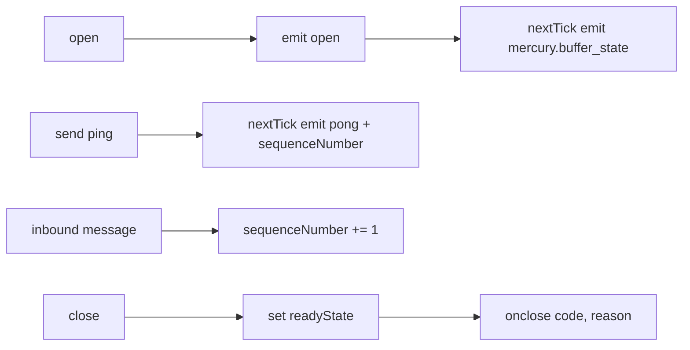
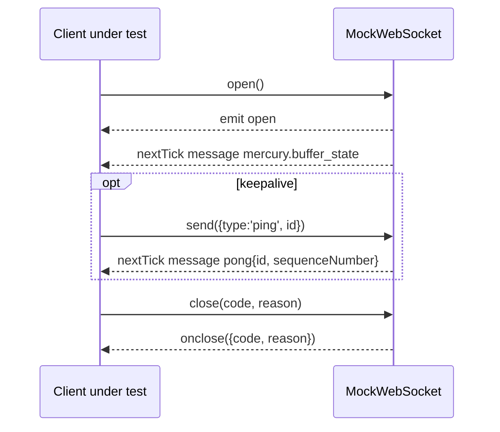
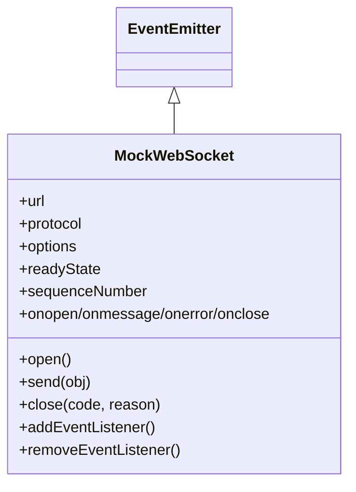

<!-- sdd-generated-metadata
generator: claude-cli
generator_model: us.anthropic.claude-opus-4-8
approved_by: pending-human-review
updated_at: 2026-08-06T00:00:00Z
validation_status: not-run
run_id: 51855eac-8de5-43a2-a3b6-dbcc55ebc91b
-->

# @webex/test-helper-mock-web-socket — SPEC

> Start here → root [`AGENTS.md`](../../../../AGENTS.md) (agent entry) · router [`SPEC_INDEX.md`](../../../../ai-docs/SPEC_INDEX.md) · system [`ARCHITECTURE.md`](../../../../ai-docs/ARCHITECTURE.md). This is the module's canonical spec: orientation, requirements, design, flows, and tests.
> Context-efficiency: link to canonical docs — don't duplicate them. Load specs on demand per `SPEC_INDEX.md`.

## Metadata

| Field | Value |
|---|---|
| Module id | `test-helper-mock-web-socket` |
| Source path(s) | `packages/@webex/test-helper-mock-web-socket/src/` |
| Parent spec | `—` (test-support package consumed by websocket-dependent test suites; no parent module) |
| Doc kind | Module spec |
| Coverage score | Pending coverage assessment |
| Generated from | `module-spec` @ SDLC template library `0.2.2` |
| generated_by / approved_by / updated_at | claude-cli / pending-human-review / 2026-08-06 |
| Validation status | not-run, validator `pending`, assessed 2026-08-06 |

Coverage score is `Pending coverage assessment` until the first coverage review runs. Manifest coverage
state (`Partial`) is authoritative and kept in `.sdd/manifest.json`.

## Evidence Rules
Every requirement cites concrete source evidence using `file path`. Test evidence is preferred for WHY.
Requirements are grounded in the current implementation under `src/`.

## Source Material Register

| Source material | Scope | Decision | Detail location or disposition |
|---|---|---|---|
| `N/A` | none | none | No pre-existing SDD/AI-docs, architecture, or spec documents were routed to this module; content is derived from source. |

## Overview

`@webex/test-helper-mock-web-socket` exports a single `MockWebSocket` class (`src/index.js`) that
emulates the browser `WebSocket` API on top of Node's `EventEmitter` so mercury/LLM/socket tests can run
without a real connection. It supports the DOM-style `onopen`/`onmessage`/`onerror`/`onclose` handler
properties (stored in `WeakMap`s and wired to emitter events), the `addEventListener`/
`removeEventListener` methods, and `send`/`close` (both wrapped as sinon spies).

Its behavior mimics the Webex mercury handshake: `open()` sets `readyState = 1`, emits `open`, then on the
next tick emits a synthetic `mercury.buffer_state` message; `send()` parses the payload and, for a `ping`,
replies on the next tick with a `pong` carrying the current `sequenceNumber` (which increments on each
inbound `message`). `close()` transitions `readyState` and invokes the `onclose` handler with the code and
reason.

A maintainer should read `src/index.js`, which is the entire class.

## Purpose / Responsibility

Owns a controllable, spy-instrumented stand-in for the browser `WebSocket` that reproduces the mercury
ping/pong and buffer-state handshake. It does NOT own the real socket transport, mercury plugin logic, or
network behavior.

## Stack

JavaScript (ES modules), Node `>=18`. Deps: `sinon` (spies on `send`/`close`) and Node core `events`
(`EventEmitter`). Built with `@webex/legacy-tools`; browser bundles via `babelify`/`envify`.

## Folder / Package Structure

```
packages/@webex/test-helper-mock-web-socket/src/
└── index.js     # default export MockWebSocket (EventEmitter-backed WebSocket mock)
```

## Key Files (source of truth)

| File | Holds |
|---|---|
| `packages/@webex/test-helper-mock-web-socket/src/index.js` | `MockWebSocket` class: handler WeakMaps, `open`/`send`/`close`, ping/pong + buffer-state emulation |

## Public Surface

Internal Surface — test-support package consumed within the workspace (not published for product use).

| Contract ID | Type | Surface | Purpose | Compatibility / deprecation | Schema / detail link | Root index |
|---|---|---|---|---|---|---|
| `test-helper-mock-web-socket.MockWebSocket` | SDK | `new MockWebSocket(url, protocol?, options?)` | Construct a WebSocket mock | stable within workspace | `packages/@webex/test-helper-mock-web-socket/src/index.js` | `../../../../ai-docs/CONTRACTS.md` |
| `test-helper-mock-web-socket.on*` | SDK | `onopen`/`onmessage`/`onerror`/`onclose` accessors | DOM-style handler registration | stable within workspace | `packages/@webex/test-helper-mock-web-socket/src/index.js` | `../../../../ai-docs/CONTRACTS.md` |
| `test-helper-mock-web-socket.send/close/open` | SDK | `send(obj)`, `close(code, reason)`, `open()` | Drive the mock socket | stable within workspace | `packages/@webex/test-helper-mock-web-socket/src/index.js` | `../../../../ai-docs/CONTRACTS.md` |
| `test-helper-mock-web-socket.addEventListener/removeEventListener` | SDK | `(type, fn)` | DOM-style listener registration | stable within workspace | `packages/@webex/test-helper-mock-web-socket/src/index.js` | `../../../../ai-docs/CONTRACTS.md` |

Compatibility notes:
- The synthetic `mercury.buffer_state` open message and the `ping` → `pong` reply shape are the behavioral
  contract mercury tests depend on; changing them can break those suites.

## Requires (dependencies)

- `sinon` — spies wrapping `send` and `close`.
- Node `events.EventEmitter` — event backbone for the handler properties.

## Requirements

| ID | WHAT | WHY | Source Evidence | Test / Example Evidence | Assumptions / Gaps | Confidence |
|---|---|---|---|---|---|---|
| `TEST-HELPER-MOCK-WEB-SOCKET-R-001` | The DOM handler properties (`onopen`/`onmessage`/`onerror`/`onclose`) register/replace a single listener for the corresponding emitter event, defaulting to `noop` when unset | Mirror the browser `WebSocket` handler API | `packages/@webex/test-helper-mock-web-socket/src/index.js` | None found | none | PRESENT |
| `TEST-HELPER-MOCK-WEB-SOCKET-R-002` | `open()` sets `readyState = 1`, emits `open`, and on the next tick emits a `mercury.buffer_state` message | Reproduce the mercury connection handshake | `packages/@webex/test-helper-mock-web-socket/src/index.js` | None found | none | PRESENT |
| `TEST-HELPER-MOCK-WEB-SOCKET-R-003` | `send(obj)` parses JSON and, when `obj.type === 'ping'`, emits a `pong` on the next tick echoing the id and current `sequenceNumber` | Emulate mercury keepalive so client logic proceeds | `packages/@webex/test-helper-mock-web-socket/src/index.js` | None found | none | PRESENT |
| `TEST-HELPER-MOCK-WEB-SOCKET-R-004` | `sequenceNumber` starts at 0 and increments on every inbound `message` event | Provide the sequence value echoed in pongs | `packages/@webex/test-helper-mock-web-socket/src/index.js` | None found | none | PRESENT |
| `TEST-HELPER-MOCK-WEB-SOCKET-R-005` | `close(code, reason)` transitions `readyState` and calls `onclose({code, reason})` | Emulate socket close for teardown assertions | `packages/@webex/test-helper-mock-web-socket/src/index.js` | None found | none | PRESENT |
| `TEST-HELPER-MOCK-WEB-SOCKET-R-006` | `send` and `close` are sinon spies so tests can assert calls | Allow verification of outbound socket activity | `packages/@webex/test-helper-mock-web-socket/src/index.js` | None found | none | PRESENT |

## Design Overview

The mock adapts the DOM `WebSocket` surface onto `EventEmitter`: handler-property setters store the
function in a per-instance `WeakMap` and (re)bind it to the emitter, so setting a new handler replaces the
old listener. Deferring the buffer-state and pong emissions to `process.nextTick` mimics real
asynchronous socket delivery, letting client code register handlers before messages arrive. Spying on
`send`/`close` lets tests assert socket interactions without a network.

## Data Flow

`open()` → emit `open` → next tick emit `mercury.buffer_state`. `send(ping)` → parse → next tick emit
`pong{sequenceNumber}`. Inbound `message` → `sequenceNumber += 1`. `close()` → set `readyState` → invoke
`onclose`.



## Sequence Diagram(s)

One operation group — the connection lifecycle (open → keepalive → close) — shares the same actor and
ordering, so a single diagram with the ping/pong branch is appropriate.

Sequence coverage:

| Operation group | Diagram | Failure / recovery coverage |
|---|---|---|
| Socket lifecycle | Open/ping/close | `opt` ping→pong; `close` path invokes `onclose` |



## Class / Component Relationships

`MockWebSocket extends EventEmitter`. Four module-level `WeakMap`s hold per-instance handlers; `sinon`
wraps `send`/`close`.



## Concurrency & Reactive Flow

Emissions are deferred with `process.nextTick` to model asynchronous socket delivery, so handlers set
synchronously after `open()`/`send()` still receive the messages. The handler-property setters guard
against duplicate listeners by removing the previously stored listener before adding a new one.

## Use Cases

- **UC-1 Simulate a mercury connection open:** test constructs `MockWebSocket`, registers `onmessage`,
  calls `open()` → receives `mercury.buffer_state`. Evidence:
  `packages/@webex/test-helper-mock-web-socket/src/index.js`.
- **UC-2 Verify keepalive handling:** test `send`s a `ping` → asserts a `pong` with the sequence number.
  Evidence: `packages/@webex/test-helper-mock-web-socket/src/index.js`.

## Error Handling & Failure Modes

| Condition | Signal (error/code/result) | Caller recovery |
|---|---|---|
| `send` given non-JSON string | Parse error swallowed; treated as non-ping | Send valid JSON when a pong is expected |
| Handler unset | Getter returns `noop` | Set the handler before driving the socket |
| `error` event needed | Emit via `emit('error', ...)`/set `onerror` | Register `onerror` to observe |

## Pitfalls

- Message emissions are on `process.nextTick`; assertions must await a tick, not run synchronously after
  `open()`/`send()`.
- Only `type: 'ping'` payloads trigger a reply; other `send`s are recorded (spy) but produce no message.
- `sequenceNumber` advances on inbound `message` events, not on `send`; pong values reflect received
  messages.

## Test-Case Strategy (module)

Consumed by mercury/LLM socket tests; no co-located unit tests. A unit suite should assert the open
handshake emits `mercury.buffer_state` (positive), a `ping` yields a matching `pong` with the current
sequence (positive), and a non-ping `send` yields no message (negative), using fake timers/nextTick.

| Behavior / Requirement | Existing test evidence | Gap |
|---|---|---|
| `TEST-HELPER-MOCK-WEB-SOCKET-R-002` | None found | Missing open-handshake message test |
| `TEST-HELPER-MOCK-WEB-SOCKET-R-003` | None found | Missing ping→pong positive and non-ping negative tests |
| `TEST-HELPER-MOCK-WEB-SOCKET-R-005` | None found | Missing close/`onclose` test |

## Traceability
- Repo architecture: `../../../../ai-docs/ARCHITECTURE.md` · Registry: `../../../../ai-docs/SPEC_INDEX.md`
- Coverage state & contracts baseline: `.sdd/manifest.json`
