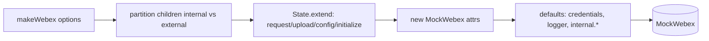
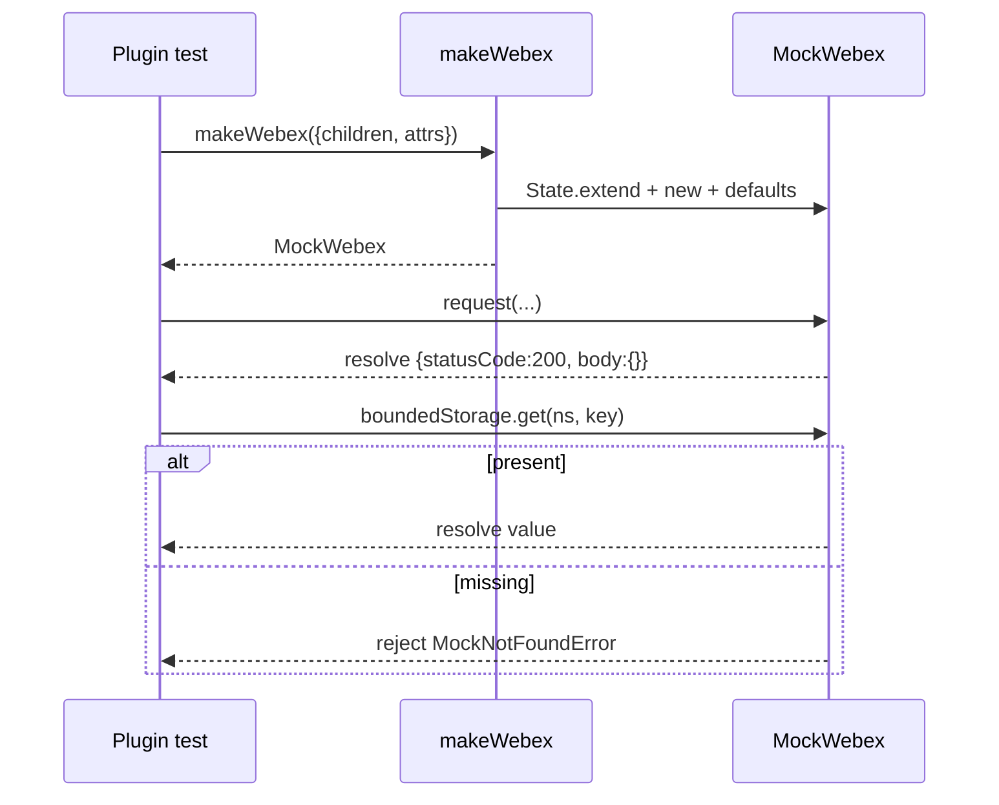
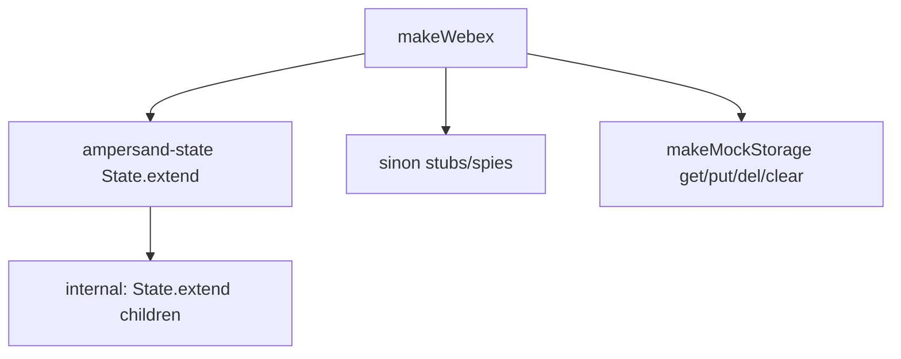

<!-- sdd-generated-metadata
generator: claude-cli
generator_model: us.anthropic.claude-opus-4-8
approved_by: pending-human-review
updated_at: 2026-08-06T00:00:00Z
validation_status: not-run
run_id: 51855eac-8de5-43a2-a3b6-dbcc55ebc91b
-->

# @webex/test-helper-mock-webex — SPEC

> Start here → root [`AGENTS.md`](../../../../AGENTS.md) (agent entry) · router [`SPEC_INDEX.md`](../../../../ai-docs/SPEC_INDEX.md) · system [`ARCHITECTURE.md`](../../../../ai-docs/ARCHITECTURE.md). This is the module's canonical spec: orientation, requirements, design, flows, and tests.
> Context-efficiency: link to canonical docs — don't duplicate them. Load specs on demand per `SPEC_INDEX.md`.

## Metadata

| Field | Value |
|---|---|
| Module id | `test-helper-mock-webex` |
| Source path(s) | `packages/@webex/test-helper-mock-webex/src/` |
| Parent spec | `—` (test-support package consumed by plugin test suites; no parent module) |
| Doc kind | Module spec |
| Coverage score | Pending coverage assessment |
| Generated from | `module-spec` @ SDLC template library `0.2.2` |
| generated_by / approved_by / updated_at | claude-cli / pending-human-review / 2026-08-06 |
| Validation status | not-run, validator `pending`, assessed 2026-08-06 |

Coverage score is `Pending coverage assessment` until the first coverage review runs. Manifest coverage
state (`Partial`) is authoritative and kept in `.sdd/manifest.json`.

## Evidence Rules
Every requirement cites concrete source evidence using `file path`. Test evidence is preferred for WHY.
Requirements are grounded in the current implementation under `src/`.

## Source Material Register

| Source material | Scope | Decision | Detail location or disposition |
|---|---|---|---|
| `N/A` | none | none | No pre-existing SDD/AI-docs, architecture, or spec documents were routed to this module; content is derived from source. |

## Overview

`@webex/test-helper-mock-webex` builds a mock Webex instance so plugin unit tests can run without a real
SDK. `src/index.js` exports `makeWebex(options)`, which constructs an `ampersand-state` model
(`State.extend`) pre-populated with stubbed `request`/`upload` (sinon stubs returning resolved
`{statusCode: 200, body: {}}`), a `refresh` stub, a `setConfig` helper, and a large default `config`
tree covering credentials, conversation, meetings, metrics, and more.

It partitions requested `children` into "internal" vs "external" plugins using a hardcoded
`nonInternalPlugins` allow-list (e.g. `authorization`, `credentials`, `messages`, `meetings`), nesting
non-listed children under an `internal` state so `webex.internal.<plugin>` resolves like the real SDK.
It also seeds `webex.credentials` (with `getUserToken`/`getClientToken` stubs), a `logger` (spies unless
`MOCK_LOGGER` is set), and `webex.internal` defaults for `device`, `feature`, `metrics`, `newMetrics`,
`mercury`, `llm`, `voicea`, etc. In-memory `boundedStorage`/`unboundedStorage` mocks are created in
`initialize`.

A maintainer should read `src/index.js`, which contains the whole factory, the plugin partition list,
and the config defaults.

## Purpose / Responsibility

Owns construction of a stubbed Webex SDK instance (state, request/upload stubs, credentials, config,
internal-plugin scaffolding, mock storage) for plugin unit tests. It does NOT own real SDK behavior,
network requests, or the individual plugins it stubs.

## Stack

JavaScript (CommonJS), Node `>=18`. Deps: `ampersand-state` (`State.extend` model), `sinon` (stubs/spies),
`lodash` (`defaults`), `es6-promise` (polyfill). Built with `@webex/legacy-tools`.

## Folder / Package Structure

```
packages/@webex/test-helper-mock-webex/src/
└── index.js     # makeWebex(options): builds mock Webex state, config, internal plugins, storage
```

## Key Files (source of truth)

| File | Holds |
|---|---|
| `packages/@webex/test-helper-mock-webex/src/index.js` | `makeWebex` factory, `nonInternalPlugins` allow-list, default `config`, credential/logger/internal stubs, `makeMockStorage` |

## Public Surface

Internal Surface — test-support package consumed within the workspace (not published for product use).

| Contract ID | Type | Surface | Purpose | Compatibility / deprecation | Schema / detail link | Root index |
|---|---|---|---|---|---|---|
| `test-helper-mock-webex.makeWebex` | SDK | `makeWebex({children?, attrs?}) → MockWebex` | Build a stubbed Webex instance | stable within workspace | `packages/@webex/test-helper-mock-webex/src/index.js` | `../../../../ai-docs/CONTRACTS.md` |

Compatibility notes:
- The `nonInternalPlugins` list and the default `config`/`internal` shape are the contract many plugin
  tests rely on; adding/removing a plugin or config key can shift tests between `webex.<x>` and
  `webex.internal.<x>`.

## Requires (dependencies)

- `ampersand-state` — the state model the mock extends (matches the real SDK's model semantics).
- `sinon` — stubs for `request`/`upload`/`refresh`/token getters and spies for storage/logger.
- `lodash` — `defaults` merging of options and seeded properties.
- Environment: `MOCK_LOGGER` (use real `console`), `IDBROKER_BASE_URL`, `IDENTITY_BASE_URL` (config URLs).

## Requirements

| ID | WHAT | WHY | Source Evidence | Test / Example Evidence | Assumptions / Gaps | Confidence |
|---|---|---|---|---|---|---|
| `TEST-HELPER-MOCK-WEBEX-R-001` | `makeWebex` returns an `ampersand-state` instance with `request` and `upload` as sinon stubs resolving `{statusCode: 200, body: {}}` / `{}` | Plugin tests need a no-network request surface | `packages/@webex/test-helper-mock-webex/src/index.js` | None found | none | PRESENT |
| `TEST-HELPER-MOCK-WEBEX-R-002` | Children not in `nonInternalPlugins` are nested under `internal`; listed ones stay external, with `internal` guaranteed first | Mirror the real SDK's `webex.internal.<plugin>` layout and property ordering | `packages/@webex/test-helper-mock-webex/src/index.js` | None found | Relies on property-order behavior | PRESENT |
| `TEST-HELPER-MOCK-WEBEX-R-003` | `credentials` is seeded with `authorization`, `getUserToken`/`getClientToken` stubs resolving a token-like object | Plugins read credentials during requests | `packages/@webex/test-helper-mock-webex/src/index.js` | None found | none | PRESENT |
| `TEST-HELPER-MOCK-WEBEX-R-004` | `logger` is a set of sinon spies unless `MOCK_LOGGER` is set, in which case it is `console` | Silence logs in tests but allow opt-in real logging | `packages/@webex/test-helper-mock-webex/src/index.js` | None found | none | PRESENT |
| `TEST-HELPER-MOCK-WEBEX-R-005` | `initialize` creates in-memory `boundedStorage`/`unboundedStorage` whose `get` rejects `MockNotFoundError` on miss and `put`/`del`/`clear` mutate the in-memory map | Provide a storage adapter without a real backing store | `packages/@webex/test-helper-mock-webex/src/index.js` | None found | none | PRESENT |
| `TEST-HELPER-MOCK-WEBEX-R-006` | A default `config` tree is provided for credentials (with idbroker/identity URLs), conversation, meetings, metrics, and other plugins, overridable via `setConfig` | Plugins read config at construction | `packages/@webex/test-helper-mock-webex/src/index.js` | None found | none | PRESENT |

## Design Overview

The factory reproduces just enough of the real SDK's shape for plugin unit tests: it extends
`ampersand-state` (as the real Webex does), pre-stubs the network surface, and reconstructs the
internal/external plugin split from a static allow-list so `webex.internal.<x>` and `webex.<x>` resolve
correctly. Defaults are layered with `lodash.defaults` so callers can override any stub or config value
via `options`. Mock storage is a closure over a plain object, matching the SDK storage contract
(`get`/`put`/`del`/`clear`) including the rejected-on-miss behavior consumers depend on.

## Data Flow

`makeWebex(options)` → partition `options.children` into internal/external → build `MockWebex`
(`State.extend`) with request/upload/refresh/setConfig/config/initialize → instantiate with `attrs` →
`_.defaults` seed `credentials`/`logger`/`internal.*` → return instance.



## Sequence Diagram(s)

Single operation group — construct-and-use a mock Webex. This is a factory/composition module, so one
diagram suffices; the `get`-miss rejection is shown as a branch.

Sequence coverage:

| Operation group | Diagram | Failure / recovery coverage |
|---|---|---|
| Build and use mock Webex | Mock construction + request/storage | Storage `get` miss → reject `MockNotFoundError`; `request` always resolves 200 |



## Class / Component Relationships

`makeWebex` returns an `ampersand-state` extension. Internal state is itself a `State.extend` holding
internal children; `sinon` stubs/spies attach to request/upload/credentials/logger/storage.



## State Model

The mock is stateful via `ampersand-state`: `config` (deep credentials/plugin config), `credentials`
(auth + token getters), `internal.<plugin>` scaffolding (device/feature/metrics/newMetrics/mercury/…),
`boundedStorage`/`unboundedStorage` (in-memory maps), `sessionId`, and `logger`. `setConfig` mutates the
idbroker/identity URLs; `initialize` (re)creates the storage maps from `attrs`.

## Concurrency & Reactive Flow

Asynchronous surfaces are modeled with resolved/rejected Promises: `request`/`upload` return pre-resolved
promises that also expose a chainable `.on()` returning the same promise; `refresh` and the token getters
resolve immediately; storage `get` returns a resolved value or a rejected `MockNotFoundError`. There is no
real concurrency — everything settles synchronously in the microtask queue.

## Use Cases

- **UC-1 Construct a mock for a public plugin test:** `makeWebex({children: {messages: Messages}})` →
  `webex.messages` external, `webex.internal` present. Evidence:
  `packages/@webex/test-helper-mock-webex/src/index.js`.
- **UC-2 Assert a plugin issued a request:** call plugin method → assert `webex.request` (sinon stub) was
  called. Evidence: `packages/@webex/test-helper-mock-webex/src/index.js`.

## Error Handling & Failure Modes

| Condition | Signal (error/code/result) | Caller recovery |
|---|---|---|
| Storage `get` on absent key | Rejected promise `Error('MockNotFoundError')` | Handle miss or `put` first |
| Plugin expects a config key not seeded | `undefined` at read | Pass overrides via `options` / `setConfig` |
| Test needs real logs | Logger is spies by default | Set `MOCK_LOGGER` to use `console` |

## Pitfalls

- The internal/external split is driven by the static `nonInternalPlugins` list; a new public plugin not
  added there will be mounted under `webex.internal` unexpectedly.
- The comment in code notes that `internal` must be the first child property because ordering is relied
  upon — do not reorder the children assignment.
- `request`/`upload` always resolve `200`/empty; tests needing failures or specific bodies must override
  the stubs after construction.

## Test-Case Strategy (module)

Consumed by essentially every plugin unit suite; no co-located unit tests for the factory itself. A unit
suite should assert the internal/external partition (positive for a listed and an unlisted plugin),
storage miss rejection (negative), and default request resolution (positive).

| Behavior / Requirement | Existing test evidence | Gap |
|---|---|---|
| `TEST-HELPER-MOCK-WEBEX-R-002` | None found | Missing partition test for listed vs unlisted plugin |
| `TEST-HELPER-MOCK-WEBEX-R-005` | None found | Missing storage miss `MockNotFoundError` test |
| `TEST-HELPER-MOCK-WEBEX-R-001` | None found | Missing default request-resolution test |

## Traceability
- Repo architecture: `../../../../ai-docs/ARCHITECTURE.md` · Registry: `../../../../ai-docs/SPEC_INDEX.md`
- Coverage state & contracts baseline: `.sdd/manifest.json`
