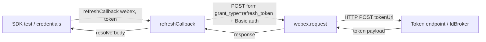
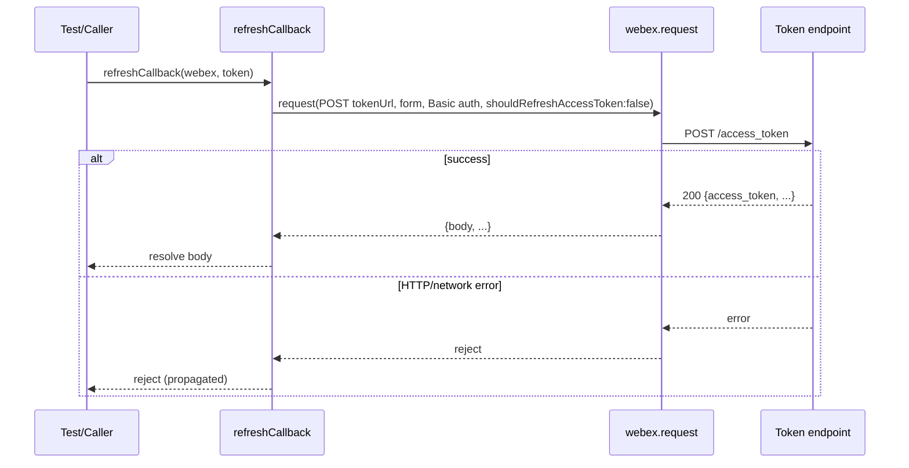
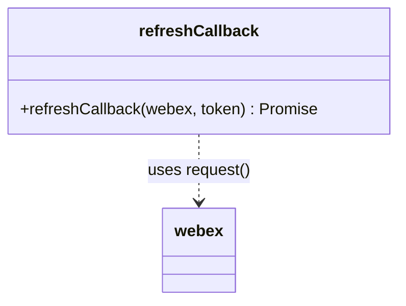

<!-- sdd-generated-metadata
generator: claude-cli
generator_model: us.anthropic.claude-opus-4-8
approved_by: pending-human-review
updated_at: 2026-08-06T00:00:00Z
validation_status: not-run
run_id: 51855eac-8de5-43a2-a3b6-dbcc55ebc91b
-->

# @webex/test-helper-refresh-callback — SPEC

> Start here → root [`AGENTS.md`](../../../../AGENTS.md) (agent entry) · router [`SPEC_INDEX.md`](../../../../ai-docs/SPEC_INDEX.md) · system [`ARCHITECTURE.md`](../../../../ai-docs/ARCHITECTURE.md). This is the module's canonical spec: orientation, requirements, design, flows, and tests.
> Context-efficiency: link to canonical docs — don't duplicate them. Load specs on demand per `SPEC_INDEX.md`.

## Metadata

| Field | Value |
|---|---|
| Module id | `test-helper-refresh-callback` |
| Source path(s) | `packages/@webex/test-helper-refresh-callback/src/` |
| Parent spec | `—` (standalone test-helper package, no parent module) |
| Doc kind | Module spec |
| Coverage score | Pending coverage assessment |
| Generated from | `module-spec` @ SDLC template library `0.2.2` |
| generated_by / approved_by / updated_at | claude-cli / pending-human-review / 2026-08-06 |
| Validation status | not-run, validator `pending`, assessed 2026-08-06 |

Coverage score is `Pending coverage assessment` until the first coverage review runs. Manifest coverage
state (`Partial`) is authoritative and kept in `.sdd/manifest.json`.

## Evidence Rules
Every requirement cites concrete source evidence using `file path`. Test evidence is preferred for WHY.
Requirements are grounded in the current implementation under `src/` and its consumers' integration tests.

## Source Material Register

| Source material | Scope | Decision | Detail location or disposition |
|---|---|---|---|
| Package `package.json` | overview / build | verified | Stack, build wiring, and dependency facts placed in Stack and Requires. |
| `src/index.js` implementation | API / behavior | verified | Behavior and public surface placed in Requirements, Public Surface, Data Flow. |

## Overview

`@webex/test-helper-refresh-callback` is a single-function test helper for the Webex JS SDK monorepo. It
exports one default function, `refreshCallback(webex, token)`, that performs an OAuth2
`refresh_token` grant against the token's configured token URL and resolves with the parsed response
body. It exists so that SDK integration/automation tests (notably `webex-core` credentials tests) can
supply a working `refresh` callback to a client without embedding refresh mechanics in each test.

The module is deliberately tiny: it contains no state, no classes, and no persistence. A maintainer
should start and end at `src/index.js`.

## Purpose / Responsibility

Owns one thing: exchanging a refresh token for a fresh token payload via a `POST` to
`token.config.tokenUrl` using HTTP Basic client credentials. It does NOT own token storage, token
validation, scheduling of refreshes, or the SDK request stack (delegated to `webex.request`).

## Stack

JavaScript (ES module `src/index.js`, transpiled to `dist/` via `webex-legacy-tools build`). Node
`>=18`. Browserify transforms `babelify` + `envify` for browser test bundles. No runtime dependencies;
`webex.request` is provided by the caller. Consumed by `@webex/webex-core` as a dev dependency.

## Folder / Package Structure

```
packages/@webex/test-helper-refresh-callback/
├── src/
│   └── index.js   # default export refreshCallback(webex, token)
└── package.json   # build/test scripts, engines, dev deps
```

## Key Files (source of truth)

| File | Holds |
|---|---|
| `packages/@webex/test-helper-refresh-callback/src/index.js` | The entire public behavior: the `refreshCallback` function and its request shape |
| `packages/@webex/test-helper-refresh-callback/package.json` | Build/test scripts, Node engine floor, dev dependencies |

## Public Surface

Consumed as an imported code module (default export) by SDK test suites. It issues a network call
through the caller-supplied `webex.request`.

| Contract ID | Type | Surface | Purpose | Compatibility / deprecation | Schema / detail link | Root index |
|---|---|---|---|---|---|---|
| `test-helper-refresh-callback.default` | SDK | `refreshCallback(webex, token): Promise<Object>` | Perform an OAuth2 refresh_token grant and resolve the response body | Stable single-function default export | `packages/@webex/test-helper-refresh-callback/src/index.js` | `../../../../ai-docs/CONTRACTS.md` |

Compatibility notes:
- The default-export signature `(webex, token)` and the resolved value (the response `body`) are the
  semver-controlled contract.

## Requires (dependencies)

- Caller-supplied `webex` object exposing `request(options)` (satisfied by `@webex/webex-core` in tests).
- `token` object exposing `config.tokenUrl`, `config.redirect_uri`, `config.client_id`,
  `config.client_secret`, and `refresh_token`.
- Dev/build only: `@webex/legacy-tools`, `@webex/babel-config-legacy`, `@webex/test-helper-*` helpers.

## Requirements

| ID | WHAT | WHY | Source Evidence | Test / Example Evidence | Assumptions / Gaps | Confidence |
|---|---|---|---|---|---|---|
| `TEST-HELPER-REFRESH-CALLBACK-R-001` | `refreshCallback` issues a `POST` to `token.config.tokenUrl` with a form body `grant_type=refresh_token`, `redirect_uri`, and `refresh_token` from the token. | Tests need a standard OAuth2 refresh exchange without re-implementing it. | `packages/@webex/test-helper-refresh-callback/src/index.js` | Used by `packages/@webex/webex-core/test/` credentials suites | none identified | PRESENT |
| `TEST-HELPER-REFRESH-CALLBACK-R-002` | The request sends HTTP Basic auth with `user: client_id`, `pass: client_secret`, and `sendImmediately: true`. | The IdBroker token endpoint requires client credentials on the refresh call. | `packages/@webex/test-helper-refresh-callback/src/index.js` | Consumer integration tests | none identified | PRESENT |
| `TEST-HELPER-REFRESH-CALLBACK-R-003` | The request sets `shouldRefreshAccessToken: false` and resolves with the response `body` (not the full response). | Prevents recursive refresh on the refresh call itself and gives callers the token payload directly. | `packages/@webex/test-helper-refresh-callback/src/index.js` | Consumer integration tests | none identified | PRESENT |

## Design Overview

The module is a pure delegation shim. It builds a single request-options object and forwards it to the
caller's `webex.request`, then narrows the resolved response to its `body`. `shouldRefreshAccessToken:
false` is set so the SDK's auth interceptor does not attempt to refresh a token while this call is the
one refreshing it. There is no branching, retry, or error mapping — errors propagate as the rejected
promise from `webex.request`.

## Data Flow



## Sequence Diagram(s)

Sequence coverage: this is a trivial single-operation pass-through module, so one sequence diagram
covers its only operation group.

| Operation group | Diagram | Failure / recovery coverage |
|---|---|---|
| Refresh token exchange | 1. refreshCallback | `alt` covers request rejection propagating to the caller |

### 1. refreshCallback



## Class / Component Relationships



`refreshCallback` is a free function with no types of its own; it composes over the caller's `webex`
object.

## Use Cases

- **UC-1 Refresh a test user's token:** a credentials test passes `webex` and a token with a
  `refresh_token`; `refreshCallback` returns the new token body. Evidence:
  `packages/@webex/test-helper-refresh-callback/src/index.js`.

## Error Handling & Failure Modes

| Condition | Signal (error/code/result) | Caller recovery |
|---|---|---|
| Token endpoint returns 4xx/5xx | Rejected promise from `webex.request` | Inspect the rejection; verify client credentials / refresh token |
| Network failure | Rejected promise from `webex.request` | Retry the test or check connectivity |

## Pitfalls

- `shouldRefreshAccessToken: false` is required; without it the SDK auth interceptor could recurse on
  the refresh request itself.
- The function resolves the response `body` only — callers expecting the full response object will not
  get headers/status.
- All fields come from `token.config` (`tokenUrl`, `redirect_uri`, `client_id`, `client_secret`); a
  missing config field yields an endpoint error, not a local validation error.

## Test-Case Strategy (module)

This helper is exercised indirectly through the consuming packages' credentials integration/automation
tests (e.g. `@webex/webex-core`), which supply a real or mock `webex.request` and assert that a refresh
returns a usable token. A positive case asserts a resolved token body; a negative case asserts the
rejection propagates when the endpoint errors.

| Behavior / Requirement | Existing test evidence | Gap |
|---|---|---|
| `TEST-HELPER-REFRESH-CALLBACK-R-001` | `packages/@webex/webex-core/test/` (consumer) | No package-local unit test; add a direct request-shape assertion |
| `TEST-HELPER-REFRESH-CALLBACK-R-002` | `packages/@webex/webex-core/test/` (consumer) | Add Basic-auth assertion |
| `TEST-HELPER-REFRESH-CALLBACK-R-003` | `packages/@webex/webex-core/test/` (consumer) | Add `shouldRefreshAccessToken:false` + body-resolution assertion |

## Traceability

- Repo architecture: [`ARCHITECTURE.md`](../../../../ai-docs/ARCHITECTURE.md) · Registry: [`SPEC_INDEX.md`](../../../../ai-docs/SPEC_INDEX.md)
- Coverage state & contracts baseline: `.sdd/manifest.json`
