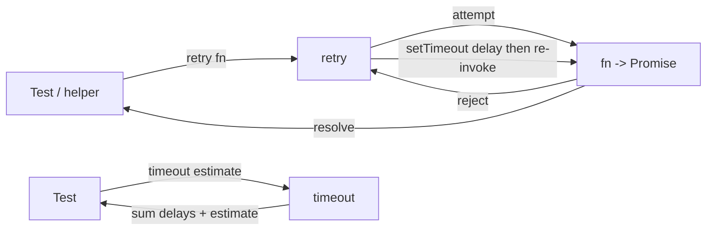
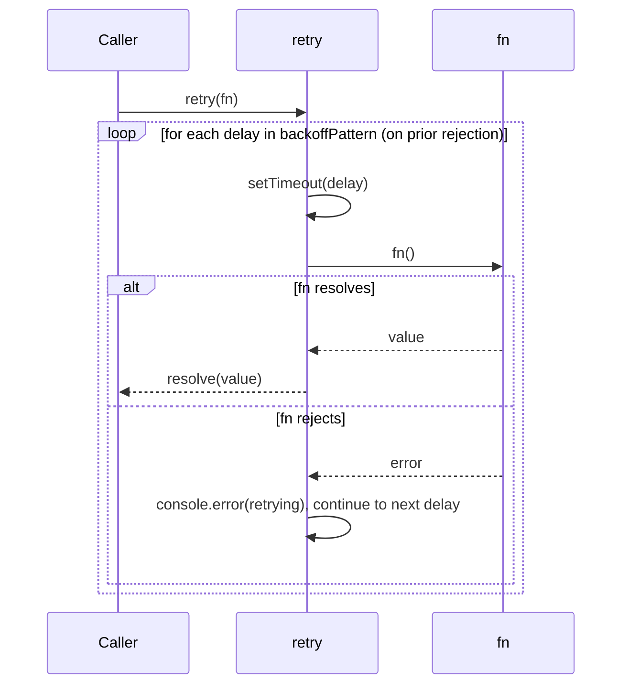
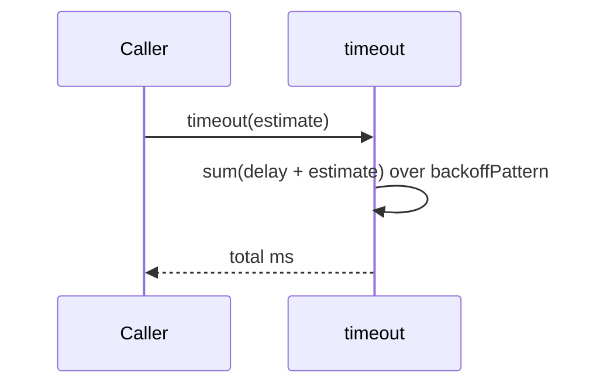
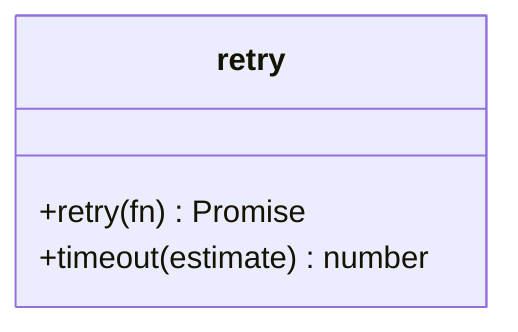

<!-- sdd-generated-metadata
generator: claude-cli
generator_model: us.anthropic.claude-opus-4-8
approved_by: pending-human-review
updated_at: 2026-08-06T00:00:00Z
validation_status: not-run
run_id: 51855eac-8de5-43a2-a3b6-dbcc55ebc91b
-->

# @webex/test-helper-retry — SPEC

> Start here → root [`AGENTS.md`](../../../../AGENTS.md) (agent entry) · router [`SPEC_INDEX.md`](../../../../ai-docs/SPEC_INDEX.md) · system [`ARCHITECTURE.md`](../../../../ai-docs/ARCHITECTURE.md). This is the module's canonical spec: orientation, requirements, design, flows, and tests.
> Context-efficiency: link to canonical docs — don't duplicate them. Load specs on demand per `SPEC_INDEX.md`.

## Metadata

| Field | Value |
|---|---|
| Module id | `test-helper-retry` |
| Source path(s) | `packages/@webex/test-helper-retry/src/` |
| Parent spec | `—` (standalone test-helper package, no parent module) |
| Doc kind | Module spec |
| Coverage score | Pending coverage assessment |
| Generated from | `module-spec` @ SDLC template library `0.2.2` |
| generated_by / approved_by / updated_at | claude-cli / pending-human-review / 2026-08-06 |
| Validation status | not-run, validator `pending`, assessed 2026-08-06 |

Coverage score is `Pending coverage assessment` until the first coverage review runs. Manifest coverage
state (`Partial`) is authoritative and kept in `.sdd/manifest.json`.

## Evidence Rules
Every requirement cites concrete source evidence using `file path`. Test evidence is preferred for WHY.
Requirements are grounded in the current implementation under `src/` and its consumers.

## Source Material Register

| Source material | Scope | Decision | Detail location or disposition |
|---|---|---|---|
| Package `package.json` | overview / build | verified | Stack, build wiring, and dependency facts placed in Stack and Requires. |
| `src/index.js` implementation | API / behavior | verified | Backoff schedule and behavior placed in Requirements, Design Overview, Data Flow. |

## Overview

`@webex/test-helper-retry` is a tiny retry utility for the Webex JS SDK test suites. Its CommonJS module
exports a `retry(fn)` function that invokes `fn` and, on rejection, re-invokes it following a fixed
exponential-backoff schedule until it succeeds or the schedule is exhausted. It also exposes
`retry.timeout(estimate)` so a test can compute the mocha timeout that accommodates the full backoff.

It exists to make flaky, network-dependent integration steps (notably test-user provisioning in
`@webex/test-helper-test-users`) resilient without each caller hand-rolling backoff. A maintainer should
start at `src/index.js`.

## Purpose / Responsibility

Owns retry-with-backoff for a promise-returning function used in tests, and the derived total-timeout
calculation. It does NOT own what `fn` does, test framework wiring, or logging beyond a console warning
between attempts.

## Stack

JavaScript (CommonJS `src/index.js`, built to `dist/` via `webex-legacy-tools build`). Node `>=18`.
Runtime dependency `es6-promise` (polyfilled only when `Promise` is undefined). Consumed by other
`@webex/test-helper-*` packages.

## Folder / Package Structure

```
packages/@webex/test-helper-retry/
├── src/
│   └── index.js   # module.exports = retry; retry.timeout = timeout
└── package.json   # build/test scripts, engines, es6-promise dependency
```

## Key Files (source of truth)

| File | Holds |
|---|---|
| `packages/@webex/test-helper-retry/src/index.js` | `backoffPattern` array (source of truth for delays), `retry`, and `timeout` |
| `packages/@webex/test-helper-retry/package.json` | Build/test scripts, Node engine floor, `es6-promise` dependency |

## Public Surface

Consumed as an imported CommonJS module by SDK test helpers/suites.

| Contract ID | Type | Surface | Purpose | Compatibility / deprecation | Schema / detail link | Root index |
|---|---|---|---|---|---|---|
| `test-helper-retry.retry` | SDK | `retry(fn): Promise` | Invoke `fn`, retrying on rejection per the fixed backoff schedule | Stable default (module.exports) | `packages/@webex/test-helper-retry/src/index.js` | `../../../../ai-docs/CONTRACTS.md` |
| `test-helper-retry.timeout` | SDK | `retry.timeout(estimate): number` | Compute total ms budget = sum(backoff delays + estimate per attempt) | Stable static method | `packages/@webex/test-helper-retry/src/index.js` | `../../../../ai-docs/CONTRACTS.md` |

Compatibility notes:
- The `backoffPattern` `[0, 1000, 2000, 4000, 8000, 16000, 32000, 32000, 32000]` (9 attempts, capped at
  32s) defines both the number of retries and the `timeout` result; changing it changes both contracts.

## Requires (dependencies)

- `es6-promise` — polyfill applied only when the global `Promise` is undefined.
- Caller-supplied `fn` returning a promise (the operation to retry).

## Requirements

| ID | WHAT | WHY | Source Evidence | Test / Example Evidence | Assumptions / Gaps | Confidence |
|---|---|---|---|---|---|---|
| `TEST-HELPER-RETRY-R-001` | `retry(fn)` invokes `fn` and, on each rejection, waits the next `backoffPattern` delay via `setTimeout` before re-invoking `fn`, resolving with the first success. | Flaky network-dependent test steps should self-heal instead of failing the suite. | `packages/@webex/test-helper-retry/src/index.js` | Used by `packages/@webex/test-helper-test-users/src/index.js` (`retry(makeUser)`) | none identified | PRESENT |
| `TEST-HELPER-RETRY-R-002` | The backoff schedule is the fixed array `[0,1000,2000,4000,8000,16000,32000,32000,32000]` (delays in ms), giving up to 9 attempts capped at 32s. | Deterministic, bounded retry budget across the test suite. | `packages/@webex/test-helper-retry/src/index.js` | Consumer suites | none identified | PRESENT |
| `TEST-HELPER-RETRY-R-003` | On each retry it logs `###Test error: {err}. Retrying test in {delay} seconds` to `console.error` when an error was present. | Surfaces intermittent failures for debugging without failing the test. | `packages/@webex/test-helper-retry/src/index.js` | Consumer suites | Delay is logged as the raw ms value labelled "seconds" | PRESENT |
| `TEST-HELPER-RETRY-R-004` | `retry.timeout(estimate)` returns the sum over `backoffPattern` of `(delay + estimate)`. | Callers set a mocha timeout large enough to cover the full backoff plus per-attempt work. | `packages/@webex/test-helper-retry/src/index.js` | Consumer suites | none identified | PRESENT |
| `TEST-HELPER-RETRY-R-005` | When the global `Promise` is undefined, `es6-promise` is required and `.polyfill()` is applied. | Supports legacy runtimes lacking native promises. | `packages/@webex/test-helper-retry/src/index.js` | `istanbul ignore next` guard | none identified | PRESENT |

## Design Overview

`retry` builds a promise chain by reducing over `backoffPattern`, starting from `Promise.reject()`. Each
step attaches a `.catch` that, when reached (i.e. the prior attempt rejected), waits the step's `delay`
via `setTimeout` and then resolves with `fn()`. Because the chain begins rejected, the first `.catch`
(delay `0`) runs the initial attempt immediately; subsequent catches only execute if the previous
attempt rejected. The first successful `fn()` short-circuits the remaining catches, so a success stops
retrying. `timeout` is a pure summation independent of `retry`.

## Data Flow



## Sequence Diagram(s)

Sequence coverage: two small operation groups (retry loop, timeout computation) with distinct behavior,
so two diagrams.

| Operation group | Diagram | Failure / recovery coverage |
|---|---|---|
| Retry loop | 1. retry | `loop`/`alt` cover reject→backoff→re-invoke until success or schedule exhausted |
| Timeout budget | 2. timeout | Pure calculation, no failure path |

### 1. retry



### 2. timeout



## Class / Component Relationships



`retry` is a function object with a static `timeout` method; no classes are defined.

## Use Cases

- **UC-1 Retry flaky test-user creation:** `test-helper-test-users` calls `retry(makeUser)` so transient
  provisioning failures back off and retry. Evidence:
  `packages/@webex/test-helper-test-users/src/index.js`, `packages/@webex/test-helper-retry/src/index.js`.
- **UC-2 Size a mocha timeout:** a suite sets `this.timeout(retry.timeout(estimate))` to cover the full
  backoff. Evidence: `packages/@webex/test-helper-retry/src/index.js`.

## Concurrency & Reactive Flow

Attempts are strictly sequential: the next attempt only starts after the current one rejects and its
backoff `setTimeout` fires. There is no shared mutable state and no parallelism; the returned promise
resolves on the first success. Evidence: `packages/@webex/test-helper-retry/src/index.js`.

## Pitfalls

- The schedule is fixed at 9 attempts; a persistently failing `fn` still returns after ~2m15s total
  backoff, then rejects — callers must handle final rejection.
- The retry log says "seconds" but prints the raw millisecond delay value.
- `retry` re-invokes `fn` fresh each attempt, so `fn` must be idempotent/re-runnable (e.g. create a new
  user each time), not a single in-flight promise.

## Test-Case Strategy (module)

Exercised through consumers such as `@webex/test-helper-test-users`. A positive case asserts a function
that fails once then succeeds resolves via `retry`; a negative case asserts a function that always
rejects ultimately rejects after the schedule. `timeout` is verified by asserting the summed budget for
a given estimate.

| Behavior / Requirement | Existing test evidence | Gap |
|---|---|---|
| `TEST-HELPER-RETRY-R-001` | `packages/@webex/test-helper-test-users/src/index.js` (consumer) | No package-local unit test; add fail-then-succeed assertion |
| `TEST-HELPER-RETRY-R-002` | Consumer suites | Add schedule-length/backoff assertion |
| `TEST-HELPER-RETRY-R-003` | Consumer suites | Assert retry log emitted on rejection |
| `TEST-HELPER-RETRY-R-004` | Consumer suites | Assert `timeout(estimate)` summation |
| `TEST-HELPER-RETRY-R-005` | `istanbul ignore next` guard | Difficult to unit test; polyfill path |

## Traceability

- Repo architecture: [`ARCHITECTURE.md`](../../../../ai-docs/ARCHITECTURE.md) · Registry: [`SPEC_INDEX.md`](../../../../ai-docs/SPEC_INDEX.md)
- Coverage state & contracts baseline: `.sdd/manifest.json`
