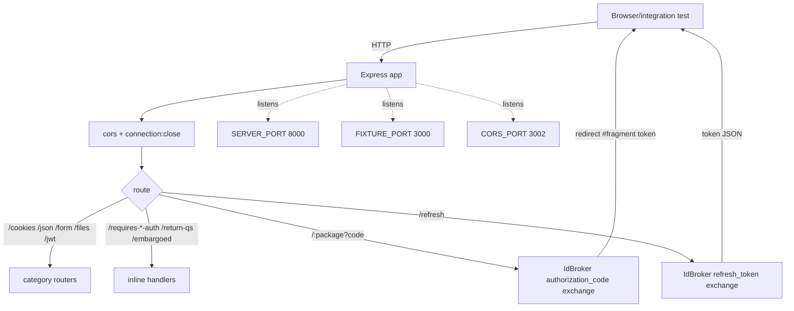
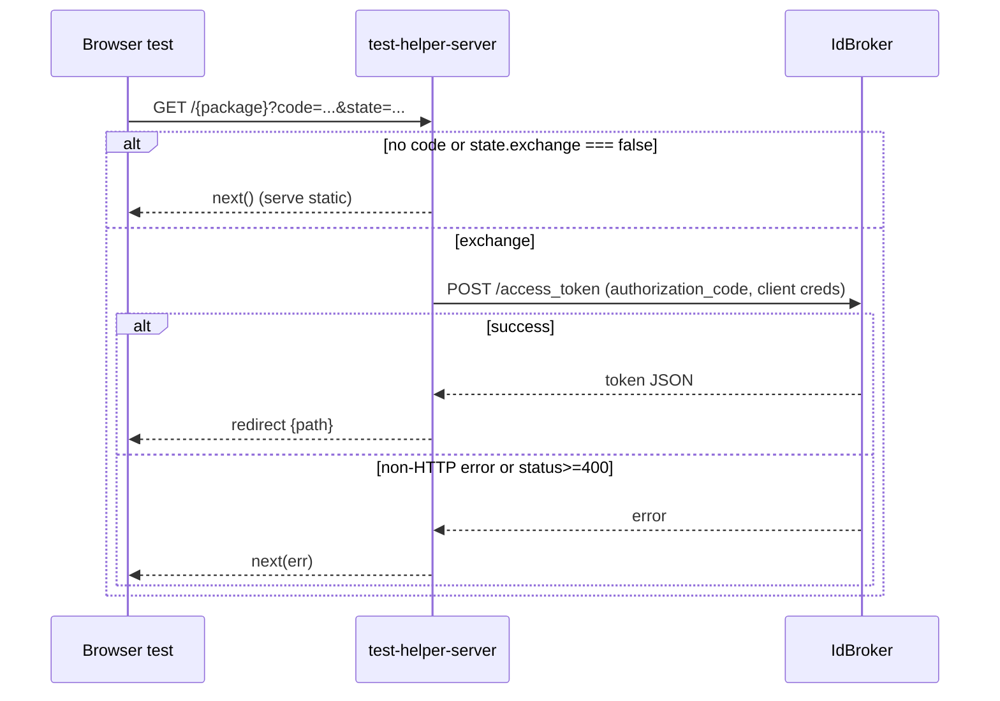
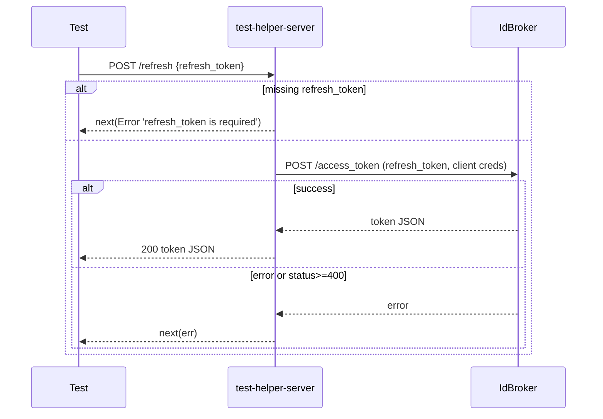
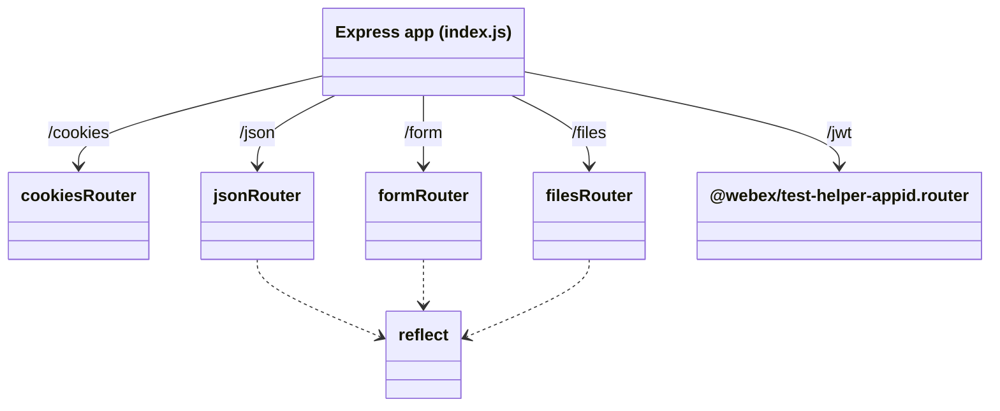

<!-- sdd-generated-metadata
generator: claude-cli
generator_model: us.anthropic.claude-opus-4-8
approved_by: pending-human-review
updated_at: 2026-08-06T00:00:00Z
validation_status: not-run
run_id: 51855eac-8de5-43a2-a3b6-dbcc55ebc91b
-->

# @webex/test-helper-server — SPEC

> Start here → root [`AGENTS.md`](../../../../AGENTS.md) (agent entry) · router [`SPEC_INDEX.md`](../../../../ai-docs/SPEC_INDEX.md) · system [`ARCHITECTURE.md`](../../../../ai-docs/ARCHITECTURE.md). This is the module's canonical spec: orientation, requirements, design, flows, protocol, and tests.
> Context-efficiency: link to canonical docs — don't duplicate them. Load specs on demand per `SPEC_INDEX.md`.

## Metadata

| Field | Value |
|---|---|
| Module id | `test-helper-server` |
| Source path(s) | `packages/@webex/test-helper-server/src/` |
| Parent spec | `—` (standalone test-helper package, no parent module) |
| Doc kind | Module spec |
| Coverage score | Pending coverage assessment |
| Generated from | `module-spec` @ SDLC template library `0.2.2` |
| generated_by / approved_by / updated_at | claude-cli / pending-human-review / 2026-08-06 |
| Validation status | not-run, validator `pending`, assessed 2026-08-06 |

Coverage score is `Pending coverage assessment` until the first coverage review runs. Manifest coverage
state (`Partial`) is authoritative and kept in `.sdd/manifest.json`.

## Evidence Rules
Every requirement cites concrete source evidence using `file path`. Test evidence is preferred for WHY.
Requirements are grounded in the current implementation under `src/`.

## Source Material Register

| Source material | Scope | Decision | Detail location or disposition |
|---|---|---|---|
| Package `package.json` | overview / build | verified | Stack, build wiring, and dependencies placed in Stack and Requires. |
| `src/index.js` + route modules | API / behavior | verified | Server topology, routes, and OAuth flows placed in Requirements, Public Surface, Protocol, Data Flow. |

## Overview

`@webex/test-helper-server` is a standalone Express-based fixture server for the Webex JS SDK's browser
and integration tests. `src/index.js` boots an Express app and listens on three ports (server, fixture,
CORS) so tests can exercise real HTTP behavior — CORS, cookies, JSON/form reflection, file upload/download,
basic/bearer auth checks, JWT issuance, and the OAuth2 authorization-code/refresh flows against
IdBroker.

The app permissively allows all CORS origins with credentials, browserifies per-package automation
fixtures on demand, serves per-package fixture static assets, and mounts small routers for each fixture
category. A maintainer should start at `src/index.js` and then read the mounted routers
(`cookies.js`, `json.js`, `form.js`, `files.js`) and the shared `reflect.js` handler.

## Purpose / Responsibility

Owns a local, permissive HTTP test server that provides deterministic endpoints and OAuth redirect
handling for SDK browser/integration tests. It does NOT own the SDK under test, test assertions, or any
production behavior; it is a dev/test-only fixture.

## Stack

JavaScript (CommonJS + some ESM under `src/`, built to `dist/` via `webex-legacy-tools build`). Node
`>=18`. Express `^4.19.2` with `body-parser`, `compression`, `cors`, `cookie-parser`, `morgan`,
`multer`, `browserify-middleware`, `glob`, `mkdirp`, `request`, `urlsafe-base64`, `btoa`, `uuid`.
Delegates JWT routes to `@webex/test-helper-appid`.

## Folder / Package Structure

```
packages/@webex/test-helper-server/src/
├── index.js     # Express app: 3 servers, CORS, browserify fixtures, auth/qs/embargo routes, OAuth code+refresh
├── cookies.js   # /cookies router: set / expect a cookie
├── json.js      # /json router: get object, reflect on set (PATCH/POST/PUT)
├── form.js      # /form router: urlencoded reflect (PATCH/PUT/POST)
├── files.js     # /files router: raw reflect, upload/download, multer metadata, static get
└── reflect.js   # shared handler echoing request body + content-type
```

## Key Files (source of truth)

| File | Holds |
|---|---|
| `packages/@webex/test-helper-server/src/index.js` | App wiring, the three `http.createServer(...).listen` ports, CORS policy, glob-based fixture browserify/static, auth/embargo/qs routes, `/refresh` and OAuth code-exchange logic |
| `packages/@webex/test-helper-server/src/reflect.js` | The echo handler used by json/form/files reflect endpoints |
| `packages/@webex/test-helper-server/src/files.js` | Upload path (`.tmp[/PACKAGE]/files`), download-by-id, multer memory storage |
| `packages/@webex/test-helper-server/package.json` | Build/test scripts, Node engine floor, dependencies |

## Public Surface

Consumed as a running HTTP server (started in test setup), not as an imported code API. Its public
surface is its HTTP routes.

| Contract ID | Type | Surface | Purpose | Compatibility / deprecation | Schema / detail link | Root index |
|---|---|---|---|---|---|---|
| `test-helper-server.root` | HTTP | `GET /` | Redirect dispatcher: reads `state` from URL and navigates to its `name` | Test fixture | `packages/@webex/test-helper-server/src/index.js` | `../../../../ai-docs/CONTRACTS.md` |
| `test-helper-server.cookies` | HTTP | `GET /cookies/set`, `GET /cookies/expect` | Set an `oreo=double stuf` cookie / assert it | Test fixture | `packages/@webex/test-helper-server/src/cookies.js` | `../../../../ai-docs/CONTRACTS.md` |
| `test-helper-server.json` | HTTP | `GET /json/get`, `PATCH/POST/PUT /json/set` | Return `{isObject:true}` / reflect JSON body | Test fixture | `packages/@webex/test-helper-server/src/json.js` | `../../../../ai-docs/CONTRACTS.md` |
| `test-helper-server.form` | HTTP | `PATCH/PUT/POST /form/reflect` | Reflect urlencoded body | Test fixture | `packages/@webex/test-helper-server/src/form.js` | `../../../../ai-docs/CONTRACTS.md` |
| `test-helper-server.files` | HTTP | `POST /files/upload`, `GET /files/download/:id`, `*/files/reflect`, `*/files/metadata`, `GET /files/get/*` | Upload/download/reflect binary, multer metadata, static | Test fixture | `packages/@webex/test-helper-server/src/files.js` | `../../../../ai-docs/CONTRACTS.md` |
| `test-helper-server.jwt` | HTTP | `/jwt/*` | JWT issuance (delegated to `@webex/test-helper-appid` router) | Test fixture | `packages/@webex/test-helper-server/src/index.js` | `../../../../ai-docs/CONTRACTS.md` |
| `test-helper-server.auth` | HTTP | `GET /requires-basic-auth`, `GET /requires-bearer-auth` | 200 if the expected Basic/Bearer header is present, else 403 | Test fixture | `packages/@webex/test-helper-server/src/index.js` | `../../../../ai-docs/CONTRACTS.md` |
| `test-helper-server.qs` | HTTP | `GET /return-qs-as-object`, `GET /embargoed` | Echo query as JSON / return 451 | Test fixture | `packages/@webex/test-helper-server/src/index.js` | `../../../../ai-docs/CONTRACTS.md` |
| `test-helper-server.oauth` | HTTP | `GET /:packageName` (code exchange), `POST /refresh` | Exchange auth code / refresh token against IdBroker | Test fixture | `packages/@webex/test-helper-server/src/index.js` | `../../../../ai-docs/CONTRACTS.md` |

Compatibility notes:
- Endpoints, expected auth header literals (`Basic btoa('basicuser:basicpass')`, `Bearer bearertoken`),
  and fixed responses are the fixture contract relied on by SDK tests.

## Requires (dependencies)

- `express` and middleware: `body-parser`, `compression`, `cors`, `cookie-parser`, `morgan`, `multer`,
  `browserify-middleware`, `glob`, `mkdirp`, `request`, `urlsafe-base64`, `btoa`, `uuid`.
- `@webex/test-helper-appid` — provides the `/jwt` router.
- Environment: `WEBEX_CLIENT_ID`, `WEBEX_CLIENT_SECRET`, `WEBEX_REDIRECT_URI`, `IDBROKER_BASE_URL`
  (defaults `https://idbroker.webex.com`), `SERVER_PORT` (8000), `FIXTURE_PORT` (3000), `CORS_PORT`
  (3002), `DEBUG`, `PACKAGE`.
- Repo layout: expects package automation fixtures at `packages/{*,*/*}/test/automation/fixtures`.

## Requirements

| ID | WHAT | WHY | Source Evidence | Test / Example Evidence | Assumptions / Gaps | Confidence |
|---|---|---|---|---|---|---|
| `TEST-HELPER-SERVER-R-001` | Boots one Express app and listens on three ports: `SERVER_PORT` (8000), `FIXTURE_PORT` (3000), `CORS_PORT` (3002). | Browser tests need distinct same-origin/cross-origin server endpoints. | `packages/@webex/test-helper-server/src/index.js` | Browser/integration test setup | none identified | PRESENT |
| `TEST-HELPER-SERVER-R-002` | CORS allows all origins with `credentials: true`; every response sets `connection: close`. | Permissive CORS for cross-origin tests; connection-close eases IE connection limits. | `packages/@webex/test-helper-server/src/index.js` | Browser tests | none identified | PRESENT |
| `TEST-HELPER-SERVER-R-003` | For each `packages/{*,*/*}/test/automation/fixtures/app.js`, serves a browserified `/{package}/app.js`; serves each fixtures dir as static under `/{package}`. | Tests load per-package browser fixtures compiled on demand. | `packages/@webex/test-helper-server/src/index.js` | Browser tests | none identified | PRESENT |
| `TEST-HELPER-SERVER-R-004` | Auth probes: `/requires-basic-auth` returns 200 only for `Basic btoa('basicuser:basicpass')`, `/requires-bearer-auth` only for `Bearer bearertoken`, else 403. | Deterministic auth-header assertions for the request stack. | `packages/@webex/test-helper-server/src/index.js` | Integration tests | none identified | PRESENT |
| `TEST-HELPER-SERVER-R-005` | `/return-qs-as-object` echoes the query string as JSON; `/embargoed` returns HTTP 451. | Verify query serialization and embargo (451) handling. | `packages/@webex/test-helper-server/src/index.js` | Integration tests | none identified | PRESENT |
| `TEST-HELPER-SERVER-R-006` | On `GET /:package?code=...` it exchanges the auth code (unless `state.exchange===false`) via IdBroker `authorization_code` grant and redirects with the token in the URL fragment. | Completes browser OAuth redirect flows for automation tests. | `packages/@webex/test-helper-server/src/index.js` | Automation tests | Requires WEBEX_CLIENT_ID/SECRET/REDIRECT_URI env | PRESENT |
| `TEST-HELPER-SERVER-R-007` | `POST /refresh` requires `refresh_token`, performs the IdBroker `refresh_token` grant, and returns the new token JSON (400/next(err) on missing/invalid). | Lets tests refresh tokens through a server endpoint. | `packages/@webex/test-helper-server/src/index.js` | Automation tests | none identified | PRESENT |
| `TEST-HELPER-SERVER-R-008` | Reflect handler echoes the request body with the incoming `content-type`; `/files/upload` stores to `.tmp[/PACKAGE]/files/{uuid}` and `/files/download/:id` returns it. | Round-trip body and binary upload/download fixtures. | `packages/@webex/test-helper-server/src/reflect.js`, `packages/@webex/test-helper-server/src/files.js`, `packages/@webex/test-helper-server/src/json.js`, `packages/@webex/test-helper-server/src/form.js` | Integration tests | none identified | PRESENT |
| `TEST-HELPER-SERVER-R-009` | Mounts `/cookies`, `/json`, `/form`, `/files`, and `/jwt` (the `@webex/test-helper-appid` router). | Groups fixtures by category and reuses the appid JWT router. | `packages/@webex/test-helper-server/src/index.js`, `packages/@webex/test-helper-server/src/cookies.js` | Integration tests | none identified | PRESENT |

## Design Overview

`index.js` constructs a single Express `app`, layers middleware (optional morgan logging when `DEBUG`,
permissive CORS, raw image body-parser, compression, connection-close), then mounts category routers and
defines inline auth/qs/embargo routes. Two glob passes discover per-package automation fixtures: one
registers a browserify middleware for each `app.js`, the other serves each fixtures directory statically
and intercepts requests carrying an OAuth `code` to perform the IdBroker code exchange and fragment
redirect. `POST /refresh` mirrors that exchange for refresh tokens. Finally the same `app` is bound to
three ports so tests get same-origin and cross-origin endpoints from one process.

The category routers are thin: `reflect.js` is a shared echo used by `json`, `form`, and `files`;
`files.js` adds real disk upload/download and multer memory-storage metadata; `cookies.js` sets/asserts a
fixed cookie.

## Data Flow



## Sequence Diagram(s)

Sequence coverage: distinct operation groups (reflect/fixture serving is trivial; the two OAuth flows
have external calls and failure branches), so the OAuth exchanges get dedicated diagrams.

| Operation group | Diagram | Failure / recovery coverage |
|---|---|---|
| OAuth authorization-code exchange | 1. code exchange | `alt` covers `exchange===false` skip, non-HTTP error, and CI 4xx |
| Token refresh | 2. refresh | `alt` covers missing `refresh_token` and CI error/4xx |

### 1. Authorization-code exchange



### 2. Token refresh



## Class / Component Relationships



The app composes category routers; `json`, `form`, and `files` reuse the shared `reflect` handler.

## Use Cases

- **UC-1 Complete a browser OAuth login:** the browser is redirected to `/{package}?code=...`; the server
  exchanges the code and redirects with the token in the fragment. Evidence:
  `packages/@webex/test-helper-server/src/index.js`.
- **UC-2 Reflect a request body:** a test POSTs JSON to `/json/set` and asserts the echoed body/content-type.
  Evidence: `packages/@webex/test-helper-server/src/json.js`, `packages/@webex/test-helper-server/src/reflect.js`.
- **UC-3 Upload then download a file:** `POST /files/upload` returns a `loc`; `GET /files/download/:id`
  returns the bytes. Evidence: `packages/@webex/test-helper-server/src/files.js`.

## Protocol / Wire Format

- OAuth exchanges use IdBroker `POST {IDBROKER_BASE_URL}/idb/oauth2/v1/access_token` with form grants
  (`authorization_code` or `refresh_token`) and HTTP Basic client credentials; the code flow redirects
  with the token serialized in the URL fragment (`#state&...token`).
- `state` is a URL-safe base64 JSON object read via `urlsafe-base64` (fields include `name`, `exchange`).
- Reflect endpoints preserve the request `content-type` on the echoed response.
Evidence: `packages/@webex/test-helper-server/src/index.js`, `packages/@webex/test-helper-server/src/reflect.js`.

## Error Handling & Failure Modes

| Condition | Signal (error/code/result) | Caller recovery |
|---|---|---|
| Missing `refresh_token` on `/refresh` | `next(Error('refresh_token is required'))` | Send a refresh token |
| IdBroker non-HTTP error | `next(err)` (Express error handler) | Check connectivity/credentials |
| IdBroker status >= 400 | `next(new Error(response.body))` | Verify client id/secret/code |
| Wrong/absent auth header | 403 | Send the exact expected Basic/Bearer header |
| Embargoed route | 451 | Expected fixture response |
| Upload/download fs error | `next(err)` | Inspect `.tmp` path/permissions |

## Concurrency & Reactive Flow

Three `http.createServer` instances share one Express `app` and its in-memory state; handlers are
independent per-request with no shared mutable app state beyond the filesystem `.tmp` upload directory.
Fixture discovery (`glob.sync`) runs once at startup. Evidence:
`packages/@webex/test-helper-server/src/index.js`.

## Pitfalls

- CORS is fully permissive (all origins, credentials) — this is a test fixture and must never be used in
  production.
- OAuth routes require `WEBEX_CLIENT_ID`/`WEBEX_CLIENT_SECRET`/`WEBEX_REDIRECT_URI`; missing env yields CI
  errors surfaced via `next(err)`, not local validation.
- Uploaded files land under `.tmp[/PACKAGE]/files` keyed by uuid; tests must clean up or tolerate leftover
  files.
- The auth-probe endpoints match exact literal header strings; any deviation returns 403.

## Test-Case Strategy (module)

This package is itself the fixture used by other packages' browser/integration suites; there is no
package-local unit suite. Coverage comes from consuming suites hitting the routes. A positive case
asserts a 200/expected body (e.g. `/json/get` → `{isObject:true}`, correct auth header → 200); a negative
case asserts the failure signal (wrong header → 403, `/embargoed` → 451, missing `refresh_token` → error).

| Behavior / Requirement | Existing test evidence | Gap |
|---|---|---|
| `TEST-HELPER-SERVER-R-001` | Consumer browser test setup | No package-local test; add port/listen smoke test |
| `TEST-HELPER-SERVER-R-004` | Consumer integration tests | Add explicit 200/403 auth-probe assertions |
| `TEST-HELPER-SERVER-R-005` | Consumer integration tests | Assert qs echo + 451 embargo |
| `TEST-HELPER-SERVER-R-006` | Consumer automation tests | Add code-exchange happy/skip assertions |
| `TEST-HELPER-SERVER-R-007` | Consumer automation tests | Assert missing-token error and success |
| `TEST-HELPER-SERVER-R-008` | Consumer integration tests | Assert reflect content-type + upload/download round-trip |

## Traceability

- Repo architecture: [`ARCHITECTURE.md`](../../../../ai-docs/ARCHITECTURE.md) · Registry: [`SPEC_INDEX.md`](../../../../ai-docs/SPEC_INDEX.md)
- Coverage state & contracts baseline: `.sdd/manifest.json`
