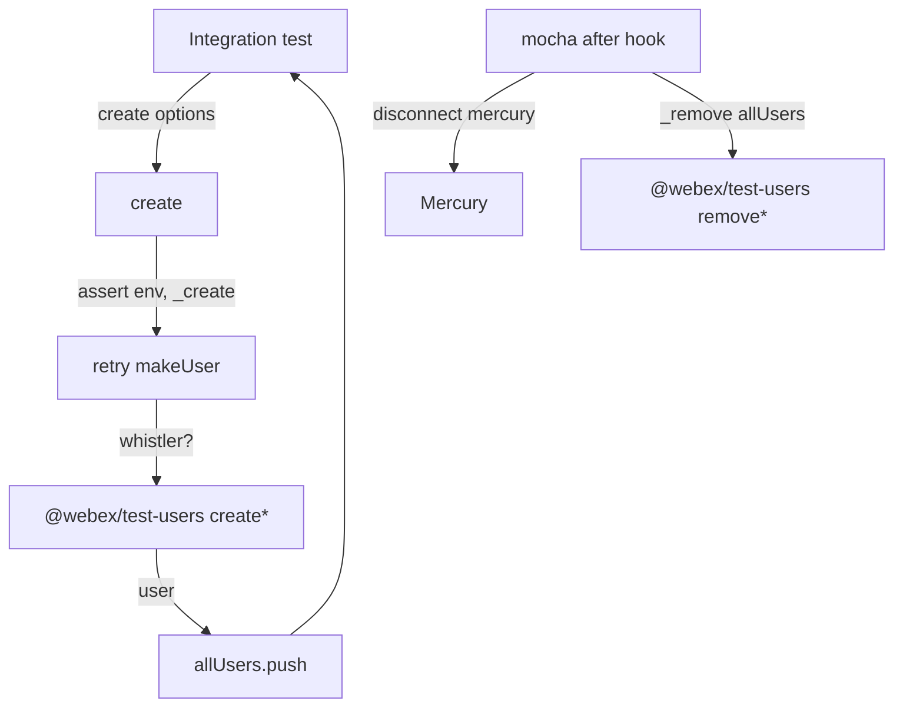
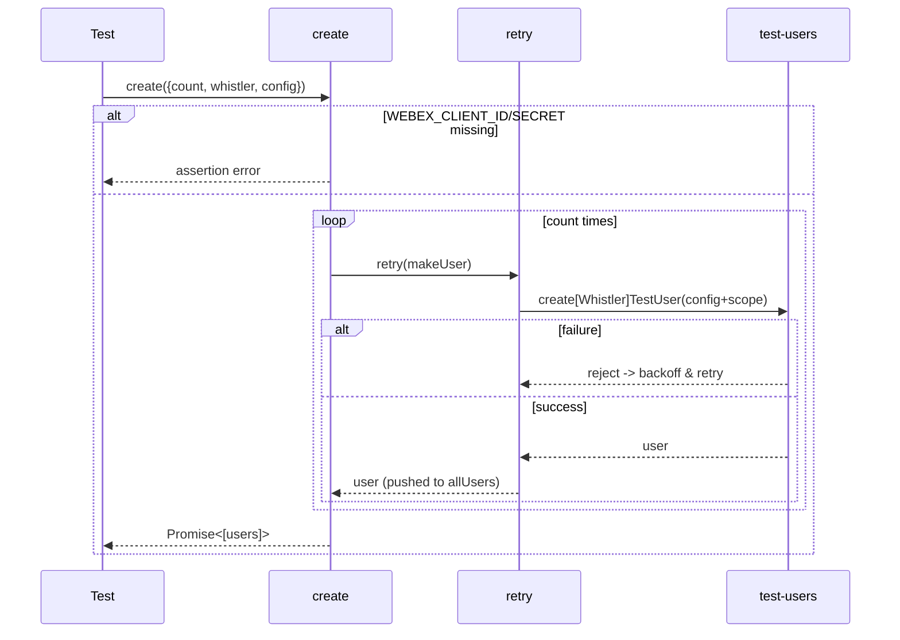
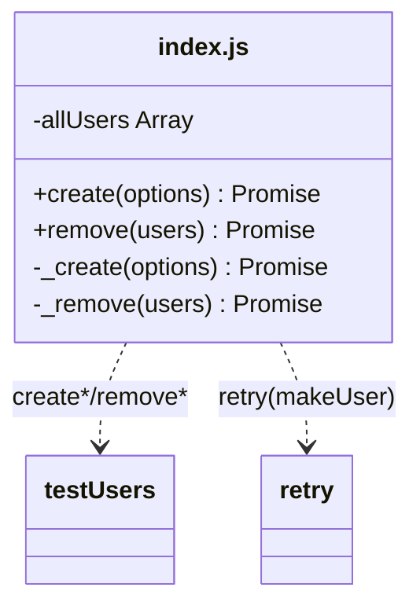

<!-- sdd-generated-metadata
generator: claude-cli
generator_model: us.anthropic.claude-opus-4-8
approved_by: pending-human-review
updated_at: 2026-08-06T00:00:00Z
validation_status: not-run
run_id: 51855eac-8de5-43a2-a3b6-dbcc55ebc91b
-->

# @webex/test-helper-test-users — SPEC

> Start here → root [`AGENTS.md`](../../../../AGENTS.md) (agent entry) · router [`SPEC_INDEX.md`](../../../../ai-docs/SPEC_INDEX.md) · system [`ARCHITECTURE.md`](../../../../ai-docs/ARCHITECTURE.md). This is the module's canonical spec: orientation, requirements, design, flows, and tests.
> Context-efficiency: link to canonical docs — don't duplicate them. Load specs on demand per `SPEC_INDEX.md`.

## Metadata

| Field | Value |
|---|---|
| Module id | `test-helper-test-users` |
| Source path(s) | `packages/@webex/test-helper-test-users/src/` |
| Parent spec | `—` (standalone test-helper package, no parent module) |
| Doc kind | Module spec |
| Coverage score | Pending coverage assessment |
| Generated from | `module-spec` @ SDLC template library `0.2.2` |
| generated_by / approved_by / updated_at | claude-cli / pending-human-review / 2026-08-06 |
| Validation status | not-run, validator `pending`, assessed 2026-08-06 |

Coverage score is `Pending coverage assessment` until the first coverage review runs. Manifest coverage
state (`Partial`) is authoritative and kept in `.sdd/manifest.json`.

## Evidence Rules
Every requirement cites concrete source evidence using `file path`. Test evidence is preferred for WHY.
Requirements are grounded in the current implementation under `src/`.

## Source Material Register

| Source material | Scope | Decision | Detail location or disposition |
|---|---|---|---|
| Package `package.json` | overview / build | verified | Stack, build wiring, and dependencies placed in Stack and Requires. |
| `src/index.js` implementation | API / behavior | verified | Mocha-lifecycle create/remove behavior placed in Requirements, Design Overview, Sequence Diagrams. |

## Overview

`@webex/test-helper-test-users` is a mocha-lifecycle wrapper around `@webex/test-users`. It exposes
`create(options)` and `remove(users)` that provision test users (via either the standard CI gateway or
Whistler) and automatically clean them up in a global mocha `after` hook. Created users are tracked in a
module-level `allUsers` array so teardown can disconnect their Mercury connections and delete them even
if a test forgot to.

It exists so integration tests can get real Webex users in one call and rely on automatic teardown. A
maintainer should start at `src/index.js`.

## Purpose / Responsibility

Owns test-user lifecycle within a mocha run: bulk creation with retry, tracking, and automatic
teardown (Mercury disconnect + delete). It does NOT own the underlying user-provisioning HTTP calls
(delegated to `@webex/test-users`) or retry mechanics (delegated to `@webex/test-helper-retry`).

## Stack

JavaScript (CommonJS `src/index.js`, built to `dist/` via `webex-legacy-tools build`). Node `>=18`.
Runs inside a mocha environment (uses the global `after`). Dependencies: `@webex/test-users`,
`@webex/test-helper-retry`, `lodash`.

## Folder / Package Structure

```
packages/@webex/test-helper-test-users/
├── src/
│   └── index.js   # module.exports = { create, remove }; global after() teardown
└── package.json   # build/test scripts, engines, dependencies
```

## Key Files (source of truth)

| File | Holds |
|---|---|
| `packages/@webex/test-helper-test-users/src/index.js` | `create`/`remove`, `_create`/`_remove` internals, `allUsers` tracking, mocha `after` teardown |
| `packages/@webex/test-helper-test-users/package.json` | Build/test scripts, Node engine floor, dependencies |

## Public Surface

Consumed as an imported CommonJS module by integration test suites.

| Contract ID | Type | Surface | Purpose | Compatibility / deprecation | Schema / detail link | Root index |
|---|---|---|---|---|---|---|
| `test-helper-test-users.create` | SDK | `create(options): Promise<Array<User>>` | Create N users (CI gateway or Whistler), track for teardown | Stable; asserts WEBEX_CLIENT_ID/SECRET | `packages/@webex/test-helper-test-users/src/index.js` | `../../../../ai-docs/CONTRACTS.md` |
| `test-helper-test-users.remove` | SDK | `remove(users): Promise` | Delete the given users (Whistler or standard) with best-effort teardown | Stable | `packages/@webex/test-helper-test-users/src/index.js` | `../../../../ai-docs/CONTRACTS.md` |

Compatibility notes:
- `options` fields (`count`, `whistler`, `config`) and the returned user array shape (from
  `@webex/test-users`) are the contract.

## Requires (dependencies)

- `@webex/test-users` — `createTestUser`, `removeTestUser`, `createWhistlerTestUser`,
  `removeWhistlerTestUser`.
- `@webex/test-helper-retry` — wraps each user creation with retry/backoff.
- `lodash` — `_.defaults` to merge scope into config.
- Environment: `WEBEX_CLIENT_ID`, `WEBEX_CLIENT_SECRET` (asserted in `create`), `WEBEX_SCOPE`.
- A mocha runtime providing the global `after` hook.

## Requirements

| ID | WHAT | WHY | Source Evidence | Test / Example Evidence | Assumptions / Gaps | Confidence |
|---|---|---|---|---|---|---|
| `TEST-HELPER-TEST-USERS-R-001` | `create(options)` asserts `WEBEX_CLIENT_ID` and `WEBEX_CLIENT_SECRET` are defined, then creates `options.count` (default 1) users, each via `retry(makeUser)`. | Tests need resilient bulk user creation with credentials present. | `packages/@webex/test-helper-test-users/src/index.js` | Integration suites across plugins | none identified | PRESENT |
| `TEST-HELPER-TEST-USERS-R-002` | `makeUser` merges `scopes: WEBEX_SCOPE` into `options.config` and dispatches to `createWhistlerTestUser` when `options.whistler`, else `createTestUser`; each created user is pushed to `allUsers`. | Support both provisioning backends and track users for teardown. | `packages/@webex/test-helper-test-users/src/index.js` | Integration suites | none identified | PRESENT |
| `TEST-HELPER-TEST-USERS-R-003` | A global mocha `after` (timeout 120000) disconnects each tracked user's `webex.internal.mercury` (when present) and then removes all tracked users. | Prevents leaked Mercury sockets and orphaned users after a suite. | `packages/@webex/test-helper-test-users/src/index.js` | Integration suites | Relies on global `after` existing | PRESENT |
| `TEST-HELPER-TEST-USERS-R-004` | `_remove(users)` deletes Whistler users (when `reservationUrl` present) via `removeWhistlerTestUser`, else `removeTestUser`; strips a token without `authorization`; swallows delete failures with a warning; waits 500ms per user. | Best-effort teardown that never fails the suite and gives requests time to flush. | `packages/@webex/test-helper-test-users/src/index.js` | Integration suites | none identified | PRESENT |

## Design Overview

The module keeps a module-scoped `allUsers` array. `create` validates credentials then calls `_create`,
which builds `count` promises, each `retry(makeUser)` so transient provisioning failures back off and
retry. `makeUser` chooses the Whistler or standard creator based on `options.whistler`, merges the
default scope, and records the user in `allUsers`. Teardown is registered once at module load via the
global mocha `after`: it disconnects Mercury for any user that has it, then delegates to `_remove`, which
picks the correct delete path per user, tolerates failures (logs a warning), and pauses 500ms per user so
in-flight delete requests can leave before the browser closes.

## Data Flow



## Sequence Diagram(s)

Sequence coverage: two distinct operation groups (create, teardown) with different actors/failure
behavior, so two diagrams.

| Operation group | Diagram | Failure / recovery coverage |
|---|---|---|
| Create users | 1. create | `alt` covers missing env (assert throws), retry on provisioning failure |
| Teardown | 2. after/_remove | `alt` covers Whistler vs standard delete; delete failures swallowed with warning |

### 1. Create users



### 2. Teardown

```mermaid
sequenceDiagram
    participant M as mocha after
    participant U as test-users
    M->>M: disconnect webex.internal.mercury (per tracked user)
    M->>U: _remove(allUsers)
    loop each user
        alt user.reservationUrl (Whistler)
            U->>U: removeWhistlerTestUser (catch->warn)
        else standard
            U->>U: strip non-auth token; removeTestUser (catch->warn)
        end
        U->>U: wait 500ms
    end
```

## Class / Component Relationships



The module is a functional wrapper delegating provisioning to `@webex/test-users` and retry to
`@webex/test-helper-retry`.

## Use Cases

- **UC-1 Provision users for a suite:** `create({count: 2})` returns two ready users; the `after` hook
  removes them. Evidence: `packages/@webex/test-helper-test-users/src/index.js`.
- **UC-2 Use Whistler users:** `create({whistler: true})` provisions via Whistler and teardown routes to
  `removeWhistlerTestUser`. Evidence: `packages/@webex/test-helper-test-users/src/index.js`.

## Concurrency & Reactive Flow

`_create` issues `count` creations concurrently via `Promise.all`, each independently retried. Teardown
runs users concurrently in `_remove` (`users.map`), each awaiting a 500ms settle. Shared state is the
`allUsers` array, appended during creation and consumed at teardown. Evidence:
`packages/@webex/test-helper-test-users/src/index.js`.

## Pitfalls

- Teardown depends on the global mocha `after`; outside mocha, users are not auto-removed.
- Delete failures are intentionally swallowed (warn only) so teardown never fails the suite — leaked
  users are possible if the delete API is down.
- The 500ms per-user wait is a deliberate flush window (browsers may close before delete requests return).
- `create` throws synchronously (assertion) when credentials env is missing.

## Test-Case Strategy (module)

Exercised by plugin integration suites that call `create`/`remove`. A positive case asserts `create`
returns the requested number of usable users; a negative case asserts missing credentials cause the
assertion to throw and that a delete failure is swallowed (warning) rather than rejecting teardown.

| Behavior / Requirement | Existing test evidence | Gap |
|---|---|---|
| `TEST-HELPER-TEST-USERS-R-001` | Plugin integration suites (consumers) | No package-local test; add count/assert coverage |
| `TEST-HELPER-TEST-USERS-R-002` | Consumer suites | Assert whistler vs standard dispatch + tracking |
| `TEST-HELPER-TEST-USERS-R-003` | Consumer suites | Assert Mercury disconnect + teardown invoked |
| `TEST-HELPER-TEST-USERS-R-004` | Consumer suites | Assert delete-path selection and failure-swallow |

## Traceability

- Repo architecture: [`ARCHITECTURE.md`](../../../../ai-docs/ARCHITECTURE.md) · Registry: [`SPEC_INDEX.md`](../../../../ai-docs/SPEC_INDEX.md)
- Coverage state & contracts baseline: `.sdd/manifest.json`
