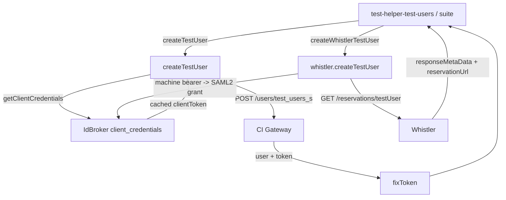
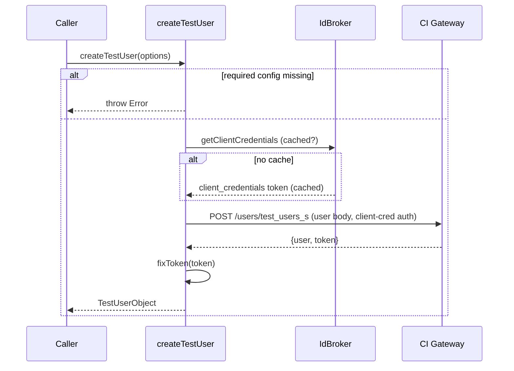
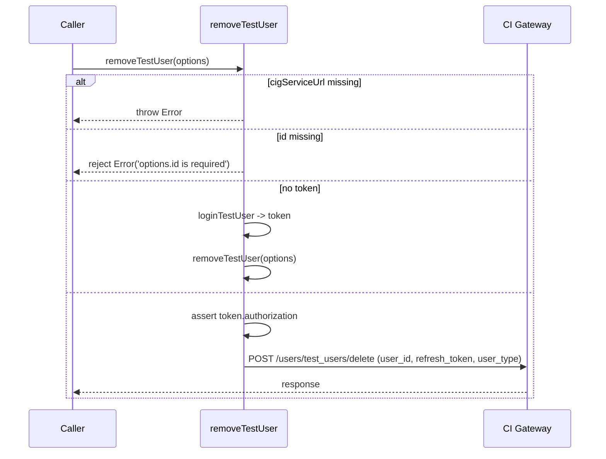
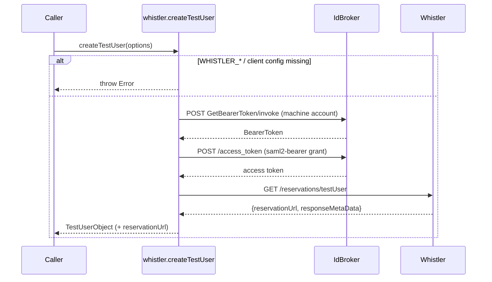
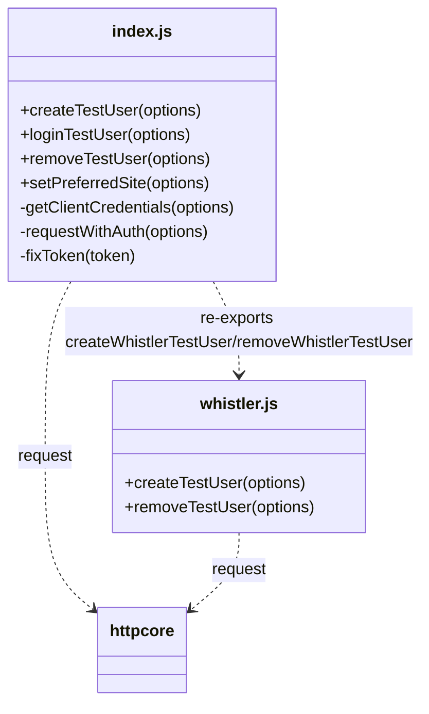

<!-- sdd-generated-metadata
generator: claude-cli
generator_model: us.anthropic.claude-opus-4-8
approved_by: pending-human-review
updated_at: 2026-08-06T00:00:00Z
validation_status: not-run
run_id: 51855eac-8de5-43a2-a3b6-dbcc55ebc91b
-->

# @webex/test-users — SPEC

> Start here → root [`AGENTS.md`](../../../../AGENTS.md) (agent entry) · router [`SPEC_INDEX.md`](../../../../ai-docs/SPEC_INDEX.md) · system [`ARCHITECTURE.md`](../../../../ai-docs/ARCHITECTURE.md). This is the module's canonical spec: orientation, requirements, design, flows, protocol, and tests.
> Context-efficiency: link to canonical docs — don't duplicate them. Load specs on demand per `SPEC_INDEX.md`.

## Metadata

| Field | Value |
|---|---|
| Module id | `test-users` |
| Source path(s) | `packages/@webex/test-users/src/` |
| Parent spec | `—` (standalone test-user provisioning library, no parent module) |
| Doc kind | Module spec |
| Coverage score | Pending coverage assessment |
| Generated from | `module-spec` @ SDLC template library `0.2.2` |
| generated_by / approved_by / updated_at | claude-cli / pending-human-review / 2026-08-06 |
| Validation status | not-run, validator `pending`, assessed 2026-08-06 |

Coverage score is `Pending coverage assessment` until the first coverage review runs. Manifest coverage
state (`Partial`) is authoritative and kept in `.sdd/manifest.json`.

## Evidence Rules
Every requirement cites concrete source evidence using `file path`. Test evidence is preferred for WHY.
Requirements are grounded in the current implementation under `src/`.

## Source Material Register

| Source material | Scope | Decision | Detail location or disposition |
|---|---|---|---|
| Package `package.json` | overview / build | verified | Stack, build wiring, and dependencies placed in Stack and Requires. |
| `src/index.js` + `src/whistler.js` | API / behavior | verified | User CRUD + token/IdBroker flows placed in Requirements, Protocol, Sequence Diagrams. |

## Overview

`@webex/test-users` is the low-level Cisco Webex test-user provisioning library. It talks directly to the
CI Gateway (`test_users` / `test_users_s`) and IdBroker to create, log in, remove, and site-configure
test users, plus a Whistler-backed variant (`src/whistler.js`) that reserves users from the Whistler
service. It caches client-credentials tokens between calls and normalizes token payloads (computing
`expires`/`refresh_token_expires` and an `authorization` string).

It is the engine beneath `@webex/test-helper-test-users`, which adds mocha lifecycle handling. A
maintainer should start at `src/index.js` and `src/whistler.js`.

## Purpose / Responsibility

Owns direct HTTP provisioning of Webex test users (create/login/remove/setPreferredSite) against the CI
Gateway + IdBroker, plus the Whistler reservation variant, and token payload normalization. It does NOT
own mocha lifecycle/teardown (that is `@webex/test-helper-test-users`) or the SDK under test.

## Stack

TypeScript/JavaScript (`src/index.js`, `src/whistler.js`, built to `dist/` via `webex-legacy-tools
build`). Node `>=18`. Uses `@webex/http-core` `request`, `lodash`, `uuid`, `btoa`, `node-random-name`.
Integration tests run under mocha (`test:integration`).

## Folder / Package Structure

```
packages/@webex/test-users/src/
├── index.js      # createTestUser, loginTestUser, removeTestUser, setPreferredSite; token/credentials helpers; re-exports whistler
└── whistler.js   # createTestUser (Whistler reservation) default + removeTestUser
```

## Key Files (source of truth)

| File | Holds |
|---|---|
| `packages/@webex/test-users/src/index.js` | `createTestUser`, `loginTestUser`, `removeTestUser`, `setPreferredSite`, `fixToken`, cached client credentials, `BASE_PATH`/`BASE_PATH_SECURE` |
| `packages/@webex/test-users/src/whistler.js` | Whistler `createTestUser` (reservation) and `removeTestUser` |
| `packages/@webex/test-users/package.json` | Build/test scripts, Node engine floor, dependencies |

## Public Surface

Consumed as an imported code module by `@webex/test-helper-test-users` and integration suites.

| Contract ID | Type | Surface | Purpose | Compatibility / deprecation | Schema / detail link | Root index |
|---|---|---|---|---|---|---|
| `test-users.createTestUser` | SDK | `createTestUser(options): Promise<TestUserObject>` | Create a user via CI Gateway `test_users_s` | Stable | `packages/@webex/test-users/src/index.js` | `../../../../ai-docs/CONTRACTS.md` |
| `test-users.loginTestUser` | SDK | `loginTestUser(options): Promise<AccessTokenObject>` | Exchange username/password for a token | Stable | `packages/@webex/test-users/src/index.js` | `../../../../ai-docs/CONTRACTS.md` |
| `test-users.removeTestUser` | SDK | `removeTestUser(options): Promise` | Delete a user (logs in first if no token) | Stable | `packages/@webex/test-users/src/index.js` | `../../../../ai-docs/CONTRACTS.md` |
| `test-users.setPreferredSite` | SDK | `setPreferredSite(options): Promise` | SCIM PATCH the user's `preferredWebExSite` | Stable | `packages/@webex/test-users/src/index.js` | `../../../../ai-docs/CONTRACTS.md` |
| `test-users.createWhistlerTestUser` | SDK | `createWhistlerTestUser(options): Promise<TestUserObject>` | Reserve a user from Whistler | Stable (re-exported default) | `packages/@webex/test-users/src/whistler.js` | `../../../../ai-docs/CONTRACTS.md` |
| `test-users.removeWhistlerTestUser` | SDK | `removeWhistlerTestUser(options): Promise` | DELETE a Whistler reservation | Stable (re-exported) | `packages/@webex/test-users/src/whistler.js` | `../../../../ai-docs/CONTRACTS.md` |

Compatibility notes:
- `CreateUserOptions`/`TestUserObject`/`AccessTokenObject` typedefs and the exported function names are
  the contract; option fields default to `WEBEX_*`/`IDBROKER_BASE_URL`/`WHISTLER_*` environment variables.

## Requires (dependencies)

- `@webex/http-core` — `request` for all HTTP calls.
- `lodash`, `uuid`, `btoa`, `node-random-name` — defaults, ids/passwords, auth encoding, random names.
- External services: **CI Gateway** (`WEBEX_TEST_USERS_CI_GATEWAY_SERVICE_URL` / legacy
  `WEBEX_TEST_USERS_CONVERSATION_SERVICE_URL`), **IdBroker** (`IDBROKER_BASE_URL`), **Whistler**
  (`WHISTLER_API_SERVICE_URL`), and an identity/SCIM service (`identityServiceUrl`).
- Environment: `WEBEX_CLIENT_ID`, `WEBEX_CLIENT_SECRET`, `WEBEX_SCOPE`, `WHISTLER_MACHINE_ACCOUNT`,
  `WHISTLER_MACHINE_PASSWORD`, `WHISTLER_TEST_ORG_ID`.

## Requirements

| ID | WHAT | WHY | Source Evidence | Test / Example Evidence | Assumptions / Gaps | Confidence |
|---|---|---|---|---|---|---|
| `TEST-USERS-R-001` | `createTestUser` resolves `clientId`/`clientSecret`/`idbrokerUrl`/`cigServiceUrl` from options or env, throwing if any is missing, then `POST`s a user body to `{cigServiceUrl}/users/test_users_s` with client-credential auth. | Deterministic user creation with explicit failure on missing config. | `packages/@webex/test-users/src/index.js` | `packages/@webex/test-users` integration tests | none identified | PRESENT |
| `TEST-USERS-R-002` | Client credentials are fetched once via IdBroker `client_credentials` grant and cached in `clientToken` for reuse across calls. | Avoid re-authenticating for every user operation. | `packages/@webex/test-users/src/index.js` | Integration tests | Module-level cache persists per process | PRESENT |
| `TEST-USERS-R-003` | `fixToken` computes `expires` and `refresh_token_expires` from the `*_in` fields and builds `authorization = "{token_type} {access_token}"`. | Callers need absolute expiry and a ready auth header. | `packages/@webex/test-users/src/index.js` | Integration tests | none identified | PRESENT |
| `TEST-USERS-R-004` | `loginTestUser` `POST`s to `{cigServiceUrl}/users/test_users/login` and returns a fixed-up token. | Exchange credentials for a token when only user/pass is known. | `packages/@webex/test-users/src/index.js` | Integration tests | none identified | PRESENT |
| `TEST-USERS-R-005` | `removeTestUser` requires `cigServiceUrl` and `id`; if no token it logs in first, asserts `token.authorization`, then `POST`s to `{cigServiceUrl}/users/test_users/delete` with `user_id`/`refresh_token`/`user_type`. | Delete a user, self-authenticating if needed. | `packages/@webex/test-users/src/index.js` | Integration tests | Rejects when `id` missing | PRESENT |
| `TEST-USERS-R-006` | `setPreferredSite` SCIM-`PATCH`es `{identityServiceUrl}/identity/scim/{orgId}/v1/Users/{userId}` to set `preferredWebExSite`. | Ensure a created user has the correct Webex site. | `packages/@webex/test-users/src/index.js` | Integration tests | none identified | PRESENT |
| `TEST-USERS-R-007` | Whistler `createTestUser` gets a bearer token via IdBroker (machine account → SAML2 bearer grant) then `GET`s `{whistlerServiceUrl}/reservations/testUser` and maps `responseMetaData` into a user (with `reservationUrl`). | Provision users from the Whistler reservation pool. | `packages/@webex/test-users/src/whistler.js` | Integration tests | Requires WHISTLER_* env | PRESENT |
| `TEST-USERS-R-008` | Whistler `removeTestUser` `DELETE`s `options.reservationUrl` with `Bearer {token}`. | Release a Whistler reservation. | `packages/@webex/test-users/src/whistler.js` | Integration tests | none identified | PRESENT |

## Design Overview

`index.js` centralizes CI-Gateway/IdBroker provisioning. `getClientCredentials` performs an IdBroker
`client_credentials` grant (sending the base64 credentials as the raw `authorization` header without the
`Basic ` prefix, per the endpoint's requirement) and caches the resulting token in a module-scoped
`clientToken`. `requestWithAuth` attaches that token to subsequent CI Gateway calls. `createTestUser`,
`loginTestUser`, `removeTestUser`, and `setPreferredSite` each validate required config from
options-or-env, build the request body, and normalize returned tokens through `fixToken`.
`whistler.js` is a parallel path: it obtains a bearer token via a machine-account → SAML2-bearer grant
chain, then reserves a user from Whistler and maps the reservation metadata to the same
user-object shape, adding a `reservationUrl` used for deletion.

## Data Flow



## Sequence Diagram(s)

Sequence coverage: distinct operation groups with different actors/endpoints and failure behavior, so
create (CI Gateway), remove (with implicit login), and Whistler create get dedicated diagrams.

| Operation group | Diagram | Failure / recovery coverage |
|---|---|---|
| Create (CI Gateway) | 1. createTestUser | `alt` covers missing config (throws) and cached vs fresh credentials |
| Remove (self-login) | 2. removeTestUser | `alt` covers missing id (reject), no-token→login, assert authorization |
| Whistler create | 3. whistler create | `alt` covers missing WHISTLER_* config (throws) |

### 1. createTestUser



### 2. removeTestUser



### 3. Whistler createTestUser



## Class / Component Relationships



`index.js` re-exports the Whistler functions under aliased names; both use `@webex/http-core` `request`.

## Use Cases

- **UC-1 Create a standard test user:** `createTestUser({})` reads env credentials and returns a user with
  a normalized token. Evidence: `packages/@webex/test-users/src/index.js`.
- **UC-2 Remove a user without a token:** `removeTestUser({id, email, password, ...})` logs in first, then
  deletes. Evidence: `packages/@webex/test-users/src/index.js`.
- **UC-3 Reserve a Whistler user:** `createWhistlerTestUser({})` obtains a bearer token and reserves a user.
  Evidence: `packages/@webex/test-users/src/whistler.js`.

## Protocol / Wire Format

- **Client credentials:** `POST {idbrokerUrl}/idb/oauth2/v1/access_token` form `grant_type=client_credentials`
  with the base64 `client_id:client_secret` sent as the raw `authorization` header (no `Basic ` prefix).
- **Create:** `POST {cigServiceUrl}/users/test_users_s` JSON body (entitlements, scopes, password, org, etc.).
- **Login:** `POST {cigServiceUrl}/users/test_users/login`.
- **Delete:** `POST {cigServiceUrl}/users/test_users/delete` `{user_id, refresh_token, user_type}`.
- **Preferred site:** `PATCH {identityServiceUrl}/identity/scim/{orgId}/v1/Users/{userId}` SCIM schemas.
- **Whistler:** IdBroker `GetBearerToken/invoke` → `access_token` (`saml2-bearer` grant) → `GET
  {whistlerServiceUrl}/reservations/testUser`; delete via `DELETE {reservationUrl}` with `Bearer` token.
Evidence: `packages/@webex/test-users/src/index.js`, `packages/@webex/test-users/src/whistler.js`.

## Error Handling & Failure Modes

| Condition | Signal (error/code/result) | Caller recovery |
|---|---|---|
| Missing clientId/secret/idbrokerUrl/cigServiceUrl | `throw new Error(...)` | Set the option or env var |
| `removeTestUser` without `id` | `Promise.reject(Error('options.id is required'))` | Provide the user id |
| `removeTestUser` token lacks `authorization` | assertion error | Ensure login/token present |
| Missing WHISTLER_* config | `throw new Error(...)` | Set Whistler env/options |
| HTTP failure from CI Gateway/IdBroker/Whistler | Rejected promise from `request` | Inspect status/body; retry |

## Concurrency & Reactive Flow

Calls are independent promises; the only shared state is the module-scoped `clientToken` credential cache,
which is populated on first use and reused thereafter (no locking — first caller's grant wins). Whistler
and standard paths are independent. Evidence: `packages/@webex/test-users/src/index.js`.

## Pitfalls

- The IdBroker credentials call sends base64 credentials as the raw `authorization` header **without**
  `Basic ` — matching the endpoint quirk; do not "fix" it to standard Basic auth.
- `clientToken` is cached for the process lifetime; a stale/expired cached token affects later calls in
  the same run.
- `createTestUser` generates a password ending in `zAY1*` to satisfy complexity rules; overriding
  `password` bypasses that guarantee.
- Whistler users carry a `reservationUrl` and must be deleted via the Whistler delete path, not the CI
  Gateway delete.

## Test-Case Strategy (module)

Integration tests (`test:integration`, mocha) provision and remove real users against the CI Gateway and
Whistler. A positive case asserts `createTestUser` returns a user with a normalized token; a negative case
asserts missing-config throws and `removeTestUser` without `id` rejects. `fixToken` can be unit-tested for
expiry/authorization computation.

| Behavior / Requirement | Existing test evidence | Gap |
|---|---|---|
| `TEST-USERS-R-001` | `packages/@webex/test-users` integration tests | Add explicit missing-config throw assertions |
| `TEST-USERS-R-002` | Integration tests | Assert credential caching/reuse |
| `TEST-USERS-R-003` | Integration tests | Add unit test for `fixToken` fields |
| `TEST-USERS-R-005` | Integration tests | Assert missing-id reject + self-login path |
| `TEST-USERS-R-007` | Integration tests | Assert Whistler grant chain + mapping |

## Traceability

- Repo architecture: [`ARCHITECTURE.md`](../../../../ai-docs/ARCHITECTURE.md) · Registry: [`SPEC_INDEX.md`](../../../../ai-docs/SPEC_INDEX.md)
- Coverage state & contracts baseline: `.sdd/manifest.json`
