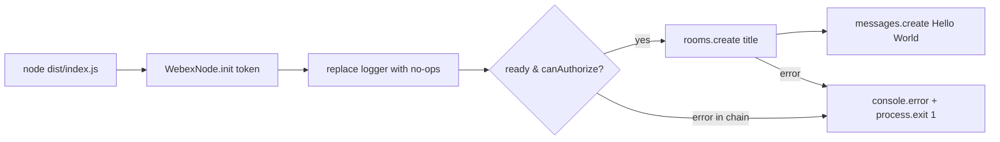
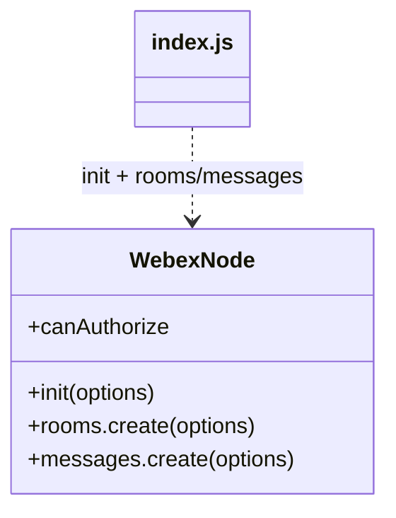

<!-- sdd-generated-metadata
generator: claude-cli
generator_model: us.anthropic.claude-opus-4-8
approved_by: pending-human-review
updated_at: 2026-08-06T00:00:00Z
validation_status: not-run
run_id: 51855eac-8de5-43a2-a3b6-dbcc55ebc91b
-->

# @webex/test-webex-node — SPEC

> Start here → root [`AGENTS.md`](../../../../AGENTS.md) (agent entry) · router [`SPEC_INDEX.md`](../../../../ai-docs/SPEC_INDEX.md) · system [`ARCHITECTURE.md`](../../../../ai-docs/ARCHITECTURE.md). This is the module's canonical spec: orientation, requirements, design, flows, and tests.
> Context-efficiency: link to canonical docs — don't duplicate them. Load specs on demand per `SPEC_INDEX.md`.

## Metadata

| Field | Value |
|---|---|
| Module id | `test-webex-node` |
| Source path(s) | `packages/@webex/test-webex-node/src/` |
| Parent spec | `—` (standalone smoke-test harness, no parent module) |
| Doc kind | Module spec |
| Coverage score | Pending coverage assessment |
| Generated from | `module-spec` @ SDLC template library `0.2.2` |
| generated_by / approved_by / updated_at | claude-cli / pending-human-review / 2026-08-06 |
| Validation status | not-run, validator `pending`, assessed 2026-08-06 |

Coverage score is `Pending coverage assessment` until the first coverage review runs. Manifest coverage
state (`Partial`) is authoritative and kept in `.sdd/manifest.json`.

## Evidence Rules
Every requirement cites concrete source evidence using `file path`. Test evidence is preferred for WHY.
Requirements are grounded in the current implementation under `src/`.

## Source Material Register

| Source material | Scope | Decision | Detail location or disposition |
|---|---|---|---|
| Package `package.json` | overview / build | verified | Stack, build wiring (`test` runs `node dist/index.js`), and dependency on `webex-node` placed in Stack and Requires. |
| `src/index.js` implementation | API / behavior | verified | Init/authorize/create-room/send-message flow placed in Requirements, Design Overview, Sequence Diagram. |

## Overview

`@webex/test-webex-node` is a tiny smoke-test harness that verifies the aggregate `webex-node` package
works in a Node runtime. Its `src/index.js` initializes a `WebexNode` instance with an access token,
silences the logger, and — once the instance is `ready` and can authorize — creates a room and posts a
"Hello World!" message, exiting non-zero on failure.

It is not a library: `package.json`'s `test` script runs the built script directly
(`node dist/index.js`). A maintainer should start and end at `src/index.js`.

## Purpose / Responsibility

Owns an end-to-end runtime smoke test of `webex-node` (init → ready → authorize → create room → send
message). It does NOT own any reusable API, unit tests, or the SDK behavior itself — it only exercises it.

## Stack

TypeScript (`src/index.js`, built to `dist/` via `webex-legacy-tools build`). Executed with `node
dist/index.js` (the package `test` script). Sole runtime dependency: `webex-node` (workspace).

## Folder / Package Structure

```
packages/@webex/test-webex-node/
├── src/
│   └── index.js   # WebexNode.init(...), ready/authorize → rooms.create → messages.create
└── package.json   # build:src, test = "node dist/index.js", webex-node dependency
```

## Key Files (source of truth)

| File | Holds |
|---|---|
| `packages/@webex/test-webex-node/src/index.js` | The entire smoke-test flow: init, logger noop, ready handler, room/message creation, error exit |
| `packages/@webex/test-webex-node/package.json` | `build:src` and `test` (`node dist/index.js`) scripts, `webex-node` dependency |

## Public Surface

This module exposes no importable API; its "surface" is the executable smoke-test script.

Internal Surface — internal use only. Entry point: running `node dist/index.js` (via `yarn test`), which
requires a valid access token substituted into the script.

| Contract ID | Type | Surface | Purpose | Compatibility / deprecation | Schema / detail link | Root index |
|---|---|---|---|---|---|---|
| `test-webex-node.script` | CLI | `node dist/index.js` | Run the webex-node runtime smoke test | Test harness; not published API | `packages/@webex/test-webex-node/src/index.js` | `../../../../ai-docs/CONTRACTS.md` |

Compatibility notes:
- No exported symbols; behavior is a script. Changes to `webex-node`'s `init`, `rooms.create`, or
  `messages.create` surface directly affect this harness.

## Requires (dependencies)

- `webex-node` — provides `WebexNode.init(...)` and the `rooms`/`messages` public plugins plus the
  `ready`/`canAuthorize` lifecycle.
- A valid Webex access token (currently a literal `'INSERT TOKEN HERE'` placeholder to be replaced).

## Requirements

| ID | WHAT | WHY | Source Evidence | Test / Example Evidence | Assumptions / Gaps | Confidence |
|---|---|---|---|---|---|---|
| `TEST-WEBEX-NODE-R-001` | Initializes a `WebexNode` instance via `WebexNode.init({credentials: {access_token}})` and replaces its logger with an all-noop logger. | Exercise real init while suppressing SDK log noise in the smoke test. | `packages/@webex/test-webex-node/src/index.js` | Run via `yarn test` (`node dist/index.js`) | Token is a placeholder to be filled in | PRESENT |
| `TEST-WEBEX-NODE-R-002` | On the `ready` event, when `webex.canAuthorize`, it creates a room titled `'Test Space from NodeJS'` then posts a message `'Hello World!'` to that room. | Validate authorize + room + message end-to-end against a live backend. | `packages/@webex/test-webex-node/src/index.js` | Manual/CI smoke run | none identified | PRESENT |
| `TEST-WEBEX-NODE-R-003` | On failure of the room/message flow it logs the reason via `console.error` and calls `process.exit(1)`. | A failed smoke test must surface a non-zero exit for CI. | `packages/@webex/test-webex-node/src/index.js` | Manual/CI smoke run | none identified | PRESENT |

## Design Overview

The script constructs a `WebexNode` with an access token, then overrides `webex.logger` with an object
whose methods are all no-ops so the smoke test stays quiet. It registers a one-time `ready` listener; when
the instance is authorized (`canAuthorize`), it chains `rooms.create({title})` → `messages.create({text,
roomId})`. Any rejection in that chain logs the reason and exits the process with status 1, giving CI a
clear pass/fail signal. There is no reusable export — the module's value is the side-effecting run.

## Data Flow



## Sequence Diagram(s)

Sequence coverage: a single linear smoke-test operation group, so one diagram covers it (this is a
trivial single-flow harness).

| Operation group | Diagram | Failure / recovery coverage |
|---|---|---|
| Smoke test run | 1. run | `alt` covers not-authorized (no-op) and chain rejection → exit(1) |

### 1. Run

```mermaid
sequenceDiagram
    participant N as node process
    participant W as WebexNode
    participant B as Webex backend
    N->>W: init({credentials:{access_token}})
    N->>W: logger = noop
    W-->>N: ready
    alt canAuthorize
        N->>B: rooms.create({title})
        alt success
            B-->>N: room
            N->>B: messages.create({text, roomId})
        else error
            B-->>N: reject
            N->>N: console.error(reason); process.exit(1)
        end
    else not authorized
        N->>N: do nothing
    end
```

## Class / Component Relationships



The script is a thin driver over the `webex-node` public API.

## Use Cases

- **UC-1 Smoke-test webex-node in Node:** replace the token, run `yarn test`; a room is created and a
  message posted, or the process exits non-zero. Evidence: `packages/@webex/test-webex-node/src/index.js`.

## Pitfalls

- The access token is a hard-coded placeholder (`'INSERT TOKEN HERE'`) — it must be replaced before the
  smoke test can authorize.
- The `test` script runs `dist/index.js`, so `build:src` must run first; a stale/missing build runs old code.
- When `canAuthorize` is false the script silently does nothing (no error), so an invalid token yields no
  room/message but also no explicit failure at that branch.

## Test-Case Strategy (module)

This package *is* a test harness rather than a unit under test; its "test" is executing the script. A
positive run creates a room and posts a message; a negative run (bad token / backend error) logs the error
and exits 1. There is no assertion library — the exit code and console output are the signal.

| Behavior / Requirement | Existing test evidence | Gap |
|---|---|---|
| `TEST-WEBEX-NODE-R-001` | `yarn test` (`node dist/index.js`) | No automated assertion; manual/CI run only |
| `TEST-WEBEX-NODE-R-002` | Manual/CI smoke run | Requires a real token; not run in unit CI |
| `TEST-WEBEX-NODE-R-003` | Manual/CI smoke run | Add explicit exit-code check in CI wrapper |

## Traceability

- Repo architecture: [`ARCHITECTURE.md`](../../../../ai-docs/ARCHITECTURE.md) · Registry: [`SPEC_INDEX.md`](../../../../ai-docs/SPEC_INDEX.md)
- Coverage state & contracts baseline: `.sdd/manifest.json`
