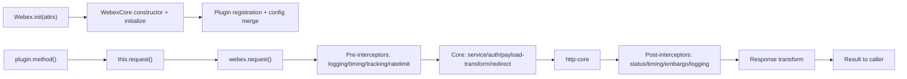
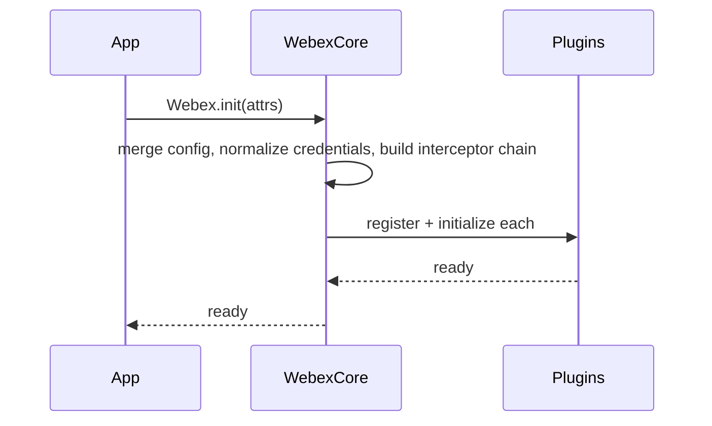
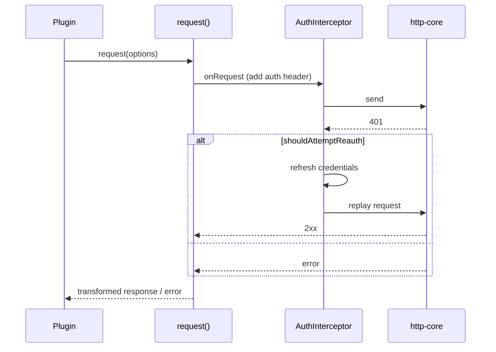
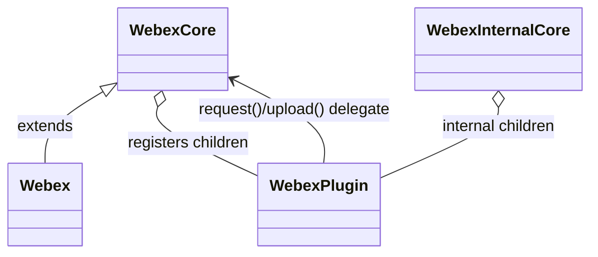

# @webex/webex-core — SPEC

> Start here → root [`AGENTS.md`](../../../../AGENTS.md) (agent entry) · router [`SPEC_INDEX.md`](../../../../ai-docs/SPEC_INDEX.md) · system [`ARCHITECTURE.md`](../../../../ai-docs/ARCHITECTURE.md). This is the module's canonical spec.
> Context-efficiency: link to canonical docs — don't duplicate them. Load specs on demand per `SPEC_INDEX.md`.

## Metadata
| Field | Value |
|---|---|
| Module id | `packages/@webex/webex-core` |
| Source path(s) | `packages/@webex/webex-core/src/` |
| Parent spec | — |
| Doc kind | Module spec |
| Coverage score | Pending coverage assessment |
| Generated from | `module-spec` @ SDLC template library `0.2.2` |
| generated_by / approved_by / updated_at | claude-cli / pending / 2026-08-05T00:00:00Z |
| Validation status | not-run |

## Evidence Rules
Every requirement cites concrete source evidence using `file path`. This module spec was migrated from the repository-level `webex-plugin-architecture.md` narrative during an assess-only bootstrap; the narrative describes package behavior but was not line-verified against `packages/@webex/webex-core/src/` in this pass. Requirements are therefore marked WEAK where source-file evidence has not been confirmed, and gaps are called out explicitly rather than invented.

## Source Material Register
| Source material | Scope | Decision | Detail location or disposition |
|---|---|---|---|
| Reviewed prior webex-core architecture narrative | architecture / API | used | Component classes → Class/Component Relationships & Public Surface; interceptor pipeline → Data Flow & Protocol; storage → Requires & Data Flow; events → State Model & Sequence; original doc retained at repo root. |

## Overview
`@webex/webex-core` (`@webex/webex-core`) is the foundational infrastructure of the Webex JavaScript SDK. It provides the plugin registration framework, HTTP request handling with an interceptor pipeline, authentication/credential normalization, storage management, configuration merging, and an event-driven lifecycle that all other Webex SDK plugins build upon. It demonstrates a layered separation of concerns: a public SDK surface over a plugin layer, over the core (HTTP pipeline, auth, storage, config), over a foundation of AmpersandState, EventEmitter, and http-core.

A maintainer should start at `WebexCore` (the root instance), `WebexInternalCore` (internal-plugin aggregate), and the `WebexPlugin` base class, then follow the interceptor chain and registration path.

## Purpose / Responsibility
Owns the SDK's plugin framework and request/storage/config/event infrastructure: registering plugins, executing HTTP requests through a bidirectional interceptor pipeline, normalizing credentials, and propagating lifecycle events. It does NOT own any specific product capability (meetings, calling, etc.) — those are plugins layered on top.

## Stack
TypeScript/JavaScript on Node/browser; built on AmpersandState (state management) and EventEmitter (events); http-core for the network layer. Built and tested through the workspace toolchain (Babel/`tsc`, Karma/Mocha or Jest per package config).

## Folder / Package Structure
```
packages/@webex/webex-core/src/
├── webex-core.js            # WebexCore class (root instance, request fn, upload, logout)
├── webex-internal-core.js   # WebexInternalCore (internal-plugin aggregate)
├── lib/webex-plugin.js      # WebexPlugin base class
├── interceptors/            # Auth, timing, service, payload-transform, redirect, logging, etc.
├── config.js                # Default configuration values
└── ...                      # storage adapters, plugin registration helpers
```
> Evidence gap: the exact tree above is derived from the migrated architecture narrative, not a fresh disk glob in this assess-only pass. [NEEDS HUMAN INPUT] — confirm current file layout.

## Key Files (source of truth)
| File | Holds |
|---|---|
| `packages/@webex/webex-core/src/webex-core.js` | `WebexCore` construction, initialization, request function, upload phases, logout |
| `packages/@webex/webex-core/src/lib/webex-plugin.js` | `WebexPlugin` base class (initialize, request/upload delegation, `when`, storage/config/logger getters) |
| `packages/@webex/webex-core/src/config.js` | Default config: redirect/replay caps, service discovery, storage, payload transformer |
| `packages/@webex/webex-core/src/interceptors/auth.js` | `AuthInterceptor` (auth headers, 401 handling, reauth/replay) |

## Public Surface
| Contract ID | Type | Surface | Purpose | Compatibility / deprecation | Schema / detail link | Root index |
|---|---|---|---|---|---|---|
| `webex-core.registerPlugin` | SDK | `registerPlugin(name, ctor, options)` | Register a public plugin (proxies, interceptors, config, transforms, onBeforeLogout) | stable; additive options | exported declarations | [`CONTRACTS.md`](../../../../ai-docs/CONTRACTS.md) |
| `webex-core.registerInternalPlugin` | SDK | `registerInternalPlugin(name, ctor, options)` | Register an internal plugin on `webex.internal` | stable | exported declarations | [`CONTRACTS.md`](../../../../ai-docs/CONTRACTS.md) |
| `webex-core.request` | SDK | `webex.request(options)` | HTTP request through the interceptor pipeline | stable | exported declarations | [`CONTRACTS.md`](../../../../ai-docs/CONTRACTS.md) |
| `webex-core.storage` | SDK | `boundedStorage` / `unboundedStorage` `get/set/del/clear` | Namespaced client-side storage | stable | exported declarations | [`CONTRACTS.md`](../../../../ai-docs/CONTRACTS.md) |
| `WebexPlugin` | SDK | base class | Extended by every plugin | stable base API | exported declarations | [`CONTRACTS.md`](../../../../ai-docs/CONTRACTS.md) |

Compatibility notes:
- Exports and the `WebexPlugin` base API are semver-sensitive; removals require a major bump.

## Requires (dependencies)
- **AmpersandState** — base state management for core and plugins.
- **EventEmitter** — event system.
- **http-core (`@webex/http-core`)** — network layer under the interceptor pipeline.
- **Host credentials** — access token / credential object supplied at `Webex.init`.

## Requirements
| ID | WHAT | WHY | Source Evidence | Test / Example Evidence | Assumptions / Gaps | Confidence |
|---|---|---|---|---|---|---|
| `WEBEX-CORE-R-001` | `registerPlugin`/`registerInternalPlugin` add a plugin to `_children`, optionally proxy methods to root, merge config, and register interceptors | Plugin framework is the SDK's extension mechanism | `packages/@webex/webex-core/src/` (registration helpers) | None found in this pass | Not line-verified; migrated from architecture narrative | WEAK |
| `WEBEX-CORE-R-002` | `webex.request(options)` runs pre → core → post interceptors in a fixed order, including auth header injection and 401 reauth/replay | Centralizes cross-cutting HTTP concerns for all plugins | `packages/@webex/webex-core/src/interceptors/auth.js` | None found in this pass | Interceptor order from narrative; confirm against code | WEAK |
| `WEBEX-CORE-R-003` | Credentials are normalized at construction (string tokens → credential objects; bearer validation/correction) | Accept varied host token formats safely | `packages/@webex/webex-core/src/webex-core.js` | None found in this pass | Confirm `bearerValidator` behavior | WEAK |
| `WEBEX-CORE-R-004` | `ready` aggregates readiness of all plugins; child change events bubble to parent with a namespace prefix | Lifecycle coordination and reactive updates | `packages/@webex/webex-core/src/webex-core.js` | None found in this pass | Confirm event names | WEAK |
| `WEBEX-CORE-R-005` | `upload()` performs a three-phase upload (initialize/upload/finalize) with abort on size-limit exceed | File upload support with bounded sessions | `packages/@webex/webex-core/src/webex-core.js` | None found in this pass | Confirm phase methods | WEAK |
| `WEBEX-CORE-R-006` | Storage exposes bounded and unbounded stores with `get/set/del/clear`, key-namespaced per plugin, over memory/local/session adapters | Consistent client-side persistence for plugins | `packages/@webex/webex-core/src/config.js` (storage config) | None found in this pass | Confirm adapter defaults | WEAK |

## Design Overview
The core is layered: `WebexCore` is the root AmpersandState instance that owns config, the request function, session id, and storage; `WebexInternalCore` aggregates internal plugins; `WebexPlugin` is the base every plugin extends, delegating `request`/`upload` to the root and exposing namespace-scoped config/storage/logger. Cross-cutting HTTP behavior lives in an ordered interceptor chain rather than in each plugin, so auth, timing, service resolution, payload transformation, and logging apply uniformly. Configuration is merged in layers (defaults → plugin configs at registration → user config at init → runtime `setConfig`).

## Data Flow


## Sequence Diagram(s)
Sequence coverage:

| Operation group | Diagram | Failure / recovery coverage |
|---|---|---|
| SDK init & plugin load | Init sequence | plugin init failure surfaces via `ready` (not-ready) |
| HTTP request lifecycle | Request sequence | 401 → reauth → replay branch |





## Class / Component Relationships

`WebexCore` owns the root state, request function, and storage; each `WebexPlugin` child holds namespace config/logger/storage and delegates network work to the root. `WebexInternalCore` aggregates the internal plugin set.

## Use Cases
- **UC-1 Initialize SDK:** App calls `Webex.init({credentials})` → config merged, credentials normalized, interceptors built, plugins registered/initialized → `ready`. Evidence: `packages/@webex/webex-core/src/webex-core.js`.
- **UC-2 Plugin request:** `webex.people.get(id)` → `WebexPlugin.request` → `webex.request()` → full interceptor pipeline → transformed result. Evidence: `packages/@webex/webex-core/src/interceptors/`.
- **UC-3 Storage access:** `webex.boundedStorage.get(key)` → adapter resolution → namespaced key → value. Evidence: `packages/@webex/webex-core/src/config.js`.

## State Model
<!-- module.holds_client_state = true -->
Client-side state held in memory via AmpersandState: `WebexCore` tracks `loaded` (data loaded from storage) and `ready` (all plugins initialized) plus merged `config` and `sessionId`; each plugin holds its own `ready` and namespace config. Transitions are triggered by init, storage load, config change (`change:config`), and logout (`client:logout`). Child `change` events bubble to the parent with a namespace prefix (e.g. `change:people`).

## Business Rules & Invariants
<!-- module.enforces_domain_rules = true -->
- A request that requires credentials must not proceed without a valid bearer token; the `AuthInterceptor` enforces attachment and bounded reauth (`maxAuthenticationReplays`). Enforced in `interceptors/auth.js`.
- Redirects are bounded by `maxAppLevelRedirects` / `maxLocusRedirects` (config.js).
- `ready` is true only when every registered plugin reports ready.

## Concurrency & Reactive Flow
<!-- module.is_concurrent_async = true -->
- Requests are asynchronous and pass through the interceptor chain; `when(event)` provides promise-based waiting on lifecycle events.
- Child event propagation is reactive — parent `ready` recomputes when a child's ready state changes.
- Ordering guarantee: interceptor order is fixed (pre → core → post) so cross-cutting behavior is deterministic.

## Protocol / Wire Format
<!-- module.exposes_wire_protocol = true -->
- HTTP requests/responses are shaped by the interceptor pipeline: service URL resolution by service name, auth headers, tracking id, and bidirectional payload transformation (including encryption/decryption via `PayloadTransformerInterceptor`). Parser/serializer ownership sits in the payload transformer and the individual interceptors. Exact request option schema is defined by the exported types and `http-core`.

## Error Handling & Failure Modes
<!-- module.returns_caller_errors = true -->
| Condition | Signal (error/code/result) | Caller recovery |
|---|---|---|
| 401 Unauthorized | Auth interceptor triggers reauth/replay; error surfaces if reauth fails | Re-authenticate the host session |
| Redirect cap exceeded | Request error | Do not retry blindly; inspect service config |
| Upload exceeds size limit | Upload session aborted | Reduce payload / handle abort |
| Plugin not ready | `ready` stays false | Await `ready` before calling |

## Pitfalls
- Interceptor **order** matters; adding an interceptor in the wrong position changes auth/logging behavior for every plugin.
- Credential normalization accepts several token shapes — do not assume a single input format.
- `ready` aggregation means one slow/failed plugin can block SDK readiness.

## Module Do's / Don'ts
<!-- module.module_specific_conventions = true -->
- DO register cross-cutting HTTP behavior as an interceptor, not inline in a plugin.
- DO delegate network/upload work to `webex.request()` / `webex.upload()` from within plugins.
- DON'T log tokens/credentials in interceptors or loggers.

## Export Stability
<!-- module.published_package = true -->
`@webex/webex-core` is published; `WebexCore`, `WebexInternalCore`, `WebexPlugin`, `registerPlugin`, and `registerInternalPlugin` are consumer contracts. Adding optional config/options is a minor change; removing or renaming an export or changing the base-class API is a major change.

## Key Design Trade-off
<!-- module.has_design_tradeoff = true -->
- Centralizing HTTP concerns in a fixed interceptor chain trades per-plugin flexibility for uniform, testable, and secure cross-cutting behavior (auth, timing, transforms) across the entire SDK.

## Test-Case Strategy (module)
Unit tests should cover the registration path (plugin added, config merged, proxies created), the interceptor chain (auth header added, 401 → reauth/replay positive and the reauth-exhausted negative), credential normalization variants, storage get/set/del/clear per adapter, and `ready` aggregation. Evidence for existing tests was not enumerated in this assess-only pass.

| Behavior / Requirement | Existing test evidence | Gap |
|---|---|---|
| `WEBEX-CORE-R-001` | None found | Confirm registration unit tests |
| `WEBEX-CORE-R-002` | None found | Confirm interceptor-order + 401 replay tests |
| `WEBEX-CORE-R-003` | None found | Confirm credential-normalization tests |
| `WEBEX-CORE-R-006` | None found | Confirm storage adapter tests |

## Traceability
- Repo architecture: [`../../../../ai-docs/ARCHITECTURE.md`](../../../../ai-docs/ARCHITECTURE.md) · Registry: [`../../../../ai-docs/SPEC_INDEX.md`](../../../../ai-docs/SPEC_INDEX.md)
- Coverage state & contracts baseline: `.sdd/manifest.json`
