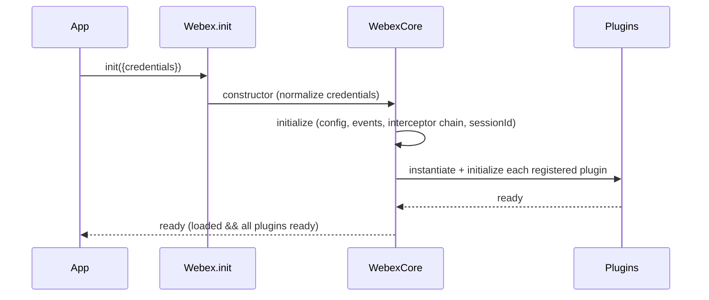
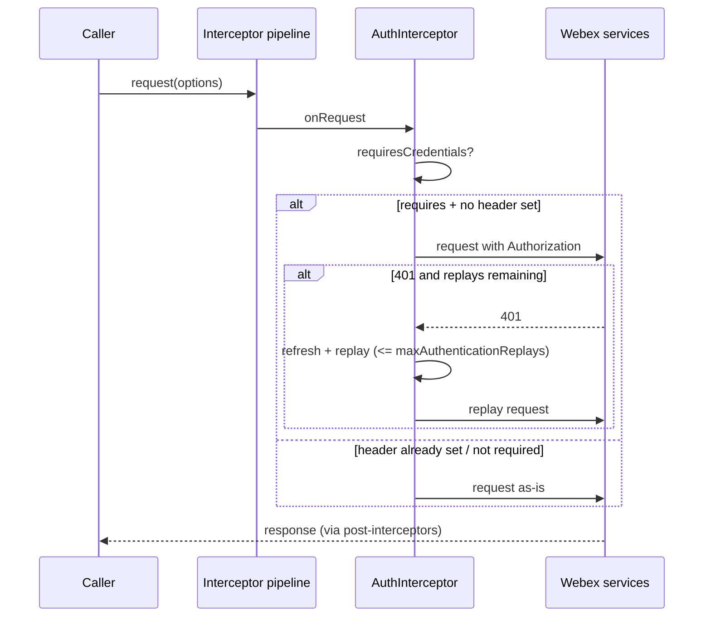
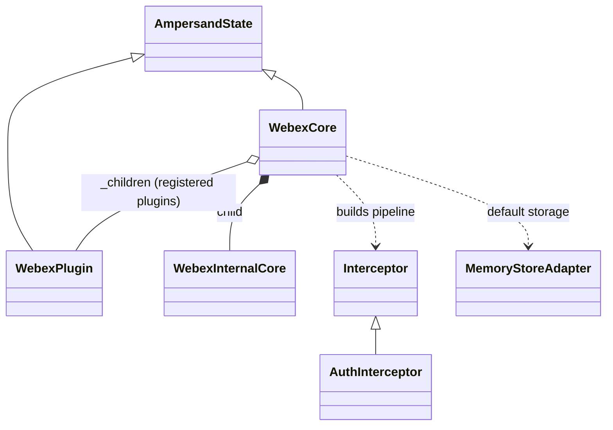

# @webex/webex-core — SPEC

> Start here → root [`AGENTS.md`](../../../../AGENTS.md) (agent entry) · router [`SPEC_INDEX.md`](../../../../ai-docs/SPEC_INDEX.md) · system [`ARCHITECTURE.md`](../../../../ai-docs/ARCHITECTURE.md). This is the module's canonical spec: orientation, requirements, design, flows, state, and tests.
> Context-efficiency: link to canonical docs — don't duplicate them. Load specs on demand per `SPEC_INDEX.md`.

## Metadata
| Field | Value |
|---|---|
| Module id | `@webex/webex-core` |
| Source path(s) | `packages/@webex/webex-core/` |
| Parent spec | — |
| Doc kind | Module spec |
| Coverage score | Pending coverage assessment |
| Generated from | `module-spec` @ SDLC template library `0.2.2` |
| generated_by / approved_by / updated_at | claude-cli / pending / 2026-08-04T00:00:00Z |
| Validation status | not-run |

## Evidence Rules
Every requirement below cites concrete source evidence using `file path`. Source evidence, test
evidence, and gaps are kept separate. This spec was migrated (policy `migrate-existing`) from the routed
source document, with claims re-grounded against current `src/`. Unresolved items are marked
`[NEEDS HUMAN INPUT]`. This is an assess-only draft; it is non-authoritative until validated by an
independent runtime.

## Source Material Register
| Source material | Scope | Decision | Detail location or disposition |
|---|---|---|---|
| Reviewed prior webex-core technical/architecture doc | architecture | used / verified | Layer model, plugin registration, interceptor pipeline, storage, config, and event content routed into Overview, Design Overview, Data Flow, Sequence Diagram(s), Public Surface, and Requirements; re-grounded against `src/`. |
| webex-core source tree | overview / API | verified | Exports and interceptor ordering verified against `src/index.js`, `src/webex-core.js`. |

## Overview
`@webex/webex-core` is the foundational infrastructure package of the Webex JavaScript SDK. It provides
the framework that all other Webex plugins build on: plugin registration, HTTP request handling with an
interceptor pipeline, authentication and credentials, storage management, configuration, and an
event-driven state model. It follows a layered architecture with clear separation of concerns — a
public SDK surface, a plugin layer, the core services layer, and a foundation layer built on
AmpersandState, an event emitter, and HTTP core.

The Webex Core package (`@webex/webex-core`) serves as the foundational infrastructure for the Webex JavaScript SDK. It provides the basic framework for plugin registration, HTTP request handling, authentication, storage management, and event-driven architecture that all other Webex SDK functionality builds upon.

This technical documentation provides a comprehensive overview of the Webex Core package infrastructure, explaining the foundational systems that enable the entire Webex JavaScript SDK ecosystem. The architecture demonstrates a well-designed separation of concerns with clear plugin boundaries, robust HTTP handling, and flexible configuration management.

A maintainer should start at `src/webex-core.js` (the `WebexCore` class and interceptor wiring),
`src/index.js` (the export barrel), `src/lib/webex-plugin.js` (the plugin base class), and
`src/config.js` (default configuration and limits). The package is consumed by the unified `webex`
package and by every `@webex/plugin-*` and `@webex/internal-plugin-*`, which register onto core.

## Purpose / Responsibility
Owns the SDK plugin/runtime foundation: registering plugins, building and running the HTTP interceptor
pipeline, normalizing credentials, exposing storage and configuration, and propagating lifecycle
events. It does NOT own feature behavior (people, rooms, meetings, etc.) or the concrete storage
backends — those live in feature plugins and storage-adapter packages.

## Stack
JavaScript (with TypeScript build support), Node `>=18`. Built with `@webex/legacy-tools` (Babel). Depends
on `ampersand-state` for the state model, `@webex/http-core` for HTTP primitives, and `@webex/common`
for event/retry helpers. Tests: Jest (unit), Mocha (integration), Karma (browser).

## Folder / Package Structure
```
packages/@webex/webex-core/src/
├── index.js                 # export barrel (public surface)
├── webex-core.js            # WebexCore class + interceptor wiring + upload/logout/measure
├── webex-internal-core.js   # WebexInternalCore (internal plugin aggregation)
├── config.js                # default config + redirect/replay/size limits
├── interceptors/            # HTTP pipeline stages (auth, timing, redirect, rate-limit, …)
└── lib/
    ├── webex-plugin.js      # WebexPlugin base class
    ├── stateless-webex-plugin.js
    ├── storage/             # makeWebexStore/makeWebexPluginStore + MemoryStoreAdapter
    ├── credentials/         # Credentials, Token, scope helpers
    ├── services/            # Services, ServiceCatalog (kept in core intentionally)
    └── webex-http-error.js  # WebexHttpError
```

## Key Files (source of truth)
| File | Holds |
|---|---|
| `packages/@webex/webex-core/src/webex-core.js` | `WebexCore` class, interceptor ordering (`preInterceptors`/`postInterceptors`), credential normalization, upload/logout/measure |
| `packages/@webex/webex-core/src/index.js` | the exact public export surface |
| `packages/@webex/webex-core/src/config.js` | default config values and limits (redirects, auth replays) |
| `packages/@webex/webex-core/src/lib/webex-plugin.js` | `WebexPlugin` base class (derived storage/config/logger) |
| `packages/@webex/webex-core/src/interceptors/auth.js` | `AuthInterceptor` request/response/replay behavior |

## Public Surface
This module is consumed as an imported library/package. Exact export list: `src/index.js`.

| Contract ID | Type | Surface | Purpose | Compatibility / deprecation | Schema / detail link | Root index |
|---|---|---|---|---|---|---|
| `webex-core.default` | SDK | `WebexCore` (default export) + `WebexCore.init(attrs)` | root SDK class other packages extend | stable; additive | `src/webex-core.js` | [`CONTRACTS.md`](../../../../ai-docs/CONTRACTS.md) |
| `webex-core.registerPlugin` | SDK | `registerPlugin(name, constructor, options)` | register a public plugin onto core | stable | `src/webex-core.js` | [`CONTRACTS.md`](../../../../ai-docs/CONTRACTS.md) |
| `webex-core.registerInternalPlugin` | SDK | `registerInternalPlugin(name, constructor, options)` | register an internal plugin | stable | `src/webex-core.js` | [`CONTRACTS.md`](../../../../ai-docs/CONTRACTS.md) |
| `webex-core.WebexPlugin` | SDK | `WebexPlugin` base class | base for all plugins | stable | `src/lib/webex-plugin.js` | [`CONTRACTS.md`](../../../../ai-docs/CONTRACTS.md) |
| `webex-core.storage` | SDK | `makeWebexStore`, `makeWebexPluginStore`, `MemoryStoreAdapter` | storage factories + default adapter | stable | `src/lib/storage` | [`CONTRACTS.md`](../../../../ai-docs/CONTRACTS.md) |
| `webex-core.credentials` | SDK | `Credentials`, `Token`, `Services`, `ServiceCatalog` | auth + service discovery | stable | `src/lib/credentials`, `src/lib/services` | [`CONTRACTS.md`](../../../../ai-docs/CONTRACTS.md) |
| `webex-core.interceptors` | SDK | `AuthInterceptor`, `RedirectInterceptor`, `PayloadTransformerInterceptor`, … | reusable pipeline stages | stable | `src/interceptors/*` | [`CONTRACTS.md`](../../../../ai-docs/CONTRACTS.md) |

Compatibility notes:
- Adding an export is a minor change; removing/renaming one is a major (breaking) change under semver.

## Requires (dependencies)
- Internal: `@webex/http-core` (HTTP + interceptor base, `HttpStatusInterceptor`), `@webex/common`
  (`proxyEvents`, `retry`, `transferEvents`), `@webex/common-timers`, `@webex/storage-adapter-spec`.
- External: `ampersand-state` `^5.0.3`, `ampersand-events`, `ampersand-collection`, `lodash`,
  `uuid` `^3.3.2`, `jsonwebtoken`, `crypto-js`, `core-decorators`.
- External services: Webex platform (service discovery, auth `/token`) — fail-closed on missing credentials.

## Requirements
| ID | WHAT | WHY | Source Evidence | Test / Example Evidence | Assumptions / Gaps | Confidence |
|---|---|---|---|---|---|---|
| `WEBEX-CORE-R-001` | `WebexCore.init(attrs)` merges default config with provided attributes and returns an initialized instance whose plugins are set up. | Callers need a single entry that produces a ready SDK instance. | `src/webex-core.js`, `src/index.js` | `None found` (host-deferred; not measured) | test evidence not verified in assess-only | PRESENT |
| `WEBEX-CORE-R-002` | The constructor normalizes multiple credential input formats (string token, several `credentials.*` paths) into `credentials.supertoken`, validating/correcting a bearer access token via `bearerValidator`. | Consumers pass tokens in varied shapes; core must standardize them before use. | `src/webex-core.js` (constructor, `bearerValidator`) | `None found` | — | PRESENT |
| `WEBEX-CORE-R-003` | Plugins register via `registerPlugin`/`registerInternalPlugin`, adding the plugin to the `_children` tree, merging its config, proxying named methods, and appending its interceptors and payload transforms. | Extensibility: every feature plugin composes onto core through one registration contract. | `src/webex-core.js` | `None found` | — | PRESENT |
| `WEBEX-CORE-R-004` | Requests run through an ordered interceptor pipeline: pre-interceptors, core interceptors, then post-interceptors. | Cross-cutting concerns (tracking, timing, auth, transform, status) apply uniformly to every request. | `src/webex-core.js` (`preInterceptors`, `interceptors`, `postInterceptors`) | `None found` | ServiceInterceptor/ConversationInterceptor are `undefined` placeholders filled by plugins | PRESENT |
| `WEBEX-CORE-R-005` | The `AuthInterceptor` adds an authorization header only when required, skips overwriting an existing one, handles 401 responses, and replays a request after refresh within the configured replay limit. | Authenticated requests must carry a valid token and recover from expiry without unbounded retry. | `src/interceptors/auth.js`, `src/config.js` (`maxAuthenticationReplays`) | `None found` | — | PRESENT |
| `WEBEX-CORE-R-006` | Core exposes bounded and unbounded storage (derived properties) backed by a configurable adapter, defaulting to `MemoryStoreAdapter`. | Plugins need namespaced storage without owning a backend. | `src/webex-core.js` (derived), `src/lib/storage` | `None found` | — | PRESENT |
| `WEBEX-CORE-R-007` | Child plugin `change:*` events bubble to the parent with a namespace prefix, and `ready` recomputes from `loaded` and child readiness. | A single readiness/event surface for the whole SDK instance. | `src/webex-core.js` (`derived.ready`), source doc §Event System | `None found` | — | PRESENT |
| `WEBEX-CORE-R-008` | `upload()` performs a three-phase upload (initialize → upload → finalize) and aborts when a size limit is exceeded. | Large-file handling with session lifecycle and a safety cap. | `src/webex-core.js` (`upload`, `_uploadPhase*`, `MAX_FILE_SIZE_IN_MB`) | `None found` | — | WEAK |

## Design Overview
Core is an AmpersandState model (`WebexCore = AmpState.extend(...)`) with `WebexInternalCore` as a
child. Construction first normalizes credentials, then `initialize()` merges config, wires loaded/ready
event handlers and child event propagation, builds the interceptor chain from the `interceptors` map
plus the `preInterceptors`/`postInterceptors` ordering arrays, creates the configured request function,
and generates a session id. Plugins are mixed in via `mixinWebexCorePlugins` /
`mixinWebexInternalCorePlugins`; each registered plugin is instantiated by AmpersandState and its
`initialize()` runs. `Services` is deliberately kept inside core (not a standalone internal plugin) so it
initializes before credentials — otherwise early requests would miss federation/service-discovery URLs
(`src/index.js` header comment).

## Data Flow
Data enters as a `webex.request(options)` call, flows through the interceptor pipeline in order, out to
Webex services over HTTP (via `@webex/http-core`), and the response flows back through the post
interceptors before returning to the caller. Transport is HTTP(S).

```mermaid
flowchart LR
  Caller[plugin/webex.request] --> Pre[pre-interceptors: ResponseLogger, RequestTiming, RequestEvent, WebexTrackingId, RateLimit]
  Pre --> CoreI[core interceptors: Service, UserAgent, WebexUserAgent, Auth, PayloadTransformer, Redirect]
  CoreI --> HTTP[@webex/http-core fetch]
  HTTP --> Post[post-interceptors: HttpStatus, NetworkTiming, Embargo, RequestLogger, RateLimit]
  Post --> Caller
```

## Sequence Diagram(s)
Sequence coverage:

| Operation group | Diagram | Failure / recovery coverage |
|---|---|---|
| SDK initialization | Init & plugin bring-up | n/a (init failure surfaces to caller) |
| Authenticated request | Request pipeline with auth | 401 → refresh → replay (bounded) shown as alt branch |





## Class / Component Relationships

`WebexCore` and `WebexPlugin` both extend AmpersandState. Core composes `WebexInternalCore` as a child
and holds registered plugins in `_children`. Interceptors extend the `@webex/http-core` `Interceptor`
base; core builds concrete instances via each interceptor's `.create()`.

## Use Cases
- **UC-1 Initialize the SDK:** app calls `Webex.init({credentials})` → core normalizes credentials →
  initializes config/events/pipeline → plugins load → instance becomes `ready`. Evidence:
  `src/webex-core.js`, `src/index.js`.
- **UC-2 Make an authenticated request:** a plugin calls `this.request()` → delegates to
  `webex.request()` → pipeline runs → `AuthInterceptor` adds the token → response returns. Evidence:
  `src/webex-core.js`, `src/interceptors/auth.js`.
- **UC-3 Access namespaced storage:** `webex.boundedStorage.get(key)` resolves the adapter, namespaces
  the key, and performs the operation. Evidence: `src/lib/storage`.
<!-- module.crosses_service_boundaries = true: cross-service flow is the authenticated-request pipeline in UC-2. -->

## State Model
<!-- module.holds_client_state = true -->
`WebexCore` is an AmpersandState instance. Session properties: `config`, `loaded`, `request`,
`sessionId`. Derived properties: `boundedStorage`, `unboundedStorage`, `ready`. Base events: `loaded`
(data loaded from storage), `ready` (all plugins initialized), `change:config`, `client:logout`. Child
plugins hold their own state and bubble `change:<plugin>` events upward; `ready` is derived from
`loaded` and every child's readiness.

## Business Rules & Invariants
<!-- module.enforces_domain_rules = true -->
- Credential normalization order is significant and must be preserved (constructor path list in `src/webex-core.js`).
- An existing `authorization` header is never overwritten by `AuthInterceptor`; a null/false authorization is deleted to avoid a CORS preflight (`src/interceptors/auth.js`).
- Auth replays are bounded by `maxAuthenticationReplays`; redirects by `maxAppLevelRedirects`/`maxLocusRedirects` (`src/config.js`).
- `Services` must initialize before credentials — it is kept inside webex-core for this reason (`src/index.js`).

## Concurrency & Reactive Flow
<!-- module.is_concurrent_async = true -->
The request pipeline and event system are promise-based and event-driven. Interceptors return promises
and must not block; readiness and change events propagate reactively through the AmpersandState tree.
Ordering within the pipeline is guaranteed by the `preInterceptors`/core/`postInterceptors` arrays; auth
refresh/replay is bounded to avoid unbounded retry loops.

## Error Handling & Failure Modes
<!-- module.returns_caller_errors = true -->
| Condition | Signal (error/code/result) | Caller recovery |
|---|---|---|
| HTTP error status | `WebexHttpError` (via `HttpStatusInterceptor`) | inspect error; retry only if safe |
| 401 unauthorized | handled in `AuthInterceptor.onResponseError` → refresh + replay | automatic within replay limit; surfaces if exhausted |
| Upload exceeds size cap | abort session (`_uploadAbortSession`) | reduce payload below `MAX_FILE_SIZE_IN_MB` |
| Missing required credentials | request fails closed | supply valid credentials |

## Pitfalls
- Reordering the interceptor arrays changes cross-cutting behavior (auth before transform, status handling in post) — treat ordering as a contract.
- `ServiceInterceptor`, `ConversationInterceptor`, and `KmsDryErrorInterceptor` are `undefined` placeholders in the map, filled by plugins; assuming they are always present will break.
- `uuid` is pinned to `^3.3.2`; the v3 API differs from later majors — do not upgrade blindly.
- Browser vs Node divergence via `.shim.js` overrides: changing the Node file only can silently break the browser build.

## Module Do's / Don'ts
<!-- module.module_specific_conventions = true -->
- DO register new cross-cutting behavior as an interceptor via `.create()` and place it in the correct pipeline phase.
- DO extend `WebexPlugin` for new plugins and use `registerPlugin`/`registerInternalPlugin`.
- DON'T overwrite an existing `authorization` header or bypass credential normalization.
- DON'T move `Services` out of webex-core.

## Export Stability
<!-- module.published_package = true -->
Published as `@webex/webex-core` on the internal npm registry. Exports in `src/index.js` are the semver
surface: adding an export is a minor change; removing or renaming one is a major (breaking) change.

## Key Design Trade-off
[NEEDS HUMAN INPUT] — the `module.has_design_tradeoff` profile value is unresolved (`null`) in
`.sdd/manifest.json`, so this section is retained pending a human decision rather than dropped.

Two deliberate trade-offs are strongly suggested by the code and should be confirmed with a maintainer:
- `Services`/`ServiceCatalog` are kept **inside** `@webex/webex-core` rather than extracted to a
  standalone internal plugin, trading module-boundary purity for guaranteed initialization order —
  service discovery must be ready before credentials so early requests resolve federation/service URLs
  (`src/index.js` header comment). Confirmation of this as the intended trade-off is [NEEDS HUMAN INPUT].
- The interceptor pipeline uses fixed `preInterceptors`/core/`postInterceptors` ordering arrays,
  trading dynamic flexibility for a deterministic, contract-like cross-cutting order
  (`src/webex-core.js`). Whether this is a consumer-visible design trade-off is [NEEDS HUMAN INPUT].

## Test-Case Strategy (module)
Unit tests run via Jest (`test:unit`), integration via Mocha (`test:integration`), and browser tests
via Karma (`test:browser`). Positive-and-negative coverage should assert both that a token is added when
required and that an existing/absent authorization header is respected, and that auth replay stops at
the configured limit. Concrete existing-test mapping was not measured in this assess-only pass
(host-deferred coverage).

| Behavior / Requirement | Existing test evidence | Gap |
|---|---|---|
| `WEBEX-CORE-R-002` (credential normalization) | `None found` (not measured) | verify positive + malformed-token cases |
| `WEBEX-CORE-R-005` (auth add/skip/replay) | `None found` (not measured) | verify replay-limit negative case |
| `WEBEX-CORE-R-004` (pipeline ordering) | `None found` (not measured) | verify pre/core/post ordering |

## Component & Flow Reference
Detailed API, pipeline, storage, configuration, event, and code-flow facts routed from the reviewed
prior architecture document and re-grounded against `src/`. Method, property, interceptor, and config
names below are the current source of truth in `packages/@webex/webex-core/src/`.

### Layered Architecture
The Webex Core follows a layered architecture with clear separation of concerns:

```
┌─────────────────────────────────────────┐
│              Webex SDK                  │
│  (Public API - webex/src/webex.js)     │
├─────────────────────────────────────────┤
│            Plugin Layer                 │
│  - Public Plugins (meetings, people)   │
│  - Internal Plugins (device, mercury)  │
├─────────────────────────────────────────┤
│           Webex Core Layer              │
│  - HTTP Pipeline & Interceptors         │
│  - Authentication & Credentials         │
│  - Storage Management                   │
│  - Configuration System                 │
├─────────────────────────────────────────┤
│          Foundation Layer               │
│  - AmpersandState (State Management)    │
│  - EventEmitter (Event System)          │
│  - HTTP Core (Network Layer)            │
└─────────────────────────────────────────┘
```

### WebexCore Class
`WebexCore` is defined in `src/webex-core.js`.

**Primary Functions:**

- `constructor()` - Initializes WebexCore with credential normalization
- `initialize()` - Sets up configuration, interceptors, and event listeners
- `refresh()` - Delegates to credentials.refresh() for token refresh
- `transform()` - Applies payload transformations bidirectionally
- `applyNamedTransform()` - Applies specific transform by name
- `getWindow()` - Returns browser window object
- `setConfig()` - Updates configuration dynamically
- `bearerValidator()` - Validates and corrects access token format
- `inspect()` - Provides debug representation
- `logout()` - Orchestrates complete logout process
- `measure()` - Sends metrics via metrics plugin
- `upload()` - Handles file uploads with three-phase process
- `_uploadPhaseInitialize()` - Initiates upload session
- `_uploadPhaseUpload()` - Performs actual file upload
- `_uploadPhaseFinalize()` - Completes upload session
- `_uploadAbortSession()` - Aborts upload if size limit exceeded
- `_uploadApplySession()` - Applies session configuration

**Derived Properties:**

- `boundedStorage` - Storage with size limits
- `unboundedStorage` - Unlimited storage
- `ready` - Indicates all plugins are initialized

**Session Properties:**

- `config` - Configuration object
- `loaded` - Initial load completion status
- `request` - HTTP request function
- `sessionId` - Unique session identifier

### WebexInternalCore Class
`WebexInternalCore` is defined in `src/webex-internal-core.js`.

**Primary Functions:**

- `inspect()` - Debug representation of internal plugins

**Derived Properties:**

- `ready` - Aggregates readiness of all internal plugins

### WebexPlugin Base Class
`WebexPlugin` is defined in `src/lib/webex-plugin.js`.

**Primary Functions:**

- `initialize()` - Plugin initialization with datatype binding
- `clear()` - Clears plugin state while preserving parent reference
- `inspect()` - Debug representation
- `request()` - Delegates to webex.request()
- `upload()` - Delegates to webex.upload()
- `when()` - Promise-based event waiting
- `_filterSetParameters()` - Normalizes set() parameters

**Derived Properties:**

- `boundedStorage` - Plugin-specific bounded storage
- `unboundedStorage` - Plugin-specific unbounded storage
- `config` - Plugin-specific configuration
- `logger` - Plugin-specific logger
- `webex` - Reference to root Webex instance

**Session Properties:**

- `parent` - Parent object reference
- `ready` - Plugin readiness status

### SDK Initialization Process
**Step 1 — Entry Point (`webex/src/webex.js`).** `Webex.init(attrs)`:

1. Merges default configuration with provided attributes
2. Sets `sdkType: 'webex'` in configuration
3. Creates new Webex instance by extending WebexCore
4. Automatically requires all public plugins:
   - `@webex/plugin-authorization`
   - `@webex/plugin-meetings`
   - `@webex/plugin-people`
   - `@webex/plugin-rooms`
   - `@webex/plugin-messages`
   - And many others...

**Step 2 — WebexCore Construction.** `WebexCore.constructor(attrs, options)`:

1. **Credential Normalization**: Handles various token input formats
   - String tokens converted to credential objects
   - Multiple token path variations normalized
   - Bearer token validation and correction via `bearerValidator()`
2. **AmpersandState Initialization**: Calls parent constructor

**Step 3 — WebexCore Initialization.** `WebexCore.initialize(attrs)`:

1. **Configuration Merge**: Combines default config with provided attributes
2. **Event Setup**: Establishes loaded/ready event handlers
3. **Child Event Propagation**: Sets up nested event bubbling
4. **Interceptor Chain Setup**: Builds HTTP request interceptor pipeline
5. **Request Function Creation**: Creates configured request function
6. **Session ID Generation**: Creates unique tracking ID

**Step 4 — Plugin Registration and Initialization.** `mixinWebexCorePlugins()` and `mixinWebexInternalCorePlugins()`:

1. **Plugin Registration**: Each plugin registers via `registerPlugin()`
2. **Child Relationship**: Plugins added to `_children` collection
3. **Proxy Creation**: Public API methods proxied if specified
4. **Configuration Merge**: Plugin configs merged into main config
5. **Interceptor Registration**: Plugin interceptors added to pipeline

### Plugin Registration Process
`registerPlugin(name, constructor, options)`.

**Registration Options:**

- `proxies` - Array of methods to proxy to root level
- `interceptors` - HTTP interceptors to add to pipeline
- `config` - Configuration to merge
- `payloadTransformer.predicates` - Transform predicates
- `payloadTransformer.transforms` - Transform functions
- `onBeforeLogout` - Cleanup handlers for logout

**Plugin Types:**

1. **Public Plugins**: Registered on WebexCore directly
2. **Internal Plugins**: Registered on WebexInternalCore

**Plugin Lifecycle:**

1. **Registration**: Plugin constructor added to `_children`
2. **Instantiation**: AmpersandState creates plugin instances
3. **Initialization**: Plugin `initialize()` method called
4. **Configuration**: Plugin receives namespace-specific config
5. **Ready State**: Plugin sets `ready` property when initialized

**Example Plugin Structure (People Plugin).** `People extends WebexPlugin`:

- `namespace: 'People'` - Configuration namespace
- `children: { batcher: PeopleBatcher }` - Sub-components
- `get(person)` - Retrieve person by ID
- `list(options)` - List people with filters
- `inferPersonIdFromUuid(id)` - UUID to Hydra ID conversion
- `_getMe()` - Fetch current user (@oneFlight decorated)

### Interceptor Chain
**Interceptor Order:**

1. **Pre-Interceptors**: Run before main processing
   - `ResponseLoggerInterceptor`
   - `RequestTimingInterceptor`
   - `RequestEventInterceptor`
   - `WebexTrackingIdInterceptor`
   - `RateLimitInterceptor`
2. **Core Interceptors**: Main request processing
   - `ServiceInterceptor`
   - `UserAgentInterceptor`
   - `WebexUserAgentInterceptor`
   - `AuthInterceptor`
   - `PayloadTransformerInterceptor`
   - `RedirectInterceptor`
3. **Post-Interceptors**: Run after main processing
   - `HttpStatusInterceptor`
   - `NetworkTimingInterceptor`
   - `EmbargoInterceptor`
   - `RequestLoggerInterceptor`
   - `RateLimitInterceptor`

**AuthInterceptor (`interceptors/auth.js`):**

- `onRequest()` - Adds authorization headers
- `requiresCredentials()` - Determines if auth is needed
- `onResponseError()` - Handles 401 responses
- `shouldAttemptReauth()` - Decides on token refresh
- `replay()` - Retries failed requests after refresh

**RequestTimingInterceptor:**

- Measures request duration
- Adds timing metadata

**PayloadTransformerInterceptor:**

- Applies bidirectional data transformations
- Handles encryption/decryption

### Storage Reference
**Functions:**

- `makeWebexStore(type, webex)` - Creates storage instance
- `makeWebexPluginStore(type, plugin)` - Creates plugin-specific storage

**Storage Types:**

1. **Bounded Storage**: Size-limited, typically for frequently accessed data
2. **Unbounded Storage**: No size limits, for archival data

**Default Adapters:**

- `MemoryStoreAdapter` - In-memory storage (default)
- `LocalStorageAdapter` - Browser localStorage
- `SessionStorageAdapter` - Browser sessionStorage

**Storage Methods:**

- `get(key)` - Retrieve value
- `set(key, value)` - Store value
- `del(key)` - Delete value
- `clear()` - Clear all values

### Configuration Reference
**File: `config.js`**

- Default configuration values
- Service discovery URLs
- Storage adapter configuration
- Interceptor settings
- Security settings

**Key Configuration Sections:**

- `maxAppLevelRedirects: 10`
- `maxLocusRedirects: 5`
- `maxAuthenticationReplays: 1`
- `services.discovery` - Service discovery URLs
- `services.validateDomains` - Domain validation settings
- `storage` - Storage adapter configuration
- `payloadTransformer` - Transform configuration

**Configuration Merge Process:**

1. Default config loaded from `config.js`
2. Plugin configs merged during registration
3. User-provided config merged during initialization
4. Runtime config updates via `setConfig()`

### Event System
**Base Events (WebexCore):**

- `loaded` - Data loaded from storage
- `ready` - All plugins initialized
- `change:config` - Configuration changed
- `client:logout` - Logout completed

**Event Propagation:**

- Child events bubble to parent with namespace prefix
- Example: `change:people` when People plugin changes

**Event Methods:**

- `trigger(event, ...args)` - Emit event
- `listenTo(target, event, handler)` - Listen to target's events
- `listenToAndRun(target, event, handler)` - Listen and run immediately
- `stopListening(target, event, handler)` - Stop listening
- `when(event)` - Promise-based event waiting

**Lifecycle Events:**

- Plugins emit `change` events on state changes
- Parent automatically propagates child events
- Ready state changes trigger parent ready recalculation

### Detailed Code Flow Analysis
**Webex Object Creation Flow:**

1. **Entry**: `Webex.init({credentials: 'token'})`
2. **Config Merge**: Default + user config merged
3. **Constructor**: WebexCore constructor called
4. **Token Normalization**: Various token formats standardized
5. **AmpersandState Init**: Base state management initialized
6. **WebexCore Init**: Core initialization begins
7. **Config Setup**: Final config object created
8. **Event Handlers**: Ready/loaded event handlers established
9. **Interceptor Chain**: HTTP interceptor pipeline built
10. **Request Function**: Configured request function created
11. **Session ID**: Unique session identifier generated
12. **Plugin Loading**: All registered plugins instantiated
13. **Plugin Init**: Each plugin's initialize() called
14. **Ready State**: System ready when all plugins ready

**HTTP Request Flow:**

1. **Request Initiated**: `webex.request(options)` called
2. **Pre-Interceptors**: Logging, timing, tracking setup
3. **Auth Interceptor**: Authorization header added if needed
4. **Service Interceptor**: Service URL resolution
5. **Payload Transform**: Request data transformation
6. **HTTP Core**: Actual HTTP request execution
7. **Response Processing**: Status, timing, logging
8. **Error Handling**: 401 handling, token refresh, retry
9. **Response Transform**: Response data transformation
10. **Result Return**: Final response returned to caller

**Plugin Method Invocation Flow:**

1. **Method Call**: `webex.people.get('personId')`
2. **Plugin Resolution**: WebexCore resolves 'people' child
3. **Method Execution**: People.get() method called
4. **Request Delegation**: Plugin calls `this.request()`
5. **Core Request**: Delegates to webex.request()
6. **Interceptor Pipeline**: Full HTTP pipeline executed
7. **Response Processing**: Plugin processes response
8. **Result Return**: Processed result returned to caller

**Storage Operation Flow:**

1. **Storage Access**: `webex.boundedStorage.get('key')`
2. **Adapter Resolution**: Storage adapter determined
3. **Key Namespacing**: Key prefixed with namespace
4. **Adapter Method**: Actual storage operation performed
5. **Result Processing**: Raw result processed if needed
6. **Return**: Final value returned to caller

## Traceability
- Repo architecture: [`ARCHITECTURE.md`](../../../../ai-docs/ARCHITECTURE.md) · Registry: [`SPEC_INDEX.md`](../../../../ai-docs/SPEC_INDEX.md)
- Coverage state & contracts baseline: `.sdd/manifest.json`
