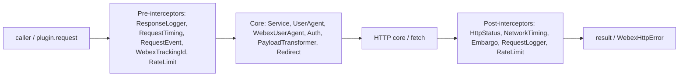
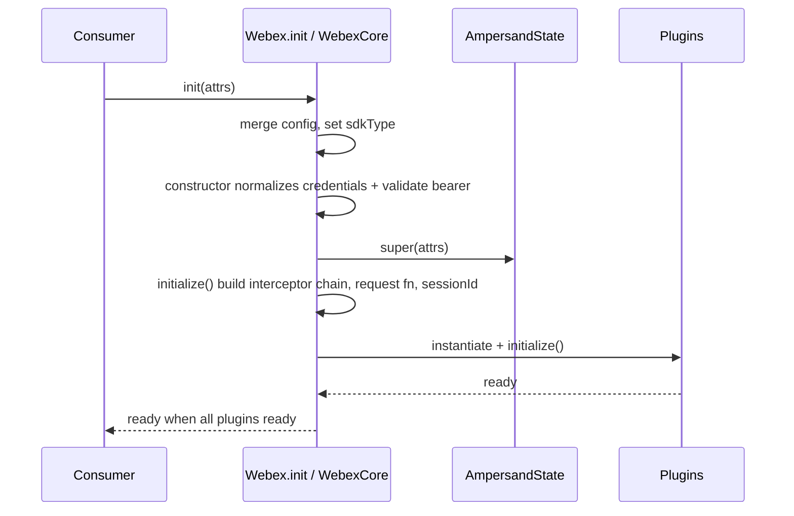
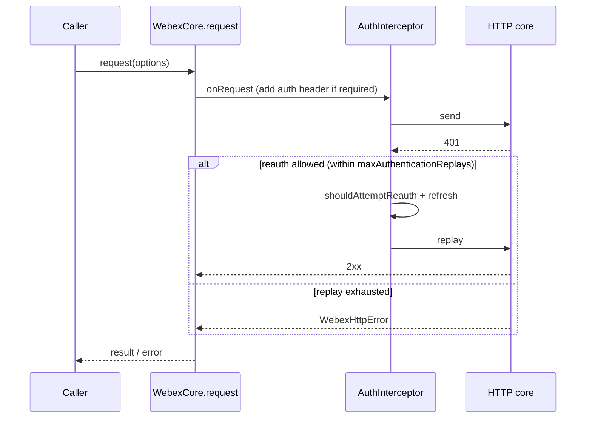
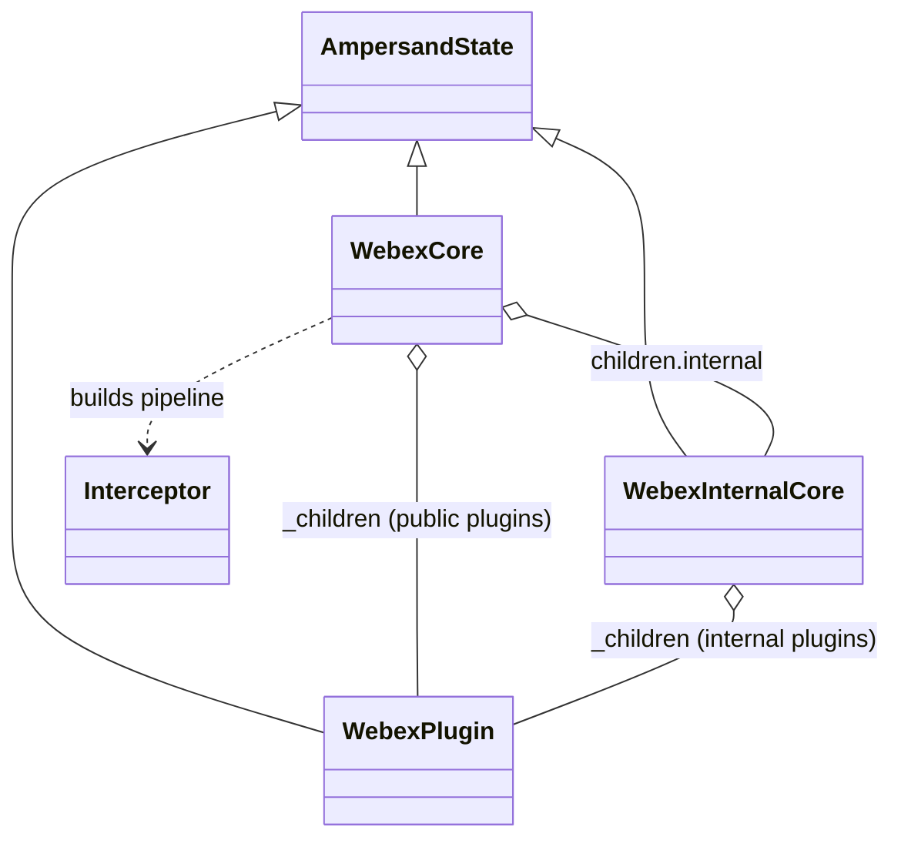

# @webex/webex-core — SPEC

> Start here → root [`AGENTS.md`](../../../../AGENTS.md) (agent entry) · router [`SPEC_INDEX.md`](../../../../ai-docs/SPEC_INDEX.md) · system [`ARCHITECTURE.md`](../../../../ai-docs/ARCHITECTURE.md). This is the module's canonical spec: orientation, requirements, design, flows, state, protocol, UI, data, and tests.
> Context-efficiency: link to canonical docs — don't duplicate them. Load specs on demand per `SPEC_INDEX.md`.

## Metadata
| Field | Value |
|---|---|
| Module id | `@webex/webex-core` |
| Source path(s) | `packages/@webex/webex-core/` |
| Parent spec | — (no parent module) |
| Doc kind | Module spec |
| Coverage score | Pending coverage assessment |
| Generated from | `module-spec` @ SDLC template library `0.2.2` |
| generated_by / approved_by / updated_at | claude-cli / pending / 2026-08-05T00:00:00Z |
| Validation status | not-run |

## Evidence Rules
Every generated requirement cites concrete source evidence using `file path`. Source, test, example,
assumption, and gap evidence are kept separate. This spec was migrated from the routed source doc
`webex-plugin-architecture.md` (recorded in `.sdd/manifest.json` `spec_sources`); source content units
were placed into the canonical sections below by meaning and cross-checked against current code. Where
code confirms a claim, both source and code evidence are cited.

## Source Material Register
| Source material | Scope | Decision | Detail location or disposition |
|---|---|---|---|
| Prior Webex Core technical documentation | overview / architecture | used / verified | Overview, Design Overview, Data Flow, Sequence Diagram(s), Class/Component Relationships, Public Surface, and Use Cases below; verified against `src/webex-core.js`, `src/index.js`, and `src/interceptors/`. |
| Prior interceptor pipeline description | architecture | used / verified | Data Flow + Sequence Diagram(s); interceptor names verified against `src/webex-core.js` (`preInterceptors`/`postInterceptors`) and `src/interceptors/`. |
| Prior storage/config/event descriptions | architecture | used / verified | State Model, Concurrency & Reactive Flow, and Data / Schema notes; verified against `src/lib/storage`, `src/config.js`. |

## Overview
`@webex/webex-core` is the foundational infrastructure package of the Webex JavaScript SDK. It provides
the framework every other Webex SDK package builds on: plugin registration, HTTP request handling
through an interceptor pipeline, credential normalization and token refresh, bounded/unbounded storage,
layered configuration management, and an event-driven architecture. A maintainer working on cross-cutting
SDK behavior (auth, request flow, storage, plugin lifecycle) starts here.

The package follows a layered architecture with clear separation of concerns. The unified `webex` SDK
extends `WebexCore`; feature plugins (public and internal) register onto it and are proxied onto the
root object. Core owns the request pipeline and event model; plugins own their feature behavior and
delegate outbound calls back to `webex.request()`. `WebexCore` and plugins are AmpersandState models, so
state changes emit `change` events that bubble to the parent with a namespace prefix.

Internally the layers are: the public API (`webex`), the plugin layer (public + internal plugins), the
webex-core layer (HTTP pipeline & interceptors, auth/credentials, storage, config), and the foundation
layer (AmpersandState, EventEmitter, HTTP core). Entry to the whole system is `Webex.init(attrs)`, which
composes configuration and plugins before delegating to `WebexCore`.

## Purpose / Responsibility
Owns the SDK's foundational infrastructure: plugin registration/lifecycle, the HTTP request interceptor
pipeline, credential normalization + token refresh, storage management, configuration merging, and the
event framework. It does NOT own feature behavior (meetings, people, messaging) — those live in
`@webex/plugin-*` and `@webex/internal-plugin-*` packages that build on this core.

## Stack
JavaScript (Babel-transpiled) with TypeScript build support; Node >=18. Built on `ampersand-state`,
`ampersand-events`, `ampersand-collection`; depends on `@webex/http-core`, `@webex/common`,
`@webex/common-timers`, `@webex/storage-adapter-spec`, `lodash`, `crypto-js`, `jsonwebtoken`, `uuid`.
Tests: Jest (unit), Mocha (integration), Karma (browser). Build: `webex-legacy-tools`
(`packages/@webex/webex-core/package.json`).

## Folder / Package Structure
```
packages/@webex/webex-core/src/
├── index.js                    # public export barrel (WebexCore, plugins, storage, interceptors, config)
├── webex-core.js               # WebexCore class: constructor, initialize, request pipeline wiring
├── webex-internal-core.js      # WebexInternalCore class for internal plugins
├── config.js                   # default configuration values
├── interceptors/               # HTTP pipeline interceptors (auth, timing, tracking-id, rate-limit, …)
└── lib/                        # webex-plugin base, credentials, services, storage, batcher, page, mixins
```

## Key Files (source of truth)
| File | Holds |
|---|---|
| `packages/@webex/webex-core/src/webex-core.js` | `WebexCore` class; interceptor map + pre/post ordering; credential normalization; request wiring |
| `packages/@webex/webex-core/src/index.js` | the authoritative public export surface (`registerPlugin`, `WebexPlugin`, interceptors, storage, credentials) |
| `packages/@webex/webex-core/src/config.js` | default configuration values (redirect/replay limits, services, storage) |
| `packages/@webex/webex-core/src/lib/webex-plugin.js` | `WebexPlugin` base class |
| `packages/@webex/webex-core/src/interceptors/auth.js` | `AuthInterceptor` (auth header, 401 handling, reauth, replay) |

## Public Surface
| Contract ID | Type | Surface | Purpose | Compatibility / deprecation | Schema / detail link | Root index |
|---|---|---|---|---|---|---|
| `webex-core.WebexCore` | SDK | `default` (class `WebexCore`) | plugin host + request pipeline base | stable; extended by `webex` | `src/index.js` | `../../../../ai-docs/CONTRACTS.md` |
| `webex-core.registerPlugin` | SDK | `registerPlugin(name, ctor, options)` | register a public plugin | stable | `src/index.js` | `../../../../ai-docs/CONTRACTS.md` |
| `webex-core.registerInternalPlugin` | SDK | `registerInternalPlugin(name, ctor, options)` | register an internal plugin | stable | `src/index.js` | `../../../../ai-docs/CONTRACTS.md` |
| `webex-core.WebexPlugin` | SDK | `WebexPlugin` base class | base for feature plugins | stable | `src/lib/webex-plugin.js` | `../../../../ai-docs/CONTRACTS.md` |
| `webex-core.storage` | SDK | `makeWebexStore`, `makeWebexPluginStore`, `MemoryStoreAdapter` | storage factory + adapters | stable | `src/lib/storage` | `../../../../ai-docs/CONTRACTS.md` |
| `webex-core.credentials` | SDK | `Credentials`, `Token`, `filterScope`, `sortScope` | credential/token handling | stable | `src/lib/credentials` | `../../../../ai-docs/CONTRACTS.md` |
| `webex-core.interceptors` | SDK | `AuthInterceptor`, `PayloadTransformerInterceptor`, `RedirectInterceptor`, … | pipeline interceptor classes | stable | `src/interceptors/` | `../../../../ai-docs/CONTRACTS.md` |

Registration options (from `registerPlugin`): `proxies` (methods proxied to root), `interceptors` (added
to the pipeline), `config` (merged), `payloadTransformer.predicates` / `.transforms`, and
`onBeforeLogout` cleanup handlers.

Compatibility notes:
- Additive exports/fields are minor; removing or changing an exported symbol is a major semver change for the package.

## Requires (dependencies)
- Internal: `@webex/http-core` (transport, `HttpStatusInterceptor`, fetch prep), `@webex/common`
  (event proxy/transfer, retry), `@webex/common-timers`, `@webex/storage-adapter-spec`.
- External: `ampersand-state` `^5`, `crypto-js` `^4`, `jsonwebtoken` `^9`, `lodash` `^4`, `uuid` `^3`.
- Runtime: remote Webex services (resolved via service discovery); an OAuth identity provider for
  token issuance/refresh (fail-closed when credentials are missing).

## Requirements
| ID | WHAT | WHY | Source Evidence | Test / Example Evidence | Assumptions / Gaps | Confidence |
|---|---|---|---|---|---|---|
| `WEBEX-CORE-R-001` | `WebexCore` normalizes multiple credential input shapes (string token, `credentials.supertoken`, `access_token`, authorization paths) onto `credentials.supertoken` and validates the bearer token. | Consumers pass tokens in several shapes; a single normalized shape keeps auth handling consistent. | `packages/@webex/webex-core/src/webex-core.js` | None found | Migrated from routed doc; verified against constructor code | PRESENT |
| `WEBEX-CORE-R-002` | `WebexCore.initialize` builds the HTTP interceptor pipeline (pre → core → post) and creates a configured `request` function and a unique `sessionId`. | The pipeline is the single controlled path for all SDK HTTP traffic. | `packages/@webex/webex-core/src/webex-core.js` | None found | interceptor names verified in `preInterceptors`/`postInterceptors` | PRESENT |
| `WEBEX-CORE-R-003` | Plugins register via `registerPlugin`/`registerInternalPlugin`, are added to `_children`, may proxy methods to the root, merge config, and add interceptors. | Plugin composition is how feature packages extend the SDK without modifying core. | `packages/@webex/webex-core/src/index.js`, `src/webex-core.js` | None found | Migrated from routed doc; verified against exports | PRESENT |
| `WEBEX-CORE-R-004` | `AuthInterceptor` attaches auth headers when credentials are required, handles 401 by attempting reauth and replaying the request within the configured replay limit. | Token expiry must not fail an otherwise valid request; bounded replay avoids infinite loops. | `packages/@webex/webex-core/src/interceptors/auth.js`, `src/config.js` (`maxAuthenticationReplays`) | None found | Replay bound from config; behavior migrated + code-checked | PRESENT |
| `WEBEX-CORE-R-005` | Core exposes bounded and unbounded storage via `makeWebexStore`, defaulting to `MemoryStoreAdapter`, with `LocalStorage`/`SessionStorage` adapters available. | Plugins need namespaced, size-appropriate storage without owning adapter selection. | `packages/@webex/webex-core/src/lib/storage` | None found | Adapter list migrated from routed doc | PRESENT |
| `WEBEX-CORE-R-006` | Configuration is merged from defaults (`config.js`), plugin configs (at registration), user attrs (at init), and runtime `setConfig()`. | Layered config lets plugins ship defaults while consumers override. | `packages/@webex/webex-core/src/config.js`, `src/webex-core.js` | None found | Migrated from routed doc; verified `config` export | PRESENT |
| `WEBEX-CORE-R-007` | Child (plugin) `change`/lifecycle events bubble to the parent with a namespace prefix; `ready` aggregates plugin readiness. | Consumers observe SDK readiness and plugin state from the root object. | `packages/@webex/webex-core/src/webex-core.js` | None found | `ready` derived property verified in code | PRESENT |

## Design Overview
Core is structured so that a single object (`WebexCore`) owns the request pipeline, configuration, and
event bus, while feature behavior is delegated to plugins. Construction is deliberately staged:
credential normalization happens in the constructor (before AmpersandState init) so the base state is
built from a canonical credential shape; pipeline wiring, event handlers, and the `request` function are
created in `initialize`. Interceptors are ordered explicitly (pre/core/post) because auth, timing, and
retry semantics depend on order — e.g. tracking-id and rate-limit run before core processing, while HTTP
status, network timing, and logging run after.

Plugins are AmpersandState children registered through mixins (`mixinWebexCorePlugins`,
`mixinWebexInternalCorePlugins`). Registration wires proxies, interceptors, config, and payload
transforms. This keeps core agnostic of feature detail while giving plugins a uniform `request`/`upload`
path and namespaced config/storage/logger.

## Data Flow
Data moves over HTTP(S) through the interceptor pipeline. A caller invokes `webex.request(options)` (or a
plugin calls `this.request()`, which delegates to `webex.request()`); the request passes through
pre-interceptors, core interceptors, the HTTP core call, then post-interceptors, before the result
returns to the caller.

Transport: HTTPS to Webex services (fetch via `@webex/http-core`). Evidence:
`packages/@webex/webex-core/src/webex-core.js` (`preInterceptors`, `postInterceptors`),
`packages/@webex/webex-core/src/interceptors/`.

## Sequence Diagram(s)
Sequence coverage:

| Operation group | Diagram | Failure / recovery coverage |
|---|---|---|
| SDK/plugin construction & init | "Webex object creation" | plugins not ready → `ready` stays false |
| HTTP request through pipeline | "Request pipeline with auth replay" | 401 → reauth → replay (bounded); else error returned |





## Class / Component Relationships

`WebexCore` composes `WebexInternalCore` (as `children.internal`) and public plugins; both cores hold
plugins in `_children`. `WebexPlugin` is the shared base giving plugins `request`, `upload`, `when`,
namespaced `config`/`logger`/storage, and a `parent`/`webex` reference. Interceptors are separate classes
the core instantiates into the pipeline.

## Use Cases
- **UC-1 Initialize the SDK:** consumer calls `Webex.init({credentials})` → config merged → `WebexCore`
  constructed and initialized → plugins instantiated → `ready`. Evidence:
  `packages/@webex/webex-core/src/webex-core.js`.
- **UC-2 Make an authenticated request:** `webex.request(options)` (or `plugin.request()`) → pipeline
  runs → auth header added → on 401, refresh + replay → result. Evidence:
  `packages/@webex/webex-core/src/interceptors/auth.js`.
- **UC-3 Register a plugin:** `registerPlugin(name, ctor, options)` adds the plugin to `_children`, wires
  proxies/interceptors/config. Cross-service flow: the plugin's methods then delegate outbound calls
  back through core's pipeline to remote Webex services. Evidence:
  `packages/@webex/webex-core/src/index.js`.
- **UC-4 Upload a file:** `webex.upload()` runs the three-phase initialize → upload → finalize process,
  aborting when a size limit is exceeded. Evidence: `packages/@webex/webex-core/src/webex-core.js`
  (`_uploadPhase*`).

<!-- Include if: this module holds client-side state [condition-id: module.holds_client_state] -->
## State Model
`WebexCore`, `WebexInternalCore`, and every plugin are AmpersandState models. Derived state includes
`boundedStorage`, `unboundedStorage`, and `ready` (depends on `loaded` and `internal.ready` plus all
plugins' `ready`). Session properties: `config`, `loaded`, `request`, `sessionId`. State changes trigger
`change` events that bubble to the parent with a namespace prefix. Evidence:
`packages/@webex/webex-core/src/webex-core.js`.

<!-- Include if: the module enforces domain rules or entity invariants [condition-id: module.enforces_domain_rules] -->
## Business Rules & Invariants
- Interceptor ordering is fixed as pre → core → post; reordering changes auth/timing/retry semantics —
  enforced by the `preInterceptors`/`postInterceptors` arrays in `webex-core.js`.
- Auth replay is bounded by `maxAuthenticationReplays` (config) so a persistent 401 cannot loop forever.
- App-level and Locus redirects are bounded (`maxAppLevelRedirects: 10`, `maxLocusRedirects: 5`) in
  `packages/@webex/webex-core/src/config.js`.
- A bearer token is validated/corrected (`bearerValidator`) before it is used.

<!-- Include if: the module is concurrent / async / reactive / event-driven [condition-id: module.is_concurrent_async] -->
## Concurrency & Reactive Flow
The request pipeline and event system are asynchronous. Requests return promises; interceptors run in
order but do not block the event loop. Lifecycle events (`loaded`, `ready`, `change:config`,
`client:logout`) and plugin `change` events propagate reactively — the parent recomputes `ready` when a
child's readiness changes. Event listeners should be idempotent because child events may re-fire.
Evidence: `packages/@webex/webex-core/src/webex-core.js`.

<!-- Include if: the module owns persistence (its own tables/store) [condition-id: module.owns_persistence] -->
<!-- DROP rationale: this module manages pluggable client storage adapters but does not own its own tables/database/migrations; persistence sections are intentionally omitted. -->

<!-- Include if: the module returns/raises errors a caller must handle [condition-id: module.returns_caller_errors] -->
## Error Handling & Failure Modes
| Condition | Signal (error/code/result) | Caller recovery |
|---|---|---|
| Non-2xx HTTP response | `WebexHttpError` (via `HttpStatusInterceptor`) | inspect status; retry idempotent calls |
| 401 Unauthorized | handled internally: reauth + replay | transparent within `maxAuthenticationReplays`; surfaces error if replay exhausted |
| Missing/invalid credentials | request fails closed (`requiresCredentials`) | supply valid credentials |
| Upload exceeds size limit | upload session aborted (`_uploadAbortSession`) | reduce file size |

## Pitfalls
- Passing a token on an unsupported path is silently dropped — only the normalized shapes in the
  constructor are honored (`packages/@webex/webex-core/src/webex-core.js`).
- Reordering interceptors breaks auth-replay and timing; treat the pre/post arrays as ordered contracts.
- `RequestLoggerInterceptor`/`ResponseLoggerInterceptor` are only wired when `ENABLE_NETWORK_LOGGING`
  (or verbose) env vars are set; assuming request logs exist by default is wrong.
- `Services` lives inside webex-core (not as a separate plugin) because it must initialize before other
  plugins to satisfy federation; moving it out breaks early requests (`src/index.js` header comment).

<!-- Include if: this module has specific conventions beyond the repo-wide rules [condition-id: module.module_specific_conventions] -->
## Module Do's / Don'ts
- DO register feature behavior as a `WebexPlugin` subclass with a `namespace`; delegate HTTP via `this.request()`.
- DO add cross-cutting HTTP behavior as an interceptor and place it in the correct pre/core/post position.
- DON'T call remote services directly from a plugin, bypassing the pipeline (loses auth/timing/tracking).
- DON'T mutate the interceptor ordering arrays without updating this spec and the tests.

<!-- Include if: this module is published/consumed as a package [condition-id: module.published_package] -->
## Export Stability
`packages/@webex/webex-core/src/index.js` is the semver-sensitive surface. Adding an export is a minor
change; removing or altering the signature of an existing export (`WebexCore`, `registerPlugin`,
`WebexPlugin`, storage/credentials/interceptor exports) is a major change. Consumers rely on these being
stable because every feature package imports them.

<!-- Include if: the module has a non-obvious design trade-off a consumer must know [condition-id: module.has_design_tradeoff] -->
## Key Design Trade-off
`[NEEDS HUMAN INPUT]` — whether `@webex/webex-core` carries a non-obvious design trade-off a consumer
must know (M-7) could not be resolved from code alone and had no human answer in this automated
assess-only run. Candidate to confirm: `Services` is embedded inside webex-core (rather than a separate
plugin) so it initializes before other plugins for federation — this is a deliberate trade-off, but its
consumer-facing consequences need human confirmation before being recorded as authoritative.

## Test-Case Strategy (module)
Unit tests run under Jest (`test:unit`); integration under Mocha and browser under Karma
(`packages/@webex/webex-core/package.json`). Tests should assert the request pipeline runs interceptors
in order (positive) and that a persistent 401 stops after the replay bound (negative); that credential
normalization maps each supported input shape (positive) and ignores unsupported paths (negative); and
that `ready` is false until all plugins are ready.

| Behavior / Requirement | Existing test evidence | Gap |
|---|---|---|
| `WEBEX-CORE-R-001` (credential normalization) | None found | needs positive + negative shape tests |
| `WEBEX-CORE-R-002` (pipeline build) | None found | verify interceptor order |
| `WEBEX-CORE-R-004` (auth replay) | None found | needs bounded-replay negative case |
| `WEBEX-CORE-R-005` (storage) | None found | adapter default + namespacing |

Test evidence was not enumerated in this assess-only pass; the `Gap` column marks where characterization
tests are needed before risky modification.

## Traceability
- Repo architecture: `../../../../ai-docs/ARCHITECTURE.md` · Registry: `../../../../ai-docs/SPEC_INDEX.md`
- Coverage state & contracts baseline: `.sdd/manifest.json`
