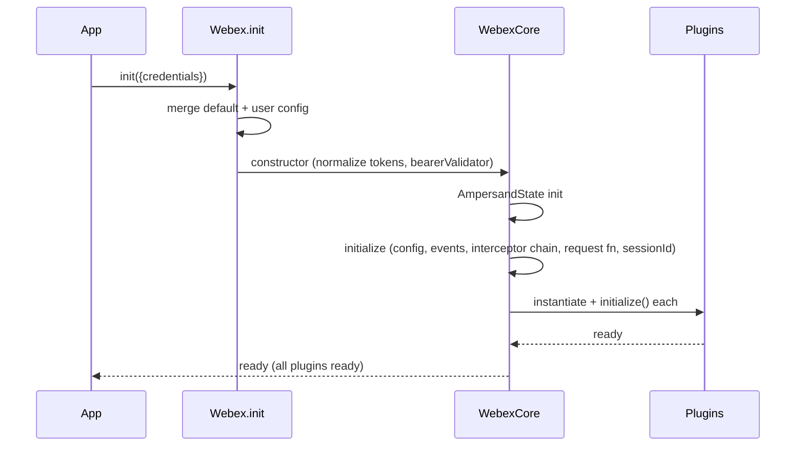
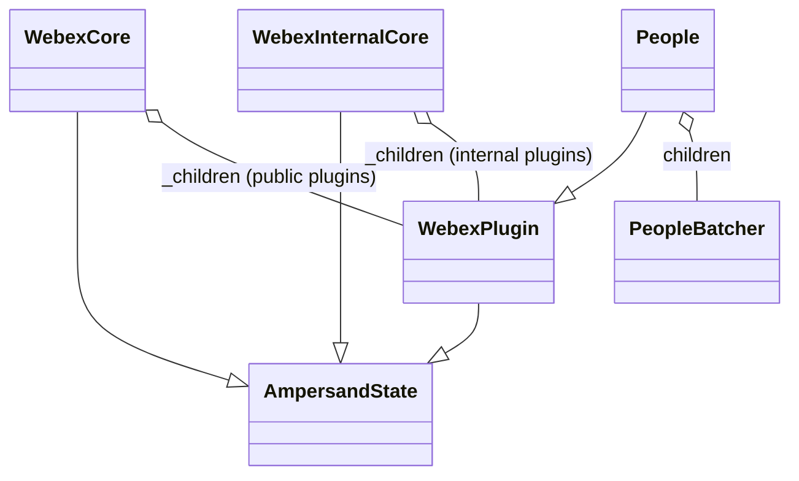

# @webex/webex-core — SPEC

> Start here → root [`AGENTS.md`](../../../../AGENTS.md) (agent entry) · router [`SPEC_INDEX.md`](../../../../ai-docs/SPEC_INDEX.md) · system [`ARCHITECTURE.md`](../../../../ai-docs/ARCHITECTURE.md). This is the module's canonical spec.
> Context-efficiency: link to canonical docs — don't duplicate them. Load specs on demand per `SPEC_INDEX.md`.

## Metadata
| Field | Value |
|---|---|
| Module id | `webex-core` |
| Source path(s) | `packages/@webex/webex-core/` |
| Doc kind | Module spec |
| Coverage score | 56% (9/16) assessed 2026-07-28; critical 5/8; Provides contract inferred from config.js ('verify against disk'), all requirements WEAK, test coverage MISSING — stays Partial |
| Generated from | `module-spec` @ SDLC template library `0.2.1` |
| generated_by / approved_by / updated_at | assess-only bootstrap / [NEEDS HUMAN INPUT] / 2026-07-28 |
| Validation status | not-run |

Manifest coverage state: **Partial** (see `.sdd/manifest.json`). This spec migrates `webex-plugin-architecture.md`
by meaning; code remains the source of truth.

## Evidence Rules
Requirements cite source evidence by `file path`. This spec was migrated from the routed source
`webex-plugin-architecture.md`; exact method/property inventories below reflect that source and must be
verified against the current `packages/@webex/webex-core/src/` tree before being relied upon. Unverified
units are marked WEAK.

## Source Material Register
| Source material | Scope | Decision | Detail location or disposition |
|---|---|---|---|
| `webex-plugin-architecture.md` (routed, `migrate-existing`, retain) | architecture | used / migrated by meaning | Layered architecture → Design Overview; class method/property inventories → Public Surface + Class/Component Relationships; creation & HTTP flows → Sequence Diagram(s) & Data Flow; storage/config/events → dedicated sections. Repo-level summary also informs `ai-docs/ARCHITECTURE.md`. |

## Overview
`@webex/webex-core` is the foundational infrastructure package for the Webex JS SDK. It provides the
framework for plugin registration, HTTP request handling, authentication/credentials, storage
management, configuration merging, and an event-driven architecture that every other Webex SDK package
builds on. It follows a layered architecture with clear separation of concerns and clean plugin
boundaries.

The layered stack (from `webex-plugin-architecture.md`):

```
┌─────────────────────────────────────────┐
│              Webex SDK                    │  Public API — webex/src/webex.js
├─────────────────────────────────────────┤
│            Plugin Layer                   │  Public plugins (meetings, people) + internal (device, mercury)
├─────────────────────────────────────────┤
│           Webex Core Layer                │  HTTP pipeline & interceptors, auth & credentials,
│                                           │  storage management, configuration system
├─────────────────────────────────────────┤
│          Foundation Layer                 │  AmpersandState (state), EventEmitter (events),
│                                           │  HTTP Core (network)
└─────────────────────────────────────────┘
```

## Purpose / Responsibility
Owns the SDK's core runtime: registers plugins, builds and runs the HTTP interceptor pipeline, normalizes
and holds credentials, manages bounded/unbounded storage, merges configuration, and propagates events. It
does NOT implement domain features — those live in plugins that extend `WebexPlugin`.

## Stack
JavaScript/TypeScript; built on **AmpersandState** (state management) and **EventEmitter** (events), with
`@webex/http-core` as the network layer. Consumed by every `@webex/plugin-*` and `internal-plugin-*`
package and by the unified `webex`/`webex-node` bundles.

## Folder / Package Structure
```
packages/@webex/webex-core/src/
├── webex-core.js            # WebexCore class (public core)
├── webex-internal-core.js   # WebexInternalCore class (internal plugin host)
├── lib/webex-plugin.js      # WebexPlugin base class
├── interceptors/            # HTTP interceptors (auth.js, timing, payload transform, …)
├── config.js                # default configuration values
└── ...                      # storage factory, plugin mixins
```
*(Structure inferred from `webex-plugin-architecture.md` file references; verify against disk.)*

## Key Files (source of truth)
| File | Holds |
|---|---|
| `packages/@webex/webex-core/src/config.js` | Default config: `maxAppLevelRedirects: 10`, `maxLocusRedirects: 5`, `maxAuthenticationReplays: 1`, `services.discovery`, `services.validateDomains`, `storage`, `payloadTransformer` |
| `packages/@webex/webex-core/src/interceptors/auth.js` | `AuthInterceptor` — auth header injection, 401 handling, refresh/replay |
| `packages/@webex/webex-core/src/webex-core.js` | `WebexCore` class + credential normalization + `bearerValidator()` |
| `packages/@webex/webex-core/src/lib/webex-plugin.js` | `WebexPlugin` base class |

## Public Surface
Internal Surface + framework base classes consumed by plugins and the SDK bundles.

**`WebexCore` (`webex-core.js`) — primary functions:** `constructor()` (credential normalization),
`initialize()` (config, interceptors, event listeners), `refresh()` (delegates to `credentials.refresh()`),
`transform()` (bidirectional payload transforms), `applyNamedTransform()`, `getWindow()`, `setConfig()`
(dynamic config update), `bearerValidator()` (validate/correct access-token format), `inspect()`,
`logout()` (orchestrates full logout), `measure()` (metrics via metrics plugin), `upload()` (three-phase
file upload) and its phases `_uploadPhaseInitialize()`, `_uploadPhaseUpload()`, `_uploadPhaseFinalize()`,
`_uploadAbortSession()` (abort if size limit exceeded), `_uploadApplySession()`.
- Derived properties: `boundedStorage`, `unboundedStorage`, `ready` (all plugins initialized).
- Session properties: `config`, `loaded`, `request` (HTTP request function), `sessionId`.

**`WebexInternalCore` (`webex-internal-core.js`):** `inspect()`; derived `ready` (aggregates readiness of
all internal plugins).

**`WebexPlugin` base (`lib/webex-plugin.js`) — primary functions:** `initialize()` (datatype binding),
`clear()` (clears plugin state, preserves parent reference), `inspect()`, `request()` (delegates to
`webex.request()`), `upload()` (delegates to `webex.upload()`), `when()` (promise-based event waiting),
`_filterSetParameters()` (normalizes `set()` params).
- Derived properties: `boundedStorage`, `unboundedStorage`, `config`, `logger`, `webex` (root instance).
- Session properties: `parent`, `ready`.

**Plugin registration:** `registerPlugin(name, constructor, options)` where `options` carries: `proxies`
(methods to proxy to root), `interceptors` (HTTP interceptors added to the pipeline), `config`
(merged config), `payloadTransformer.predicates`, `payloadTransformer.transforms`, `onBeforeLogout`
(logout cleanup handlers). Public plugins register on `WebexCore`; internal plugins on `WebexInternalCore`.

Compatibility notes:
- Exported base classes are semver-sensitive; changing a `WebexPlugin` contract or the `registerPlugin`
  options shape is a breaking change for all plugins.

## Requires (dependencies)
- **AmpersandState** — base state layer for `WebexCore`/`WebexPlugin` (peer/pinned).
- **`@webex/http-core`** — actual HTTP execution beneath the interceptor pipeline (workspace, version-synced).
- Webex platform services at runtime (resolved via `services.discovery`, constrained by `validateDomains`).

## Requirements
| ID | WHAT | WHY | Source Evidence | Test / Example Evidence | Assumptions / Gaps | Confidence |
|---|---|---|---|---|---|---|
| `WEBEX-CORE-R-001` | New capability must attach as a plugin extending `WebexPlugin`, registered via `registerPlugin(name, constructor, options)`; public → `WebexCore`, internal → `WebexInternalCore`. | Uniform plugin boundaries, namespaced config/storage, single registration path. | `webex-plugin-architecture.md` (Plugin System) | None found | Verify `registerPlugin` signature/options in source | WEAK |
| `WEBEX-CORE-R-002` | Authorized/service requests flow through the interceptor pipeline in order: pre → core → post. | Centralizes auth, service resolution, payload transform/encryption, timing, retry. | `webex-plugin-architecture.md` (HTTP Request Pipeline) | None found | Verify interceptor list/order in `interceptors/` | WEAK |
| `WEBEX-CORE-R-003` | On 401, `AuthInterceptor` decides re-auth, refreshes token, and replays the request bounded by `maxAuthenticationReplays` (default 1). | Transparent recovery from expired tokens without unbounded retry. | `webex-plugin-architecture.md`; `config.js` | None found | Verify default and replay cap | WEAK |
| `WEBEX-CORE-R-004` | Credentials are normalized across input shapes at construction; `bearerValidator()` validates/corrects bearer-token format. | Accept varied caller token formats safely. | `webex-plugin-architecture.md` (Webex Object Creation) | None found | — | WEAK |
| `WEBEX-CORE-R-005` | `ready` aggregates child-plugin readiness; child `change`/`ready` events bubble to root with namespace prefix (e.g. `change:people`). | Consumers can await whole-SDK readiness and observe plugin state. | `webex-plugin-architecture.md` (Event System) | None found | — | WEAK |
| `WEBEX-CORE-R-006` | Config merge order: defaults (`config.js`) → plugin configs (at registration) → user config (at init) → runtime `setConfig()`. | Deterministic, layered configuration. | `webex-plugin-architecture.md` (Configuration Management) | None found | — | WEAK |
| `WEBEX-CORE-R-007` | File uploads use a three-phase process (initialize → upload → finalize) with abort if the size limit is exceeded. | Chunked/resumable upload with server-side session. | `webex-plugin-architecture.md` (WebexCore `upload()`) | None found | — | WEAK |

## Design Overview
`Webex.init(attrs)` merges default config, sets `sdkType: 'webex'`, extends `WebexCore`, and requires the
public plugins (`@webex/plugin-authorization`, `-meetings`, `-people`, `-rooms`, `-messages`, and others).
The `WebexCore` constructor normalizes credentials (string tokens → credential objects, multiple token
path variations, bearer validation) then initializes AmpersandState. `initialize()` merges config, wires
loaded/ready handlers, sets up child-event bubbling, builds the interceptor chain, creates the configured
request function, and generates a `sessionId`. `mixinWebexCorePlugins()` / `mixinWebexInternalCorePlugins()`
register each plugin (added to `_children`), proxy declared methods, merge plugin config, and add plugin
interceptors.

## Data Flow
```mermaid
flowchart LR
  C[Consumer] -->|Webex.init attrs| I[WebexCore init]
  I --> R[request fn]
  P[plugin.method] -->|this.request| R
  R --> PRE[pre-interceptors] --> CORE[core interceptors] --> HC[@webex/http-core] --> POST[post-interceptors] --> Resp[response]
  POST -->|onResponseError 401| AUTH[AuthInterceptor refresh+replay]
```

**Interceptor order:**
1. **Pre:** `ResponseLoggerInterceptor`, `RequestTimingInterceptor`, `RequestEventInterceptor`, `WebexTrackingIdInterceptor`, `RateLimitInterceptor`.
2. **Core:** `ServiceInterceptor`, `UserAgentInterceptor`, `WebexUserAgentInterceptor`, `AuthInterceptor`, `PayloadTransformerInterceptor`, `RedirectInterceptor`.
3. **Post:** `HttpStatusInterceptor`, `NetworkTimingInterceptor`, `EmbargoInterceptor`, `RequestLoggerInterceptor`, `RateLimitInterceptor`.

Key interceptors: `AuthInterceptor` (`onRequest()` adds auth header, `requiresCredentials()`,
`onResponseError()` handles 401, `shouldAttemptReauth()`, `replay()`); `RequestTimingInterceptor` (request
duration + timing metadata); `PayloadTransformerInterceptor` (bidirectional transforms incl.
encryption/decryption).

## Sequence Diagram(s)
Sequence coverage:

| Operation group | Diagram | Failure / recovery coverage |
|---|---|---|
| Webex object creation | Init sequence | ready gated on all plugins |
| HTTP request | Request pipeline | 401 → refresh → replay (bounded) |
| Plugin method invocation | Plugin call | delegates to core request |
| Storage operation | Storage access | namespaced key resolution |



**HTTP request flow:** `webex.request(options)` → pre-interceptors (logging/timing/tracking) → Auth header
if needed → Service URL resolution → payload transform → http-core execution → response processing
(status/timing/logging) → 401 handling/token refresh/retry → response transform → result returned.

**Plugin method flow:** `webex.people.get('personId')` → core resolves `people` child → `People.get()` →
`this.request()` → `webex.request()` → full pipeline → plugin processes response → result returned.

**Storage operation flow:** `webex.boundedStorage.get('key')` → adapter resolution → key namespacing →
adapter method → result processing → return.

## Class / Component Relationships

Example plugin (People `extends WebexPlugin`): `namespace: 'People'`; `children: { batcher: PeopleBatcher }`;
methods `get(person)`, `list(options)`, `inferPersonIdFromUuid(id)`, `_getMe()` (`@oneFlight` decorated).

## Use Cases
- **UC-1 Create SDK:** `Webex.init({credentials})` → config merge → construct/normalize → init → plugins load/init → `ready`. Evidence: `webex-plugin-architecture.md` (Detailed Code Flow Analysis).
- **UC-2 Authorized request:** plugin calls `this.request()` → pipeline → response; 401 triggers refresh + replay. Evidence: same.
- **UC-3 Storage access:** bounded/unbounded storage via `makeWebexStore(type, webex)` / `makeWebexPluginStore(type, plugin)`; adapters `MemoryStoreAdapter` (default), `LocalStorageAdapter`, `SessionStorageAdapter`; methods `get/set/del/clear`.

## Storage System
- Factories: `makeWebexStore(type, webex)`, `makeWebexPluginStore(type, plugin)`.
- Types: **Bounded** (size-limited, frequently-accessed data) and **Unbounded** (no size limit, archival).
- Default adapters: `MemoryStoreAdapter` (default), `LocalStorageAdapter`, `SessionStorageAdapter`.
- Methods: `get(key)`, `set(key, value)`, `del(key)`, `clear()`.

## Configuration Management
Source: `config.js`. Key sections/defaults: `maxAppLevelRedirects: 10`, `maxLocusRedirects: 5`,
`maxAuthenticationReplays: 1`, `services.discovery` (service discovery URLs), `services.validateDomains`
(domain validation), `storage` (adapter config), `payloadTransformer` (transform config), plus security
settings. Merge order per `WEBEX-CORE-R-006`.

## Event System
Base `WebexCore` events: `loaded` (data loaded from storage), `ready` (all plugins initialized),
`change:config`, `client:logout`. Event methods: `trigger(event, ...args)`, `listenTo(...)`,
`listenToAndRun(...)`, `stopListening(...)`, `when(event)`. Child events bubble to parent with namespace
prefix (e.g. `change:people`); ready-state changes trigger parent `ready` recalculation.

## Pitfalls
- Do not bypass `registerPlugin`/the interceptor pipeline to hand-build authorized requests — auth,
  service resolution, encryption, and retry all live in the pipeline.
- `maxAuthenticationReplays` defaults to 1; unbounded manual retry on 401 will diverge from core behavior.
- Redirect handling is bounded (`maxAppLevelRedirects`, `maxLocusRedirects`); don't assume unlimited redirects.
- The method/property inventories here are migrated from a source doc — verify against `src/` before relying.

## Test-Case Strategy (module)
Assess-only: no per-requirement test mapping generated yet. Rigorous mode should pin creation flow, the
interceptor order, 401 refresh/replay bound, config-merge precedence, and storage namespacing with
positive and negative cases.

| Behavior / Requirement | Existing test evidence | Gap |
|---|---|---|
| `WEBEX-CORE-R-001..007` | None found | Full characterization needed |

## Traceability
- Repo architecture: `../../../../ai-docs/ARCHITECTURE.md` · Registry: `../../../../ai-docs/SPEC_INDEX.md`
- Coverage state & contracts baseline: `.sdd/manifest.json`
- Routed source: `webex-plugin-architecture.md` (`migrate-existing`, retain)
