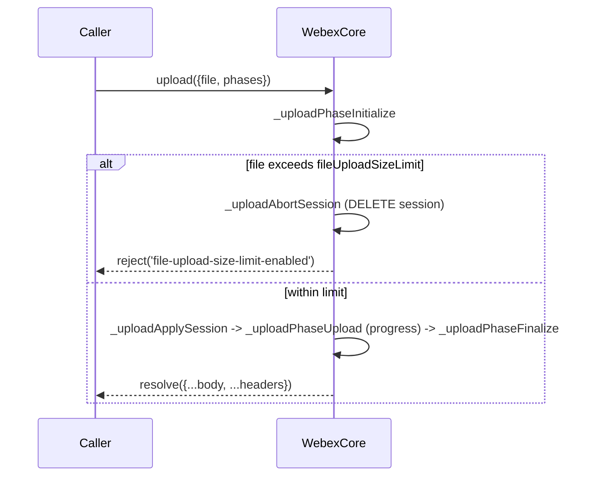
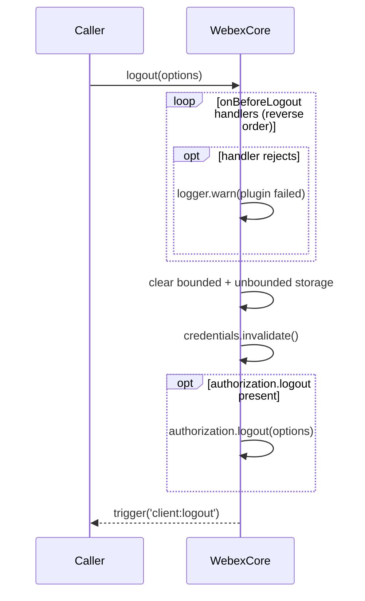
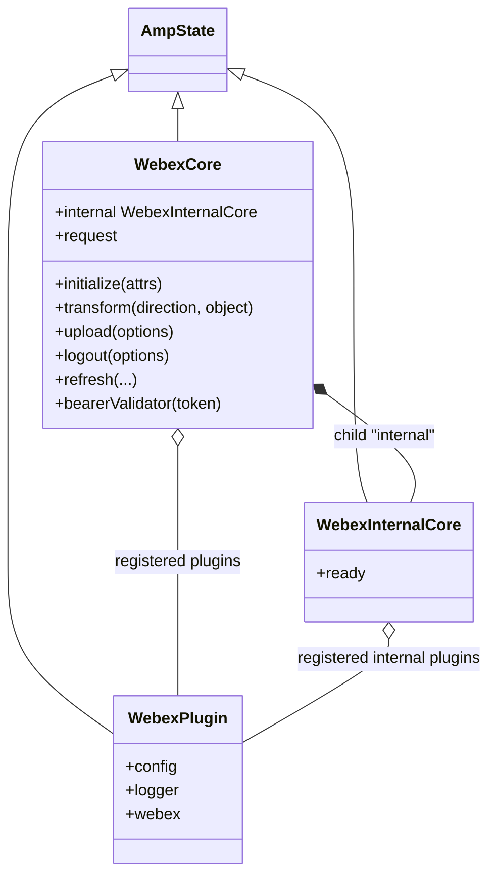

<!-- sdd-generated-metadata
generator: claude-cli
generator_model: us.anthropic.claude-opus-4-8
approved_by: pending-human-review
updated_at: 2026-08-06T00:00:00Z
validation_status: not-run
run_id: 51855eac-8de5-43a2-a3b6-dbcc55ebc91b
-->

# @webex/webex-core — SPEC

> Start here → root [`AGENTS.md`](../../../../AGENTS.md) (agent entry) · router [`SPEC_INDEX.md`](../../../../ai-docs/SPEC_INDEX.md) · system [`ARCHITECTURE.md`](../../../../ai-docs/ARCHITECTURE.md). This is the module's canonical spec: orientation, requirements, design, flows, state, protocol, and tests.
> Context-efficiency: link to canonical docs — don't duplicate them. Load specs on demand per `SPEC_INDEX.md`.

## Metadata

| Field | Value |
|---|---|
| Module id | `webex-core` |
| Source path(s) | `packages/@webex/webex-core/src/` |
| Parent spec | `—` (foundational SDK core; composed by every plugin, no parent module) |
| Doc kind | Module spec |
| Coverage score | Pending coverage assessment |
| Generated from | `module-spec` @ SDLC template library `0.2.2` |
| generated_by / approved_by / updated_at | claude-cli / pending-human-review / 2026-08-06 |
| Validation status | not-run, validator `pending`, assessed 2026-08-06 |

Coverage score is `Pending coverage assessment` until the first coverage review runs. Manifest coverage
state (`Partial`) is authoritative and kept in `.sdd/manifest.json`.

## Evidence Rules
Every requirement cites concrete source evidence using `file path`. Test evidence is preferred for WHY.
Requirements are grounded in the current implementation under `src/` and its unit tests.

## Source Material Register

| Source material | Scope | Decision | Detail location or disposition |
|---|---|---|---|
| Package `package.json` | overview / build | verified | Stack, build order, and dependency facts placed in Stack and Requires. |
| `src/index.js` exports barrel | API | verified | Public export surface placed in Public Surface and Key Files. |
| `src/webex-core.js` / `src/webex-internal-core.js` | architecture / behavior | verified | Plugin framework, request stack, lifecycle placed in Design Overview, Data Flow, State, Sequence Diagrams. |

## Overview

`@webex/webex-core` is the foundation of the Webex JS SDK. It provides the plugin framework
(`WebexCore` and the private `WebexInternalCore`), the base `WebexPlugin`/`StatelessWebexPlugin`
classes every plugin extends, the HTTP request stack (an ordered set of interceptors wrapping
`@webex/http-core`), the credentials/token layer, and the services registry (U2C catalog / service URL
resolution). It is built first in the workspace because every other plugin composes onto it.

`WebexCore` is an `ampersand-state` model with a nested `internal` child (`WebexInternalCore`) for
private plugins. On construction it normalizes various credential-input shapes into
`credentials.supertoken`; on `initialize` it merges config, wires `loaded`/`ready` lifecycle events,
assembles the interceptor chain, and builds `this.request`. Registered plugins are mixed in via
`registerPlugin`/`registerInternalPlugin`. A maintainer should start at `src/index.js`,
`src/webex-core.js`, and `src/lib/` (credentials, services, storage, webex-plugin).

## Purpose / Responsibility

Owns the SDK plugin framework, request/interceptor pipeline, credentials/token lifecycle, service
catalog resolution, storage abstraction, and the base plugin classes. It does NOT own any specific
product plugin behavior (messaging, meetings, etc.) — those live in their own packages and register onto
this core.

## Stack

JavaScript (ES modules under `src/`, built to `dist/` via `webex-legacy-tools build`, `-js -ts -maps`),
Node `>=18`. Built on `ampersand-state`/`ampersand-collection`/`ampersand-events`, `@webex/http-core`,
`@webex/common`, `@webex/common-timers`, `@webex/storage-adapter-spec`, `lodash`, `jsonwebtoken`,
`crypto-js`, `core-decorators`, `uuid`. Unit tests run under Jest; integration under mocha
(`@webex/test-helper-*`, `sinon`, `chai`).

## Folder / Package Structure

```
packages/@webex/webex-core/src/
├── index.js                 # public export barrel (framework, plugins, interceptors, services, storage)
├── webex-core.js            # WebexCore ampersand-state: constructor, initialize, request stack, transform, upload, logout
├── webex-internal-core.js   # WebexInternalCore: private-plugin nesting layer
├── config.js                # default config
├── interceptors/            # auth, redirect, payload-transformer, timing, user-agent, embargo, rate-limit, ...
├── lib/                     # credentials/, services/, services-v2/, storage/, webex-plugin, batcher, page, interceptors/
└── plugins/                 # logger plugin bootstrap
```

## Key Files (source of truth)

| File | Holds |
|---|---|
| `packages/@webex/webex-core/src/index.js` | The public export surface (what other packages import) |
| `packages/@webex/webex-core/src/webex-core.js` | `WebexCore`, the interceptor ordering (`preInterceptors`/`postInterceptors`), `registerPlugin`/`registerInternalPlugin`, `initialize`, `logout`, `upload`, `MAX_FILE_SIZE_IN_MB` |
| `packages/@webex/webex-core/src/webex-internal-core.js` | `WebexInternalCore` private-plugin container and its `ready` derivation |
| `packages/@webex/webex-core/src/lib/webex-plugin.js` | `WebexPlugin` base class (config/logger/webex derived props, storage) |
| `packages/@webex/webex-core/src/config.js` | Default configuration (payloadTransformer predicates/transforms, onBeforeLogout, etc.) |

## Public Surface

Consumed as an imported SDK core by every plugin package and by the aggregate SDK bundles.

| Contract ID | Type | Surface | Purpose | Compatibility / deprecation | Schema / detail link | Root index |
|---|---|---|---|---|---|---|
| `webex-core.default` | SDK | `default` (WebexCore class) | The core SDK class plugins compose onto | Stable; semver-controlled | `packages/@webex/webex-core/src/webex-core.js` | `../../../../ai-docs/CONTRACTS.md` |
| `webex-core.registerPlugin` | SDK | `registerPlugin(name, ctor, options)` | Register a public plugin | Stable | `packages/@webex/webex-core/src/webex-core.js` | `../../../../ai-docs/CONTRACTS.md` |
| `webex-core.registerInternalPlugin` | SDK | `registerInternalPlugin(name, ctor, options)` | Register a private/internal plugin | Stable | `packages/@webex/webex-core/src/webex-core.js` | `../../../../ai-docs/CONTRACTS.md` |
| `webex-core.WebexPlugin` | SDK | `WebexPlugin`, `StatelessWebexPlugin` | Base classes every plugin extends | Stable | `packages/@webex/webex-core/src/lib/webex-plugin.js` | `../../../../ai-docs/CONTRACTS.md` |
| `webex-core.Credentials` | SDK | `Credentials`, `Token`, `filterScope`, `grantErrors`, `sortScope` | Token/credentials primitives | Stable | `packages/@webex/webex-core/src/lib/credentials` | `../../../../ai-docs/CONTRACTS.md` |
| `webex-core.Services` | SDK | `Services`, `ServiceCatalog`, `ServiceRegistry`, `ServiceState`, `ServiceHost`, `ServiceUrl`, V2 variants, `serviceConstants` | Service catalog / URL resolution | Stable | `packages/@webex/webex-core/src/lib/services` | `../../../../ai-docs/CONTRACTS.md` |
| `webex-core.storage` | SDK | `makeWebexStore`, `makeWebexPluginStore`, `MemoryStoreAdapter`, `persist`, `waitForValue`, `NotFoundError`, `StorageError` | Storage abstraction over adapters | Stable | `packages/@webex/webex-core/src/lib/storage` | `../../../../ai-docs/CONTRACTS.md` |
| `webex-core.interceptors` | SDK | `AuthInterceptor`, `RedirectInterceptor`, `PayloadTransformerInterceptor`, `EmbargoInterceptor`, `RateLimitInterceptor`, `HostMapInterceptor`, `ServiceInterceptor`, timing/logging/user-agent interceptors, ... | Composable request interceptors | Stable | `packages/@webex/webex-core/src/interceptors/` | `../../../../ai-docs/CONTRACTS.md` |
| `webex-core.WebexHttpError` | SDK | `WebexHttpError` | Typed HTTP error | Stable | `packages/@webex/webex-core/src/lib/webex-http-error` | `../../../../ai-docs/CONTRACTS.md` |
| `webex-core.Batcher`/`Page`/`config` | SDK | `Batcher`, `Page`, `config` | Request batching, pagination, default config | Stable | `packages/@webex/webex-core/src/lib/batcher`, `.../lib/page`, `.../config` | `../../../../ai-docs/CONTRACTS.md` |

Compatibility notes:
- The export barrel in `src/index.js` is the semver-controlled surface; removing/renaming an export is a
  breaking change. Interceptor names and ordering affect every plugin's request behavior.

## Requires (dependencies)

- `@webex/http-core` — `request`/`prepareFetchOptions`/`setTimingsAndFetch`, `HttpStatusInterceptor`,
  request defaults.
- `@webex/common`, `@webex/common-timers` — `proxyEvents`/`transferEvents`/`retry` and safe timers.
- `@webex/storage-adapter-spec` — the storage adapter contract implemented by adapter packages.
- `ampersand-state`/`-collection`/`-events` — the reactive model layer.
- `lodash`, `uuid`, `jsonwebtoken`, `crypto-js`, `core-decorators` — utilities, ids, JWT, crypto, decorators.

## Requirements

| ID | WHAT | WHY | Source Evidence | Test / Example Evidence | Assumptions / Gaps | Confidence |
|---|---|---|---|---|---|---|
| `WEBEX-CORE-R-001` | The `WebexCore` constructor normalizes multiple credential input shapes (string token, `credentials.authorization`, `supertoken`, `access_token`) into `credentials.supertoken`, validating a string `access_token` via `bearerValidator`. | Accept the many ways callers pass tokens and converge on one internal shape. | `packages/@webex/webex-core/src/webex-core.js` | `packages/@webex/webex-core/test/` credentials suites | none identified | PRESENT |
| `WEBEX-CORE-R-002` | `initialize` merges default `config` with `attrs.config`, fires `change:config`, wires `loaded` and `ready` lifecycle events, and sets a `sessionId` from `trackingIdPrefix`/`trackingIdBase`(uuid)/`trackingIdSuffix`. | Plugins depend on config-on-init and the loaded/ready lifecycle and a per-session tracking id. | `packages/@webex/webex-core/src/webex-core.js` | `packages/@webex/webex-core/test/` | none identified | PRESENT |
| `WEBEX-CORE-R-003` | The request stack is assembled from `preInterceptors`, the middle interceptor set, and `postInterceptors` (or the config-provided interceptor map), and exposed as `this.request`/`this.prepareFetchOptions`. | Every SDK HTTP call flows through a deterministic, ordered interceptor chain (tracking id, auth, timing, http-status, embargo, rate-limit, ...). | `packages/@webex/webex-core/src/webex-core.js` | `packages/@webex/webex-core/test/` interceptor suites | Request/response logging interceptors enabled only when `ENABLE_*NETWORK_LOGGING` env is set | PRESENT |
| `WEBEX-CORE-R-004` | `registerPlugin(name, ctor, options)` and `registerInternalPlugin(...)` mix plugins into `WebexCore`/`WebexInternalCore`; `internal` nests private plugins whose `ready` gates overall readiness. | The plugin framework composes product plugins onto the core with a public/private boundary. | `packages/@webex/webex-core/src/webex-core.js`, `packages/@webex/webex-core/src/webex-internal-core.js` | `packages/@webex/webex-core/test/` | none identified | PRESENT |
| `WEBEX-CORE-R-005` | `transform(direction, object)` runs config `payloadTransformer` predicates/transforms directionally (e.g. encrypt/decrypt hooks) and resolves with the object. | Plugins register in/out payload transforms (encryption, normalization) applied uniformly. | `packages/@webex/webex-core/src/webex-core.js`, `packages/@webex/webex-core/src/config.js` | `packages/@webex/webex-core/test/` | none identified | PRESENT |
| `WEBEX-CORE-R-006` | `upload(options)` runs a three-phase (initialize→upload→finalize) session, enforces a `fileUploadSizeLimit` (default `MAX_FILE_SIZE_IN_MB` = 2048MB) aborting oversize files, and proxies `progress` events. | Uniform large-file upload with size guarding and progress reporting. | `packages/@webex/webex-core/src/webex-core.js` | `packages/@webex/webex-core/test/` | none identified | PRESENT |
| `WEBEX-CORE-R-007` | `logout(options)` invokes registered `onBeforeLogout` handlers in reverse registration order, clears bounded+unbounded storage, invalidates credentials, calls `authorization.logout` when present, and triggers `client:logout`. | Ordered, complete teardown so device/mercury unregister before credential invalidation. | `packages/@webex/webex-core/src/webex-core.js`, `packages/@webex/webex-core/src/config.js` | `packages/@webex/webex-core/test/` | none identified | PRESENT |
| `WEBEX-CORE-R-008` | `bearerValidator(token)` normalizes malformed access tokens (missing space after `Bearer`, extra spaces) and warns via console, returning a cleaned token string. | Tolerate common token-formatting mistakes without failing auth. | `packages/@webex/webex-core/src/webex-core.js` | `packages/@webex/webex-core/test/` | none identified | PRESENT |

## Design Overview

`WebexCore` extends `ampersand-state` with a single declared child, `internal` (`WebexInternalCore`),
keeping private plugins clearly separated. The constructor's sole job is credential-shape normalization
into `credentials.supertoken`. `initialize` then merges config, sets up the `loaded`/`ready` derived
lifecycle (readiness requires `loaded` plus every child's `ready !== false`), propagates child `change`
events upward, and builds the request pipeline. The pipeline is an ordered array: `preInterceptors`
(tracking id, timing, request-event, rate-limit), then the remaining registered interceptors (auth,
user-agent, proxy, payload-transformer, redirect, host-map, ...), then `postInterceptors` (http-status,
network-timing, embargo, logging, rate-limit). This ordering is the contract that gives auth, embargo,
and error mapping consistent placement for every plugin call.

Plugins are registered globally onto the class via `mixinWebexCorePlugins`/
`mixinWebexInternalCorePlugins` and the `registerPlugin`/`registerInternalPlugin` exports. The base
`WebexPlugin` derives `config` (namespaced slice), `logger`, and `webex` from its parent, so a plugin
reads core config/logging without wiring. `transform` applies directional payload transforms (the hook
encryption uses), `upload` implements the phased upload protocol with a size guard, and `logout`
performs ordered teardown.

## Data Flow

```mermaid
flowchart TB
  Caller[plugin / app] -->|webex.request options| WC[WebexCore.request]
  WC --> Pre[preInterceptors: trackingId, timing, requestEvent, rateLimit]
  Pre --> Mid[auth, userAgent, proxy, payloadTransformer, redirect, hostMap]
  Mid --> HTTP[@webex/http-core fetch]
  HTTP --> Post[httpStatus, networkTiming, embargo, logging, rateLimit]
  Post -->|response or WebexHttpError| Caller
  WC -.transform in/out.-> PT[payloadTransformer predicates/transforms]
  WC -.services.-> SVC[Services catalog / URL resolution]
  WC -.credentials.-> CRED[Credentials / Token]
  WC -.storage.-> ST[bounded/unbounded stores]
```

## Sequence Diagram(s)

Sequence coverage: distinct operation groups with different actors/state, so init/request, upload, and
logout get dedicated diagrams.

| Operation group | Diagram | Failure / recovery coverage |
|---|---|---|
| Init + authorized request | 1. init & request | `alt` covers ready gating and `WebexHttpError` from http-status interceptor |
| Phased upload | 2. upload | `alt` covers oversize-file abort/delete → reject |
| Logout teardown | 3. logout | `opt` covers per-handler failure logged as warning |

### 1. Init & request

```mermaid
sequenceDiagram
    participant A as App/Plugin
    participant C as WebexCore
    participant P as Interceptor chain
    participant H as http-core
    A->>C: new WebexCore({credentials})
    C->>C: normalize supertoken; initialize (config, lifecycle, build request)
    C-->>A: ready (loaded && children ready)
    A->>C: request(options)
    C->>P: pre -> mid -> post interceptors
    P->>H: fetch
    alt success
        H-->>P: response
        P-->>A: response
    else http error
        H-->>P: error
        P->>P: HttpStatusInterceptor -> WebexHttpError
        P-->>A: reject(WebexHttpError)
    end
```

### 2. Upload



### 3. Logout



## Class / Component Relationships



`WebexCore`, `WebexInternalCore`, and `WebexPlugin` are all ampersand-state models; plugins are mixed in
as children and gate readiness.

## Use Cases

- **UC-1 Initialize the SDK with a token:** `new WebexCore(token)` normalizes credentials, initializes,
  and fires `ready`. Evidence: `packages/@webex/webex-core/src/webex-core.js`.
- **UC-2 Make an authenticated request:** a plugin calls `this.webex.request(options)`; the interceptor
  chain attaches auth and maps errors. Evidence: `packages/@webex/webex-core/src/webex-core.js`.
- **UC-3 Register a plugin:** a package calls `registerPlugin('rooms', Rooms)` to compose onto the core.
  Evidence: `packages/@webex/webex-core/src/webex-core.js`.
- **UC-4 Log out cleanly:** `webex.logout()` runs ordered teardown and clears storage/credentials.
  Evidence: `packages/@webex/webex-core/src/webex-core.js`.

## State Model

`WebexCore` is an ampersand-state model. Key session/derived state: `config` (object), `loaded`
(boolean, flips true after the storage layer loads), `request` (set-once function), `sessionId`
(string), plus derived `boundedStorage`/`unboundedStorage` and `ready`. `ready` is derived from `loaded`
and every child (`internal` and registered plugins) reporting `ready !== false`. The `internal` child is
its own state whose `ready` aggregates its private plugins. Evidence:
`packages/@webex/webex-core/src/webex-core.js`, `packages/@webex/webex-core/src/webex-internal-core.js`.

## Business Rules & Invariants

- All credential input shapes collapse to `credentials.supertoken` before state init — enforced in the
  `WebexCore` constructor.
- `ready` is true only when `loaded` is true AND no child reports `ready === false` — enforced in the
  `ready` derived property.
- `onBeforeLogout` handlers run in reverse registration order during `logout` — enforced in `logout`.
- Uploads exceeding `fileUploadSizeLimit` (default 2048MB) are aborted and the partial session deleted —
  enforced in `_uploadPhaseInitialize`/`_uploadAbortSession`.
Evidence: `packages/@webex/webex-core/src/webex-core.js`.

## Concurrency & Reactive Flow

The core is event-driven via ampersand events. Lifecycle handlers (`onLoaded`/`onReady`) are wired on
`process.nextTick` so listeners can attach before events fire, and are one-shot (they `stopListening`
after firing). Child `change` events are proxied to parent `change:<child>` events. `transform` and
`upload` run asynchronous promise chains; `upload` proxies `progress` events through an EventEmitter
shunt and `_uploadPhaseUpload` is wrapped with `@retry`. Requests are independent promises through the
shared interceptor array. Evidence: `packages/@webex/webex-core/src/webex-core.js`.

## Protocol / Wire Format

- HTTP requests are shaped and executed by `@webex/http-core`; `webex-core` wraps them with an ordered
  interceptor chain and maps failures to `WebexHttpError` via `HttpStatusInterceptor`.
- Service/host resolution (which base URL a request targets) is provided by the `Services`/`ServiceUrl`
  registry and the `ServiceInterceptor`/`HostMapInterceptor`.
- Uploads use a three-phase protocol (initialize → PUT upload → finalize) with an `x-trans-id` header and
  a content-length upload protocol.
Evidence: `packages/@webex/webex-core/src/webex-core.js`, `packages/@webex/webex-core/src/index.js`.

## Error Handling & Failure Modes

| Condition | Signal (error/code/result) | Caller recovery |
|---|---|---|
| HTTP non-2xx | `WebexHttpError` (from `HttpStatusInterceptor`) | Inspect status/body; retry or re-auth |
| Upload exceeds size limit | Rejected promise with `file-upload-size-limit-enabled` details | Reduce file size |
| `upload` called without `options.file` | `Promise.reject(Error('`options.file` is required'))` | Provide the file |
| Embargoed request | Handled by `EmbargoInterceptor` | Expected for embargoed resources |
| `onBeforeLogout` handler failure | Logged via `logger.warn`; logout continues | Non-fatal; teardown proceeds |

## Export Stability

The `src/index.js` barrel is the semver surface: the `WebexCore` default, `registerPlugin`/
`registerInternalPlugin`, base plugin classes, credentials/services/storage primitives, and the
interceptor set. Adding a new export is a minor change; removing or renaming any is a major (breaking)
change because every plugin package depends on these imports. Evidence:
`packages/@webex/webex-core/src/index.js`.

## Pitfalls

- Interceptor ordering matters: `preInterceptors`/`postInterceptors` bracket the middle set; reordering
  changes when auth/embargo/error-mapping run for every plugin.
- Lifecycle listeners must be attached before `ready`/`loaded` fire — the core defers wiring to
  `process.nextTick`; code that assumes synchronous readiness will miss the events.
- Credential normalization happens in the constructor, not `initialize`; passing tokens the wrong way can
  silently land in the wrong path.
- `request` is `setOnce` — it is built during `initialize` and must not be reassigned afterward.

## Test-Case Strategy (module)

Unit tests (Jest) cover credential normalization, the interceptor chain assembly, lifecycle
(`loaded`/`ready`), `transform`, `upload` (including the size-limit abort), `logout` ordering, and
`bearerValidator`. Integration tests (mocha) exercise real requests/credentials with
`@webex/test-helper-*`. A positive case asserts a request succeeds through the chain; a negative case
asserts an HTTP error surfaces as `WebexHttpError` and an oversize upload is aborted.

| Behavior / Requirement | Existing test evidence | Gap |
|---|---|---|
| `WEBEX-CORE-R-001` | `packages/@webex/webex-core/test/` | Cover all credential-shape branches |
| `WEBEX-CORE-R-003` | `packages/@webex/webex-core/test/` | Assert full interceptor ordering |
| `WEBEX-CORE-R-005` | `packages/@webex/webex-core/test/` | Cover directional transform selection |
| `WEBEX-CORE-R-006` | `packages/@webex/webex-core/test/` | Assert size-limit abort + progress proxy |
| `WEBEX-CORE-R-007` | `packages/@webex/webex-core/test/` | Assert reverse-order handlers + storage clear |
| `WEBEX-CORE-R-008` | `packages/@webex/webex-core/test/` | Cover both malformed-token branches |

## Traceability

- Repo architecture: [`ARCHITECTURE.md`](../../../../ai-docs/ARCHITECTURE.md) · Registry: [`SPEC_INDEX.md`](../../../../ai-docs/SPEC_INDEX.md)
- Coverage state & contracts baseline: `.sdd/manifest.json`
