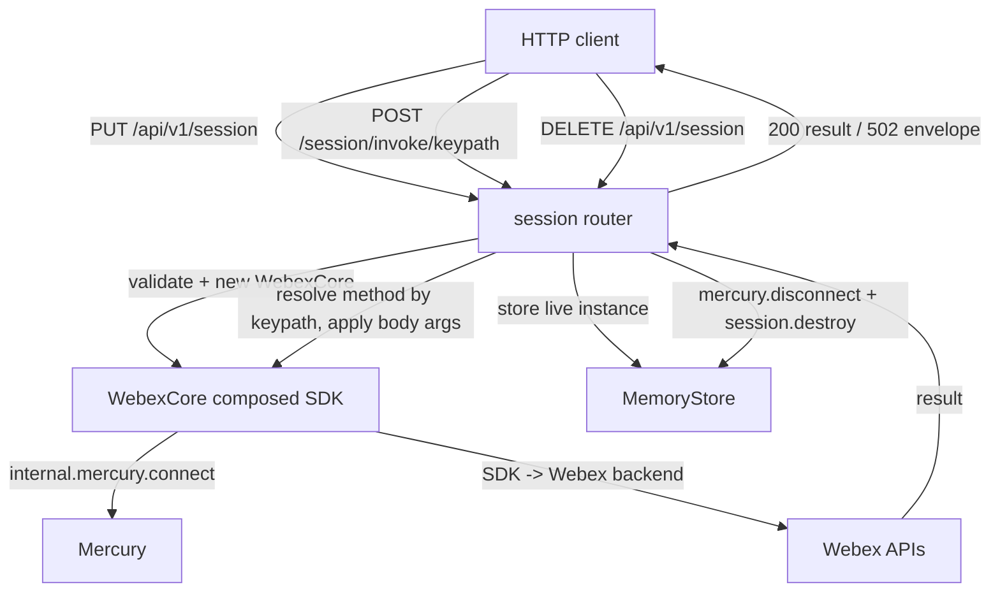
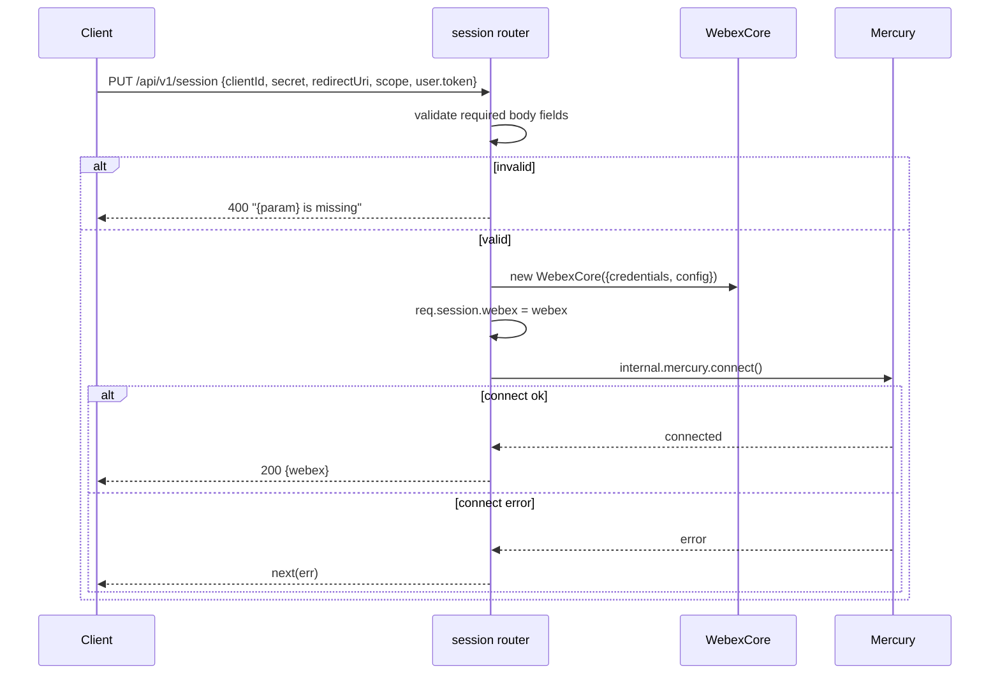
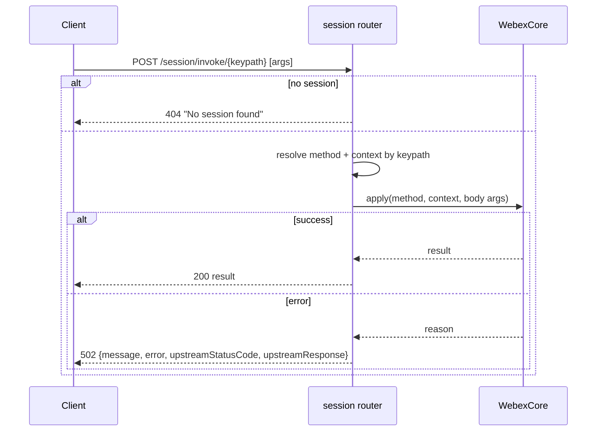
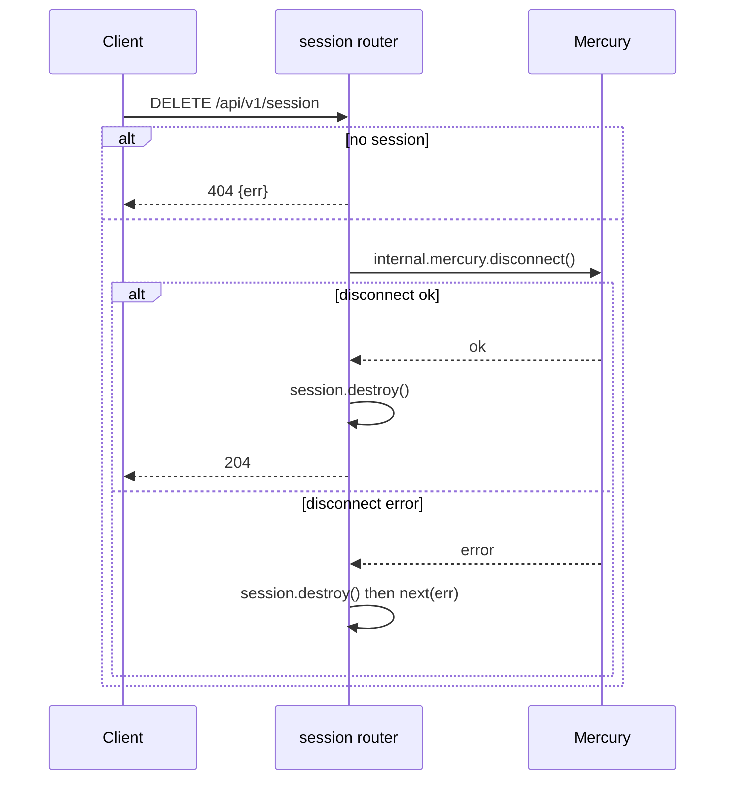
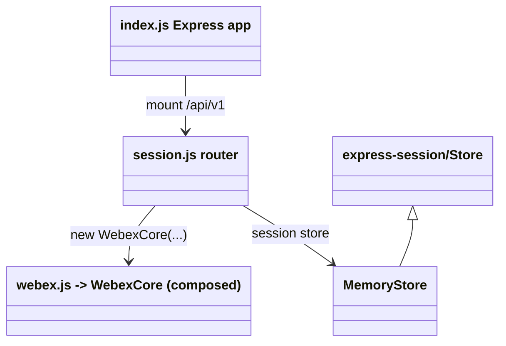

<!-- sdd-generated-metadata
generator: claude-cli
generator_model: us.anthropic.claude-opus-4-8
approved_by: pending-human-review
updated_at: 2026-08-06T00:00:00Z
validation_status: not-run
run_id: 51855eac-8de5-43a2-a3b6-dbcc55ebc91b
-->

# @webex/webex-server — SPEC

> Start here → root [`AGENTS.md`](../../../../AGENTS.md) (agent entry) · router [`SPEC_INDEX.md`](../../../../ai-docs/SPEC_INDEX.md) · system [`ARCHITECTURE.md`](../../../../ai-docs/ARCHITECTURE.md). This is the module's canonical spec: orientation, requirements, design, flows, state, protocol, and tests.
> Context-efficiency: link to canonical docs — don't duplicate them. Load specs on demand per `SPEC_INDEX.md`.

## Metadata

| Field | Value |
|---|---|
| Module id | `webex-server` |
| Source path(s) | `packages/@webex/webex-server/src/` |
| Parent spec | `—` (server-side composition of the SDK, no parent module) |
| Doc kind | Module spec |
| Coverage score | Pending coverage assessment |
| Generated from | `module-spec` @ SDLC template library `0.2.2` |
| generated_by / approved_by / updated_at | claude-cli / pending-human-review / 2026-08-06 |
| Validation status | not-run, validator `pending`, assessed 2026-08-06 |

Coverage score is `Pending coverage assessment` until the first coverage review runs. Manifest coverage
state (`Partial`) is authoritative and kept in `.sdd/manifest.json`.

## Evidence Rules
Every requirement cites concrete source evidence using `file path`. Test evidence is preferred for WHY.
Requirements are grounded in the current implementation under `src/`.

## Source Material Register

| Source material | Scope | Decision | Detail location or disposition |
|---|---|---|---|
| Package `package.json` | overview / build | verified | Stack, bin, and the composed internal/public plugin dependency set placed in Stack and Requires. |
| `src/index.js` / `src/session.js` / `src/webex.js` / `src/memory-store.js` | architecture / API | verified | Express app, session routes, SDK composition, and session store placed in Requirements, Public Surface, Protocol, Sequence Diagrams. |

## Overview

`@webex/webex-server` is a server-side HTTP wrapper around the Webex SDK. `src/webex.js` imports the set
of internal and public plugins and re-exports a plugin-loaded `WebexCore`; `src/index.js` builds an
Express app (`/ping`, mounts the session router at `/api/v1`) with logging/CORS/compression/tracking-id
middleware; `src/session.js` exposes a REST surface to create, inspect, and destroy per-HTTP-session
Webex instances and to invoke arbitrary SDK methods remotely. Sessions are held in an in-memory store
(`src/memory-store.js`) that stores live (non-serialized) session objects.

It exists to let non-JS clients drive the JS SDK over HTTP (create a session, then POST
`/session/invoke/...` to call SDK methods). The package also ships a `bin/webex-server`. A maintainer
should start at `src/index.js`, `src/session.js`, and `src/webex.js`.

## Purpose / Responsibility

Owns an Express HTTP facade over a plugin-composed `WebexCore`: session lifecycle (create/connect
Mercury/destroy) and remote method invocation. It does NOT own the SDK plugin behavior (composed from the
`@webex/*` plugin packages) or credential issuance (clients supply a token).

## Stack

JavaScript (ES modules under `src/`, built to `dist/` via `webex-legacy-tools build`), Node `>=14`,
`@babel/polyfill`. Express `^4.19.2` with `body-parser`, `compression`, `cors`, `errorhandler`,
`express-session`, `express-validator`, `morgan`, `on-finished`, `request-id`, `response-time`,
`supertest`, `uuid`, `lodash`. Composes a large set of `@webex/internal-plugin-*` and public plugins plus
`@webex/webex-core` and `@webex/plugin-authorization-node`.

## Folder / Package Structure

```
packages/@webex/webex-server/src/
├── index.js         # Express app: response-time, request-id (TrackingID), morgan, on-finished log, compression, CORS, /ping, mounts /api/v1
├── webex.js         # imports all internal+public plugins; re-exports plugin-loaded WebexCore
├── session.js       # /api/v1 router: GET/PUT/DELETE /session, POST /session/invoke/*, conversation.share special-case
└── memory-store.js  # in-memory express-session store storing live session objects (no JSON serialization)
```

## Key Files (source of truth)

| File | Holds |
|---|---|
| `packages/@webex/webex-server/src/index.js` | Express app assembly, middleware order, `/ping` payload, `/api/v1` mount, `errorHandler()` |
| `packages/@webex/webex-server/src/webex.js` | The exact set of composed internal/public plugins and the exported `WebexCore` |
| `packages/@webex/webex-server/src/session.js` | Session REST surface, validation rules, Mercury connect/disconnect, generic invoke routing |
| `packages/@webex/webex-server/src/memory-store.js` | `MemoryStore` (Store subclass) keeping live session objects, expiry handling |

## Public Surface

Consumed as a running HTTP service (or via the `bin/webex-server` entry). Its public surface is its HTTP
routes.

| Contract ID | Type | Surface | Purpose | Compatibility / deprecation | Schema / detail link | Root index |
|---|---|---|---|---|---|---|
| `webex-server.ping` | HTTP | `GET /ping` | Return `{name, version, sdk-version}` | Stable health check | `packages/@webex/webex-server/src/index.js` | `../../../../ai-docs/CONTRACTS.md` |
| `webex-server.getSession` | HTTP | `GET /api/v1/session` | Return the serialized session's Webex, or 404 | Stable | `packages/@webex/webex-server/src/session.js` | `../../../../ai-docs/CONTRACTS.md` |
| `webex-server.createSession` | HTTP | `PUT /api/v1/session` | Create a Webex from body creds/config, connect Mercury, set session cookie | Stable; validates required body fields | `packages/@webex/webex-server/src/session.js` | `../../../../ai-docs/CONTRACTS.md` |
| `webex-server.deleteSession` | HTTP | `DELETE /api/v1/session` | Disconnect Mercury and destroy the session | Stable | `packages/@webex/webex-server/src/session.js` | `../../../../ai-docs/CONTRACTS.md` |
| `webex-server.invoke` | HTTP | `POST /api/v1/session/invoke/*` | Invoke an arbitrary SDK method by keypath with body args | Stable; powerful/remote-exec surface | `packages/@webex/webex-server/src/session.js` | `../../../../ai-docs/CONTRACTS.md` |
| `webex-server.conversationShare` | HTTP | `POST /api/v1/session/invoke/internal/conversation/share` | Special-cased conversation share with file attachments | Stable | `packages/@webex/webex-server/src/session.js` | `../../../../ai-docs/CONTRACTS.md` |

Compatibility notes:
- Route paths, the `/session` body validation contract, and the `invoke` keypath convention are the API
  surface. `bin/webex-server` is the process entry point.

## Requires (dependencies)

- `@webex/webex-core` and the composed plugins in `src/webex.js`
  (`@webex/plugin-authorization-node`, `@webex/internal-plugin-avatar/board/calendar/conversation/
  encryption/feature/flag/mercury/metrics/search/support/team/user/device`, `@webex/plugin-logger`).
- Express + middleware: `body-parser`, `compression`, `cors`, `errorhandler`, `express-session`,
  `express-validator`, `morgan`, `on-finished`, `request-id`, `response-time`, `uuid`, `lodash`.
- Clients must supply a valid user token and OAuth client config in the create-session body.

## Requirements

| ID | WHAT | WHY | Source Evidence | Test / Example Evidence | Assumptions / Gaps | Confidence |
|---|---|---|---|---|---|---|
| `WEBEX-SERVER-R-001` | The Express app applies `response-time`, `request-id` (generating `webex-server_{uuid}_{seq}` as the `TrackingID` header), `morgan('dev')`, an `on-finished` request log, `compression`, and permissive `cors` (`origin:true, credentials:true, maxAge:1d`). | Consistent tracing, logging, and cross-origin access for clients. | `packages/@webex/webex-server/src/index.js` | `packages/@webex/webex-server/test/` | none identified | PRESENT |
| `WEBEX-SERVER-R-002` | `GET /ping` returns `{name:'@webex/webex-server', version: PACKAGE_VERSION, 'sdk-version': Webex.version}`. | Health/version probe for the service and the composed SDK. | `packages/@webex/webex-server/src/index.js` | `packages/@webex/webex-server/test/` | none identified | PRESENT |
| `WEBEX-SERVER-R-003` | `src/webex.js` imports the full internal+public plugin set and re-exports a plugin-loaded `WebexCore`. | Server sessions need a fully-composed SDK (auth, mercury, conversation, encryption, etc.). | `packages/@webex/webex-server/src/webex.js` | `packages/@webex/webex-server/test/` | none identified | PRESENT |
| `WEBEX-SERVER-R-004` | `PUT /api/v1/session` validates required body fields (`clientId`, `clientSecret`, `redirectUri`, `scope`, `user.token.*`), constructs a `WebexCore` with those credentials/config, stores it on the session, connects Mercury, and returns the webex (400 on validation failure). | Create a live, Mercury-connected SDK instance bound to the HTTP session. | `packages/@webex/webex-server/src/session.js` | `packages/@webex/webex-server/test/` | none identified | PRESENT |
| `WEBEX-SERVER-R-005` | `GET /api/v1/session` returns `{webex: webex.serialize()}` when a session exists, else 404; `DELETE` disconnects Mercury and destroys the session (204), destroying the session even on disconnect error. | Inspect and tear down a session cleanly. | `packages/@webex/webex-server/src/session.js` | `packages/@webex/webex-server/test/` | none identified | PRESENT |
| `WEBEX-SERVER-R-006` | `POST /session/invoke/*` resolves the SDK method + context by keypath from the URL, applies the request body as arguments, returns the result (200) or maps errors to 502 with `{message, error, upstreamStatusCode, upstreamResponse}`; 404 when no session. | Let remote clients invoke arbitrary SDK methods over HTTP. | `packages/@webex/webex-server/src/session.js` | `packages/@webex/webex-server/test/` | Powerful remote-invocation surface | PRESENT |
| `WEBEX-SERVER-R-007` | `POST /session/invoke/internal/conversation/share` builds a share via `conversation.makeShare`, reads each file from disk and adds it, then invokes `conversation.share`, returning the result or a 400 error payload. | File-attachment shares need special multipart/file handling not expressible via the generic invoke. | `packages/@webex/webex-server/src/session.js` | `packages/@webex/webex-server/test/` | none identified | PRESENT |
| `WEBEX-SERVER-R-008` | Sessions are stored in an in-memory `MemoryStore` that keeps live (non-JSON-serialized) session objects and destroys expired sessions on access. | Live Webex instances can't be JSON-serialized into the default store; they must stay as objects. | `packages/@webex/webex-server/src/memory-store.js`, `packages/@webex/webex-server/src/session.js` | `packages/@webex/webex-server/test/` | In-memory only; not multi-process safe | PRESENT |

## Design Overview

`webex.js` is the composition root: importing each plugin registers it onto `WebexCore`, so the exported
class is a fully-loaded SDK. `index.js` builds the Express app and its middleware pipeline (tracing,
logging, compression, CORS), exposes `/ping`, and mounts the session router under `/api/v1`, finishing
with `errorHandler()`. `session.js` wires `express-session` backed by the custom `MemoryStore` and
defines the session lifecycle: `PUT` validates the body, constructs a `WebexCore` with the client's token
and OAuth config, stores the live instance on `req.session`, and connects Mercury; `GET` serializes it;
`DELETE` disconnects and destroys. The generic `POST /session/invoke/*` route resolves a method by
splitting the URL keypath, binds the right context, applies the body as arguments, and maps upstream
failures to a 502 envelope — with a dedicated earlier route for `conversation.share` that must attach
files from disk. The custom `MemoryStore` is required because live Webex instances cannot survive the
default store's JSON serialization.

## Data Flow



## Sequence Diagram(s)

Sequence coverage: distinct operation groups (create/connect, invoke, delete) with different actors and
failure behavior, so three diagrams.

| Operation group | Diagram | Failure / recovery coverage |
|---|---|---|
| Create session | 1. PUT session | `alt` covers validation 400 and Mercury connect error → next(err) |
| Invoke method | 2. POST invoke | `alt` covers no-session 404 and upstream error → 502 envelope |
| Delete session | 3. DELETE session | `alt` covers no-session 404 and disconnect error still destroying session |

### 1. Create session



### 2. Invoke method



### 3. Delete session



## Class / Component Relationships



The app mounts the session router, which instantiates the composed `WebexCore` and persists live
instances in a `MemoryStore` subclass of the express-session `Store`.

## Use Cases

- **UC-1 Create a session:** client `PUT /api/v1/session` with token + OAuth config; server connects
  Mercury and sets a session cookie. Evidence: `packages/@webex/webex-server/src/session.js`.
- **UC-2 Invoke an SDK method remotely:** client `POST /session/invoke/rooms/create` with args; server
  calls `webex.rooms.create(...)`. Evidence: `packages/@webex/webex-server/src/session.js`.
- **UC-3 Share files:** client `POST /session/invoke/internal/conversation/share`; server reads files from
  disk and shares them. Evidence: `packages/@webex/webex-server/src/session.js`.
- **UC-4 Health check:** `GET /ping` returns package + SDK versions. Evidence:
  `packages/@webex/webex-server/src/index.js`.

## State Model

Server state is per-HTTP-session, held in the in-memory `MemoryStore` keyed by session id. Each entry
stores a live `WebexCore` instance (`req.session.webex`) plus the express-session `cookie`. Sessions are
lazily expired: `getSession` deletes and returns nothing when `cookie.expires <= Date.now()`. There is no
cross-process/shared state. Evidence: `packages/@webex/webex-server/src/memory-store.js`,
`packages/@webex/webex-server/src/session.js`.

## Concurrency & Reactive Flow

Each HTTP request is handled independently; the shared mutable state is the in-memory session map.
Session creation awaits `mercury.connect()` and deletion awaits `mercury.disconnect()`; invoke routes
await the resolved SDK promise before responding. Because the store is in-memory and single-process, it is
not safe across multiple server instances. Evidence: `packages/@webex/webex-server/src/session.js`,
`packages/@webex/webex-server/src/memory-store.js`.

## Protocol / Wire Format

- REST/JSON over HTTP under `/api/v1`. `TrackingID` request/response header is generated by `request-id`.
- Create-session body: `{clientId, clientSecret, redirectUri, scope, user:{token:{access_token,
  token_type, expires_in, ...}}}`; validated by `express-validator`.
- Invoke: the URL segment after `invoke/` is a slash-delimited keypath into the `webex` object; the JSON
  body is applied as the method's argument array; errors are returned as a 502 envelope
  `{message, error, upstreamStatusCode, upstreamResponse}`.
Evidence: `packages/@webex/webex-server/src/session.js`, `packages/@webex/webex-server/src/index.js`.

## Error Handling & Failure Modes

| Condition | Signal (error/code/result) | Caller recovery |
|---|---|---|
| Missing required create-session field | 400 `"{param} is missing"` | Supply the field |
| No session for request | 404 (`/session` or invoke) | Create a session first (`PUT /session`) |
| Mercury connect failure | `next(err)` → error handler | Retry; check token/connectivity |
| Mercury disconnect failure | session still destroyed, then `next(err)` | Session is gone regardless |
| SDK invoke rejection | 502 `{message, error, upstreamStatusCode, upstreamResponse}` | Inspect upstream status/body |
| conversation.share failure | 400 error payload | Inspect error; verify files/paths |

## Pitfalls

- CORS is fully permissive (`origin:true, credentials:true`) and the express-session `secret` is a
  hard-coded `'keyboardcat'` — this is a dev/test server, not a hardened production service.
- The generic `/session/invoke/*` route executes arbitrary SDK methods by keypath — a powerful
  remote-execution surface that must not be exposed untrusted.
- Sessions live only in-memory (`MemoryStore`): restarts drop all sessions and it is not multi-process
  safe.
- `MemoryStore` deliberately does NOT JSON-serialize sessions (live Webex instances would break); do not
  swap in the default store.

## Test-Case Strategy (module)

Tests use `supertest` against the Express app. A positive case asserts `PUT /session` with valid body
returns 200 and a connected session, `GET /ping` returns versions, and invoke returns a result; a
negative case asserts missing fields → 400, no session → 404, and an upstream failure → 502 envelope.

| Behavior / Requirement | Existing test evidence | Gap |
|---|---|---|
| `WEBEX-SERVER-R-002` | `packages/@webex/webex-server/test/` | Assert `/ping` payload shape |
| `WEBEX-SERVER-R-004` | `packages/@webex/webex-server/test/` | Cover validation 400 + connect success/failure |
| `WEBEX-SERVER-R-005` | `packages/@webex/webex-server/test/` | Assert 404 + delete/destroy paths |
| `WEBEX-SERVER-R-006` | `packages/@webex/webex-server/test/` | Assert keypath resolution + 502 envelope |
| `WEBEX-SERVER-R-008` | `packages/@webex/webex-server/test/` | Assert live-object store + expiry |

## Traceability

- Repo architecture: [`ARCHITECTURE.md`](../../../../ai-docs/ARCHITECTURE.md) · Registry: [`SPEC_INDEX.md`](../../../../ai-docs/SPEC_INDEX.md)
- Coverage state & contracts baseline: `.sdd/manifest.json`
