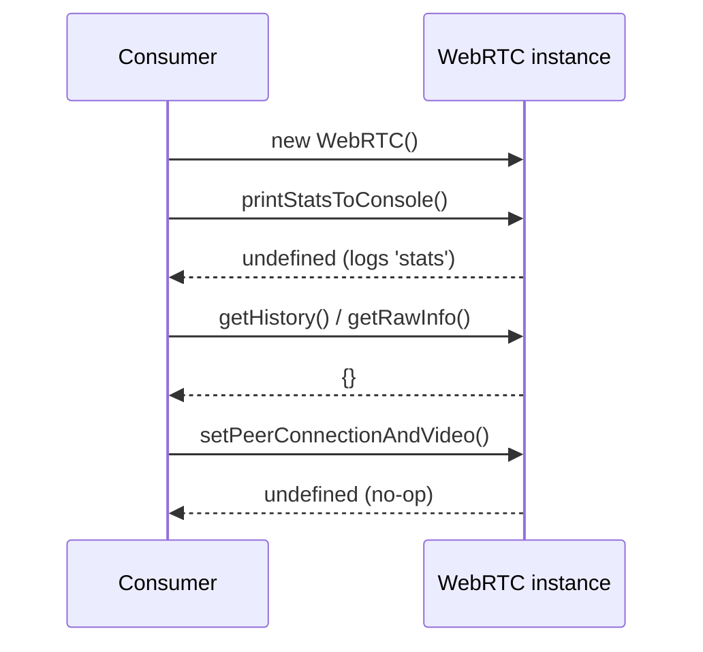
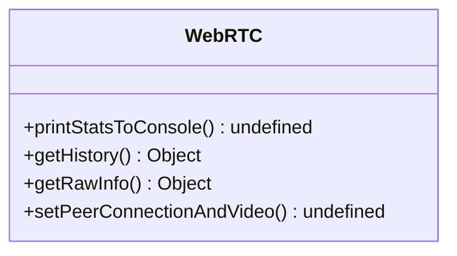

<!-- sdd-generated-metadata
generator: claude-cli
generator_model: us.anthropic.claude-opus-4-8
approved_by: pending-human-review
updated_at: 2026-08-06T00:00:00Z
validation_status: not-run
run_id: 51855eac-8de5-43a2-a3b6-dbcc55ebc91b
-->

# @webex/webrtc — SPEC

> Start here → root [`AGENTS.md`](../../../../AGENTS.md) (agent entry) · router [`SPEC_INDEX.md`](../../../../ai-docs/SPEC_INDEX.md) · system [`ARCHITECTURE.md`](../../../../ai-docs/ARCHITECTURE.md). This is the module's canonical spec: orientation, requirements, design, flows, and tests.
> Context-efficiency: link to canonical docs — don't duplicate them. Load specs on demand per `SPEC_INDEX.md`.

## Metadata

| Field | Value |
|---|---|
| Module id | `webrtc` |
| Source path(s) | `packages/@webex/webrtc/src/` |
| Parent spec | `—` (standalone browser-facing WebRTC wrapper package; no parent module) |
| Doc kind | Module spec |
| Coverage score | Pending coverage assessment |
| Generated from | `module-spec` @ SDLC template library `0.2.2` |
| generated_by / approved_by / updated_at | claude-cli / pending-human-review / 2026-08-06 |
| Validation status | not-run, validator `pending`, assessed 2026-08-06 |

Coverage score is `Pending coverage assessment` until the first coverage review runs. Manifest coverage
state (`Partial`) is authoritative and kept in `.sdd/manifest.json`.

## Evidence Rules
Every requirement cites concrete source evidence using `file path`. Test evidence is preferred for WHY.
Requirements are grounded in the current implementation under `src/` and its build configuration in
`package.json`.

## Source Material Register

| Source material | Scope | Decision | Detail location or disposition |
|---|---|---|---|
| `N/A` | none | none | No pre-existing SDD/AI-docs, architecture, or spec documents were routed to this module; content is derived from source and build config. |

## Overview

`@webex/webrtc` is a small, browser-facing wrapper package intended to expose a place for
WebRTC-related helper APIs used by the Webex JS SDK. The current published surface is a single default
export, the `WebRTC` class in `src/index.js`, whose methods are stubs/placeholders: `printStatsToConsole`
logs a fixed string, and `getHistory`, `getRawInfo`, and `setPeerConnectionAndVideo` are empty/no-op
implementations.

The package documents its intent in its own header comment: "APIs to talk with the browser. This
package could be used by any third-party project." In practice the module is an early scaffold — the
method bodies do not yet implement stats collection, history retrieval, or peer-connection/video setup.
A maintainer should treat `src/index.js` as the single source of truth and expect to flesh out these
methods against real WebRTC `RTCPeerConnection`/stats APIs.

A maintainer should start at `src/index.js`; there are no other source files in the module.

## Purpose / Responsibility

Provides a browser-oriented WebRTC helper surface (the `WebRTC` class) intended to expose peer
connection/video setup and connection-stats/history access to SDK consumers. It does NOT currently own
transport, signaling, media negotiation, or any Webex service integration — the methods are scaffolds
awaiting implementation.

## Stack

JavaScript (Babel legacy build), Node `>=16` engines. Built with `webex-legacy-tools build`
(`-js -ts -maps`) to `./dist`. Browserify transforms `babelify` and `envify` are configured. Style is
checked with ESLint (`eslint ./src/**/*.*`); the `test` script chains style, unit, integration, and
Karma browser tests via `webex-legacy-tools test --integration --runner karma`. Published as an MIT
library (`main: dist/index.js`).

## Folder / Package Structure

```
packages/@webex/webrtc/src/
└── index.js    # `WebRTC` default-export class (stats/history/peer-connection scaffold methods)
```

## Key Files (source of truth)

| File | Holds |
|---|---|
| `packages/@webex/webrtc/src/index.js` | The `WebRTC` class and its complete public method surface (`printStatsToConsole`, `getHistory`, `getRawInfo`, `setPeerConnectionAndVideo`) |
| `packages/@webex/webrtc/package.json` | Build/test scripts, browserify transforms, engines, and the `dist/index.js` published entry |

## Public Surface

Published, imported SDK/code API — the default-exported `WebRTC` class. No network, event-bus, or CLI
surface of its own.

| Contract ID | Type | Surface | Purpose | Compatibility / deprecation | Schema / detail link | Root index |
|---|---|---|---|---|---|---|
| `webrtc.WebRTC` | SDK | `default export class WebRTC` | Container class for browser WebRTC helper methods | Default export; class shape is the semver surface | `packages/@webex/webrtc/src/index.js` | `../../../../ai-docs/CONTRACTS.md` |
| `webrtc.printStatsToConsole` | SDK | `printStatsToConsole(): undefined` | Intended to print connection stats; currently logs a fixed `'stats'` string | Placeholder; behavior expected to change when implemented | `packages/@webex/webrtc/src/index.js` | `../../../../ai-docs/CONTRACTS.md` |
| `webrtc.getHistory` | SDK | `getHistory(): Object` | Intended to return connection history; currently returns `{}` | Placeholder; return shape not yet defined | `packages/@webex/webrtc/src/index.js` | `../../../../ai-docs/CONTRACTS.md` |
| `webrtc.getRawInfo` | SDK | `getRawInfo(): Object` | Intended to return pre-analysis raw info; currently returns `{}` | Placeholder; return shape not yet defined | `packages/@webex/webrtc/src/index.js` | `../../../../ai-docs/CONTRACTS.md` |
| `webrtc.setPeerConnectionAndVideo` | SDK | `setPeerConnectionAndVideo(): undefined` | Intended to set peer connection and video; currently a no-op | Placeholder; a source TODO asks whether to split into `setPeerConnection`/`setVideo` | `packages/@webex/webrtc/src/index.js` | `../../../../ai-docs/CONTRACTS.md` |

Compatibility notes:
- The default `WebRTC` class is the semver surface. Because the methods are placeholders, filling in real
  behavior will change return values and may split `setPeerConnectionAndVideo` (per the in-code TODO);
  treat any such change as a behavior change for consumers.

## Requires (dependencies)

- No runtime `dependencies` are declared in `package.json`.
- Dev/build-only workspace tooling: `@webex/babel-config-legacy`, `@webex/eslint-config-legacy`,
  `@webex/jest-config-legacy`, `@webex/legacy-tools`, and the `@webex/test-helper-*` packages
  (`chai`, `mocha`, `mock-webex`, `test-users`), plus `eslint`/`prettier`.
- Runtime target: a browser environment providing WebRTC APIs (the package's stated purpose is "APIs to
  talk with the browser").

## Requirements

| ID | WHAT | WHY | Source Evidence | Test / Example Evidence | Assumptions / Gaps | Confidence |
|---|---|---|---|---|---|---|
| `WEBRTC-R-001` | The package default-exports a `WebRTC` class exposing `printStatsToConsole`, `getHistory`, `getRawInfo`, and `setPeerConnectionAndVideo`. | Establishes the browser-WebRTC helper surface consumers instantiate. | `packages/@webex/webrtc/src/index.js` | None found in module | Methods are placeholders; no co-located unit tests present | WEAK |
| `WEBRTC-R-002` | `printStatsToConsole()` writes to the console and returns `undefined`. | Provides a stats-printing entry point (currently a fixed `'stats'` log) for debugging connection stats. | `packages/@webex/webrtc/src/index.js` | None found | Real stats collection is not yet implemented | WEAK |
| `WEBRTC-R-003` | `getHistory()` and `getRawInfo()` return an object (currently `{}`). | Reserve accessors for connection history and pre-analysis raw info. | `packages/@webex/webrtc/src/index.js` | None found | Return shapes undefined until implemented | WEAK |
| `WEBRTC-R-004` | `setPeerConnectionAndVideo()` accepts the caller's peer-connection/video setup and returns `undefined`. | Reserve a single entry point for wiring peer connection and video; a TODO questions splitting it. | `packages/@webex/webrtc/src/index.js` | None found | No parameters or body implemented yet | WEAK |

Do not treat these placeholder methods as complete behavior; each requirement is provisional until the
method is implemented and tested.

## Design Overview

The module is a single-file class scaffold. `WebRTC` groups the intended browser WebRTC helper methods
in one default export so consumers have a stable object to instantiate while the concrete behavior is
implemented incrementally. There is no internal decomposition yet: no submodules, no shared state, and
no external calls. The `eslint-disable no-console` at the top of the file signals the intentional console
usage inside `printStatsToConsole`.

## Data Flow

```mermaid
flowchart LR
  Consumer -->|new WebRTC| WebRTC[WebRTC class]
  WebRTC -->|printStatsToConsole| Console[(console.log 'stats')]
  WebRTC -->|getHistory / getRawInfo| Empty[return {}]
  WebRTC -->|setPeerConnectionAndVideo| Noop[no-op]
```

## Sequence Diagram(s)

This is a trivial single-operation-group scaffold module: all methods are direct, synchronous,
no-dependency calls on one class, so a single sequence diagram is sufficient.

Sequence coverage:

| Operation group | Diagram | Failure / recovery coverage |
|---|---|---|
| Direct helper-method calls | 1. WebRTC method invocation | No failure paths — methods are synchronous stubs with no error branches |

### 1. WebRTC method invocation



## Class / Component Relationships



`WebRTC` is a standalone class with no inheritance, composition, or injected dependencies.

## Use Cases

- **UC-1 Instantiate the helper:** a consumer constructs `new WebRTC()` to obtain the helper object.
  Evidence: `packages/@webex/webrtc/src/index.js`.
- **UC-2 Print stats (debug):** a consumer calls `printStatsToConsole()` to emit stats to the console
  (currently a fixed string). Evidence: `packages/@webex/webrtc/src/index.js`.

## Error Handling & Failure Modes

| Condition | Signal (error/code/result) | Caller recovery |
|---|---|---|
| Any method called | none — methods never throw and return `undefined`/`{}` | No recovery needed; results are placeholders |

## Pitfalls

- The methods are **placeholders**: `printStatsToConsole` logs a constant `'stats'`, and
  `getHistory`/`getRawInfo` return empty objects. Do not assume they collect real WebRTC stats/history.
- `setPeerConnectionAndVideo` is a no-op with a TODO asking whether to split into `setPeerConnection` and
  `setVideo`; coordinate that decision before consumers depend on the single-method shape.
- The package is browser-targeted (browserify transforms configured); implementing methods will require
  real `RTCPeerConnection`/stats APIs that are unavailable in a plain Node context.

## Test-Case Strategy (module)

No co-located unit tests exist in the module today; the `test` script wires style, unit, integration, and
Karma browser tiers via `webex-legacy-tools`. When the placeholder methods are implemented, add positive
tests (method returns the implemented value / performs the wiring) and negative tests (invalid
peer-connection/video inputs, stats unavailable) under a browser-capable runner.

| Behavior / Requirement | Existing test evidence | Gap |
|---|---|---|
| `WEBRTC-R-001` | None found | Add a test asserting the class exports the four methods |
| `WEBRTC-R-002` | None found | Add a test for console output once real stats are implemented |
| `WEBRTC-R-003` | None found | Define and assert the history/raw-info return shapes |
| `WEBRTC-R-004` | None found | Add tests once peer-connection/video wiring is implemented |

## Traceability

- Repo architecture: [`ARCHITECTURE.md`](../../../../ai-docs/ARCHITECTURE.md) · Registry: [`SPEC_INDEX.md`](../../../../ai-docs/SPEC_INDEX.md)
- Contracts catalog: [`CONTRACTS.md`](../../../../ai-docs/CONTRACTS.md)
- Coverage state & contracts baseline: `.sdd/manifest.json`
