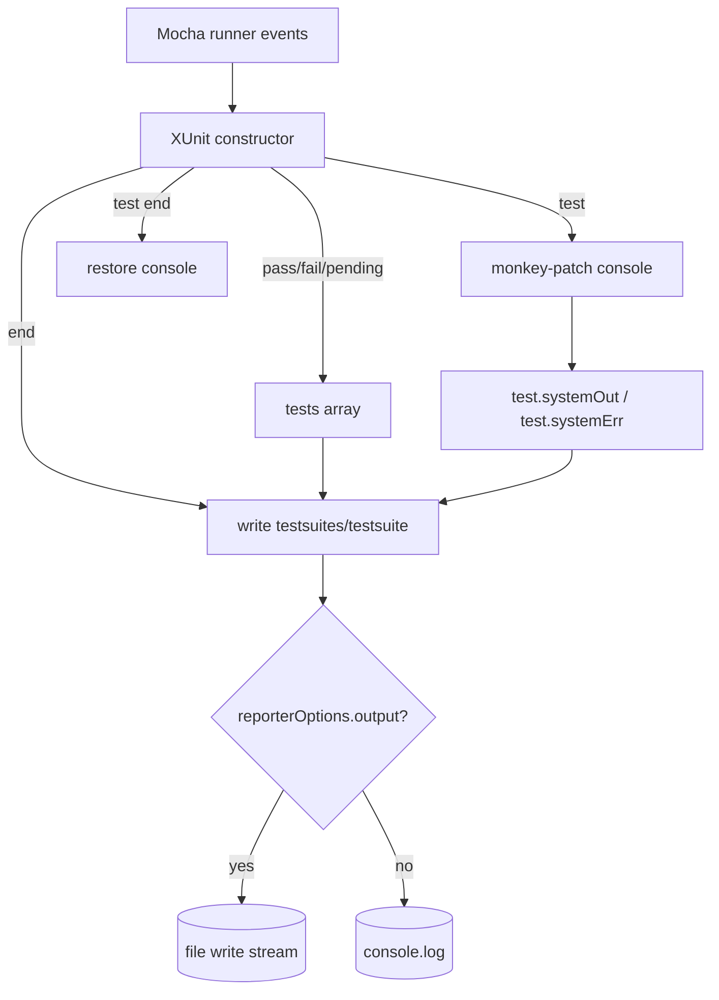
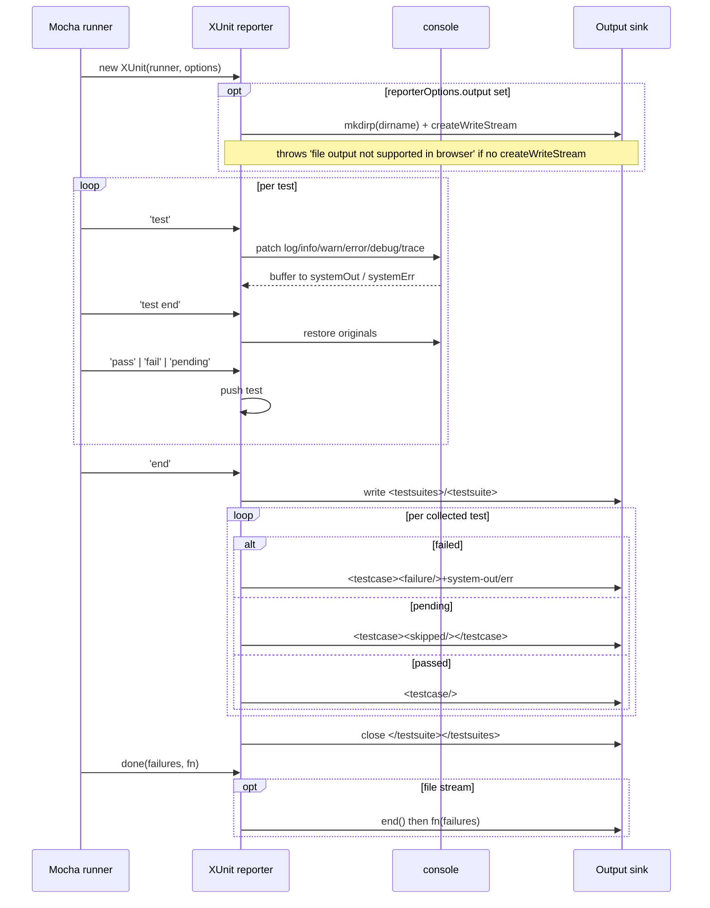
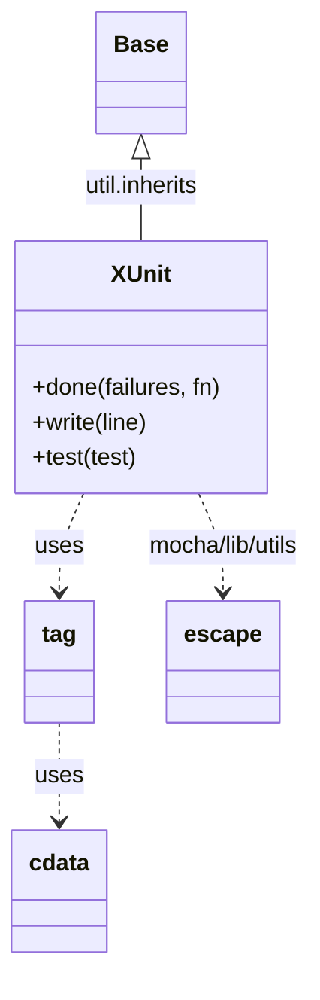

<!-- sdd-generated-metadata
generator: claude-cli
generator_model: us.anthropic.claude-opus-4-8
approved_by: pending-human-review
updated_at: 2026-08-06T00:00:00Z
validation_status: not-run
run_id: 51855eac-8de5-43a2-a3b6-dbcc55ebc91b
-->

# @webex/xunit-with-logs — SPEC

> Start here → root [`AGENTS.md`](../../../../AGENTS.md) (agent entry) · router [`SPEC_INDEX.md`](../../../../ai-docs/SPEC_INDEX.md) · system [`ARCHITECTURE.md`](../../../../ai-docs/ARCHITECTURE.md). This is the module's canonical spec: orientation, requirements, design, flows, and tests.
> Context-efficiency: link to canonical docs — don't duplicate them. Load specs on demand per `SPEC_INDEX.md`.

## Metadata

| Field | Value |
|---|---|
| Module id | `xunit-with-logs` |
| Source path(s) | `packages/@webex/xunit-with-logs/src/` |
| Parent spec | `—` (standalone Mocha reporter package; no parent module) |
| Doc kind | Module spec |
| Coverage score | Pending coverage assessment |
| Generated from | `module-spec` @ SDLC template library `0.2.2` |
| generated_by / approved_by / updated_at | claude-cli / pending-human-review / 2026-08-06 |
| Validation status | not-run, validator `pending`, assessed 2026-08-06 |

Coverage score is `Pending coverage assessment` until the first coverage review runs. Manifest coverage
state (`Partial`) is authoritative and kept in `.sdd/manifest.json`.

## Evidence Rules
Every requirement cites concrete source evidence using `file path`. Test evidence is preferred for WHY.
Requirements are grounded in the current implementation in `src/index.js` and its build configuration.

## Source Material Register

| Source material | Scope | Decision | Detail location or disposition |
|---|---|---|---|
| `N/A` | none | none | No pre-existing SDD/AI-docs, architecture, or spec documents were routed to this module; content is derived from source and build config. |

## Overview

`@webex/xunit-with-logs` is a custom [Mocha](https://mochajs.org/) reporter that produces JUnit/xUnit-style
XML while also capturing per-test console output (`log`/`info`/`warn`/`debug`/`trace` into `system-out`
and `error` into `system-err`). It exists so CI can attach the logs a test emitted directly to the
corresponding `<testcase>` element, making failures easier to diagnose from the CI report alone.

The reporter follows the structure of Mocha's core xUnit reporter (a header comment notes it "attempted
to follow the format of the mocha core xunit reporter"). It subscribes to Mocha `runner` lifecycle
events, temporarily monkey-patches the global `console` methods during each test to buffer output onto
the test object, and on `end` writes `<testsuites>`/`<testsuite>`/`<testcase>` XML — either to a file
stream (when `reporterOptions.output` is set) or to stdout.

A maintainer should start at `src/index.js`, which is the entire module: the `XUnit` constructor wires
the event handlers, and the prototype methods (`done`, `write`, `test`) plus the `tag`/`cdata` helpers
render the XML.

## Purpose / Responsibility

Owns a Mocha reporter that emits xUnit XML with captured per-test stdout/stderr logs. It does NOT run
tests, define assertions, or own log formatting beyond attaching captured console output to test cases.

## Stack

JavaScript (CommonJS, Babel legacy build), Node `>=18` engines. Depends on Mocha's internal
`mocha/lib/reporters/base` and `mocha/lib/utils`. Runtime dependencies: `lodash` (`pick`) and `mkdirp`
(output-directory creation). Built with `webex-legacy-tools build` (`-js -ts -maps`) to `./dist`
(`main: dist/index.js`); style via ESLint; browser tier via `webex-legacy-tools test --integration
--runner karma`.

## Folder / Package Structure

```
packages/@webex/xunit-with-logs/src/
└── index.js    # `XUnit` reporter: runner event wiring, console capture, and XML rendering
```

## Key Files (source of truth)

| File | Holds |
|---|---|
| `packages/@webex/xunit-with-logs/src/index.js` | The `XUnit` reporter constructor, prototype methods (`done`, `write`, `test`), and `tag`/`cdata` XML helpers |
| `packages/@webex/xunit-with-logs/package.json` | `lodash`/`mkdirp` deps, Mocha peer usage, build/test scripts, Node `>=18` engine |

## Public Surface

Published, imported code API — a single CommonJS module export: the `XUnit` reporter constructor Mocha
instantiates. Consumers reference it via Mocha's `--reporter` option, not by calling it directly.

| Contract ID | Type | Surface | Purpose | Compatibility / deprecation | Schema / detail link | Root index |
|---|---|---|---|---|---|---|
| `xunit-with-logs.XUnit` | SDK | `module.exports = XUnit` (`new XUnit(runner, options)`) | Mocha reporter that emits xUnit XML with captured logs | Reporter constructor contract set by Mocha's reporter API | `packages/@webex/xunit-with-logs/src/index.js` | `../../../../ai-docs/CONTRACTS.md` |
| `xunit-with-logs.reporterOptions.output` | SDK | `options.reporterOptions.output` (file path) | When set, writes XML to that file (dirs created via `mkdirp`) instead of stdout | Optional; absence routes output to `console.log` | `packages/@webex/xunit-with-logs/src/index.js` | `../../../../ai-docs/CONTRACTS.md` |

Compatibility notes:
- The module is consumed as a Mocha reporter; the `(runner, options)` constructor signature and
  `reporterOptions.output` follow Mocha's reporter contract. Changing the emitted XML element/attribute
  shape is a consumer-visible change for CI systems parsing the output.

## Requires (dependencies)

- `lodash` (`^4.17.21`) — `pick(console, logMethodNames)` snapshots the original console methods for
  restore.
- `mkdirp` (`^0.5.1`) — creates the output file's parent directory before opening the write stream.
- `mocha` (peer, `10.0` dev-pinned) — provides `mocha/lib/reporters/base` (`Base`), `mocha/lib/utils`
  (`escape`), and the `runner` event lifecycle this reporter subscribes to.
- Node core: `util` (`inherits`), `fs` (`createWriteStream`), `path` (`dirname`/`relative`).

## Requirements

| ID | WHAT | WHY | Source Evidence | Test / Example Evidence | Assumptions / Gaps | Confidence |
|---|---|---|---|---|---|---|
| `XUNIT-R-001` | `XUnit` inherits from Mocha's `Base` reporter and subscribes to `pending`, `pass`, `fail`, `test`, `test end`, and `end` runner events. | Standard Mocha reporter lifecycle needed to collect results and emit the final report. | `packages/@webex/xunit-with-logs/src/index.js` | None found in module | none identified | PRESENT |
| `XUNIT-R-002` | During each test, the reporter monkey-patches `console` methods (`error`,`warn`,`log`,`info`,`debug`,`trace`), buffering `error` output onto `test.systemErr` and all other levels onto `test.systemOut`, then restores the originals on `test end`. | Attaches the logs a test produced to that test's report entry for CI diagnostics. | `packages/@webex/xunit-with-logs/src/index.js` | None found | Missing console methods fall back to `log`; caller file/line are derived from a stack trace | PRESENT |
| `XUNIT-R-003` | On `end`, the reporter writes `<testsuites>` and a `<testsuite>` tag with `tests`/`failures`/`errors`/`skipped`/`timestamp`/`time` attributes derived from Mocha `stats`, then one `<testcase>` per collected test. | Produces valid xUnit/JUnit XML that CI systems ingest. | `packages/@webex/xunit-with-logs/src/index.js` | None found | `errors` is set equal to `failures`; `skipped` = tests − failures − passes | PRESENT |
| `XUNIT-R-004` | Failed tests emit a `<failure>` element (escaped message + stack) plus `system-out`/`system-err`; pending tests emit `<skipped/>`; passing tests emit a self-closing `<testcase/>`. | Encodes per-test outcome and captured logs into the XML entry. | `packages/@webex/xunit-with-logs/src/index.js` | None found | CDATA-wraps captured output; uses Mocha `escape` for attributes | PRESENT |
| `XUNIT-R-005` | When `reporterOptions.output` is provided, output is written to a file stream (parent dir created via `mkdirp`) and `done()` closes the stream before invoking Mocha's callback; otherwise lines are written to `console.log`. | Supports both file-based CI artifacts and stdout reporting; guards against browser environments lacking `fs.createWriteStream`. | `packages/@webex/xunit-with-logs/src/index.js` | None found | Throws `file output not supported in browser` when `fs.createWriteStream` is absent | PRESENT |

## Design Overview

The reporter is a single constructor function, `XUnit`, that `util.inherits` from Mocha's `Base`. In the
constructor it decides its output sink (a `fs.createWriteStream` to `reporterOptions.output`, else
stdout) and registers runner listeners: `pending`/`pass`/`fail` push tests into a local `tests` array;
`test` installs console interceptors; `test end` restores them; `end` renders the XML.

The console-capture trick snapshots the original methods with lodash `pick`, then replaces each level
with a wrapper that (a) forwards to the original method, (b) derives caller `FILE:`/`LINE:` from
`new Error().stack`, and (c) appends the formatted args to `test.systemErr` (for `error`) or
`test.systemOut` (for everything else, prefixed with the uppercased level). Restoring on `test end`
prevents leaking the patched console into later tests.

Rendering is delegated to prototype methods and free helpers: `write` sends a line to the stream or
`console.log`; `test` builds the per-case attributes and chooses `<failure>`, `<skipped/>`, or a
self-closing case; `tag(name, attrs, close, content)` builds an element with escaped attributes and
optional CDATA content via `cdata`. `done` closes the file stream (if any) before calling back.

## Data Flow



## Sequence Diagram(s)

This module has one operation group: consume a Mocha run and emit a report. The console-capture and
output-sink branches are shown as `alt`/`opt` within the single sequence.

Sequence coverage:

| Operation group | Diagram | Failure / recovery coverage |
|---|---|---|
| Reporter run lifecycle | 1. Mocha run → xUnit report | `alt` shows failed vs pending vs passing case rendering; `opt` shows file-stream vs stdout sink and the browser-unsupported throw |

### 1. Mocha run → xUnit report



## Class / Component Relationships



`XUnit` inherits Mocha's `Base`; the free functions `tag` and `cdata` render XML, and Mocha's `escape`
sanitizes attributes/content.

## Use Cases

- **UC-1 File-based CI report:** run Mocha with `--reporter @webex/xunit-with-logs` and
  `--reporter-options output=results.xml`; the reporter creates the directory, streams XML to the file,
  and closes it on `done`. Evidence: `packages/@webex/xunit-with-logs/src/index.js`.
- **UC-2 Stdout report with captured logs:** run without `output`; XML is written to `console.log`, and
  each failing/ passing case carries the `system-out`/`system-err` logs emitted during that test.
  Evidence: `packages/@webex/xunit-with-logs/src/index.js`.

## Concurrency & Reactive Flow

The reporter is event-driven off Mocha's single-threaded runner. It relies on Mocha emitting `test` →
(test body) → `test end` sequentially, so the console monkey-patch installed on `test` is safely
restored on `test end` before the next test. If tests ran truly concurrently, the shared global
`console` patch would interleave output; the design assumes Mocha's serial test lifecycle.

## Error Handling & Failure Modes

| Condition | Signal (error/code/result) | Caller recovery |
|---|---|---|
| `reporterOptions.output` set but `fs.createWriteStream` unavailable (e.g. browser) | throws `Error('file output not supported in browser')` | Omit `output` to report to stdout, or run in Node |
| Test fails | `<failure>` element with escaped message + stack in the XML | CI parses failure text; no reporter-side recovery |
| Console method missing on the platform | falls back to patching `log` | Transparent; output still captured under `log` |

## Pitfalls

- The reporter **monkey-patches the global `console`** for the duration of each test. If a test spawns
  async work that logs after `test end`, that output is lost or attributed to the wrong test because the
  originals have been restored.
- Caller `FILE:`/`LINE:` are parsed from `new Error().stack.split('\n')[2]`; stack-format differences
  across Node versions can make this brittle, and `path.relative(__dirname, '..', callerInfo[1])` passes
  three args to a two-arg function (extra arg ignored) — treat the derived file path as best-effort.
- `errors` is emitted equal to `failures`, and `skipped` is computed as `tests - failures - passes`;
  consumers should not read `errors` as a distinct error count.

## Test-Case Strategy (module)

No co-located unit tests exist in the module today; `test` chains style/unit/integration/Karma tiers via
`webex-legacy-tools`. Recommended coverage: given a stubbed Mocha `runner`, assert that (positive) a
passing run emits a self-closing `<testcase/>` and a failing run emits a `<failure>` with escaped
message; (negative) that setting `output` in an environment without `createWriteStream` throws the
browser error; and that captured `console.log`/`console.error` land in `system-out`/`system-err`
respectively and the console is restored after `test end`.

| Behavior / Requirement | Existing test evidence | Gap |
|---|---|---|
| `XUNIT-R-001` | None found | Add a stubbed-runner test asserting all six events are handled |
| `XUNIT-R-002` | None found | Assert console capture/restore and system-out/err routing |
| `XUNIT-R-003` | None found | Assert testsuite attribute computation from stats |
| `XUNIT-R-004` | None found | Assert failure/skipped/passing case rendering |
| `XUNIT-R-005` | None found | Assert file-stream vs stdout sink and the browser throw |

## Traceability

- Repo architecture: [`ARCHITECTURE.md`](../../../../ai-docs/ARCHITECTURE.md) · Registry: [`SPEC_INDEX.md`](../../../../ai-docs/SPEC_INDEX.md)
- Contracts catalog: [`CONTRACTS.md`](../../../../ai-docs/CONTRACTS.md)
- Coverage state & contracts baseline: `.sdd/manifest.json`
